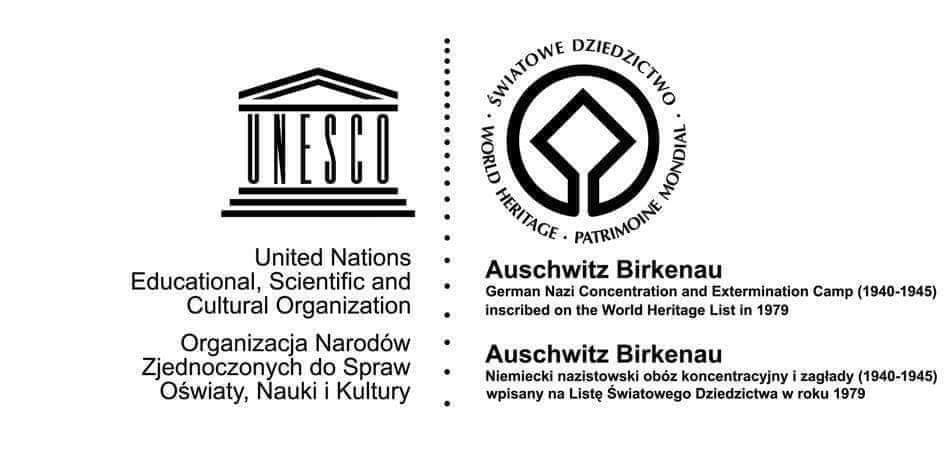
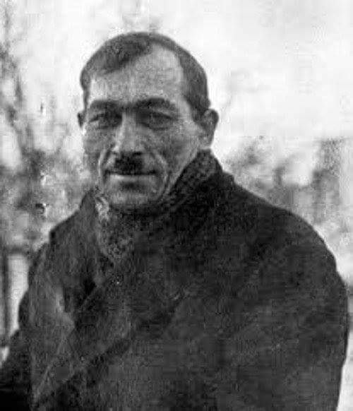

### 2022

Ta cała narracja z bankructwem Rosji to  gra medialna pod krach na giełdzie zachodniej, w końcu trzeba będzie to jakoś wytłumaczyć. Rosja ma surowce przemysłowe i monetarne oraz minimalny dług, jest najdalej od bankructwa.

  

Dziś w nocy Rosja formalnie zbankrutowała. Właśnie minął ostateczny termin spłacenia części ich międzynarodowego długu. Rosjanie nie widzą problemu, bo twierdzą, że mają 100 mln USD na uregulowanie długu, ale nie mogą tego zrobić przez sankcje. Rosja, jak każde państwo-bankrut, zostanie odcięta od międzynarodowego rynku długu. Po prostu nikt im nie pożyczy pieniędzy.

Problem w tym, że przez sankcje już są odcięci, więc w praktyce niewiele to zmienia. Sami Rosjanie twierdzą, że wcale nie zbankrutowali, bo przesłali należne 100 mln dolarów do Euroclear, ale ten zablokował transakcję właśnie przez sankcje. Więc zdaniem ich ministra finansów wszystko jest OK.
Twierdzi on, że i tak nie potrzebują więcej pożyczać, bo z powodzeniem utrzymują się ze sprzedaży ropy i gazu.

To nie jest pierwsze bankructwo w historii Rosji. Jedno miało miejsce w efekcie rewolucji bolszewickiej w 1917 roku.

Całkiem niedawno, bo w 1998 Rosja również miała ogromne problemy finansowe. Z tą różnicą, że wtedy ropa była po $11 za baryłkę, a dziś jest po $110.

W skrócie: nie mam i co mi zrobisz?

---

  

---

<video width="640" height="480" controls>
<source src="./movies/june/brics.mp4" type="video/mp4">
Your browser does not support the video tag.
</video>

<video width="640" height="480" controls>
<source src="./movies/june/cbdc.mp4" type="video/mp4">
Your browser does not support the video tag.
</video>

### 2020

  

Shell obcina dywidendę.

Niedźwiecki odchodzi z Trójki.

### 2007 roku Komitet Światowego Dziedzictwa UNESCO w Nowej Zelandii podjął decyzję o zmianie nazwy obozu koncentracyjnego Auschwitz na liście Światowego Dziedzictwa UNESCO. Pierwotna nazwa brzmiała dość ogólnie: „Obóz koncentracyjny Auschwitz”. Wybrano nową nazwę, która nie pozostawiała złudzeń: „Auschwitz-Birkenau. Niemiecki nazistowski obóz koncentracyjny i zagłady (1940-1945)”.

Podczas posiedzenia Komitet Światowego Dziedzictwa przyjął Orzeczenie Znaczenia miejsca o następującej treści:
,,Obóz Auschwitz-Birkenau był głównym i najbardziej znanym z sześciu obozów koncentracyjnych i zagłady założonych przez nazistowskie Niemcy w celu realizacji polityki ostatecznego rozwiązania, która miała na celu masowe wymordowanie Żydów europejskich. Został on zbudowany w okupowanej przez Niemców Polsce, początkowo jako obóz koncentracyjny dla Polaków, później także dla jeńców radzieckich, a następnie również dla więźniów wielu innych narodowości. W latach 1942–1944 stał się on głównym obozem masowej zagłady, gdzie torturowano i zabijano Żydów za ich tzw. pochodzenie rasowe. Obok ponad miliona zgładzonych masowo żydowskich mężczyzn, kobiet i dzieci oraz kilkudziesięciu tysięcy Polaków, w Auschwitz zamordowano również z przyczyn rasowych tysiące Romów i Sinti, a także więźniów z innych państw Europy.

Źródłem nazistowskiej polityki ograbiania, degradacji i eksterminacji Żydów była rasistowska i antysemicka ideologia propagowana przez III Rzeszę.Obóz Auschwitz-Birkenau, służący zarówno eksterminacji, jak i pracy przymusowej, był największym ze stworzonych przez niemiecki reżim hitlerowski kompleksów obozów koncentracyjnych. Położone w centrum ogromnego krajobrazu wyzysku i cierpienia ludzkiego, pozostałości obozów Auschwitz I i Auschwitz II-Birkenau wraz z otaczającą je Strefą Ochronną wpisane zostały na Listę Światowego Dziedzictwa jako dowód nieludzkiej, okrutnej i metodycznej próby odmówienia prawa do godności ludzkiej grupom uznanym za podludzi, która doprowadziła do ich systematycznego mordowania. Obozy te są dobitnym świadectwem morderczego charakteru antysemickiej i rasistowskiej polityki nazistów, która spowodowała unicestwienie w krematoriach ponad 1,2 mln ludzi, z czego 90% stanowili Żydzi.

Ogrodzenia, druty kolczaste, bocznice kolejowe, perony, baraki, szubienice, komory gazowe i krematoria obozu Auschwitz-Birkenau pokazują w sposób jednoznaczny, jak przebiegał Holokaust i realizowana przez nazistowskie Niemcy polityka masowych mordów i pracy przymusowej. Zbiory zgromadzone na terenie miejsca przechowują pamięć o tych, których z premedytacją mordowano, i obrazują systematyczny mechanizm, za pomocą którego się to odbywało. Przedmioty osobiste znajdujące się w zbiorach stanowią świadectwo życia ofiar przed przywiezieniem do obozów zagłady, a także świadectwo cynizmu, z jakim wykorzystywany był ich dobytek oraz szczątki ich samych. Ze względu na staranną konserwację oryginalnych dowodów, przeprowadzoną bez zbędnych rekonstrukcji, miejsce oraz jego otoczenie cechuje wysoki poziom autentyzmu i integralności.

Kryterium 6 – (obiekt powinien) łączyć się w sposób bezpośredni lub namacalny z wydarzeniami lub tradycjami żywymi, z ideami, wierzeniami, z dziełami artystycznymi lub literackimi mającymi Wyjątkową Uniwersalną Wartość.

Auschwitz-Birkenau, pomnik ludobójstwa Żydów dokonanego z premedytacją przez reżim nazistowski (Niemcy 1933–1945) oraz śmierci niezliczonej rzeszy innych osób, to niezbity dowód jednego z największych przestępstw, jakich kiedykolwiek dopuszczono się przeciwko ludzkości. To również pomnik siły ludzkiego ducha, który pomimo poddania przerażającej próbie, nie ugiął się wobec działań niemieckiego reżimu nazistowskiego, zmierzających do pozbawienia wolności i ograniczenia wolnej myśli oraz do starcia z powierzchni ziemi całych ras. Miejsce to jest dla całego rodzaju ludzkiego centralnym miejscem pamięci o Holokauście, polityce rasizmu i barbarzyństwie; to miejsce naszej zbiorowej pamięci o mrocznym rozdziale w historii ludzkości; miejsce, w którym pamięć przekazywana jest młodszym pokoleniom; miejsce stanowiące znak ostrzegający przed wieloma zagrożeniami i tragicznymi konsekwencjami wynikającymi z radykalnych ideologii i odmowy prawa do godności ludzkiej.

Powyższe Orzeczenie Znaczenia określa Wyjątkową Uniwersalną Wartość tego miejsca i powinno stanowić podstawę dla wszystkich przyszłych decyzji i działań związanych z zarządzaniem dotyczących miejsca Światowego Dziedzictwa.

W oparciu o Orzeczenie Znaczenia miejsca Światowego Dziedzictwa Komitet zatwierdził zmianę jego nazwy na następującą: Auschwitz Birkenau: niemiecki nazistowski obóz koncentracyjny i zagłady (1940–1945).'

  

### 1899

W Zawadach w województwie mazowieckim urodził się Piotr Śmietański (zdjęcie) - polski kat okresu stalinowskiego, funkcjonariusz Wojewódzkiego Urzędu Bezpieczeństwa Publicznego w Warszawie w stopniu sierżanta, dowódca plutonu egzekucyjnego w więzieniu na Mokotowie, wykonawca wyroków śmierci między innymi na pułkowniku Hieronimie Dekutowskim oraz rotmistrzu Witoldzie Pileckim.
W młodości był uczestnikiem wojny polsko-bolszewickiej w 1920 roku. Ukończył zaledwie cztery klasy szkoły podstawowej. W okresie międzywojennym wstąpił w szeregi polskich komunistów, z którymi po jakimś czasie, ze względu na kary za działalność komunistyczną, musiał ograniczyć kontakty. Założył rodzinę i przyuczył się do zawodu hydraulika. Na powrót do partii komunistycznej zdecydował się w roku 1943, kiedy wstąpił do Polskiej Partii Robotniczej. Dwa lata później podjął pracę w warszawskiej bezpiece, gdzie początkowo pracował na stanowisku referenta, oddziałowego, a następnie agenta.
Miał naturalną skłonność do sadyzmu, na którą przymykali oczy jego przełożeni z mokotowskiego więzienia, a którą wykorzystali później, zatrudniając go, jako kata. Jego ulubioną metodą zabijania był strzał w tył głowy. Za wykonany na Pileckim wyrok zainkasował kwotę 10 tysięcy złotych.
Niewiele wiadomo na temat jego dalszych losów. Według jednej z wersji, w roku 1949 zachorował na gruźlicę i został wysłany na urlop. Choroba okazała się śmiertelna - Śmietański zmarł w sanatorium MBP w Korczakowie na Dolnym Śląsku 23 lutego 1950 roku. Pochowano go na Cmentarzu Bródnowskim w Warszawie, w miejcu, w którym nie dane było spocząć tym, którzy zginęli z jego rąk.

  

### 1709

https://pl.wikipedia.org/wiki/Bitwa_pod_Po%C5%82taw%C4%85 mróz pokonał Szwedów z Rosją, po tej bitwie Rosja zaczęła dominować na wschodzie - również w Polsce

---

<a href="https://github.com/TomaszWaszczyk/historia.waszczyk.com/edit/master/src/content/june-27.md" target="_blank">Edytuj tę stronę dzieląc się własnymi notatkami!</a>
