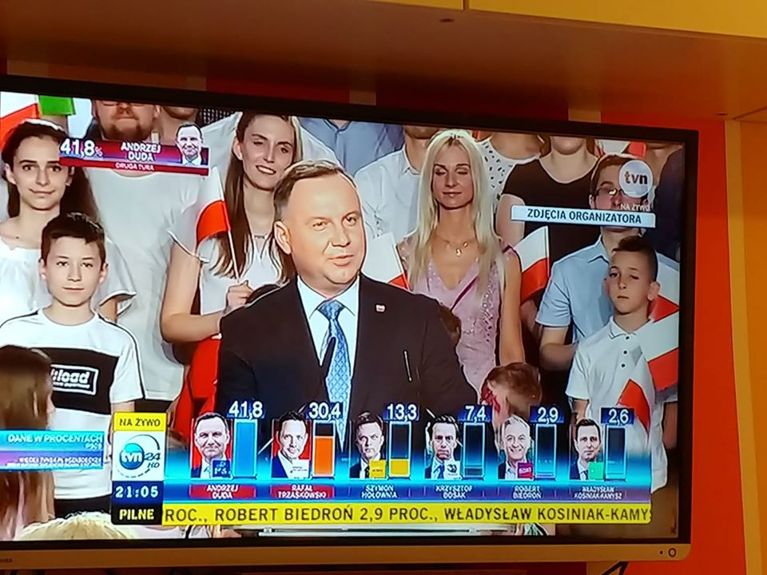
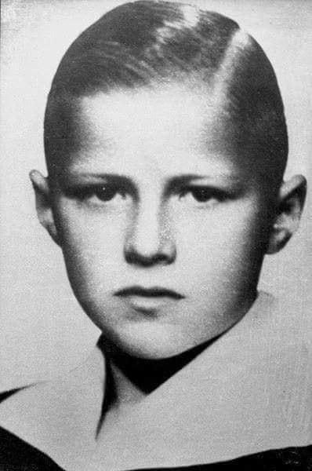
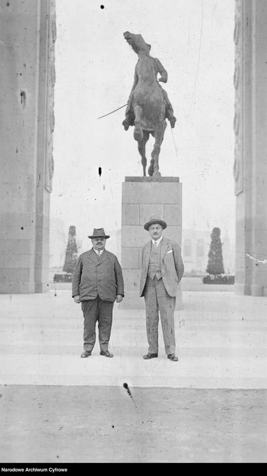
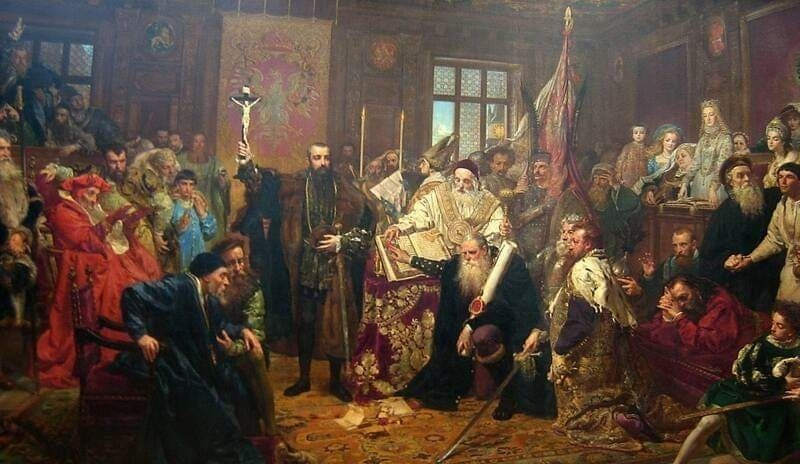

### 2020

  

---

Uniwersytet Princeton usuwa nazwisko prezydenta Wilsona z nazwy wydziału. Powodem takiej decyzji Uniwersytetu Princeton są rasistowskie decyzje podejmowane przez tego polityka. Woodrow Wilson był prezydentem USA w latach 1913-1921.

### 2000

W Krakowie zmarł Józef Tischner - prezbiter katolicki i filozof, autor dzieł m.in. Etyki Solidarności, Historii filozofii po góralsku. Dziekan Wydziału Filozoficznego PAT, dyrektor wiedeńskiego Instytutu Nauk o Człowieku, wykładowca PWST w Krakowie. Kapelan Związku Podhalan oraz Solidarności. Piewca góralszczyzny. Kawaler Orderu Orła Białego. Pochowany został 2 lipca w Łopusznej.

,,Dzieciństwo i młodość (1931-1949)

Ks. Józef Tischner urodził się 12 marca 1931 roku w Starym Sączu i został ochrzczony 2 kwietnia tegoż roku w starosądeckim kościele parafialnym (otrzymał imiona Józef Stanisław). Rodzice byli nauczycielami: ojciec – Józef – pochodził z Sącza, matka – Weronika z Chowańców – z Jurgowa. Dzieciństwo i młodość spędził w Łopusznej, gdzie ojciec otrzymał w 1932 roku posadę kierownika szkoły. Rodzina Tischnerów mieszkała w (nieistniejącym już dziś) budynku szkolnym; to dlatego w późniejszych latach autor „Historii filozofii po góralsku” podpisywał się niekiedy: „Józek Szkolny”. Jego dzieciństwo było szczęśliwe: żył życiem dziecka wiejskiego, jak jego rówieśnicy, a zarazem inteligenckiego – z domu wyniósł szacunek dla literatury i pracy intelektualnej. Wakacje spędzał w Starym Sączu i Jurgowie. W 1936 roku przyszedł na świat drugi syn Tischnerów, Marian. W czasie wojny Tischnerowie musieli na kilka lat opuścić Łopuszną. Przez pewien czas mieszkali w Rabie Wyżnej, a w 1942 roku ojciec został skierowany do pracy w szkole powszechnej w Rogoźniku. Tam doczekali wyzwolenia. W 1945 wrócili do Łopusznej, gdzie pozostali aż do przejścia na emeryturę; rok później przyszedł na świat ich trzeci syn, Kazimierz. W tym czasie najstarszy z synów był już uczniem gimnazjum w Nowym Targu. W 1949 zdał tzw. dużą maturę i, zgodnie z wolą ojca, złożył papiery na Wydział Prawa Uniwersytetu Jagiellońskiego, mimo iż wcześniej podjął decyzję, że zostanie księdzem. Po zaliczeniu pierwszego roku prawa, w maju 1950 zapukał do bramy seminarium duchownego przy ul. Podzamcze w Krakowie. Pozostał studentem UJ – ale już na Wydziale Teologicznym.

Wybór drogi (1950-1969)

Józef Tischner studiował teologię w najtrudniejszym dla Kościoła okresie w powojennej historii Polski. Na lata jego studiów przypada m.in. głośny proces księży z kurii krakowskiej, uwięzienie Prymasa i internowanie arcybiskupa Eugeniusza Baziaka oraz usunięcie wydziałów teologicznych z uniwersytetów. Tischner postanowił poświęcić się nauce. Pod wpływem ks. prof. Kazimierza Kłósaka rozwijał swe zainteresowania filozoficzne, interesując się szczególnie filozofią niemiecką. Wzorem duszpasterza był mu ks. prefekt Jan Pietraszko, późniejszy biskup. Na ostatnim roku miał wykłady z etyki społecznej z ks. doktorem Karolem Wojtyłą. Święcenia kapłańskie przyjął 26 czerwca 1955 roku w katedrze wawelskiej z rąk biskupa Franciszka Jopa. Zachęcony przez ks. Kłósaka podjął studia na Wydziale Filozofii Chrześcijańskiej Akademii Teologii Katolickiej w Warszawie (1955-1957). Po odwilży październikowej – i powrocie do Krakowa w związku z przywróceniem nauki religii w szkołach – kontynuował je na Wydziale Historyczno-Filozoficznym UJ (1957-1959). Zajmował się w tym czasie głównie filozofią Edmunda Husserla. Równocześnie pracował jako wikariusz i katecheta w parafii św. Mikołaja w Chrzanowie (1957-1959) i parafii św. Kazimierza w Krakowie (1959-1963). W 1963 obronił doktorat u prof. Romana Ingardena na UJ. Wraz z uzyskaniem stopnia naukowego rozpoczął wykłady z filozofii w Wyższym Seminarium Duchownym (później – Papieskim Wydziale Teologicznym, a od 1981 – Papieskiej Akademii Teologicznej) w Krakowie. W połowie lat 60. podjął współpracę z „Tygodnikiem Powszechnym” i miesięcznikiem „Znak”, z którymi pozostał związany do końca życia. W 1965 przeprowadził się z wikarówki parafii św. Kazimierza do domu księży profesorów przy ul. św. Marka 10, gdzie mieszkał do lat 90.

Filozof i duszpasterz (1970-1979)

Lata 70. były dlań okresem intensywnej pracy duszpasterskiej. Odprawiał w tym czasie w kościele św. Marka słynne msze dla przedszkolaków, podczas których wprowadził zwyczaj dialogowanych homilii i pozwalał dzieciom przynosić do kościoła ulubione zabawki. Pełnił też obowiązki duszpasterza krakowskiej inteligencji, którą gromadziły jego popularne „trzynastki”, odprawiane w kościele św. Anny. Współpracował z wieloma środowiskami: lekarzami (szczególnie psychiatrami; przyjaźnił się z Antonim Kępińskim), uczonymi, artystami. Był cenionym rekolekcjonistą i wykładowcą. W 1974 roku habilitował się na ATK na podstawie pracy „Fenomenologia świadomości egotycznej”. W drugiej połowie lat 70. włączył się w ruch niezależnych inicjatyw kulturalnych (m.in. tzw. Uniwersytetu Latającego). W tym czasie napisał szereg ważnych artykułów, m.in. obszerny esej „Schyłek chrześcijaństwa tomistycznego”, który stał się zarzewiem polemik znanych pod nazwą „sporu z tomizmem”. Tischner wystąpił przeciwko dominacji jednego modelu filozofii (arystotelesowsko-tomistycznego) w interpretacji doktryny chrześcijańskiej; dowodził, że współczesna filozofia, zwłaszcza filozofia wartości, ma chrześcijaństwu do zaproponowania równie interesujące perspektywy. W 1975 roku ukazała się jego pierwsza książka Świat ludzkiej nadziei. W drugiej połowie lat 70. rozpoczął pracę nad kolejną – Polski kształt dialogu – którą poświęcił zderzeniu chrześcijaństwa z marksizmem.

Kapelan „Solidarności” (1980-1989)

Z ruchem „Solidarności” związał się od początku jego powstania; 19 października 1980 wygłosił w katedrze wawelskiej głośną homilię do przywódców nowo powstałego związku (Solidarność sumień), która dała początek opublikowanej rok później Etyce solidarności. W 1981 był gościem I Ogólnopolskiego Zjazdu Delegatów „Solidarności” w Gdańsku. Wraz z działaczami NSZZ „Solidarność” Rolników Indywidualnych organizował w latach 80. pomoc dla Podhala (sprowadzanie maszyn rolniczych z Austrii, organizowanie wyjazdów na praktyki gospodarskie). Jako kapelan Związku Podhalan zainicjował tradycję sierpniowych mszy świętych w intencji ojczyzny w kaplicy pod Turbaczem (od 1982), na które przybywali pielgrzymi z całej Polski. Równocześnie od 1980 roku wykładał filozofię dramatu w Państwowej Wyższej Szkole Teatralnej w Krakowie oraz na Wydziale Filologicznym UJ (wykłady monograficzne wygłaszane w latach 80. i 90. w Collegium Witkowskiego UJ – co wtorek o godzinie 18 – przyciągały tłumy słuchaczy). Współtworzył też Wydział Filozoficzny PAT (1981), pełnił funkcję jego dziekana, a od 1985 był profesorem nadzwyczajnym tej uczelni. Wybrany na rektora PAT, odmówił przyjęcia tej funkcji, pragnąc nadal zajmować się pracą naukową i duszpasterską. Wraz z filozofami Hansem-Georgiem Gadamerem i Krzysztofem Michalskim współtworzył Instytutu Nauk o Człowieku w Wiedniu (1981), wielokrotnie też uczestniczył w organizowanych przez tę instytucję spotkaniach intelektualistów z Janem Pawłem II w Castel Gandolfo. Po zamachu na Papieża w maju 1981 roku ks. Tischner po raz pierwszy został zaproszony do polskiej telewizji – wygłosił komentarz do tego wydarzenia. W latach 80. ukazały się kolejne książki Tischnera, m.in. Myślenie według wartości (1982) i Polska jest Ojczyzną. W kręgu filozofii pracy (1985). Zwieńczeniem pracy naukowej prowadzonej w tym okresie była opublikowana w 1990 roku
Filozofia dramatu.

Nauczyciel wolności i nadziei (1990-2000)

Lata 90. to okres, w którym Tischner zbiera owoce swoich wcześniejszych zaangażowań i jednocześnie zdobywa ogromna popularność w całej Polsce. Staje się autorytetem nie tylko w sprawach wiary czy filozofii, ale i rodzącej się demokracji, choć on sam stara się przede wszystkim mówić o wolności i relacjach Kościół–państwo. Wyrazem uznania są m.in. doktoraty honorowe Uniwersytetu Łódzkiego i Wyższej Szkoły Pedagogicznej w Krakowie, a także nagrody: im. Jurzykowskiego (1988), im. S. Kisielewskiego (1993) i im. K. Pruszyńskiego (1993). W 1999 roku zostaje kawalerem Orderu Orła Białego. Dużo w tym czasie publikuje, głównie zbiory szkiców i esejów poświęconych problematyce filozoficznej, społecznej i religijnej (Nieszczęsny dar wolności, 1993; Spowiedź rewolucjonisty. Czytając Fenomenologię ducha Hegla, 1993; W krainie schorowanej wyobraźni, 1997; Ksiądz na manowcach, 1999) oraz tomy rozmów (Między Panem a Plebanem – wraz z A. Michnikiem i J. Żakowskim, 1995; Tischner czyta Katechizm – wraz z J. Żakowskim, 1996; Przekonać Pana Boga – wraz z D. Zańko i J. Gowinem, 1999). W 1998 ukazuje się kontynuacja Filozofii dramatu – Spór o istnienie człowieka. Wielkim powodzeniem wśród czytelników cieszą się pisane stylizowaną gwarą podhalańską gawędy filozoficzne Historia filozofii po góralsku (1997). Szeroką popularność przyniosły Tischnerowi także audycje radiowe (m.in. Rozmowy bez pointy z J. Gowinem na antenie Radia Kraków oraz czytana tamże Historia filozofii po góralsku) i programy telewizyjne. Wśród tych ostatnich na uwagę zasługują zwłaszcza cykle Siedem grzechów głównych po góralsku (1995), którego był współscenarzystą, oraz Tischner czyta Katechizm (1996) – rozmowy prowadzone z Jackiem Żakowskim. W ostatnich latach życia ks. Tischner ciężko zachorował na raka krtani. Kolejne operacje i postępy choroby pozbawiły go możliwości mówienia. Mimo to prawie do ostatniej chwili wciąż pisał; z tego czasu pochodzą przejmujące teksty o Bożym Miłosierdziu oraz niewielka książeczka pt. Pomoc w rachunku sumienia.''

### 1956

W Poznaniu w czasie szturmu robotników na gmach Komitetu do spraw Bezpieczeństwa Publicznego zabity został 13-letni Romek Strzałkowski (zdjęcie).
Był absolwentem Państwowej Szkoły Muzycznej I stopnia imienia Karola Kurpińskiego w Poznaniu.
Okoliczności jego śmierci to splot wielu kontrowersji i niejasności. Według jednej z wersji, chłopiec zginął podczas demonstracji, w chwili, gdy przejął flagę od rannej tramwajarki Heleny Przybyłek. Inna wersja mówi o tym, że został zabity na terenia bazy transportowej Urzędu Bezpieczeństwa. Trzecia wersja, najbardziej wiarygodna, to zabicie go strzałem z pistoletu na terenie ubeckiej dyspozytorni przez funjcjonariuszkę o pseudonimie Teofila Kowal. Została ona zatrzymana w tym miejcu, a w jej torebce znaleziono pistolet. Jednak i ta wersja nie jest do końca wiarygodna, ponieważ w trakcie śledztwa kobieta wiele razy zmieniała zeznania. Po pewnym czasie Prokuratura Wojewódzka w Poznaniu umorzyła postępowanie w sprawie Kowal i śmierci Strzałkowskiego. Nie pomogły prośby o wznowienie postępowania, kierowane przez rodziców nawet do samego Gomułki.
Pogrzeb Romka Strzałkowskiego odbył się 2 lipca 1956 r. na cmentarzu junikowskim o godzinie 17.00. Oficjalnie jednak informacje te zostały zmodyfikowane. 1 lipca ukazał się Głos Wielkopolski , w którym zmieniono godzinę pochówku na 8:00, pomijając fakt, iż zmarły był uczniem Szkoły Podstawowej nr 40 w Poznaniu. Dodatkowo zniekształcono cyfry określające wiek. Cyfrę 3 można było odczytać jako 8 (Romek zmarł w wieku trzynastu lat). Fakt ten tłumaczono jako nieumyślny błąd w korekcie.

  

### 1930

Międzynarodowy Zjazd Fabrykantów Kakao i Czekolady, z prawej Jan Wedel. Z jednego z takich wyjazdów do Francji właściciel E. Wedel przywozi pomysł na mleczną piankę oblaną czekoladą. „-Jakbyście mieli już wszystko – szczęśliwą rodzinę, piękny dom, samochód, to czego jeszcze by wam brakowało?” – pyta współpracowników. „-Tylko ptasiego mleka” – odpowiada jeden z robotników fabryki i tak powstaje opatentowana nazwa przysmaku. Po wojnie i nacjonalizacji zakładów Wedla komunistyczne władze nie przedłużą ochrony znaku towarowego (patenty to relikt kapitalizmu), a produkcja „Ptichye Moloko” ruszy m.in. w jednej z bratnich fabryk radzieckich. Dopiero w 2014 roku, po skomplikowanej batalii prawnej, E. Wedel odzyska prawa do jednej z najcenniejszych polskich marek - Ptasie Mleczko®.

  

### 1919

https://pl.wikipedia.org/wiki/Traktat_wersalski

### 1914

https://en.wikipedia.org/wiki/Assassination_of_Archduke_Franz_Ferdinand

### 1906

https://pl.wikipedia.org/wiki/Boles%C5%82aw_Soboci%C5%84ski

### 1651

https://pl.wikipedia.org/wiki/Bitwa_pod_Beresteczkiem

### 1569

W Lublinie została przyjęta międzynarodowa umowa pomiędzy Koroną Królestwa Polskiego,a Wielkim Księstwem Litewskim nazwana od miejsca jej powołania Unią Lubelską.
Dzisiejsza data to rocznica jej przyjęcia. Podpisanie miało miejsce 1 lipca,a ratyfikacja tej umowy nastąpiła 4 lipca 1569 roku.
W jej wyniku powstało państwo polsko- litewskie znane jako Rzeczypospolita Obojga Narodów.

  

---

<a href="https://github.com/TomaszWaszczyk/historia.waszczyk.com/edit/master/src/content/june-28.md" target="_blank">Edytuj tę stronę dzieląc się własnymi notatkami!</a>
