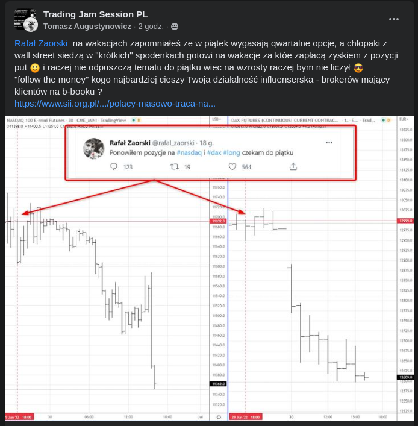
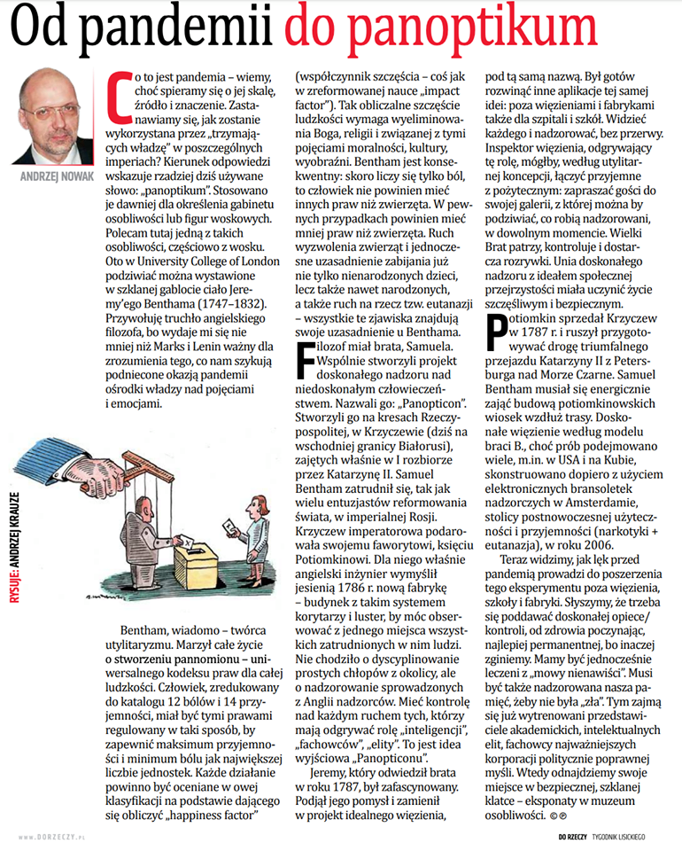
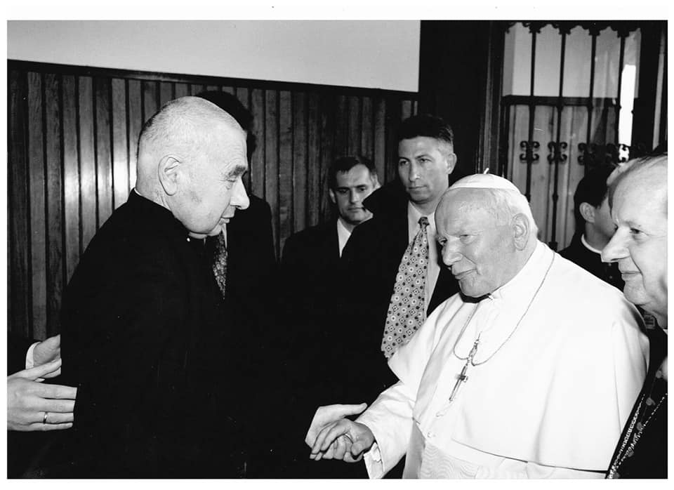
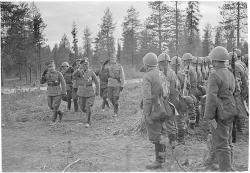

### 2022

  

### 2021

Nigdy w historii publikacji danych przez NBP (od 1996 roku) z polskiego systemu bankowego nie odpłynęło tyle pieniędzy. Gospodarstwa domowe wycofywały (wydawały) środki zarówno z lokat, jak i z rachunków bieżących.

W maju banki "pozbyły" się niemal 6 mld PLN.

### 2020

W najnowszym numerze tygodnika „DoRzeczy” piszę o stopniowym przechodzeniu swiata „Od pandemii do panoptikum”. Omawiam genezę pomysłu „panoptikonu”, czyli doskonałego więzienia, jakie zaprojektował twórca utylitaryzmu w myśli liberalnej, Jeremy Bentham, do spółki ze swym bratem, Samuelem. Razem pracowali w końcu XVIII wieku dla Katarzyny II, na zagarniętych przez nią ziemiach Rzeczpospolitej. Istotą pomysłu, rozwiniętego wkrótce na szkoły, szpitale i fabryki, był doskonały, nieprzerwany nadzór nad ludźmi - oczywiście dla ich dobra. Dziś widzimy, jak lęk przed pandemią prowadzi do poszerzenia eksperymentu. Słyszymy, że trzeba się poddawać doskonałej opiece/kontroli, od zdrowia poczynając, najlepiej permanentnej, bo inaczej – zginiemy. Mamy być jednocześnie leczeni z „mowy nienawiści”. Musi być także nadzorowana nasza pamięć, żeby nie była „zła”. Tym zajmą się, już wytrenowani przedstawiciele akademickich, intelektualnych elit, fachowcy najważniejszych korporacji politycznie poprawnej myśli. Wtedy odnajdziemy swoje miejsce w bezpiecznej, szklanej klatce: eksponaty w muzeum osobliwości…

  

---

Pierwszy kraj w Europie testuje na wielką skalę uniwersalny dochód podstawowy. W Hiszpanii właśnie ruszyły „dopłaty do pensji”.

---

### 1999

Kraków, ostatnie spotkanie Jana Pawła II i księdza Józefa Tischnera. Kres życia obu duchownych naznaczony jest wielkim cierpieniem, w przypadku kapelana Solidarności to zaawansowany rak krtani – efekt typowego dla kaznodziei i wykładowcy akademickiego wieloletniego przeciążania głosu. Dwóch przyjaciół ma dla siebie dosłownie moment na uścisk. Zaraz po powrocie do Watykanu, poruszony cierpieniem Tischnera, papież pisze list: „Było to spotkanie na Wawelu, ale zbyt pośpieszne (…) A z Księdzem Profesorem trzeba było mi się dłużej spotkać. Czy potrafi przyjechać do Rzymu – trudno mi to sobie teraz wyobrazić (…) Więc się stale z Nim spotykam, choć bez słów. A jest to spotkanie z Hiobem”. Tischner do Watykanu już nigdy nie dotrze. Trzy miesiące później, nie mogąc mówić, wyda na kartce dyspozycje: „Niech mnie grzebią w Łopusznej na cmentarzu między ludźmi, a nie szukają miejsca przy kościele. I bez przemówień. Na drugi dzień zrobią akademię i zanudzą towarzystwo”. Dziś 20. rocznica śmierci ks. prof. Józefa Tischnera

  

### 1941

Rozpoczęła się operacja „Silberfuchs” – nieudana niemiecko-fińska próba zajęcia Murmańska.

Niemcy i Finowie uzgodnili, że operacja ta będzie przeprowadzona w trzech fazach. Pierwszą z nich miała być Operacja Reintier (Renifer), w ramach której dwie dywizje niemieckiej piechoty górskiej z Gebirgkorps Norwegen dowodzonego przez generalobersta Eduarda Dietla miały zająć Petsamo, aby zająć dogodne pozycje do ataku na Murmańsk.

Drugą operacją była operacja Platinfuchs (Platynowy lis), w ramach której miano przeprowadzić atak na wschód od Petsamo, wzdłuż linii brzegowej w kierunku Murmańska. Miały tego dokonać pozostałe siły Korpusu Norwegen wspomagane przez żołnierzy fińskich z Batalionu Straży Granicznej Ivalo.

Trzecią częścią operacji był atak od południa, nazwany Operacją Polarfuchs (Lis polarny). W tej operacji brały udział dwie dywizje niemieckie (169 i dywizja SS "Nord") oraz fińska 6. Dywizja Piechoty. Atak miał być przeprowadzony na wschód od Kuusamo, wzdłuż linii Salla-Urinsalmo, a jego celem miało być zdobycie miasta Kandałaksza (fin. Kantalahti).

Operacja Silberfuchs trwała do 17 listopada 1941 i zakończyła się klęską wojsk niemiecko-fińskich. Dowódcą fińskim, który odznaczył się szczególnym męstwem był weteran wojny zimowej generał Hjalmar Siilasvuo, podczas operacji Silberfuchs dowodził on fińskim III Korpusem.

Na zdjęciu generał Falkenhorst i generał Siilasvuo podczas inspekcji oddziałów fińskich na Froncie Północnym (24 czerwca 1941).

  

---

<a href="https://github.com/TomaszWaszczyk/historia.waszczyk.com/edit/master/src/content/june-29.md" target="_blank">Edytuj tę stronę dzieląc się własnymi notatkami!</a>
