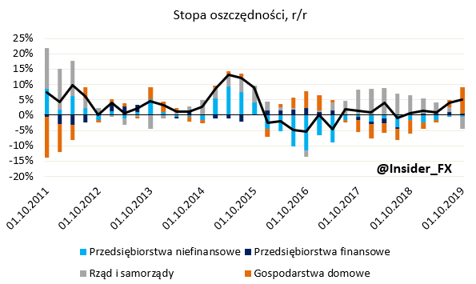
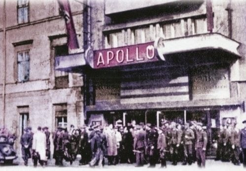
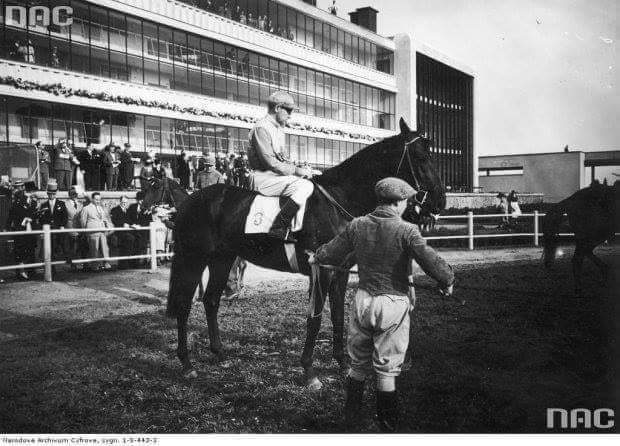
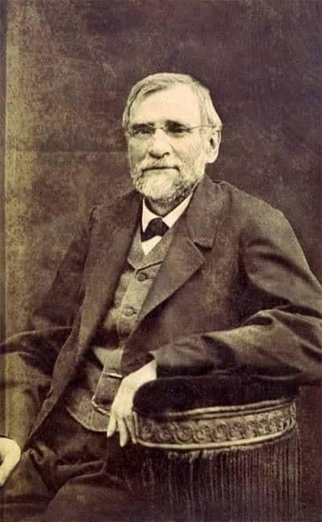
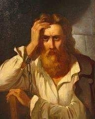
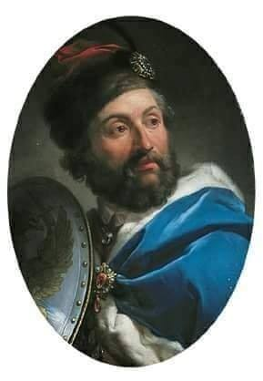

### 2020

KONIEC DŁUGIEGO TRENDU

Po sześciu latach skończył się w Polsce okres spadku bezrobocia. I skończył się także okres wzrostu realnych wynagrodzeń. Będzie trudniej o pracę i o wywalczenie podwyżki. A przecież wynagrodzenia w Polsce wciąż są niższe od zachodnich. Kiedy wrócimy zatem na ścieżkę poprawy?

Najwyższy poziom bezrobocia w Polsce w okresie po zmianach ustrojowych odnotowaliśmy pod koniec pierwszego kryzysu, jaki dotknął nasz kraj w dwudziestym pierwszym wieku. Kryzys ten był przede wszystkim efektem wydarzeń na świecie. Najpierw pękniecie internetowej banki spekulacyjnej w 2000 roku, potem atak na WTC we wrześniu 2001 roku i upadek Enronu pod koniec 2001 roku spowodowały ponaddwuletnią światową dekoniunkturę, która odbiła się także na sytuacji w Polsce. Mieliśmy też swoje problemy, choćby słynną dziurę budżetową, która wymagała dość konserwatywnego podejścia do finansów publicznych. Tak czy inaczej w lutym 2003 roku dobiliśmy do rekordowych 20,7% stopy bezrobocia. Potem świat, także i my, wszedł w okres szybkiego wzrostu. Efekt? 8,8% bezrobocia w październiku 2008 roku. A zatem w ciągu pięciu i pół roku rynek pracy w Polsce doznał prawdziwej rewolucji. Chociaż trzeba pamiętać także o tym, że spora grupa naszych rodaków wyjechała z kraju, szczególnie po wejściu Polski do UE w 2004 roku. I to też miało wpływ na sytuację na rynku pracy.

Potem mieliśmy kryzys 2008 - 2009, drugi kryzys 2012 - 2013 i w efekcie znowu wyraźny wzrost bezrobocia. W lutym 2013 roku odnotowaliśmy 14,4% bezrobotnych. I wtedy właśnie Europa, w szczególności cały nasz region, znowu zaczęła wchodzić na ścieżkę szybkiego wzrostu. Ten wzrost trwał nieprzerwanie, mam tu na myśli nasz region, w zasadzie aż do ataku koronawirusa. Choć, jak już wielokrotnie pisałem, oznaki pogorszenia koniunktury zaczęliśmy widzieć wcześniej, czyli w roku 2019. Z dość dużym prawdopodobieństwem bezrobocie w Polsce w roku 2020 już by nie spadło. Ale oczywiście ewentualny wzrost też nie byłby jakiś bardzo mocny. To już jest jednak historia, której nie zweryfikujemy, bo nastała zupełnie inna rzeczywistość.

Najniższy poziom bezrobocia odnotowaliśmy w październiku 2019 roku i było to równe 5%. To bardzo blisko tzw. bezrobocia strukturalnego, które szacujemy w Polsce na około 4%. I to tłumaczy szybki wzrost wynagrodzeń towarzyszący spadkowi bezrobocia. Wtedy, czyli w latach 2003 - 2008 spodek bezrobocia był równie spektakularny, jak w ciągu ostatnich lat, jednak zaczynaliśmy z wyższego poziomu, więc nie zeszliśmy tak nisko. A prawie 9% w roku 2008 to na tyle daleko od poziomu bezrobocia strukturalnego, że wciąż na rynku było dużo osób szukających pracy. A to hamowało szybszy wzrost wynagrodzeń. W ostatnich latach było inaczej, pisałem już zresztą o tym.

Spadek bezrobocia był charakterystyczny oczywiście nie tylko dla Polski. A zatem to nie jakiś cudowny plan realizowany przez nasz rząd prowadził do tej sytuacji. Wystarczy popatrzeć na naszych sąsiadów i kraje regionu, gdzie spadki bezrobocia były równie spektakularne, a przecież tam koncepcje naszych rządzących nie docierały. Dla przykładu na Słowacji stopa bezrobocia spadła z 14,8% na początku 2014 roku do 4,9% pod koniec 2019 roku, a w Czechach z 8,6% w styczniu 2014 do 2,6% w połowie 2019 roku. W Rumunii z kolei z 7.5% w czerwcu 2013 roku do 3,8% w czerwcu 2019 roku. A na Węgrzech z 11,8% w marcu 2013 do 3,3% w czerwcu 2019. Podobną sytuację mieliśmy w większości krajów nie tylko Europy środkowo - wschodniej, ale całego kontynentu.

Teraz sytuacja wszędzie zaczyna się odwracać z uwagi na nagły kryzys związany z koronawirusem. Wciąż trudno jest o jakieś wiarygodne prognozy, ale moim zdaniem możemy w tym roku w Polsce zobaczyć dwucyfrowe bezrobocie. Czyli w stosunku do minimum z zeszłego roku możemy zaobserwować dwukrotny wzrost. A to oznacza, że 800 tys - 900 tys naszych rodaków może stracić pracę. Kiedy sytuacja zacznie się znowu poprawiać? Mam nadzieję, że już pod koniec roku. Może być to zresztą ewenement, bowiem ze względu na sezonowość, praca w rolnictwie i w budownictwie, normalnie pod koniec roku bezrobocie w Polsce zawsze rośnie. Ale jeśli mocne odbicie w gospodarce będzie faktem, to efekt tworzenie nowych miejsc pracy zniweluje efekt sezonowy. Oby oczywiście tak się stało. Ale na spadek bezrobocia w okolicę obserwowanego w zeszłym roku będziemy musieli, moim zdaniem, poczekać prawdopodobnie do roku 2022. I to przy sprzyjających wiatrach.

W kwietniu zaobserwowaliśmy także koniec innego, jeszcze dłuższego trendu. Po siedmiu latach spadło bowiem realne wynagrodzenie. Nominalnie wciąż jeszcze wzrosło, o 1,9% rok/rok, ale uwzględniając inflację mamy spadek o 1,4% w ujęciu rocznym. I tu także trudno liczyć na powrót do długookresowego trendu w tym roku. Możemy już także raczej zapomnieć o rządowym projekcie mocnego wzrostu płacy minimalnej. Ale to temat na inny felieton.

---

W ostatnim kwartale 2019 nastąpił najwyższy, w ujęciu rocznym, wzrost stopy oszczędności od kilku lat. Co ważne, wzrost ten nastąpił niemalże wyłącznie dzięki gospodarstwom domowym - sytuacja rzadka w ostatnich latach. W efekcie powyższego, można spodziewać się było spadku udziału spożycia prywatnego w PKB jeszcze przed pojawieniem się pandemii. Dobrą informacją jest budowanie poduszki na odbicie konsumpcji potencjalnie już w przyszłym roku.

  

---

### 2019

Malaysia's Mahathir rekindles gold standard debate

The Malaysian leader has proposed a gold-pegged common trading currency for East Asia. Experts say returning to the gold standard is easier said than done, especially when the motive is more political than economic.

Malaysian Prime Minister Mahathir Mohamad has suggested that East Asia should consider a common trading currency backed by gold, saying the current foreign exchange system tied to the US dollar was prone to manipulation.

The Malaysian leader said the currency could be used for regional trade and would not be used for domestic transactions.

"In the Far East if you want to come together, we should start with a common trading currency, not to be used locally but for the purpose of settling of trade," Mahathir said at the Future of Asia conference in Tokyo.

"At the moment we have to depend upon the US dollar but the US dollar is also not stable. So the currency that we propose should be based on gold because gold is much more stable," he said.

### 1942

W Warszawie grupy konspiracyjnej Organizacji Młodego Sabotażu "Wawer" zagazowały przy użyciu środków chemicznych 7 kin, uzyskując pożądane efekty- przerwanie seansów i panikę wśród widzów uczęszczających do kin wbrew zakazom podziemia.

  

### 1939

Otwarto Tor wyścigów konnych Służewiec. Na uroczystym otwarciu toru ze strony rządu byli obecni: minister rolnictwa Juliusz Poniatowski, wiceminister spraw wojskowych Aleksander Litwinowicz i naczelnik Wydziału Chowu Koni Witold Pruski. Historyczną pierwszą gonitwę na Torze Służewiec wygrał 3-letni Felsztyn ze Stajni Wierzbno, hodowli Cz. Andrycza i A. Kosakowskiego, dosiadany przez Stefana Michalczyka.

  

### 1932

Dokonano oblotu samolotu RWD-6. Była maszyna polskiej konstrukcji stworzona specjalnie na zawody Challange 1932 przez zespół konstruktorów: Stanisław Rogalski, Stanisław Wigura i Jerzy Drzewiecki w Doświadczalnych Warsztach Lotniczych w Warszawie. Zbudowano trzy egzemplarze tego samolotu.
Podczas oblotu wspomnianej maszyny nastąpił wypadek samolotu SP-AHM: w czasie lotu z dużą prędkością (pilotował Jerzy Drzewiecki), kilka metrów nad ziemią, doszło do urwania się obu skrzydeł. Kadłub zaś po wykonaniu obrotu wokół osi podłużnej opadł na koła podwozia. W wypadku ciężko ranny został J. Drzewiecki, ale uszedł z życiem. Po modyfikacji systemu przestawiania statecznika poziomego, pozostałe dwa samoloty wysłano jednak na zawody Challenge , pod warunkiem niewykonywania lotów z prędkością maksymalną, z wyjątkiem próby końcowej.
Na jednej z dwóch pozostałych maszyn załoga w składzie Franciszek Żwirko i Stanisław Wigura zdobyła na trwajacych od 11 do 28 sierpnia 1932 roku zawodach Challange pierwsze miejsce.

  

### 1890

W Krakowie zmarł Oskar Kolberg - folklorysta, etnograf, muzyk i kompozytor; członek AU; autor monumentalnego dzieła zatytułowanego ,,Lud. Jego zwyczaje, sposób życia, mowa, podania, przysłowia, obrzędy, gusła, zabawa, pieśni, muzyka i tańce'', dającego najpełniejszy opis polskiej kultury ludowej. Spoczął na Cmentarzu Rakowickim w Krakowie.

  

### 1837

W Berdyczowie założono Związek Ludu Polskiego.
Związek miał gromadzić broń, rozwijać siatkę konspiracyjną, nawiązywać kontakty konspiracyjne z żołnierzami rosyjskimi oraz przygotowywać przyszłe powstanie. ZLP dążył
do radykalnej reformy stosunków społecznych na ziemiach polskich, przyznania praw mieszczanom.
Przewodniczącym ZLP był Szymon Konarski ( grafika).
Związek dzielił się na oddziały:
Wołyń - pełnomocnikiem był dr Józef Antoni Beaupré Podole - pełnomocnik Fryderyk Michalski
Ukraina - pełnomocnictwo pełnił Piotr Borowski.
W ZLP utworzono stanowiska sekretarzy czyli kierowników organizacji powiatowych.
Organizację tę rozwiązano po aresztowaniu Konarskiego.

  

### 1460

W czasie wojny trzynastoletniej papież Pius II objął klątwą króla Polski Kazimierza IV Jagiellończyka (grafika) oraz jego poddanych.
Tak radykalne posunięcie ówczesnej głowy Kościoła Katolickiego było wynikiem nie wpuszczenia do Polski papieskiego legata, który miał podjąć się mediacji między Państwem Zakonu Krzyżackiego, a Koroną Królestwa Polskiego.

  

---

<a href="https://github.com/TomaszWaszczyk/historia.waszczyk.com/edit/master/src/content/june-3.md" target="_blank">Edytuj tę stronę dzieląc się własnymi notatkami!</a>
