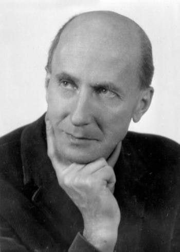
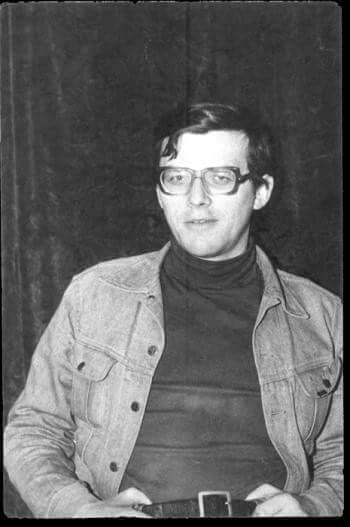
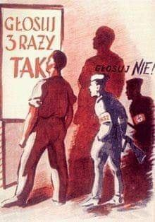
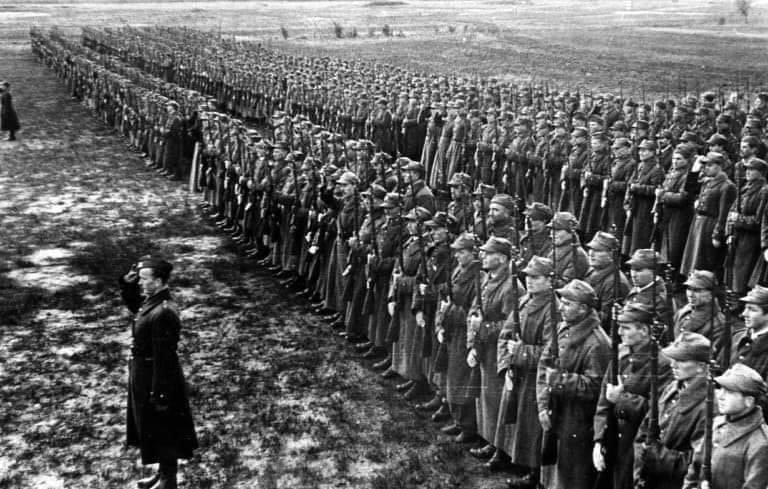
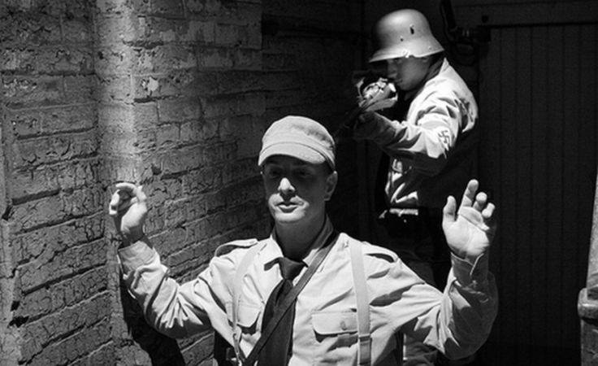
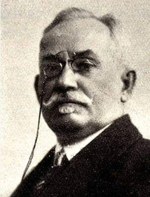
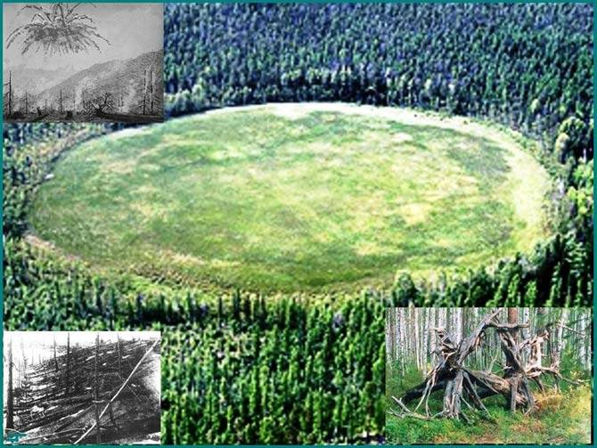

### 2020

Booooom! Choć to tylko flash inflacja w czerwcu solidnie rośnie do 3,3%. Inflacja bazowa > 4,0% (nowy rekord za czasów BCI). Festiwal przerzucania „covidowych” kosztów bezpieczeństwa na konsumenta. A ten chętnie płaci.

---

Mamy już coraz więcej twardych danych pokazujących sytuację polskiej gospodarki w drugim kwartale 2020 roku. Będzie źle, cud się nie wydarzy.

W drugim kwartale polska gospodarka odnotuje bezprecedensową zapaść. Trudno się spodziewać innego scenariusza w sytuacji, kiedy cześć branż była zamrożona, a nasza aktywność spadła z uwagi choćby na obostrzenia sanitarne. W dodatku także inni zamrażali gospodarki, a zatem musiało dojść do tąpnięcia w eksporcie. A to on, przypominam, odpowiada w największej mierze za ostatnich sześć lat prosperity.

Wiemy już, że sprzedaż za granicę spadła w kwietniu o prawie jedną trzecią. W okresie styczeń - kwiecień spadek wyniósł 5,3% rok/rok. Dla porównania spadek eksportu u naszego najważniejszego odbiorcy towarów, czyli w Niemczech wyniósł w kwietniu 24% rok/rok. W przypadku naszych zachodnich sąsiadów to najgorszy wynik od czasu zjednoczenia Niemiec. Piszę o Niemczech nie tylko dlatego, że to największy eksporter w Europie, ale przede wszystkim dlatego, że pogorszenie koniunktury w niemieckiej sprzedaży za granicę musi wpłynąć na to, co i ile Niemcy będą kupowały w Polsce. Przypominam, że 27,5% tego co eksportujemy trafia właśnie do Niemiec, to największy nasz partner handlowy. Nie mamy jeszcze danych za maj, ale kolejny poważny spadek eksportu z pewnością w Polsce zobaczymy.

Mamy już za to majowe dane o produkcji przemysłowej. Spadła ona o 17% rok/rok, po spadku o 24,6% rok/rok w kwietniu. W maju widać lekką poprawę, ale to wciąż fatalne dane. I są one przede wszystkim pokłosiem problemów ze sprzedażą za granicę. Jeśli chodzi o dane o produkcji przemysłowej, to w kwietniu w Unii Europejskiej było tylko sześć krajów, które zanotowały gorszy wynik. To a propos tez stawianych przez niektórych polityków, że koronawirus gospodarczo nie dotyka nas tak bardzo, jak innych. Dotyka. A że dane o PKB w tym roku wiele innych krajów będzie miało gorszych, to także efekt np. struktury PKB. Wspominałem o tym parę tygodni temu. Jak się ma większy udział np. turystyki niż Polska, to trudno odrobić absolutne załamanie, które dotyczy tej branży.

Fatalne dany obserwujemy także w sprzedaży detalicznej. W kwietniu spadła ona o 22,6% w ujęciu rocznym, w maju natomiast o 8,6% rok/rok. Majowe dane są dużo lepsze choćby ze względu na odmrożenie galerii handlowych. W handlu spożywczym załamania oczywiście nie ma, ale już np. w przypadku odzieży i obuwia jest. Tu przyspieszą zresztą prawdopodobnie zmiany w samej strukturze sprzedaży. Koronawirus ich nie rozpoczął, ale z pewnością je zdynamizuje. Chodzi mi oczywiście o wzrost udziału sprzedaży internetowej w całości sprzedaży.

Do sklepów odzieżowych nie chodziliśmy w ostatnich tygodniach, bo albo były one zamknięte, albo nie mogliśmy do nich chodzić z obawy przed zarażeniem lub z uwagi na obostrzenia w poruszaniu się. W efekcie mocno wzrósł udział internetu. Dotyczy to oczywiście nie tylko Polski. A wymiar tego procesu możemy obserwować choćby przez pryzmat decyzji ogłoszonej kilkanaście dni temu przez holding odzieżowy Inditex, największy tego typu podmiot na świecie. Otóż Hiszpanie zamierzają zamknąć do 1200 sklepów na całym świecie. Plany dotyczące ograniczenia sprzedaży w tym standardowym kanale nie są nowe. Ale obecna sytuacja przyspieszyła decyzję. W pierwszym kwartale internetowa sprzedaż grupy wzrosła o 50%, w tym w samym kwietniu o 95%. Całkowita sprzedaż zmniejszyła się o 44%. Internet nie mógł oczywiście wystarczyć, ograniczyliśmy po prostu konsumpcję. W okresie pandemii mieliśmy inne problemy na głowie, niż kupowanie towarów nie pierwszej potrzeby.

Wracając jednak do dezycję Inditexu, to trzeba ją jednak dobrze rozumieć. Holding posiada obecnie prawie 7,5 tysiąca sklepów. Zamkniętych zostanie zatem około 15%. Głównie tych starszych i niedochodowych. Jednocześnie firma chce otworzyć 450 nowych, supernowoczesnych. Nie przesadzałbym zatem z ogłoszeniem końca handlu tradycyjnego. Jak już napisałem pewne procesy po prostu przyspieszą.

Tak na marginesie obserwujemy w tej chwili walkę najemców z właścicielami galerii handlowych o obniżenie czynszów w związku ze spadkiem obrotów. Abstrahując już od tego, czy z płynnościowego punktu widzenia istotny spadek czynszów jest realny pojawiają się nowe aspekty całej sytuacji. Któż z nas nie ma bowiem znajomych, a może sami tak dokonujemy zakupów, dla których sklepy służą jedynie do oglądania na żywo danego towaru, przymierzenia go, ale samego zakupu dokonujemy przez internet. Bo tak wciąż zazwyczaj jest taniej. I nie ma problemu ze zwrotem takiego produktu. Sklep nie osiąga obrotów, ale jest jednak istotnym elementem łańcucha prowadzącego do dokonania zakupu. Czy zatem w przyszłości tego typu miejsca nie będą w jeszcze większym stopniu pełniły roli reklamowej i miejsca przymiarek, ale trudno będzie na nich osiągać jednostkowy zysk?

Wracając do rozważań o Polsce, to jedynie poziom bezrobocia wciąż nie pokazuje dramatu i jest relatywnie niski. Ale, jak już wielokrotnie w felietonach wspominałem, tu pełne konsekwencje wpływu koronawirusa zobaczymy dopiero w lecie. Okresy wypowiedzenia, postojowe, a nawet często problemy z rejestracją w urzędach z uwagi na obawę przed zarażeniem efekt opóźniają. Tak, ten efekt będzie opóźniony. On nie mógł wystąpić w momencie apogeum pandemii w Polsce, zakładając, że to apogeum mamy już za sobą. Choćby właśnie ze względu na obowiązujące w Polsce prawo pracy. Piszę o tym, bo ten wątek pojawił się w kampanii prezydenckiej. Ale dane z rynku pracy już pokazują, że jest dużo gorzej. Już od marca mamy spadek zatrudniania, a dane kwietniowe były najgorsze od momentu liczenia ich przez GUS. Ubyło wtedy 153 tysiące miejsc pracy. Od kwietnia obserwujemy też spadek realnych wynagrodzeń. Po raz pierwszy od siedmiu lat.

Co z tego wszystkiego wynika? W drugim kwartale spadek PKB może być większy niż 8%. A bezrobocie w lecie może ten poziom, i to wyraźnie, przekroczyć.

<!-- Mędrzec o kobiecie i mężczyźnie

Opowiem ci o pewnym zrozpaczonym męzczyznie, który przyszedł do mędrca: "Szukam od lat kobiety, która by sprostała moim wymaganiom, i nie znajduję. Jestem bardzo zdeterminowany, ale nic z tego nie wychodzi. Na to mędrzec: "Powiedz mi, jakiej kobiety szukasz?" Męzczyna jednym tchem: "Mądrej, zaradnej, szlachetnej, ciepłej, kochającej, wrażliwej, odważnej, pogodnej no i pięknej." Na to mędrzec: "Znajdziesz ją bez trudu. Pełno takich. Męzczyna: "Jak to możliwe, że przez tyle lat nie spotkałem ani jednej?" Mędrzec: "Nie miałeś szans. Ale zdradzę ci stuprocentowy sposób, żeby ją spotkać. Musisz mi tylko obiecać, że jak Ci go zdradzę skorzystasz z niego, choć będzie cię to kosztować dużo trudu." Mężczyzna po chwili namysłu: "Jeśli to jest stuprocentowy sposób, to decyduję się i obiecuję, że nie zmarnuję tego daru. Nie boję się trudnej drogi, gdy jestem pewen, że prowadzi do celu. To, co było moim udziałem do tej pory, było i trudne, i na dodatek bezowocne." "Mądra odpowiedź" pochwalił go mędrzec i kontynuował: „Sposób jest prosty. Jeśli chcesz spotkać kobietę obdarzoną tak hojnie cnotami, które wymieniłeś, to najpierw musisz je rozwinąć w sobie! Gwarantuję, że wtedy ją spotkasz bo złoto ciągnie do złota, a żelazo do żelaza." Męzczyzna pokłonił się mędrcowi i już chciał wyjść z pokoju, gdy ten dodał ciepło: "Jeśli już to wszystko zrobisz, a jakimś zrządzeniem losu jednak ją nie spotkasz, to i tak będziesz czuł, że ją spotkałeś na swojej drodze. -->

---

Fiskus zaczął się zbroić
JAROSŁAW KRÓLAK
Resort finansów skończył przetarg na 16 radiowozów. Wkrótce ma ruszyć kolejny na 36 oraz zamówienia na zakup sprzętu i broni.
W tym roku MF ma wydać na inwestycje 400 mln zł, a w dwóch kolejnych latach 600 mln zł.
Obejmą one wymianę taboru samochodowego, nabycie i przebudowę nieruchomości, zakupy skanerów RTG do prześwietlania pociągów i pojazdów, zakupy broni, modernizację sieci LAN oraz rozbudowę centrum przetwarzania danych MF.
Zgodnie z programem modernizacji KAS w ciągu trzech lat resort zakupi ponad 500 pojazdów dla wszystkich 16 izb administracji skarbowej.
Program modernizacji KAS przewiduje także przeznaczenie 9 mln zł na zakup długiej i krótkiej broni dla funkcjonariuszy.
Niewykluczone, że ambitne cele MF zostaną zweryfikowane, rząd przymierza się bowiem do nowelizacji budżetu na ten rok.

---

### 1988

Z roku w Warszawie został napadnięty i śmiertelnie pobity prof. Jan Witold Strzelecki. W wyniku doznanych obrażeń zmarł, 11 lipca 1988 roku. Okoliczności zbrodni do tej pory nie zostały wyjaśnione.
Jan Strzelecki był Powstańcem warszawskim (za zasługi odznaczony Krzyżem Walecznych), działaczem socjalistycznym, naukowcem Instytutu Filozofii i Socjologii PAN, eseistą, taternikiem, narciarzem.
Należał do aktywnych działaczy demokratycznych. Był członkiem Towarzystwa Kursów Naukowych, uczestnikiem konwersatorium „Doświadczenie i Przyszłość”. Pełnił obowiązki Doradcy Komisji Krajowej NSZZ „Solidarność”. Został internowany w stanie wojennym. W 1987 roku był jednym ze współinicjatorów odrodzenia PPS. 31 sierpnia 2006 roku pośmiertnie został uhonorowany przez Prezydenta RP Lecha Kaczyńskiego Krzyżem Komandorskim Orderu Odrodzenia Polski.

  

---

### 1983

Na bramie Stoczni Gdańskiej znaleziono powieszone ciało Jana Samsonowicza (zdjęcie) działacza NSZZ Solidarność, jednego z inicjatorów powołania do życia Ruchu Młodej Polski, w czasie podpisywania Porozumień Sierpniowych przedstawiciela Akademii Medycznej w Gdańsku.
Samsonowicz był również szefem tajnej komórki kontrwywiadowczej NSZZ Solidarność, która wpadła na trop współpracownika Służby Bezpieczeństwa, który miał być również członkiem Solidarności ulokowanym na szczytach jej władz.

  

### 1946

Władze komunistyczne przeprowadziły referendum ludowe,w którym zadano Polakom trzy pytania:
1 "Czy jesteś za zniesieniem senatu?"
2 Czy chcesz utrwalenia w przyszłej Konstytucji ustroju gospodarczego, zaprowadzonego przez reformę rolną i unarodowienie podstawowych gałęzi gospodarki krajowej, z zachowaniem ustawowych uprawnień inicjatywy prywatnej?
3 Czy chcesz utrwalenia zachodnich granic Państwa Polskiego na Bałtyku, Odrze i Nysie Łużyckiej ?
Wyniki wyborów zostały sfałszowane.
Wojsko, milicja, ORMO i UB pilnowało urn wyborczych przed atakami zbrojnego podziemia. Informowano, że podczas przygotowań zginęło około tysiąca działaczy lewicy.
Po głosowaniu oficerowie radzieckich
służb specjalnych napisali blisko 6 tysięcy nowych protokołów z komisji wyborczych i podrobili 40 tysięcy podpisów ich członków.
Komunistyczne władze dołożyły starań, by wynik referendum był dla nich korzystny. W marcu 1946 roku powołano Państwową Komisję Bezpieczeństwa, która koordynowała
działania wojska, milicji oraz służb
specjalnych. Ich zadaniem była nie tylko ochrona sfałszowanego głosowania, lecz także likwidacja niepodległościowego podziemia.
Sukces tego sfałszowanego referendum utwierdził komunistów w przekonaniu,że nadal można w ten spób oszukiwać Polaków.Tę samą technikę wykorzystano rok później w podczas wyborów do Sejmu.

  

### 1942

Władze sowieckie ustami ministra spraw zagranicznych ZSRR Wiaczesława Mołotowa zaproponowały władzom brytyjskim przeniesienie Armii Polskiej generała Andersa na teren Środkowego Wschodu. Warto dodać, że o tej inicjatywie nie powiadomiono władz polskich w Londynie.
W uzasadnieniu Mołotow stwierdzał:
"Rząd sowiecki z niepokojem obserwuje sytuację wojenną w Egipcie i chociaż nie ma ochoty osłabiać własnego frontu, gotów jest oddać polskie dywizje w Rosji do dyspozycji Rządu Jego Królewskiej Mości, aby wypełnić braki wywołane przez ostatnie ciężkie walki".

  

### 1941

One of the most tragic and shameful dates in the history of Ukraine. In all cities and towns of western Ukraine began mass pogroms, tortures and lynching of Jewish population. In most western Ukrainian cities from 30% to 70% of urban population was of Jewish origin. Almost all of them were murdered. The pogroms were launched by columns of Ukrainian nationalists from OUN who had intervened along with German Nazis. The main instigators were Catholic and Greek-Catholic clerics and priests. During pogroms nationalistic mobs raped women, robbed belonging of Jewish population, and occupied their houses and flats. Modern Ukrainian official historical narrative still praises and glorifies the OUN murderers, while the role of the church and priests is being silenced.

### 1934

W III Rzeszy, w czasie tzw. nocy długich noży ujęto i zamordowano 77 przeciwników Adolfa Hitlera wewnątrz ruchu narodowosocjalistycznego (nieoficjalnie około 400).

Utworzenie NSDAP było pierwszym krokiem nazistów na drodze do uzyskania realnego wpływu na losy Niemiec. W pierwszych latach po zakończeniu I wojny światowej narodowy socjalizm stanowił przede wszystkim przeciwwagę dla rosnącego w siłę komunizmu. Komunistyczni rewolucjoniści starali się dotrzeć do mas robotniczych poprzez organizowane naprędce samorządne rady. Ich zwrot przeciwko monarchii i dotychczasowemu systemowi sprzyjał aliansowi monarchistów z nazistami, zwłaszcza że początkowo NSDAP stała na straży prawicowych, konserwatywnych poglądów. Tym pierwszym zależało na utrzymaniu stabilności i status quo. 24 lutego 1920 roku A. Hitler opublikował manifest programowy zawierający 25 głównych tez narodowego socjalizmu. Podstawę jego rozważań stanowiła anulacja postanowień traktatu wersalskiego i odbudowa niemieckiego społeczeństwa w duchu nacjonalistycznym. Hasła były adresowane głównie do warstw robotniczych, mieszczańskich i niższej klasy społecznej i powstały przy współudziale A. Drexlera i Gottfrieda Federa, którzy zdawali się wierzyć w socjalistyczną wizję nazizmu. Dynamiczny rozwój partii w okresie niepokojów społecznych był jednym z głównych czynników, dla których A. Hitler zdecydował się w październiku 1923 roku na próbę przejęcia władzy na terenie Bawarii w drodze przewrotu. W marszu na budynki rządowe Republiki Weimarskiej wzięły udział bojówki Sturmabteilung (SA) organizowane przez Ernsta Röhma, które wcześniej angażowały się przede wszystkim w bezładne bijatyki z komunistami. Tzw. pucz monachijski zakończył się jednak spektakularnym niepowodzeniem nazistów, a jego przywódcy zostali uwięzieni przez władze. Proces A. Hitlera okazał się być kolejną okazją do manifestowania jego radykalnych poglądów. W okresie pozbawienia wolności A. Hitler napisał dwutomowe dzieło „Mein Kampf”, w którym nakreślił wizję budowy nazistowskiego państwa, głosząc nacjonalistyczne hasła odnowy społecznej, kolektywizmu i antysemityzmu. Jak sam zwykł mówić, okres pobytu w twierdzy Landsberg traktował jak „uniwersytet na koszt państwa”. Uwięzienie przez władze zyskało mu również sporą sympatię niemieckiego społeczeństwa, co zaowocowało popularnością i wzrostem notowań NSDAP przed wyborami w 1924 roku, podczas których partia zdobyła pierwsze mandaty w Reichstagu. Kolejne sukcesy przyszły w wyborach w 1928 i 1930 roku. NSDAP sprzyjała gospodarcza koniunktura. Narastający kryzys ekonomiczny przyczynił się do zradykalizowania mas społecznych, które oczekiwały natychmiastowych rozwiązań. Naziści proponowali zreformowanie państwa i obranie nowego kursu politycznego. W 1932 roku uzyskali 37% mandatów Reichstagu, stając się czołową siłą niemieckiego parlamentu i stwarzając poważne zagrożenie dla stabilności niemieckiej sceny politycznej. W 1932 roku kanclerz Franz von Papen spodziewał się, że zaostrzenie kursu względem nazistów przyniesie efekt odwrotny do zamierzonego. Jak sam stwierdził, należało im popuścić cugli, by nie drażnić szerokich mas społecznych. A. Hitler i jego poplecznicy skrzętnie wykorzystali niefrasobliwość władz. Już 30 stycznia 1933 roku A. Hitler został mianowany kanclerzem. W lutym 1933 roku naziści upozorowali podpalenie Reichstagu, oskarżając o nie bojówki komunistyczne. Następnie nakłonili prezydenta Paula von Hindenburga do wprowadzenia antydemokratycznych praw zawartych w Dekrecie o ochronie narodu i państwa. W tym samym czasie kilkuset członków Partii Komunistycznej zostało aresztowanych przez bojówki SA. Był to pierwszy krok na drodze do wprowadzenia nazistowskiego terroru opartego na ograniczaniu swobód i wolności obywatelskich, organizacji aparatu policyjnego i delegalizacji istniejących partii politycznych. 24 marca 1933 roku przywódca NSDAP uzyskał pełnię władzy po przeforsowaniu w Reichstagu ustawy o nadzwyczajnych pełnomocnictwach.

Brutalne metody stosowane przez nazistów wzbudzały liczne zastrzeżenia bardziej umiarkowanych działaczy NSDAP. Otaczający się wiernymi służbistami A. Hitler konsekwentnie zmierzał w kierunku absolutnego podporządkowania i zasady wodzostwa. Rodziło to uzasadnione obawy jego dotychczasowych współpracowników. Różnice w poglądach dotyczyły przede wszystkim sfery ideologicznej i koncepcji budowy państwa. Eklektyczna doktryna nazizmu była silnie zróżnicowana i nierzadko wewnętrznie sprzeczna, przez co nietrudno było o doktrynalne spory. Już w latach dwudziestych A. Hitler odsuwał partyjnych kolegów na boczne tory, a w 1926 roku wdał się nawet w spór z Josephem Goebbelsem. Nieporozumienia dotyczyły polityki zagranicznej i zbyt łagodnego, w opinii J. Goebbelsa, kursu względem bolszewików. W późniejszym czasie obaj zgodnie współpracowali, a J. Goebbels został szefem nazistowskiej propagandy. Gregor Strasser reprezentował socjalistyczne skrzydło NSDAP. A. Hitler, chcąc zdyskredytować rywala, nazywał go „marksistą”, wskazując na odstępstwa od doktryny nazistowskiej. W 1932 roku niewiele zabrakło, by G. Strasser wszedł w skład rządu gen. Kurta von Schleichera. Niewątpliwie wzmocniłoby to obóz opozycyjny względem A. Hitlera.

Na początku lat trzydziestych w otoczeniu przywódcy NSDAP prym wiedli Rudolf Hess, Heinrich Himmler oraz Hermann Göring. Coraz gorsze stosunki z E. Röhmem były efektem silnej pozycji SA. Paramilitarne bojówki stanowiły zagrożenie dla regularnego wojska, a w opinii A. Hitlera miały one wykonywać jedynie funkcje porządkowe. Doprowadziło to do konfliktu między bojówkami SA a oddziałami Schutzstaffel (SS) organizowanymi przez jednego z najbardziej zaufanych współpracowników A. Hitlera, H. Himmlera. Po otrzymaniu specjalnych pełnomocnictw w 1933 roku przywódca NSDAP postanowił najpierw stworzyć antydemokratyczny system jednopartyjny, a następnie rozwiązać sprawę ewentualnej opozycji w łonie własnej partii, pozbywając się niewygodnych działaczy, choć początkowo zarzekał się, iż „skorzysta z pełnomocnictw tylko w takim stopniu, jaki będzie konieczny dla zastosowania życiowo nieodzownych środków”.

E. Röhm był jednym z najwierniejszych popleczników A. Hitlera z czasów organizowania zaplecza NSDAP. Towarzyszył mu od początku lat dwudziestych, wspierając rozlicznymi kontaktami oraz zaangażowaniem w tworzenie nazistowskich bojówek, co niewątpliwie ułatwiło NSDAP dojście do władzy. Mimo nieporozumień światopoglądowych (E. Röhm był homoseksualistą), A. Hitler przymykał oko na standardy życia Parteigenose, doceniając jego oddanie i umiejętności organizacyjne. Dopiero w 1933 roku zwrócił uwagę na zbyt mocne przywiązanie szefa SA do doktryny socjalistycznej, na co E. Röhm replikował oskarżeniem o otaczanie się reakcjonistami, zdradę, marzycielstwo i nikczemność, a także publicznie zapowiadał nową rewolucję. Stwierdził też, całkiem zresztą słusznie, że jakakolwiek polemika z Führerem nie miała najmniejszego sensu, gdyż ten i tak uważał się za wszechwiedzącego. Tego typu opozycja nie miała racji bytu w totalitarnym państwie nazistowskim. 30 czerwca 1934 roku A. Hitler zorganizował wielką czystkę wewnątrz partii nazwaną „Nocą Długich Noży”. Oddani mu funkcjonariusze doprowadzili do schwytania i zlikwidowania najważniejszych dygnitarzy SA, w tym E. Röhma. Oskarżono ich o zdradę i próby obalenia A. Hitlera. Sfabrykowane dowody miały świadczyć o winie SA – organizacja została zepchnięta na dalszy plan, a jej miejsce zajęły wierne H. Himmlerowi SS. Brutalna rozprawa z opozycją objęła także G. Strassera, którego po wcześniejszym aresztowaniu zamordowano w siedzibie Gestapo. W tym samym czasie zginął były kanclerz gen. K. von Schleicher, zastrzelony w drzwiach swojej rezydencji. „Noc Długich Noży” była pierwszym tak krwawym przedsięwzięciem nazistów w drodze do władzy absolutnej. Wymagała również daleko idących manipulacji społeczeństwem, któremu trudno było zrozumieć doniesienia o rzekomej zdradzie Parteigenose E. Röhma.

  

### 1924

W Krakowie zmarł Franciszek Stefczyk - ekonomista. Inicjator zakładania spółdzielczych kas oszczędnościowo-pożyczkowych, znanych później jako Kasy Stefczyka. Przyszły święty Kościoła katolickiego. Pochowany został na Cmentarzu Łyczakowskim.

Biografia:

Franciszek Stefczyk urodził się w Krakowie. Studiował na UJ i w Wiedniu, gdzie zapoznał się z funkcjonowaniem niemieckich kas oszczędnościowo-kredytowych zakładanych przez Fryderyka Raiffeisena. Ideę kas zmaterializował w 1890 r. w Czernichowie, gdzie jako 23-latek rozpoczął pracę w szkole rolniczej. Kasa Oszczędności i Pożyczek w Czernichowie stała się poligonem doświadczalnym spółdzielczości wiejskiej. Jej celem było kształcenie nawyków oszczędzania, gospodarowania, współpracy i samopomocy. Kasa udzielała tanich kredytów, uniezależniając galicyjskich chłopów od lichwy. Należały do niej tylko osoby z najbliższej okolicy, gdzie wszyscy się znali, co powodowało wysoki zwrot pożyczonych pieniędzy. Członkami kas były też osoby biedne, którym rozkładano na raty koszty zakupu udziału w spółce. Świetne wyniki działalności kasy w Czernichowie zaowocowały rozwojem ruchu spółdzielczego w innych dziedzinach, by zatrzymać w społecznościach zyski pośredników. I tak powstały spółdzielczy bazar, umożliwiający sprzedaż płodów rolnych i tanie zakupy, oraz spółdzielcza hurtownia spożywcza. Na wsiach powstawały udziałowe sklepiki, spółdzielnie mleczarskie.
Organizowane przez dr. Stefczyka kursy dla spółdzielców kształciły fachowców dla prężnie rozwijającego się ruchu spółdzielczego. W czasie 20 lat działalności powstało 1400 kas zrzeszających 145 tys. osób. Główną siedzibę miały w stolicy Galicji - we Lwowie. Zrzeszały Polaków i Ukraińców, pozyskując przychylność władz lokalnych, hierarchii Kościoła katolickiego i prawosławnego. W przeddzień niepodległości Franciszek Stefczyk zwrócił się do udziałowców kas o wsparcie skarbu wojennego. W wyniku zbiórki kasy wyposażyły 2 tys. legionistów. Dr Stefczyk w czasie obrony Lwowa w 1918 r. został jednym z przywódców Polskiego Komitetu Bezpieczeństwa i Ochrony Dobra Publicznego. W 1924 r. na Uniwersytecie Jagiellońskim złożył wniosek o habilitację. Rozpoczętą procedurę przerwała śmierć. Został pochowany na Cmentarzu Łyczakowskim we Lwowie, a jego pogrzeb stał się manifestacją patriotyczną ruchu ludowego.
Z ideą ruchu ludowego Franciszek Stefczyk utożsamiał się od początku swojej działalności, którą traktował jako służbę człowiekowi i ojczyźnie. W 1907 r. wstąpił do Polskiego Stronnictwa Ludowego, by w następnym roku zostać posłem do Sejmu Krajowego. Jego idee skupiały się wokół solidaryzmu narodowego, według którego każdy stan miałby powinności wobec innych stanów i wobec ojczyzny. W wolnej Polsce został członkiem Stronnictwa Katolicko-Ludowego. Nazwano go apostołem spółdzielczości. Dziś trwają przygotowania do rozpoczęcia prac przygotowawczych do procesu beatyfikacyjnego Franciszka Stefczyka.

  

### 1908

O 7:14 rano nad rzeką Podkamienna Tunguzka w środkowej Syberii doszło potężnej eksplozji. Wybuch powalił około 9 milionów drzew w promieniu 40 km. Widoczny był z odległości 650 km, a słyszany niemal dwukrotnie dalej. Wydarzenie to zarejestrowały sejsmografy na całej kuli ziemskiej. Jeszcze przez trzy dni na terenie Europy obserwowano tzw. białe noce. Zamiast zmierzchu pojawiało się złote światło. W Londynie w środku nocy można było czytać gazetę. Rosyjskie magnetometry zwariowały – pokazywały drugi biegun północny.

Dokładny czas eksplozji zarejestrowało obserwatorium meteorologiczne w Irkucku. Kierownik stacji Arkady Woznesieński został zasypany doniesieniami o „ognistej kuli", „świetlnym słupie", „spadającym słońcu", trzęsieniu ziemi tak silnym, że „gosposia popa spadła z ławki" (wg relacji agronoma ze wsi Niżne-Ilińskoje). Pisali do niego przyrodnicy z całej Syberii. Doniesienia były dość spójne: o ogromnej, świecącej kuli, która nadleciała z południa (według niektórych ze wschodu) i następującej po tym serii wybuchów. Na podstawie tych informacji Woznesieński wyliczył trajektorię lotu obiektu oraz miejsce eksplozji. Epicentrum znajdowało się na północ od Bajkału, 60 km od osady Wanawara. Na szczęście była to prawie bezludna okolica. Można było tam spotkać jedynie rzadko rozrzucone osady rdzennych mieszkańców Syberii – Ewenków.

Z katastrofy cudem ocalał tunguski szaman, Iwan Aksenow. Przebywał 20 km od epicentrum – w strefie największych zniszczeń. Opowiadał, że naokoło „nagle poczerwieniało", rozległ się huk i stracił przytomność: „Kiedy się ocknąłem, wszystko wokół waliło się i paliło. Spojrzałem w górę i zobaczyłem lecącego »czorta«. To coś miało podłużny kształt i dwa widoczne na przedzie punkty. Ciągnęło za sobą ogon z ognia".

Mimo ogromnej ilości zebranych danych, Woznesieński nie miał śmiałości złożyć przełożonym z Petersburga oficjalnego raportu ze swoich wyliczeń. Za to świadków było dostatek. Po latach Radziecka Akademia Nauk zgromadziła relacje ok. 920 osób.

Obiekt tunguski opisywano w przeróżny sposób, jako „kulę dwukrotnie większą od słońca z postrzępionym ogonem, z którego sypały się iskry". Porównywano go do „snopa", „miotły" czy „naboju". Mieszkaniec wsi Kondraszyno opisał go jako „samolot bez skrzydeł, czerwony jak pomidor". Niezależnie od barwności porównań oszacowano, że obiekty widziane przez świadków mogły mieć nawet 50 m średnicy.

Badania i hipotezy:

Zaraz po wydarzeniu rozpisały się o nim syberyjskie gazety. Później temat spowszedniał i ucichł. Świat zajął się innymi sprawami – I wojną światową, upadkiem carskiej Rosji, rewolucją bolszewicką. Dopiero po 19 latach od eksplozji geolog z Muzeum Mineralogicznego w Piotrogrodzie (wcześniej Petersburgu), Leonid Kulik otrzymał zgodę na zbadanie miejsca katastrofy. Stało się to m.in. dlatego, że w Związku Radzieckim nie było miejsca na paranormalne zjawiska, a katastrofa tunguska zaczęła już obrastać w legendy. Mówiono, że na trzy dni przed eksplozją psy wyły, ptaki były niespokojne, a zwierzyna leśna opuszczała miejsce przyszłej katastrofy. Prorocze wizje szamanów miały uratować wiele osad, które zostały w porę ostrzyżone przed zbliżającym się nieszczęściem. Kulik wyprawił się to tajgi, by nauką zwalczyć zabobony.

Poszukiwania zakończyły się niepowodzeniem. Teren nie był przyjazny. Ciągnące się kilometrami moczary i roje komarów nie ułatwiały poszukiwań. Mimo to Kulik pozostawił po swoich czterech wyprawach bogaty materiał zdjęciowy. Dzięki niemu mamy najwcześniejsze relacje z miejsca katastrofy. Opisywał wielką kotlinę pokrytą powalonymi i osmolonymi drzewami. Leżały promieniście, ale w samym epicentrum sterczała w niebo grupa pni obdartych z gałęzi. Cały teren pokryty był małymi i płytkimi oczkami wodnymi o średnicy od 1 do 50 m. Badacz przypuszczał, że są to kratery powstałe przez deszcz meteorytów po rozpadzie jednego większego obiektu, który eksplodował nad ziemią. Nie znalazł jednak żadnego śladu samego meteorytu. Przypuszczenie, że nad Syberią eksplodował obiekt z kosmosu złożony z niklu i żelaza zaczęło się chwiać. Urządzenia nie wykryły śladów magnetycznych minerałów ani w ziemi, ani w wodzie. Kulik był bliżej rozwiązania niż mógł przypuszczać, jednak nie potrafił udowodnić swojej hipotezy.

W tym czasie badaniami nad katastrofą tunguską zainteresowała się również Międzynarodowa Unia Astronomiczna. Nie było jednak mowy o tym, by jakikolwiek zachodni naukowiec miał dostęp do miejsca eksplozji. Aż do pierestrojki Gorbaczowa wokół katastrofy narastało wiele niepotwierdzonych hipotez. Było ich ponad sto. Jedna z nich powstała zaraz po II wojnie światowej. Zrzucenie bomb atomowych na Hiroszimę i Nagasaki przypomniało radzieckim naukowcom o wybuchu nad Syberią. Zaczęto go tłumaczyć eksperymentami jądrowymi. Nie wiedziano wówczas jeszcze, że eksplozja tunguska miała siłę około dwóch tysięcy razy większą niż znane wówczas bomby atomowe. I ta hipoteza upadła, ponieważ w rejonie wybuchu nie znaleziono żadnych radioaktywnych śladów. Cały teren był czysty, rozkwitało na nim życie, a przyroda wydawała się być jeszcze aktywniejsza niż przed katastrofą.

Główne hipotezy zakładały dwa rodzaje obiektów: fragment komety lub meteoryt, który eksplodował zanim dotarł do powierzchni ziemi. Uparcie wracały też legendy opowiadające o różnych zjawiskach poprzedzających wybuch. O ile prorocze wizje szamanów można było włożyć między bajki, to zbyt wiele osób widziało dziwne zjawiska świetlne na trzy dni przed wybuchem. W latach 60. ekipa Nikołaja Wasiliewa przeanalizowała 150 relacji o anomaliach atmosferycznych po wybuchu tunguskim. Naukowcy ze zdziwieniem odkryli, że wszystko zaczęło się wcześniej niż przypuszczano – jeszcze przed eksplozją. Postawiono wówczas hipotezę, że obiekt, zanim spadł na ziemię, krążył w atmosferze jako „satelita", uwalniając pył i gazy. Ostatecznie w relacjach świadków często pojawiał się opis ognistego ogona ciągnącego się za obiektem, a także dziwne lśnienie porównywane do tęczy.

Na tej podstawie w 1978 r. czechosłowacki astronom, Lubora Kresák, stwierdził, że przyczyną katastrofy tunguskiej był oderwany fragment komety Enckego. Dzięki temu temat bolidu syberyjskiego ponownie ożywił środowiska naukowe. Zaczęto spoglądać też pod ziemię, nie tylko w gwiazdy. Pojawiła się koncepcja wybuchu gazów podziemnych. Tworzące się przez setki lat napięcia doprowadziły do uwolnienia się dużej ilości metanu. Zapłon mógł być samoistny lub wywołany zderzeniem zwykłego meteorytu z atmosferą. Jako dowód posłużyły znajdowane przez ekspedycje głazy pochodzące z głębokich warstw ziemi. Według naukowców mogła je wydobyć na powierzchnię jedynie potężna eksplozja.

W 2007 r. dwaj naukowcy z Uniwersytetu Bolońskiego – Luca Gasparini i Giuseppe Longo dokonali, jak się wydawało przełomowego odkrycia. Odnaleźli krater powstały w wyniku upadku dużego meteorytu lub fragmentu komety. Miało nim być jezioro Czeko leżące 8 km na północny zachód od epicentrum wybuchu. Koncepcja jednak szybko padła, gdy okazało się, że w pobliżu zbiornika rosną drzewa mające więcej niż 100 lat, a kształt dna jeziora również budzi wątpliwości co do jego pouderzeniowego pochodzenia.

Jeśli mamy finał tej historii badawczej, to dzięki zespołowi Wiktora Kwasnicy z Instytutu Geochemii, Mineralogii i Złóż Naturalnych Narodowej Akademii Nauk Ukrainy w Kijowie. Jeszcze raz poddano analizie próbki zebrane w 1978 r. Pierwotnie myślano, że to fragmenty skał, które uległy przetworzeniu pod wpływem eksplozji. Teraz przy użyciu nowocześniejszych przyrządów (np. transmisyjnego mikroskopu elektronowego) można stwierdzić, że skład próbek jest bez wątpienia charakterystyczny dla meteorytów żelazno-kamiennych.

Dzięki symulacjom komputerowym udało się stwierdzić, że paradoksalnie mniejsze obiekty pozostawiają na miejscu zderzenia więcej okruchów. Tunguska asteroida miała prawdopodobnie wielkość wieżowca. Nadleciała z prędkością 15 km/s, wpadła w atmosferę i uległa rozerwaniu na wysokości ok. 10 km. Mogła całkowicie stopić się i wyparować w żarze eksplozji. Zniszczeń dokonały fale uderzeniowa oraz termiczna. Szczątków należałoby szukać poza strefą powalonych drzew.

Od fantazji do absurdu:

Wybuch w jednym z najbardziej odludnych miejsc na Ziemi i brak śladów meteorytu pobudzał i pobudza wyobraźnię zwolenników teorii niekonwencjonalnych. Nie może między nimi zabraknąć hipotez o udziale UFO. Jedna z nich głosi, że to był sygnał wysłany przez obcą cywilizację. Jego moc została źle obliczona – za słaby na atak lub za mocny jako gestu pokoju. Bardziej rozbudowana historia opowiada o plemieniu Dropów, którzy zamieszkiwali Ziemię i oczekiwali na powrót do domu. Statek ratunkowy niestety rozbił się nad Syberią i Dropowie nadal żyją wśród nas.

Jeszcze inna hipoteza zakładała, że planety są zdolnymi do samoobrony żywymi istotami. Po to właśnie stworzyły płaszcz atmosfery. Dlatego Ziemia kilka dni przed katastrofą przygotowywała się do obrony, generując przeróżne anomalie świetlne i magnetyczne, a w chwili ataku wydała z siebie energetyczne tchnienie i zdmuchnęła agresora.

Jedna z radzieckich ekip widząc niewiarygodną ilość unoszących się nad mokradłami owadów śmiało postawiła tezę, że osiągnęły one masę krytyczną i katastrofę tunguską wywołał samozapłon wielkiej chmary komarów...

W kilku punktach listy hipotez pojawił się też Nikola Tesla – genialny inżynier i wynalazca serbskiego pochodzenia. To jego eksperymenty z elektryką i grawitacją wywołały wybuch na drugiej stronie globu. Miał skonstruować dwa urządzenia, które wysłały sygnał w tym samym czasie – jeden w atmosferę, a drugi skierowany do ziemi. Obie fale spotkały się na północ od Bajkału i zainicjowały eksplozję. Tylko po co to zrobił? W jednej wersji był to eksperyment naukowy, a w innej ratunek przed inwazją z kosmosu.

Brak jakichkolwiek śladów i wskazówek wywoływał u ludzi lęk przez ponad 100 lat. Nie znajdowano wiarygodnego wyjaśnienia. Jesteśmy w stanie stwierdzić, że ostatnie wyjaśnienie ukraińskich naukowców jest prawie satysfakcjonujące. To jednak nadal nic pewnego. Jak to możliwe, że największa katastrofa, jakiej był świadkiem współczesny człowiek, nadal pozostaje tajemnicą?

  

### 1905

Albert Einstein opublikował na łamach „Annalen der Physik” artykuł Zur Elektrodynamik bewegter Körper, będący podstawą szczególnej teorii względności.

Gdy rozpoczynał się wiek XX, wyobrażenie Wszechświata zdawało się być ugruntowane i niezmienne jeszcze od czasu Newtona. To dopiero Einstein w 1905 roku rewolucyjnie zmienił sposób jego postrzegania ogłaszając swoją Szczególną Teorię Względności. Szczególność tej teorii polega na tym, że teoria ta opisuje obserwacje, jakie można przeprowadzić w ściśle określonych warunkach, dotyczących innych układów poruszających się, takich jak gwiazdy, planety czy galaktyki. Najbardziej rewolucyjnym postulatem szczególnej teorii względności było stwierdzenie, iż prędkość światła jest taka sama bez względu na to, w którym inercjalnym układzie odniesienia jest ona mierzona. Postulat wprowadził względność przestrzeni i czasu względem obserwatora znajdującego się w poruszającym się układzie. Otóż można to wyjaśnić w ten sposób, iż jeśli powiedzmy Adam wystartuje w rakiecie, która będzie stopniowo przyśpieszać i osiągać coraz to większą prędkość światła, to będziemy obserwować niezwykłe efekty. W miarę wzrostu prędkości czas dla Adama będzie wolniej płynął, a jego masa będzie stawać się coraz większa. Masa ta stawałaby się coraz większa, aż w granicznym przypadku osiągnięcia przez Adama prędkości światła stałaby się nieskończenie wielka. Kolejnym przykładem ilustrującym szczególną teorię względności jest tzw. paradoks bliźniąt. Otóż mamy dwóch bliźniaków, z których jeden wsiada do rakiety i wyrusza w długą podróż kosmiczną, poruszając się z dużą prędkością. Otóż według teorii względności dla bliźniaka w rakiecie czas powinien płynąć wolniej, a dla bliźniaka, który pozostał na Ziemi czas powinien płynąć w sposób normalny. W ten sposób zgodnie z dalszą myślą bliźniak z rakiety po powrocie powinien być młodszy niż bliźniak, który został na Ziemi. W ten sposób dostaliśmy niejako metodę podróży w przyszłość. Jeśli udamy się w podróż trwającą np. 5 lat i będziemy się w tym czasie poruszać z prędkością bliską prędkości światła to okaże się, że po powrocie na Ziemi upłynęło 5000 lat. Jednak tutaj pojawia się tytułowy paradoks. Polegający na tym, że skoro stwierdzamy, iż jeden z bliźniaków porusza się względem bliźniaka, który spoczywa na Ziemi, to tak samo możemy powiedzieć o bliźniaku na Ziemi, że to on porusza się względem bliźniaka znajdującego się w nieruchomej rakiecie. Wyjaśnienie tego paradoksu opiera się na zasadzie nierozróżnialności inercjalnych układów odniesienia. Kto potrafi powiedzieć, że to on jest w spoczynku a inny obiekt się porusza? Nikt. Dopiero gdy obierzemy sobie pewien punkt, wobec którego będziemy badać ruch możemy powiedzieć, że jeden obiekt się porusza a inny pozostaje w spoczynku.

Dalszy postulat teorii względności dotyczy równoważności energii i masy, które w słowach Einsteina wyraża się:

"Masa ciała jest miarą energii"

Einstein ogłosił swój rewolucyjny i najsłynniejszy wzór w fizyce:

E = mc2

W dzisiejszych czasach teoria względności stała się fundamentem całej współczesnej fizyki. Dzięki niej zrozumiano istotę czasu i przestrzeni, masy i energii. Ale prace to nie tylko czyste teorie, to także podstawy odkryć XX wieku. Dzięki pracom Einsteina powstały urządzenia takie jak tranzystory, komórki, czujniki fotoelektryczne, a także dziesiątki innych odpowiedzialnych za ogromny skok technologiczny, którego ludzkość doświadczyła.

Rozwinięciem szczególnej teorii względności jest teoria dzisiaj określana mianem Ogólnej Teorii Względności. Teoria ta jest głównie teorią opisującą grawitację, położyła fundamenty pod współczesną kosmologię. To dzięki jej założeniom odkryto przesunięcie ku czerwieni, które dowodzi, że Wszechświat się rozszerza, a także wytłumaczono, w jaki sposób powstają czarne dziury.

Obie teorie względności, szczególna i ogólna przyniosły Einsteinowi międzynarodową sławę, jednak to nie dzięki nim zdobył on nagrodę Nobla, a dzięki wytłumaczeniu efektu fotoelektrycznego. Efekt ten dal ówczesnych fizyków stanowił wielką zagadkę. Einstein wytłumaczył ten efekt dokonując założenia, iż strumień światła jest zbiorem cząstek - fotonów. Okazało się to jak najbardziej słusznym założeniem, a sama hipoteza istnienia fotonów, stanowiła istotną podstawę teorii kwantów.

### 1801

https://pl.wikipedia.org/wiki/Fr%C3%A9d%C3%A9ric_Bastiat

---

<a href="https://github.com/TomaszWaszczyk/historia.waszczyk.com/edit/master/src/content/june-30.md" target="_blank">Edytuj tę stronę dzieląc się własnymi notatkami!</a>
