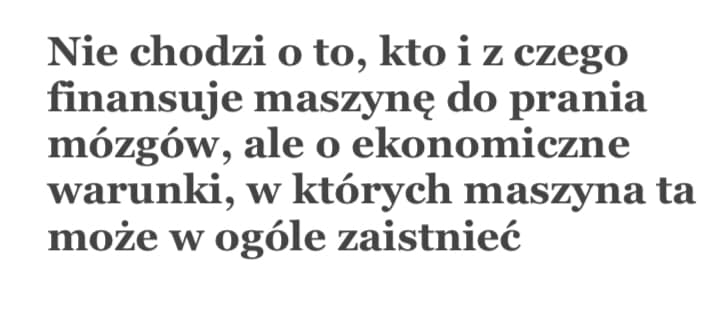
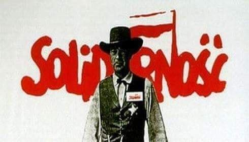
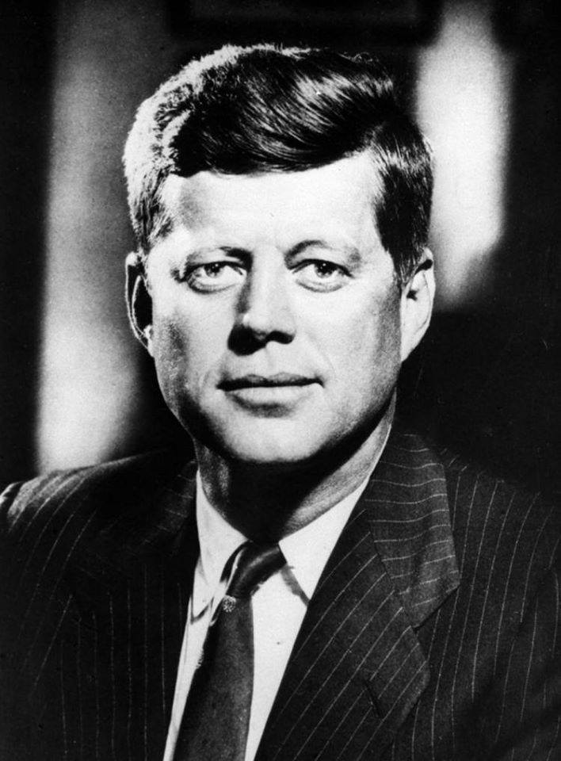
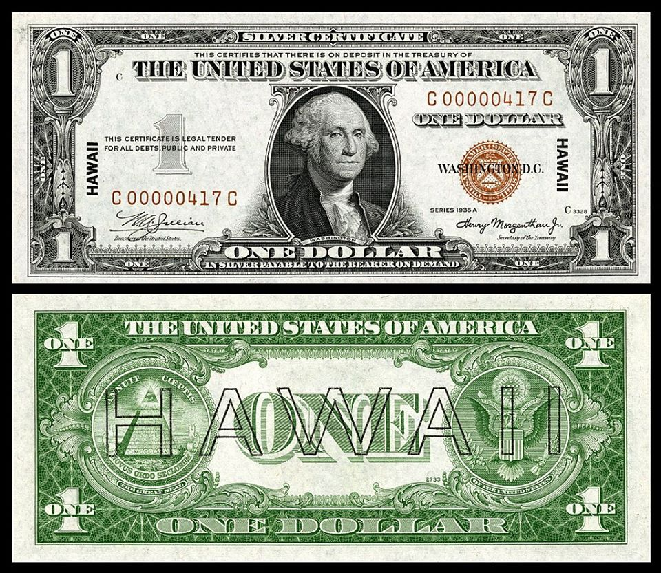
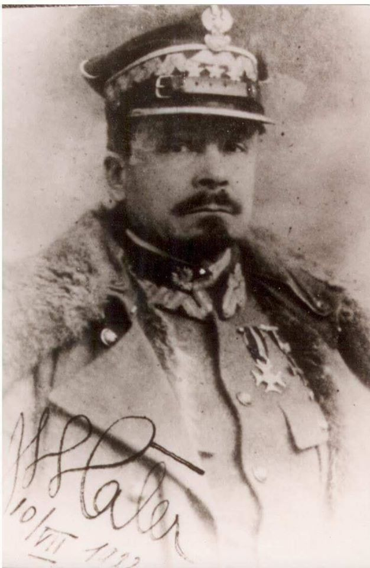
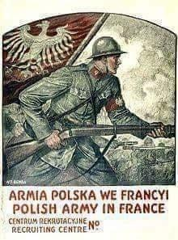
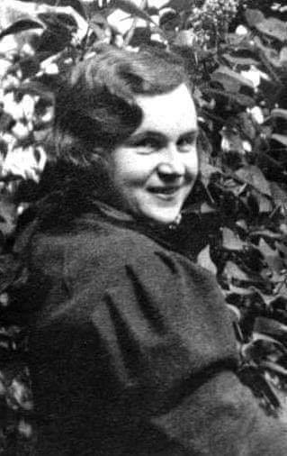

### 2020

  

---

Powyższe sformułowanie powinno nam przypomnieć, że przez ostatnie półtora stulecia bazę najlepiej rozumieli marksiści. Świadomość tego, że „w ostatecznej instancji” decydujące pozostają czynniki ekonomiczne, była w pewnych momentach historii mocno rozpowszechniona. W wielu krajach Europy Zachodniej narracja komunistyczna stanowiła przez długie dziesięciolecia podstawę grupowej tożsamości klas ludowych – tych samych, które dzisiaj wpadają w nacjonalistyczną hipnozę i głosują na prawicowych populistów. Ta historyczna przemiana została wspaniale opisana przez Didiera Eribona. W „Powrocie do Reims” pisarz przedstawia swoją rodzinę na szerokim tle historii północnofrancuskiego proletariatu i powiada tak: marksizm, który dominował przez długie lata, zwalczał nierówności ekonomiczne i klasowe, a inne walki – zwłaszcza ruchy kulturowe – uznawał za drugorzędne...

  

---

Schemat mapy chińskiej kolej* przypominającej trochę schemat metra, tyle że w wersji kontynentalnej (kto jeździł w Chinach koleją, wie o czym piszę.

Wiele ten schemat może powiedzieć o #Chiny jako kraju i (właściwie) kontynencie.

Aby nie wywoływać niepotrzebnego zdziwienia (iż większość kolei koncentruje się na wschodzie kraju) dołączam mapkę pokazującą gęstość zaludnienia w Chinach i obrazującą rozkład zamieszkania w poszczególnych obszarach kraju.

94% ludności zamieszkuje obszar czerwony (czyli Wschód kraju) a zaledwie 6% obszar pomarańczowy (Zachód)...

*Mowa oczywiście o kolei pasażerskiej.

** Więcej takich (być może oczywistych, a być może jednak, wcale nie tak oczywistych) spostrzeżen i konstatacji, na zajęciach w ramach programu "Biznes chiński" w Akademii Leona Koźmińskiego.

  

  

---

Negative interest rates could be needed for a ‘V’ recovery, Fed economist says

- Policymakers “will need to consider negative interest rates” in getting the U.S. economy back to health, St. Louis Fed economist Yi Wen said in a paper.
- Most Fed officials have doubted they would go negative like Japan and parts of Europe.
- The analysis is not binding in any way on the Fed, and Chairman Jerome Powell recently said he doesn’t see below-zero policy rates as “an appropriate tool.”

### 1989

Tu nie chodzi o wojnę handlową, tylko o coś znacznie większego: powrót do demokratycznych zasad, które Ameryka starała się narzucić światu po II wojnie światowej. Gdy rozpadł się Związek Radziecki, uwierzyliśmy, że otwarty rynek wystarczy, aby demokracja i rządy prawa same stopniowo objęły cały glob. Nie zrozumieliśmy, co oznaczała masakra na placu Niebiańskiego Spokoju 4 czerwca 1989 r. – Komunistyczna Partia Chin pokazała, że nigdy na to nie pozwoli. Nie tylko wewnątrz kraju, ale też stopniowo będzie osłabiać system oparty na zachodnich wartościach poza swoimi granicami. Ameryka i szerzej Zachód wcale zresztą nie wymagały od Chin wywiązywania się z zobowiązań podjętych w ramach międzynarodowych organizacji współpracy gospodarczej jak WTO. Owszem, nakładano sankcje na mniejsze kraje, jak Iran, Korea Północna czy nawet Rosja, ale nie na Chiny. To zachęciło Pekin do zaprzęgnięcia całej potęgi internetu do realizacji swoich celów. Mówimy więc o starciu wręcz tytanicznym.

---

Przeprowadzono pierwszą turę wyborów do Sejmu i Senatu. Tego dnia - jak pisał prof. Antoni Dudek - "miliony Polaków zadały przy pomocy kartki wyborczej śmiertelny cios komunistycznej dyktaturze".
Wybory przeprowadzone tego dnia były efektem obrad Okrągłego Stołu,przy którym władze komunistyczne zdecydowały się ns porozumienie z opozycją solidarnościową.
Tak o tym wydarzeniu pisał profesor Andrzej Paczkowski:
"Po długich targach ustalono,że wszystkie miejsca w Senacie oraz
35 proc. miejsc w Sejmie obsadzonych będzie w wyniku wolnej gry wyborczej, natomiast pozostałe 65 proc. posłów zostanie wybranych z list o charakterze +kurialnym+ podzielonych między PZPR i jego sojuszników z PRON (w tym 35 z listy krajowej). W ten sposób komuniści zapewniali sobie, jak sądzono, +kontrolny pakiet+ mandatów wystarczający do bieżącego zarządzania państwem, ale praktycznie uniemożliwiali jednostronne zmiany o charakterze konstytucyjnym
wymagające 2/3 głosów".
"Dzięki ograniczonemu do 100 miejsc składowi Senatu - dodawał prof. Paczkowski - stwarzali też ogromną szansę wyboru na prezydenta
popieranego przez siebie kandydata, ponieważ elekcji tej miały dokonywać obie izby połączone w Zgromadzenie Narodowe. W ten sposób, wedle litery zapisu, wybory stawały się w istocie +niekonfrontacyjne+, przy czym
PZPR uważała, iż formuła ta oznacza także łagodną kampanię wyborczą".
Ustalenia zawarte wówczas w sprawie
wyborów parlamentarnych były jednorazowe.
Kolejne wybory miały być już przeprowadzone według zasad całkowicie demokratycznych.
Wygrane wybory tak oto podsumowała w telewizji aktorka Joanna Szczepkowska:
"Proszę państwa,4 czerwca 1989 roku upadł w Polsce komunizm". Teoretycznie..

  

---

### 1965

Nowosybirsk. Most Październikowy/Komunalny nad rzeką Ob (Октя́брьский (Коммуна́льный). Kapitan Walentin Priwałow przeleciał pod tym mostem pilotując samolot MiG-17. Lecąc z prędkością 700 km/h musiał wlecieć w „okno” o szerokości 120 i wysokości 30m i zaraz potem, w ciągu 5 sekund poderwać samolot pionowo do góry, żeby nie wpakować się w most kolejowy. Było wielu świadków tego wydarzenia i incydent o mało co nie kosztował Priwałowa kompanią karną, degradacją a nawet więzieniem. Wielu „twardogłowych” widziało w tym czynie sabotaż. Sam Priwałow wspominał, że chciał po prostu spróbować tego o czym z kolegami stacjonującymi w tym czasie na lotnisku Podkamiennaja Tunguska, często rozmawiali odpoczywając na plaży nad rzeką Ob. Incydent otarł się o ministra obrony ZSRR, marszałka Malinowskiego. Wydano nakaz aresztowania „kapitana-chuligana”. Za pilotem ujął się dowódca lotnictwa marszałek Jewgienij Sawicki, dwukrotny Bohater Związku Radzieckiego, bohater Wojny Ojczyźnianej, który najlepiej rozumiał sytuację w lotnictwie. Lata 60-te były okresem intensywnej redukcji sił zbrojnych ZSRR, które zostały liczebnie zredukowane prawie o 60%. Nikita Chruszczow, zafascynowany i wręcz opętany wizją rozwoju broni rakietowej., która miała zastąpić myśliwce i bombowce w lotnictwie. Piloci dywizjonu, w którym służył Priwałow zajmowali się głównie symulowaniem ataków na obiekty militarne i przemysłowe ZSRR odgrywając oczywiście rolę „bandytów”. Kapitan Priwałow został finalnie oczyszczony z zarzutów i przywrócony do służby. Na poczet kary zaliczono mu to czym już został ukarany czyli kilka tygodni aresztu i zawieszenie w lotach. Walentin Priwałow kontynuował karierę w lotnictwie wojskowym oraz piastował funkcje instruktora w szkołach lotniczych. Pod koniec lat 70-tych z powodu stwierdzonej choroby serca musiał opuścić wojsko ale z lotnictwem się nie rozstał kontynuując służbę w lotnictwie cywilnym. Zdjęcie nie jest autentyczne. To jest kolaż, który zamówiony dla Muzeum Nowosybirska.

  

---

  

---

### 1963

Prezydent USA John F. Kennedy wydał rozporządzenie przywracające parytet kruszcu i prawo emisji pieniądza dla rządu amerykańskiego. Według jednej z hipotez mogło to być powodem zamachu na życie prezydenta 22 listopada tego roku.

Cisza, jaka 22 listopada 1963 roku zapadła nad Dealey Plaza w Dallas, trwała kilka sekund dłużej po tym, jak przebrzmiał huk ostatniego strzału. Przerwał ją ryk silnika prezydenckiej limuzyny, która najpierw zwolniła, a potem błyskawicznie weszła na najwyższe obroty. Dopiero wtedy zaciekawienie ustąpiło miejsca panice, jeszcze nie przerażeniu. Nikt nie widział, czego jest świadkiem. O 12.31 w tłum poszła informacja, że trzydziesty piąty prezydent Stanów Zjednoczonych został ranny. Reakcje ludzi widać doskonale na 26-sekundowym słynnym amatorskim filmie Abrahama Zaprudera. Jeszcze tego samego dnia za pewnik uznano, że winnym zabójstwa Johna F. Kennedy’ego oraz zranienia gubernatora Teksasu Johna Connally’ego jest schwytany tuż przed 14.00 Lee Harvey Oswald. Postrzelony dzień później w areszcie przez Jacka Ruby’ego zmarł w szpitalu Parkland Hospital 48 godzin po stwierdzeniu zgonu prezydenta. To fakty. Cała reszta do dziś jest jedną wielką spekulacją.

Wśród dziesiątek spiskowych teorii na temat powodów, dla których zginął prezydent Kennedy, jedna tylko nie doczekała się pełnego opisu. Przez dziesięciolecia uważano ją za najbardziej niedorzeczną. Według niej „zlecenie na Kennedy’ego” miało przyjść z kręgów potężnych bankierów, którym prezydent chciał odebrać władzę nad pieniądzem. I tu dochodzimy do sedna – abstrahując od niedorzeczności „teorii bankiera”, żaden kolejny prezydent nie odważył się w sposób, w jaki próbował to zrobić Kennedy, podnieść ręki na amerykański system finansowy (de facto Rezerwę Federalną). Trzydziesty piąty gospodarz Białego Domu był ostatnim, który otwarcie zamierzał przywrócić systemowi równowagę.

Kennedy nie był prezydentem, który zwyciężył konkretnym programem gospodarczym. Był politykiem czystej krwi. Politykiem, który znajdował się jednak pod silnym wpływem Douglasa Dillona, sekretarza skarbu jasno deklarującego konieczność odzyskania władzy nad emisją pieniądza przez rząd federalny. Sojusznikiem Dillona był Orville L. Freeman, sekretarz ds. handlu. Obaj panowie skutecznie zarazili Kennedy’ego ideą przywrócenia waluty opartej na parytecie kruszcu, która odbierałaby Fed prawo emitowania „pustego” dolara.

Parytet złota czy srebra budzi skrajne emocje, ale wciąż pozostaje w sferze teorii. Skąd się wziął? W 1944 roku na konferencji w Bretton Woods 730 delegatów z 44 państw alianckich podpisało porozumienie, które nakładało na każde państwo m.in. obowiązek stosowania polityki monetarnej opartej na parytecie złota i utrzymania kursów wymiany w jednoprocentowym przedziale wahań. Szybko jednak okazało się, że porozumienie to jedno, a praktyka co innego – na przełomie lat 40. i 50. XX wieku rozpoczęła się – napędzana kredytami – globalna dominacja dolara, zmuszająca banki centralne do interwencji z pominięciem ustaleń Bretton Woods. „Pusty” pieniądz, choć nikt wówczas nie odważył się na użycie tego terminu, stał się faktem. Jego jedynym dysponentem był stworzony w 1913 roku Fed.

Ten mało zdrowy układ, dający Rezerwie Federalnej praktyczną władzę w kraju i poza nim, prezydent mógł przeciąć, używając dekretu. W Stanach Zjednoczonych dekret prezydencki ma ogromną siłę – ogłaszany jest w przypadkach szczególnych, w sytuacji zagrożenia, gdy nie ma czasu na obrady parlamentu. To polecenie, za które prezydent bierze pełną odpowiedzialność i które – co najważniejsze – nie wymaga autoryzacji przez Kongres, a musi być natychmiast wykonane. Na przykład dekret 9066 wydany w lutym 1942 roku przez Franklina Delano Roosevelta, całkowicie bezprawny, nakazał internowanie amerykańskich obywateli japońskiego pochodzenia.

Prezydenci rzadko sięgali po dekrety w sferze gospodarczej. Wyjątek zrobił Harry Truman, którego dekret 10289 dał sekretarzowi skarbu prawo do kreowania polityki gospodarczej i monetarnej bez absorbowania urzędującego w Białym Domu gospodarza jakimiś „zbędnymi” ratyfikacjami czy aprobatami.

Będący pod wpływem Dillona i Freemana Kennedy, podobnie jak jego poprzednik Dwight Eisenhower, nie zgadzał się na sytuację, w której prezydent zostawał de facto figurantem rządu cieni. Poszedł na otwartą konfrontację.

Szefem Fed podczas jego prezydentury był William McChesney Martin Jr., człowiek wielkich wpływów i równie wielkiej niechęci do Johna F. Kennedy’ego. Dyskusję o urealnieniu polityki monetarnej z nim wziął na siebie Douglas Dillon. O negocjacjach w sprawie jej kształtu wiadomo tylko, że się odbyły. Zakończyły się postawieniem ultimatum w postaci groźby wydania dekretu prezydenckiego. Tak też się stało – skoro urząd prezydenta nie mógł w sposób pokojowy odzyskać wpływu na emisję pieniądza, Kennedy 4 czerwca 1963 roku wydał dekret o numerze 11110. Na pierwszy rzut oka naprawiał on nieścisłości dekretu 10289 Trumana, ale tak naprawdę przenicowywał cały system monetarny USA.

Zgodnie z poleceniem Białego Domu departament skarbu miał wypuścić certyfikaty (banknoty) na całe posiadane przez Stany srebro. Tylko taki papier mógł być środkiem płatniczym. Odbierał Rezerwie Federalnej prawo do emitowania „pustego” pieniądza, bez realnej wartości. Po prostu na rynku nie mogło być więcej pieniądza niż ilość, która miała pokrycie w srebrze, a całość miał kontrolować rząd federalny. Dlaczego srebro? Prezydent, idąc za opinią doradców, uznał, że metal ten jest o wiele bardziej odporny na spekulacje niż złoto.

Kennedy dopiął swego: rząd federalny wydrukował 4,3 miliarda dolarów, z czego do obiegu puścił nieco ponad 500 mln dolarów w nominałach 2 dolary i 5 dolarów. Banknoty 10- i 20-dolarowe zostały w magazynach. Była to pierwsza od pół wieku emisja pieniędzy przez skarb państwa z pominięciem Fed! Na banknocie zamiast słynnego Federal Reserve Note znalazł się napis United States Note. Dziś banknoty te mają ogromną wartość kolekcjonerską, ich cena tysiąckrotnie przewyższa nominał, jaki się na nich znajduje. Dlaczego?

Pieniądze oparte na srebrze… zniknęły.

Dekret prezydencki 11110, który odbierał Rezerwie Federalnej prawo do pożyczania rządowi na procent „własnych” pieniędzy, był z punktu widzenia Fed wyjątkowo niebezpieczny. Nie tylko oznaczał koniec Rezerwy Federalnej, ale i krach części banków inwestycyjnych. To jedyne rozporządzenie, które nie zostało wykonane. Po śmierci prezydenta wręcz zignorowano jego istnienie. Certyfikaty płatnicze oparte na srebrze wycofano z obiegu, 10- i 20-dolarowe banknoty w ogóle nie ujrzały światła dziennego. Mało tego, rząd wyprzedał również rezerwy srebra, pozbawiając emitenta waluty punktu odniesienia. Próba przywrócenia zdrowej równowagi spełzła na niczym.

Badająca okoliczności zabójstwa prezydenta Komisja Warrena przez 11 miesięcy przesłuchała 552 świadków i przebadała ponad 3 tys. dowodów rzeczowych. W liczącym 889 stron końcowym raporcie uznała, że Oswald i Ruby działali sami, co z miejsca obudziło spekulacje na temat prawdziwych mocodawców zlecenia na zabicie Kennedy’ego – w tym rozważania o udziale w zamachu lobby finansowego. Ba, zwolennicy spisku bankierskiego przypomnieli sobie, że w historii USA podobne wydarzenie miało już miejsce: w 1923 roku został otruty kongresman Louis Thomas McFadden, przewodniczący Komisji Bankowości i Waluty Kongresu USA, były bankier, który otwarcie poszedł na wojnę z drukującą prywatne pieniądze Rezerwą Federalną i był o włos od przeforsowania tzw. McFadden Act ograniczającego wszechwładzę banków oraz Fed.

12 listopada 1963 roku John Fitzgerald Kennedy miał powiedzieć do studentów Uniwersytetu Columbia: „Stanowisko prezydenta zostało użyte do zorganizowania spisku, który ma zniszczyć wolność. Zanim opuszczę Biały Dom, muszę o tym poinformować amerykańskich obywateli”. Miał, ponieważ nie zachowało się nagranie ze spotkania, a pamięć ludzka bywa ulotna. Dziesięć dni później już nie żył.

  

  

---

### 1960

W Londynie w wieku 87 lat zmarł Józef Haller de Hallenburg - generał broni Wojska Polskiego, dowódca II Brygady Legionów Polskich, harcmistrz, przewodniczący ZHP (1920-1923), prezes Komitetu PCK (1920-1926), działacz polityczny i społeczny, „rycerz chrześcijański z Królową Korony Polskiej w sercu i na ryngrafie”, dowódca "Błękitnej Armii" we Francji, brat stryjeczny gen. Stanisława Hallera, kawaler Orderów: Orła Białego i Virtuti Militari. Pochowany został na cmentarzu Gunnersbury w Londynie. Pogrzeb był wielką manifestacją Polaków. Umarł
człowiek, którego dewizą było hasło: „Wola narodu jest moim prawem”, któremu „Bóg, Honor, Ojczyzna” wskazywały drogę przez całe życie. Umarł jako legendarny „Błękitny Generał”. W 1993 roku z inicjatywy harcerzy szczątki generała sprowadzono do Polski na Jasną Górę, a następnie zostały one złożone w kościele garnizonowym pod wezwaniem św. Agnieszki w Krakowie.

  

### 1917

We Francji dekretem prezydenta Francji Raymonda Poincárego powstała "Błękitna Armia" generała Józefa Hallera zwana tak od koloru mundurów jakie nosili jej żołnierze.
We wrześniu 1919 roku Błękitną Armię
przeformowano, a dywizje zostały włączone do Wojska Polskiego. Jednostki te walczyły w wojnie polsko-bolszewickiej, a po okresie
służby pokojowej - w wojnie obronnej 1939 roku. W okresie wzrostu napięcia z Niemcami, przed podpisaniem Traktatu Wersalskiego oddziały Błękitnej Armii zostały przerzucone na granicę zachodnią, tworząc główne siły
Frontu Południowo-Zachodniego i
Południowego. Generał Haller w 1920 roku został Generalnym Inspektorem Armii Ochotniczej. Podczas Bitwy Warszawskiej dowodził wojskami broniącymi przedpola stolicy, wchodził też w skład Rady Obrony Państwa, a następnie był dowódcą Frontu
Północno-Wschodniego. Zmarły na emigracji w Londynie w 1960 roku, Józef Haller, w czasie drugiej wojny światowej był członkiem rządu RP na emigracji, pełnił funkcję ministra oświaty w rządzie Władysława Sikorskiego. W
1993 roku prochy generała Hallera zostały sprowadzone do kraju i spoczęły w krypcie kościoła Świętej Agnieszki w Krakowie.

  

### 1904

W Radomiu urodziła się Jadwiga Piekarska, pseudonim ,,Basia'' - łączniczka, uczestniczka polskiej wojny obronnej w 1939 roku i powstania warszawskiego, pośmiertnie awansowana do stopnia kapitana oraz odznaczona Krzyżem Virtuti Militari V klasy.

Od 1 września 1939 roku była telegrafistką w Sztabie Naczelnego Wodza, po jego ewakuacji pozostała w stolicy pełniąc służbę w Sztabie Obrony Warszawy. W konspiracji od września 1939 roku łączniczka Komendanta Głównego ZWZ-AK. Obowiązki te pełniła przy wszystkich kolejnych komendantach: gen. Michale Karaszewiczu-Tokarzewskim, gen. Stefanie Roweckim oraz gen. Tadeuszu Komorowskim. W czasie powstania należała do oddziału Komendy Głównej Armii Krajowej - Oddział V (Dowodzenie i Łączność) - Wydział V-k (Łączność konspiracyjna). Przeszła szlakiem bojowym: Wola - Stare Miasto - kanały - Śródmieście Północ. Poległa 9 września 1944 roku podczas bombardowania w gmachu PKO na rogu ul. Jasnej i Świętokrzyskiej.
Odznaczenia: Krzyż Walecznych (1.09.1944), Złoty Krzyż Zasługi z Mieczami (pośmiertnie, 1.10.1944), Krzyż Virtuti Militari V klasy (pośmiertnie, rozkaz Dowódcy AK 512/BP z 2.10.1944).

  

### 1133

Papież Innocenty II (grafika) wydał bullę pt "Sacrosanta Romana"
Dokument ten zawierał zapisy zatwierdzające bezpośrednie zwierzchnictwo arcybiskupstwa magdeburskiego nad polskim kościołem katolickim i planowanymi diecezjami.

  

---

<a href="https://github.com/TomaszWaszczyk/historia.waszczyk.com/edit/master/src/content/june-4.md" target="_blank">Edytuj tę stronę dzieląc się własnymi notatkami!</a>
