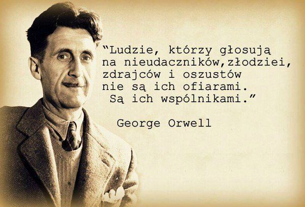
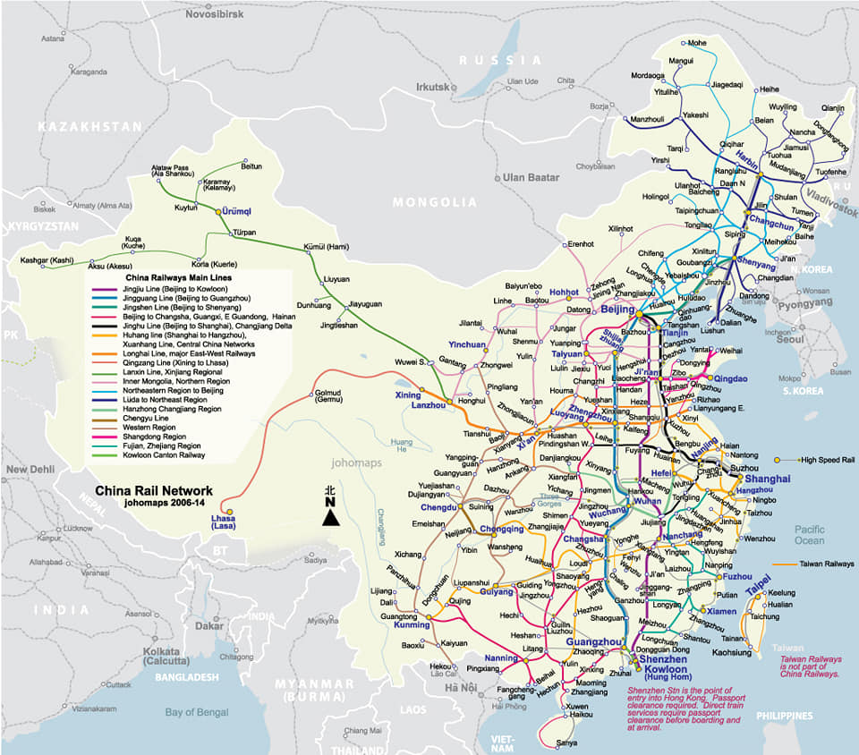
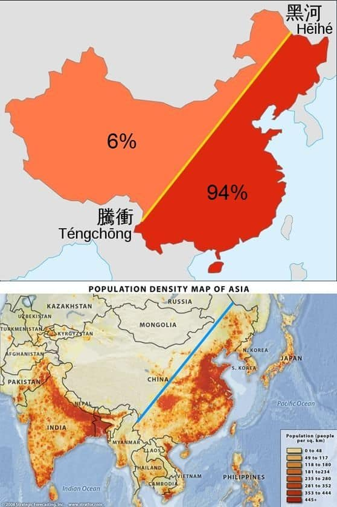
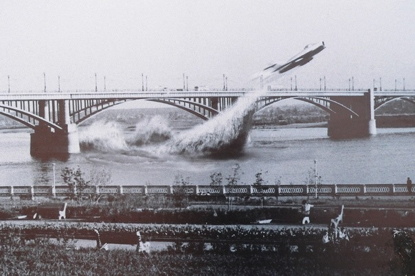
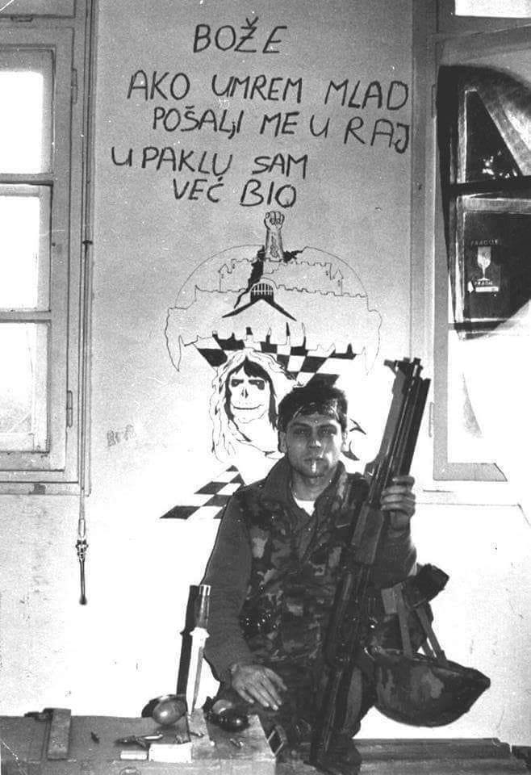

### 2020

  

---

Schemat mapy chińskiej kolej* przypominającej trochę schemat metra, tyle że w wersji kontynentalnej (kto jeździł w Chinach koleją, wie o czym piszę.

Wiele ten schemat może powiedzieć o #Chiny jako kraju i (właściwie) kontynencie.

Aby nie wywoływać niepotrzebnego zdziwienia (iż większość kolei koncentruje się na wschodzie kraju) dołączam mapkę pokazującą gęstość zaludnienia w Chinach i obrazującą rozkład zamieszkania w poszczególnych obszarach kraju.

94% ludności zamieszkuje obszar czerwony (czyli Wschód kraju) a zaledwie 6% obszar pomarańczowy (Zachód)...

*Mowa oczywiście o kolei pasażerskiej.

** Więcej takich (być może oczywistych, a być może jednak, wcale nie tak oczywistych) spostrzeżen i konstatacji, na zajęciach w ramach programu "Biznes chiński" w Akademii Leona Koźmińskiego.

(I a zajęciach na innych uczelniach (i nie tylko uczelniach)).

  

  

### 1989

Tu nie chodzi o wojnę handlową, tylko o coś znacznie większego: powrót do demokratycznych zasad, które Ameryka starała się narzucić światu po II wojnie światowej. Gdy rozpadł się Związek Radziecki, uwierzyliśmy, że otwarty rynek wystarczy, aby demokracja i rządy prawa same stopniowo objęły cały glob. Nie zrozumieliśmy, co oznaczała masakra na placu Niebiańskiego Spokoju 4 czerwca 1989 r. – Komunistyczna Partia Chin pokazała, że nigdy na to nie pozwoli. Nie tylko wewnątrz kraju, ale też stopniowo będzie osłabiać system oparty na zachodnich wartościach poza swoimi granicami. Ameryka i szerzej Zachód wcale zresztą nie wymagały od Chin wywiązywania się z zobowiązań podjętych w ramach międzynarodowych organizacji współpracy gospodarczej jak WTO. Owszem, nakładano sankcje na mniejsze kraje, jak Iran, Korea Północna czy nawet Rosja, ale nie na Chiny. To zachęciło Pekin do zaprzęgnięcia całej potęgi internetu do realizacji swoich celów. Mówimy więc o starciu wręcz tytanicznym.

### 1965

Nowosybirsk. Most Październikowy/Komunalny nad rzeką Ob (Октя́брьский (Коммуна́льный). Kapitan Walentin Priwałow przeleciał pod tym mostem pilotując samolot MiG-17. Lecąc z prędkością 700 km/h musiał wlecieć w „okno” o szerokości 120 i wysokości 30m i zaraz potem, w ciągu 5 sekund poderwać samolot pionowo do góry, żeby nie wpakować się w most kolejowy. Było wielu świadków tego wydarzenia i incydent o mało co nie kosztował Priwałowa kompanią karną, degradacją a nawet więzieniem. Wielu „twardogłowych” widziało w tym czynie sabotaż. Sam Priwałow wspominał, że chciał po prostu spróbować tego o czym z kolegami stacjonującymi w tym czasie na lotnisku Podkamiennaja Tunguska, często rozmawiali odpoczywając na plaży nad rzeką Ob. Incydent otarł się o ministra obrony ZSRR, marszałka Malinowskiego. Wydano nakaz aresztowania „kapitana-chuligana”. Za pilotem ujął się dowódca lotnictwa marszałek Jewgienij Sawicki, dwukrotny Bohater Związku Radzieckiego, bohater Wojny Ojczyźnianej, który najlepiej rozumiał sytuację w lotnictwie. Lata 60-te były okresem intensywnej redukcji sił zbrojnych ZSRR, które zostały liczebnie zredukowane prawie o 60%. Nikita Chruszczow, zafascynowany i wręcz opętany wizją rozwoju broni rakietowej., która miała zastąpić myśliwce i bombowce w lotnictwie. Piloci dywizjonu, w którym służył Priwałow zajmowali się głównie symulowaniem ataków na obiekty militarne i przemysłowe ZSRR odgrywając oczywiście rolę „bandytów”. Kapitan Priwałow został finalnie oczyszczony z zarzutów i przywrócony do służby. Na poczet kary zaliczono mu to czym już został ukarany czyli kilka tygodni aresztu i zawieszenie w lotach. Walentin Priwałow kontynuował karierę w lotnictwie wojskowym oraz piastował funkcje instruktora w szkołach lotniczych. Pod koniec lat 70-tych z powodu stwierdzonej choroby serca musiał opuścić wojsko ale z lotnictwem się nie rozstał kontynuując służbę w lotnictwie cywilnym. Zdjęcie nie jest autentyczne. To jest kolaż, który zamówiony dla Muzeum Nowosybirska.

  

---

  

---

---

<a href="https://github.com/TomaszWaszczyk/historia.waszczyk.com/edit/master/src/content/june-4.md" target="_blank">Edytuj tę stronę dzieląc się własnymi notatkami!</a>
