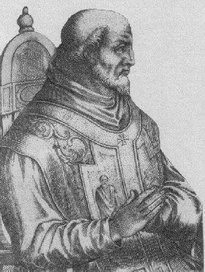

### 2020

  

---

Schemat mapy chińskiej kolej* przypominającej trochę schemat metra, tyle że w wersji kontynentalnej (kto jeździł w Chinach koleją, wie o czym piszę.

Wiele ten schemat może powiedzieć o #Chiny jako kraju i (właściwie) kontynencie.

Aby nie wywoływać niepotrzebnego zdziwienia (iż większość kolei koncentruje się na wschodzie kraju) dołączam mapkę pokazującą gęstość zaludnienia w Chinach i obrazującą rozkład zamieszkania w poszczególnych obszarach kraju.

94% ludności zamieszkuje obszar czerwony (czyli Wschód kraju) a zaledwie 6% obszar pomarańczowy (Zachód)...

*Mowa oczywiście o kolei pasażerskiej.

** Więcej takich (być może oczywistych, a być może jednak, wcale nie tak oczywistych) spostrzeżen i konstatacji, na zajęciach w ramach programu "Biznes chiński" w Akademii Leona Koźmińskiego.

  

  

---

Negative interest rates could be needed for a ‘V’ recovery, Fed economist says

- Policymakers “will need to consider negative interest rates” in getting the U.S. economy back to health, St. Louis Fed economist Yi Wen said in a paper.
- Most Fed officials have doubted they would go negative like Japan and parts of Europe.
- The analysis is not binding in any way on the Fed, and Chairman Jerome Powell recently said he doesn’t see below-zero policy rates as “an appropriate tool.”

### 1989

Tu nie chodzi o wojnę handlową, tylko o coś znacznie większego: powrót do demokratycznych zasad, które Ameryka starała się narzucić światu po II wojnie światowej. Gdy rozpadł się Związek Radziecki, uwierzyliśmy, że otwarty rynek wystarczy, aby demokracja i rządy prawa same stopniowo objęły cały glob. Nie zrozumieliśmy, co oznaczała masakra na placu Niebiańskiego Spokoju 4 czerwca 1989 r. – Komunistyczna Partia Chin pokazała, że nigdy na to nie pozwoli. Nie tylko wewnątrz kraju, ale też stopniowo będzie osłabiać system oparty na zachodnich wartościach poza swoimi granicami. Ameryka i szerzej Zachód wcale zresztą nie wymagały od Chin wywiązywania się z zobowiązań podjętych w ramach międzynarodowych organizacji współpracy gospodarczej jak WTO. Owszem, nakładano sankcje na mniejsze kraje, jak Iran, Korea Północna czy nawet Rosja, ale nie na Chiny. To zachęciło Pekin do zaprzęgnięcia całej potęgi internetu do realizacji swoich celów. Mówimy więc o starciu wręcz tytanicznym.

---

Przeprowadzono pierwszą turę wyborów do Sejmu i Senatu. Tego dnia - jak pisał prof. Antoni Dudek - "miliony Polaków zadały przy pomocy kartki wyborczej śmiertelny cios komunistycznej dyktaturze".
Wybory przeprowadzone tego dnia były efektem obrad Okrągłego Stołu,przy którym władze komunistyczne zdecydowały się ns porozumienie z opozycją solidarnościową.
Tak o tym wydarzeniu pisał profesor Andrzej Paczkowski:
"Po długich targach ustalono,że wszystkie miejsca w Senacie oraz
35 proc. miejsc w Sejmie obsadzonych będzie w wyniku wolnej gry wyborczej, natomiast pozostałe 65 proc. posłów zostanie wybranych z list o charakterze +kurialnym+ podzielonych między PZPR i jego sojuszników z PRON (w tym 35 z listy krajowej). W ten sposób komuniści zapewniali sobie, jak sądzono, +kontrolny pakiet+ mandatów wystarczający do bieżącego zarządzania państwem, ale praktycznie uniemożliwiali jednostronne zmiany o charakterze konstytucyjnym
wymagające 2/3 głosów".
"Dzięki ograniczonemu do 100 miejsc składowi Senatu - dodawał prof. Paczkowski - stwarzali też ogromną szansę wyboru na prezydenta
popieranego przez siebie kandydata, ponieważ elekcji tej miały dokonywać obie izby połączone w Zgromadzenie Narodowe. W ten sposób, wedle litery zapisu, wybory stawały się w istocie +niekonfrontacyjne+, przy czym
PZPR uważała, iż formuła ta oznacza także łagodną kampanię wyborczą".
Ustalenia zawarte wówczas w sprawie
wyborów parlamentarnych były jednorazowe.
Kolejne wybory miały być już przeprowadzone według zasad całkowicie demokratycznych.
Wygrane wybory tak oto podsumowała w telewizji aktorka Joanna Szczepkowska:
"Proszę państwa,4 czerwca 1989 roku upadł w Polsce komunizm". Teoretycznie..

  

---

### 1965

Nowosybirsk. Most Październikowy/Komunalny nad rzeką Ob (Октя́брьский (Коммуна́льный). Kapitan Walentin Priwałow przeleciał pod tym mostem pilotując samolot MiG-17. Lecąc z prędkością 700 km/h musiał wlecieć w „okno” o szerokości 120 i wysokości 30m i zaraz potem, w ciągu 5 sekund poderwać samolot pionowo do góry, żeby nie wpakować się w most kolejowy. Było wielu świadków tego wydarzenia i incydent o mało co nie kosztował Priwałowa kompanią karną, degradacją a nawet więzieniem. Wielu „twardogłowych” widziało w tym czynie sabotaż. Sam Priwałow wspominał, że chciał po prostu spróbować tego o czym z kolegami stacjonującymi w tym czasie na lotnisku Podkamiennaja Tunguska, często rozmawiali odpoczywając na plaży nad rzeką Ob. Incydent otarł się o ministra obrony ZSRR, marszałka Malinowskiego. Wydano nakaz aresztowania „kapitana-chuligana”. Za pilotem ujął się dowódca lotnictwa marszałek Jewgienij Sawicki, dwukrotny Bohater Związku Radzieckiego, bohater Wojny Ojczyźnianej, który najlepiej rozumiał sytuację w lotnictwie. Lata 60-te były okresem intensywnej redukcji sił zbrojnych ZSRR, które zostały liczebnie zredukowane prawie o 60%. Nikita Chruszczow, zafascynowany i wręcz opętany wizją rozwoju broni rakietowej., która miała zastąpić myśliwce i bombowce w lotnictwie. Piloci dywizjonu, w którym służył Priwałow zajmowali się głównie symulowaniem ataków na obiekty militarne i przemysłowe ZSRR odgrywając oczywiście rolę „bandytów”. Kapitan Priwałow został finalnie oczyszczony z zarzutów i przywrócony do służby. Na poczet kary zaliczono mu to czym już został ukarany czyli kilka tygodni aresztu i zawieszenie w lotach. Walentin Priwałow kontynuował karierę w lotnictwie wojskowym oraz piastował funkcje instruktora w szkołach lotniczych. Pod koniec lat 70-tych z powodu stwierdzonej choroby serca musiał opuścić wojsko ale z lotnictwem się nie rozstał kontynuując służbę w lotnictwie cywilnym. Zdjęcie nie jest autentyczne. To jest kolaż, który zamówiony dla Muzeum Nowosybirska.

  

---

  

---

### 1960

W Londynie w wieku 87 lat zmarł Józef Haller de Hallenburg - generał broni Wojska Polskiego, dowódca II Brygady Legionów Polskich, harcmistrz, przewodniczący ZHP (1920-1923), prezes Komitetu PCK (1920-1926), działacz polityczny i społeczny, „rycerz chrześcijański z Królową Korony Polskiej w sercu i na ryngrafie”, dowódca "Błękitnej Armii" we Francji, brat stryjeczny gen. Stanisława Hallera, kawaler Orderów: Orła Białego i Virtuti Militari. Pochowany został na cmentarzu Gunnersbury w Londynie. Pogrzeb był wielką manifestacją Polaków. Umarł
człowiek, którego dewizą było hasło: „Wola narodu jest moim prawem”, któremu „Bóg, Honor, Ojczyzna” wskazywały drogę przez całe życie. Umarł jako legendarny „Błękitny Generał”. W 1993 roku z inicjatywy harcerzy szczątki generała sprowadzono do Polski na Jasną Górę, a następnie zostały one złożone w kościele garnizonowym pod wezwaniem św. Agnieszki w Krakowie.

  

### 1917

We Francji dekretem prezydenta Francji Raymonda Poincárego powstała "Błękitna Armia" generała Józefa Hallera zwana tak od koloru mundurów jakie nosili jej żołnierze.
We wrześniu 1919 roku Błękitną Armię
przeformowano, a dywizje zostały włączone do Wojska Polskiego. Jednostki te walczyły w wojnie polsko-bolszewickiej, a po okresie
służby pokojowej - w wojnie obronnej 1939 roku. W okresie wzrostu napięcia z Niemcami, przed podpisaniem Traktatu Wersalskiego oddziały Błękitnej Armii zostały przerzucone na granicę zachodnią, tworząc główne siły
Frontu Południowo-Zachodniego i
Południowego. Generał Haller w 1920 roku został Generalnym Inspektorem Armii Ochotniczej. Podczas Bitwy Warszawskiej dowodził wojskami broniącymi przedpola stolicy, wchodził też w skład Rady Obrony Państwa, a następnie był dowódcą Frontu
Północno-Wschodniego. Zmarły na emigracji w Londynie w 1960 roku, Józef Haller, w czasie drugiej wojny światowej był członkiem rządu RP na emigracji, pełnił funkcję ministra oświaty w rządzie Władysława Sikorskiego. W
1993 roku prochy generała Hallera zostały sprowadzone do kraju i spoczęły w krypcie kościoła Świętej Agnieszki w Krakowie.

  

### 1904

W Radomiu urodziła się Jadwiga Piekarska, pseudonim ,,Basia'' - łączniczka, uczestniczka polskiej wojny obronnej w 1939 roku i powstania warszawskiego, pośmiertnie awansowana do stopnia kapitana oraz odznaczona Krzyżem Virtuti Militari V klasy.

Od 1 września 1939 roku była telegrafistką w Sztabie Naczelnego Wodza, po jego ewakuacji pozostała w stolicy pełniąc służbę w Sztabie Obrony Warszawy. W konspiracji od września 1939 roku łączniczka Komendanta Głównego ZWZ-AK. Obowiązki te pełniła przy wszystkich kolejnych komendantach: gen. Michale Karaszewiczu-Tokarzewskim, gen. Stefanie Roweckim oraz gen. Tadeuszu Komorowskim. W czasie powstania należała do oddziału Komendy Głównej Armii Krajowej - Oddział V (Dowodzenie i Łączność) - Wydział V-k (Łączność konspiracyjna). Przeszła szlakiem bojowym: Wola - Stare Miasto - kanały - Śródmieście Północ. Poległa 9 września 1944 roku podczas bombardowania w gmachu PKO na rogu ul. Jasnej i Świętokrzyskiej.
Odznaczenia: Krzyż Walecznych (1.09.1944), Złoty Krzyż Zasługi z Mieczami (pośmiertnie, 1.10.1944), Krzyż Virtuti Militari V klasy (pośmiertnie, rozkaz Dowódcy AK 512/BP z 2.10.1944).

  

### 1133

Papież Innocenty II (grafika) wydał bullę pt "Sacrosanta Romana"
Dokument ten zawierał zapisy zatwierdzające bezpośrednie zwierzchnictwo arcybiskupstwa magdeburskiego nad polskim kościołem katolickim i planowanymi diecezjami.

  

---

<a href="https://github.com/TomaszWaszczyk/historia.waszczyk.com/edit/master/src/content/june-4.md" target="_blank">Edytuj tę stronę dzieląc się własnymi notatkami!</a>
