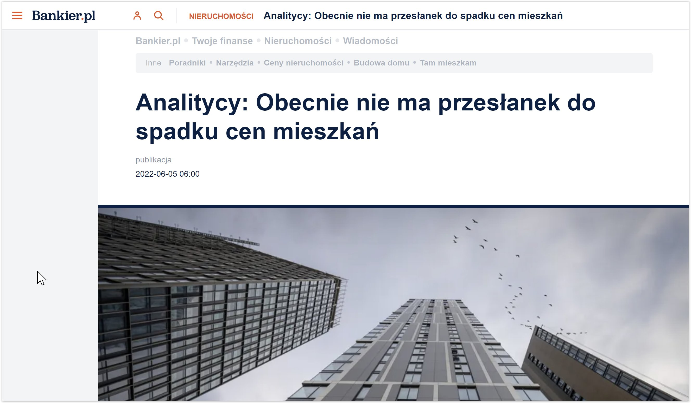

### 2023

  

---

An statement from US presidential candidate Robert Kennedy Jr.:

“In 1991-1992, we repeatedly promised the Russians verbally and in writing that if they withdraw 100,000 troops from Germany and allow the country to reunite within NATO, then we will not move NATO an inch east. Since then, we've moved the block a thousand miles east and opened up 14 new countries (note - now there are 15). The Russians warned then-Ambassador-now CIA chief Bill Burns that if NATO entered Ukraine, it would be a red line and should not be crossed. Let's put ourselves in the place of the Russians. My uncle (President Kennedy) always said, "Put yourself in your opponent's shoes."

---

"doktoraty" polskie:

<video width="640" height="480" controls>
<source src="./movies/june/sto_doktoratow.mp4" type="video/mp4">
Your browser does not support the video tag.
</video>

---

### 2022

pieniądze na KPO to nie są pieniądze na odbudowę po pandemii tylko kasa na wprowadzanie eurokomunizmu w Polsce ze szczególnym naciskiem na Zielony Ład! Te pieniądze przyniosą nam więcej szkody niż pożytku!

  

  

  

  

Propozycja NBP:

  

### 2020

> America will never be destroyed from the outside. If we falter and lose our freedoms, it will be because we destroyed ourselves. - Abraham Lincoln

---

  

  

---

  

---

Bezrobocie w Niemczech rośnie szybciej od prognoz. Emigranci mają powody do obaw

Nasi emigranci w Niemczech przeżywają obecnie nerwowe chwile. Dotychczasową pewność zatrudnienia zastępuje rosnąca fala bezrobocia. Co więcej, aktywność gospodarcza choć w maju odbiła w górę, to nadal jest na poziomach depresyjnych. Nie tylko w Niemczech, ale i we wszystkich wielkich gospodarkach Unii.

---

Pod przykrywką kolejnej tarczy antykryzysowej rząd stara się przeszkodzić firmom działać w warunkach rynkowych i ogranicza napływ kapitału zagranicznego.

Rząd ochoczo wydaje pieniądze na walkę ze skutkami pandemii. Zadłuża się w tym celu na potęgę i nawet chce skorzystać z funduszy pomocowych Unii Europejskiej, którą jeszcze niedawno prezydent nazwał „wyimaginowaną Wspólnotą", a jej flagę prominentni przedstawiciele rządu chowali podczas publicznych wystąpień. Rząd zmienił zdanie, bo lubi pieniądze podatników – nie tylko własnych. A będzie ich w przyszłości potrzebował na spłatę zaciąganych właśnie długów. Zajmuje się też kreacją pieniądza za pomocą operacji pomiędzy Ministerstwem Finansów, NBP, PFR i BGK.

---

Marek Zuber:

> BEZ SENSU

>Rada Polityki Pieniężnej po raz kolejny obniżyła stopy procentowe. Tym razem bez żadnego wcześniejszego sygnału, kompletnie znienacka. Kredytobiorcy się cieszą, ale patrząc na całą gospodarkę, także w szerszym aspekcie na sytuację owych kredytobiorców, to decyzja bez sensu.

> W cywilizowanych krajach, czyli choćby w Stanach Zjednoczonych, Japonii, albo całej strefie euro, bank centralny nie zaskakuje rynków finansowych. Bo i po co miałby to robić? Szeroko rozumiane rynki, będące krwioobiegiem dzisiejszej gospodarki, moją być partnerem dla władzy monetarnej. A właściwie odwrotnie: władza monetarna ma być partnerem dla rynków finansowych. Wbrew rozpowszechnianej po 2008 roku tezie, że uczestnicy owych rynków to w dużej mierze oszuści, którzy tylko czyhają na pieniądze drobnych ciułaczy, bez nich nie ma rozwoju gospodarczego. To na nich poszukiwany jest kapitał na inwestycje, to dzięki nim, można dokonywać wymiany walutowej, czy zabezpieczać się przed różnego rodzaju ryzykami. A dla banków, a system bankowy, chyba nie muszę tego tłumaczyć, stanowi szalenie ważne ogniowo rozwoju, nie tylko przez finansowanie firm, ale także przez możliwość budowania oszczędności, rynek pieniężny jest istotnym elementem zarządzania płynnością. Nawet, jeśli jest zaburzony w związku z różnego rodzaju kryzysami tak, jak to się działo wielokrotnie w ostatnich latach. Bank centralny wchodzi bardzo mocno w system rynków finansowych decydując istotnie o jednym z najważniejszych wyznaczników jego funkcjonowania: o koszcie pieniądza. Na niego właśnie bezpośrednio wpływają decyzje dotyczące stóp procentowych. A ponieważ, co do zasady w cywilizowanym kraju, celem i banku centralnego i uczestników jest rozwój, to brak przewidywalności decyzji władzy monetarnej temu rozwojowi nie służy. I nawet jeśli są tacy, którzy chcą destabilizacji, bo jest ona dla nich szansą na dodatkowy zysk, to z punktu widzenia beneficjentów rynków, czyli po prostu przedsiębiorstw, destabilizacja z pewnością jest czymś złym. I właśnie dlatego w owym cywilizowanym świecie jedna z podstawowych zasad brzmi: nie zaskakiwać. Dotyczy to nie tylko władzy monetarnej, ale w ogóle władzy.

> Ale nie u nas. Po przedostatniej obniżce stóp procentowych, tej po której główna stopa wynosiła 0,5%, z okolic Rady Polityki Pieniężnej ewidentnie napływały sygnały, że dalszych obniżek nie będzie. A pomimo tego w zeszłym tygodniu jednak na taki ruch się zdecydowano. Oczywiście wywołało to totalne zdziwienie. Na pewno taka niesygnalizowana decyzja nie pomogła systemowi bankowemu, który również mierzy się, a mierzył się będzie jeszcze bardziej w następnych miesiącach, z problemem efektów koronawirusa. Jeden z byłych szefów NBP dał do zrozumienia, że ta decyzja była efektem telefonu od któregoś polityka partii rządzącej. Nie mam pojęcia czy tak było, ale z pewnością nie tak powinno zachowywać się odpowiedzialne ciało. Tym bardziej, że po decyzji nie odbyła się konferencja prasowa. Podobno z powodu pandemii, ale, jak widzimy, pandemia nie przeszkadza organizować konferencji prezydentowi, premierowi, czy ministrom. Czy NBP jest bardziej narażony na zarażenie? A brak tej konferencji dodatkowo dolewa oliwy do ognia. Bo obok zaskoczenia samą decyzją mamy jeszcze drugi problem. A mianowicie wskazanie jej sensu.

> Teoretycznie RPP dała do zrozumienia, że stopy można ciąć, bo inflacja spada. To prawda spada, ale jest wciąż powyżej poziomu 2,5% rok/rok, czyli tego, co RPP chciałaby mieć. Oczywiście jak rozumiem, obniżka ma z jednej strony pokazać, ile to NBP nie robi dla walki z kryzysem, a z drugiej, być może, część członków Rady na prawdę wierzy w to, że ta obniżka jest jakimś istotnym elementem pomocy gospodarce. I nam wszystkim. Zakładam, że telefonu od polityków jednak nie było. Chociaż oczywiście nie mam pojęcia, czy nie.

> Problem w tym, że ta obniżka może narobić więcej złego, niż dobrego. Oczywiście potencjalnie może ona oznaczać tańszy kredyt. Bo stopy, a dokładnie jedna, czyli referencyjna, decyduje o stawce WIBOR, będącej podstawą oprocentowanie kredytów. Niby tak. Problem w tym, że tak niskie stopy, przypomnę, ta referencyjna spadła do poziomu 0,1%, wpływają negatywnie np. na zyski wypracowane przez banki. Ja wiem, że sporo Polaków uważa banki za instytucje nie do końca etyczne, ale jeśli system bankowy będzie miał problemy, to odczujemy to wszyscy. A poza tym, co w zasadzie jest już zapowiadane, banki będą próbowały odbić sobie straty gdzie indziej. Choćby podnosząc różnego rodzaju opłaty. Zresztą obniżenie oprocentowanie kredytów też może być fikcją, prawdopodobnie wzrosną bowiem marże. Czyli druga część, obok WIBORU, składająca się na oprocentowanie. Z punktu widzenia klienta nic się więc się zmieni, albo wręcz będzie jeszcze gorzej. Oczywiście mówię tu o nowych kredytach, w przypadku już zaciągniętych rzeczywiście raty będą nieco niższe. Tyle tylko, że np. dla firm dotkniętych koronawirusem problemem jest nie tyle wysokość rat co to, że załamały się przychody. I kilka złotych mniej do zapłacenia niewiele tu zmieni.

> Ale obniżenie stóp wpłynie także na inne kwestie. Choćby na naszą chęć do trzymania pieniędzy w banku. Na razie kolejne obniżki niewiele tu zmieniły, ale nie wiadomo, czy tak będzie dalej. Zresztą już dzisiaj coraz więcej z nas woli trzymać pieniądze na rachunkach bieżących niż na lokatach. A to z jednej strony oznacza dla banków niższy koszt, ale z drugiej mniejszą stabilność jeśli chodzi o posiadane środki.

> Niższe stopy to także relatywnie tańszy złoty. „Ale to pomaga eksportowi” powiedzą zwolennicy obniżki. No tak, tyle tylko, że problemem polskich eksporterów nie jest opłacalność eksportu, tylko załamanie popytu. Słabszy złoty niewiele tu więc pomoże. A słabszy złoty, to droższy import np. paliw. Tych negatywnych aspektów jest więcej.

> Obecna RPP nie po raz pierwszy popełnia błąd. W każdym razie moim zdaniem. Tym razem jednak jest to błąd kompletnie niezrozumiały. W dodatku oznacza działanie wbrew oczekiwaniom rynku. Po prostu ruch bez sensu.

---

  

  

### 2014

Na skwerze im. generała Jana Jura-Gorzechowskiego w Warszawie otworzono pierwszy w Polsce Ogród Sprawiedliwych.
Co roku sadzi się w nim drzewka dedykowane niezwykłym osobom pochodzącym z Europy i z poza jej granic, którzy ratowali życie innych lub występowali w obronie ludzkiej godności – w czasie nazizmu i komunizmu, ludobójstw, masowych mordów, zbrodni przeciw ludzkości, popełnionych w XX i XXI wieku. Towarzyszące im symboliczne kamienie opatrzone są inskrypcjami wyjaśniającymi za jaki czyn dana osoba została uhonorowana.
Jako pierwsi w warszawskim Ogrodzie upamiętnieni zostali: Marek Edelman, Magdalena Grodzka-Gużkowska, Jan Karski (na zdjęciu) , siostra Antonia Locatelli, Tadeusz Mazowiecki i Anna Politkowska.

  

### 1999

Rozpoczęła się trwająca do 17 czerwca 7 pielgrzymka papieża Jana Pawła II do Polski.
Papież złożył wtedy wizytę w Sejmie,a także odwiedził miasta :Gdańsk, Sopot , Pelplin, Elbląg , Licheń ,Bydgoszcz, Toruń, Ełk , Wigry, Augustów, Siedlce, Drohiczyn , Warszawa , Sandomierz , Zamość , Radzymin , Łowicz , Sosnowiec, Kraków, Stary Sącz, Wadowice , Gliwice, Częstochowa .
Była to najdłuższa pielgrzymka Jana Pawła II do Polski.
Hasłem przewodnim tej pielgrzymki było hasło "Bóg jest milością".

  

### 1992

Noc teczek – sformułowanie używane w publicystyce na określenie wydarzeń nocy z 4 czerwca na 5 czerwca 1992, związanych z odwołaniem rządu Jana Olszewskiego. Przyczyną odwołania była sprawa lustracji życia publicznego w Polsce. Było to jedno z najostrzejszych przesileń w polskiej polityce.

4 czerwca, w południe Kancelaria Prezydenta RP przesłała do Polskiej Agencji Prasowej oświadczenie, w którym Lech Wałęsa przyznał się do współpracy ze Służbą Bezpieczeństwa.

Po kilkudziesięciu minutach oświadczenie zostało jednak wycofane, a Wałęsa uznał materiały SB za „sfabrykowane”. Wałęsa po prostu zorientował się, że w Sejmie ukształtowała się większość zdolna do obalenia rządu. W Sejmie rozpoczęły się gorączkowe konsultacje Wałęsy z liderami ugrupowań przeciwnych rządowi (Kongres Liberalno-Demokratyczny, Konfederacja Polski Niepodległej, Unia Demokratyczna) i Polskiego Stronnictwa Ludowego.

W sejmowym gabinecie Lecha Wałęsy odbyła się nocna, niejawna narada, z udziałem m.in. Tadeusza Mazowieckiego, Bronisława Geremka, Mieczysława Wachowskiego, Donalda Tuska, Leszka Moczulskiego, Waldemara Pawlaka, Stefana Niesiołowskiego i Ryszarda Bugaja[6]. W trakcie konsultacji ukształtowała się tymczasowa koalicja (przy poparciu Sojuszu Lewicy Demokratycznej) zdolna do odwołania rządu Olszewskiego. Większość parlamentarzystów uznała, że ujawnienie przeszłości niektórych ważnych osób naruszy ich pozycje[2]. Zwolennicy odwołania Olszewskiego (politycy, jak i dziennikarze) rozpuszczali plotki o użyciu przez rząd Jednostek Nadwiślańskich, co miało być elementem rzekomego puczu. Późniejsze dochodzenie przeprowadzone przez komisję sejmową nie potwierdziło tego rodzaju zarzutów, a późniejsze postępowania lustracyjne potwierdziły większość ustaleń Antoniego Macierewicza.

Sformułowanie noc teczek nie oddaje charakteru tamtych wydarzeń. Teczki, z których Antoni Macierewicz sporządził raport, cały czas leżały w archiwum służb specjalnych[10]. Jedynymi dokumentami jakie otrzymali politycy (szefowie klubów) były zalakowane koperty z listami przygotowanymi na podstawie uchwały Sejmu z 28 maja 1992[6]. Koperty zostały im dostarczone po godzinie 10 rano, a nie w nocy, na co wskazywałoby sformułowanie.

  

Fragmenty artykułu na Wikipedii, Noc Teczek

  

### 1989

  

Lata 80s były jednymi z najstraszniejszych w historii PL. To dekada recesji, kartek, biedy, drenowania społeczeństwa. Stan wojenny złamał naród, wystraszył, wytworzył próżnię społeczną, amoralny familizm, indyferencję. Ludzie żyli tylko w bliskości z rodziną, stracili wiarę w politykę i opozycję. Ponad 200 tys. zbrodniczych wyroków z 1981/82 junty na podstawie dekretów (wzorowanych na stalinowskich) zrobiło swoje. Na mnie wrażenie robiły opowieści, jak 13 grudnia aresztowano ojca znajomych i wywieziono go do Wrocławia, matkę aresztowano i wywieziono do Białegostoku, ich trójkę małych dzieci rozdzielono i każde umieszczono w innym domu dziecka. Nikt nie chciał znowu tego przeżyć.

Ale długi trzeba było spłacać - ponad 400 zachodnich banków pożyczyło PRL miliardy walut. Byliśmy uzależnieni od importu części zamiennych i resztek technologii, bez nich kraj w miesiąc stanąłby - rewolucja była wówczas pewna. Jaruzelski nie chciał rozmawiać ze zdelegalizowaną Solidarnością - jakiekolwiek ustępstwa groziły zbrodniarzowi kiedyś pociągnięciem do odpowiedzialności. Banki jednak naciskały na reformy i deeskalację... Wizyta w 1985 r. w biurze Chevron/ExxonMobil w Waszyngtonie, których właściciel David Rockefeller przyjął generała z honorami przez część historyków oceniania jest jako planowy upadek komunizmu w zamian za nietykalność dla nomenklatury. Na pewno był to początek fundacji kościelnej...

Tj. po powrocie do W-wy Jaruzelski zlecił rozmowy z opozycją za pośrednictwem za pośrednictwem J. Glempa. Plan jednak nie powiódł się - zakulisową działalność prymasa zablokował jego zwierzchnik z Watykanu. Dopiero co przecież komuniści próbowali go zabić na placu św. Piotra. Tu banki zablokowały wypłatę kolejnej transzy kredytów i Jaruzelski odpuścił: nowe rozmowy zlecił gen. Kiszczakowi. Ten podjął rozmowy ze Wałęsą, na którego przecież miał lewar. Ruch robotniczy był dawno złamany, stąd przemiany i Solidarność przejęła inteligencja - Wałęsę wspierał Geremek, Mazowiecki, Michnik, Kuroń. Wszyscy kiedyś mniej lub bardziej byli związani z ustrojem, co ułatwiało rozmowy.

W kamienicy SB na Zawrat Kiszczak i Wałęsa uzgodnili, że Okrągły Stół poprzedzą tajne negocjacje w willi MSW w Magdalence ▶️ Tam uzgodniono transformację, która o ironio nie miała nic wspólnego z przejściem do demokracji i kapitalizmu. "Nasz premier, wasz prezydent" - przy czym ten drugi miał mieć podczas 7-letniej kadencji wszechwładzę: np. resorty siłowe i możliwość rozwiązywania Sejmu. Częściowo wolne wybory okupione były zgodą, by głową państwa został złamany przez NKWD i KGB Jaruzelski, wg USA sowiecki żołnierz w polskim mundurze.

Tak więc do 1996 przynajmniej miała trwać PRL, ale stało się coś, czego pierścień nie przewidział. Uśpione społeczeństwo w plebiscycie dało wyraz swojej frustracji i 4 czerwca wybrało wolność. W IPN do dziś jest notatka, jak plenum KC PZPR zakładało się o wynik wyborów. Tylko jeden komunista postawił na wygraną Solidarności..

---

Tiananmen Square incident, also called June Fourth incident or 6/4, series of protests and demonstrations in China in the spring of 1989 that culminated on the night of June 3–4 with a government crackdown on the demonstrators in Tiananmen Square in Beijing. Although the demonstrations and their subsequent repression occurred in cities throughout the country, the events in Beijing—especially in Tiananmen Square, historically linked to such other protests as the May Fourth Movement (1919)—came to symbolize the entire incident.

<video width="640" height="480" controls>
  <source src="./movies/june/1989_Manvs.ChinesetankTiananmensquare.mp4" type="video/mp4">
Your browser does not support the video tag.
</video>

### 1982

Esbecy zabili 16-latka, bo ujawnił wstrząsającą prawdę. W trakcie rozprawy sądowej Emil Barchański ujawnił potworne metody SB. Słysząc te słowa, młoda pani prokurator nie wytrzymała nerwowo i zaczęła wrzeszczeć: - Będziesz siedział pięć lat za fałszywe zeznania! O godzinie 11 rano, patrolujący Wisłę ormowiec, natrafił na zwłoki młodego mężczyzny. Ofiara miała rozciętą szyję, język wystawał z ust, a na ciele znajdowało się mnóstwo siniaków. Niebawem wszystko było jasne. Znalezionym denatem był Emil Barchański - nastolatek, który wbrew swym oprawcom i całemu systemowi komunistycznemu, zdecydował się w sądzie, w obecności mediów, opowiedzieć o bestialskich przesłuchaniach, jakie zgotowała mu Służba Bezpieczeństwa.

Po tym jak 13. grudnia 1981 roku wprowadzono stan wojenny, Emil Barchański wraz ze swoim kolegą Stefanem Antosiewiczem (ps. Józef), który wówczas był przewodniczącym samorządu uczniowskiego w liceum im. Reja, założyli konspiracyjną organizację Konfederacja Młodzieży Polskiej „Piłsudczycy”. Z biegiem czasu nastolatkowie wciągali do niej znajomych. Celem grupy było organizowanie akcji bezpośrednich. Ich pomysły charakteryzowały się ogromnym ryzykiem. Jeden z nich zakładał obrzucenie koktajlami Mołotowa gmachu Komitetu Centralnego PZPR. Ostatecznie do tego nie doszło. Równie spektakularnym pomysłem, była akcja „Cokół”, której - wedle dzisiejszej wiedzy - plany przedstawił 16-letni wówczas Emil.

 

### 1949

W Warszawie zmarła popełniając samobójstwo Emilia Malessa "Marcysia"- żolnierz AK w stopniu kapitana.
Swoją służbę rozpoczynała w 1939 roku w Ochotniczej Służbie Kobiet w 19 Wileńskiej Dywizji Piechoty generała Józefa Kwaciszewskiego.
W latach 1940-45 była dowódcą Wydziału Łącznosci Zagranicznej.
We wrześniu 1944 roku Emilia Malessa
została rozkazem Dowódcy L.871/BP z dnia
22.09.1944 odznaczona Srebrnym Krzyżem
Orderu Wojennego Virtuti Militari, a
wcześniej Krzyżem Walecznych.
3.10.1944roku Bór Komorowski nadał jej
Złoty Krzyż Zasługi z Mieczami.

W 1947 roku wladze komunistyczne aresztowały ją i skazały w procesie Zarzadu Głównego Zrzeszenia Wolność i Niezawisłość na 2 lata więzienia.

  

### 1944

Jan Karski (zdjęcie) o wizycie w Stanach Zjednoczonych premiera Stanisława Mikołajczyka i zastępcy Szefa Sztabu Armii Krajowej generała Stanisława Tatara 5 czerwca 1944 roku:

"Ilekroć Roosevelt spotykał się ze swym gościem, zapewniał go o swojej sympatii do Polski. Ale zachęcał również do zainicjowania bezpośrednich rozmów ze Stalinem. Stalin, oznajmił prezydent, nie jest imperialistą, ale po prostu realistą. Mikołajczyk powinien odbyć z nim " po prostu ludzką rozmowę". Kiedy Mikołajczyk zapytał, jakie decyzje podjęto w Teheranie w sprawie granic Polski, Roosevelt odparł, że Stalin w ogóle się nie palił do poruszania tego tematu. Ale, niestety, Churchill zaproponował Stalinowi linię Curzona. On sam, Roosevelt, sprzeciwia się sowieckim roszczeniom terytorialnym, nie mógł jednak w tym momencie poprzeć Polski zbyt jawnie".

  

---

  

W rumuńskim Stăneşti zmarł Józef Beck, polityk sanacyjny, pułkownik Wojska Polskiego; bliski współpracownik Józefa Piłsudskiego; 1932-39 minister spraw zagranicznych; twórca paktu o nieagresji z ZSRR (1932) i deklaracji z Niemcami (1934); po zajęciu przez Niemcy Nadrenii 1936 - zwolennik zbrojnej interwencji polsko-francuskiej; odrzucił trzykrotne niemieckie propozycje sojuszu antyradzieckiego; 5 maja 1939 ujawnił i odrzucił niemieckie roszczenia do Wolnego Miasta Gdańsk i Pomorza; zawarł antyniemieckie traktaty obronne z Wielką Brytanią i Francją. Zmarł w wieku niespełna 50 lat. Jego prochy powróciły do Polski i spoczęły na Cmentarzu Wojskowym na Powązkach (kwatera II C/27 (3/1), w 1991 roku. Na płycie nagrobnej widnieje fragment zaczerpnięty z przemówienia wygłoszonego przez ministra w sejmie RP, w dniu 5 maja 1939 roku: Jest jedna rzecz w życiu narodów i państw, która jest bezcenna. Tą rzeczą jest honor”. Na emigracji Beck spisał pamiętniki, wydane po jego śmierci w 1946 roku pt. Ostatni raport, w których starał się wytłumaczyć swoje polityczne posunięcia.

### 1894

Czyli sto lat po bitwie pod Racławicami odsłonięta została Panorama Racławicka- obraz autorstwa Jana Styki Wojciecha Kossaka i wielu innych malarzy.
Panorama Racławicka, znajduje się
obecnie w Muzeum Sztuki we Wrocławiu,
gdzie wybudowano dla niej specjalny
pawilon. Obraz prezentowany jest tak, że
oglądając go, ma się wrażenie
spoglądania na trójwymiarowe dzieło.
Wchodząc do sali, której owalne ściany
są jednocześnie malowidłem, odnosi się
wrażenie bycia w środku pola bitwy.
Efekt ten potęgowany jest przez leżące
na podłodze przed samym płótnem,
przedmioty związane z tematyką obrazu.
Spoglądając na Panoramę Racławicką,
możemy dowiedzieć się, jak wyglądało
ubranie, uzbrojenie i wyposażenie
obydwu armii. Obraz przedstawia
sylwetki koni i walczących na nich
jeźdźców, działa armatnie i najważniejsze sceny bitwy.
Ciekawostką jest też fakt, że do namalowania tego obrazu wykorzystano
czternaście kawałków płótna żaglowego
sprowadzonego z Belgii, z których każdy
miał piętnaście metrów długości. Całość
została zszyta i przymocowana do
specjalnego rusztowania. Płótno obrazu
ma sto dwadzieścia metrów długości i
piętnaście metrów szerokości.
Malunkiem pokryte jest prawie całe
płótno, co daje tysiąc osiemset metrów
kwadratowych obrazu. Na samo
zagruntowanie płótna, potrzebne było
siedemset pięćdziesiąt kilogramów
farby. Wykonanie obrazu, zajęło jego
twórcom okrągły rok.

  

### 1098

I wyprawa krzyżowa: armia turecka pod wodzą Kurbughi rozpoczęła oblężenie Antiochii, w której jednocześnie krzyżowcy, po zdobyciu miasta 3 czerwca, oblegali bronioną przez Turków cytadelę.

W nocy z 2 na 3 czerwca, w wyniku zdrady Ormianina Firuza, Boemundowi i kilkudziesięciu jego rycerzom udaje się wejść na mury i otworzyć bramy. Wcześniej, pozoruje on odejście od twierdzy, aby teraz wojsko po kryjomu wróciło i zaskoczyło Turków. Miasto zostaje zdobyte a Jaghi Sijan zabity, jednakże część Turków na czele z synem Jaghiego barykaduje się w cytadeli. Boemund bezowocnie próbuje ją zdobyć, w końcu wojownicy wolą wrócić do rabowania miasta. Pijani zwycięstwem mordują wszystkich Turków, także kobiety i dzieci. Teraz przed armią I Krucjaty stoi kolejny problem - w mieście zapasy jedzenia są mizerne, zaś już 7 czerwca Kurbugha dociera pod twierdzę i zaczyna oblężenie Antiochii. Ciekawy może być fakt, przypominający wydarzenia z bitwy pod Grunwaldem - Kurbugha wysyła oblężonym zardzewiały miecz, łuk i włócznię, kpiąc, że przy pomocy takich narzędzi chcą pokonać niezwyciężonych Turków. Po kilku nieudanych próbach szturmu Turcy postanawiają wziąć chrześcijan głodem. Teraz sytuacja krzyżowców jest dramatyczna - w pierścieniu między cytadelą a otaczającymi ich wojskami Kurbughi, bez żywności, bez nadziei na zwycięstwo. Dowódcy postanawiają prosić o pomoc cesarza, jednakże ten, spotykając Stefana z Blois i jego rycerzy, którzy uciekli tuż przed zdobyciem Antiochii, jest pewny, że krzyżowcy ponieśli klęskę, i wraca do Konstantynopola.

I teraz szczęście nie opuszcza wojsk chrześcijańskich. Wieśniak Piotr Bartłomiej twierdzi, że miał widzenie, w którym św. Andrzej wieści im zwycięstwo, a także wskazuje miejsce ukrycia najświętszej relikwii - włóczni, która przebiła bok zmarłego Chrystusa. 14 czerwca, we wskazanym miejscu, czyli katedrze św. Piotra, Piotr Bartłomiej rzeczywiście znajduje zakopaną pod ziemią włócznię. Wydarzenie to pokrzepia krzyżowców. Boemund postanawia wykorzystać wysokie morale rycerstwa i 28 czerwca decyduje się na atak generalny na Kurbughę. Armię dzieli na 6 oddziałów, których dowódcami są: wspólnie Hugon z Vermandois i Robert z Flandrii, Gotfryd z Boulogne, Robert z Normandii, Ademar le Puy w zastępstwie ciężko chorego Rajmunda z Tuluzy, oraz Boemund i Tankred. Chrześcijanie atakują z pasją Turków, nie zważając na strzały czy nawet ogień. Nie wiadomo, jak potoczyłyby się losy I Wyprawy Krzyżowej, gdyby nie fakt, że wojska Kurbughi opuszcza wielu emirów tureckich, obawiających się wzrostu potęgi władcy Mosulu. Wojownicy Kurbughi na ten widok rzucają się do ucieczki, krzyżowcy zaś ruszają ich śladem, mordując wielu nieprzyjaciół. Dowódca cytadeli, widząc porażkę, poddaje się Boemundowi. Antiochia zostaje utrzymana.

Po początkowych sporach o władzę, Antiochię przywłaszcza sobie Boemund, zakładając tym samym Księstwo Antiochii. Reszta wojsk krzyżowców, 3 stycznia 1099 uda się dalej, do Jerozolimy, celu krucjaty, Miasta Grobu Chrystusa.

  

---

<a href="https://github.com/TomaszWaszczyk/historia.waszczyk.com/edit/master/src/content/june-5.md" target="_blank">Edytuj tę stronę dzieląc się własnymi notatkami!</a>
