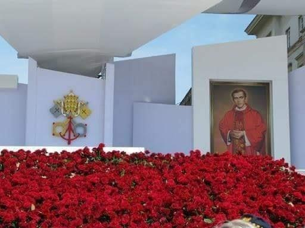
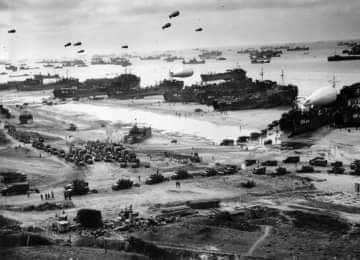
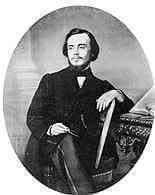

### 2020

> Prof Hausner nt. naszego ostatniego raportu: “Niebezpiecznie poszerzyło się partyjne władztwo nad polityką kredytową banków”

### 2010

Na Placu Piłsudskiego w Warszawie odbyła się msza beatyfikacyjna w intencji ks. Jerzego Popiełuszki.
W uroczystej liturgii na placu Piłsudskiego, udział wzięła Mama błogosławionego Kapłana-Męczennika p. Marianna Popiełuszko oraz Jego rodzeństwo i rodzina. We Mszy św.
beatyfikacyjnej uczestniczyło około 150 tysięcy wiernych z całej Polski oraz przedstawiciele Polonii zagranicznej, w tym blisko 3 tysiące kapłanów. Obecne były bardzo liczne delegacje NSZZ „Solidarność” z całego kraju wraz z
pocztami sztandarowymi.
Uroczystą homilę wygłosił wtedy arcybiskup Angelo Amato.
Powiedział wtedy między innymi:
" Kilkakrotnie miałem okazję odwiedzić w Warszawie muzeum poświęcone naszemu Błogosławionemu męczennikowi Księdzu Jerzemu Popiełuszce. Za każdym razem
wzruszenie było tak wielkie, że prowadziło do łez. Potwornie zeszpecona twarz tego łagodnego kapłana była podobna do ubiczowanego i upokorzonego oblicza ukrzyżowanego Chrystusa, które utraciło piękność i godność. Zakrwawione usta tej
umęczonej twarzy zdawały się powtarzać słowa Sługi Pańskiego: „Podałem grzbiet mój bijącym i policzki moje rwącym Mi brodę. Nie zasłoniłem mojej twarzy przed zniewagami i
opluciem” (Iz 50, 6). Co było powodem tak wielkiej zbrodni? Czy Ksiądz Jerzy był może przestępcą, mordercą, a
może terrorystą? Nic z tych rzeczy. Ksiądz Popiełuszko był po prostu wiernym katolickim kapłanem, który bronił swojej godności jako sługi Chrystusa i Kościoła oraz wolności tych,
którzy, podobnie jak on, byli ciemiężeni i
upokorzeni. Ale religia, Ewangelia, godność osoby ludzkiej, wolność nie były pojęciami zgodnymi z ideologią marksistowską."

  

### 1944

They called it the épuration sauvage, the wild purge, because it was spontaneous and unofficial. But, yes, it was savage, too. In the weeks and months following the D-Day landings of June 6, 1944, Allied troops and the resistance swept across France liberating towns and villages, and unleashing a flood of collective euphoria, relief and hope. And then the punishments began.

The victims were among the most vulnerable members of the community: Women. Accused of “horizontal collaboration” — sleeping with the enemy — they were targeted by vigilantes and publicly humiliated. Their heads were shaved, they were stripped half-naked, smeared with tar, paraded through towns and taunted, stoned, kicked, beaten, spat upon and sometimes even killed.

One photograph from the era shows a woman standing in a village as two men forcibly restrain her wrists; a third man grabs a hank of her blonde hair, his scissors poised to hack it away. Just as the punished were almost always women, their punishers were usually men, who acted with no legal mandate or court-given authority. Although some were loyal resistance members, others had themselves dabbled in collaborationist activity and were anxious to cleanse their records before the mob turned on them, too. About 6,000 people were killed during the épuration sauvage — but the intense, cruel, public ferocity of the movement focused not on serious collaborationist crime. Instead, it zeroed in on women accused of consorting with the enemy.

Siły alianckie przeprowadziły największy w historii desant. W Operacji Neptune, znanej powszechnie jako lądowanie w Normandii udział wzięły również formacje polskie. Były to Polskie Siły Powietrzne, Polska Marynarka Wojenna i Marynarka Handlowa. W skład sił powietrznych wchodziło 11 polskich dywizjonów (8 myśliwskich i 3 bombowe). Ich zadaniem była osłona powietrzna i eskorta bombowców, wsparcie ogniowe wojsk lądowych i rozpoznanie. Już w pierwszym dniu operacji, jedno z polskich skrzydeł zestrzeliło największą ilość samolotów, a do 25 czerwca 38 samolotów. W skład sił morskich wchodziły między innymi okręty ORP Dragon, ORP Krakowiak, ORP Ślązak. Miały one za zadanie prowadzenie wsparcia desantowego, zaś ORP Błyskawica i ORP Piorun osłaniały floty inwazyjne przed kontratakami floty niemieckiej. Okrętami floty handlowej były MS Batory i MS Sobieski, które transportowały żołnierzy alianckich.
Swego rodzaju ciekawostką związaną z tym wydarzeniem jest historia opisana przez Stephena Ambrose w książce D Day, w której przytacza wspomnienia żołnierzy lądujących na plaży " Utah". Opowiadali oni, że gdy zamierzali zaatakować umocniony bunkier usłyszeli tylko jeden strzał. Okazało się, że obsadę umocnienia stanowili Polacy, którzy zastrzeli pilnującego ich niemieckiego sierżanta i ochoczo poszli do niewoli.

  

### 1942

https://en.wikipedia.org/wiki/Battle_of_Midway

### 1863

Ostatni naczelnik Warszawy Aleksander Waszkowski (na zdjęciu) przeprowadził akcję w wyniku której powstańcy styczniowi przejęli pieniądze rządowej Kasy Głównej.Część zdobytych pieniędzy wyniesiono jescze tego samego dnia, resztę dwa dni później. W sumie zrabowano
3,6 mln rubli (prawie 50 % zawartości Kasy Głównej). Papiery wartościowe na oczach zdezorientowanej rosyjskiej warty wynieśli, wciągnięci do konspiracji powstańczej, pracownicy Komisji Przychodów i Skarbu:
Kasjer Główny Stanisław Janowski, Naczelnik Buchalterii (Księgowości) Stanisław Hebda oraz dwaj woźni Sebastian Bieliński i Mateusz
Tyszkowski. We wtorek, 9 czerwca, o skoku wiedziało już całe miasto, od tamtej pory w opinii społecznej Królestwo Polskie miało "Komisję
bez Przychodów i Skarbu".
Nad zdobyczą kontrolę przejął niejaki Karol Majewski ze stronnictwa Białych, dzięki czemu mógł on objąć władzę nad Rządem Narodowym i zdominować go przez swoich popleczników. Rząd ten utrzymał się od 14.06 do 17.09 1863 roku.
Organizator akcji Aleksander Waszkowski został aresztowany w grudniu 1864 roku, a następnie w lutym 1865 roku skazany na śmierć przez powieszenie. Miał wówczas 24 lata.

  

---

<a href="https://github.com/TomaszWaszczyk/historia.waszczyk.com/edit/master/src/content/june-6.md" target="_blank">Edytuj tę stronę dzieląc się własnymi notatkami!</a>
