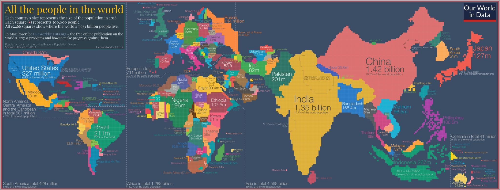
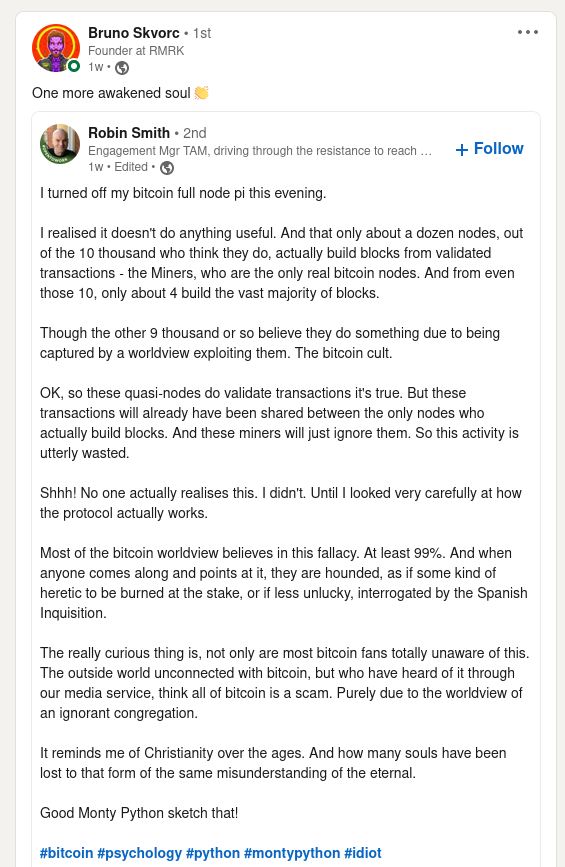
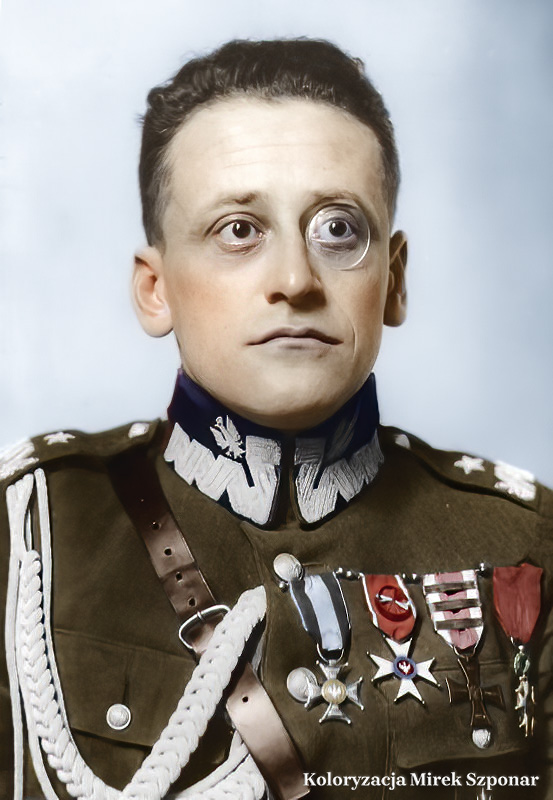

### 2022

Mao Tse Tung powiedział, że „Europa to mały półwysep, któremu poświęca się zbyt dużo uwagi”.
Przyzwyczajeni do typowej mapy (z odwzorowaniem Merkatora) często ulegamy sami złudzeniu wielkości Europy w stosunku do reszty świata.
Chciałem jednak dziś przedstawić mapę krajów, stworzoną tak, że wielkość kraju zależy od liczby mieszkańców. Każdy z kwadratów reprezentuje tu pół miliona mieszkańców.

Co ciekawego z niej wynika?

1. Gdyby Chiny i Indie straciły miliard mieszkańców, nadal byłyby krajami nr 1 i 2.
Każde z nich jest również większe niż jakikolwiek inny kontynent.
[EDIT: Obecnie Afryka ma 1.440 mln mieszkańców, więc jest większa od Chin]

2. Czy zaskoczyły cię 200-milionowe giganty: Brazylia, Nigeria, Pakistan?
W dwóch brazylijskich miastach Rio de Janeiro oraz Sao Paulo mieszka więcej ludzi niż w Polsce.

3. Widać potęgę „azjatyckich tygrysów”. Zobacz wielkość Wietnamu, Filipin, Indonezji i Korei w porównaniu np. z Australią.

4. Afryka jest ogromna. Zwłaszcza Nigeria, o której w najbliższych dziesięcioleciach będziemy słyszeć coraz więcej. To będzie kraj nr 3.
Wyróżniają się też 100-milionowe Egipt i Etiopia.

5. Rosja w 60% składa się z wiecznie zamarzniętej ziemi. To ogromny, ale większości pusty kraj. W azjatyckiej części Rosji mieszka mniej ludzi niż w Polsce (o 4 mln).
Porównany z Europą, (a nawet z samą Ukrainą) nie jest już tak wielki.
Oczarowany tą wielkością Rosji, Mickiewicz opisywał: „Garstkę naszych walczącą z Moskali nawałem”. Mit nieprzebranych mas ludzi podtrzymywał też Stalin, gdy bagatelizował straty Armii Czerwonej podczas 2WŚ: „Ja mam ludzi mnogo”.

6. Kraje skandynawskie są ledwie widoczne na naszej mapie, podobnie Kanada, o Islandii czy Grenlandii nie wspominając.
Trzeba się również wysilić, by odnaleźć kolebkę imperium Czyngis-Chana Mongolię.

7. Wyraźnie widoczne są za to kraje o gęstym zaludnieniu: Holandia, Belgia, Tajwan, Korea Płd.

8. Niemcy, Turcja i Iran mają po tyle samo mieszkańców: 82 mln.

9. Wszystkie Kraje Bliskiego Wschodu razem wzięte są mniejsze od Brazylii.
Kiedy ostatni raz słyszałeś w wiadomościach o jakichś wydarzeniach w Brazylii?

10. Na Indonezyjskiej wyspie Jawa żyje więcej ludzi niż w jakimkolwiek państwie w Europie, nawet więcej niż w Rosji (o 1 mln).
Podobnie ogromny stepowy Kazachstan jest tu mniejszy od małej wyspy równikowej: Sri Lanki.

  

  

===

A teraz zastanów się, ile miejsca poświęcają media wydarzeniom z życia ludzi żyjących poza naszym regionem?
Co o nich naprawdę nich wiemy i ile z tego to jedynie absurdalne i krzywdzące stereotypy?

I najważniejsze:
Jaki ci ludzie mają wpływ na obecny świat, a jaki będą mieć w przyszłości?

### 2021

This El Salvador headline was embedded in the 686,604th block of Bitcoin and shall remain there until the end of time.

"Diario El Salvador 6/Jun/2021 Bitcoin tendra validez legal" (Bitcoin will have legal validity)

  

### 2020

> Prof Hausner nt. naszego ostatniego raportu: “Niebezpiecznie poszerzyło się partyjne władztwo nad polityką kredytową banków”

### 2010

Na Placu Piłsudskiego w Warszawie odbyła się msza beatyfikacyjna w intencji ks. Jerzego Popiełuszki.
W uroczystej liturgii na placu Piłsudskiego, udział wzięła Mama błogosławionego Kapłana-Męczennika p. Marianna Popiełuszko oraz Jego rodzeństwo i rodzina. We Mszy św.
beatyfikacyjnej uczestniczyło około 150 tysięcy wiernych z całej Polski oraz przedstawiciele Polonii zagranicznej, w tym blisko 3 tysiące kapłanów. Obecne były bardzo liczne delegacje NSZZ „Solidarność” z całego kraju wraz z
pocztami sztandarowymi.
Uroczystą homilę wygłosił wtedy arcybiskup Angelo Amato.
Powiedział wtedy między innymi:
" Kilkakrotnie miałem okazję odwiedzić w Warszawie muzeum poświęcone naszemu Błogosławionemu męczennikowi Księdzu Jerzemu Popiełuszce. Za każdym razem
wzruszenie było tak wielkie, że prowadziło do łez. Potwornie zeszpecona twarz tego łagodnego kapłana była podobna do ubiczowanego i upokorzonego oblicza ukrzyżowanego Chrystusa, które utraciło piękność i godność. Zakrwawione usta tej
umęczonej twarzy zdawały się powtarzać słowa Sługi Pańskiego: „Podałem grzbiet mój bijącym i policzki moje rwącym Mi brodę. Nie zasłoniłem mojej twarzy przed zniewagami i
opluciem” (Iz 50, 6). Co było powodem tak wielkiej zbrodni? Czy Ksiądz Jerzy był może przestępcą, mordercą, a
może terrorystą? Nic z tych rzeczy. Ksiądz Popiełuszko był po prostu wiernym katolickim kapłanem, który bronił swojej godności jako sługi Chrystusa i Kościoła oraz wolności tych,
którzy, podobnie jak on, byli ciemiężeni i
upokorzeni. Ale religia, Ewangelia, godność osoby ludzkiej, wolność nie były pojęciami zgodnymi z ideologią marksistowską."

  

### 1944

They called it the épuration sauvage, the wild purge, because it was spontaneous and unofficial. But, yes, it was savage, too. In the weeks and months following the D-Day landings of June 6, 1944, Allied troops and the resistance swept across France liberating towns and villages, and unleashing a flood of collective euphoria, relief and hope. And then the punishments began.

The victims were among the most vulnerable members of the community: Women. Accused of “horizontal collaboration” — sleeping with the enemy — they were targeted by vigilantes and publicly humiliated. Their heads were shaved, they were stripped half-naked, smeared with tar, paraded through towns and taunted, stoned, kicked, beaten, spat upon and sometimes even killed.

One photograph from the era shows a woman standing in a village as two men forcibly restrain her wrists; a third man grabs a hank of her blonde hair, his scissors poised to hack it away. Just as the punished were almost always women, their punishers were usually men, who acted with no legal mandate or court-given authority. Although some were loyal resistance members, others had themselves dabbled in collaborationist activity and were anxious to cleanse their records before the mob turned on them, too. About 6,000 people were killed during the épuration sauvage — but the intense, cruel, public ferocity of the movement focused not on serious collaborationist crime. Instead, it zeroed in on women accused of consorting with the enemy.

Siły alianckie przeprowadziły największy w historii desant. W Operacji Neptune, znanej powszechnie jako lądowanie w Normandii udział wzięły również formacje polskie. Były to Polskie Siły Powietrzne, Polska Marynarka Wojenna i Marynarka Handlowa. W skład sił powietrznych wchodziło 11 polskich dywizjonów (8 myśliwskich i 3 bombowe). Ich zadaniem była osłona powietrzna i eskorta bombowców, wsparcie ogniowe wojsk lądowych i rozpoznanie. Już w pierwszym dniu operacji, jedno z polskich skrzydeł zestrzeliło największą ilość samolotów, a do 25 czerwca 38 samolotów. W skład sił morskich wchodziły między innymi okręty ORP Dragon, ORP Krakowiak, ORP Ślązak. Miały one za zadanie prowadzenie wsparcia desantowego, zaś ORP Błyskawica i ORP Piorun osłaniały floty inwazyjne przed kontratakami floty niemieckiej. Okrętami floty handlowej były MS Batory i MS Sobieski, które transportowały żołnierzy alianckich.
Swego rodzaju ciekawostką związaną z tym wydarzeniem jest historia opisana przez Stephena Ambrose w książce D Day, w której przytacza wspomnienia żołnierzy lądujących na plaży " Utah". Opowiadali oni, że gdy zamierzali zaatakować umocniony bunkier usłyszeli tylko jeden strzał. Okazało się, że obsadę umocnienia stanowili Polacy, którzy zastrzeli pilnującego ich niemieckiego sierżanta i ochoczo poszli do niewoli.

D-Day godzina po godzinie:

Godz. 5:30
Rozpoczęcie ostrzału artyleryjskiego plaż. Oddziały amerykańskie lądują pod St. Marcouf.

Godz. 6:00
Wiadomości o ostrzale docierają do kwatery główniej niemieckiej 7. Armii.

Godz. 6:30
Godzina H na plażach Omaha i Utah.

Godz. 7:00
Pierwszy zrzut desantu na Omaha zostaje przygwożdżony ogniem. US Ranngers rozpoczynają atak na Pointe de Hoc.

Godz: 7:30
Godzina H na plażach Gold i Sword.

Godz. 7:31
Oddziały amerykańskie z plaży Utah posuwają się w głąb lądu. Godzina H na plaży Juno

Godz. 8:00
Oddziały amerykańskie przebijają się z Omaha.

Godz. 9:00
Niemiecki 84.Korpus otrzymuje informacje o desancie.

Godz. 9:30
Wiadomość o operacji Overlord dostaje się do prasy. Oddziały brytyjskie pokonały 1,5 km od Gold. Brytyjczycy opanowują Hermanaville

Godz. 10:00
Oddziały amerykańskie wspięły się na stromy brzeg górujący nad Omaha.

Godz. 10:30
Niemiecka 21. Dywizja Pancerna otrzymuje rozkaz ataku pomiędzy Cean i Beyeux.

Godz. 11:00
Amerykanie wkraczają do Vierville.

Godz. 11:15
Oddziały kanadyjskie zdobywają St. Aubin.

Godz. 12:03
Na mostach na Orne spotykają się komandosi i spadochroniarze aliantów.

Godz.12:15
Niemieckie czołgi docierają na północ od Cean.

Godz. 12:30
Brytyjska 185. Brygada Piechoty posuwa się od Sword w głąb lądu.

Godz. 13:00
Połączenie amerykańskich 4 Dywizji Piechoty i 101 Dywizji Powietrzno-Desantowej pod Pouppeville.

Godz. 13:30
Oddziały amerykańskie posuwają się od Omaha w głąb lądu.

Godz. 13:35
Niemiecka 352. Dywizja Pancerna przekazuje wiadomość o zepchnięciu nieprzyjaciela z plaży Omaha do morza.

Godz. 14:00
Walki na grani Periers, wznoszącej się ponad plażą Sword. Hitler odbywa odprawę w sprawie lądowania aliantów.

Godz. 16:00
Walka Niemców i Brytyjczyków pomiędzy Villers-le-Sec i Brazenville. Kwatera niemieckiej 7. Armii otrzymuje wiadomość o lądowaniu na Uthah. Amerykańskie czołgi posuwają się od Omaha w głąb lądu. Do akcji wchodzi niemiecka 21. Dywizja Pancerna SS Hitlerjugend oraz Dywizja Pancerna lehr.

Godz. 16:30
21. Dywizja Pancerna uderza na przyczółek Sword.

Godz. 18:00
Zatrzymanie marszu Brytyjczyków pod Cean

Godz. 20:00
Brytyjczycy zajmują Colleville sur Mer.

Godz. 20:10
Kanadyjczycy zdobywają Taillerville.

Godz. 21:00
Na odcinku pomiędzy Utah i wschodnim brzegiem Orne lądują szybowce z posiłkami.

  

### 1942

https://en.wikipedia.org/wiki/Battle_of_Midway

---

W Edynburgu zmarł Stanisław Burhardt-Bukacki. Legionista, generał dywizji WP.

  

### 1961

Umiera Carl Gustav Jung.

12 zasad psychologii Junga

1. Zasada energii psychicznej

Energia psychiczna (libido) jest fenomenem zależnym od energii fizycznej (biologicznej, fizjologicznej), ale jej źródłem są również procesy uczuciowe, intelektualne, wyobraźnia, uaktywnione wpływem, jaki mają na psyche symbole o znaczeniu archetypowym, zawarte np. w dziełach sztuki, snach, rytuałach, w stanach medytacyjnych. Ich energetyczna rola wynika z tego, że sięgają one poziomu nieświadomości zbiorowej. Symbole archetypowe są, zdaniem Junga, wrodzone, dlatego mają dla całości psychiki znaczenie witalne i regulacyjne, zaznaczając się w formie i treści procesów psychicznych (forma myślenia, stany uczuciowe, fantazjowanie, sny), tak na poziomie świadomości, jak i nieświadomości. Uzupełnieniem koncepcji energii psychicznej Junga jest jego teoria wrodzonych typów postawy psychicznej – esktrawertywnego i introwertywnego. Ekstrawersja oznacza tendencję do naturalnego kierowania energii w stronę obiektów zewnętrznych (do otoczenia), a introwersja naturalne kierowanie jej do wewnątrz (ku podmiotowi jako obiektowi wewnętrznemu).

2.Zasada funkcji psychicznych

Orientację w rzeczywistości zapewniają ludzkiemu „ja” cztery podstawowe funkcje psychiczne, dwie racjonalne – uczucie i myślenie – oraz dwie irracjonalne – percepcja (spostrzeganie zmysłowe) i intuicja (spostrzeganie pozazmysłowe). Koncepcja ta zawiera dwie ważne różnice w stosunku do tradycyjnego nurtu psychologii. Pierwsza polega na uznaniu uczucia za funkcję racjonalną i równorzędną, aczkolwiek opozycyjną, w stosunku do myślenia. Wartościowanie uczuciowe (subiektywne) jest komplementarne wobec osądu intelektualnego (obiektywnego), tak jak wrażenia i spostrzeżenia zmysłowe są komplementarne wobec intuicyjnego odbioru informacji. Różne układy między funkcjami orientującymi (dominacji, podrzędność) odpowiadają za kształtowanie się psychicznych typów funkcjonalnych – czterech ekstrawertywnych i czterech introwertywnych.

3.Zasada jedności przeciwieństw

Psychika bazuje na przeciwieństwach funkcjonalnych, które pozostają w dynamicznej równowadze, znoszą się (konflikt) lub wzajemnie kompensują (relacja zastepcza). Przeciwieństwa tworzą dynamiczną jedność, regulującą równowagę całości procesów psychicznych i przebieg rozwoju osobowości, w szczególności w kulturowej fazie rozwoju (indywiduacja). W ramach zasady przeciwieństw odbywa się asymilacja wzorców, obrazów i symboli o znaczeniu psychologicznym, duchowym, społeczno-kulturowym, moralnym, egzystencjalnym. Przeciwieństwa psychologiczne (opozycyjne systemy psychiki, przeciwstawne funkcje świadomości) tworzą dynamiczne układy w psyche jednostki, a także w strukturze społecznej i kulturze, np. w dynamice kolejnych epok lansujących przeciwstawne wartości (np. racjonalizm i irracjonalizm). Podstawowe opozycje o znaczeniu psychologicznym, zdaniem Junga, są następujące: świadomość-nieświadomość, ekstrawersja-introwersja, uczucie-myślenie, intuicja-percepcja, duch-materia.

4. Zasada Cienia indywidualnego i zbiorowego

Rozwój świadomości indywidualnej (ego) powoduje, że w nieświadomości organizują się tłumione i wypierane treści naładowane intensywną energią emocjonalną, tzw. kompleksy psychiczne. Tworzą one nieświadomość indywidualną – Cień indywidualny. Ułomna kondycja człowieka zapisana jest w Cieniu. Mechanizmy unikania i inne typy mechanizmów obronnych sprawiają, że ten Cień „powiększa się”, a następnie ulega projekcji w negatywnych wyobrażeniach indywidualnych (negatywne fantazje, lęki, fobie, koszmarne sny, urojenia, katastroficzne wizje) lub zbiorowych (lękowe wierzenia, natrętne rytuały pogłoski, uprzedzenia). Intensywne napięcie Cienia indywidualnego sprzyja procesowi jego symbolizacji. Ciemna, negatywna strona świadomości ma w każdej kulturze swoją uniwersalną wartość – archetyp Cienia. Na styku płaszczyzny psychologicznej (nieświadomość indywidualna) i kulturowej (nieświadomość zbiorowa) Cień może ulegać dogmatyzacji lub personifikacji (np. wyobrażenie szatana, personifikacje śmierci, Hades, Szeol). W płaszczyźnie społecznej i religijnej staje się treścią dogmatów i ideologii (ideologia „złego”, walka ze złem, satanizm, nihilizm). Indywidualny i zbiorowy kontakt z Cieniem (dialog świadomości z nieświadomością) jest podłożem przemiany psychicznej polegającej na asymilacji treści Cienia (odrodzenie osobowości). Kontakt z Cieniem służy asymilacji psychologicznej względności praw świadomości i nieświadomości; jest także podstawą duchowej i moralnej transformacji.

5. Zasada autonomii nieświadomości

Wiele zjawisk i procesów psychicznych, także u jednostek dojrzałych, ma charakter autonomiczny w stosunku do świadomości (ego). Podlegają one tylko częściowo kontroli świadomości, wywołując przeżycia typu numinalnego (tremendum, fascinosum). Ten rodzaj przeżyć wynika z oddziaływania na kompleks „ja” skondensowanych treści nieświadomości zbiorowej – archetypów. Autonomia nieświadomości zależy głównie od wpływu archetypów i symboli, przejawia się jako fatum (los), impuls twórczy, doznanie parapsychiczne, wizja o charakterze proroczym, sen archetypowy („wielki”), olśnienie (naukowe), objawienie (religijne), poczucie misji. Autonomiczną naturę mają również objawy zaburzeń psychicznych, np. natręctwa, urojenia, wizje psychotyczne, halucynacje (np. tzw. „głosy”). Działają one na świadomość niejako z zewnątrz – jako nakaz, postulat, konieczność, przymus. Niższą, bardziej pierwotną formą autonomicznych wpływów nieświadomości stanowią popędy.

6. Zasada kompensacji

Złożona organizacja psychiczna wyraża się w zróżnicowaniu przepływu energii psychicznej między procesami świadomości i nieświadomości. Część tych procesów ma charakter kompensacyjny, tzn. niespełnione, istotne potrzeby przebiegają w formie zastępczej – zwykle ukrytej, utajonej, przesadnej, przemieszczonej. Kompensacja jest nie tylko negatywną formą obronną (pogląd Freuda), ale spełnia ogólne funkcje regulacyjne; może częściowo realizować cel rozwojowy (w rodzaju twórczej, pozytywnej sublimacji). Pozwala na zachowanie psychicznego, choć nieświadomego, kontaktu z istotną treścią nieświadomości zbiorowej (archetyp) i umożliwia przejściowo zachowanie całości psyche. Wiele objawów zaburzeń psychicznych i przejawów dezintegracji to wyraz kompensacyjnych wpływów nieświadomości. Kompensacja dotyczy różnych aspektów psychicznych, np. opozycji myślenie-uczucie, ekstrawersja-introwersja i in.

7. Zasada inflacji psychicznej

W kontakcie z symbolami i archetypami nieświadomości zbiorowej, np. w procesie twórczym, w przełomowych momentach życia, ego uzyskuje szczególny rodzaj wglądu i emocjonalnego „naładowania”. Energia psychiczna wznosi się na poziom ekstremalny, a ego może ulegać „rozdęciu”, tj. inflacji. Stan inflacji ego Jung nazywa owładnięciem. Treścią stanu inflacji mogą być różne archetypy (Stary Mędrzec, Wielka Matka, jaźń). Ego ulega wtedy intensywnemu oddziaływaniu nieświadomości zbiorowej, niczym dajmoniona (bóstwa). Inflacja ego jest nieodłącznym elementem procesu indywiduacji (przeżycia twórcze, doświadczenie religijne, kryzys połowy życia), ale mogą też być doświadczeniem negatywnym, kiedy ego traci swą autonomię (przejściowe lub stabilne stany psychotyczne).

8. Zasada jaźni

Ego jest wtórnym ośrodkiem regulującym aktywność systemu psychicznego, rozwijającym się (po 1 r. ż.) i dominującym w świadomej części psychiki (według Freuda odpowiada za procesy wtórne). Nadrzędny ośrodek integracji psychicznej, który może zapanować nad systemem świadomym i nieświadomym to archetyp jaźni. Jaźń jest postulatem rozwoju osobowości. Osiągnięcie jaźni oznacza doświadczenie pełni psychicznej, jedności z obrazem Boga (Chrystusa, Jahwe, Allaha, Buddy). Kontakt psychiczny ego z jaźnią tworzy tzw. oś ego-jaźń (według E.F. Edingera). Zasada jaźni ujawnia się nie tylko w formie personifikacji transcendentnego Boga. Uniwersalnym wyobrażeniem jaźni, jej symbolem, są też obrazy mandali, np. koła, krzyża, spirali, kolistego węża (uroborosa), wieloosiowego, symetrycznego kryształu, w nauce — model atomu, struktura benzenu. Zasada jaźni, według Junga, wiąże się z naturalnymi obrazami czwórcy (mandali psychicznej). Czwórca, jako nadrzędna forma organizacji ludzkiej psyche, odzwierciedla naturalny porządek świata i kosmosu. Dwie podstawowe psychologiczne formy czwórcy to cztery funkcje orientujące psychikę (uczucie, myślenie, percepcja, intuicja) oraz czterowymiarowa relacja ducha, materii, ego i nieświadomości zbiorowej (archetypów).

9. Zasada funkcji transcendentnej (symbolicznej)

Aktywność i treść procesów psychicznych w ciągłym procesie rozwoju osobowości odnosi się pośrednio (przez nieświadomość) lub bezpośrednio (przez świadomość) do nadrzędnej funkcji psychologicznej, jednoczącej świadomość i nieświadomość oraz inne przeciwieństwa psychologiczne – funkcji transcendentnej. Symbole i wartości nadrzędne – jaźń i pozostałe archetypy nieświadomości zbiorowej (sztuka, przeżycia i dogmaty religijne) – oddziałują na intensywnie na świadomość, wiążąc ją z transcendentnym aspektem psychiki i spełniając funkcję religijną.

10. Zasada indywiduacji (kulturowej fazy rozwoju)

Po fazie naturalnej rozwoju (socjalizacja, identyfikacja sfery biologicznej, instynktów) zadaniem jednostki jest wejście w fazę kulturową rozwoju (indywiduacja). Następuje wtedy integracja sfery archetypów i ego oraz przemiana świadomości – bądź w formie permanentnych zmian orientacji i organizacji psychiki, bądź w formie wyraźnego kryzysu połowy życia. Elementy kryzysowe są szczególnie widoczne w zaburzeniach psychicznych typu nerwicowego i afektywnego, które – przy słabo ukształtowanym ego i niedostatecznej integracji z podłożem kulturowym – utrwalają się. Głębsze zaburzenia i zaczynające się wcześniej w rozwoju (dzieciństwo, okres dojrzewania), objawiające się jako psychozy, mogą kończyć się rozpadem osiowej struktury psychiki (indywiduacja w tym przypadku jest zablokowana). Przełom procesu indywiduacji wyraża się zwykle tzw. kryzysem połowy życia, w czasie którego następuje przemiana osobowości (odrodzenie). Odpowiednie fazy przemiany zaznaczają się też w procesie terapii. Jung przewiduje cztery jej fazy: katharsis (oczyszczenie), wyjaśnianie, edukacja, odrodzenie.

11. Zasada finalności procesów psychicznych (teleologiczna)

Indywidualny rozwój (faza naturalna dojrzewania i proces indywiduacji) jest procesem twórczym, uwarunkowanym czynnikami wrodzonymi, doświadczeniami dzieciństwa i wypracowanymi cechami osobowości, ale przede wszystkim jest procesem zmierzającym do celu, jakim jest realizacja wewnętrznej jaźni i zbudowanie dojrzałej osobowości. Osobowość nie jest gotowym tworem lub nabytym od otoczenia, ale syntezą wysiłku wewnętrznego i zewnętrznych uwarunkowań, które są regulowane przez dziedziczne wzorce psychologiczne – archetypy. „Finałem” przemian jest osobowość jako wynik stopniowych i przełomowych transformacji.

12. Zasada synchroniczności

Wiele procesów psyche, ulegając wpływom nieświadomości zbiorowej, nie podlega prostej regule przyczyna-skutek. Mają one charakter zależności akauzalnej. Przykładem zjawiska synchroniczności są niejasne zbiegi okoliczności, zjawiska losowe (fatum), sny prorocze, objawienia religijne. Czynnik akauzalności został stwierdzony w fizyce cząstek elementarnych (ta sama cząsteczka jest jednocześnie rejestrowana jako zjawisko falowe (energia) i materialne (masa). Tzw. przypadek, kiedy nie stwierdza się określonej zależności przyczynowej w rozumieniu logiki Arystotelesa, w psychologii może być nośnikiem istotnego znaczenia (związek znaczeniowy). Synchroniczność (znaczeniowa zbieżność zdarzeń jest wyrazem manifestacji procesów nieświadomości zbiorowej. Powiązania pozaprzyczynowe między różnymi aspektami rzeczywistości zakłada także mistyczna idea jednego świata (unus mundus).

### 1863

Ostatni naczelnik Warszawy Aleksander Waszkowski (na zdjęciu) przeprowadził akcję w wyniku której powstańcy styczniowi przejęli pieniądze rządowej Kasy Głównej.Część zdobytych pieniędzy wyniesiono jescze tego samego dnia, resztę dwa dni później. W sumie zrabowano
3,6 mln rubli (prawie 50 % zawartości Kasy Głównej). Papiery wartościowe na oczach zdezorientowanej rosyjskiej warty wynieśli, wciągnięci do konspiracji powstańczej, pracownicy Komisji Przychodów i Skarbu:
Kasjer Główny Stanisław Janowski, Naczelnik Buchalterii (Księgowości) Stanisław Hebda oraz dwaj woźni Sebastian Bieliński i Mateusz
Tyszkowski. We wtorek, 9 czerwca, o skoku wiedziało już całe miasto, od tamtej pory w opinii społecznej Królestwo Polskie miało "Komisję
bez Przychodów i Skarbu".
Nad zdobyczą kontrolę przejął niejaki Karol Majewski ze stronnictwa Białych, dzięki czemu mógł on objąć władzę nad Rządem Narodowym i zdominować go przez swoich popleczników. Rząd ten utrzymał się od 14.06 do 17.09 1863 roku.
Organizator akcji Aleksander Waszkowski został aresztowany w grudniu 1864 roku, a następnie w lutym 1865 roku skazany na śmierć przez powieszenie. Miał wówczas 24 lata.

  

---

<a href="https://github.com/TomaszWaszczyk/historia.waszczyk.com/edit/master/src/content/june-6.md" target="_blank">Edytuj tę stronę dzieląc się własnymi notatkami!</a>
