### 2023

> "U nas nastąpiła nie spirala płac i cen, tylko raczej spirala marż i cen" - Glapiński

### 2022

  

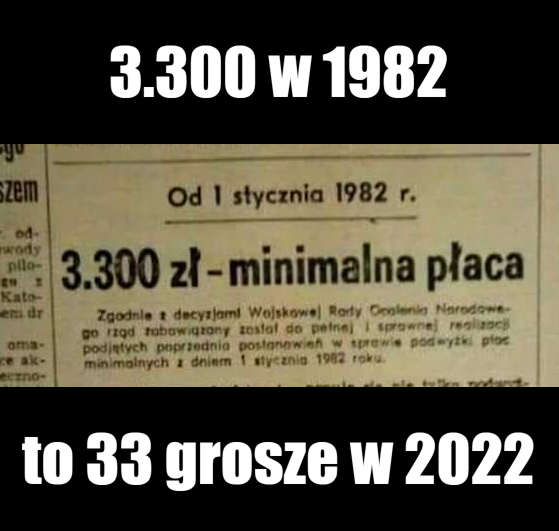  

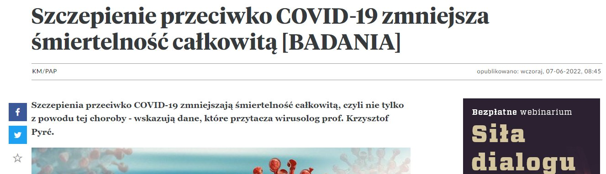  

---

<video width="640" height="480" controls>
<source src="./movies/june/suskilikwidacja.mp4" type="video/mp4">
Your browser does not support the video tag.
</video>

---

Jarosław Kret pokazuje jak był chory na wirus:

<video width="640" height="480" controls>
<source src="./movies/june/jaroslawkredchorynawirus.mp4" type="video/mp4">
Your browser does not support the video tag.
</video>

Nagranie z około 2020 roku, kiedy był wirus.

---

### 2021

Indyjski rząd wyjaśnia: nie ma indyjskiej mutacji Corony
W oficjalnym oświadczeniu rząd zwrócił się do mediów, a w szczególności do platform mediów społecznościowych o usunięcie wszelkich treści informujących o rzekomym indyjskim wariancie Corony. "Nawet WHO nie prowadzi w rejestrach tak zwanego wariantu indyjskiego o nazwie B.1.617" , stwierdza rząd indyjski.

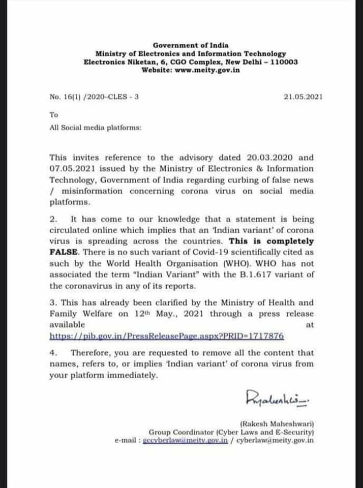  

### 2020

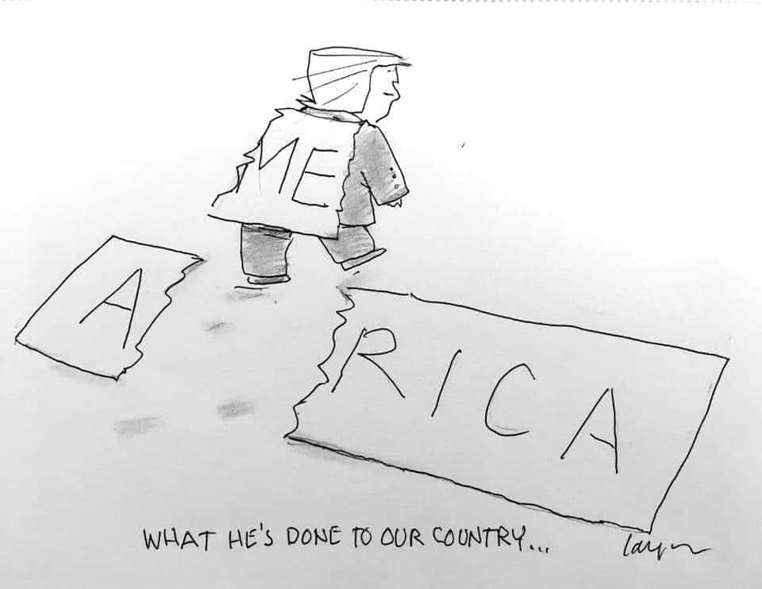  

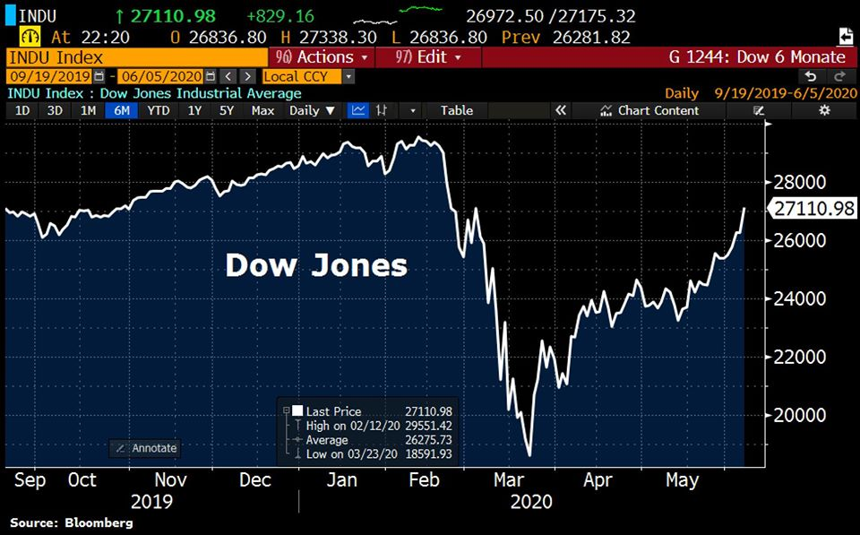  

Majowe dane z rynku pracy w Stanach były ogromnym zaskoczeniem. Zamiast oczekiwanego wzrostu stopy bezrobocia do 20% z 14,7% w kwietniu BLS poinformowało o spadku wskaźnika do 13,3% i powrocie do pracy w maju 2,5 mln ludzi. Giełda poszła w górę, zyskały obligacje. Trump ogłosił tryumf amerykańskiej gospodarki i swojej administracji.
Raport BLS objaśnia, co się stało i dlaczego. Program PPP zadziałał szybciej niż sądzono. Entuzjazmu inwestorów nie zmniejszyła świadomość, że 13,3% bezrobotnych, to więcej niż w czasie wielkiej recesji. Tak działa pozytywna niespodzianka.
Najciekawsze jednak jest to, że na końcu komunikatu BLS (w ramce) znajduje się informacja o "błędzie klasyfikacji" (misclassification error), który zaniżył stopę bezrobocia zarówno w kwietniu, jak i w maju. W kwietniu przekroczyła ona 19%; w maju wyniosła ok. 16,3%, gdyby błędu klasyfikacji nie było. Błąd był następstwem odpowiedzi na stałe pytania w ankiecie, gdzie widnieje kategoria "nieobecnych w pracy z innych powodów", ale wciąż zatrudnionych. W standardowej sytuacji te "inne powody", to urlopy, opieka nad chorymi, itp. Jednak teraz nieobecni w pracy byli ci, którzy siedzieli w domach, już bez pracy, ale formalnie jeszcze bez zwolnienia. BLS nie zmieniło klasyfikacji. Ujawniło jednak błąd. Duża odwaga.

---

Black Lives Matter protesters in Bristol have thrown a statue of a 17th century slave trader into the city's river after pulling it down earlier on Sunday afternoon.

Footage on social media shows demonstrators tearing down a statue of Edward Colston from its plinth during protests in the city centre on Sunday. In a later video, protesters are seen dumping it into the water at Bristol Harbour.

The demonstrations came in response to the killing of George Floyd by police in Minneapolis on 25 May.

The controversial bronze memorial had stood in the centre of Bristol since 1895 and was made by John Cassidy, a sculptor from Manchester, according to Historic England. In recent days, more than 10,000 people signed a petition calling on Bristol City Council to have it removed.

Before it was pulled down, protestor John McAllister, 71, removed the black bin bags hiding the statues.

---

<!-- Przechodzi ustawa mówiąca o tym, że w polskich służbach mogą i będą służyć cudzoziemcy -->

<video width="640" height="480" controls>
  <source src="./movies/june/TheWhipsawSong.mp4" type="video/mp4">
Your browser does not support the video tag.
</video>

---

### 2016

https://pl.wikipedia.org/wiki/Reprywatyzacja_w_Warszawie

---

### 1985

Tak, to "Super Mario Bros". Mało kto wie, że pierwsza część sagi była projektowana na... papierze milimetrowym! Każdy piksel postaci czy planszy został najpierw ręcznie narysowany i pokolorowany. Poniżej zdjęcie fragmentu oryginalnego projektu z 1985 r.

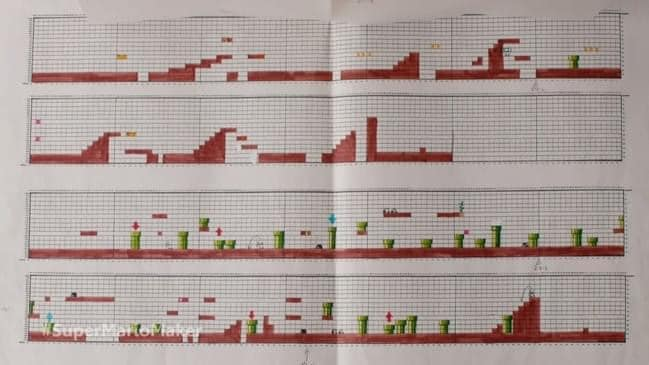  

### 1944

Rada Wojenna Armii Polskiej w ZSRR wystosowała apel wzywający Polaków do powstania.
Oto treść tego apelu:
"Rodacy! Poprzez płonącą linię frontu ślemy
Wam, Bracia i Siostry, słowa otuchy i wiary
w rychłe wyzwolenie. (...) Wasza nienawiść
do wroga, Wasz ofiarny opór i mężna w ciągu
długich lat walka obroniły godność i honor
narodu. My zaś tu, na sojuszniczej ziemi
radzieckiej, rozbitkowie po klęsce
wrześniowej, zjednoczyliśmy się w Związek
Patriotów Polskich, z którego wyrosło nasze
wojsko polskie. Dziś stutysięczna Armia
Polska w Związku Radzieckim idzie Wam
z pomocą. Stoimy u progu Polski, doskonale
uzbrojeni, zwarci, karni i wyszkoleni.(...)
Bracia! Stawajcie wszyscy do walki
z okupantem hitlerowskim! Nie dawajcie
posłuchu kłamstwom Niemców, lub ich
świadomych i nieświadomych agentów,
o Związku Radzieckim i naszej Armii Polskiej.
Witajcie godnie sojuszniczą Armię Czerwoną,
która ma największe zasługi w dziele
zwycięstwa nad Niemcami. Pomagajcie
naszej Armii i wojskom radzieckim miażdżyć
siły niemieckie. Tylko szybkie wygnanie
Niemców z kraju nie pozwoli im zamienić go
w zgliszcza i ruiny i zmniejszy liczbę naszych
ofiar.
Opieramy się na twardym fundamencie
jedności wszystkich Polaków bez różnicy
przekonań politycznych - jedności, tak
potrzebnej do walki z Niemcami. (...)
Otuchą napełnia nas również fakt powstania
w kraju Armii Ludowej, z którą połączymy się
w Ojczyźnie, by stworzyć potężne siły zbrojne
niepodległej, suwerennej i demokratycznej
Rzeczypospolitej Polskiej.
Jeden mamy cel wspólny dla wszystkich
Polaków. Wszyscy do walki!
Nie traćcie ani chwili! Chwytajcie za broń!
Bijcie Niemców!
Zniewagi narodu zmyjemy tylko krwią wroga!
(...) Gotujcie się wszyscy do powstania
z orężem w ręku przeciw najeźdźcy
niemieckiemu!
Do broni, Polacy!"
"Wezwanie" podpisali członkowie rady
Wojennej Armii Polskiej w Związku
Radzieckim: Zygmunt Berling, Karol
Świerczewski i Aleksander Zawadzki.

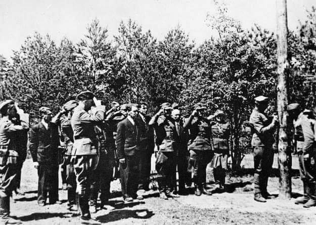  

### 1943

Prawdopodobnie 7 czerwca 1943 roku dowódca UPA-Piwnicz (Północ) pułkownik Dymytro Kłaczkiwskij (zdjęcie) wydał tajną dyrektywę w sprawie przeprowadzenia wielkiej akcji wymordowania polskiej ludności męskiej w wieku od 16 do 60 lat.
Czytamy w niej:
(...) powinniśmy przeprowadzić wielką akcję likwidacji polskiego elementu. Przy odejściu wojsk niemieckich należy wykorzystać ten dogodny moment dla zlikwidowania całej ludności męskiej w wieku od 16 do 60 lat(...) Tej walki nie możemy przegrać, i za każdą cenę trzeba osłabić polskie siły. Leśne wsie oraz wioski położone obok leśnych masywów powinny zniknąć z powierzchni ziemi."

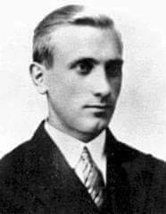  

### 1867

Były powstaniec styczniowy
Antoni Berezowski dokonał nieudanego
zamachu na przebywającego w Paryżu
Aleksandra II.
1 czerwca 1867 r. z okazji odbywającej się we
francuskiej stolicy II Wystawy Światowej, do
Paryża na zaproszenie cesarza Francji
Napoleona III przyjechali car Aleksander II i
król Prus Wilhelm I.
Na wieść o przyjeździe rosyjskiego władcy do
miasta nad Sekwaną Berezowski zwolnił się z
pracy w fabryce i rozpoczął przygotowania do
zamachu. Codziennie kupował gazety, z
których dowiadywał się o miejscach, które car
zamierzał odwiedzić. Prasa donosiła, że 6
czerwca w podparyskim Lasku Bulońskim
odbędzie się rewia wojskowa na cześć
zagranicznych władców przybyłych do Francji.
29 maja Berezowski dowiedział się, że car przybędzie
do Paryża 1 czerwca. Na Dworzec Północny
w Paryżu przyszedł dwie godziny
przed przyjazdem Aleksandra II. Dwie
godziny – jak zeznał później podczas
śledztwa – spędził jakby w ekstazie,
opanowany przez jedną myśl, że przywiodło
go tu przeznaczenie.
7 czerwca rano przygotował pociski. Ponieważ kule okazały się za małe, w dwóch lufach
nabitych uprzednio prochem umieścił
pieńki z ołowiu i wbił je za pomocą
stalowego pręta. Pistolet ukrył pod zapiętym
na wszystkie guziki przyciasnym tużurkiem.
Tak zamach ten opisywały gazety:
"Przy Bulwarze Sewastopolskim w Paryżu
podczas rewii wojskowej koniuszy cesarza
Napoleona III zauważył wycelowaną broń.
Ubódł konia, padł strzał, kula trafiła zwierzę.
Były powstaniec Antoni Berezowski mierzył w
cara Aleksandra II, siedzącego obok cesarza
Francuzów. Zamachowiec pociągnął za spust
po raz drugi, ale proch rozerwał lufę, raniąc
jego i trzy przypadkowe osoby"
Za próbę zabicia cara Berezowski został skazany na dożywotnie zesłanie do Nowej Kaledonii, gdzie zmarł w 1916 roku.

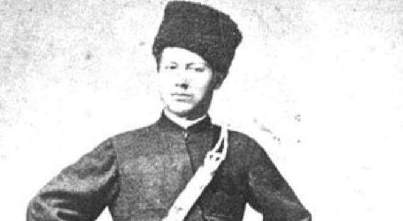  

### 1520

Na tzw. „Polu Złotogłowia”, specjalnie wybudowanym, ogromnym obozie reprezentacyjnym pod Balinghem na skraju angielskich posiadłości wokół Calais, rozpoczęło się trwające do 24 czerwca spotkanie króla Anglii Henryka VIII Tudora z królem Francji Franciszkiem I Walezjuszem.

Kronikarze tamtych czasów opisywali spotkanie władców Francji i Anglii mianem Pola Złotogłowia z powodu niezwykle kosztownych, przetykanych złotem tkanin, które zdominowały dekoracje namiotów, pawilonów i strojów. Spotkanie monarchów miało przebiegać pod znakiem przyjaźni i idei rycerskości, ale każdy pragnął zaprezentować się jako najbogatszy i najpotężniejszy. Rywalizacja była widoczna już na etapie logistycznym całego przedsięwzięcia: obydwie strony obawiały się, że partner nie dotrzyma umowy, chcąc przyćmić drugiego. Pozornie organizowane z zamiarem podkreślenia przyjaźni między obydwiema potęgami, spotkanie nie przyniosło konkretnych politycznych rezultatów. Stało się za to okazją do demonstracji potęgi obydwu dworów poprzez pokaz bogactwa i prawdziwy przepych.

W 1520 roku Henryk dobiegał trzydziestki i zasiadał na angielskim tronie od jedenastu lat. W jego epoce wystawne życie stało się symbolem potęgi, a król rozumiał konieczność posiadania wielkiego dworu. Wzmacnianie pozycji na arenie europejskiej zaczął od pokazu ekstrawagancji oraz wystawności swojego dworu. Organizował rozrywki, turnieje i bankiety, aby pokazać innym władcom, że jest im równy. Albo potężniejszy.

Spotkanie z Franciszkiem było doskonałą okazją do demonstracji siły – w pokojowy sposób. Gdy przygotowania do imprezy w lutym ruszyły pełną parą, zdecydowano między innymi, że stary pałac w Guines nie jest dość luksusowy dla pary królewskiej. Można więc było albo zakwaterować Henryka i Katarzynę w innym miejscu, albo… zbudować nowy. W zaledwie sześć tygodni powstał tymczasowy pałac z ceglanych fundamentów, o wysokości 2,5 m i powierzchni niemal 10 000 m2, z czterema wieżami, stróżówką i wewnętrznym dziedzińcem. Drewniane ściany pomalowano tak, by wyglądały na kamienne, i zaimpregnowano na wypadek niepogody. Do budowy półokrągłych okien na piętrze zużyto ponad 1,5 tys. metrów kwadratowych szkła, a jedne z pałacowych drzwi wyposażono w „dwa pozłacane filary z posągami Kupidyna i Bachusa, z których wypływały strumieniem małmazja i bordo do srebrnych pucharów, a każdy mógł z nich pić”. Do dekoracji wykorzystano najwspanialsze ozdoby z Anglii: srebrno i złoto, jedwabie, gobeliny oraz meble obite złotogłowiem. W kaplicy umieszczono ogromne srebrne organy i złotogłów dodatkowo zdobiony perłami, który okrywał ołtarz. Król wydał ponad 6 tys. funtów na same materiały budowlane konieczne do wzniesienia pałacu, a przecież mógł on pomieścić (wraz z pobliskim zamkiem) jedynie parę królewską i ograniczoną liczbę doradców. Większość gości z Anglii rozlokowano w namiotach i pawilonach, a całe obozowisko liczyło 820 elementów. Żeby wykarmić świtę króla Henryka, potrzeba było ponad 2 tysiące owiec oraz niezliczoną liczbę krów, świń i drobiu.

Druga strona także nie skąpiła grosza. Znani ze swojej fantazji Francuzi postanowili na przykład umieścić w środku obozu złote kule i osobliwe urządzenia, a także złocony posąg św. Michała, z którego pleców spływał błękitny płaszcz w złote kwiaty. W prawej dłoni archanioł trzymał strzałę, a w lewej tarczę z godłem Francji. Członkowie dworu i świty Franciszka przez kilkanaście czerwcowych dni nosili wyłącznie jedwabie, aksamity i złotogłów, klejnotami obwieszano się jak przysłowiowe choinki, a koszty całej imprezy były tak ogromne, że jak czytamy u Morrisa: „Wielu nobilów niosło na plecach swoje zamki, lasy i farmy”.

Henryk VIII przybył na Pole Złotogłowia z niemal czterotysięczną świtą na czele z organizatorem imprezy – kardynałem Wolseyem. Królowi towarzyszyła liczna służba, w tym dwunastu kapelanów, dwunastu sierżantów broni, 200 „najwyższych i najlepszych” gwardzistów, siedemdziesięciu pokojowców, 266 oficerów domostwa i 205 stajennych. Królowej towarzyszyła jej własna świta licząca 1175 osób. W sumie zjawiło się 5172 angielskich gości, do tego niemal trzy tysiące koni. Od każdego z przybyłych oczekiwano, że swoją obecnością będzie reprezentował przepych angielskiej monarchii, więc na podróż nierzadko przeznaczano całe majątki. Pięć dużych statków i kilka mniejszych przepłynęło Kanał wyładowane ludźmi i zapasami. Dwór angielski wydał na jedzenie 8839 funtów, a na wino, piwo i ale kolejne 1568 funtów. Miecze i uzbrojenie pochłonęły ponad tysiąc funtów, a kolejne trzy tysiące poszło na odzież dla ludzi i zbroje dla koni. Jeden z królewskich koni przyozdobiony był przetykanym srebrem aksamitem ze złotymi ozdobami w kształcie dzikiej róży – całkiem przyjemnego kwiatu, jeśli obchodzić się z nim łagodnie, ale uzbrojonego w ostre ciernie, które potrafią pokaleczyć przy nieodpowiednim potraktowaniu. Trudno nie pokusić się o skojarzenie z charakterem samego Henryka.

Po przybyciu do Calais w ostatnim dniu maja Henryk wysłał Wolseya z wizytą do Franciszka. Zawsze gotowy godnie reprezentować swojego władcę, Wolsey podróżował ze świtą liczącą 50 gentlemanów, w karmazynowych aksamitach i złotych łańcuchach. Pierwsze spotkanie władców miało odbyć się konno „na otwartej przestrzeni, nie w otoczeniu (…) pawilonów”. Podkreślano dworski protokół i równość, w tym m.in. to, że „gdy król angielski wchodzi na terytorium króla francuskiego, ma uzyskiwać prymat i vice versa”. Do spotkania doszło w czwartek 7 czerwca. Henryk przybył w towarzystwie 39 szlachciców i gentlemanów, siedmiu biskupów, dwóch książąt, jednego markiza, dziesięciu earlów, 500 członków królewskiej gwardii oraz 2000 żołnierzy kroczących na czele procesji przy dźwiękach trąb. Gdy wreszcie Henryk i Franciszek stanęli twarzą w twarz, objęli się niczym bracia, a następnie „ujęli za ręce i weszli do wspaniałego pawilonu ze złotogłowia, który przygotował angielski król”. Henryk upierał się, żeby stać po lewicy Franciszka, ponieważ spotkanie miało miejsce na angielskiej ziemi, a więc to on był „gospodarzem”. Władcy poprzysięgli przyjaźń i sojusz na spotkaniu, które trwało około godziny. Potem rozpoczęły się zabawy i zawody.

Po spotkaniu władców nadeszła pora potyczek, turniejów rycerskich, zawodów łuczniczych i zapasów, bali maskowych oraz występów minstreli czy nadwornych chórów, a także wystawnych bankietów. Turnieje zapewniały nie tylko rozrywkę, ale również dawały możliwość demonstracji siły. Choć uczestnicy używali stępionej broni i ciężkiej zbroi, aby uniknąć urazów, walki prowadzono na poważnie – liczył się przecież honor monarchii. Już samo pole długości ponad 970 metrów, z ogromnymi widowniami i dwiema prywatnymi komnatami dla władców, było symbolem angielskiego splendoru.

Zgodnie z ówczesnym zwyczajem turniejowym walczono w imię Boże, honorowo i uczciwie. Drzewo Honoru wraz z dwoma innymi, reprezentującymi Anglię i Francję, stanęło na szczycie sztucznego wzniesienia, a na nim zawisły tarcze reprezentujące trzy typy rozgrywek: pojedynek konny na kopie, turniej w otwartym polu oraz zbrojna walka piechurów. Każdy chętny do udziału w rozgrywkach musiał podejść do drzewa i dotknąć odpowiedniej tarczy.

Obaj władcy zgłosili chęć udziału w pojedynku na kopie, ale nie potykali się ze sobą. Starli się za to w zapasach, podczas których drobnej budowy Franciszkowi udało się sprytem rozłożyć wysportowanego i potężnego przeciwnika na łopatki. Gorąca krew Tudorów zawrzała w Henryku – jak to możliwe, że przegrał z tym cherlakiem, który ledwie był w stanie unieść miecz?! Franciszek załagodził gniew Henryka dobrotliwymi słowami, a angielski król zwyciężył później w konkursie łuczniczym, co ostatecznie osłodziło mu porażkę.

Wspaniałe bankiety, maskarady i tańce trwały pomiędzy turniejami, a to stwarzało okazję do kolejnych demonstracji splendoru. Bankiety musiały być wystawne, często trzykrotnie w trakcie zabawy podawano sute dania. Z cukru rzeźbiono królewskie zwierzęta, takie jak lamparty czy gronostaje, albo alegoryczne postaci – Matkę Boską czy Gabriela. Posiłki anonsowali trębacze, a w trakcie ich spożywania gości zabawiano śpiewem i muzyką.

W sobotę 10 czerwca Henryk pojechał bawić się do Ardes, a Franciszek przybył w tym samym celu do Guînes. Angielski król przyozdobiony złotogłowiem wyszywanym klejnotami i ozdobami z czystego złota, ze wspaniałym kołnierzem z klejnotów z pewnością podbił tego dnia mnóstwo serc.

Głównym punktem każdego wieczoru była maskarada, jako że bale maskowe były niezwykle modne w XVI-wiecznej Europie. Organizowano je zgodnie z wybranym motywem, np. romansu średniowiecznego czy mitologii klasycznej. Podczas finałowego balu Henryk pojawił się w przebraniu Herkulesa, przystrojony w koszulę ze srebrnego adamaszku, na głowie miał liście z zielonego adamaszku, na plecach „lwią skórę” ze złotego adamaszku, a za nim podążało „Dziewięć Cnót” ze złotymi brodami przystrojonych w złotogłów.

Ostateczną możliwość prezentacji bogactwa stwarzała ceremonia wręczania nagród. Królowa Katarzyna obdarowała wówczas klejnotami najlepszych francuskich rycerzy, a Franciszkowi podarowała pierścień z diamentem i rubinem. Henryk również obsypał Francuzów klejnotami, złotą zastawą i pieniędzmi. Z kolei królowa Klaudia podarowała Henrykowi lektykę obitą złotogłowiem, a Wolseyowi wysadzany klejnotami krucyfiks. Jak czytamy u Charlesa Millsa, Franciszek pozwolił sobie pewnego dnia na gest wykraczający daleko poza zasady dworskiego protokołu. Wybrał się do Guines niemal bez świty. Wszedł do pałacu, wprawiając w osłupienie gwardzistów, i zwrócił się do nich słowami: „Złóżcie broń, jesteście moimi więźniami”, po czym ruszył do komnaty Henryka, którego zastał śpiącego. Obudził go, deklarując z uśmiechem, że jest jego więźniem, a Henryk ucieszył się z tej „nieoczekiwanej sztuczki”. Władcy wymienili się prezentami i odtąd nie przestrzegali już protokołu.
Ta wymiana podarków, choć miała uchodzić za dowód braterstwa, była w rzeczywistości niczym więcej jak demonstracją bogactwa. Rywalizacja między Anglią a Francją stopniowo rosła i ostatecznie doprowadziła do wojny, a Pole Złotogłowia przyniosło Henrykowi korzyść wyłącznie jako pokaz jego potęgi. Przyjaźń okazała się nietrwała, bo w ciągu zaledwie miesiąca Henryk zawarł przeciwko Francji sojusz z siostrzeńcem swojej żony, Karolem V, a po pięciu latach w bitwie pod Pawią stanął po stronie cesarza. Franciszek okazał wielkie męstwo na polu bitwy, ale poniósł porażkę i trafił do niewoli. „Wszystko stracone, prócz honoru” – pisał gorzko. Tyle przyszło mu z Pola Złotogłowia.

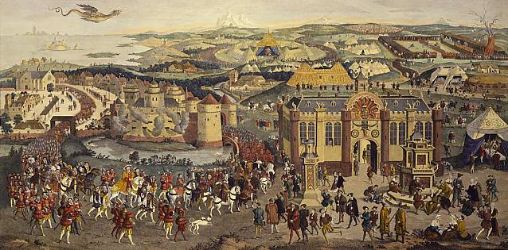  

### 1494

Hiszpania i Portugalia zawarły traktat z Tordesillas, dzieląc między sobą nowo odkryte terytoria.

Pochwyciwszy kartkę papieru, ołówek, cyrkiel i ekierkę możemy kreślić dowolne półkola, wymyślne wielokąty i przestrzenne figury. Nasza wyobraźnia i zachcianki mają szerokie pole do popisu. Znudziwszy się tą zabawą pokreśloną kartkę odkładamy na bok, i dla większego przytupu, bierzemy na tapetę mapę. Znowu spod rąk naszych wychodzą pikantne zawilce, tym razem jednak okrąg okala Wielką Brytanię, krzyż dzieli na cztery części Afrykę, i oto Australię i Azję oddajemy mocy pięciokątów. Płaszczyzna dzieli się na wiele odrębnych pól, a my teraz możemy nadawać im właściwe, rodzącym się pomysłom, nazwy i przeznaczenia. Bawiąc się, najpewniej z zupełnej nudy, wnet odkrywamy perfidię stawianych linii. Mapa Ziemi będąca przedmiotem naszej dowolności jest odzwierciedleniem rzeczywistych lądów, my zaś nanosząc kolejne prostopadłe i równoległe, poddając je wydawanym z fotela werdyktom, dzielimy ludzkie społeczności i niczym bogowie ze zbyt małym sercem, kreujemy ich predestynację, posuniętą kilka pokoleń wprzód.

Kultura polityczna, jeżeli respektuje wolność oraz rozwijająca się sieć świadomości, której za instrument może służyć Internet, dopominają się o to by mieszkańcy danego terytorium sami stanowili o jego statusie i brali czynny udział w podejmowaniu decyzji dotyczących norm i praw obowiązujących w jego granicach. Gdy tworzymy spółdzielnie, bierzemy udział w referendum, gdy nasi ziomkowie zamieszkują całą dolinę, kiedy zdajemy się sobie suwerenni lub jesteśmy pewni prawidłowości i struktury zamieszkiwanego świata, jakże odrealnioną wydaje się ingerencja nieznanego władcy, który bez wiedzy naszej ogłasza „stało się”, my zaś nie wiemy, że zapadł wyrok, chociaż niedługo potem przychodzi nam poczuć na plecach chłód metalu i usłyszeć podnoszone stentorowym głosem „wynoście się”!

Ideologowie i intelektualiści aktualnych żądzy, od wieków, po dziś, tworzą i nanoszą na mapy siatki podziałów świata – autentyczne, będące uaktualnieniem dokonywanych podbojów, bądź planistyczne, potwierdzające prawa do przyszłych ekspansji. Inne znowu mają natchnąć ludzi do określonego, najczęściej uproszczonego myślenia o rzeczywistości, a zatem przygotowują ludzkie umysły do „właściwego” postrzegania kreowanych zdarzeń. Szczególną cechą umożliwiającą zidentyfikowanie tych projektów jest ich ambicja do jednoczesnego opisania i zagospodarowania świata oraz dążność do sprowadzenia skomplikowanej rzeczywistości do tarć między kilkoma głównymi blokami, w których jakoby zgrupowała się ludzkość. Implementowaniem takich treści do naszych umysłów zajmuje się między innymi gra geopolityczna. System zimnowojenny, zderzenie cywilizacji Huntingtona, czy konfrontacja cywilizacji morza i ziemi Dugina, to jedne z takich właśnie oprogramowań, które uwodząc człowiecze umysły, ułatwiają gromadzenie wielkich zasobów i mas ludzkich oraz wdrażanie wielkich przedsięwzięć, na pohybel dominujących opcji politycznych, gospodarczych i finansowych.

Dzisiaj, dzięki łatwiejszemu obiegowi informacji, mamy potencjalną możliwość do rozpoznawania tego rodzaju globalnej inżynierii politycznej. Możliwość ta nie przełożyła się jeszcze na ogólnoludzką świadomość jej istnienia; ten kto szuka i zastanawia się oraz nie jest pozbawiony dostępu do informacji, czasami przekonuje się niemniej, że król jest w istocie nagi. Komfort to złudny, jako, że nie stawiamy procesom tym skutecznego odporu. Jednakowoż z historycznego punktu widzenia, wiedząc o nich, znajdujemy się w sytuacji jak dotąd rzadkiej i nie często spotykanej. Miejmy w pamięci tych wszystkich, którym nie dane było poznanie, które umożliwiłoby im przedsięwzięcie odpowiednich środków zaradczych.

7 czerwca 1494 roku złożono podpisy pod bardzo znamiennym traktatem. Dokument ten słusznie nazwano „pierwszym podziałem świata”. Nigdy wcześniej i później, kilkoma pociągnięciami wskaźnika, pionowo i poziomo wzdłuż mapy, nie zdecydowano naraz o losie tak wielkiej ilości ludzi, związków i narodów, o których w momencie podejmowania decyzji nie posiadano najmniejszego pojęcia. Konieczność narady i rokowań sprokurowało dopłynięcie Krzysztofa Kolumba do wysp karaibskich w 1492 roku, które podówczas uznano za przedmurze Indii. Genueńczyk, osiągając w służbie królowej Kastylii Izabeli i Ferdynanda Aragońskiego współrzędne kontynentu amerykańskiego, otworzył ocean atlantycki dla roszczeń hiszpańskich. Zgłaszane pretensje wielce były problematyczne dla równie katolickiego monarchy, Jana II, władającego z Lizbony. Od ponad 60 lat statki portugalskie penetrowały już zachodnie wybrzeża Afryki. Robiono przy tym wiele by postępy okrętów z Sargres, gdzie powstała stocznia, nie były głośne na innych europejskich dworach. Ekspansja była możliwa dzięki odpowiedniemu ulokowaniu prekursora tych wypraw, księcia Henryka Żeglarza, który był jednocześnie wielkim mistrzem rycerskiego Zakonu Chrystusa, wzbogaconego na majątku rozwiązanych przez papiestwo Templariuszy. Wspierani przez poddanych korony portugalskiej zakonnicy chrystusowi mieli dość środków by organizować zamorskie ekspedycje.

Wiadomość o sukcesie pływającego pod hiszpańską banderą Kolumba, skłoniła portugalską koronę do energicznych protestów. Naruszenie dotychczasowego monopolu przez iberyjskiego sąsiada, uznano za atak na respektowane obustronnie zapisy prawne. Portugalia posiadała papiery uwierzytelniające jej władców do odkryć i podbojów, które wyszły spod rąk papieży Mikołaja V i Kaliksta III, w latach 1452 i 1456. Kastylijscy władcy nie tylko nie oponowali przeciwko temu uprzywilejowaniu, ale mało tego, skupieni na sprawach śródziemnomorskich, uznali te prawa w 1479 roku. Portugalczycy w myśl europejskiego prawodawstwa spajanego osobą papieża, posiadali prawo do panowania nad lądami odkrytymi na wschód i na południe od przylądka Bojador, aż do Indii. Węsząc interes i uporawszy się z problemami wewnętrznymi, Ferdynand Aragoński nie zamierzał ustępować – wraz z małżonką, patronką wypraw Kolumba, powoływał się na prawo pierwszeństwa; podczas gdy Jan II, głowa Portugalii, obstawał przy kluczowych jego zdaniem instrukcjach papieskich. Ubolewania godny konflikt między dwoma katolickimi monarchiami na drodze pokojowej rozstrzygnąć mógł tylko jeden człowiek – papież.

Godność ojca kościoła w owym czasie piastował Rodrigo Borgia, który wstępując na tron objął imię Aleksandra VI. Dorównywał on, a nawet wyprzedzał w niedowładzie moralnym innych „występnych papieży renesansu”. Stolica Piotrowa znajdowała się w pełzającym kryzysie. Pośrednikami bożymi zostawali na przemiennie ludzie ustosunkowani, rekrutujący się m.in. z potężnych rodzin tj. Medici, La Rovere i Piccolomini. Aleksander VI Borgia, sam będący z pochodzenia Hiszpanem, nie wydawał się osobom najbardziej obiektywną do rozstrzygania zgłoszonego mu sporu. Portugalski król nie mógł jednak nie liczyć się ze zdaniem papieża.

3 maja 1493 roku, dwa miesiące po powrocie Kolumba z pierwszej wyprawy, papież ogłosił bullę Inter caetera. Przyznawał w niej Kastylii prawa do wszystkich „lądów położonych naprzeciw części zachodnich i na oceanie” które nie znajdywały się dotąd we władaniu innych chrześcijańskich władców. Hiszpanie otrzymali więc takie same prawo do ziem zachodnich, jakie wcześniej przyznano Portugalii w stosunku do terytoriów położonych na wschód i południe od Europy. W drugiej bulli ogłoszonej dzień później, Aleksander VI spróbował dokładniej nakreślić prawa i granice geograficzne stanowiące linię demarkacyjną dla zakusów obu monarchii. Abstrahując od znanych już wtedy faktów geograficznych uczynił to na tyle nieumiejętnie, iż wszczęto dodatkowe rokowania portugalsko-hiszpańskie. W ostateczności linię oddzielającą strefy wpływów dwojga iberyjskich sąsiadów poprowadzono w linii poziomej wzdłuż Wysp Zielonego Przylądka oraz 370 leguas morskich (1 legua = 5,55 km) w linii pionowej na zachód od rzeczonej lokalizacji. Ustalenia ponad rocznych rozmów spisano w traktacie zawartym dnia 7 czerwca roku pańskiego 1494 w hiszpańskim mieście Tordesillas.

Tak oto po raz pierwszy i tak wyraźnie, co do późniejszych konsekwencji, rozpłatano świat na dwie części. Mając na uwadze, znane nam dzisiaj rozmiary Ziemi w ruchach Aleksandra VI i iberyjskich monarchów dostrzegamy rys megalomaństwa i zapowiedź, nadchodzącej dopiero i gotowej na wszystko, ekspansji. Werdykt, niektórym ówczesnym w Europie zdawał się oczekiwanym. Papież jako namiestnik boży w ziemskim ogrodzie życia oraz statki wypływające z Europy, niosące obok misji cywilizacyjnej profity łupieżczo-handlowe, łatwo można było przedstawić, jako kontinuum religijnego posłannictwa spoczywającego na chrześcijańskich monarchach. Traktat, poddany wpływowi czasu, oczywiście nie mógł uniknąć erozji, zwłaszcza gdy do kolonialnej rywalizacji włączyły się pozostałe europejskie ośrodki. Tordesillas stało się jednak latarnią, która ekspansji europejskiej za oceany – kolonizacji która i tak by nastąpiła – nadawała określone ramy, tak by „katoliccy monarchowie” nie walczyli ze sobą, lecz w niejakiej koegzystencji, służyli tym samym interesom.

Linia poprowadzona papieską ręką i poprawiona później w Tordesillas, miała jeszcze jeden doniosły aspekt. Potwierdzając własne aspiracje do władania światem, europejscy ekspansjoniści odmawiali samostanowienia i samodzielności wszystkim ludom, na które natrafią podczas eksploracji i podbojów. Świadectwo kolejnych kilkudziesięciu lat po Tordesilas, w obu tylko Amerykach, dostarcza wykładnię pod tę tezę. Każdy lud który nie uznawał zwierzchności europejskiego patrona i nie był natenczas w jakiś sposób użyteczny dla iberyjskich koron, nie dokładając jednocześnie pracy swych rąk do pomyślności skarbu najeźdźców, zagrożony był groźbą wojny i jarzmem niewolnictwa, a tu i ówdzie, widmem feudalnego wyzysku. Nie potrafiący wyjść poza nabyte granice właściwego sobie systemu wartości, Europejczycy nie uznawali granic kultury, terytoriów i samostanowienia napotykanej ludności. Szkicując strefy wpływów w Tordesillas, kreślono zarazem przyszłe losy – wydawano wyroki na całe państwa, narody i społeczności, żyjące poza światem zachodniej Europy. Huastekowie, Cibonejowie, Mapucze, ludy Kanady czy autochtoni mówiący językiem czibcza – żadne z nich, choć jeszcze im nieznane, w oczach aspirantów do władania światem nie posiadało podmiotowości prawnej i w toku kolonizacji miało zostać podbite, wchłonięte lub rozmyte w wodach zwierzchności rezydującej w europejskiej metropolii. Nie ma dzisiaj w obu Amerykach ani jednego narodu, państwa, ani związku plemiennego, który zachowałby całkowitą suwerenność i tworzył niepodległą jednostkę terytorialną uznawaną przez Organizację Narodów Zjednoczonych.

Traktat z Tordesillas stanowił swego rodzaju początek, wykładnię pod to jak należy zapatrywać się na kultury i narody żyjące poza europejskim kręgiem kulturowym. Europocentryzm i poczucie wyższości święciły zasadnicze triumfy przez następne wieki. Konferencja w Berlinie roku 1885, w gościnie u Otto von Bismarcka stanowiła nową, bardziej świecką wersję Traktatu z Tordesilllas dla Afryki i podobnie jak prototyp z roku 1494 skutkowała później aneksjami, najazdami i widzialnymi aktami ludobójstwa.

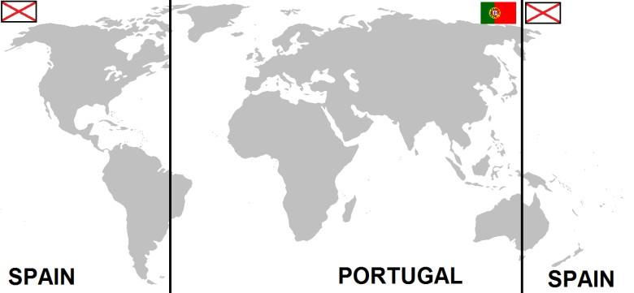  

### 1457

Wojna trzynastoletnia: król Kazimierz IV Jagiellończyk wjechał triumfalnie na wykupiony od czeskich najemników zamek w Malborku.

Po klęsce wojsk polskich pod Chojnicami w 1454 r. w starciu z zaciężnymi oddziałami Zakonu Krzyżackiego, król Polski Kazimierz zdał sobie sprawę, że bez dodatkowych funduszy na nowoczesne oddziały zaciężne nie wygra konfliktu. Po przyznaniu szlachcie nowych przywilejów uzyskał on dodatkowe fundusze na prowadzenie działań wojennych przeciw Zakonowi. Wsparcia finansowego Polsce udzieliły także bogate miasta kupieckie Pomorza i Prus zbuntowane przeciwko Krzyżakom. Mając wystarczającą ilość środków finansowych król Kazimierz Jagiellończyk rozpoczął negocjacje z zaciężnymi oddziałami krzyżackimi, stanowiącymi załogi twierdz Zakonu, na czele z Malborkiem, w celu wykupu tych zamków. W trakcie negocjacji strona polska wykorzystała fakt, ze Zakon zalegał zaciężnym z wypłatą żołdu. 6 czerwca 1457 r. po ustaleniu wysokości wykupu (190 tys. florenów), załoga krzyżacka złożona w większości z Czechów, dowodzona przez  Oldrzycha (Ulryk) Czerwonkę, przeszła wraz z zamkiem malborskim na stronę Polski. Uwolniono więzionych na zamku jeńców i odzyskano sztandary polskie utracone w wyniku przegranej bitwy pod Chojnicami. Rotmistrz Czerwonka w nagrodę za pomyślną finalizację transakcji został mianowany nowym starostą królewskim na malborskim zamku. W południe 8 czerwca 1457 r. król Polski Kazimierz IV Jagiellończyk wjechał uroczyście do Malborka, jednocześnie inną bramą z zamku uchodził w kierunku Królewca wielki mistrz Zakonu Krzyżackiego Ludwik von Erlichshausen. Polska objęła Malbork we władanie na następne 315 lat.

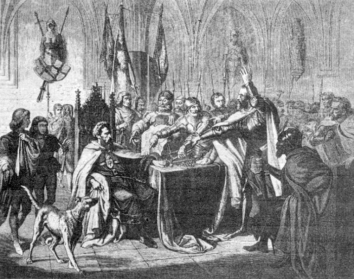  

---

<a href="https://github.com/TomaszWaszczyk/historia.waszczyk.com/edit/master/src/content/june-7.md" target="_blank">Edytuj tę stronę dzieląc się własnymi notatkami!</a>
