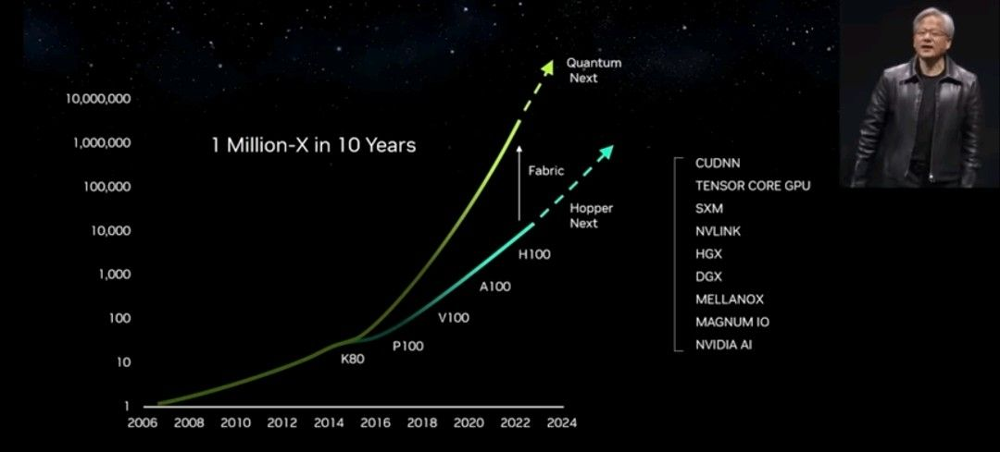
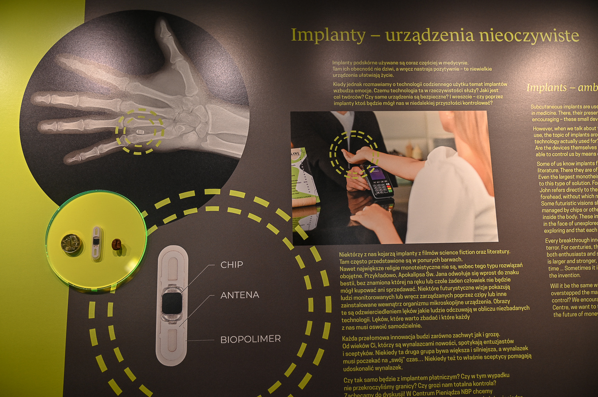

### 2023

"We have software factories now. In the future we will have AI factories, and they will build your company's intelligence." - Jensen Huang

"Information transformed to other forms of information is now possible [in real time]." (Such as intake audio, turn into text, turn back into audio in another language in a real time video chat with an AI avatar.) - Jensen Huang

"Processing power has increased 1,000X in the last five years. That's on track for 1,000,000 times in ten years." - Jensen Huang

  

### 2022

Implant płatniczy w Centrum Pieniądza #NBP.
Implanty płatnicze, tak jak inne nowoczesne technologie, budzą kontrowersje. Należy jednak pamiętać, że implanty używane są m. in. w medycynie i są bezpieczne dla naszego organizmu. 
Do niewątpliwych zalet ich stosowania zaliczyć możemy fakt, że jest on zawsze z nami, nie musimy się już martwić np. zapomnianym portfelem i możemy używać go w miejscach takich jak basen, plaża albo koncerty czyli wszędzie tam, gdzie z różnych względów wolelibyśmy nie zabierać karty płatniczej.
Prezentowany w gablocie implant jest bardzo małych rozmiarów, wyglądem przypomina  agrafkę o wymiarach ok. 0,5 mm x 7 mm x 28 mm i waży niecały 1 gram. 
Wykonany został z biopolimeru używanego do produkcji wyrobów medycznych. Oznacza to, że nasz organizm nie zareaguje na niego jak na ciało obce, a nasze tkanki w naturalnym procesie taki biopolimer zabudowują. 
Implant wykorzystuje technologię NFC. Jest to bezdotykowa i bezprzewodowa technologia komunikacyjna bliskiego zasięgu (znana już m. in. z telefonów komórkowych), która wykorzystuje fale radiowe do udostępniania informacji oraz ich wysyłania na odległość kilku centymetrów. 
Implant nie emituje żadnych fal ani promieniowania i nie posiada własnego zasilania. Nie jest również urządzeniem typu GPS i służy wyłącznie do dokonywania płatności. 
W celu dokonania zapłaty należy przyłożyć implant do terminala płatniczego, wtedy informacje z czipa przekazywane są, dzięki antenie w nim umieszczonej, do terminala.
Implanty płatnicze, jak każda przełomowa innowacja, wzbudzać mogą zarówno zachwyt jak i lęk. Czy warto jednak bać się wszystkiego co nowe? Zachęcamy do dyskusji a także zapraszamy do Centrum Pieniądza NBP!

  

### 2021

  

<!-- https://twitter.com/bitfalls/status/1402294652024274945

https://twitter.com/ohmzeus/status/1401772029263683585
 -->

### 2020

  

---

  

---

Shenzen Adopts China's First Personal Bankruptcy Laws As Small Businesses, Freelancers Face Financial Ruin

A Communist State founded - at least, in theory - on the principles of social justice and equality, China doesn't have personal bankruptcy laws, and individuals who are saddled with debt, medical or otherwise, are typically held liable for these debts until death.
Despite corporate bankruptcy laws nationwide since 2007, individuals are still held personally liable for business debts, which makes it virtually impossible for entrepreneurs to be 'okay' with failure, like American entrepreneur gurus have advised.
Now, Shenzhen, known as the "Silicon Valley" of the mainland, has drafted China’s first personal bankruptcy laws for what's expected to be a wave of bankruptcies. The rules are intended to give "honest and unfortunate" debtors the chance to escape the mire of debt and make a comeback.
China has built its explosive growth on a mountain of bad debt. What's going to happen when investors in the country are forced to take losses on "safe" securities for the first time?

---

<video width="640" height="480" controls>
  <source src="./movies/june/Hologram.mp4" type="video/mp4">
Your browser does not support the video tag.
</video>

---

Premier polskiego rządu, Mateusz Morawiecki, jest chyba sporym optymistą albo zaklina rzeczywistość. Uważa, że współczynniki ekonomiczne dot. polskiej gospodarki, które dziś mogą nas przerażać, szybko się poprawią. Chodziło mu m.in. o inflację.

Premier Mateusz I Optymista

– Mam bardzo poważną nie tylko nadzieję, ale też podstawy makro- i mikroekonomiczne, żeby wierzyć w to, że bezrobocie nie będzie dwucyfrowe – powiedział w sobotę w RMF FM premier. – Wzrost bezrobocia będzie niższy, niż instytucje finansowe z całego świata zakładały jeszcze miesiąc temu – dodał.

To nie jedyne dobre wieści. Zapytany o PKB powiedział, że ma nadzieje, że będzie mniejsze niż prognozowany przez większość instytucji ratingowych i finansowych poziom minus 4,5 proc.

Z kolei zadłużenie naszego kraju wzrośnie, jak uważa, zapewne o 7-8 pkt. proc. – Myślę, że nie przekroczy granicy 55 proc. – powiedział.

Inflacja? Będzie spadać!
premierNas najbardziej interesuje jednak kwestia inflacji. Według szefa polskiego rządu ta „będzie bardzo szybko siadać”. Już ponoć latem spadnie poniżej celu inflacyjnego NBP.

Przypomnijmy, że inflacja w maju wyniosła już tylko 2,9 proc. w ujęciu rocznym – przynajmniej tak wynika ze wstępnych szacunków Głównego Urzędu Statystycznego (GUS). To najniższy poziom tego wskaźnika w 2020 r., ale nie oznacza to, że powinniśmy się cieszyć. Inflacja mogła spaść dlatego, że ostatni okres to czas lockdownu, gdy ludzie rzadko wychodzili z domów, nie mogli chodzić do centrów handlowych (te były przecież nieczynne), a to mogło zmniejszyć popyt na produkty i usługi, a przez to spadły i ceny. Teraz – po odmrożeniu rynków – sytuacja może być odwrotna i znowu zauważymy skok inflacji. Zresztą w nieco dłuższej perspektywie również może być nieciekawie – zwłaszcza jeśli weźmie się pod uwagę politykę monetarną banków centralnych na całym świecie.

Wracając do premiera, ten zapewnił też, że jego rząd utrzyma wszystkie programy społeczne i socjalne, jakie dotąd wprowadził, łącznie z 14. emeryturą. Wynika z tego, że władza nie zlikwiduje też 500+.

---

Prywatne inwestycje sa kluczowe, a tu masakra PiS:

— NBP kupuje obligacje PFR i SP glownie od panstwowych bankow

— NBP obnizyl stopy proc. - odplyw depozytow, zachwianie stabilnoscia bankow

— Skarb emisje 50mld+ ulokowal w panstw. bankach zamiast firmy i inwest.

— Podatek bankowy nie obowiazuje na aktywach obligacji SP bankow

— polityka PiS wypiera prywatne inwestycje i kredyt

— polityka PiS = etatyzm, klientelizm, nacjonalizacja, panstwowe firmy “czebole” Twarz ze łzami radości

### 2015

  

### 1943

W Krakowie, biskupi polscy obradujący podczas zwołanej przez kardynała Adama Sapiehę Konferencji Episkopatu Polski wystosowali memoriał skierowany do gubernatora generalnego Hansa Franka w sprawie "nieludzkiego traktowania Polaków wywożonych na przymusowe roboty do Niemiec". Osobną kwestią poruszoną w tym dokumencie był brak właściwej opieki religijnej.

  

### 1942

Prawdopodobnie 8 czerwca 1942 roku w Warszawie zamordowany został Henryk Szaro (zdjęcie) znany scenarzysta, reżyser teatralny i filmowy, jeden z pionierów polskiej sztuki filmowej.
W nocy z ósmego na dziewiąty czerwca 1942 roku został aresztowany razem ze swoim teściem w warszawskim mieszkaniu przy ulicy Pańskiej. Został zastrzelony na ulicy. Miał 42 lata.

  

### 1794

Miała miejsce w czasie Insurekcji Kościuszkowskiej bitwa pod Chełmem.
Wojska mianowanego przez przywódcę insurekcji Tadeusza Kościuszkę generała Zajączka próbowały bezskutecznie rozbić rosyjski korpus generała Zagriażskiego. Doszło,więc do bitwy z 16,5 tysiącami Rosjan. Przeciw nim stanęło 6 tysięcy polskich żołnierzy i 2 tysiące kosynierów.
Bój rozpoczął się około godz. 10.00 Rosjanie z impetem uderzyli na prawe skrzydło obrony polskiej obsadzone przez generałów Wedelstaedta i Haumana.
Walczący tu Pułk Działyńskich
zachował się dzielnie. Pospolite ruszenie, pikinierzy i kosynierzy rozbiegli się w panice. Rosjanom dzięki przewadze w artylerii udało się zmusić Polaków do odwrotu w kierunku miasta.
Załamanie w szeregach Polskich nastąpiło po godzinie 17 tej, gdy rosyjski pocisk armatni urwał głowę dowódcy artylerii polskiej Michałowi Chomentowskiemu.
Szef sztabu gen. Zajączka major Karol Kniaziewicz znakomicie zorganizował
odwrót zapobiegając całkowitej
zagładzie korpusu.

  

Grafika; obraz Michała Stachowicza "Kosynierzy chłopskiego pospolitego ruszenia"

---

<a href="https://github.com/TomaszWaszczyk/historia.waszczyk.com/edit/master/src/content/june-8.md" target="_blank">Edytuj tę stronę dzieląc się własnymi notatkami!</a>
