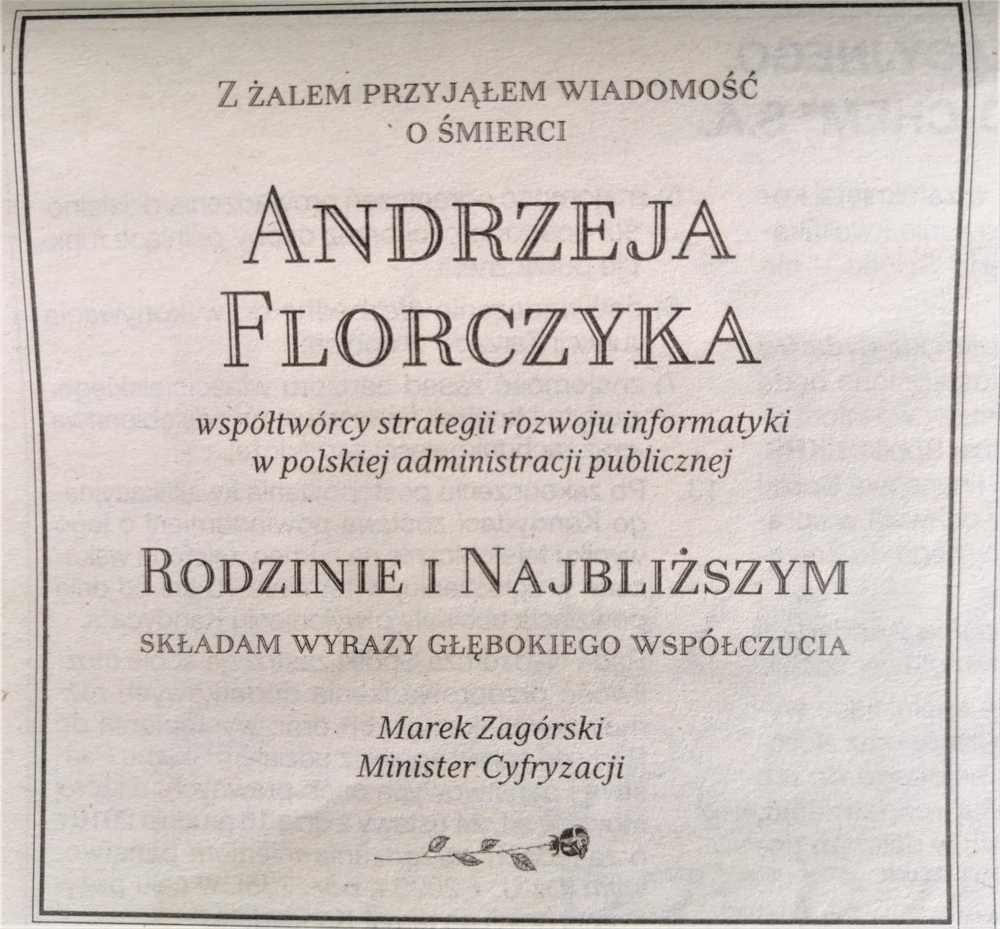
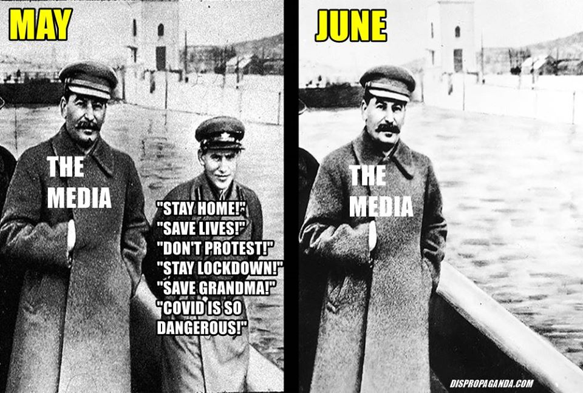
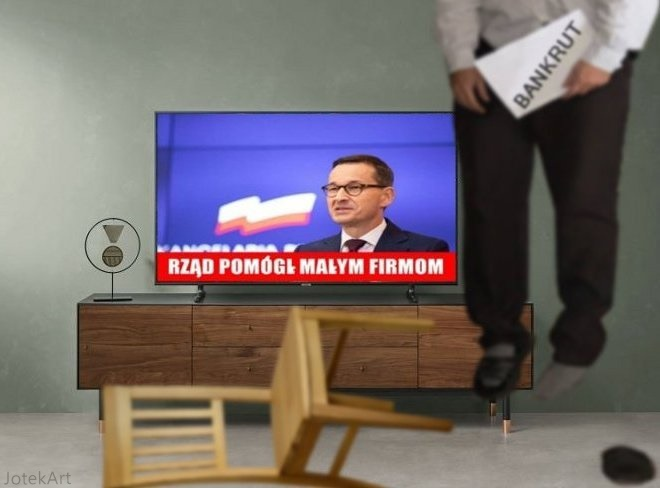
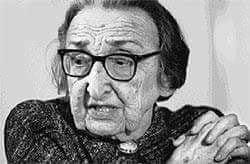
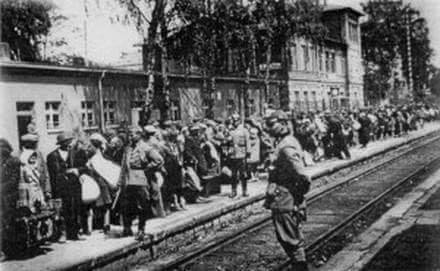
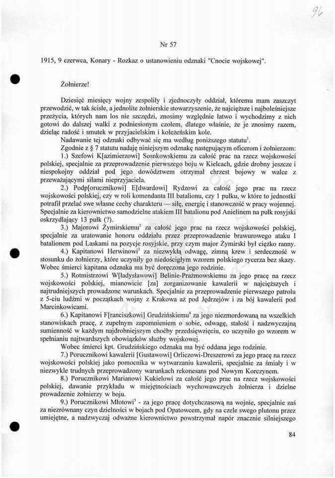

### 2020

Polska: 1 tys. złotych - taki limit jednorazowej wypłaty z bankomatu wprowadza sieć Euronet. Oficjalnie chodzi o to, by zapewnić wszystkim dostęp do gotówki.

---

Things that happened on the same day, 9 june 2020.

1. The US economy was officially confirmed to be in the recession.
2. Nasdaq Composite hit all time high and went over 10 000 points.
Beyond insanity.

---

  

---

  

---

  

---

  

---

### 2002

W Londynie zmarła dr. Lidia Ciołkosz- historyk, publicystka, działaczka Polskiej Partii Socjalistycznej, Towarzystwa Uniwersytetu Robotniczego i Robotniczego Towarzystwa Przyjaciół Dzieci. Autorka prac o polskiej publicystyce emigracyjnej i historii Polski. Od 1978 roku stała na czele Centralnego Komitetu Polskiej Partii Socjalistycznej. Od 1990 roku aż do śmierci Honorowa Przewodnicząca PPS. Była ostatnią żyjącą członkinią władz przedwojennej PPS. Należała do grona socjalistów demokratycznych, czyli zdecydowanych przeciwników ustroju komunistycznego. Prywatnie była żoną Adama Ciołkosza - przywódcy PPS na emigracji.

Pochodziła z asymilującej się rodziny żydowskiej.
Jej pasją było harcerstwo. Działała w łódzkiej Drużynie Harcerskiej im. Tadeusza Kościuszki, obejmującej dziewczęta i chłopców wyznania mojżeszowego z różnych szkół polskich.
Wykształcenie zdobywała na Uniwersytecie Jagiellońskim, gdzie ukończyła polonistykę i historię oraz Studium Pedagogiczne. Uzyskała tytuł doktora. W czasie studiów w Krakowie poznała swojego przyszłego męża Adama Ciołkosza. W czasie wojny polsko-bolszewickiej pracowała jako wolontariuszka w biurze wojskowym.Od roku 1920 zaangażowana w działalność Polskiej Partii Socjalistycznej. Do wybuchu II wojny światowej pracowała jako bibliotekarka i wykładowczyni Towarzystwa Uniwersytetu Robotniczego (TUR), wychowawczyni i organizatorka kolonii letnich oraz świetlic dla dzieci robotniczych. Od roku 1934 wybierana do Rady Naczelnej PPS. Po wybuchu wojny w 1939 roku przedostała się z rodziną do Lwowa, skąd przez Litwę i Szwecję, a następnie Rumunię i Francję udali się do Londynu, gdzie w okresie 1940–1948 Lidia była członkinią Komitetu Zagranicznego PPS. W okresie emigracyjnym pełniła funkcję członkini Centralnej Rady PPS (1948–1960, w tym w okresie 1957–1960 członkini Centralnego Komitetu Zagranicznego PPS). W 1960 w wyniku konfliktu w PPS na tle politycznym została wraz z mężem usunięta z partii. Przyczyną był stosunek do zmian w PRL po wyborze na stanowisko I sekretarza KC PZPR Władysława Gomułki. W przeciwieństwie do wielu partyjnych towarzyszy, Ciołkoszowie nie dawali mu kredytu zaufania. Po rozłamie zaangażowała się w działalność utworzonego Centralnego Komitetu Odbudowy PPS, stanowiącego odłam PPS na emigracji. Od 1978 roku była liderką struktur PPS na emigracji. Angażowała się w poparcie i pomoc krajowej opozycji demokratycznej, głównie Komitetu Obrony Robotników.
Lidia Ciołkosz była autorką wielu artykułów, broszur i audycji radiowych. Jej najbardziej znane dzieło napisała wspólnie z mężem Adamem i nosi ono tytuł – Zarys dziejów socjalizmu polskiego. Została wyróżniona nagrodami literackimi paryskiej Kultury , Stowarzyszenia Polskich Kombatantów i fundacji im. Jurzykowskiego oraz orderem Polonia Restituta. Była członkiem Polskiego Towarzystwa Naukowego na Obczyźnie.
Wraz z mężem jest patronką Domu Dziecka nr 9 w Warszawie.

  

---

---

### 1942

Niemcy rozpoczęli likwdację getta w Olkuszu.
Oto relacja Mariana Głuszeckiego wówczas 42 letniego mieszkańca Olkusza:
„W czerwcu 1942 r. nastąpiła likwidacja getta w Olkuszu. (…) Akcja rozpoczęła się nad ranem. Dzielnica obstawiona była podwójnym szpalerem policji niemieckiej. (…) Milicjanci żydowscy, którzy na akcję tę przyszli specjalnie z Będzina i Sosnowca, znęcali się w niemożliwy sposób nad ludźmi, bijąc
i kopiąc ich nogami. Jeden z nich szczególnie wyróżniał się pod tym względem brutalnością.
(…) zawołał mnie jeden z gestapowców
i zapytał, wskazując na to, co robi milicja
żydowska, jak mi się to podoba i co ja o tym sądzę. Powiedział, że ordnerzy żydowscy zachowują się znacznie gorzej niż gestapowcy i że wzywa mnie na świadka, że gestapo w ogóle ludzi nie bije, jak sam zresztą widzę (…). Wspomniany wyżej gestapowiec w mojej
obecności zawołał jednego ordnera do siebie, zbił go i zrzucił ze schodów, pytając się mnie, czy słusznie zrobił. Po skończonej likwidacji okazało się, że w kryjówkach znajduje się cała masa Żydów (…). Kryjówki zazwyczaj były
z góry przygotowane i tak dobre, że odkrycie ich przez Niemców było niemożliwe.
Wynajdywali je jednak, prześcigając się
w gorliwości, żydowscy ordnerzy,
doprowadzając tych ludzi na punkt zborny.
Ludzi ukrywających się (…) dołączono
automatycznie do transportu oświęcimskiego.
Każdy Żyd, spotkany w tym czasie na ulicy getta, był narażony na śmierć przez
zastrzelenie na miejscu”.

  

### 1915

Józef Piiłsudski wydał rozkaz o ustanowieniu odznaki "Cnocie wojskowej".

  

### 1885

https://pl.wikipedia.org/wiki/Felicjan_S%C5%82awoj_Sk%C5%82adkowski

### 1815

https://pl.wikipedia.org/wiki/Kongres_wiede%C5%84ski

Na mocy traktatu ogólnego Kongresu Wiedeńskiego utworzone zostało " wolne, niepodległe i ściśle neutralne Miasto Kraków z okręgiem". Było ono efektem porozumienia w sprawie spornego terytorium zaborczego między Austrią, Rosją i Prusami. Zasady przyszłej konstytucji tego terytotrium, zawarte w tak zwanym Traktacie Dodatkowym nadawały mu ustrój republikański, a trzy wspomniane mocarstwa zobowiązały się do szanowania neutralności Rzeczypospolitej.

---

<a href="https://github.com/TomaszWaszczyk/historia.waszczyk.com/edit/master/src/content/june-9.md" target="_blank">Edytuj tę stronę dzieląc się własnymi notatkami!</a>
