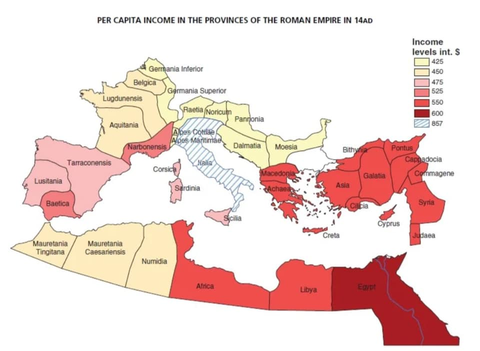

## Per capita income in the provinces of the roman empire, 14 n.e.

---

<a href="https://github.com/TomaszWaszczyk/historia.waszczyk.com/edit/master/src/content/maps.md" target="_blank">Edytuj tę stronę dzieląc się własnymi notatkami!</a>
