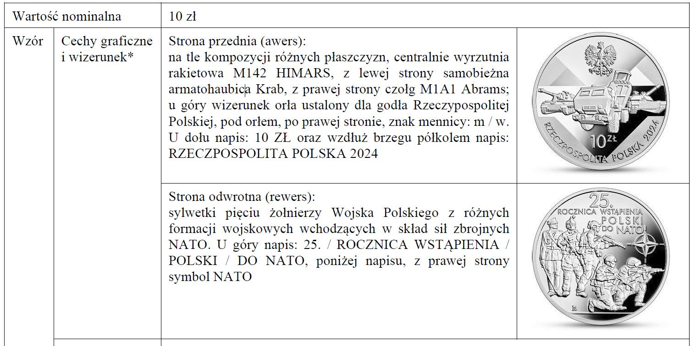
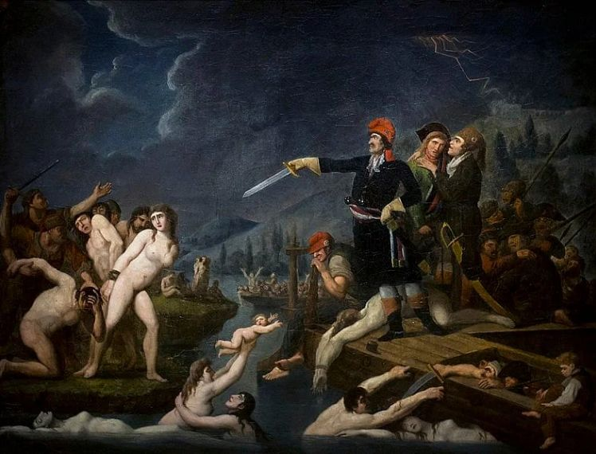
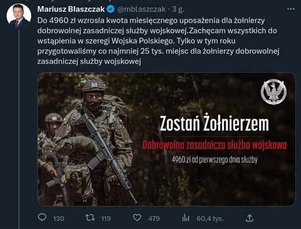
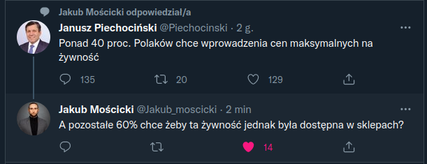
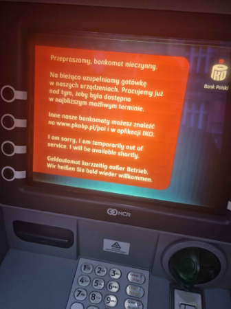
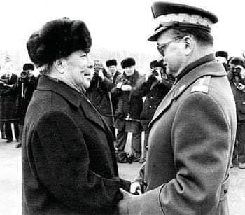
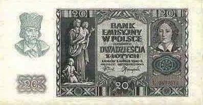
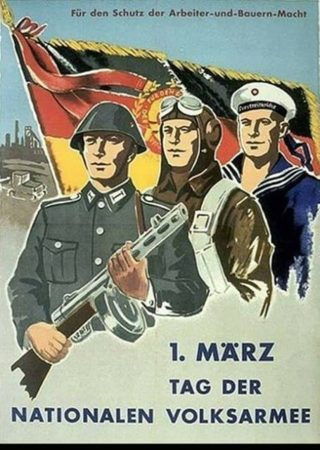
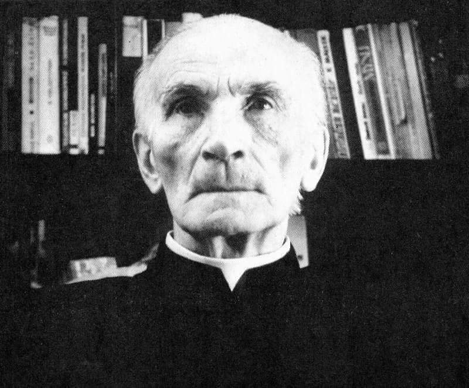

### 2024

> this is the age of community: you either join or build something bigger than yourself or you struggle 🤷

---

  

  

Jednolity obszar edukacji: Kto rządzi przeszłością, w tego rękach jest przyszłość; kto rządzi teraźniejszością, w tego rękach jest przeszłość

Historia nauczycielką życia, ale jak wiadomo ministra za bardzo to za życiem nie jest i jeszcze została wystawiona przez międzynarodówkę do sformatowania małych ludzi. Każda osoba odróżniająca Norbiego od Norwida rozumie, że wykreślenie z historii Pileckiego, Kolbe, Kordeckiego, Czarnieckiego, „Inki”, zakonu krzyżackiego, największej bitwy Średniowiecza, Kościuszki, Pułaskiego, Konfederacji Barskiej, Locarno to pisanie na nowo przez ludowych komisarzy historii PL. Jak przeszłość rządzi przyszłością przedstawię na 3 przykładach.

👉 Wiemy, że Henryk VIII różnie żył ze swoimi małżonkami i z niektórymi rozstawał się nagle, lecz mało kto wie, że król odpowiada za zabicie ok. 60-70k ludzi, przede wszystkim kleru i przeciwników politycznych.
👉 Za najbardziej morderczą organizację w historii Polska Ludowa uznawała Świętą Inkwizycję i liczbę jej ofiar szkolne podręczniki szacowały wówczas na 600k, chociaż w pamięci ludzkiej do dziś pokutują miliony. Tymczasem wykonanych wyroków śmierci od XIII do XIX w. historycy doszukali się kilkunastu tysięcy. Tyle samo osób zostało zgilotynowanych w 2y jakobińskiego Wiekiego Terroru, co i tak blednie przy wojnach wandejskich...
👉 Doktrynerstwo, szaleństwo i dyktatorskie zapędy Rewolucji napotkały opór biednego chłopstwa francuskiego, na co młoda Republika odpowiedziała wysłaniem Gwardii Narodowej do pacyfikowania biedoty. Wieś odpowiedziała oporem w imię Boga i Króla. A w świecie lewicy Konwentu nie było miejsca na wiarę... „Oświeceni” republikanie wierzyli tylko w Rozum, stąd dekretem usankcjonowano istnienie „Istoty Najwyższej”, która miała zastąpić wierzenia prowincji. Później Lenin i Stalin wiarę zastępowali kultem jednostki, dziś widać zresztą podobne zapędy w walce z konserwatyzmem.
🤦Ostatecznie w Wandei zamordowano do 800,000 niewinnych ludzi za religię lub rojalizm. To pierwsze ludobójstwo nowożytnej Europy, gdzie lewica przemysłowo mordowała ludzi topiąc ich na barkach. Komitet Rewolucyjny ukuł na tę okazję eufemistyczny termin ⏩ „deportacja pionowa”, gdzie po 400 osób co chwilę topiono na środku Loary. Upokarzano dodatkowo kobiety, mężczyzn i dzieci (!), bo rozbierano ich do naga i przywiązywano do siebie przed zatopieniem. Praktykę tę określano ironicznie jako „małżeństwa republikańskie”...
Generał François Westermann donosił z entuzjazmem "Nie ma już Wandei. Wraz ze swymi kobietami i dziećmi zginęła pod naszą wolną szablą. Grzebię ją w bagnach i lasach. Miażdżyłem dzieci kopytami koni, masakrowałem kobiety, które nie będą już rodzić bandytów."

100% z Was zna Inkwizycję choćby dzięki antyklerykałowi Umberto Eco i pewnie 99,9% nie poznało nigdy Wandei. Czytelnicy teraz sami sobie mogą wyrobić zdanie, jak łatwo można manipulować milionami ludzi przez pomijanie albo wyolbrzymianie elementów historii. Historia to za poważna rzeczy, by zostawić ją politykom.

### 2023

  

### 2022

  

Masowe wypłaty gotówki, nieczynne bankomaty:

  

---

> Tak silnego wzrostu cen producentów w strefie euro nie pamiętają najstarsi statystycy. Inflacja PPI przekroczyła w grudniu 26% i wyznaczyła nowy rekord w historii unii walutowej przy całkowitej bierności Europejskiego Banku Centralnego.

> W grudniu 2021 roku ceny producentów – czyli tzw. inflacja PPI (producer price index) – w strefie euro były o 2,9% wyższe niż w listopadzie oraz aż o 26,2% wyższe niż rok temu – poinformował Eurostat. Licząc dla wszystkich państw Unii Europejskiej, wskaźnik ten osiągnął identyczną dynamikę: 2,9% mdm i 26,2% rdr.

---

### 2021

> “All truth passes through three stages. First it is ridiculed. Second it is violently opposed. Third it is accepted as being self-evident.” - Citigroup on Schopenhauer on Bitcoin

<!-- ### 2020 -->

<!-- ==================================================================================================================================================================================================================================================
1) Lista tematow prezentacji wraz z przewidywanym planem powinna byc dostarczona do godziny 17:00 dnia poprzedzajacego spotkanie
2) Transmisja ze spotkania odbywa sie na slacku - kanal #pdm (potrzeba miec wersje desktop slacka)
3) Do wyswietlania slajdow na rzutniku uzywamy dedykowanego laptopa z IT, takze glos jest transmitowany za posrednictwem tego laptopa
4) Osoba, ktora ma pierwsza prezentacje jest odpowiedzialna za sprawdzenie czy sprzet jest na miejsu i zestawienie calosci - w razie braku sprzetu w sali trzeba kontaktowac sie z IT
5) Mamy dedykowane konto na slacku, ktore powinno byc uzywane na dedykowanym laptopie (iteration.demos@relayr.io/PiatkoweDem0$#)
6) Prezentowanie slajdow oraz demonstracje odbywaja sie z komputera osoby prezentujacej
7) Dla usprawnienia przechodzenia miedzy prezentacjami osoby prezentujace powinny byc wczesniej wdzwonione na spotkanie na swoich laptopach z wyciszonym dzwiekiem oraz wyciszonym mikrofonem
8) Slajdy dotyczace pracy oraz planow na przyszla iteracje poszczegolnych zespolow:
       a) powinny znajdowac sie w odpowiednim katalogu na google drive przed spotkaniem
       b) slajdy powinny w jasny sposob okreslac co z poprzedniej iteracji zostalo zrobione a co nie
       c) w czasie prezentacji nacisk powinien byc polozony na tematy dotyczace produktu jako calosci oraz tematow, ktore maja wplyw na inne zespoly
       d) na koncu prezentacji jest czas na pytania - w tym momencie istnieje mozliwosc dopytania sie o szczegoly tematow, ktore byly przedstawione skrotowo
       e) na koncu prezentacji jest tez czas na ostateczny feedback co do planow ze strony pozostalych zespolow
       f) maksymalny czas na prezentacje to 10 minut - nie liczac pytan (zalecany jest czas krotszy aby wraz z pytaniami zmiescic sie w 10 minutach)
9) Demonstracje oraz relacje z konferencji nie podlegaja  ograniczeniom z punktu 8
10) Po spotkaniu do konca dnia wszystkie uaktualnione slajdy powinny znalezc sie w dedykowanym katalogu na google drive

================================================================================================================================================================================================================================================== 

### 2021

Szkoleniowa ZGNILIZNA
Z dniem 12 lutego 2021r zakończyłem współpracę z „Albrecht International”. Po ponad dwóch latach promowania tej marki podczas setek wystąpień na żywo, budowania społeczności biznesowej na spotkaniach regionalnych w Polsce i za granicą, webinarach i wszędzie tam gdzie tylko mogłem, spakowałem manatki i zrezygnowałem z dnia na dzień. Główny powód odejścia zostawiam dla siebie (i mam głęboką nadzieję, że brudów nie będę musiał upubliczniać) a jeden z innych powodów przedstawiam na załączonym obrazku. 
👉Na co dzień większość czasu poświęcam nieruchomościom a szkoleniami zajmowałem się tylko dodatkowo: z pasji do edukacji, chęci poznania nowych osób i tworzenia nowych relacji. W najbliższej przyszłości na pewno się to nie zmieni, gdyż w przeciwieństwie do firm stricte szkoleniowych nie mam zamiaru robić masówki i opierać swojej działalności wyłącznie na sprzedaży kursów. I to jest jeden z kolejnych powodów, dla których nie chce się identyfikować z pewnymi osobami czy markami. 
👉Dla niektórych nieważne jest to ile osób będzie miało dostęp do danej wiedzy, czy nie będzie przez to na rynku za dużej konkurencji i czy biznes się przez to nie wysypie tak jak podnajem mieszkań na pokoje (z którego szkolenie wciąż przez różne osoby jest wpychane kolejnym nieświadomym osobom z obietnicą świetnego biznesu), liczy się tylko sprzedaż kursu i jak największy przychód. Jak już się przestanie sprzedawać jedno to się wymyśli coś kolejnego, bez względu na to czy kiedykolwiek się to robiło. 
👉I takim też właśnie sposobem DZISIAJ powstało nowe szkolenie z biznesu kwater pracowniczych. Od ponad dwóch lat szkolę i tworzę tą społeczność, poświęcając na pomoc ludziom praktycznie cały swój czas i aż do dzisiaj na stronie internetowej widniała jeszcze informacja, że szkolenie jest prowadzone przeze mnie. Ale już po południu na mój kolejny wniosek o usunięcie stworzonych przeze mnie produktów zostałem poinformowany, że pomimo mojego odejścia szkolenie z biznesu kwater dalej jest sprzedawane, z tym że to szkolenie jeszcze nie istnieje a klienci z okazji „wielkiej ,urodzinowej promocji, która jest raz na 30 lat” na razie kupują produkt, którego tak naprawdę nie ma 😃 Wystarczy zmienić osobę prowadzącą i zrobić nowe prezentacje i wszystko gotowe. 
👉i za jakiś czas ktoś, kto zawsze nazywał ten biznes „śmiesznymi kwaterami”, często mówił że ten biznes za 2 lata padnie a osoby zajmujące się tym nazywał „dzbanami” będzie teraz z tego zagadnienia „uczył”. Wystarczy zrobić promocję, sprzedać i opowiadać o czymś z czym nie ma się ani grama doświadczenia. Ten sam program, te same ułożone przeze mnie teksty, te same pliki, ale inny „lepszy” prelegent.  Świeżaki i tak to łykną bo się wrzuci profesjonalne zdjęcie czy grafikę na Facebooka i podkoloruje cyferki . Bo tu właśnie chodzi wyłącznie o cyferki – cyferki ze sprzedaży a nie o Twoją edukację. Sprzedaje się to co idzie – jak to w handlu 😊
👉Oczywiście to nie jedyny i nie najgorszy przykład szkoleniowej zgnilizny, znam jeszcze osoby, które promują swoje szkolenia a w międzyczasie sprzedają po cichu swoje biznesy, z których szkolą. Takie to super biznesy. Znam osobę, która na swojej stronie internetowej sprzedawała szkolenie z biznesu kwater a dopiero po ponad roku zaczęła to robić. Można?  Wszystko można tylko trzeba umieć wbić się z artykułem do branżowej gazety albo zapłacić za okładkę i eksperckość już masz załatwioną. Pozdro dla kumatych 🐕‍🦺🐕‍🦺🐕‍🦺🐕‍🦺🐕‍🦺
👉Kończąc temat jestem bardzo dumny z tego, że przy współpracy z Albrecht International udało mi się chociaż częściowo spełnić swoją misję i wpłynąć na zmianę standardu najmu pracowniczego w Polsce, wyszkoliłem kilkaset osób i na tym przygoda się kończy, mój kurs będę w przyszłości organizował tylko w rozszerzonej wersji, dla mocno ograniczonej liczby osób i za wyższą cenę. Jeśli sporo moich kursantów zarabia po kilkanaście / kilkadziesiąt tys. złotych miesięcznie to ja nie widzę powodu, dlaczego kurs miałby być tani, ogólnodostępny i powodował zachwianie biznesu dla osób, które zaryzykowały wchodząc w niego wcześniej gdy nie było to jeszcze popularne i rozdmuchane jako dochodowe.
👉Lecę oglądać meczyk  a przez najbliższy miesiąc odcinam się od obowiązków, po kilku latach pracy na dwa etaty i ogromnego poświęcenia łącznie z własnym zdrowiem czas zadbać trochę o siebie a dla chętnych mówię: do zobaczenia niebawem! Jeśli tylko opracuję jak wprowadzić do tej branży lepszą jakość to będzie Wam i innym co oceniać. 
👉Przy okazji pragnę podziękować każdej z tysięcy poznanych osób dzięki mojej dwuletniej działalności, to że mogłem Was poznać sprawiło, że moje życie stało się NAPRAWDĘ bogate i nie przeliczalne na pieniądze, daliście mi prawdziwą wartość. Setki spotkań, kontaktów i setki imprez – i chociaż niektórzy twierdzą, że często przesadzaliśmy z balowaniem do rana i wątroby cierpiały to chcę powiedzieć jedno: przynajmniej nabalowaliśmy się na zapas a pandemia jeszcze trochę potrwa, premier planuje otwierać fabrykę szczepionek a fabryki to nie są krótkotrwałe inwestycje (tego akurat jestem pewien), także jeśli chodzi o mnie to niczego nie żałuję. 
👉I na koniec dziękuję osobom, które doceniły moją pracę, są na „naszej” tajnej grupie, z którymi razem udało się stworzyć prawdziwą a nie tylko wirtualną społeczność i które informują mnie na bieżąco co się dzieje, gdyż niestety zostałem dzisiaj wyrzucony z grupy na Fb na której przez 2 lata pomagałem kursantom, no cóż jakoś przeżyję. Kto chce się spotkać na żywo to zapraszam na priv, będę starał się odpisywać. 😊 Za jakiś czas się spotkamy - pamiętajcie, nie jesteście tylko cyfrą na czyimś koncie ani żadnym "dzbanem", to my to stworzyliśmy.
„Z życzeniami” uczciwych współpracowników
 Pozdrawiam

-->

### 1982

Z dwudniową wizytą przybył do Moskwy I sekretarz Komitetu Centralnego Polskiej Zjednoczonej Partii Robotniczej generał Wojciech Jaruzelski.
Tego samego dnia minister spraw wewnętrznych generał Czesław Kiszczak poinformował, że od chwili wprowadzenia w Polsce stanu wojennego czyli 13 grudnia 1981 roku do 26 lutego 1982 roku w ośrodkach internowania znalazło się 6647 osób.

  

### 1981

W marcu 1981 r. Polska nie była już w stanie spłacać zadłużenia zagranicznego. Problem ze spłatą długów z lat 70. wobec wierzycieli.

"lawiny kredytów"

### 1948

Papież Pius XII (zdjęcie) wystosował list do biskupów niemieckich, w którym nawiązał do między innymi do kwestii polskich granic zachodnich oraz wysiedleń ludności niemieckiej z Polski.
W dokumencie tym Pius XII wyraził współczucie z powodu przesiedleń Niemców, podkreślając jednocześnie, iż wynika to głównie z powodu Holokaustu.
Treść listu szybko obiegła świat, a także odbiła się głośnym echem w Polsce. Kontrowersyjne słowa papieża uznano za nawoływanie do zmiany ustalonych na konferencji w Poczdamie zachodnich granic państwa polskiego.

  

### 1940

Do obiegu wszedł zaprojektowany przez Leonarda Sowińskiego nowy banknot o nominale 20 złotych.
Na awersie tego banknotu widniał wizerunek Emilii Plater, natomiast rewers przedstawiał Wawel.
Banknot drukowano w trzech wytwórniach. Były to: Wiener Staadsdruckerei w Wiedniu, Zakłady Graficzne Banku Emisyjnego w Krakowie i Wytwórnia Papierów Wartościowych w Warszawie.
Przedstawiona dwudziestozłotówka została wycofana z obiegu 10 stycznia 1945 roku.

  

---

  

---

### 1897

We wsi Osse, w powiecie opoczyńskim urodził się Jan Zieja - ksiądz, dogmatyk i biblista, duszpasterz i katecheta, podpułkownik Wojska Polskiego, związany z ZMW RP ,,Wici'' i środowiskiem podwarszawskich Lasek; IX 1939 r. kapelan 84 pułku Strzelców Poleskich 30 Poleskiej Dywizji Piechoty; w czasie okupacji niemieckiej kapelan Komendy Głównej Armii Krajowej, Batalionów Chłopskich i naczelny kapelan ZHP "Szare Szeregi"; współpracownik katolickiego Frontu Odrodzenia Polski oraz Rady Pomocy Żydom "Żegota; w powstaniu warszawskim kapelan pułku ,,Baszta'' AK ; 1976 - 1981 współzałożyciel KOR; ekumenista i rzecznik dialogu z judaizmem.

Tak o księdzu Janie pisała Zofia Kossak-Szczucka - wybitna pisarka, działaczka Frontu Odroczenia Polski i Rady Pomocy Żydom ,,Żegota'':
,,Pozornie nie masz w nim nic wyjątkowego. Wieśniaczy syn wychowany przez głęboko religijną matkę. Cześć i wdzięczność dla tej matki zachowa na całe życie. Wczesne powołanie kapłańskie. Pierwsze kroki w służbie Bożej przy boku biskupa Łozińskiego, jednego z polskich kandydatów na ołtarze. Do niego to, młodziutkiego księdza Ziei, umierający pasterz mówił: "Janku, nie pozwól mi zasnąć... Zbudź mnie, gdybym zasypiał. Chcę iść przytomnie na spotkanie z Chrystusem"...(...) Wojna wyrwała proboszcza Zieję z parafii, rzuciła na palący stopy bruk zajętej przez Niemców Warszawy. Ksiądz Jan nie przestał nigdy tęsknić za swym Mołodowem, lecz wokół czekała praca. Był kapelanem sióstr urszulanek, ale to łatwe i miłe zajęcie wyczerpywało zaledwie ułamek jego energii. Nędzy nigdy nic brakło, w owe zaś czasy widmo jej straszyło zewsząd. Ludzie byli obdarci, a zimy szły srogie, jakich nie pamiętano od lat. Ksiądz Jan oddawał przygodnym znajomym ubranie, bieliznę, zatrzymując tylko płaszcz. Siostry urszulanki dokonujące co pewien czas inspekcji garderoby swego kapelana uzupełniały najbardziej rażące braki. Nie na długo. Ksiądz Zieja był niepoprawny i uciułany z trudem przez siostry przyodziewek tegoż samego dnia zazwyczaj zmieniał właściciela. Do zajęć spowiednika i kwestarza dołączyło się wprędce ratowanie Żydów. Pomoc tym najnieszczęśliwszym stanowiła wówczas obowiązek każdego katolika. Mało kto uchylał się od tego obowiązku, lecz podejście bywało różne. Przeciętny człowiek ratował Żydów z litości, z poczucia powinności chrześcijańskiej, uważając w duchu całą sprawę za ciężki dopust Boży. Ksiądz Jan inaczej. Ukrywał skazańców z radością, z miłością, jak ukochane rodzeństwo. Inni liczyli się ze swoimi możliwościami. "Możemy przyjąć najwyżej jedno dziecko...". On nie liczył. Często nie miał gdzie nocować, gdyż swój pokoik oddał paru rodzinom żydowskim. Okupacja zamierzona na jedną noc przeciągała się nieraz na dłużej. Domyślni przyjaciele ofiarowywali bezdomnemu księdzu nocleg. Przyjmował z wdzięcznością i wieczorem przyprowadzał jakiegoś "podopiecznego" o wybitnie semickim wyglądzie". "Dajcie mu to miejsce, co miało być dla mnie". (...)

źródło: Zofia Kossak. "W Polsce Podziemnej. Wybrane pisma dotyczące lat 1939-1944". Słowo wstępne Władysław Bartoszewski. Wybór i opracowanie Stefan Jończyk, Mirosława Pałaszewska. Instytut Wydawniczy PAX Warszawa 1999

  

---

<a href="https://github.com/TomaszWaszczyk/historia.waszczyk.com/edit/master/src/content/march-1.md" target="_blank">Edytuj tę stronę dzieląc się własnymi notatkami!</a>
