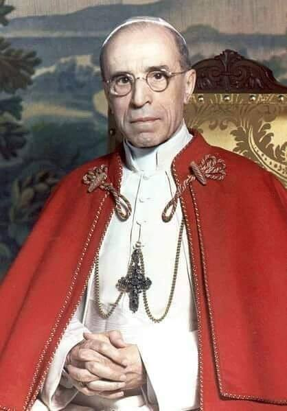

### 1982

Z dwudniową wizytą przybył do Moskwy I sekretarz Komitetu Centralnego Polskiej Zjednoczonej Partii Robotniczej generał Wojciech Jaruzelski.
Tego samego dnia minister spraw wewnętrznych generał Czesław Kiszczak poinformował, że od chwili wprowadzenia w Polsce stanu wojennego czyli 13 grudnia 1981 roku do 26 lutego 1982 roku w ośrodkach internowania znalazło się 6647 osób.

  

### 1948

Papież Pius XII (zdjęcie) wystosował list do biskupów niemieckich, w którym nawiązał do między innymi do kwestii polskich granic zachodnich oraz wysiedleń ludności niemieckiej z Polski.
W dokumencie tym Pius XII wyraził współczucie z powodu przesiedleń Niemców, podkreślając jednocześnie, iż wynika to głównie z powodu Holokaustu.
Treść listu szybko obiegła świat, a także odbiła się głośnym echem w Polsce. Kontrowersyjne słowa papieża uznano za nawoływanie do zmiany ustalonych na konferencji w Poczdamie zachodnich granic państwa polskiego.

  

### 1940

Do obiegu wszedł zaprojektowany przez Leonarda Sowińskiego nowy banknot o nominale 20 złotych.
Na awersie tego banknotu widniał wizerunek Emilii Plater, natomiast rewers przedstawiał Wawel.
Banknot drukowano w trzech wytwórniach. Były to: Wiener Staadsdruckerei w Wiedniu, Zakłady Graficzne Banku Emisyjnego w Krakowie i Wytwórnia Papierów Wartościowych w Warszawie.
Przedstawiona dwudziestozłotówka została wycofana z obiegu 10 stycznia 1945 roku.

  

### 1897

We wsi Osse, w powiecie opoczyńskim urodził się Jan Zieja - ksiądz, dogmatyk i biblista, duszpasterz i katecheta, podpułkownik Wojska Polskiego, związany z ZMW RP ,,Wici'' i środowiskiem podwarszawskich Lasek; IX 1939 r. kapelan 84 pułku Strzelców Poleskich 30 Poleskiej Dywizji Piechoty; w czasie okupacji niemieckiej kapelan Komendy Głównej Armii Krajowej, Batalionów Chłopskich i naczelny kapelan ZHP "Szare Szeregi"; współpracownik katolickiego Frontu Odrodzenia Polski oraz Rady Pomocy Żydom "Żegota; w powstaniu warszawskim kapelan pułku ,,Baszta'' AK ; 1976 - 1981 współzałożyciel KOR; ekumenista i rzecznik dialogu z judaizmem.

Tak o księdzu Janie pisała Zofia Kossak-Szczucka - wybitna pisarka, działaczka Frontu Odroczenia Polski i Rady Pomocy Żydom ,,Żegota'':
,,Pozornie nie masz w nim nic wyjątkowego. Wieśniaczy syn wychowany przez głęboko religijną matkę. Cześć i wdzięczność dla tej matki zachowa na całe życie. Wczesne powołanie kapłańskie. Pierwsze kroki w służbie Bożej przy boku biskupa Łozińskiego, jednego z polskich kandydatów na ołtarze. Do niego to, młodziutkiego księdza Ziei, umierający pasterz mówił: "Janku, nie pozwól mi zasnąć... Zbudź mnie, gdybym zasypiał. Chcę iść przytomnie na spotkanie z Chrystusem"...(...) Wojna wyrwała proboszcza Zieję z parafii, rzuciła na palący stopy bruk zajętej przez Niemców Warszawy. Ksiądz Jan nie przestał nigdy tęsknić za swym Mołodowem, lecz wokół czekała praca. Był kapelanem sióstr urszulanek, ale to łatwe i miłe zajęcie wyczerpywało zaledwie ułamek jego energii. Nędzy nigdy nic brakło, w owe zaś czasy widmo jej straszyło zewsząd. Ludzie byli obdarci, a zimy szły srogie, jakich nie pamiętano od lat. Ksiądz Jan oddawał przygodnym znajomym ubranie, bieliznę, zatrzymując tylko płaszcz. Siostry urszulanki dokonujące co pewien czas inspekcji garderoby swego kapelana uzupełniały najbardziej rażące braki. Nie na długo. Ksiądz Zieja był niepoprawny i uciułany z trudem przez siostry przyodziewek tegoż samego dnia zazwyczaj zmieniał właściciela. Do zajęć spowiednika i kwestarza dołączyło się wprędce ratowanie Żydów. Pomoc tym najnieszczęśliwszym stanowiła wówczas obowiązek każdego katolika. Mało kto uchylał się od tego obowiązku, lecz podejście bywało różne. Przeciętny człowiek ratował Żydów z litości, z poczucia powinności chrześcijańskiej, uważając w duchu całą sprawę za ciężki dopust Boży. Ksiądz Jan inaczej. Ukrywał skazańców z radością, z miłością, jak ukochane rodzeństwo. Inni liczyli się ze swoimi możliwościami. "Możemy przyjąć najwyżej jedno dziecko...". On nie liczył. Często nie miał gdzie nocować, gdyż swój pokoik oddał paru rodzinom żydowskim. Okupacja zamierzona na jedną noc przeciągała się nieraz na dłużej. Domyślni przyjaciele ofiarowywali bezdomnemu księdzu nocleg. Przyjmował z wdzięcznością i wieczorem przyprowadzał jakiegoś "podopiecznego" o wybitnie semickim wyglądzie". "Dajcie mu to miejsce, co miało być dla mnie". (...)

źródło: Zofia Kossak. "W Polsce Podziemnej. Wybrane pisma dotyczące lat 1939-1944". Słowo wstępne Władysław Bartoszewski. Wybór i opracowanie Stefan Jończyk, Mirosława Pałaszewska. Instytut Wydawniczy PAX Warszawa 1999

  

---

<a href="https://github.com/TomaszWaszczyk/historia.waszczyk.com/edit/master/src/content/march-1.md" target="_blank">Edytuj tę stronę dzieląc się własnymi notatkami!</a>
