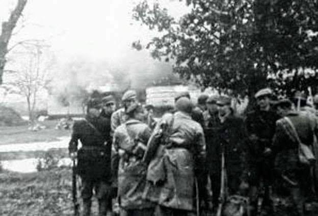

### 2024

Yōkai(妖怪):

[https://pl.wikipedia.org/wiki/Y%C5%8Dkai](https://ja.wikipedia.org/wiki/%E5%A6%96%E6%80%AA)

---

  

> Węgiersko-chińskie porozumienie dopuszcza patrole chińskich policjantów na terenie Węgier – poinformowało węgierskie MSW w odpowiedzi na pytanie portalu Telex. Celem współpracy jest "poprawa bezpieczeństwa w miejscach turystycznych oraz podczas przyciągających duże tłumy wydarzeń".

---

### 2023

Ustalony na koniec marca termin przekazania wytwórczych aktywów węglowych do Narodowej Agencji Bezpieczeństwa Energetycznego (NABE) nie jest zagrożony – ocenił w czwartek prezes PGE Polskiej Grupy Energetycznej Wojciech Dąbrowski.

---

### 2022

Wojny wojnami, ale eksploatować trzeba mocniej:

Lotos:

  

### 2021

  

  

### 1981

W gabinecie urzędującego od miesiąca jako prezes Rady Ministrów generała Wojciecha Jaruzelskiego miało miejsce pierwsze spotkanie z przewodniczącym Solidarności Lechem Wałęsą. Oficjalnie obaj panowie wspominali lata służby w wojsku. 
Tak o tym spotkaniu mówił Wałęsa:
"Tworzyło to sympatyczną atmosferę (...) On chciał odświeżyć moje wspomnienia z wojska i bardzo trafnie, bo zachowałem do wojska sentyment" 
Inny znany komunistyczny dygnitarz Mieczysław Rakowski tak później opisywał ten fakt w swoich "Dziennikach":
Wałęsa miał wielokrotnie przytakiwać "Tak jest, panie generale". Miał nawet zapewnić, że wyeliminuje "antyradzieckie" działania w związku, ograniczy wpływy KOR-owców."

  

### 1944

Połączone oddziały żołnierzy Armii Krajowej i Batalionów Chłopskich dokonały ataku na wieś Sahryń w powiecie hrubieszowskim. Podstawowym celem tej akcji miał być posterunek Ukraińskiej Policji Pomocniczej, a także formacje Ukraińskiej Powstańczej Armii zgrupowane w innych okolicznych miejscowościach; Szychowicach, Modryniu, Turkowicach, Łaskowie i Miętkiem.
Pierwszym celem ataku stał się posterunek UPP obsadzony zaledwie przez 20 policjantów, którzy nie mieli żadnych szans w starciu z 300 Polakami. Po zdobyciu posterunku oddziały AK i BCh wtargnęły do wsi, gdzie zniszczonych zostało około 280 domów,cerkiew i inne zabudowania. Według relacji świadków zniszczenia te to nie efekt celowego działania AK i BCh mającego zabicie jak największej ilości Ukraińców, a wynik walki, do której doszło z licznymi oddziałami UPA.
Nie podejmuję się podawania rzeczywistej liczby ofiar, ponieważ w różnych zródłach rozbieżności sięgają nawet do kilkuset osób. Pewne jest jednak to, że wielu z zabitych było uzbrojonymi cywilami, którzy mieli pomagać przy zaplanowanej przez UPA na 16 marca masakrze na polskich mieszkańcach tych miejscowości.
Na zdjęciu oddział AK w Sahryniu.

  

### 1822

1822 roku w wieku 75 lat zmarł Józef Wybicki- znany jako autor " Pieśni Legionów Polskich we Włoszech".
W wieku 20 lat został posłem na sejm. Uczestniczył w konfederacji barskiej. W 1794 roku walczył w Wielkopolsce u boku Henryka Dąbrowskiego. Następnie wyemigrował do Francji, a w 1797 roku napisał przyszły hymn Polski. Po utworzeniu Księstwa Warszawskiego został senatorem i prezesem Sądu Najwyższego.

  

---

<a href="https://github.com/TomaszWaszczyk/historia.waszczyk.com/edit/master/src/content/march-10.md" target="_blank">Edytuj tę stronę dzieląc się własnymi notatkami!</a>
