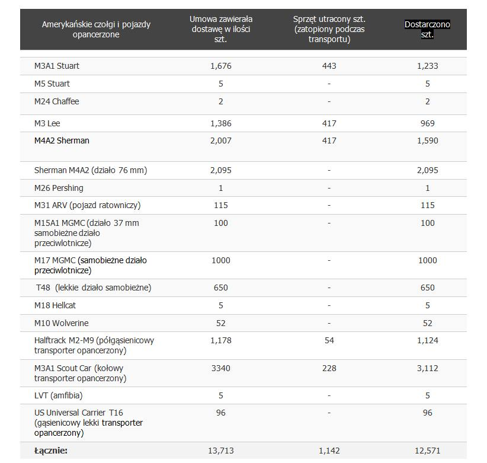
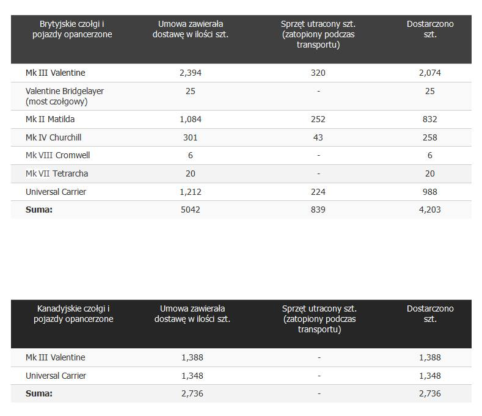
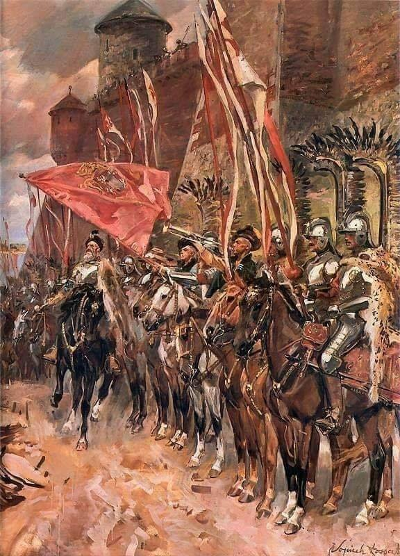

### 1941

Amerykański Kongres ostatecznie przełamał impas w stosunkach Stanów Zjednoczonych z innymi państwami. Uchwalona wówczas ustawa federalna popularnie nazywana Lend-Lease Act zezwalała USA na wspomaganie państw koalicji antyfaszystowskiej pożyczkami, wynajmem, sprzedażą oraz nieodpłatnym przekazywaniem dóbr, w tym surowców, żywności, ropy naftowej oraz sprzętu wojennego. Pierwszymi krajami objętymi programem współpracy zostały Wielka Brytania, Chiny oraz tzw. Wolna Francja powołana do życia przez przeciwników kolaboracyjnej Republiki Vichy utworzonej na nieokupowanych przez Niemców terytoriach francuskich. Po niemieckiej agresji przeciwko Związkowi Radzieckiemu pomocą objęto również ZSRR.

Do końca wojny Stany Zjednoczone przekazały aliantom materiały różnego rodzaju o łącznej wartości przekraczającej 50 mld dolarów, co przy ówczesnej wartości pieniądza stanowi odpowiednik 13-krotności tej sumy dzisiaj. Amerykańska pomoc płynęła szerokim strumieniem do Europy, zwłaszcza do Wielkiej Brytanii (łącznie o wartości ponad 31 mld dolarów) i Związku Radzieckiego (łącznie o wartości blisko 11 mld dolarów), który dzięki wsparciu mógł prowadzić wydatne działania przeciw armii niemieckiej. Przekazywana Moskwie pomoc przekraczała wielkość dóbr produkowanych w Związku Radzieckim, co pokazuje skalę zaangażowania USA oraz wagę wsparcia w kontekście podtrzymania oporu Armii Czerwonej. Warto podkreślić, że także znaczna część sprzętu przekazywanego Brytyjczykom trafiała na front wschodni na mocy porozumień Moskwa-Londyn.

Program został wstrzymany we wrześniu 1945 roku. Część pomocy została spłacona przez zaciągające dług państwa w okresie powojennym, przy czym realna wartość spłaty była wielokrotnie niższa niż wartość amerykańskiej pomocy w latach 1941-45.

Na podstawie pozycji Soviet Lend-Lease Tanks of World War II.

  

  

### 1941

https://pl.wikipedia.org/wiki/Lend-Lease_Act

### 1609

1609 roku rozpoczęła się druga wojna polsko - rosyjska.
Wojna była wynikiem dymitriad, czyli wypraw polskiej magnaterii i szlachty do Carstwa Rosyjskiego, organizowanych pod hasłem osadzenia na moskiewskim tronie (fałszywego) syna Iwana Groźnego, Dymitra.
Celem magnatów było przejęcie władzy.
Rosjanie znaleźli sojusznika w Szwedach,
toczących w tym okresie nieprzerwane wojny z Rzeczypospolitą. 23 lipca 1609 roku kniaź moskiewski Michaił Skopin-Szujski, na czele zjednoczonych armii rosyjsko-szwedzkich, odniósł zwycięstwo nad siłami Aleksandra
Zborowskiego pod Twerem, jednak, w wyniku buntu nie opłacanych wojsk, nie zdołał rozerwać polskiego oblężenia Moskwy. Polską odpowiedzią na atak było oblężenie Smoleńska, zarządzone przez króla Zygmunta III.
W styczniu 1610 roku Rosjanie przełamali
blokadę Moskwy. 4 lipca 1610 roku armia
Rzeczypospolitej, dowodzona przez hetmana Stanisława Żółkiewskiego rozgromiła pod Kłuszynem pięciokrotnie silniejsze wojska rosyjskie.

  

---

<a href="https://github.com/TomaszWaszczyk/historia.waszczyk.com/edit/master/src/content/march-7.md" target="_blank">Edytuj tę stronę dzieląc się własnymi notatkami!</a>
