### 2024

> USA przygotowały się na rosyjski atak nuklearny. Amerykańskie media ujawniają szczegóły

Pod koniec 2022 r. USA rozpoczęły przygotowania na scenariusz rosyjskiego ataku nuklearnego na Ukrainę — donosi CNN, powołując się na wysokich rangą amerykańskich urzędników.

```
Urzędnicy stwierdzili, że administracja Joego Bidena była szczególnie zaniepokojona możliwością użycia przez Rosję taktycznej lub bojowej broni nuklearnej. Był to scenariusz, który jeszcze kilka lat temu wydawał im się niczym z minionej epoki.

CNN pisze o bezprecedensowym poziomie planowania awaryjnego realizowanego w miarę zwiększania się obaw. Od jesieni 2022 r. Rada Bezpieczeństwa Narodowego zwołała serię posiedzeń, by opracować plan reakcji na potencjalny atak bronią jądrową oraz jak próbować temu zapobiec lub powstrzymać.

"Tym, co doprowadziło administrację Bidena do tak zaskakującej oceny, nie był jeden czynnik, ale zbiór wydarzeń, analiz i — co najważniejsze — bardzo wrażliwych nowych danych wywiadowczych" — podała stacja.
```

---

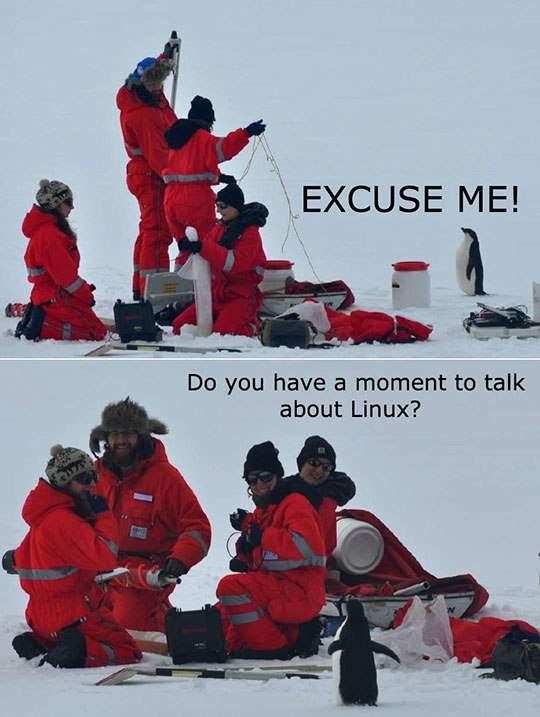<br><br>

Hardening configuration. Stack smashing is a commonly used technique to attack the Linux kernel. To mitigate this vulnerability, several configurations have been introduced below.

```
CONFIG_STACKPROTECTOR=y
CONFIG_CC_STACKPROTECTOR_REGUALR=y
```

If you enable above configurations, the compiler performs additional task;

1) Put a canary value on the stack at the beginning of the function
2) It validates the canary value just before returning the function

Applying this feature to the target, we might go through below side effect from performance point of view;

1) The image size increases due to the addition of assembly routines to add and check the canary on the stack.

2) Since an additional routine to push the canary to the stack is performed, performance degradation may be expected.

If you want to protect system from process stack attack, you can add `CONFIG_STACKPROTECTOR`

<br><br>

---

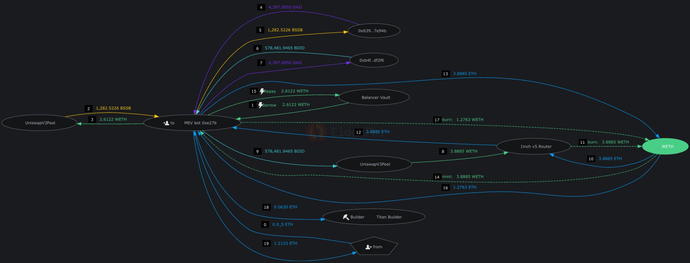<br><br>

---

<video width="640" height="480" controls>
<source src="./movies/march/creativity-mood.mp4" type="video/mp4">
Your browser does not support the video tag.
</video>

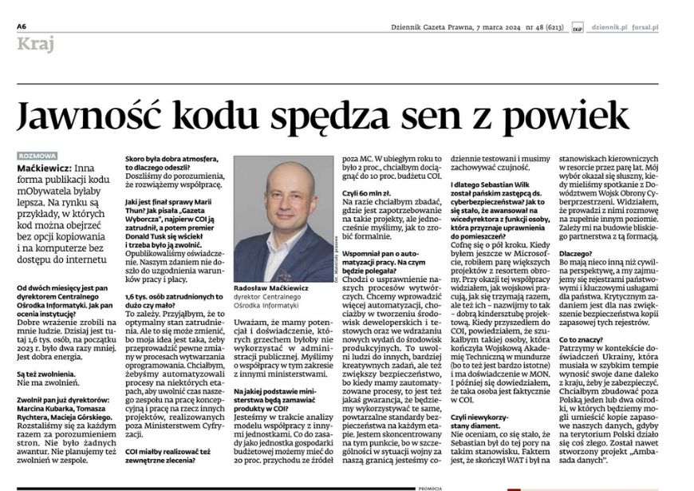<br><br>

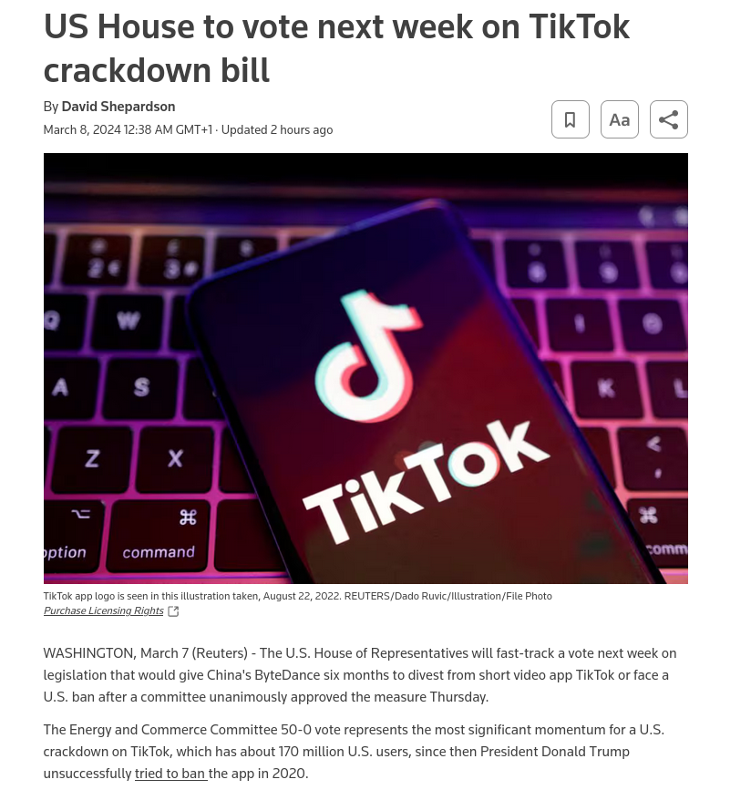<br><br>

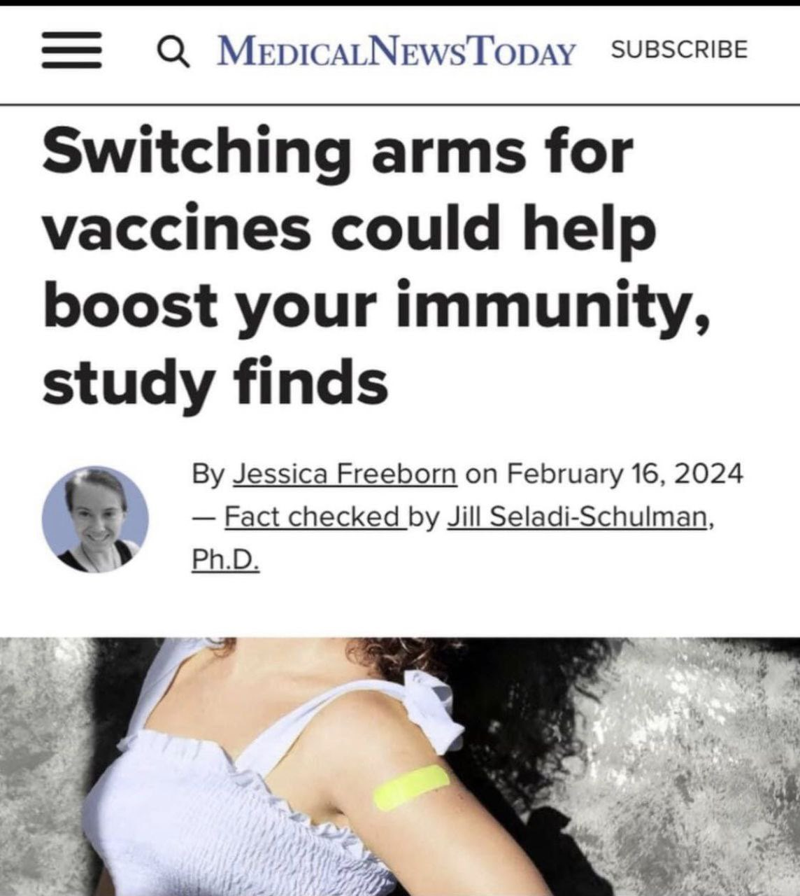<br><br>

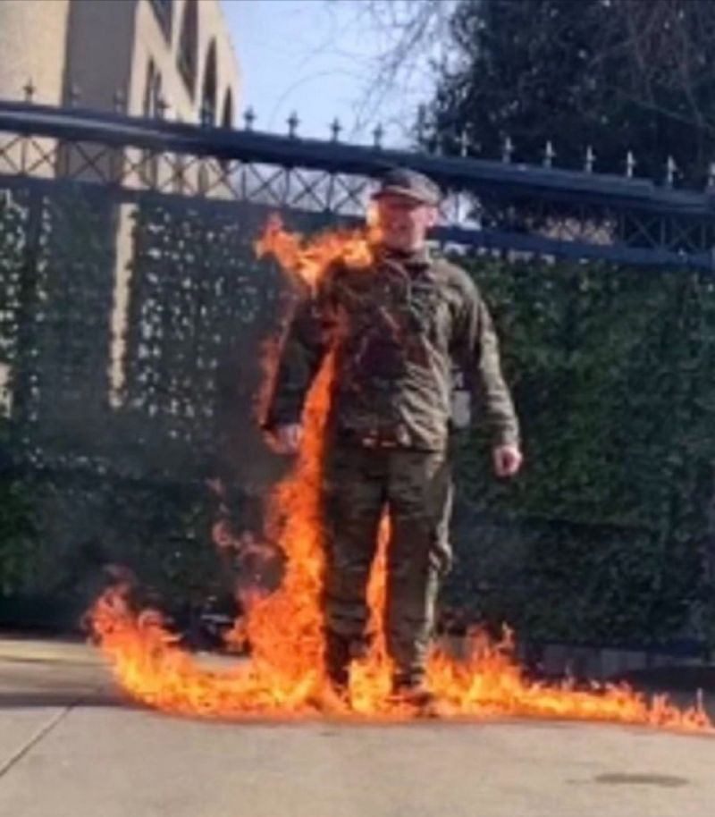<br><br>

<video width="640" height="480" controls>
<source src="./movies/march/Aaron-Bushnell.mp4" type="video/mp4">
Your browser does not support the video tag.
</video>

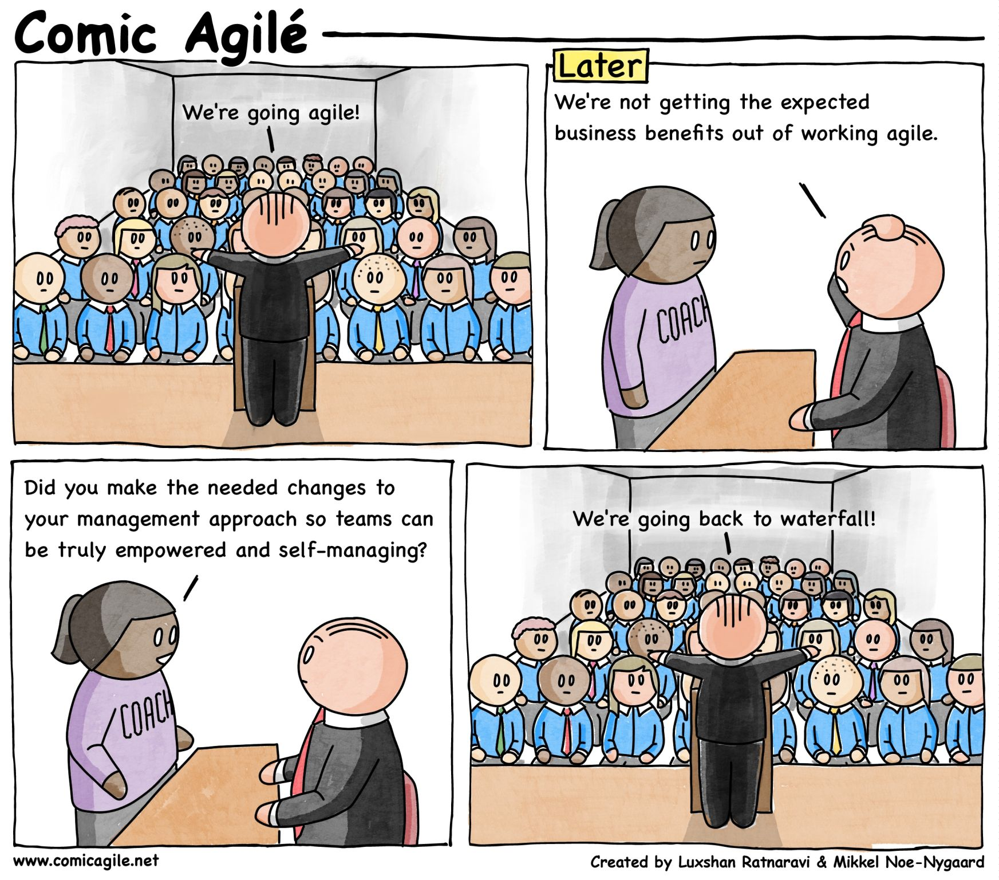<br><br>

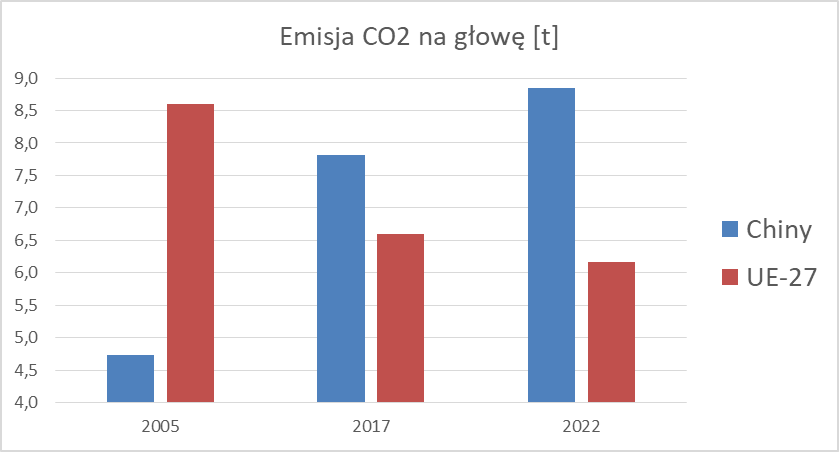<br><br>

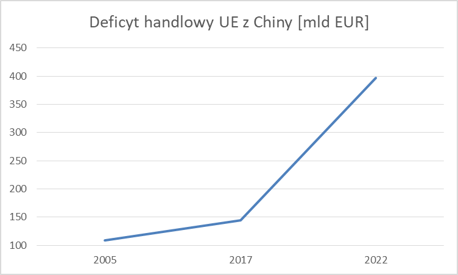<br><br>

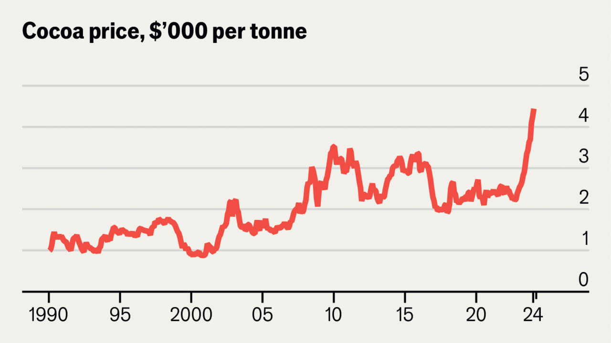<br><br>

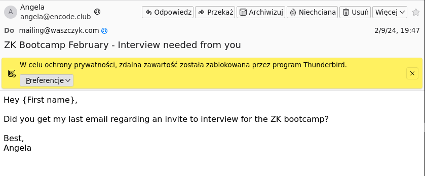<br><br>

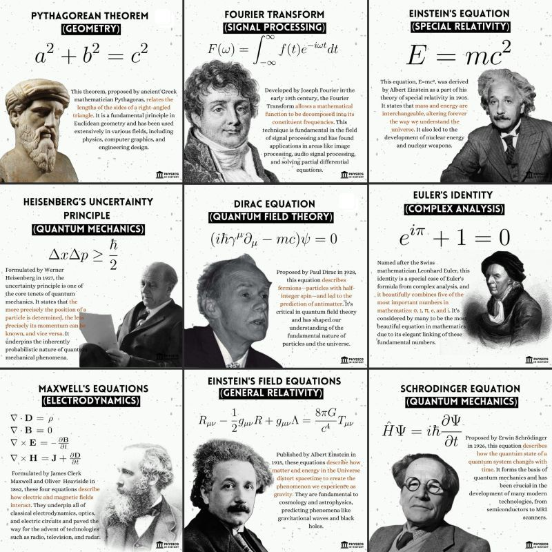<br><br>

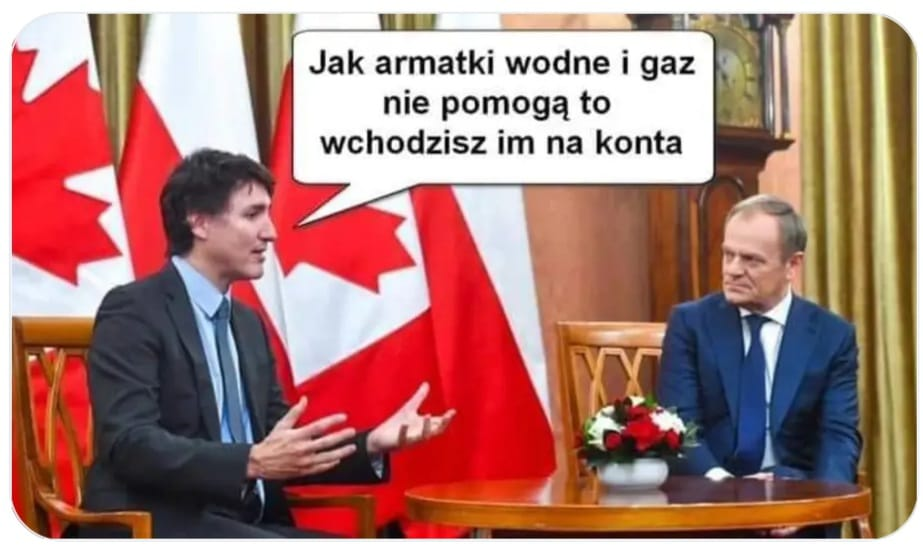<br><br>

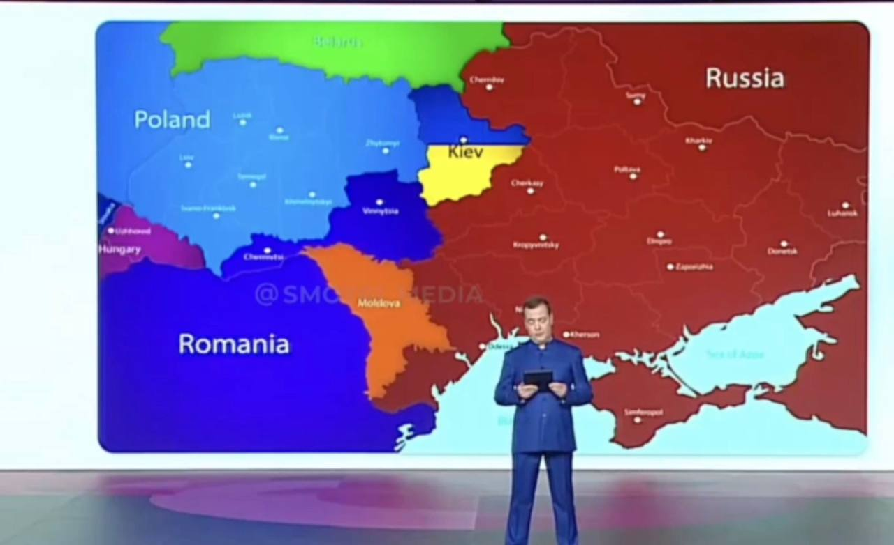<br><br>

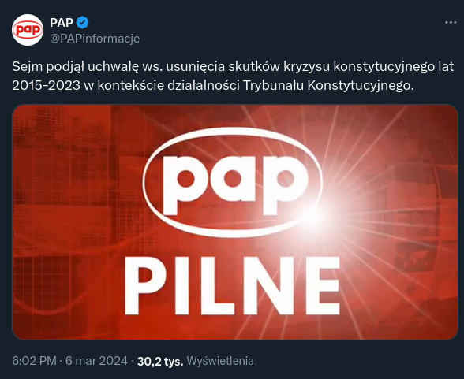<br><br>

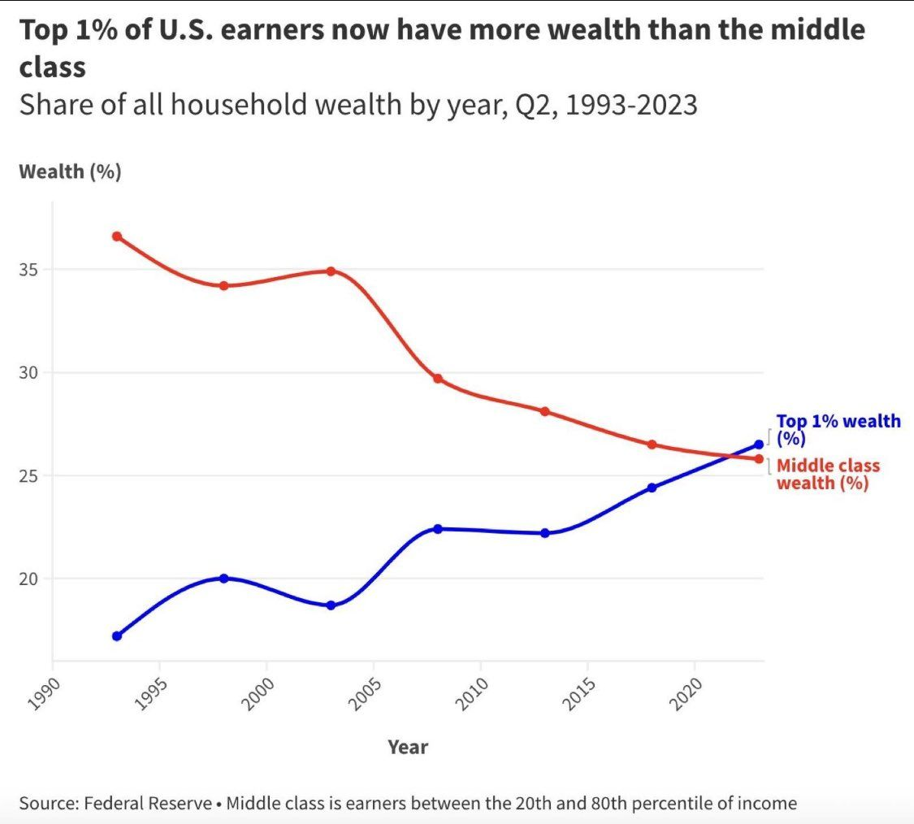<br><br>

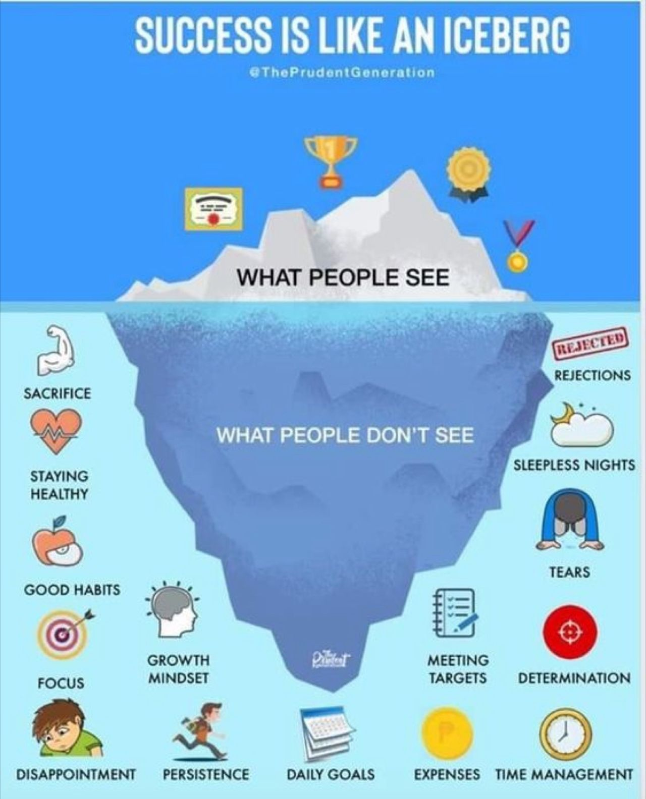<br><br>

### 2023

<br><br>

<br><br>

<br><br>

### 2022

Praktycznie jednogłośnie Sejm przyjął Ustawę o obronie ojczyzny w Polsce.

Klasa rządząca odrzuciła myśl o powszechnym dostępie Polaków do broni, lecz w razie okupacji z pewnością będzie nas z emigracji w Waszyngtonie gorąco zachęcała do działań partyzanckich.

---

> zespół kruchości

pierwszy raz usłyszałem to określenie w mediach masowych odnośnie osób, które mają problemy po szczepionce C19 lub zmarły

---

### 2015

Launched in 2015, the ZRF Initiative commits governments and oil companies, to end routine flaring no later than 2030. The Initiative aims to support cooperation between all relevant stakeholders so that solutions to gas flaring can be found through appropriate regulation, application of technologies, and financial arrangements.

### 1941

Amerykański Kongres ostatecznie przełamał impas w stosunkach Stanów Zjednoczonych z innymi państwami. Uchwalona wówczas ustawa federalna popularnie nazywana Lend-Lease Act zezwalała USA na wspomaganie państw koalicji antyfaszystowskiej pożyczkami, wynajmem, sprzedażą oraz nieodpłatnym przekazywaniem dóbr, w tym surowców, żywności, ropy naftowej oraz sprzętu wojennego. Pierwszymi krajami objętymi programem współpracy zostały Wielka Brytania, Chiny oraz tzw. Wolna Francja powołana do życia przez przeciwników kolaboracyjnej Republiki Vichy utworzonej na nieokupowanych przez Niemców terytoriach francuskich. Po niemieckiej agresji przeciwko Związkowi Radzieckiemu pomocą objęto również ZSRR.

Do końca wojny Stany Zjednoczone przekazały aliantom materiały różnego rodzaju o łącznej wartości przekraczającej 50 mld dolarów, co przy ówczesnej wartości pieniądza stanowi odpowiednik 13-krotności tej sumy dzisiaj. Amerykańska pomoc płynęła szerokim strumieniem do Europy, zwłaszcza do Wielkiej Brytanii (łącznie o wartości ponad 31 mld dolarów) i Związku Radzieckiego (łącznie o wartości blisko 11 mld dolarów), który dzięki wsparciu mógł prowadzić wydatne działania przeciw armii niemieckiej. Przekazywana Moskwie pomoc przekraczała wielkość dóbr produkowanych w Związku Radzieckim, co pokazuje skalę zaangażowania USA oraz wagę wsparcia w kontekście podtrzymania oporu Armii Czerwonej. Warto podkreślić, że także znaczna część sprzętu przekazywanego Brytyjczykom trafiała na front wschodni na mocy porozumień Moskwa-Londyn.

Program został wstrzymany we wrześniu 1945 roku. Część pomocy została spłacona przez zaciągające dług państwa w okresie powojennym, przy czym realna wartość spłaty była wielokrotnie niższa niż wartość amerykańskiej pomocy w latach 1941-45.

Na podstawie pozycji Soviet Lend-Lease Tanks of World War II.

<br><br>

<br><br>

### 1941

https://pl.wikipedia.org/wiki/Lend-Lease_Act

### 1609

1609 roku rozpoczęła się druga wojna polsko - rosyjska.
Wojna była wynikiem dymitriad, czyli wypraw polskiej magnaterii i szlachty do Carstwa Rosyjskiego, organizowanych pod hasłem osadzenia na moskiewskim tronie (fałszywego) syna Iwana Groźnego, Dymitra.
Celem magnatów było przejęcie władzy.
Rosjanie znaleźli sojusznika w Szwedach,
toczących w tym okresie nieprzerwane wojny z Rzeczypospolitą. 23 lipca 1609 roku kniaź moskiewski Michaił Skopin-Szujski, na czele zjednoczonych armii rosyjsko-szwedzkich, odniósł zwycięstwo nad siłami Aleksandra
Zborowskiego pod Twerem, jednak, w wyniku buntu nie opłacanych wojsk, nie zdołał rozerwać polskiego oblężenia Moskwy. Polską odpowiedzią na atak było oblężenie Smoleńska, zarządzone przez króla Zygmunta III.
W styczniu 1610 roku Rosjanie przełamali
blokadę Moskwy. 4 lipca 1610 roku armia
Rzeczypospolitej, dowodzona przez hetmana Stanisława Żółkiewskiego rozgromiła pod Kłuszynem pięciokrotnie silniejsze wojska rosyjskie.

<br><br>

---

<a href="https://github.com/TomaszWaszczyk/historia.waszczyk.com/edit/master/src/content/march-7.md" target="_blank">Edytuj tę stronę dzieląc się własnymi notatkami!</a>
