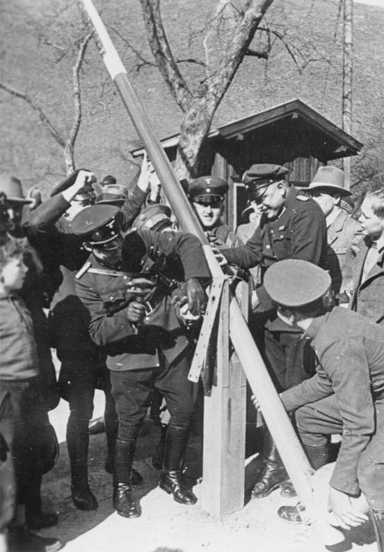

### 2023

  

### 2022

> Premier Ukrainy: Konsekwencją wojny może być głód.

### 2021

> Obecne w PL mamy najbardziej na świecie negatywne stopy procentowe, które drenują kieszenie oszczędzających obywateli. Taką polityką monetarną NBPu - uwzględniając realną inflację - te 4,5 mln zł w walucie może za 30 lat nie wystarczyć na bochenek chleba. Warto przypomnieć że 1kg wołowiny w 1975 kosztował tyle co dzisiaj, a w 1990 - 15 500zł.

---

  

---

### 2019

Australia cuts benchmark interest rate to record low 0.25% Australia’s central bank has cut its benchmark interest rate to a record low 0.25%, seeking to ease the cost of credit.

### 1948

Fragment książki Aleksandry Pietrowicz pod tytułem "Życie pod lupą bezpieki"
"12 marca 1948 r. p.o. naczelnik Wydziału III Wojewódzkiego Urzędu
Bezpieczeństwa Publicznego w Poznaniu, ppor. Stanisław Cozaś, przedstawił
plan werbunku Edwarda Serwańskiego (zdjęcie), pracownika Sekcji Dokumentacyjnej
Instytutu Zachodniego w Poznaniu1
. Plan ten został zatwierdzony następnego
dnia przez dyrektora Departamentu III MBP, ppłk. Jana Tataja2. Werbunek
Serwańskiego miał być ważnym punktem w prowadzonej od jesieni 1947 r.
przez Departament III MBP oraz wydziały III wybranych WUBP sprawy roz-
pracowania obiektowego o kryptonimie „Alfa”. Celem jej było rozpoznanie oraz
zlikwidowanie „antydemokratycznej i antyrządowej” działalności prowadzonej
przez działaczy organizacji „Ojczyzna”, organizacji „Mała Propaganda” oraz
Instytutu Środkowo-Europejskiego."

  

### 1943

W Warszawie kierownictwo niemieckiego Głównego Urzędu Pracy Generalnego Gubernatotstwa ogłosiło brankę, na mocy której przepisów do służby w Rzeszy wcielana miała być młodzież męska od 16 roku życia i żeńska od 17 roku życia.
W tym samym czasie odbyła się też narada kierowników działów młodzieżowych oraz urzędów pracy, na której postanowiono, że:
-Młodzież polska po ukończeniu szkół powszechnych nie będzie kierowana do szkół zawodowych, a bezpośrednio do praktycznej nauki zawodu.
- Młodzież nie będzie miała swobody wyboru zawodu, lecz będzie kierowana przez Urząd Pracy w w sposób zgodny z interesami gospodarki niemieckiej.

  

---

14-letnia niewinna dziewczynka zabita tylko dlatego, że była Polką🇵🇱
Tego dnia, 12 marca 1943 r. Czesia Kwoka została zamordowana zastrzykiem fenolu w niemieckim obozie zagłady KL Auschwitz.

  

---

### 1940

W Moskwie podpisano traktat pokojowy kończący wojnę zimową pomiędzy ZSRR a Finlandią.
Finowie doskonale zdawali sobie sprawę, iż nie są w stanie wygrać wojny z Sowietami. Obrona mogła się sprawdzić na krótkim dystansie, ale na dłuższą metę mogło zabraknąć sił do prowadzenia działań zbrojnych przeciwko Armii Czerwonej, która choć osłabiona, nadal była mocniejsza od obrońców. Dlatego też roszady w rządzie przeprowadzone na początku grudnia 1939 roku traktowano raczej jako próbę porozumienia z agresorem niż formowanie władz zdolnych do przeciwstawienia się agresji. Minister Tanner od początku próbował mediacji, które mogły zakończyć Wojnę Zimową i odwlec zagrożenie ze strony sowieckiej. Postulowano przy tym wykorzystanie państw neutralnych, choć mocno zainteresowanych wydarzeniami na terytorium Finlandii. W orbicie zainteresowań Tannera znalazły się zatem Szwecja i III Rzesza, które miały wystarczającą siłę, aby uczestniczyć w pertraktacjach z Moskwą. Sztokholm bał się jednak zdecydowanych interwencji, nie chcąc narażać się ani Stalinowi, ani Hitlerowi. Z kolei Hitler nie miał zamiaru odbierać sobie szansy osłabienia Armii Czerwonej rękami żołnierzy fińskich, którzy w początkowej fazie zmagań doskonale radzili sobie z agresorem. Dlatego też nietrudno jest się domyślić, iż początkowo Berlin mocno wzdragał się od pośredniczenia w jakichkolwiek rozmowach pokojowych. Dopiero sukcesy Armii Czerwonej mogły skłonić Rzeszy do jakiejkolwiek interwencji celem zapobieżenia zbyt dużemu wzmocnieniu przyszłego przeciwnika. Nie ulegało bowiem dyskusji to, iż kiedyś Berlin i Moskwa zwrócą się przeciwko sobie, rezygnując z dotychczasowego sojuszu. W styczniu Joachim von Ribbentrop rozpoczął sondowanie strony sowieckiej, która zdecydowanie odmówiła rozpoczęcia prac nad projektem dwustronnego porozumienia. Wiaczesław Mołotow przekazał Berlinowi enigmatyczną wiadomość, iż podstawą rokowań może być jedynie uznanie rządu Otto Ville Kussinena, co z kolei było nie do przyjęcia przez legalne władze zainstalowane w Helsinkach. Także w Sztokholmie trwała akcja dyplomatyczna, tyle że za pośrednictwem działaczy niższego szczebla - z posłem radzieckim Aleksandrą Kołłontaj skontaktowała się pisarka Hella Wuolijoki, która sondowała możliwość negocjowania porozumienia. W kilka dni później chęć wzięcia udziału w rozmowach wyraził minister spraw zagranicznych Szwecji Christian Günther, który 29 stycznia zaproponował rozstrzygnięcie problemu.
Jeszcze tego samego dnia Mołotow przystał na propozycję rozpoczęcia negocjacji poza Kussinenem. Tanner 1 lutego przedstawił ciekawy, choć niemożliwy do zrealizowania projekt, ustępstw terytorialnych na rzecz ZSRR przy jednoczesnym uzyskaniu cesji w kilku innych rejonach. Stosunkowo niewielkie ustępstwa nie zadowoliły strony moskiewskiej, która przedstawiła własny, bardzo radykalny projekt, w którym najważniejszym było zajęcie Półwyspu Hanko i Przesmyku Karelskiego. 10 lutego Rada Obrony Państwa zaakceptowała misję Tannera, choć nie wyrażano zgody na tak daleko idące ustępstwa. Sukcesy Armii Czerwonej zmuszały jednak do pośpiechu. Z jednej strony trwały zatem naciski Sowietów, którzy 28 lutego przedstawili ultimatum, z drugiej presję wywierali alianci, oczekując oficjalnego wezwania do wsparcia sił fińskich w Wojnie Zimowej. Niestety, nie było praktycznej możliwości przeprowadzenia operacji sił francuskich i brytyjskich, co skłoniło Finów do zaakceptowania warunków radzieckich 6 marca. Dwa dni później rozpoczęto pertraktacje obu stron. Finlandię reprezentowali Ryti, min. Paasikivi, prof. Voionmaa i gen. Walden, z kolei ich adwersarzami zostali Mołotow, Żdanow i gen. Wasilewski. Rozmowy odbywano w Moskwie. Okazało się, że warunki sowieckie są cięższe niż oczekiwane, jednakże rząd fiński, stojąc niemalże pod ścianą, zmuszony był je zaakceptować w nocy z 9 na 10 marca. Przed północą 12 marca prezydent Ryti sygnował układ pokojowy. Działania zbrojne miały ustać z godziną 12.00 13 marca. Finom udało się uratować suwerenność państwową, choć uczynili to za cenę sporych ustępstw. W sumie cesje na rzecz ZSRR objęły blisko 10% terytorium przedwojennej Finlandii, a w skład terenów przekazanych wchodziły wyspy na Morzu Bałtyckim, Półwysep Rybacki, Półwysep Średni. Półwysep Hanko został Sowietom wydzierżawiony na 30 lat. Granica przebiegała na zachód od Wyborgu. Dodatkowo Finlandia zobowiązywała się do ustępstw gospodarczych. 450 tys. ludności zamieszkującej zajęte tereny przesiedlono do Finlandii. Operacja przebiegała bardzo sprawnie. Co ciekawe, Ryti sygnujący traktat pokojowy w Moskwie miał wypowiedzieć słowa: "Biada złemu pasterzowi, który trzodę porzuca. Miecz niech spadnie na jego ramię i na jego prawe oko! Niech uschnie jego ramię, a prawe oko niech całkiem zagaśnie". Najdziwniejsze było w tym to, iż w kilka lat później prawa ręka prezydenta została sparaliżowana.
Wojna Zimowa była dla Sowietów niezwykle wyczerpującym przeżyciem. Okazało się, iż buńczuczne wypowiedzi bezpośrednio poprzedzające konflikt nijak się mają do rzeczywistości, a Armia Czerwona jest tworem przestarzałym i nieprzygotowanym do trudnej walki. Wykorzystać to mieli Niemcy, którzy w pierwszych miesiącach kampanii radzieckiej po prostu rozjechali swojego przeciwnika. Początek marca 1940 roku uwidocznił przewagę radziecką, jednak nie należy zapominać, iż wojna trwała od początku grudnia roku poprzedniego, co pokazywało, iż słabi Finowi są w stanie zatrzymywać wojska sowieckie ponad trzy miesiące. Był to wyczyn nieprawdopodobny, zważywszy na dysproporcję sił i środków, jakimi dysponowały obie strony konfliktu. Stalin zdawał sobie sprawę, iż Wojnę Zimową traktować należy jako swoisty test - test przed kolejnymi doniosłymi wydarzeniami na europejskiej scenie politycznej, a przede wszystkim militarnej. Okazało się, że czystki przeprowadzone w latach trzydziestych nie wyszły na dobre Armii Czerwonej, niszcząc najbardziej wartościową grupę oficerów, którzy w mniemaniu Stalina zagrażali jego dyktaturze. Dodatkowo doświadczenia z Wojny Zimowej posłużyły Sowietom do przygotowania nowych rodzajów broni i uzupełnienia ewidentnych braków w wyposażeniu żołnierzy. Ciężkie warunki, w jakich przyszło im walczyć, hartowały ducha bojowego wojaków Armii Czerwonej i przygotowywały ich do kolejnego konfliktu, w którym zmierzyć się mieli ze znacznie potężniejszym oponentem - armią niemiecką. Wraz z Wehrmachtem na ziemie radzieckie mieli wkroczyć Finowie, szukając pola do manewru w trudnej dla nich sytuacji politycznej, gdy część terytorium rdzennie fińskiego przeszła pod władanie okupanta radzieckiego.
Straty obu stron mają charakter szacunkowy, ciężko bowiem określić liczbę ofiar, szczególnie po stronie sowieckiej. Udało się jednak ustalić, iż Wojna Zimowa kosztowała Finów 26 600 zabitych, blisko 40 000 rannych i 1000 żołnierzy wziętych do niewoli. O wiele gorzej przedstawiał się bilans Armii Czerwonej, która utraciła prawie 127 000 zabitych i zaginionych, 265 000 rannych, 5600 wziętych do niewoli. Ogromne straty notowano także w sprzęcie. Jak widać, za cenę zwycięstwa nad niewielkim krajem, Sowieci uzyskali jeszcze mniej, tracąc zbyt wiele.

  

### 1938

Wojska niemieckie dokonały aneksji (Anschlussu) Austrii.
Przyłączenie Austrii do III Rzeszy (niem. Anschluss) było jednym z najważniejszych wydarzeń okresu dwudziestolecia międzywojennego. Oczywiste złamanie zasad traktatu wersalskiego było pierwszym tak odważnym krokiem odbudowującego się niemieckiego imperializmu. Po objęciu władzy przez Adolfa Hitlera w 1933 roku niemieccy naziści sondowali Austrię na możliwość połączenia obu państw. Bezskutecznie. Dopiero wraz ze zwiększeniem potencjału polityczno-militarnego III Rzeszy oraz rozbudową austriackiej partii nazistowskiej (austriacka NSDAP) możliwy był powrót do projektu odtworzenia tzw. Wielkich Niemiec (niem. Grossdeutschland). Koncepcja ta wpisywała się w mocarstwową retorykę Adolfa Hitlera. Niemiecki dyktator otwarcie głosił chęć zjednoczenia ludów i ziem germańskich. Austrię uważano za część wielkiej niemieckiej Rzeszy. Austriacy byli zdecydowanie bardziej sceptyczni. Trudno dzisiaj oszacować, czy dobrowolnie zdecydowaliby się na przyłączenie do Niemiec, nawet w obliczu możliwej autonomii. Nie ulega bowiem wątpliwości, że to Niemcy miały w tym sojuszu grać rolę dominującą.
Wobec proniemieckich nastrojów społecznych w marcu 1938 roku kanclerz Austrii Kurt Schuschnigg rozpisał referendum dotyczące ewentualnego przyłączenia do III Rzeszy. Do secesji namawiała austriacka partia narodowosocjalistyczna, Deutsche Nationalsozialistische Arbeiterpartei Österreichs (DNSAPÖ), na czele której stał najpierw Walter Riehl, a następnie zagorzali poplecznicy niemieckich nazistów, w tym Arthur Seyss-Inquart. Kanclerz Schuschnigg bezkustecznie starał się odsuwać nazistów od sterów rzšdu. Był jednak zmuszony do ugięcia się pod presją silniejszych Niemiec. W lutym 1938 roku odbył rozmowę z A. Hitlerem. Na zaproszenie dyktatora przybył do Berchtesgaden, gdzie zobowiązał się do rozszerzenia władzy austriackich nazistów, oferując szereg stanowisk rządowych. Nawet tak daleko idące ustępstwa nie przekonały Hitlera, który domagał się przeprowadzenia referendum dotyczącego przynależności terytorialnej Austrii. Schuschnigg i w tym wypadku uległ presji, obawiając się zbrojnej interwencji III Rzeszy. Mimo tego, nie czekając na przeprowadzenie głosowania, A. Hitler nakazał wkroczenie wojsk niemieckich do Austrii. W operację zaangażowano blisko 200 tys. żołnierzy i funkcjonariuszy różnych sił. Następnie powołany został nazistowski rząd z Arthurem Seyss-Inquartem na czele, który rozpisał nowe referendum. W opinii nazistów jego wyniki potwierdziły fakt formalnej aneksji Austrii, choć trudno ustalić rzeczywiste poparcie dla koncepcji połączenia obu państw. W konsekwencji w kwietniu 1938 roku, przy braku interwencji ze strony społeczności międzynarodowej, Austria została wcielona do III Rzeszy. Po wojnie Austrię uznano za pierwszą ofiarę zaborczej polityki III Rzeszy. Tego typu podejście określić należy jako kontrowersyjne ze względu na silną pozycję austriackich nazistów oraz niepewne nastroje w samym społeczeństwie. Warto jednak pamiętać, iż naziści nie zdecydowali się nawet na namiastkę uczciwego głosowania w ramach referendum, co może wskazywać na rzeczywiste niskie poparcie miejscowej ludności dla idei inkorporacji Austrii do III Rzeszy.
Uzupełnieniem idei Grossdeutschland był zabór czechosłowackich Sudetów oraz dalsza ekspansja na kierunku wschodnim zainicjowana atakiem Niemiec na Polskę we wrześniu 1939 roku.

  

### 1920

"Nie chcemy ani Węgrów, ani Polaków i nie znamy żadnej Ukrainy"
Powyższe hasło było jednym z kierunków działań zlikwidowanej 12 marca 1920 roku przez Wojsko Polskie Ruskiej Narodowej Republiki Łemków. Proklamowana 5 grudnia 1918 roku we Florynce w województwie małopolskim republika była nastawiona prorosyjsko, miała swój własny rząd, na którego czele stał Jarosław Kaczmarczyk. Władze RNRŁ systematycznie również odmawiały unii z Zachodnioukraińską Republiką Ludową. 
Główną przyczyną tak drastycznego polskiego posunięcia była zadeklarowana podczas konferecji paryskiej przez delegację łemkowską chęć przystąpienia tej republiki do Czechosłowacji, na co nie mogły zgodzić się walczące z tym państwem o granice władze Polski. Wojsko Polskie aresztowało przywódców RNRŁ, którzy jako obywatele polscy zostali oskarżeni o zdradę stanu, a następnie osadzeni pod w obozie internowania w Dąbiu pod Krakowem. W roku 1921 zostali oczyszczeni z zarzutów i uwolnieni.

  

### 1910

https://pl.wikipedia.org/wiki/Zygmunt_Szendzielarz

### 1894

W Vicksburgu w stanie Missisipi rozpoczęto sprzedaż Coca-Coli w butelkach.
W Vicksburgu w stanie Missisipi zaczęła się sprzedaż coca-coli w butelkach. Recepturę napoju wymyślił farmaceuta John Stith Pemberton, który w wojnie secesyjnej walczył w armii Południa i podczas bitwy pod Columbus w 1865 r. został ciężko ranny w pierś. W trakcie leczenia uzależnił się od morfiny i postanowił znaleźć lekarstwo na rozstrój nerwowy towarzyszący nałogowi. Swój specyfik stworzył na bazie liści koki oraz orzeszków kola. Pierwotnie napój zawierał alkohol, ale kampania propagująca wstrzemięźliwość skłoniła Pembertona do poszukania formuły bezalkoholowej, na którą wpadł przypadkowo. Początkowo napój sprzedawał w szklankach z ulicznego dystrybutora; sprzedaży butelkowej Pemberton nie doczekał, zmarł w 1888 r.

  

### 1884

Interwencja brytyjsko-egipska w Sudanie: mahdyści rozpoczęli oblężenie Chartumu.
Na początku XIX wieku podróż statkiem z Anglii do Indii trwała 3 miesiące. Jako że szlak morski dookoła afryki był dobrze znany i strzeżony, Brytyjczycy nie widzieli potrzeby w ustanowieniu krótszej drogi przez Egipt. Z konieczności musiałaby ona biec lądem – byłaby więc narażona na liczne niewiadome i nieprzewidywalne, zupełnie zbędne ryzyko.
Trzy miesiące potrzebne głównie na opłynięcia Afryki to dużo. Dlatego w latach 40-tych w końcu ustanowiono połączenie morsko-lądowe. Podróżni udający się do Indii dopływali do Aleksandrii nad Morzem Śródziemnym. Tam przesiadali się na statek rzeczny i płynęli w górę Nilu, aby w dogodnym miejscu przebyć niewielki już skrawek pustyni i wsiąść na statek pełnomorski na Morzu Czerwonym. Z trzech miesięcy uciążliwej podróży zrobił się jeden.
O dziwo Brytyjczycy nadal nie docenili strategicznej ważności Egiptu, który wtedy nadal był częścią Imperium Otomańskiego. Dali się wyprzedzić. Francuski konsul, a zarazem inżynier, Ferdynand de Lesseps, opętany wizją zbudowania kanału, dopiął swego i kanał został otwarty dla żeglugi 28 listopada 1869 roku.
Teraz droga do Indii zabierała tylko 24 dni, albo zaledwie 18, jeśli na kraniec Włoch najbliższy Egiptowi wybrać się z Londynu koleją. W ciągu kilku lat niemal wszystkie statki, za wyjątkiem największych, które nie mieściły się w kanale, wybierały drogę przez Egipt. W stoczniach angielskich zahuczało od aktywności – wszyscy budowali nowe konstrukcje, dopasowane technicznie do pokonania kanału. A zaledwie rok później Indie i Londyn zostały połączone linią telegrafu.
To była rewolucja. Indie, wół roboczy imperium, odległa kraina gdzieś w pół drogi do końca świata, nagle nagle znalazły się prawie za rogiem ulicy. Brytyjczycy, obudziwszy się poniewczasie, szukali możliwości zabezpieczenia swoich interesów w Egipcie. Okazja nadarzyła się całkiem szybko.
W 1875 roku Izmaił, chedyw Egiptu, znalazł się na skraju bankructwa. W desperacji zaczął poszukiwać kupca na swoje 177 tysięcy akcji Towarzystwa Kanału Sueskiego. Reszta z łącznej liczby 400 tysięcy akcji była rozproszona wśród drobnych francuskich inwestorów. Do nich pierwszych zwrócił się chedyw. Nie byli zainteresowani. Kolejne drzwi, do których zapukał, należały do amerykańskiego producenta broni Remingtona. On także nie był zainteresowany. Natomiast rząd brytyjski, który dowiedział się o tej ofercie pośrednimi kanałami i nie zastanawiał się ani ułamka sekundy.
Chodziło o sporą sumę pieniędzy – 4 miliony funtów (dla orientacji: w tamtym okresie roczna pensja inżyniera w Londynie to ok. 110 funtów). Ówczesny premier, Disarelli, musiał tą kwotę zorganizować natychmiast. Parlament, mogący tą kwotę wyasygnować, nie obradował. Disarelli udał się więc do barona Lionela de Rothschielda – najzasobniejszego bankiera w Londynie. Między ludźmi interesu, którzy wiedzą czego chcą, rozmowy są krótkie, a czasem nawet zupełnie zbędne. Wysłany do bankiera sekretarz premiera zapytał:
– Potrzebujemy gazem 4 miliony funtów. Gwarancji udziela rząd. Masz może pożyczyć?
– Niestety nie wziąłem dziś drobnych. Ale na jutro nie ma sprawy.
I tak oto Imperium Brytyjskie przejęło kontrolę nad kanałem, a dokładnie nad 44% udziałów. Ponieważ jednak reszta akcji była w rękach licznych drobnych posiadaczy, Imperium miało głos decydujący. Można się dziwić na bierność Francji w tak żywotnej sprawie. Pamiętajmy jednak, że cała historia zdarzyła się w najbardziej niesprzyjającym czasie – świeżo po wojnie 1870 roku. Francuzi byli zaabsorbowaniu tym, co działo się w Europie.
Brytyjski manewr nie był końcem perypetii. One nigdy się nie kończą. Już następnego roku chedyw ogłosił bankructwo (4 miliony rozeszły mu się natychmiast na waciki) i w Egipcie zrobiło się piekielne zamieszanie. Państwa europejskie, domagające się spłaty długów, nie mogły interweniować siłowo, gdyż Egipt był częścią Imperium Osmańskiego. Ich próby wymuszenia płatności wywołały w końcu bunt ludności i wojska. A rozgonienie parlamentu szybko zmieniło się w powstanie narodowe – raczej mało przyjazne dla Europejczyków.
Odpowiedzią potęg kolonialnych, czyli Francji i Anglii, było wysłanie „sił stabilizacyjnych”. Port i miasto Aleksandria zostały zbombardowane. Flota brytyjska zabezpieczyła kanał, a na ziemi egipskiej znalazło się 20 tysięcy żołnierzy Albionu. Bez formalnego uregulowania tego stanu, Brytyjczycy zawładnęli Egiptem. Egipt nie został ogłoszony ani protektoratem, ani częścią korony.
Nie licząc komplikacji z tracącym siły Imperium Osmańskim, które nadal formalnie było suwerenem Egiptu, w sytuację wbudowana była inna komplikacja. Na południe od Egiptu, w górnym biegu Nilu, leżał jego wasal – Sudan. Sprawy egipskie były już kierowane przez Brytyjczyków – ich agent i konsul generalny formalnie tylko doradzający, w praktyce decydował o wszystkim. Teraz należało podjąć decyzję. W Anglii rozgorzała debata, czy to „wszystko” ma też obejmować położony hen daleko, i uznawany za kompletnie bezużyteczny, Sudan.
Mahdi:
Osłabienie władzy Egipcjan to właściwy czas. Znalazł się i właściwy człowiek. Dylemat rozwiązał się sam. A rozwiązującym był Mohammed Ahmed, znany jako Mahdi. Ten kaznodzieja i pustelnik, powszechnie uznawany za proroka i świętego, w 1882 roku stanął na czele powstania przeciwko władzy egipskiej.
Pierwsze zwycięstwa uskrzydliły jego wyznawców i wojowników. Ich liczba wzrosła lawinowo. Wojownicy Mahdiego motywowani głęboką wiarą w boże posłannictwo przywódcy, zwani są czasami derwiszami. Derwisze to ludzie, którzy choć nie są kapłanami, poświęcili się służbie Bogu.
Egipcjanie nie radzili sobie z coraz mniej ciekawą sytuacją. W końcu wysłali z Chartumu armię liczącą 8000 ludzi, aby uwolnić z oblężenia mahdystów twierdzę El Obeid. Choć korona brytyjska nie była oficjalnie zaangażowana, dowódcą armii został brytyjski generał Hicks. Armia ta miała się zmierzyć z 40 tysiącami uskrzydlonych zwycięstwami fanatyków, gotowych na wszystko i mających za wodza proroka zesłanego przez Boga.
Rezultat starcia mógł być tylko jeden. Na widok buntowników armia Hicksa… rozpadała się jak domek z kart. O żadnym dowodzeniu, manewrowaniu, czy nawet planowym wycofaniu nie było mowy. Kompletnie pozbawieni woli walki żołnierze rzucili się do panicznej ucieczki. Ich dowódca i inni towarzyszący mu Europejczycy polegli z rąk nieprzyjaciół.
Anglicy podjęli decyzję o wycofaniu egipskich garnizonów z Sudanu. Łatwo powiedzieć. Garnizony egipskie były rozciągnięte wzdłuż Nilu na przestrzeni trzech tysięcy kilometrów. Była to, i jest do dzisiaj, pozbawiona wody i dróg pustynia. Do skomplikowanego zadania Brytyjczycy wyznaczyli Charlsa George’a Gordona.
Niepokorny:
Gordon był osobą nietuzinkową i wyjątkową. Miał też niezwykłą awersję do rozkazów i regulaminów; był osobowością bardzo konfliktową i nieobliczalną. Był niezwykle niezależny, a jednocześnie prostolinijny. Zdarzył się przypadek, że zwrócił się do przełożonych z uwagą, że jego żołd jest za wysoki.
Zasłużył się w wojnie krymskiej (1853-56). Później znalazł się w Chinach, w czasie wojen opiumowych. W 1860 roku uczestniczył w marszu na Pekin. W roku 1962 został oddelegowany do dyspozycji chińskiego cesarza i mianowany dowódcą milicji walczącej przeciw rebelii Tajpingów.
Gordon szybko pokazał swój talent i zdecydowanie. Dowodzony przez niego wojsko zyskało nazwę Niezwyciężonej Armii. Za wybitne zasługi cesarz mianował go wicehrabią, armia brytyjska pułkownikiem (lieutenant colonel). Tam też zyskał przydomek China Gordon.
Jego kariera w wojsku zaprowadziła go do Afryki. W roku 1874 pojawił się w Egipcie, gdzie został mianowany pułkownikiem armii egipskiej. Przez pewien czas był gubernatorem generalnym Sudanu. Zwalczał wtedy handel niewolnikami w samym Sudanie i przyległych terenach.
Robił to w sposób dla siebie typowy, czyli spektakularny. Absolutnie nie przejmował się ani rozkazami przełożonych, ani nawet interesem gospodarczym kraju, dla którego służył. Jednym z „nowatorskich” elementów jego bezwzględnej walkę z handlem niewolnikami było wykupywanie zniewolonych nieszczęśników. Byli oni następnie szkoleni na żołnierzy i wysyłani do zadań policyjnych likwidacji niewolniczych karawan.
W trakcie służby zdarzył się następujący epizod. Jednym z najpotężniejszych handlarzy niewolników był niejaki Zubejr. Prowadził on szerokie interesy w Egipcie i poza nim, miał własną prywatną armię, a zabezpieczony był silnymi powiązaniami z członkami egipskiego rządu. Gdy jednak odwiedził Kair, został przez Anglików aresztowany. Na wieść o tym jego syn Sulejman wzniecił rewoltę. Gordon nie wysłał ekspedycji karnej. Wykazał się zamiast tego iście ułańską fantazją. Ubrawszy się w paradny generalski mundur, w pojedynkę pojechał paradnym dromaderem w pustynię, odnalazł obóz Sulejmana i tak go zagadał, że tamten poddał się i zdał na łaskę Anglika.
Po zakończeniu służby dla Egiptu Gordon przeszedł kilka epizodów służby m. in. na przylądku Cape w Afryce Południowej. Wtedy wyznaczono go do wspomnianego zadania ewakuacji garnizonów egipskich z Sudanu.
Przybył do Kairu na początku roku 1884 roku i mianowany gubernatorem ogarniętych rebelią terenów ruszył na południe. Misja: ewakuacja egipskich garnizonów z Sudanu.
Co na to Gordon: „Akurat! Po moim trupie”.
Wysyłający Gordona z Londynu przełożeni, znając jego naturę, upewnili się, że tamten głośno i wyraźnie potwierdzi, że je rozumie i zamierza wykonać. Łatwo się domyślić, że Gordon nie nadawał się do misji poniżającego wycofania. Było to absolutnie wbrew jego naturze. Widząc co wynikło z obecności Gordona w Sudanie, pomysłodawca ukrył się i przed współczesnymi, i przed węszącymi po archiwach historykami. Brytyjczycy, zamiast zakończenia kłopotów, weszli we wzorcowe bagno jak z obrazka.
Po dotarciu do Chartumu, Gordon, zamiast zabrać się za realizację odgórnej dyrektywy, zaczął słać do Kairu dziesiątki telegramów z pomysłami na rozprawienie się z rebelią Mahdiego. Evelyn Baring, konsul generalny Egiptu, czuł przez skórę, że kłopoty zbliżały się wielkimi krokami.
Miał rację. W głowie Gordona kotłowały się setki myśli i pomysłów. Z tego pozornego chaosu szybko uformowała się wizja podjęcia walki. Jego przełożeni ujrzeli ją w postaci oświadczenia: Gordon „nie wyjedzie z Chartumu, jeśli każdy, kto chce wyjechać, nie będzie mógł tego uczynić”. A skoro ewakuacja niektórych oddalonych garnizonów nie była możliwa, o generalnym wycofaniu nie było mowy.
Pojedynek woli:
Wkrótce telegraf Chartumu zamilkł. Stało się to, gdy plemiona zaludniające tereny od strony Egiptu poczuły słabość Egipcjan i przecięły druty. Nadal działała komunikacja – była podtrzymywana dzięki kanonierkom pływającym po Nilu, oraz posłańcom przemykającym przez kontrolowaną przez wroga pustynię. Miasto nie od razu znalazło się w pełnym oblężeniu.
Na początku Chartum otoczony był palącą i niewybaczającą błędów pustynią. Zamieszkujące ją wrogie plemiona stawały się coraz bardziej wrogie, a wojownicy kontrolowani przez Mahdiego pojawiali się coraz bliżej i bliżej. Nie sposób było więc powiedzieć, że oblężenie zaczęło się tego to a tego dnia. Jednak w końcu dziesiątki tysięcy wojowników Mahdiego, otoczyły miasto szczelnym kordonem.
Nastąpił osobliwy okres zmagań między Gordonem, domagającym się odsieczy, a premierem Gladstonem w Londynie. Premier wciąż nakazywał ewakuację. Samo wysłanie Gordona, miało mieć wartość czysto propagandową dla opinii publicznej. Miało być gestem rządu w Anglii w kierunku opozycji, ale też bardzo wtedy wpływowej Ligii do Walki z Handlem Niewolnikami. Cała sytuacja stała się katalizatorem sporów między siłami politycznymi dążącymi do ekspansji imperialnej, a zwolennikami jej ograniczenia. Swoją rolę odegrała szersza opinia publiczna. Wiedziała ona, że do ogarniętego wojną dzikiego Sudanu posłano szlachetnego bohatera, po czym pozostawiono go na pastwę religijnych fantatyków. Na premiera presję wywierał już sekretarz wojny lord Hartington i sama królowa Wiktoria. W końcu premier musiał się ugiąć. Zapadła decyzja o wysłaniu odsieczy.
Oblężenie i odsiecz:
W jego środku Chartumu zamkniętych zostało około 8000 żołnierzy. Gordon dysponował zapasami na pół roku. Armia Mahdiego nie spieszyła się ze szturmem. Sam prorok zdawał sobie sprawę, że lada chwila może pojawić się odsiecz uzbrojonych w nowoczesną broń i zdyscyplinowanych żołnierzy brytyjskich. Konfrontacja z Europejczykami mogłaby zniszczyć aurę niezwyciężoności, która przyciągała pod skrzydła proroka kolejnych wojowników. Sam Mahdi pojawił się pod miastem dopiero w końcu października.
A Gordon prowadził prace fortyfikacyjne i czekał. W końcu minął 30 listopada, a więc dzień, który wcześniej wyznaczył sobie jako czas, w którym będzie musiał się poddać. Pomoc była w drodze – takie informacje docierały do niego przez ryzykujących życie posłańców.
Nie wyglądało jednak, że odsiecz pojawi się na czas. 14 grudnia za ich pośrednictwem wysłał do Kairu ostatnią partię swoich notatek: „Teraz uważajcie, jeśli bowiem korpus ekspedycyjny, a domagałem się ledwie 200 ludzi, nie nadejdzie w ciągu dziesięciu dni, miasto padnie w ręce nieprzyjaciela. Zrobiłem dla honoru mojego kraju wszystko, co było w mojej mocy. Żegnajcie.” Takie były jego ostatnie słowa.
Odsiecz z Kairu do Chartumu przemieszczała się szlakiem wzdłuż rzeki. Dowodził nią zasłużony generał Garnet Wolseley. Zdając sobie sprawę z rozpaczliwej sytuacji, 30 grudnia wysłał przodem grupę 1800 jeźdźców na wielbłądach, aby spróbowali oni przebić się do mogącego upaść lada chwila miasta. Grupa ta poruszała się skokami od oazy do oazy, podciągając stale niezbędne zapasy. Wpierw zbudowała niewielki fort w Gakdul, a potem w Abu Klea.
Gordon był osobą nietuzinkową i wyjątkową. Miał też niezwykłą awersję do rozkazów i regulaminów; był osobowością bardzo konfliktową i nieobliczalną. Był niezwykle niezależny, a jednocześnie prostolinijny. Zdarzył się przypadek, że zwrócił się do przełożonych z uwagą, że jego żołd jest za wysoki.
Zasłużył się w wojnie krymskiej (1853-56). Później znalazł się w Chinach, w czasie wojen opiumowych. W 1860 roku uczestniczył w marszu na Pekin. W roku 1962 został oddelegowany do dyspozycji chińskiego cesarza i mianowany dowódcą milicji walczącej przeciw rebelii Tajpingów.
Gordon szybko pokazał swój talent i zdecydowanie. Dowodzony przez niego wojsko zyskało nazwę Niezwyciężonej Armii. Za wybitne zasługi cesarz mianował go wicehrabią, armia brytyjska pułkownikiem (lieutenant colonel). Tam też zyskał przydomek China Gordon.
Jego kariera w wojsku zaprowadziła go do Afryki. W roku 1874 pojawił się w Egipcie, gdzie został mianowany pułkownikiem armii egipskiej. Przez pewien czas był gubernatorem generalnym Sudanu. Zwalczał wtedy handel niewolnikami w samym Sudanie i przyległych terenach.
Robił to w sposób dla siebie typowy, czyli spektakularny. Absolutnie nie przejmował się ani rozkazami przełożonych, ani nawet interesem gospodarczym kraju, dla którego służył. Jednym z „nowatorskich” elementów jego bezwzględnej walkę z handlem niewolnikami było wykupywanie zniewolonych nieszczęśników. Byli oni następnie szkoleni na żołnierzy i wysyłani do zadań policyjnych likwidacji niewolniczych karawan.
W trakcie służby zdarzył się następujący epizod. Jednym z najpotężniejszych handlarzy niewolników był niejaki Zubejr. Prowadził on szerokie interesy w Egipcie i poza nim, miał własną prywatną armię, a zabezpieczony był silnymi powiązaniami z członkami egipskiego rządu. Gdy jednak odwiedził Kair, został przez Anglików aresztowany. Na wieść o tym jego syn Sulejman wzniecił rewoltę. Gordon nie wysłał ekspedycji karnej. Wykazał się zamiast tego iście ułańską fantazją. Ubrawszy się w paradny generalski mundur, w pojedynkę pojechał paradnym dromaderem w pustynię, odnalazł obóz Sulejmana i tak go zagadał, że tamten poddał się i zdał na łaskę Anglika.
Po zakończeniu służby dla Egiptu Gordon przeszedł kilka epizodów służby m. in. na przylądku Cape w Afryce Południowej. Wtedy wyznaczono go do wspomnianego zadania ewakuacji garnizonów egipskich z Sudanu.
Przybył do Kairu na początku roku 1884 roku i mianowany gubernatorem ogarniętych rebelią terenów ruszył na południe. Misja: ewakuacja egipskich garnizonów z Sudanu.
Co na to Gordon: „Akurat! Po moim trupie”.
Wysyłający Gordona z Londynu przełożeni, znając jego naturę, upewnili się, że tamten głośno i wyraźnie potwierdzi, że je rozumie i zamierza wykonać. Łatwo się domyślić, że Gordon nie nadawał się do misji poniżającego wycofania. Było to absolutnie wbrew jego naturze. Widząc co wynikło z obecności Gordona w Sudanie, pomysłodawca ukrył się i przed współczesnymi, i przed węszącymi po archiwach historykami. Brytyjczycy, zamiast zakończenia kłopotów, weszli we wzorcowe bagno jak z obrazka.
Po dotarciu do Chartumu, Gordon, zamiast zabrać się za realizację odgórnej dyrektywy, zaczął słać do Kairu dziesiątki telegramów z pomysłami na rozprawienie się z rebelią Mahdiego. Evelyn Baring, konsul generalny Egiptu, czuł przez skórę, że kłopoty zbliżały się wielkimi krokami.
Miał rację. W głowie Gordona kotłowały się setki myśli i pomysłów. Z tego pozornego chaosu szybko uformowała się wizja podjęcia walki. Jego przełożeni ujrzeli ją w postaci oświadczenia: Gordon „nie wyjedzie z Chartumu, jeśli każdy, kto chce wyjechać, nie będzie mógł tego uczynić”. A skoro ewakuacja niektórych oddalonych garnizonów nie była możliwa, o generalnym wycofaniu nie było mowy.
Pojedynek woli
Wkrótce telegraf Chartumu zamilkł. Stało się to, gdy plemiona zaludniające tereny od strony Egiptu poczuły słabość Egipcjan i przecięły druty. Nadal działała komunikacja – była podtrzymywana dzięki kanonierkom pływającym po Nilu, oraz posłańcom przemykającym przez kontrolowaną przez wroga pustynię. Miasto nie od razu znalazło się w pełnym oblężeniu.
Na początku Chartum otoczony był palącą i niewybaczającą błędów pustynią. Zamieszkujące ją wrogie plemiona stawały się coraz bardziej wrogie, a wojownicy kontrolowani przez Mahdiego pojawiali się coraz bliżej i bliżej. Nie sposób było więc powiedzieć, że oblężenie zaczęło się tego to a tego dnia. Jednak w końcu dziesiątki tysięcy wojowników Mahdiego, otoczyły miasto szczelnym kordonem.
Nastąpił osobliwy okres zmagań między Gordonem, domagającym się odsieczy, a premierem Gladstonem w Londynie. Premier wciąż nakazywał ewakuację. Samo wysłanie Gordona, miało mieć wartość czysto propagandową dla opinii publicznej. Miało być gestem rządu w Anglii w kierunku opozycji, ale też bardzo wtedy wpływowej Ligii do Walki z Handlem Niewolnikami. Cała sytuacja stała się katalizatorem sporów między siłami politycznymi dążącymi do ekspansji imperialnej, a zwolennikami jej ograniczenia. Swoją rolę odegrała szersza opinia publiczna. Wiedziała ona, że do ogarniętego wojną dzikiego Sudanu posłano szlachetnego bohatera, po czym pozostawiono go na pastwę religijnych fantatyków. Na premiera presję wywierał już sekretarz wojny lord Hartington i sama królowa Wiktoria. W końcu premier musiał się ugiąć. Zapadła decyzja o wysłaniu odsieczy.
Oblężenie i odsiecz:
W jego środku Chartumu zamkniętych zostało około 8000 żołnierzy. Gordon dysponował zapasami na pół roku. Armia Mahdiego nie spieszyła się ze szturmem. Sam prorok zdawał sobie sprawę, że lada chwila może pojawić się odsiecz uzbrojonych w nowoczesną broń i zdyscyplinowanych żołnierzy brytyjskich. Konfrontacja z Europejczykami mogłaby zniszczyć aurę niezwyciężoności, która przyciągała pod skrzydła proroka kolejnych wojowników. Sam Mahdi pojawił się pod miastem dopiero w końcu października.
A Gordon prowadził prace fortyfikacyjne i czekał. W końcu minął 30 listopada, a więc dzień, który wcześniej wyznaczył sobie jako czas, w którym będzie musiał się poddać. Pomoc była w drodze – takie informacje docierały do niego przez ryzykujących życie posłańców.
Nie wyglądało jednak, że odsiecz pojawi się na czas. 14 grudnia za ich pośrednictwem wysłał do Kairu ostatnią partię swoich notatek: „Teraz uważajcie, jeśli bowiem korpus ekspedycyjny, a domagałem się ledwie 200 ludzi, nie nadejdzie w ciągu dziesięciu dni, miasto padnie w ręce nieprzyjaciela. Zrobiłem dla honoru mojego kraju wszystko, co było w mojej mocy. Żegnajcie.” Takie były jego ostatnie słowa.
Odsiecz z Kairu do Chartumu przemieszczała się szlakiem wzdłuż rzeki. Dowodził nią zasłużony generał Garnet Wolseley. Zdając sobie sprawę z rozpaczliwej sytuacji, 30 grudnia wysłał przodem grupę 1800 jeźdźców na wielbłądach, aby spróbowali oni przebić się do mogącego upaść lada chwila miasta. Grupa ta poruszała się skokami od oazy do oazy, podciągając stale niezbędne zapasy. Wpierw zbudowała niewielki fort w Gakdul, a potem w Abu Klea.
Epicentrum dramatu było coraz bliżej i w tej ostatniej oazie trzeba już było walczyć. Na przeciw jeźdźców stanęło dziesięć tysięcy wojowników proroka. Szybko zbudowano fort. Złożono w nim zapasy i przygotowano na przyjęcie rannych. A o świcie następnego dnia Anglicy, formując czworobok, ruszyli na pięciokroć liczniejszego przeciwnika. Tu zdyscyplinowana armia przeważyła nad konnymi wojownikami z poprzedniej epoki. Opłaciwszy ich rozbicie utratą 10% stanu, Anglicy natychmiast ruszyli w kierunku Chartumu.
Nocnym marszem pokonano 24 mile. Do brzegów rzeki zostało cztery. I wtedy, a było to 19 stycznia, ponownie drogę zagrodził hordy żądnych krwi ludzi pustyni. W wielkiej bitwie europejska dyscyplina przeważyła. Zwarty szyk żołnierzy, zadawszy pustynnym wojownikom ciężkie straty, w końcu dotarł do brzegu rzeki. Droga do Chartumu stała otworem.
A w oblężonym mieście żywności nie było wcale i o każdą garść zboża zdesperowani ludzie toczyli się walki na śmierć i życie. Gordon stracił nadzieję. W tym czasie upływał dziewiąty miesiąc oblężenia. Dowodzący nim Mahdi, oczami swoich zwiadowców obserwujący postęp nadchodzącej odsieczy, wiedział że teraz ma ostatnią szansę na szturm.
Los miasta dokonał się nocą z 25 na 26 stycznia. Niezauważone przez wycieńczonych (lub przekupionych) obrońców, przez fortyfikacje przedostały się oddziały wojowników Mahdiego. Strzelanina rozpętała się dopiero, gdy intruzi przedostali się do samego centrum miasta. Opanowawszy ulice, triumfujący derwisze rzucili się w kierunku pałacu gubernatora.
Tam rozegrała się scena godna kulminacji epickiej superprodukcji z Hollywood. Na szczycie schodów prowadzących do pałacu stał Gordon. Człowiek wzbudzający i strach i podziw niemal tak religijny w swojej naturze, jak sam prorok Mahdi. Ubrany w paradny gubernatorski mundur, z pistoletem w dłoni, czekał na swój los patrząc w dół. Derwisze zatrzymali się, oczarowani patrzyli w górę.
Napór wojowników, którzy zasmakowali właśnie krwi i czuli swój triumf, przełamał czar niezwykłego momentu. Według jednej z wielu sprzecznych relacji, jeden z wojowników, łamiąc rozkaz pochwycenia Gordona żywcem, wykrzyknąwszy „O przeklęty! Twój czas nadszedł!” przekłuł Anglika oszczepem. Chwilę później w plecach wielkiego człowieka utkwiły kolejne ostrza oszczepów i mieczy. Odcięto jego głowę i zaniesiono do stóp proroka. Chartum padł. Stało się to 26 stycznia 1885 roku.
Dwa dni później, a więc 8 stycznia, syreny parowców przybijających do brzegu rzeki oznajmiły miastu nadejście odsieczy. Za późno. Dwa dni. Tylko dwa dni.
Obserwatorzy na pokładach parowców patrzyli przez lunety. Ale choć ze wszystkich sił wytężali wzrok, nie dojrzeli union jacka powiewającego nad pałacem gubernatorskim. Zamiast niego powitał ich za to huraganowy ogień mahdistów.
Stojący na pokładzie jednego z parowców Wolseley miał jasne instrukcje na taką sytuację. Wracać. I to też uczynił. Wkrótce po tym odwrocie padły ostatnie garnizony egipskie i Sudan stał się niepodzielną domeną proroka.
Wśród żołnierzy obserwujących rojących się w Chartumie wojowników był niejaki major Kitchener. Był jednym z oficerów wysłanych przed główne siły odsieczy. Wcześniej, gdy Anglicy za pomocą słynnej metody gunboat diplomacy* ściągali długi z niewypłacalnego Egiptu, był świadkiem bombardowania Aleksandrii.
Śmierć angielskiego bohatera nie była końcem całej sprawy. Być może to wtedy w jego duszy Imperium Brytyjskie i potęga jego machiny wojennej sformułowało złowróżebną dla Mahdiego obietnicę: „my tu wrócimy”. A obietnica spełniła się ręką właśnie Kitchenera.
Heroiczna śmierć Gordona wywołała w Anglii gigantyczną burzę. Premier Gladstone, wcześniej nazywany Great Old Man – GOM, doczekał się innego przezwiska – MOG (Murder of Gordon). Staruszek przetrwał najgorszy okres i doczekał chwili, gdy opinia publiczna powoli skierowała uwagę w inne strony. Ale takie burze zostają w kościach, a raczej w ludzkiej pamięci. Legenda Gordona, choć chwilowo odeszła w cień innych ważnych wydarzeń i codzienności, czekała na swój czas, gdy stracony bohater będzie pomszczony, a honor imperium – uratowany.
10 lat później nastąpiła zmiana rządu. Ster przejęli torysi, których program polityczny obejmował budowę światowego imperium. Jingoizm, czyli szowinistyczna ideologia nakładająca na Imperium brzemię cywilizowania dzikusów, stał się myślą przewodnią działań Londynu. Faktyczne, ale nieformalne panowanie Brytyjczyków w Egipcie miało być pierwszym krokiem w planie wcielenia większości Afryki w organizm światowego imperium.
Porażka w Chartumie i tlący się tam cały czas konflikt był plamą na honorze Europejczyków. DO tego doszła porażka Włochów. W marcu 1896 potomkowie Cezara, zaczynając swoje dobre tradycje kontynuowane później przez Mussoliniego, dostali cięgi od króla Abisynii (obecnie Etiopia). To była pierwsza przegrana przez Europejczyków bitwa w Afryce. Szłoby tak dalej, a biali utraciliby nimb niezwyciężoności. Należało szybko i dobitnie naprawić ten uszczerbek w wizerunku niepokonanej potęgi Białego Człowieka.
Zaledwie 11 dni po włoskiej klęsce, czyli bitwę pod Aduą, Brytyjski parlament postanowił doprowadzić do porządku sprawę sudańską. Dowódcę operacji został generał Horatio Kitchener.
Jak już wiemy z pierwszej części opowieści o wojnie w Sudanie, Kitchener pojawiał się w Egipcie jeszcze za czasów Gordona. Głównodowodzący dysponował więc doświadczeniem i znajomością realiów na najwyższym możliwym poziomie. Co więcej, Kitchener był ostatnim białym, który widział Gordona żywego. Wkradł się bowiem do miasta przez linie oblężenie tuż przed ostatecznym atakiem Mahditów. W Aleksandrii był kapitanem. W Chartymie – majorem. Teraz widzimy go jako generała.
Miał do swojej dyspozycji 15 000 żołnierzy. Przeciwnik miał znacznie więcej, ale… Brytyjczycy mieli broń o decydującej mocy – baterię karabinów Maxim. Mieli też mnóstwo czasu i mogli postępować metodycznie. A jak zaraz zobaczymy, większość wysiłku zainwestowanego w kampanię polegała na przygotowaniach, a nie samej walce.
Problemem, z jakim musieli zmagać się wszyscy dowódcy bez względu na okres historyczny, jest zaopatrzenie. Dostarczenie żołnierzy, sprzętu i innego zaopatrzenia do miejsca, w którym dojdzie do decydującej konfrontacji decyduje o zwycięstwie lub klęsce. Żołnierze potrzebują amunicji, żywności, wody, leków, części zapasowych do broni, możliwości ewakuacji. Aby zapewnić to wszystko na środku pustyni, należało wybudować linię kolejową. Dzięki niej zaopatrzenie mogłoby docierać tam gdzie jest potrzebne nie w przeciągu miesięcy, ale dni.
Najlepszą ilustracją takiego skokowego przyspieszenia był epizod tłumienia buntu w zachodnich częściach Kanady. Jeszcze w roku 1850 w całej Kanadzie było zaledwie 100 kilometrów linii kolejowych. Choć dziesięć lat później było ich już 2000, to budowa linii do zachodniego wybrzeża kontynentu, a więc i utworzenie jednolitego, zarządzanego centralnie państwa wydawała się niespełnioną mrzonką.
W 1869 roku w zachodnich rejonach Kanady, a konkretnie nad rzeką Czerwoną, wybuchł bunt pod przewodnictwem Louisa Riela. Armia potrzebowała 3 miesięcy aby dotrzeć na miejsce niepokojów. Dekadę później, gdy problemy powtórzyły się, po wybudowaniu kolei transport ekspedycji karnej zajął zaledwie jeden tydzień, a zaprowadzenie porządku niewiele dłużej.
Kitchener świetnie zdawał sobie sprawę, że to jest atut, który powinien wykorzystać do maksimum. Zarządził zbudowanie linii kolejowej do Sudanu. Linia ta była i tak potrzebna. Miała połączyć Kapsztad na południu kontynentu z Egiptem. Było to częścią bardziej ogólnego zamysłu. Należało ubiec inne europejskie mocarstwa kolonialne w strategicznym zadaniu opanowania źródeł Nilu. Dzięki tej strategicznej sytuacji Kitchener miał środki na realizację swojej ekspedycji.
Linia wbijała się w kraj czarnych jak igła potężnej strzykawy, wtryskującej cywilizację na kompletnie dzikie tereny. Przedsięwzięcie budowy kolei było ogromnym wyzwaniem. Każdy drewniany podkład, każda szyna i sworzeń musiał być dowożony na środek rozpalonego do białości pustkowia. Do miejsca układania torów dowozić też trzeba było robotników, wodę, i żywność dla ludzi i paszę dla zwierząt, a także wszelkie zaopatrzenie potrzebne do podtrzymania prac.
Narzucone przez Kitchenera tempo było mordercze – dawało jednak wyniki. Anglicy posuwali się etapami. Wpierw zakładano wysunięty obóz warowny, do którego następnie dociągano tory. Gdy zapasów zaopatrzenia i żołnierzy było już dość do obrony wysuniętej placówki, tworzono kolejną. Gotowe odcinki były dozorowane przez patrole lądowe i liczne kanonierki, które – uzbrojone w artylerię – pływały tam i z powrotem wzdłuż brzegów Nilu.
Ten powolny, ale niepowstrzymany pochód trwał dwa lata. Przyszły premier i pogromca Niemców Winston Churchill uczestniczył w całym tym przedsięwzięciu jako korespondent wojenny, w randze porucznika lansjerów. „Clockwork campaign” czyli mechaniczna kampania – taką nazwę ukuł na to czego był świadkiem.
Brytyjskie postępy były obserwowane przez Sudańczyków. W ich średniowiecznym świecie dzid, mieczy i namiotów wdzierała się rzecz przekraczająca ich wyobraźnię. Gdybyśmy dziś na Ziemi wylądowali Marsjanie, aby wznosić wysokie na setki metrów niezrozumiałe i złowieszcze konstrukcje, to czulibyśmy to samo co Sudańczycy na widok linii kolejowej. Ten, kto czytał Wellsowską Wojnę światów, i pamięta zbudowany przez pisarza nastrój grozy i końca świata jakim go znamy, będzie wiedział, co czuli Sudańczycy.
A niebezpieczeństwo było tak obce i tak nieoswojone, że ci nie reagowali. Swoje zrobiła też znakomita ochrona budowy. Trzymających się zwarto białych nie było jak ugryźć! Pustynni wojownicy przez pierwszy rok zachowywali się całkowicie biernie. A Brytyjczycy z tygodnia na tydzień byli bliżej Omdurmanu, stolicy Sudanu. Czasami zatrzymywali się na dłużej, zbierali siły, ale potem ruszali znowu. Niepowstrzymanie.
dy niemal trzy lata po rozpoczęciu budowy kolei pierwszy pociąg dotarł do zbiegu Nilu i rzeki Atbara, Churchill zanotował, a później zamieścił w swojej książce River War: „Los derwiszów został przypieczętowany. Możliwa się stała szybka wysyłka wielkich armii do serca Sudanu, niezależna od pór roku i stanu zasobów tej krainy (…) Chociaż nie stoczono jeszcze bitwy, zwycięstwo zostało osiągnięte. (…) Należało teraz tylko zerwać owoc w najwłaściwszym czasie, w sposób najmniej kłopotliwy i przy najmniejszych kosztach”.
Masakra:
Przywódca Sudańczyków uznał, że zamiast bronić Chartumu, bitwę wyda Anglikom na przedpolach stolicy – Omdurmanu. Oddanie stolicy bez walki równałoby się klęsce. A zwycięstwo liczącej 50 tysięcy wojowników armii tak czy inaczej miał zapewnić wspierający mahdystów Allah. Armie weszły ze sobą w kontakt 1 września 1898 roku. Bój miał nastąpić o świcie następnego dnia. Zapadła niespokojna noc.
Europejczycy użyli reflektorów aby oświetlić obóz przeciwnika. W sercach ludzi pustyni wywołano w ten sposób, najprawdopodobniej celowo, zabobonny strach. Niektórzy emirowie zakrywali twarze obawiając się oślepienia magiczną bronią demona. Dowodzący armią kalif, w strachu przed siłą oka demona, zwinął swój śnieżnobiały namiot, by uczynić go niewidocznym.
A o świcie mahdyści rzucili się do szarży. Rozpędzona masa tysięcy wojowników zdawała się być niepowstrzymana. Ale na jej drodze nie stanęła inna masa wojowników, a nowoczesna technika. Europejskie karabiny plunęły ogniem. Szybko rozgrzały się do czerwoności. Strzelcy wymieniali je na broń kompanów oczekujących w rezerwie.
Ale to nie karabiny były czynnikiem decydującym. Był nim karabin Maxim.
Maxim to pierwszy na świecie samopowtarzalny karabin maszynowy zasilany nie korbą, a energią prochu. Wyszedł spod ręki brytyjskiego wynalazcy Sir Hirama Stevensa Maxima w roku 1884. Szybko stał się symbolem brytyjskiego imperializmu.
Zasłużenie. W maksimach strzelających w szarżujących bez żadnego szyku wojowników gotowała się woda. Uzupełniano ją z manierek. A teren przed ich celownikami pokrywał się trupami i rannymi. Żaden z nich nie padł bliżej niż 50 metrów od brytyjskich okopów. Gdy maximy i artyleria wykonały swoją pracę, ruszył kontratak brytyjski. Resztki armii derwiszów oddały pole.
Bilans: zaledwie 28 Brytyjczyków zabitych. Natomiast po stronie Sudańczyków życie postradało 9700, 15 000 zostało rannych, a 5000 schwytano do niewoli. Żadna bitwa nie skończyła się chyba bardziej szokującą dysproporcją strat. Dla Brytyjczyków kampania została wygrana. W uznaniu zasług dla Korony, Kitchener stał się Lordem Kitchenerem z Khartoum.

  

### 1684

Powołano Świętą Ligę – sojusz Polski, Wenecji, Austrii i Państwa Kościelnego przeciw Imperium Osmańskiemu i Tatarom.
Turcja przegrała pod Wiedniem ( 18 września 1683 roku) ale nie utraciła zdolności do utrzymania dotychczasowych zdobyczy. W celu kontynuowania wojny przeciwko Turcji państwa najżywiej zainteresowane odzyskaniem utraconych terenów, Austria, Polska i Wenecja, zawarły w Linzu pod egidą papiestwa stowarzyszenie koalicyjne pod nazwą Ligi Świętej.
Nie zrealizowała ona jednak marzeń Sobieskiego o krucjacie antytureckiej zmierzającej w kierunku Stambułu, wkrótce dały o sobie znać konflikty interesów między sojusznikami. Dyplomacja cesarska storpedowała takie inicjatywy, jak np. propozycję poddania królowi polskiemu Siedmiogrodu jako lenna, złożoną przez jego władcę, księcia Michała Apafiego, czy też poddania Sobieskiemu Węgier przez tamtejszych powstańców, a także wymusiła niemalże zawarcie pospiesznego i niekorzystnego dla Rzeczypospolitej pokoju z Rosją, za cenę jej przyciągnięcia do Ligi.
Nieudane, wymagające ogromnego wysiłku materialnego i ludzkiego wyprawy do Mołdawii w gruncie rzeczy działały również na korzyść przede wszystkim cesarstwa, pełniły bowiem rolę wypraw dywersyjnych, umożliwiających wojskom cesarskim sukcesy na austriacko - tureckim teatrze działań.
Sukcesów będących udziałem Austrii zabrakło Sobieskiemu - także na skutek odnowienia się wewnętrznych sporów. Nie wykorzystał dogodnej sytuacji kasztelan krakowski, Andrzej Potocki, który zlekceważył możliwość umocnienia się na zdobytym w grudniu 1683 roku Podolu i nie wkroczył do Mołdawii, bliskiej zhołdowania przez Rzeczypospolitą w wyniku najazdu Kozaków pod wodzą hetmana Stefana Kunickiego.
Rozpoczęta w sierpniu 1684 roku - z opóźnieniem na skutek opieszałości wojsk koronnych i litewskich (również z winy ich hetmanów) - prowadzona przez króla wyprawa mołdawska nie dość, że nie zdobyła Kamieńca Podolskiego, to w wyniku dużych strat poniesionych w potyczkach z Tatarami musiała zawrócić znad Dniestru, nie przekraczając nawet granicy Mołdawii. W następnym roku wyprawa dowodzona przez ambitnego hetmana wielkiego koronnego, Stanisława Jabłonowskiego, utknęła w borach bukowińskich i po bitwie pod Bojanowem z wojskami turecko - tatarskimi musiała wracać w niesławie.
Najdalej dotarło wojsko Rzeczypospolitej (ok. 30 tys. żołnierzy) w najstaranniej przygotowanej z wypraw mołdawskich w lecie 1686 roku Prowadzone znów przez samego króla oddziały posuwały się dość szybko naprzód za ustępującymi bez walki hospodarami mołdawskim i wołoskim, starannie umacniając zdobywany teren wzdłuż Prutu, ze stolicą Mołdawii, Jassami. Wyczerpane jednak walką z podjazdami tatarskimi i trudnościami aprowizacyjnymi kampanii wojsko odmówiło dalszego marszu. Wyprawa spełniła swe zadanie dywersyjne, dzięki niej Austriacy zdołali opanować Budę na Węgrzech.
Fragment tratatu:
1. Przymierze zaczepne między cesarzem, Polską i Rzeczpospolitą Wenecką trwać będzie aż do ukończenia wojny, odporne zawsze.
2. Protektorem i gwarantem onego jest papież i jego następcy [...].
8. Cesarz i król polski obiecują działać na lądzie potężnemi wojskami, Rzplita Wenecka liczną flotą na morzu, tudzież wojskiem w Dalmacji, o ile ich siły dozwolą, aż do zawarcia chwalebnego z pomocą bożą pokoju.
9.Gdyby jeden ze sprzymierzeńców znajdował się w takiem niebezpieczeństwie, iżby go połączonemi siłami ratować potrzeba było, dwaj drudzy przyrzekają posłać mu w pomoc swe wojska.
10. Łączyć także będą w części lub całości swe siły, ile razy rada wojenna, złożona z wyznaczonych na ten koniec przez każdego sprzymierzeńca zdolnych osób, uzna to za rzecz potrzebną.
11. Zresztą wojna prowadzona będzie w różnych stronach dla rozerwania sił nieprzyjacielskich. Cesarz zdobywać będzie twierdze węgierskie, król polski Kamieniec, Podole i Ukrainę, Rzeczpospolita Wenecka odzyskiwać będzie swe straty. Co będzie zdobytem, pozostanie przy tym, do którego wprzód należało.
12. Plan ogólny wojny ułoży się zaraz po zatwierdzeniu przymierza i co roku stosownie do okoliczności odmieniać się będzie.
13. Zaproszeni będą do tego przymierza inni panowie chrześcijańscy, mianowicie wielki książę moskiewski, ale tylko za wspólną zgodą przyjęci być mogą [...].

  

### 1679

1679 roku w Grodnie wydany zozstał dekret, na którego mocy król Jan III Sobieski (grafika) nadał Tatarom wsie Kruszyniany, Nietupa, Łużany, Poniatowicze, Łużany, Bohoniki, Drahle, Malawicze Górne i Bobrowniki położone obecnie na terenie województwa podlaskiego. Była to nagroda za oddaną służbę w szeregach armii Rzeczypospolitej. Legenda mówi też, że polski władca odwdzięczył się w ten sposób pułkownikowi Samuelowi Murzy Krzeczkowskiemu, który uratował mu życie w bitwie pod Parkanami.

  

### 1600

Król Zygmunt III Waza ogłosił przyłączenie Estonii do Rzeczypospolitej.
Po śmierci Stefana Batorego w 1586 roku w roku następnym na króla Polski został wybrany syn króla szwedzkiego Jana III, Zygmunt III Waza. Tak jak i inni królowie elekcyjni, musiał on podjąć się realizacji przedstawionych przez szlachtę warunków politycznych. Owe pacta conventa przedstawione Zygmuntowi zawierały punkt mówiący o tym, że przyszły król przyłączy do Rzeczypospolitej Estonię, która należała do Szwecji.
Nowy król Polski liczył na uzyskanie korony szwedzkiej jako bezpośredni spadkobierca. W listopadzie 1592 r. zmarł Jan III i Zygmunt został królem Szwecji. Miał jednak poważnego konkurenta do władzy w osobie swego stryja, Karola Sudermańskiego. Karol umiejętnie wykorzystał nieobecność Zygmunta w Szwecji oraz obawę szlachty szwedzkiej przed rekatolizacją i doprowadził do detronizacji swego bratanka. W odpowiedzi Zygmunt III Waza ogłosił w 1600 r. inkorporację Inflant. Był to początek długotrwałych i bardzo wyniszczających Rzeczpospolitą wojen ze Szwecją.

  

---

<a href="https://github.com/TomaszWaszczyk/historia.waszczyk.com/edit/master/src/content/march-12.md" target="_blank">Edytuj tę stronę dzieląc się własnymi notatkami!</a>
