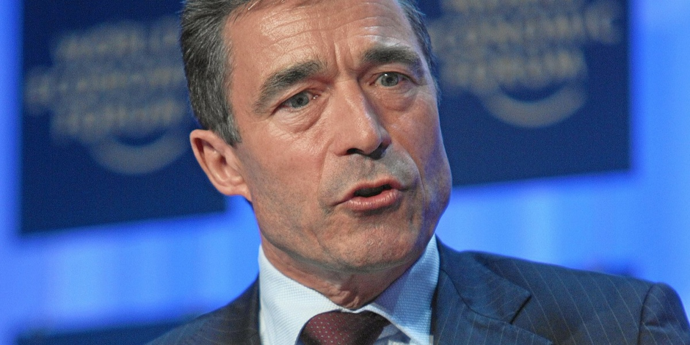
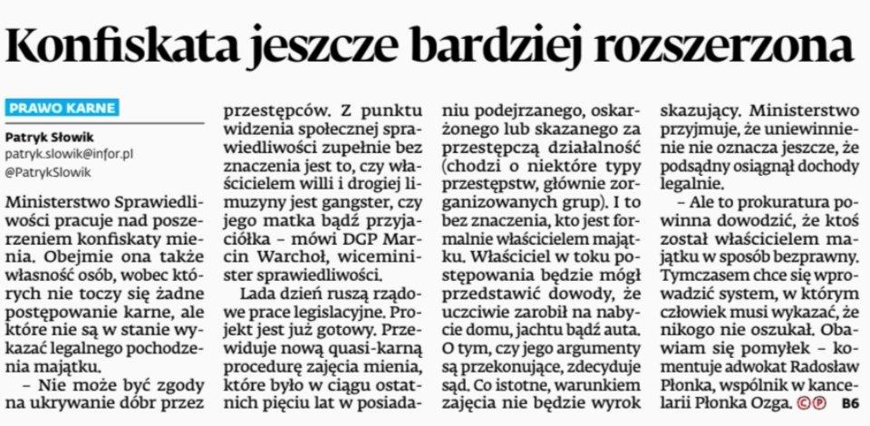
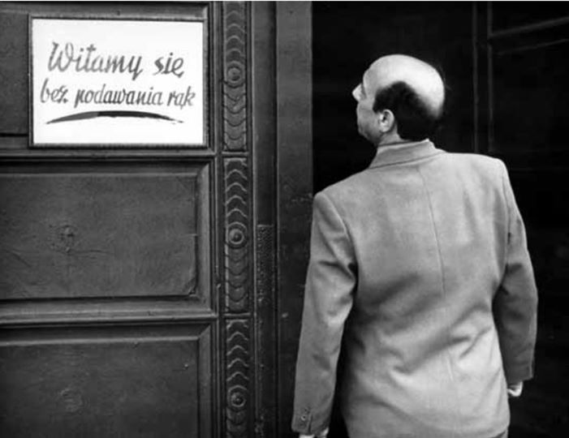
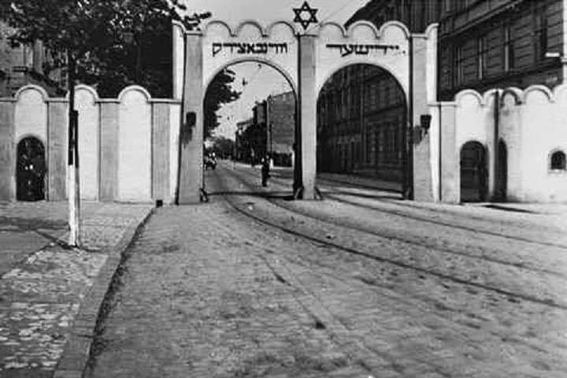
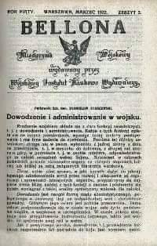

### 2022

Były szef NATO nie ma złudzeń: Putin nie zatrzyma się na Ukrainie

Powinniśmy uświadomić sobie, że mamy wybór pomiędzy konfrontacją z Putinem teraz albo później, bo on nie zatrzyma się na Ukrainie - mówił w wywiadzie dla Radia Wolna Europa b. szef NATO Anders Fogh Rasmussen. Dodał, że jego zdaniem Zachód nie zrobił wystarczająco dużo, by odstraszyć Rosję.

  

---

Banki centralne mają teraz diabelską alternatywę: podnosić stopy procentowe i ryzykować recesją, czy nie podnosić i ryzykować spiralą inflacyjną? Problem w tym, że mechanizmy stopy procentowe – inflacja się „zatarł”.
„Zatarł”, bo inflacja jest importowana przez ceny surowców i towarów rolnych, a stopy procentowe tego nie zahamują. Memento to inflacja w Czechach – rozpoczęli podwyżki o 4 miesiące wcześniej niż RPP, a inflacja rosła i w lutym wyniosła 11,1%.
Super- jastrząb, prezes NBP, Adam Glapiński, mówi, że możliwe są podwyżki nawet dwa razy w miesiącu. Czy ortodoksyjni ekonomiści mają rację? Wysokie stopy procentowe to: mniejsze inwestycje, mniejszy popyt wewnętrzny (mniej pieniędzy po opłaceniu kredytu), mniejszy PKB.
Możliwa jest nawet recesja. Uważam, że RPP nie powinna przesadzać – powinna patrzeć na ECB, który do 2023 roku stóp nie podniesie. Patrzeć to nie znaczy nic nie robić, ale uważam, że maksymalny poziom stóp to 4,00%. Potem trzeba zrobić dłuższą przerwę.

> Will Inflation Stay High for Decades? One Influential Economist Says Yes
> Charles Goodhart sees an era of inexpensive labor giving way to years of worker shortages—and higher prices. Central bankers around the world are listening. 

### 2021

Gates krytykuje bitcoina. Ma fatalny wpływ na środowisko

"Dokonując transakcji płatniczej za pomocą bitcoina generujemy więcej energii niż ma to miejsce w przypadku jakiejkolwiek innej metody płatności” – stwierdził. I podkreślił, że "nie jest to rzecz przyjazna środowisku".
Gates stwierdził jednak, że "problem energochłonności bitcoina mógłby zniknąć, jeśli do jego produkcji zostaną wykorzystywane odnawialne źródła energii, bez jednoczesnego wykluczania innych użytkowników". Wyjaśnił przy tym, że nie uważa, żeby produkcja kryptowaluty jednoznacznie przyczyniała się do zmian klimatu.
W ostatnim czasie produkcja kryptowalut stała się jednym z najbardziej energochłonnych procesów. Światowa sieć bitcoinów pochłania tyle prądu, ile w 2018 r. wyniosło równowartość roczne zapotrzebowania na energię elektryczną Irlandii. Niedawno opublikowana analiza naukowców z Uniwersytetu Cambridge wskazuje, że bitcoin obecnie konsumuje tyle energii co cała Argentyna.

---

> Fed doesn’t see inflation running out of control, Harker says

The Federal Reserve sees inflation moving up towards its 2% annual target but doesn’t see runaway price pressure, said Philadelphia Fed President Patrick Harker on Tuesday.

“At this point, we don’t expect inflation to be running out of control,” Harker said, during a webinar hosted by the Delaware State Chamber of Commerce.

“We have time to move because we’re not seeing inflation running out of control. If it does, we’ll act accordingly,” he said.

The consumer price index rose 0.6% in March, the largest month-on-month gain since 2012. The 12-month rate rose to 2.6%. 

---
### 2020

Corona wirus

  

  

  

### 2019

Chyba największy FakeNews od lat. Dwa dni temu swoją premierę miał film „Dwóch papieży” Netfliksa. Film zaczyna się od zdania lektora „Film oparty na prawdziwych wydarzeniach”. U każdego oznacza to, że fabuła filmu jest co do zasady prawdziwa. Bez ujawniania szczegółów – film opiera się na serii spotkań Benedykta XVI i kard. Jorge Bergoglio, w których papież namaszcza Bergoglio na przyszłego papieża. Informacja o tym, że film powstaje obiegła świat dawno. Dlaczego o tym piszę. 13 marca 2019 r. Sekretarz Stanu Stolicy Apostolskiej ks. kard. Pietro Parolin, druga osoba w Kościele Katolickim, przyjaciel Franciszka i najsilniejszy „papabile” odwiedził Polskę. 100 rocznika KEP. Byłem wtedy w budynku KEP. W jednej z dalej wysuniętych sal siedziałem z jednym z księży. Do pokoju nagle wszedł ksiądz kardynał – nikt pojęcia nie miał po co tam. Zaczęliśmy rozmawiać o prywatności w Kościele. Pamiętam, że gdy poruszyłem temat dezinformacji, powiedział: powstaje w USA taki film, będzie dezinformował. Myślę, że chodziło o ten. Obejrzałem. Rozmawiałem z wieloma osobami w tym księżmi, biskupami. Papież Franciszek spotkał się z Benedyktem XVI dopiero po konklawe. Zaraz po złożeniu rezygnacji Benedykt XVI udał się poza Rzym, by nie mieć wpływu na jego przebieg. Sama fikcja. Po co ktoś ją stworzył?
Zniszczenie kościoła

### 1962

https://en.wikipedia.org/wiki/Operation_Northwoods

### 1943

W dniach 13 - 14 marca 1943 roku Niemcy przeprowadzili ostateczną likwidację krakowskiego getta. Na czele operacji stanął SS -Sturmbannführer Willi Haase . 8 tysięcy Żydów uznanych za zdolnych do pracy zostało przetransportowanych do obozu Kraków-Płaszów . Około 2 tysięcy zostało zamordowanych przez Niemców podczas likwidacji getta, pozostałych mieszkańców wywieziono do obozu Auschwitz-Birkenau i również zamordowano.

  

### 1918

1918 roku w Warszawie ukazało się pierwsze wydanie miesięcznika wojskowego "Bellona".
Historia tego pisma zaczyna się jednak o wiele wcześniej, bo w 1824 roku,kiedy to na pomysł wydawania tego typu publikacji przeznaczonej dla zainteresowanych tematyką wojskową oraz rozwojem intelektualnym niezależnej od doktryny zaborczej myśli wojskowej wpadł podpułkownik Armii Królestwa Polskiego Ignacy Prądzyński. Nie trudno chyba zgadnąć,że na wydawanie tego pisma nie zgodziły się władze carskie. 
Do pomysłu tego powrócono w 1911 roku,kiedy to działające we Lwowie polskie organizacje niepodległościowe próbowały bezkutecznie wydać "Bellonę Polską". Dopiero 6 lat pózniej w wyniku powstania działającego w ramach Komisji Wojskowej Tymczasowej Rady Stanu-Wydziału Pierwszego Studiów nad Wojskowością Polską udało się przystąpić do prac nad przygotowaniem tego pisma.
Pierwszy numer "Bellony " liczący tysiąc egzemplarzy wydrukowany został w Drukarni Państwowej Królestwa Polskiego.
Pierwsze numery dostarczane były oficerom
wszystkich broni podczas wszelkiego rodzaju
szkoleń. Wzbudziły one duże zainteresowanie i
przyczyniły się do uaktywnienie wielu
wartościowych jednostek na polu naukowym.
Pierwsze artykuły zawierały wiele informacji
ogólnowojskowych, poruszały zagadnienia
taktyki i wyposażenia. Nie zabrakło również
materiałów z historii wojskowości oraz analiz
z toczących się w niedalekiej przeszłości
kampanii trwającej jeszcze wówczas wojny.
Po odzyskaniu przez Polskę niepodległości "Bellona" stała się typowym ogólnowojskowym pismem naukowym.
W okresie międzywojennym redakcja "Bellony" w znacznej mierze poruszała tematykę bitew pierwszej wojny światowej,analizę ich taktyki oraz zastosowania sprzętu.
Swój ostateczny kształt pismo to przyjęło w 1936 roku,kiedy to został do niego wcielony ukazujący się od 1926 roku "Przegląd Wojskowy".
Na kartach "Bellony" swoje prace publikowało
ponad 180 autorów, w tym większość
wykładowców Wyższej Szkoły Wojennej w
Warszawie, między innymi gen. Kazimierz
Sosnkowski , gen. Tadeusz Kutrzeba, gen.
Kazimierz Fabrycy, mjr Jan Kosina oraz wielu
innych znakomitych oficerów Wojska
Polskiego.
Ostatni numer "Bellony" ukazał się w 1939 roku.

  

### 1567

Wojna osiemdziesięcioletnia: zwycięstwo wojsk hiszpańskich nad niderlandzkimi powstańcami w bitwie pod Oosterweel.
Bój toczył się na polach wioski Oosterweel, na północ od Antwerpii. Hiszpańskie oddziały tercios dowodzone przez Philippe de Lannoy hrabia Beauvoir pokonały niderlandzkich powstańców, na czele, których stał Jan Marnix van Aldegonde (poległ w boju od postrzału z arkebuzu).
12 marca dowództwo hiszpańskie potajemnie przygotowało plan błyskawicznego ataku na przeważające siły niderlandzkie składające się z 2500 ludzi. Szybki nocny (z 12 na 13 marca) marsz 800 żołnierzy tercios podzielonych na małe grupy, aby niezważenie mogły przedostać się miedzy czatami niderlandzkimi do miejsca zbornego. Plan powiódł się bez żadnych większych przeszkód. O godzinie 3:30 w punkcie docelowym podjęto decyzję, aby wykorzystać element zaskoczenia przeciwnika. Postanowiono, aby zaatakować przeciwnika w całkowitej ciszy, (Encamisada) ze zwiniętymi sztandarami. Wydano również rozkazy, aby ostrzał arkebuzerów został prowadzony z minimalnej odległości tak, aby po oddaniu salw dym jednocześnie stanowił osłonę dla mniej liczebnych oddziałów tercios. Grupa została podzielona na dwa oddziały: główny 500 ludzi i drugi o liczebności 200. Zadaniem drugiej grupy było zlikwidowanie patrolów, straży oraz osłony baterii 5 dział przy prowizorycznie zbudowanym bastionie ochraniającym główny obóz.
O brzasku podchodzący od zachodniego lasu grupa hiszpańska czołgając się (bez uzbrojenia ochronnego) pod umocniony holenderskiego obozu zaczęła wykonywać swoje zadania: zlikwidowała śpiących strażników (korzystając z kusz) przy małym bastionie oraz wybiła niczego niespodziewających się artylerzystów. Natychmiast obrócono działa w liczbie 5 w bramę oraz przebrano kilku ludzi znających niderlandzki w odzież poległych Holendrów. Po zajęciu baterii posłano gońca z informacją obwieszającą sukces pierwszej fazy planu oraz jednoczesne ponaglenie, aby główne siły przybyły w miarę możliwości jak najszybciej na pozycje przy bastionie. Nie minęło 40 minut, gdy druga kolumna pojawiła się na skraju lasu. W pewnym momencie rozległ się dzwięk bębnów. Głowna kolumna została zauważona, ale jakież było zdziwienie straży niderlandzkich na wałach, gdy spostrzegli w blasku poranku własne armaty wycelowane w ich kierunku. W obozie zapanował chaos werble, trąbki zaczęły wzywać śpiących ludzi pod broń. W pewnym momencie, gdy obie kolumny hiszpańskie połączyły się wypaliły wszystkie pięć armat w kierunku prowizorycznych umocnień. Hiszpanie z okrzykiem "Za świętego Jakuba i Hiszpanię!" rzucili się na bezradnych Holendrów, którzy wprawdzie stawili dzielny opór jednak zwarte szeregi arkebuzerów hiszpańskich powstrzymały rozpaczliwą próbę kontrataku oddając salwę, po czym razem z pikinierami, (którzy w tej akcji użyli krótszych pik morskich) oraz oddziałami escudados uzbrojonymi w puklerze i broń białą rzucili się na zmieszanych Holendrów. Z 2500 żołnierzach niderlandzkich ok. 200 zdołało ujść z pogromu.

---

<a href="https://github.com/TomaszWaszczyk/historia.waszczyk.com/edit/master/src/content/march-13.md" target="_blank">Edytuj tę stronę dzieląc się własnymi notatkami!</a>
