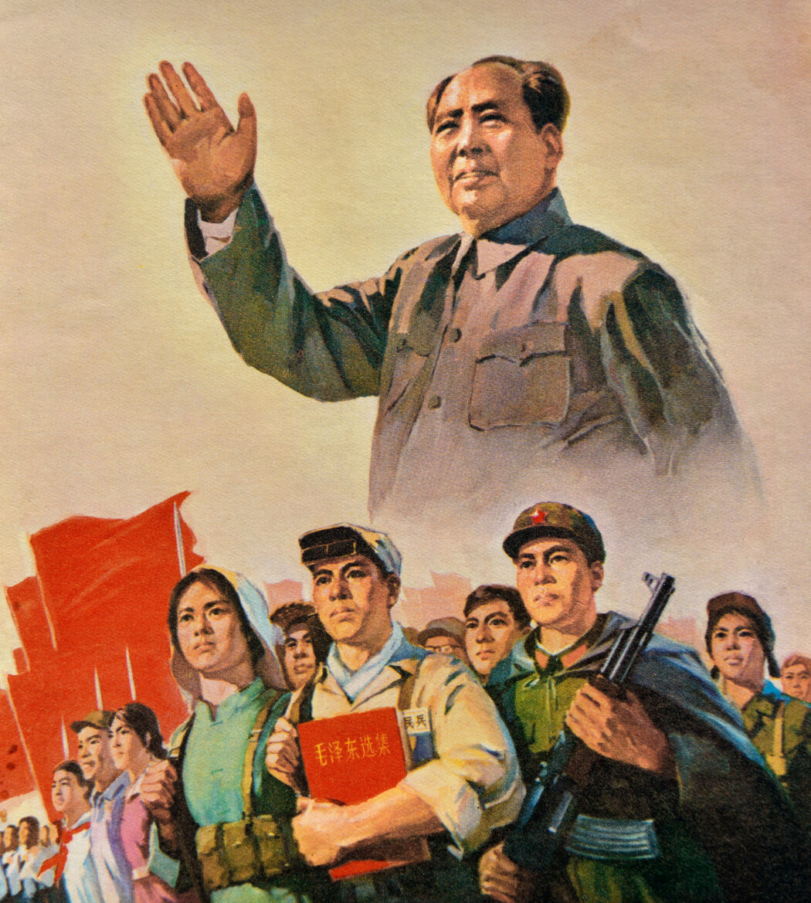
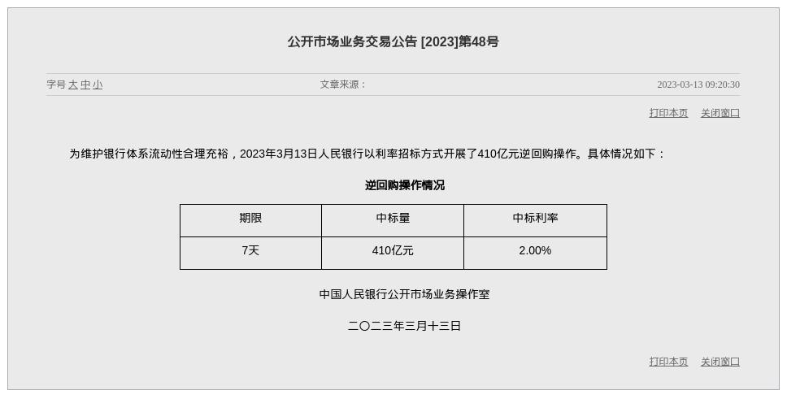
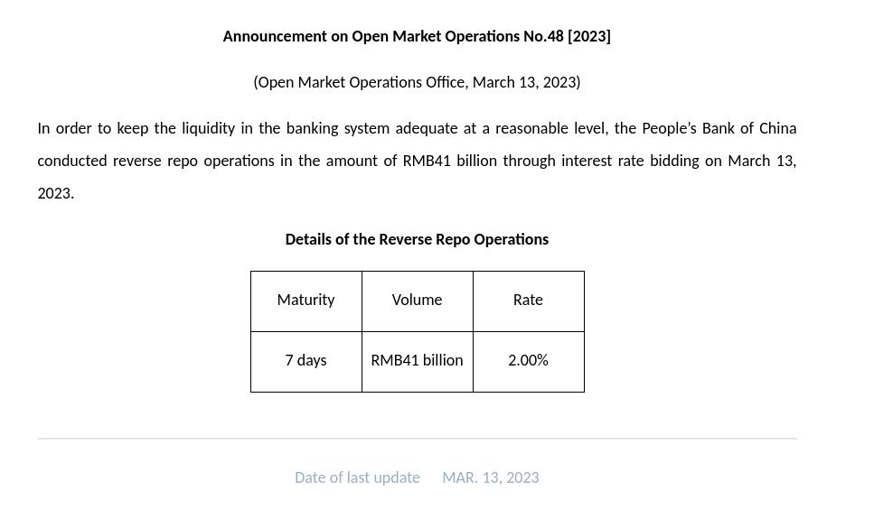
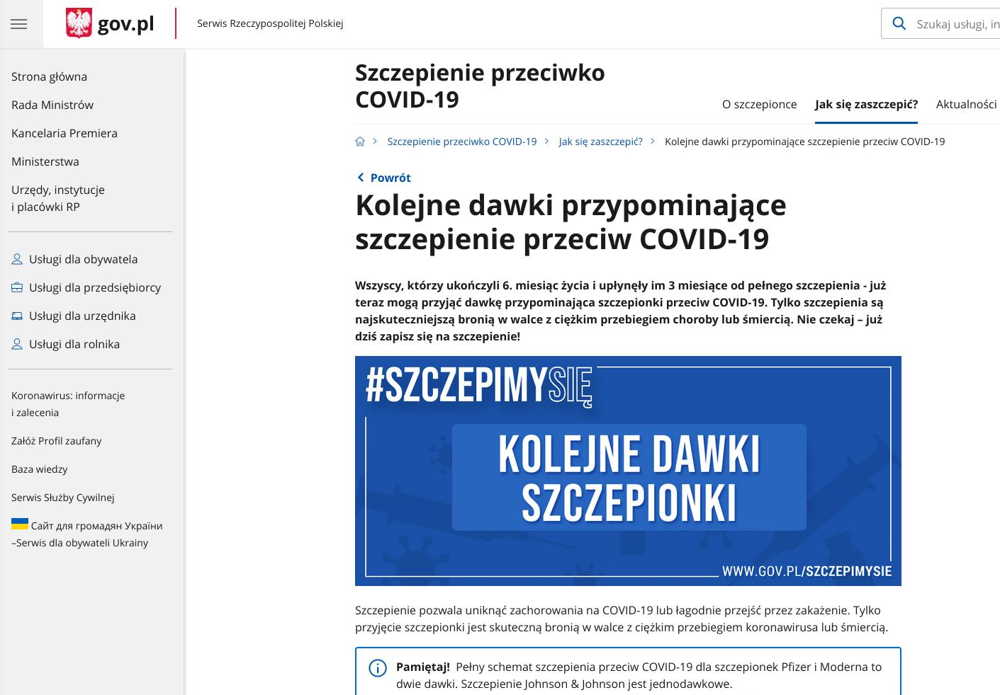
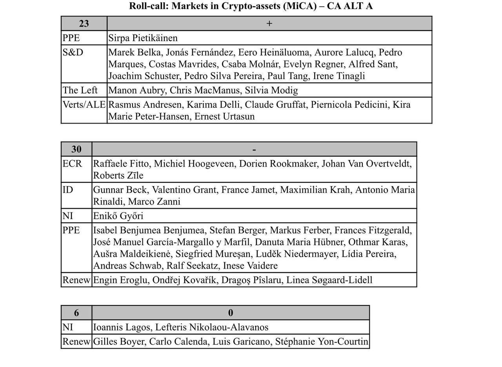
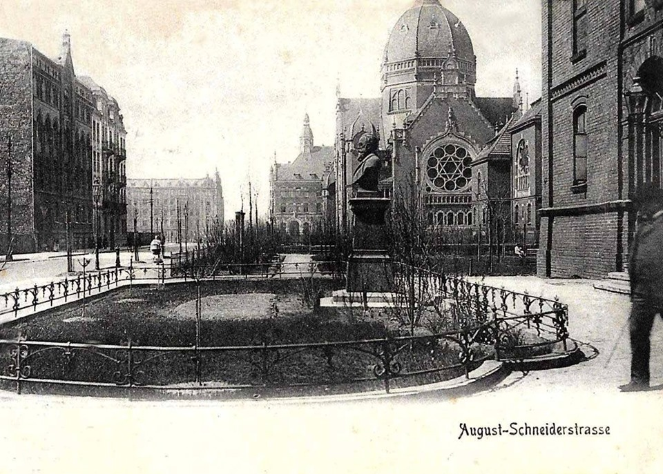
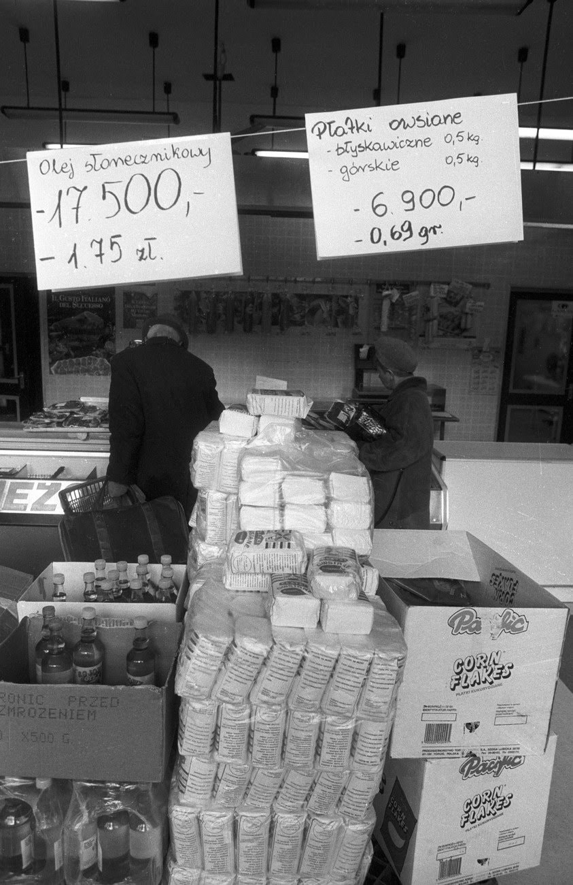
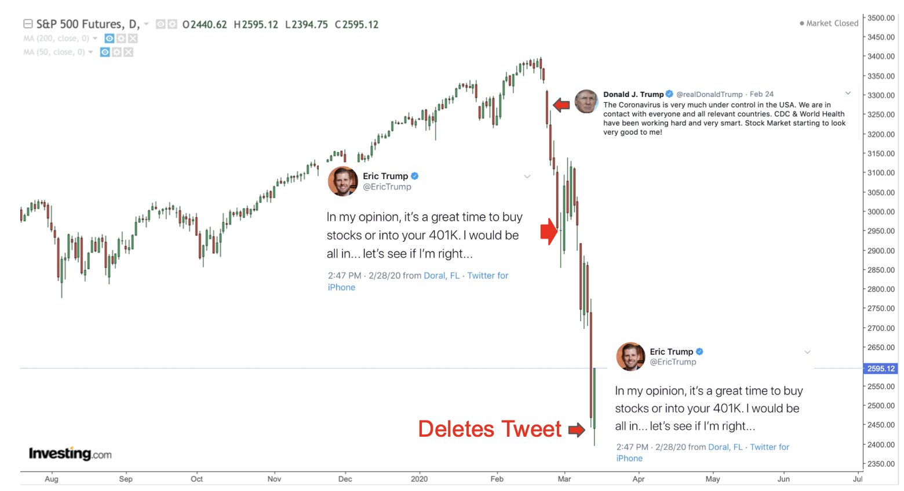
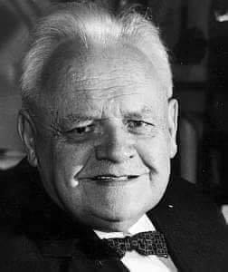
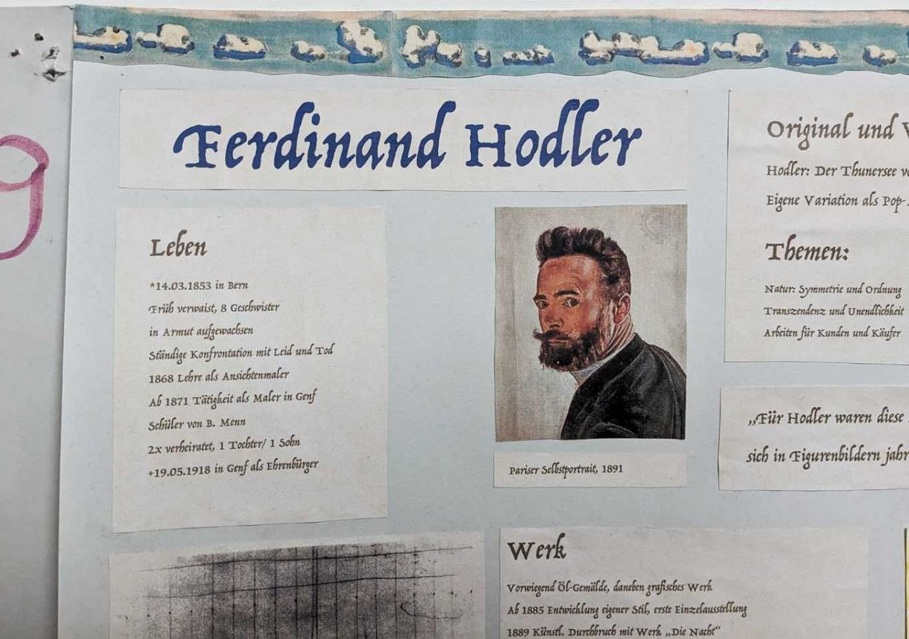

### 2024

<br><br>

```
Zauważyliście może podobieństwo chińskiego „Wielkiego skoku” i europejskiego „zielonego ładu”?

Porównanie wygląda mniej więcej tak:

Chiny / UE
Reforma gospodarcza i rolna / Reforma gospodarcza i rolna.

Rozprawienie się z nieprzychylnymi członkami partii (w celu pozbycia się głosów sprzeciwu) / Konsensus naukowy (w celu pozbycia się głosów sprzeciwu).

Industrializacja kraju / elektryfikacja krajów.

Ograniczenie nadmiernej konsumpcji poprzez manipulowanie przy cenach zboża / Ograniczenie nadmiernej konsumpcji poprzez manipulowanie przy cenach energii.

Ograniczenie podróży pomiędzy regionami (poprzez pozwolenia) / Ograniczenie podróży (poprzez wysokie podatki na transport).

Zmniejszenie efektywności rolnictwa poprzez gęstszy zasiew / Zmniejszenie efektywności rolnictwa poprzez ugorowanie gruntów.

Likwidacja prywatnych działek rolnych (poprzez budowę komun) / Likwidacja prywatnych działek rolnych (poprzez wykup przez wielkie koncerny).

Burzenie prywatnych domów w celu budowy komun / Burzenie prywatnych domów przez klasę energetyczną.

Jedzenie kory drzew i trawy / Jedzenie robaków.

Ataki na pociągi z jedzeniem / Ataki na pociągi z jedzeniem.

Likwidacja wróbli / Likwidacja CO2.

Dokładanie przepisów zamiast rozwiązywania problemów / Dokładanie przepisów zamiast rozwiązywania problemów.

Ofiary Wielkiego Skoku: 40 mln
```

### 2023

Ludowy Bank Chin poinformował na swojej stronie internetowej, że przeprowadził siedmiodniowe transakcje reverse repo o wartości 15 mld juanów (około 2,15 mld dol.) przy stopie procentowej 2%
Według banku centralnego, ruch ten ma na celu utrzymanie płynności w systemie bankowym.

<br><br>

<br><br>

---

<br><br>

> The root problem with conventional currency is all the trust that’s required to make it work. The central bank must be trusted not to debase the currency, but the history of fiat currencies is full of breaches of that trust. Banks must be trusted to hold our money and transfer it electronically, but they lend it out in waves of credit bubbles with barely a fraction in reserve. We have to trust them with our privacy, trust them not to let identity thieves drain our accounts.

More than 85% of Silicon Valley's Bank's Deposits Were Not Insured.
Silicon Valley Bank held the funds of hundreds of #us #tech companies and was a crucial player in the valley’s economy. But on Friday, it became the second largest bank failure in U.S. history after a rapid run on its deposits. Some $175 billion in customer accounts were taken over by the Federal Deposit Insurance Corporation (FDIC), which is now tasked with returning money to the bank’s customers.
But more than 85% of the bank’s deposits were uninsured, according to estimates in a recent regulatory filing. That’s because FDIC deposit insurance is meant for everyday bank customers and maxes out at $250,000. Many Silicon Valley #startups had millions, or even hundreds of millions of dollars deposited at the bank—money they used to run their companies and pay employees. Right now, nobody’s sure how much of that cash is left.

<br><br>

---

<br><br>

---

### 2022

<br><br>

---

> Serwis śledczy stowarzyszenia Disclose podaje, że Francja w latach 2014-2020 sprzedawała Rosji sprzęt wojskowy mimo embarga, wykorzystując lukę prawną w tym zakresie.

### 2021

> We are willing to rebuild the Old Synagogue that once belonged to the city of Katowice, but was completely destroyed in 1939

<br><br>

---

https://en.wikipedia.org/wiki/Pi_Day

---

✅Średnia krajowa porównana z tą, którą mieliśmy w pl ponad 40 lat temu...  pokrywa się idealnie. 😲

<br><br>

💪Jestem dumny z sukcesów prezesa Narodowego Banku Polskiego Glapińskiego który to powtarza w kółko, że robi wszystko aby utrzymać strategię celu inflacyjnego (czytaj: wzrost cen) Komunista z krwi i kości, który grabi obywateli poprzez inflację.
Za niecałe 10 lat, wszyscy możemy być milionerami, jeśli(!).. historia z hiperinflacją powtórzy się w Polsce po raz trzeci.‼️ ... a podbudowa jest dobra, wzrost waluty za 2020r. to aż +16% r/r.

Pierwszy raz, w latach '20 ubiegłego wieku, spowodowane to było nadmiernym deficytem budżetowym i dodrukiem pieniędzy - problem rozwiązano zastąpieniem marki polskiej, przez złoty polski, o kursie równemu kursowi franka szwajcarskiego, podatek inflacyjny został zastąpiony nadzwyczajnym podatkiem majątkowym oraz „zwyczajnymi” podatkami, takimi jak: dochodowy i przychodowy...
Lata '80 to powtórka z rozrywki... dodrukowywanie pieniądza i parę lat później denominacja (wprowadzenie nowego polskiego złotego). Wprowadzano pakiety ustaw, które były procedowane w przyspieszonym tempie, by uniknąć wprowadzania poprawek w komisjach sejmowych (kolejne podatki, cła, opłaty)...

W latach 80-tych też tworzono coraz wyższe nominały, a to wszystko dla naszego dobra by łatwiej było obracać milionami.
Dla przypomnienia:

- w 1990r. wyszedł banknot 0.5mln zl
- w 1991r. - banknot 1 mln zl
- w 1992r. - banknot 2 mln zl
- w 1993r. - banknot 3 mln zl
- w 1994r. - banknot 4mln zl

Warto zobaczyć jak wyglądały ceny przed denominacją. Słynne hasło: 

> zakryj ręką zera cztery - zyskasz złoty nowej ery

<br><br>

<!-- zobowiązanie staje się łatwiejsze w spłacie, bo jego realna wartość spada w stosunku do „nowej” wartości pieniądza. Wiec jak godziwie zarabiasz w „nowym pieniądzu” to masz promocję na spłatę zobowiązań (e.g. Przyjmijmy, że teraz fajna pensja w zawodzie X to 10k, szaleje inflacja i w nowym otoczeniu masz już 40k za tę samą pracę. Przy okazji wszystko podrożało 4x więc jedynie zachowałeś siłę nabywczą, ale kredyt na 100k spłacasz już z 2,5 miesiąca pracy, a nie z 10 miesięcy jak przedtem. Jak nie masz takiego dochodu, to raty zobowiązania Cię niszczą, bo też mocno wzrastają. 
---
Polska nie była nigdy wcześniej w systemie wolnorynkowym gdzie 95% obywateli miało zobowiązania kredytowe przy szalejącej inflacji. Jednak patrząc na historię dobrym zobrazowaniem jest rok 1991. Rekordowo wysoką stopę w NBP odnotowano właśnie w roku 1991, gdy władze podwyższyły ją z 34% do 72% (obecnie jest 0,1%). Był to szok dla dłużników, ale czym było 70% przy 400-procentowej dynamice wynagrodzeń? Rok później stopy spadły do 40%. Ale dopiero w 1995 zeszły poniżej 30%, a trzy lata później poniżej 20%. kredytobiorcom było więc coraz łatwiej, choć trzymiesięczny Wibor spadł z 30% w roku 1995 poniżej 10% dopiero w XXI wieku. Właśnie dopiero zejście "rynkowych" stóp procentowych do jednocyfrowych poziomów zapoczątkowało w Polsce erę komercyjnego kredytu mieszkaniowego. Od tamtej pory Wibor nie wzrastał już powyżej 7%. Zatem ciężko jest prognozować co mogłoby się wydarzyć przy rozdmuchanej hiperinflacji. Na pewno kupno nieruchomości za środki uzyskane z kredytu w oczekiwaniu, że przez kolejne 15 lat, w efekcie wysokiej inflacji kredyt sam się spłaci jest delikatnie mówiąc mrzonką. Żaden kraj nie chce mieć śmieciowej waluty i podnosząc stopy proc. podnosimy jej wartość. Prawdziwym wygranym w czasie hiperinflacji nie są osoby, których wartość kredytu spadła w skutek hiperinflacji, lecz osoby, które posiadają kapitał, za który mogą nabyć wiele aktywów po bardzo atrakcyjnych cenach gdyż depresja gospodarcza oraz wstrzymanie kredytowania nowych nieruchomości w bardzo dużym stopniu przyczynia się do załamania cen. ➡Gdyby ponownie doszło do wprowadzenia nowej waluty oczekiwać by można raczej powtórki sytuacji z Meksyku. Gdy upadał system monetarny wprowadzono nową walutę, aby przywrócić stabilizację gospodarczą. Wprowadzono, jednak dwa różne kursy, po których przeliczano waluty. Po innym kursie zostały przeliczone depozyty ulokowane w bankach, w taki sposób, że większość z nich stała się bezwartościowa. Po zupełnie innym kursie przeliczono, natomiast zaciągnięte kredyty, tak aby ich wartość odpowiadała realnej inflacji oraz aktualnej wartości nieruchomości będących zabezpieczeniem kredytu. Innymi słowy, jeśli spłaciłeś realnie do tej pory 20% kredytu, to po przeliczeniu na nową walutę pozostanie ci 80% do spłaty. Żadnej taryfy ulgowej. ✅Absolutnie nie liczyłbym na sytuację, w której dojdzie do hiperinflacji, zaś stopy procentowe pozostaną na niskich poziomach, a nasz kredyt dzięki temu znacznie się zdewaluuje. W Polsce sektor bankowy, póki co jest zbyt silnie chroniony
-->

---

### 2020 - Barany chodzą stadami. Orły latają samotnie

<br><br>

<br><br>

<br><br>

<br><br>

### 1964

Poeta Antoni Słonimski złożył w kancelarii ówczesnego premiera PRL list protestacyjny przeciwko cenzurze. Podpisane pod nim osobistości polskiej kultury i literatury wyrażały w nim zaniepokojenie o losy polskiego słowa pisanego.
Oto treść tego dokumentu:
" Ograniczenia przydziału
papieru na druk książek i czasopism oraz zaostrzenie cenzury prasowej stwarza sytuację zagrażającą rozwojowi kultury narodowej.
Niżej podpisani, uznając istnienie opinii publicznej, prawa do krytyki, swobodnej dyskusji i rzetelnej informacji za konieczny element postępu, powodowani troską obywatelską, domagają się zmiany polskiej polityki kulturalnej w duchu praw zagwarantowanych przez konstytucję państwa polskiego izgodnych z dobrem narodu."
Pod listem podpisało się 34 sygnatariuszy, wśród których byli: Jerzy Andrzejewski, Maria Dąbrowska, Stanisław Dygat, Marian Falski, Paweł Jasienica, Stefan Kisielewski, Jan Parandowski czy Melchior Wańkowicz (zdjęcie).
To właśnie ten ostatni z wymienionych sygnatariuszy  został przez władze potraktowany najsurowiej. Oskarżono go o oczernianie PRL i próbowano skazać na pozbawienie wolności.
Ostatecznie jednak, chcąc uniknąć całkowitej kompromitacji władza zdecydowała się na wycofanie zarzutów wobec Wańkowicza.

<br><br>

### 1944

1944 roku banda UPA napadła na wieś Dżurków w powiecie kołomyjskim w województwie stanisławowskim. Bandyci uprowadzili, a następnie zamordowali 14 Polaków.
Wspomina Józef Żarski:
"Miałem niespełna pięć lat, gdy banderowcy w nocy z 14 na 15 marca 1944 roku podpalili nasz dom. Uciekaliśmy przez pola w kierunku rzeki. Do dziś słyszę świst kul nad naszymi głowami. Rano wróciliśmy do domu. Zastaliśmy pogorzelisko. Wszystko było spalone: zwierzęta, zboże, cały dorobek materialny moich rodziców. Pozostały tylko resztki zboża w nadpalonych workach. Ale żyliśmy. Wiele polskich rodzin doznało wtedy krzywdy ze strony Ukraińców."

### 1941

Adam Heydel (ur. 6 grudnia 1893 , zm. 14 marca 1941) był przedstawicielem szkoły krakowskiej w ekonomii, opowiadał się za liberalizmem (w klasycznym rozumieniu-moje) gospodarczym. Krytykował etatyzm i interwencjonizm gospodarczy Polski międzywojennej. Zajmował się badaniami naukowymi nad teorią ekonomii i zagadnieniami dochodu narodowego

<br><br>

### 1937

Died Lars Edvard Phragmén

### 1918

W Warszawie urodził się Bogusław Mierzwa (zdjęcie)-porucznik pilot Wojska Polskiego, porucznik Królewskich Sił Powietrznych.
Był absolwentem Szkoły Podchorążych w Dęblinie, którą ukończył w 1939 roku. Służbę w polskim lotnictwie rozpoczynał w 114 Eskadrze Myśliwskiej. Był uczestnikiem wojny obronnej w 1939 roku,po zakończeniu której wyemigrował do Rumunii, a następnie do Francji i Anglii. Tam właśnie służył w słynnym Dywizjonie 303 pod numerem P1389. Odbył 4 loty bojowe i 3 walki powietrzne.
16 kwietnia 1941 roku odbył swój ostatni lot w
życiu. Tego dnia z innymi pilotami swojego
dywizjonu i kolegami z brytyjskiego 601 poleciał na osłonę bombowców. Celem bombardowania było lotnisko niemieckich myśliwców położone po drugiej stronie kanału La Manche we Francji. Lot do celu przebiegał bez niespodzianek. Natomiast w czasie powrotu z nad celu Polaków zaatakowały nieprzyjacielskie myśliwce.
Przeciwnicy strzelali celnie. Efektem tego było zestrzelenie samolotu Polaka. Podporucznik pilot Bogusław Mierzwa zginął śmiercią lotnika.

<br><br>

### 1853

<br><br>

---

<a href="https://github.com/TomaszWaszczyk/historia.waszczyk.com/edit/master/src/content/march-7.md" target="_blank">Edytuj tę stronę dzieląc się własnymi notatkami!</a>
