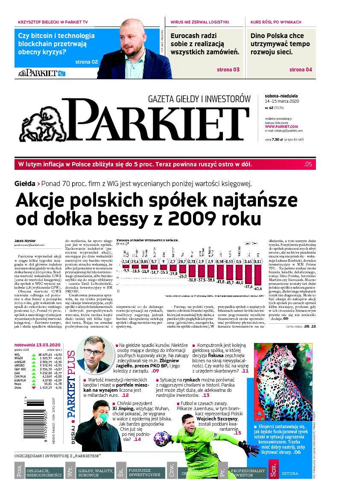
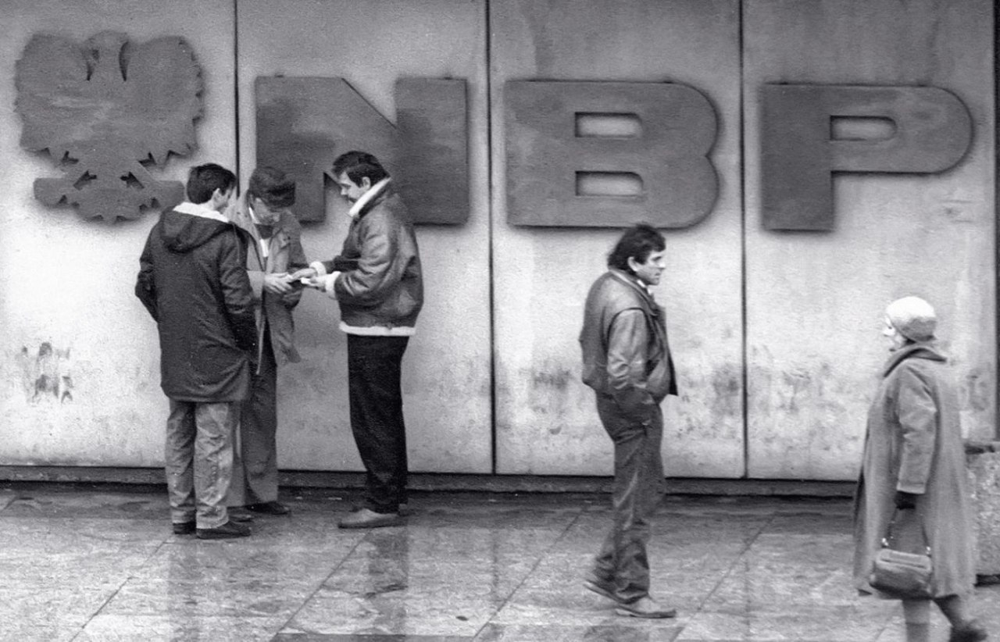
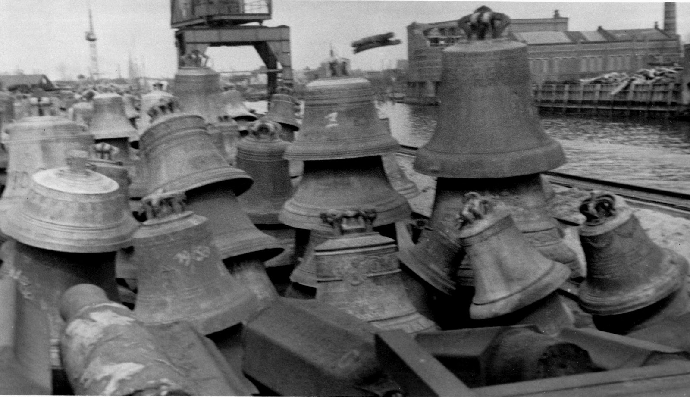
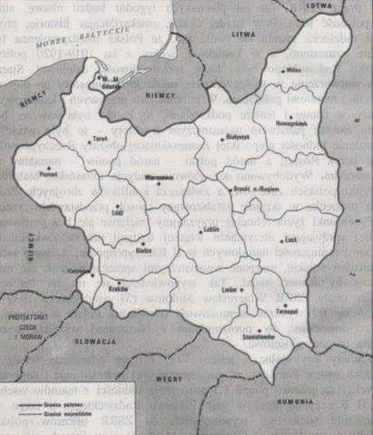

### 2020

  

---

Premier Morawiecki zapewnia, że:

1. sektor bankowy jest stabilny

2. nie zabraknie środków w bankomatach, dobrze płacić elektronicznie

3. osoby zagrożone bezrobociem będą mieć pomoc

4. zdrowie publiczne jest najważniejsze dla Premiera..

5. strefa euro będzie w recesji, wpływ spowolnienia w Europie zachodniej będzie istotny

6. trudny czas przed nami, trudne dni, tygodnie, oby nie trudne kwartały i lata

7. ...wypłaty 500+ nie są w najmniejszym stopniu zagrożone...

### 1989

Weszło w życie nowe prawo dewizowe, legalizujące prywatny obrót walutami obcymi w kantorach walutowych.
Do tego czasu w handlu obcą walutą na terenie Polski w sektorze prywatnym nie obowiązywały praktycznie żadne regulacje prawne, a w powszechnym użyciu było określenie "cinkciarz", odnoszące się do osoby zajmującej się obrotem obcymi pieniędzmi. Kurs obowiązujący u nich zazwyczaj o wiele korzystniejszy od tego, który obowiązywał w państwowych bankach, dlatego wiele osób, narażając się również na spore ryzyko oszustwa decydowało się na taką właśnie wymianę dewiz.
Po wprowadzeniu nowych przepisów niektórzy z cinkciarzy, którzy o planowanych zmianach przepisów wiedzieli zawczasu i dysponowali większą gotówką, byli w stanie nazajutrz po wejściu w życie nowych przepisów otworzyć kantory albo nawet całe sieci kantorów wymiany walut. W ten sposób nagle stali się legalnymi przedsiębiorcami.

  

### 1940

Hermann Göring wydał rozporządzenie o przeprowadzeniu ewidencji, a następnie rekwizycji dzwonów znajdujących się na terenach wcielonych do Rzeszy, jak i na obszarach okupowanych. Proces rekwizycji dzwonów szczególnie nasilił się po ataku na ZSRR w 1941 roku.

W czasie II wojny Niemcy zrabowali ok. 120 tysięcy dzwonów. Zdecydowana większość z nich trafiła do Hamburga, gdzie w olbrzymich piecach hutniczych były przetapiane.

  

### 1923

Obradująca w Paryżu Rada Ambasadorów Ententy, której przewodniczył premier Francji Raymond Ponicair uznała wschodnią granicę Polski. Dokument ten uznawał  przynależność do Polski Wschodniej Galicji i Wileńszczyzny, a także dawał gwarancję wzmocnienia polskiej pozycji w Europie.
W osobnej klauzuli uznano również granicę polsko-litewską wytyczoną w lutym 1923 roku.

  

---

<a href="https://github.com/TomaszWaszczyk/historia.waszczyk.com/edit/master/src/content/march-15.md" target="_blank">Edytuj tę stronę dzieląc się własnymi notatkami!</a>
