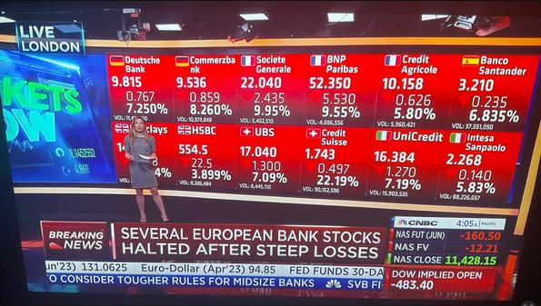
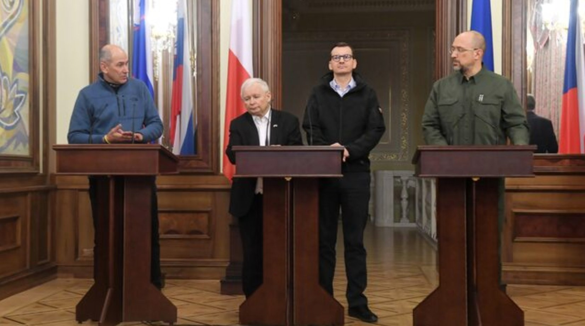
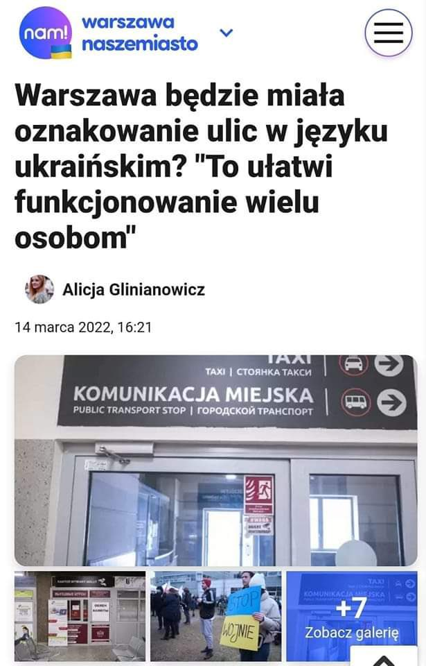
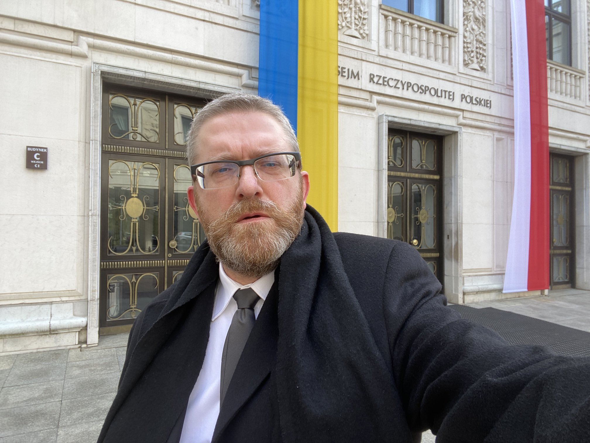
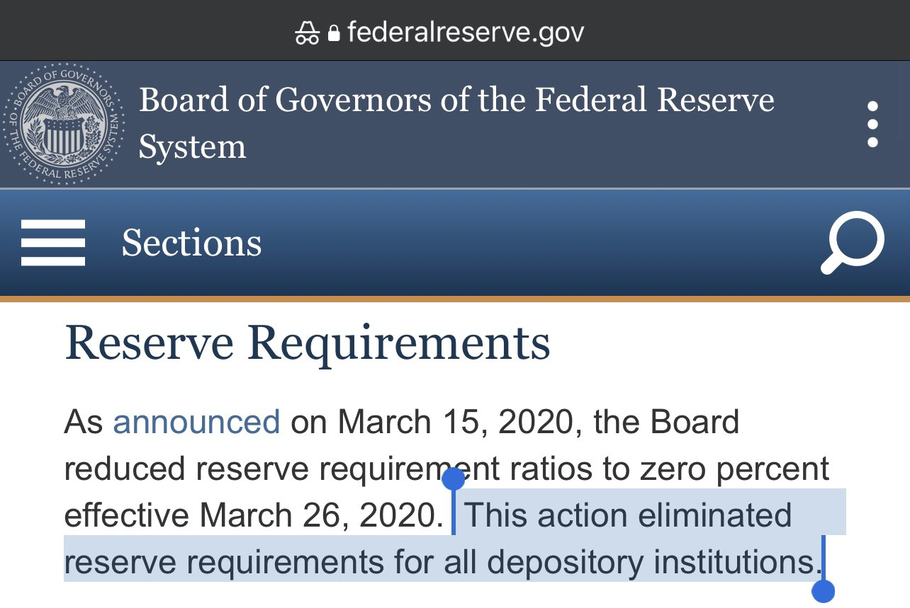
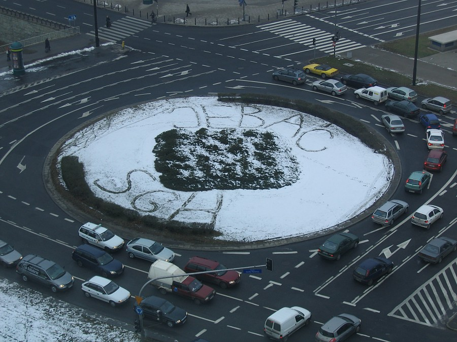
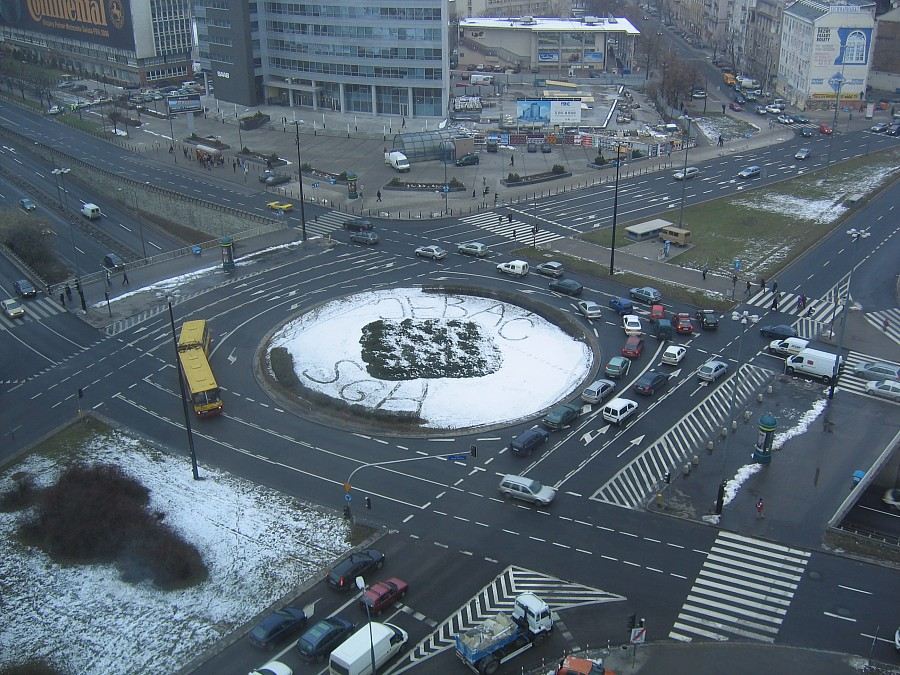
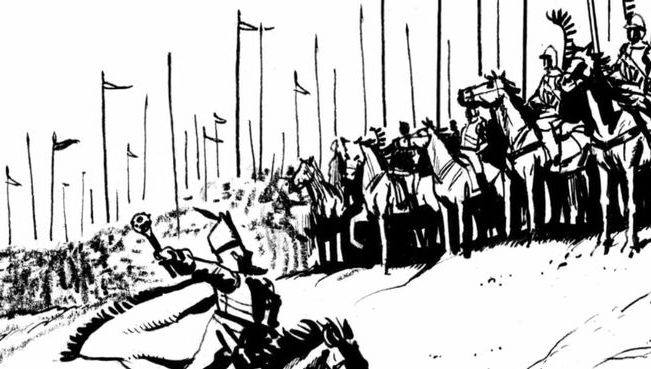

### 2023

  

### 2022

> Zełenski: Z takimi przyjaciółmi, z takimi sąsiadami będziemy w stanie wygrać

<video width="640" height="480" controls>
<source src="./movies/march/zalenski.mp4" type="video/mp4">
Your browser does not support the video tag.
</video>

...

  

---

Sankcje made by Europa:

  

---

Polacy, tolerancyjny i pomocny naród:

  

Polska w Ukrainie czy Ukraina w Polsce?

  

Wojna zakryła z dnia na dzień:

- przestępstwa rządu w "walce" z C19,
- aferę pegasusa,
- katastrofę Nowego Wału,
- dwucyfrową inflację,
- największe w historii zadłużenie PL,
- setki afer ostatnich 6 lat
- gnicie państwa,
- zapaść demograficzną

---

  

---

### 2021

> „Der Spiegel”: Symptomy upadku Niemiec

U schyłku ery Angeli Merkel w Niemczech dostrzec można zalążki klęski. W kluczowych dziedzinach kraj znajduje się na zaledwie przeciętnym poziomie. Państwo jest dysfunkcjonalne, a społeczeństwo zastygłe w dobrobycie.

Ullrich Fichtner w eseju opublikowanym w najnowszym wydaniu tygodnika „Der Spiegel” maluje w czarnych barwach przyszłość Niemiec.  Autor porównuje RFN do Imperium Osmańskiego, które po okresie świetności, z czasem przestało się rozwijać i uległo w końcu rozpadowi.

„Społeczeństwo, które zamyka się na zmiany, na dłuższą metę nie utrzyma dostatku. Kraj, który próbuje zatrzymać czas, aby korzystać z osiągniętego dobrobytu, upadnie. Kultura, która żywi się jedynie przeszłością i teraźniejszością, a do przyszłości odwraca się plecami, jest skazana na zagładę – pisze Fichtner.

---

Francuski fundusz gra pod wzrost stóp procentowych w Polsce. Inflacja za wysoka

---

  

---

### 2020

  

US banks have a 0% reserve requirement since 2020. If John deposits $100k, his bank can loan all of it to Sarah

So now John has 100k in his bank and Sarah has 100k in hers 100k was just created out of nothing.

If John and Sarah go to the bank to take out the 100k in cash, the bank doesn’t have it.

  

---

  

---

Premier Morawiecki zapewnia, że:

1. sektor bankowy jest stabilny

2. nie zabraknie środków w bankomatach, dobrze płacić elektronicznie

3. osoby zagrożone bezrobociem będą mieć pomoc

4. zdrowie publiczne jest najważniejsze dla Premiera..

5. strefa euro będzie w recesji, wpływ spowolnienia w Europie zachodniej będzie istotny

6. trudny czas przed nami, trudne dni, tygodnie, oby nie trudne kwartały i lata

7. ...wypłaty 500+ nie są w najmniejszym stopniu zagrożone...

---

First 0 interest, then QE Infinity.

Then negative rates and currency controls

Then cash limits and helicopter money

Then e-coin and cash ban

None of it will work...

---

Federal Reserve slashes rates to zero, restarts QE: The Federal Reserve made an emergency announcement Sunday afternoon by announcing that it would be cutting interest rates to zero for the first time since the financial crisis.

The central bank said it will use its “full range of tools” to battle the economic impacts of the novel coronavirus and announced quantitative easing in the form of at least $700 billion of asset purchases. It also encouraged banks to provide credit to the economy by eliminating reserve requirements and allowing the financial firms to tap into capital and liquidity buffers.

In a global effort, the Fed also announced standing U.S. dollar liquidity swap line arrangements in coordination with the Bank of Canada, the Bank of England, the Bank of Japan, the European Central Bank, and the Swiss National Bank. 

“The Federal Reserve is prepared to use its full range of tools to support the flow of credit to households and businesses and thereby promote its maximum employment and price stability goals,” the Fed said in a statement.

The Fed said the coronavirus outbreak “harmed communities and disrupted communities in many countries,” adding that the U.S. labor market still appeared “strong” as the U.S. economy rose at a “moderate rate.”

But the Fed on Sunday slashed rates by 100 basis points, less than two weeks after it had already made an impromptu 50 basis point cut. 

“The Committee expects to maintain this target range until it is confident that the economy has weathered recent events and is on track to achieve its maximum employment and price stability goals.”

The Fed also resumed the crisis-era policy of large-scale asset purchases by committing to Treasury purchases of at least $500 billion and agency mortgage-backed securities of at least $200 billion “over coming months.”

The central bank was scheduled to hold a Federal Open Market Committee meeting on March 17-18 with a policy announcement on March 18. In the face of accelerating cases of the coronavirus around the world, the Fed pulled the decision forward.

The decision was voted on by all members of the FOMC with the exception of Cleveland Fed President Loretta Mester, who supported all the actions but preferred only a 50 basis point cut to a target range of between 0.5% and 0.75%.

### 2019

https://en.wikipedia.org/wiki/2019%E2%80%9320_Hong_Kong_protests

### 2014

  

  

### 1989

Weszło w życie nowe prawo dewizowe, legalizujące prywatny obrót walutami obcymi w kantorach walutowych.
Do tego czasu w handlu obcą walutą na terenie Polski w sektorze prywatnym nie obowiązywały praktycznie żadne regulacje prawne, a w powszechnym użyciu było określenie "cinkciarz", odnoszące się do osoby zajmującej się obrotem obcymi pieniędzmi. Kurs obowiązujący u nich zazwyczaj o wiele korzystniejszy od tego, który obowiązywał w państwowych bankach, dlatego wiele osób, narażając się również na spore ryzyko oszustwa decydowało się na taką właśnie wymianę dewiz.
Po wprowadzeniu nowych przepisów niektórzy z cinkciarzy, którzy o planowanych zmianach przepisów wiedzieli zawczasu i dysponowali większą gotówką, byli w stanie nazajutrz po wejściu w życie nowych przepisów otworzyć kantory albo nawet całe sieci kantorów wymiany walut. W ten sposób nagle stali się legalnymi przedsiębiorcami.

  

### 1940

Hermann Göring wydał rozporządzenie o przeprowadzeniu ewidencji, a następnie rekwizycji dzwonów znajdujących się na terenach wcielonych do Rzeszy, jak i na obszarach okupowanych. Proces rekwizycji dzwonów szczególnie nasilił się po ataku na ZSRR w 1941 roku.

W czasie II wojny Niemcy zrabowali ok. 120 tysięcy dzwonów. Zdecydowana większość z nich trafiła do Hamburga, gdzie w olbrzymich piecach hutniczych były przetapiane.

  

### 1923

Obradująca w Paryżu Rada Ambasadorów Ententy, której przewodniczył premier Francji Raymond Ponicair uznała wschodnią granicę Polski. Dokument ten uznawał  przynależność do Polski Wschodniej Galicji i Wileńszczyzny, a także dawał gwarancję wzmocnienia polskiej pozycji w Europie.
W osobnej klauzuli uznano również granicę polsko-litewską wytyczoną w lutym 1923 roku.

  

### 1656

Potop szwedzki: dywizja Stefana Czarnieckiego rozgromiła Szwedów w bitwie pod Jarosławiem.
Posuwający się na południe Karol X Gustaw zamierzał zaatakować zbierającą się pod Lwowem armię polską. Przez cały czas jego marszu wojska szwedzkie były niepokojone przez Czarnieckiego.
12 marca doszło do potyczki pod Jarosławiem. Czarniecki zastosował tu typowo tatarski manewr. Cztery chorągwie lekkiej jazdy tatarskiej pozorując ucieczkę pociągnęły za sobą straż mostową, składającą się z ok 1000 rajtarów i poprowadziły ją pod ukrytą w lesie zasadzkę. Czarniecki dysponował przewagą liczebną ( ok 6 – 7 tys. jazdy) co dawało mu gwarancję sukcesu. Dowodzący Szwedami Laurentis Kraus nie miał rozeznania co do liczebności sił polskich a chorągwie tatarskie uznał za niewielki podjazd i natychmiast przystąpił do ataku. Rajtarzy po oddaniu salwy z pistoletów wpadli w zasadzkę i zostali zasypani chmurą strzał, a podjazd Czarnieckiego wzmocniony ukrytymi w lesie chorągwiami rozpoczął kontratak. Szwedzi zagrożeni oskrzydleniem poszli w rozsypkę i zaczęli uciekać w stronę mostu na Sanie. Od przeprawy dzieliło ich jednak ok 4 kilometrów, dlatego oddział poniósł duże straty. W ręce Polaków wpadł cały spóźniony tabor szwedzki wraz ze srebrami Karola X Gustawa. Król szwedzki nie zdążył przyjść rajtarom z pomocą pozostając na lewym brzegu Sanu. Od złapanych podczas potyczki jeńców Czarniecki dowiedział się o poważnym zagrożeniu Przemyśla.
Zaniepokojony sukcesami regimentarza Karol X Gustaw pospiesznie ściągnął wszystkie oddziały do Jarosławia i ufortyfikował swoje miejsce postoju. Do budowy umocnień wydzielono 300 piechurów, których osłaniało tyluż rajtarów. 16 marca osłona i pracujący przy umocnieniach piechurzy zostali zaatakowanie przez Czarnieckiego. Rajtarzy straciwszy 40 jeźdźców zostali zmuszeni do ucieczki wpadając na most pontonowy i zmierzając do obozu. wtargnięcie tam jazdy polskiej groziło zagładą całej armii króla szwedzkiego. Sytuację uratował opór stawiany przez straże mostu co pozwoliło Karolowi X Gustawowi na zorganizowanie kontruderzenia. Gdy kule piechoty zaczęły świstać jeździe Czarnieckiego koło uszu, ustąpili oni z pola w zmieszanych szykach. Regimentarz nakazał odwrót na trakt wiodący do pobliskiego lasu. Pościg podjęty przez Szwedów, do którego wykorzystano całą rajtarię (ok 1050 koni) nie przyniósł spodziewanego efektu.
W czasie walki część polskich chorągwi pozostającej przy Szwedach uciekła i przyłączyła się do wojsk Czarnieckiego.
A tak przedstawił tą bitwę Sienkiewicz na kartach Potopu. To Wołodyjowski wciąga Szwedów w zasadzkę:
Karol zatrzymał się przez kilka dni w Jarosławiu, namyślając się, co ma począć. Przez ten czas ładowano na szkuty chorych żołnierzy, których w obozie było mnóstwo, i wysyłano rzeką do Sandomierza, jako do najbliższego warownego grodu zostającego jeszcze w szwedzkim ręku. Po ukończeniu nowej roboty, gdy właśnie nadbiegły wieści o ruszeniu się Jana Kazimierza ze Lwowa, postanowił król szwedzki sprawdzić, gdzie istotnie Jan Kazimierz się znajduje.
W tym celu pułkownik Kanneberg z tysiącem jazdy przeszedł San i ruszył ku wschodowi.
– Być może, iż losy wojny i nas wszystkich masz w ręku ? rzekł mu na odjezdnym król.
A i naprawdę siła od tego podjazdu zależało, albowiem w najgorszym razie powinien był Kanneberg zaopatrzyć obóz w prowiant: w razie zaś gdyby się na pewno wywiedział, gdzie Jan Kazimierz się znajduje, miał król szwedzki natychmiast ruszyć z całą siłą przeciw Dariuszowi polskiemu, rozbić jego wojska, a zdarzy się, to i samego w ręce dostać.
Dano więc Kannebergowi najprzedniejszych żołnierzy i najlepsze konie. Czyniono wybór tym staranniej, że pułkownik nie mógł ze sobą brać ni piechoty, ni armat, musiał więc mieć takich ludzi, którzy by mogli w otwartym polu z szablą w ręku stawić czoło polskiej jeździe.
Dnia 20 marca podjazd wyszedł. Gdy przechodzili przez most, mnóstwo oficerów i żołnierzy żegnało ich przy naczółku: „Bóg prowadź! Bóg daj wiktorię! Bóg daj szczęśliwy powrót!” Oni zaś szli długim sznurem, bo przecie było ich tysiąc, a szli dwójkami, po świeżo wykończonym moście, którego jedno przęsło, jeszcze nie ukończone, było jako tako dla nich pokryte deskami, ażeby tylko przejść mogli.
Dobra nadzieja świeciła im w twarzach, bo byli wyjątkowo syci. Innym odjęto, a ich nakarmiono, i gorzałki nalano im do manierek. Więc też jadąc pokrzykiwali wesoło i mówili do zgromadzonych przy naczółku żołnierzy:
– Czarnieckiego samego na powrozie wam sprowadzim!
Głupi! nie wiedzieli, że szli, jak idą woły na rzeź do bydłobójni!
Wszystko składało się na ich zgubę. Zaledwie przeszli, zaraz saperowie szwedzcy rozebrali po nich czasowy pomost, by silniejsze dawać belkowanie, po którym by i armaty mogły przechodzić. Oni zaś skręcili, śpiewając sobie z cicha, ku Wielkim Oczom, hełmy ich zabłysły jeszcze w słońcu na skrętach raz i drugi, następnie poczęli się zanurzać w bór gęsty.
Ujechali pół mili – nic! Cisza wkoło, głębiny leśne zdawały się być zupełnie puste. Więc stanęli, by dać oddech koniom, po czym ruszyli z wolna dalej. Na koniec dotarli do Wielkich Oczu, w których nie znaleźli żywego ducha.
Pustka ta zdziwiła Kanneberga.
– Widocznie spodziewano nas się tu – rzekł do majora Swena – ale Czarniecki musi być gdzie indziej, skoro nie urządził nam zasadzki.
– Czy wasza dostojność nakaże odwrót? – zapytał Sweno.
– Pójdziem naprzód, choćby pod sam Lwów, do którego niezbyt daleko. Musim języka dostać i królowi o Janie Kazimierzu pewną wiadomość przywieźć.
– A jeśli na siły przeważne trafim?
– Choćbyśmy też spotkali i kilka tysięcy tej hałastry, którą oni pospolitym ruszeniem zowią, przecie z takimi żołnierzami nie damy się rozerwać.
– Ale możem trafić i na regularne wojska. Nie mamy armat, a armaty przeciw nim grunt.
– Tedy w porę się cofniem i królowi o nieprzyjacielu doniesiem. Tych zaś, którzy by nam chcieli odwrót przeciąć, rozbijem.
– Nocy się boję! – odpowiedział Sweno.
– Zachowamy wszelkie ostrożności. Spyży dla ludzi i koni mamy na dwa dni, nie potrzebujem się spieszyć.
Jakoż gdy znowu zagłębili się w bór za Wielkimi Oczami, jechali nierównie ostrożniej. Pięćdziesiąt koni poszło naprzód. Ci jechali z gotowymi muszkietami w ręku, mając wsparte kolby na udach, i oglądali się bacznie na wszystkie strony. Badali zarośla, chaszcze, częstokroć przystawali słuchając, czasem zjeżdżali z drogi w bok, by zbadać przybrzeżne głębie borowe, ni na drodze jednak, ni po bokach nie było nikogo.
Dopiero w godzinę później minąwszy skręt dość nagły, dwóch rajtarów jadących w przodku ujrzało na czterysta kroków przed sobą jeźdźca na koniu.
Dzień był pogodny i słońce świeciło jasno, więc owego jeźdźca widać było jak na dłoni. Sam był żołnierzyk niewielki, przybrany bardzo przystojnie i z cudzoziemska. Wydawał się dlatego zwłaszcza tak mały, że siedział na rosłym bułanym bachmacie, widocznie wielkiej krwi.
Jeździec jechał sobie z wolna, jakby nie widząc, że wojsko za nim wali. Powodzie wiosenne powyrywały w drodze głębokie rowy, w których szumiała mętna woda. Owóż jeździec zdzierał przed rowami rumaka, a ten przesadzał je ze sprężystością jelenia i znów szedł truchtem, rzucając łbem i parskając od czasu do czasu rzeźwo.
Dwaj rajtarzy wstrzymali konie i poczęli się oglądać za wachmistrzem. Ten przycłapał w tej chwili, popatrzył i rzekł:
– To jakiś ogar z polskiej psiarni.
– Krzyknę na niego! – rzekł rajtar.
– Nie krzykniesz. Może ich tu być więcej. Ruszaj do pułkownika!
Tymczasem nadjechała reszta przedniej straży i stanęli wszyscy, mały rycerz także zatrzymał konia i zwrócił go frontem do Szwedów, jakby im chciał drogę zagrodzić.
Przez jakiś czas oni patrzyli na niego, on na nich.
– Jest i drugi! Drugi! trzeci! czwarty, cała kupa! – poczęto nagle wołać w szwedzkich szeregach.
Jakoż z obu stron drogi poczęli się sypać jeźdźcy, zrazu pojedynczo, potem po dwóch, po trzech. Wszyscy stawali obok owego, który pojawił się najpierwszy.
Lecz i druga straż szwedzka ze Swenonem, a potem cały oddział z Kannebergiem nadciągnęły do forpoczty. Kanneberg i Sweno wyjechali zaraz na czoło.
– Poznaję tych ludzi – zawołał ledwie spojrzawszy Sweno – ta chorągiew pierwsza uderzyła na grafa Waldemara pod Gołębiem, to Czarnieckiego ludzie. On sam musi tu być!
Słowa te wywarły wrażenie, w szeregach nastała cisza głęboka, jeno konie dzwoniły munsztukami.
– Wietrzę tu jakąś zasadzkę – mówił dalej Sweno. – Za mało ich, by nam stawiali czoło, ale po lasach muszą być ukryci drudzy.
Tu zwrócił się do Kanneberga:
– Wasza dostojność, wracajmy!
– Dobrze waść radzisz – odparł marszcząc brwi pułkownik. – Warto było wyjeżdżać, jeżeli na widok kilkudziesięciu obszarpańców wracać mamy! – A czemuśmy na widok jednego nie wrócili?… Naprzód!
Szwedzki szereg poruszył się w tej chwili z największą dokładnością, za nim drugi, trzeci, czwarty. Przestrzeń między dwoma oddziałami zaczęła się zmniejszać.
– Tuj! – skomenderował Kanneberg.
Muszkiety szwedzkie poruszyły się jak jeden, żelazne szyje wyciągnęły się ku polskim jeźdźcom.
Lecz pierwej, nim zagrzmiały muszkiety, jeźdźcy polscy zawrócili konie i poczęli umykać bezładną kupą.
– Naprzód! – krzyknął Kanneberg.
Oddział ruszył z miejsca skokiem, aż ziemia zadrżała pod ciężkimi kopytami rajtarskich koni.
Las napełnił się krzykiem goniących i uciekających. Po kwadransie gonitwy, bądź że konie szwedzkie były lepsze, bądź że polskie jakowąś drogą pomęczone, dość, że przestrzeń dzieląca dwa wojska zaczęła się zmniejszać. Lecz zarazem stało się coś dziwnego. Oto bezładna z początku kupa polska, w miarę trwania ucieczki, nie tylko nie rozpraszała się coraz bardziej, ale przeciwnie, uciekała w coraz lepszym ordynku, coraz równiejszymi szeregami, jak gdyby sama szybkość koni równała jeźdźców w szeregi.
Spostrzegł to Sweno, rozpuścił konia, dopadł do Kanneberga i począł wołać:
– Wasza dostojność! to nie zwykła partia, to regularny żołnierz, któren umyślnie umyka i do zasadzki nas prowadzi.
– Zali diabli będą w tej zasadzce czy ludzie? – odrzekł Kanneberg.
Droga szła nieco w górę i stawała się coraz szersza, las rzedniał i na jego krańcu widać już było niezarosłe pole, a raczej ogromną polanę otoczoną ze wszystkich stron gęstym i szarym borem.
Chorągiew polska przyspieszyła z kolei biegu i okazało się, że poprzednio umyślnie szła tępo, teraz bowiem w krótkiej chwili odsadziła się tak daleko, że wódz szwedzki poznał, iż nigdy jej nie doścignie.
Dopadłszy zatem do połowy polany i spostrzegłszy, że nieprzyjaciel już niemal do drugiego jej końca dociera, począł hamować swoich ludzi i zwalniać biegu.
Lecz, o dziwo, polski oddział, zamiast utonąć w przeciwległym lesie, zatoczył na samym krańcu ogromne półkole i zwrócił się cwałem ku Szwedom, stanąwszy od razu w tak wspaniałym bojowym ordynku, że wzbudził podziw w samym nieprzyjacielu.
– Tak jest! – zawołał Kanneberg – to regularny żołnierz! Zawrócili jakoby na mustrze. Czego oni chcą?… do kroćset!
– Idą na nas! – krzyknął Sweno.
Jakoż chorągiew ruszyła naprzód rysią. Mały rycerz na bułanym bachmacie krzyczał coś na swoich, wysuwał się naprzód i znów wstrzymywał konia, szablą znaki dawał, widocznie on był dowódcą.
– Atakują naprawdę! – rzekł ze zdumieniem Kanneberg.
A pod tamtym i już konie wzięły pęd największy i potuliwszy uszy, wyciągnęły się tak, iż ledwie brzuchami nie dotykały ziemi. Jeźdźcy pochylili się na karki i skryli się za grzywą. Szwedzi, stojący w pierwszym szeregu, dostrzegli tylko setki rozwartych chrapów końskich i gorejących oczu. I wicher tak nie idzie, jako rwała ta chorągiew.
– Bóg z nami! Szwecja! Ognia! – skomenderował Kanneberg podnosząc w górę szpadę.
Gruchnęły wszystkie muszkiety, lecz w tej samej chwili chorągiew polska wpadła w dym z taką siłą, że odrzuciła na prawo i lewo pierwsze szwedzkie szeregi i wbiła się w gęstwę ludzi i koni, jak klin wbija się w rozszczepione drzewo. Uczynił się wir straszliwy, pancerz uderzał o pancerz, szabla o szablę, a ów szczęk, kwik koński, lament konających mężów rozbudził wszystkie echa, tak że cały bór począł odzywać się bitwie, jako strome skały górskie odzywają się grzmotom.
Szwedzi zmieszali się przez chwilę, zwłaszcza że znaczna ich ilość padła od pierwszego uderzenia, lecz wnet ochłonąwszy wsiedli potężnie na nieprzyjaciół. Skrzydła ich zbiegły się ze sobą, a że chorągiew polska i bez tego parła naprzód, chciała bowiem przejść „sztychem”, wnet otoczona została. Środek Szwedów ustępował przed nią, natomiast boki nacierały ją coraz silniej, nie mogąc jej wprawdzie rozerwać, bo broniła się zaciekle i z całą ową niezrównaną biegłością, która czyniła jazdę polską tak straszną w ręcznej bitwie. Pracowały więc szable przeciw rapierom, trup padał gęsto, lecz zwycięstwo już, już chyliło się na szwedzką stronę, gdy nagle spod ciemnej ściany boru wytoczyła się druga chorągiew i od razu ruszyła z krzykiem.
Całe prawe skrzydło szwedzkie zwróciło się natychmiast, pod wodzą Swena, czołem ku nowemu nieprzyjacielowi, w którym wprawni żołnierze szwedzcy poznali husarię.
Wiódł ją mąż siedzący na dzielnym tarantowym koniu, przybrany w burkę i rysi kołpak z czaplim piórem. Widać go było doskonale, bo jechał z boku, o kilkanaście kroków od żołnierzy.
– Czarniecki! Czarniecki! – rozległy się wołania w szwedzkich szeregach. Sweno spojrzał z rozpaczą w niebo, następnie ścisnął kolanami konia i ruszył ławą.
Pan Czarniecki zaś podprowadził husarzy na kilkanaście kroków i gdy szli już w największym pędzie, sam zawrócił.
Wtem od boru ruszyła trzecia chorągiew, on zaraz doskoczył do niej i podprowadził; ruszyła czwarta, podprowadził; buławą każdej pokazał, gdzie ma uderzyć, rzekłbyś: gospodarz prowadzący żniwiarzy i rozdzielający między nich robotę.
Na koniec, gdy wysunęła się piąta, sam stanął na czele i ruszył wraz nią do bitwy.
Lecz już husaria odrzuciła w tył prawe skrzydło i po chwili rozerwała je zupełnie, trzy zaś następne chorągwie obskoczyły tatarską modą Szwedów i czyniąc krzyk, poczęły siec zmieszanych żelazem, bóść włóczniami, rozbijać, tratować, a wreszcie gnać wśród wrzasków i rzezi.
Kanneberg poznał, że wpadł w zasadzkę i jakoby pod nóż wyprowadził swój oddział; nie chodziło mu już o zwycięstwo, ale chciał przynajmniej jak największą liczbę ludzi ocalić, więc kazał trąbić na odwrót. Ruszyli zatem Szwedzi całym pędem ku tej samej drodze, którą od Wielkich Oczu przyjechali, czarniecczykowie zaś jechali na nich tak, że dech polskich koni ogrzewał szwedzkie plecy.
W tych warunkach i wobec przerażenia, jakie ogarnęło rajtarów, odwrótów nie mógł odbywać się w porządku, lepsze konie wysforowały się naprzód i wkrótce świetny Kannebergowski oddział zmienił się w kupę uciekającą bezładnie i wycinaną niemal bez oporu.
Im pogoń dłużej trwała, tym stawała się bezładniejszą, bo i Polacy nie gonili w ordynku, ale każdy wypuszczał konia, ile pary w nozdrzach, dopadał, kogo chciał, bił, kogo chciał.
Pomieszali się więc jedni z drugimi. Niektórzy polscy żołnierze prześcignęli ostatnie szwedzkie szeregi i zdarzało się, że gdy towarzysz stawał na strzemionach, by tym potężniej ciąć uciekającego przed sobą rajtara, sam ginął pchnięty rapierem z tyłu. Usłała się gęstym szwedzkim trupem droga do Wielkich Oczu, lecz nie tu był termin gonitwy. I jedni, i drudzy wpadli tym samym impetem do następnego lasu, tam jednak zdrożone poprzednio konie szwedzkie poczęły ustawać i rzeź stała się jeszcze krwawsza.
Niektórzy rajtarowie poczęli zeskakiwać z koni i zmykać w las, lecz kilkunastu zaledwie to uczyniło, wiedzieli bowiem z doświadczenia Szwedzi, że w lasach czyhają chłopi, woleli więc ginąć od szabel niż w straszliwych mękach, których rozwścieczony lud im nie szczędził.
Inni prosili pardonu, po większej części na próżno, bo każdy wolał ściąć nieprzyjaciela i gnać dalej, niż wziąwszy go jeńcem, pilnować i dalszej gonitwy zaniechać.
Więc cięto bez miłosierdzia, aby nikt z wieścią o klęsce nie wrócił. Pan Wołodyjowski gonił w przodku z laudańską chorągwią. On to był owym jeźdźcem, który pierwszy ukazał się Szwedom na wabia, on pierwszy uderzył, a teraz siedząc na koniu jako wicher ścigłym używał z całej duszy, pragnąc się krwią nasycić i gołąbską klęskę pomścić. Coraz to doganiał rajtara, a dognawszy gasił go tak prędko jako świecę; czasem zaś jechał na karku dwóch, trzech lub czterech, lecz krótko, bo po chwili już tylko konie bez jeźdźców biegły przed nim. Próżno niejeden Szwedzisko chwycił własny rapier za ostrze i zwracając go na znak pardonu rękojeścią ku rycerzowi, głosem i oczyma żebrał litości; pan Wołodyjowski nawet nie zatrzymywał się nad nim, jeno wsunąwszy mu sztych szabli tam, gdzie szyja piersi dotyka, zadawał cios lekki, nieznaczny, a ów ręce rozkładał, zbladłymi usty jedno i drugie słowo rzucił, po czym pogrążał się w mroku śmierci. Pan Wołodyjowski zaś, nie oglądając się więcej, biegł dalej i nowe ofiary na ziemię strącał.
Zauważył strasznego żniwiarza dzielny Sweno i skrzyknąwszy kilkunastu co najdzielniejszych rajtarów, postanowił ofiarą własnego życia wstrzymać choć na chwilę pogoń, aby innych ocalić. Zwrócili tedy konie i nastawiwszy rapiery, czekali z ostrzami na goniących. Pan Wołodyjowski, widząc to, ani chwili się nie zawahał, wspiął konia i wpadł między nich w środek.
I nimby ktoś okiem zdołał mrugnąć, już dwa hełmy zapadły w dół konia. Przeszło dziesięć rapierów zmierzyło się teraz w jedną pierś Wołodyjowskiego, lecz w tej chwili wpadli za nim Skrzetuscy, Józwa Butrym Beznogi, pan Zagłoba i Roch Kowalski, o którym Zagłoba powiadał, że nawet idąc do ataku jeszcze oczy ma zamknięte i drzemie, a budzi się dopiero, gdy piersią o pierś nieprzyjaciela uderzy.
Pan Wołodyjowski zwinął się pod kulbakę tak szybko, że rapiery puste powietrze przeszyły. Miał on ten sposób od białogrodzkich Tatarów, lecz małym, a zarazem nad ludzką wiarę zręcznym będąc, do takiej doskonałości go doprowadził, że niknął, kiedy chciał, z oczu, bądź za karkiem, bądź pod brzuchem końskim. Tak zniknął i teraz, a nim zdumieni rajtarzy zdołali zrozumieć, co się z nim stało, znów niespodzianie na kulbakę wychynął, straszny jak żbik, gdy między trwożne ogary z wysokich gałęzi skoczy.
Tymczasem i towarzysze mu pomogli roznosząc śmierć i zamieszanie. Jeden z rajtarów przyłożył panu Zagłobie do samych piersi pistolet, lecz Roch Kowalski, mając go po lewej stronie, zatem nie mogąc ciąć szablą, złożył pięść i w głowę go mimochodem dojechał, a ten nurknął w tej chwili pod konia, tak właśnie, jakby weń piorun uderzył. Pan Zagłoba zaś wydawszy okrzyk radosny ciął w skroń samego Swena, któren ręce opuścił i czołem wsparł się na karku końskim. Na ten widok pierzchnęli inni rajtarzy. Wołodyjowski, Józwa Beznogi i dwaj Skrzetuscy puścili się za nimi i wycięli, zanim ubiegli sto kroków.
I pogoń dalej trwała. Szwedzkie konie coraz mniej miały tchu w piersiach i rozpierały się coraz częściej. Na koniec z tysiąca najświetniejszych rajtarów, którzy pod Kannebergiem wyszli, zostało zaledwie stu kilkudziesięciu jeźdźców, reszta leżała długim pasem na leśnej drodze. Lecz i ta ostatnia kupa zmniejszała się z każdą chwilą, gdyż ręce polskie nie przestały nad nią pracować.
Na koniec wypadli z lasu. Wieże Jarosławia zarysowały się wyraźnie na błękicie. Już, już nadzieja wstąpiła w serca uciekających, wiedzieli bowiem, że w Jarosławiu stoi sam król i cała potęga i że w każdej chwili może im przyjść w pomoc.
Zapomnieli o tym, iż zaraz po ich przejściu uprzątnięto pomost na ostatnim przęśle mostu, aby silniejsze podłożyć dla armat belkowanie.
Pan Czarniecki zaś, czy wiedział o tym przez swoich szpiegów, czy też umyślnie chciał się królowi szwedzkiemu pokazać i na jego oczach dociąć reszty tych nieszczęśliwych, dość, iż nie tylko nie wstrzymał pogoni, ale sam z Szemberkową chorągwią naprzód skoczył, sam siekł, sam własną ręką ścinał ? pędząc za kupą tak, jak gdyby tym samym pędem chciał na Jarosław uderzyć.
Na koniec dobiegli o staję do mostu. Krzyki z pola doleciały do obozu szwedzkiego. Mnóstwo żołnierzy i oficerów wybiegło z miasta patrzeć, co się za rzeką dzieje. Ledwie spojrzeli ? dostrzegli i poznali rajtarów, którzy rano wyszli z obozu.
– Oddział Kanneberga! oddział Kanneberga! – poczęło krzyczeć tysiące głosów.
– W pień niemal wycięci! Ledwie sto ludzi bieży!
W tej chwili przygalopował sam król, a z nim Wittenberg, Forgell, Miller i inni jenerałowie.
Król pobladł.
– Kanneberg! – rzekł.
– Na Chrystusa i jego rany! Most nie wykończony! – zawołał Wittenberg – wytną ich do nogi!
Król spojrzał na rzekę wezbraną wiosennymi wody; szumiała żółtą falą, o przeprawieniu pomocy wpław nie było co i myśleć.
Tamci zbliżali się coraz więcej.
Wtem znów poczęto krzyczeć:
– Wozy królewskie i gwardia nadciąga! Zginą i ci!
Jakoż zdarzyło się, że część królewskiego kredensu, ze stoma ludźmi pieszej gwardii, wynurzyła się w tej chwili inną drogą z przyległych lasów. Spostrzegłszy, co się dzieje, ludzie z eskorty w przekonaniu, że most gotowy, poczęli zdążać co sił ku miastu.
Lecz dostrzeżono ich z pola ? za czym natychmiast ze trzysta koni ruszyło ku nim całym pędem, a na czele wszystkich leciał z szablą wzniesioną nad głową i ogniem w źrenicach pan dzierżawca z Wąsoszy, Rzędzian. Niewielkie dał on dotąd męstwa dowody, lecz na widok wozów, w których mógł znajdować się łup obfity, odwaga tak wezbrała w jego sercu, że wysforował się na kilkadziesiąt kroków przed innymi. Piechurowie przy wozach widząc, że nie ujdą, zwarli się w czworobok i sto muszkietów naraz skierowało się w piersi Rzędziana. Huk wstrząsnął powietrzem, wstęga dymu przeleciała wzdłuż ściany czworoboku, lecz nim dym się rozproszył, już pan dzierżawca przed ścianą wspiął konia tak, że kopyta przednie zawisły przez chwilę nad głowami rajtarów -i wpadł na kształt gromu w środek.
Lawina jeźdźców runęła za nim.
I jako gdy wilcy zmogą konia, on żyje jeszcze i leżąc na grzbiecie, broni się rozpaczliwie kopytami, a one pokryją go całkiem i drą zeń żywe kawały mięsa ? tak owe wozy i piechurowie pokryci zostali zupełnie kłębiącą się masą koni i jeźdźców. Jeno krzyki straszne podnosiły się z tego wiru i dolatywały uszu Szwedów stojących na drugim brzegu.
A tymczasem jeszcze bliżej brzegu docinano reszty Kannebergowych rajtarów. Cała armia szwedzka wyległa jak jeden mąż na wysoki brzeg Sanu. Piechota, jazda, artyleria pomieszały się ze sobą ? i patrzyli wszyscy, jakoby w dawnym cyrku rzymskim na widowisko, jeno patrzyli ze ściśniętymi ustami, z rozpaczą w piersi, w przerażeniu, w poczuciu bezsilności. Chwilami z piersi tych mimowolnych widzów wyrywał się krzyk straszny. Chwilami rozlegał się płacz powszechny; to znów zapadała cisza i słychać było tylko sapanie rozwścieczonych żołnierzy. Bo przecie ten tysiąc ludzi, który wyprowadził Kanneberg, stanowił czoło i dumę całej armii szwedzkiej; sami to byli weterani okryci sławą w Bóg wie ilu ziemiach i w Bóg wie ilu bitwach! A teraz oto biegali jak błędne stado owiec po obszernym przeciwległym błoniu, ginąc jak owce pod nożem rzeźniczym. Więc nie była to już bitwa, ale łowy. Straszni jeźdźcy polscy kręcili się jak zawierucha po bojowisku, krzycząc różnymi głosami i przebiegając rajtarom. Czasem za jednym pędziło kilku lub kilkunastu, czasem pojedynczy za pojedynczym. Niekiedy dognany Szwed pochylał się jeno na kulbace, by cios nieprzyjacielowi ułatwić, niekiedy przyjmował bitwę, lecz ginął najczęściej, bo na białą broń szwedzcy żołnierze nie mogli się mierzyć z wyćwiczoną we wszelakich fechtach szlachtą polską.
Lecz najokropniej srożył się między Polakami mały rycerzyk, siedzący na bułanym a ścigłym i zwrotnym jak sokół koniu. Zauważyło go wreszcie całe wojsko, bo kogo on pogonił, kto się z nim spotkał, ginął nie wiadomo jak i kiedy, tak małymi, tak nieznacznymi ruchami miecza strącał najtęższych rajtarów na ziemię. Na koniec dostrzegł samego Kanneberga, którego kilkunastu towarzystwa goniło, więc krzyknął na nich, rozkazem pogoń powstrzymał i sam na niego uderzył.
Szwedzi z drugiego brzegu wstrzymali dech w piersiach. Sam król się tuż do brzegu przysunął i patrzył z bijącym sercem, miotany jednocześnie trwogą i nadzieją, bo Kanneberg, jako pan wielki i królewski krewny, od dzieciństwa ćwiczony we wszelkiego rodzaju fechtach przez mistrzów włoskich, w walce na biały oręż nie miał równego sobie w armii szwedzkiej. Wszystkie więc oczy były teraz w niego utkwione, zaledwie śmiały oddychać otwarte usta, on zaś widząc, że pogoń gromadna ustała, i chcąc po straceniu wojska sławę swą w oczach królewskich ratować, rzekł do swej duszy ponurej:
„Biada mi, jeśli wojsko wprzód wytraciwszy, krwią własną teraz hańby nie przypieczętuję lub jeśli życia nie okupię, tego strasznego męża obaliwszy. Inaczej, choćby mnie dłoń Boga na tamtą stronę przeniosła, żadnemu Szwedowi w oczy spojrzeć bym nie śmiał!”
To rzekłszy zwrócił konia i skoczył ku żółtemu rycerzowi.
Że zaś ci jeźdźcy, którzy mu przebiegali od rzeki, usunęli się teraz, miał więc Kanneberg i tę nadzieję, że gdy pokona przeciwnika, dopadnie brzegu i w wodę skoczy, a potem ? co będzie, to będzie; jeśli nie zdoła wzburzonych fal przepłynąć, to przynajmniej prąd go wraz z koniem daleko uniesie, a tam już jakiś ratunek bracia dla niego obmyślą.
Skoczył więc jak piorun ku małemu rycerzowi, a mały rycerz ku niemu. Chciał Szwed w przelocie wbić swój rapier aż po gardę pod pachę przeciwnika, lecz zaraz poznał, że sam mistrzem będąc na mistrza również trafić musiał, bo szpada tylko ześliznęła się wzdłuż ostrza polskiej szabli, tylko zachwiała mu się jakoś dziwnie w ręku, jak gdyby mu nagle ramię zdrętwiało; ledwie się zdołał zastawić od ciosu, który mu rycerz następnie zadał; na szczęście, w tej chwili rozniosły ich konie we dwie przeciwne strony.
Zatoczyli tedy obaj kołem i zwrócili się jednocześnie, lecz wolniej jechali już na siebie, pragnąc więcej na spotkanie mieć czasu i choć kilkakroć żelazo skrzyżować. Kanneberg zebrał się teraz w sobie, tak iż uczynił się podobny do ptaka, któremu dziób tylko potężny z nastroszonych piór wystaje. Znał on jedno niezawodne pchnięcie, w którym pewien Florentczyk go wyćwiczył, straszne, bo zwodnicze i niemal nieodbite, polegające na tym, że ostrze, skierowane niby w piersi, mijając bokiem zastawę przeszywało gardło i wychodziło aż tyłem karku. Tego pchnięcia postanowił teraz użyć.
I pewien swego, zbliżał się hamując coraz bardziej konia, a pan Wołodyjowski (on to był bowiem) nadjeżdżał ku niemu w drobnych skokach. Przez chwilę myślał, żeby białogrodzkim sposobem zniknąć nagle pod koniem, lecz że z jednym tylko mężem, i to na oczach obu wojsk miał się spotkać, więc choć zrozumiał, iż czeka go jakiś cios niespodziewany, wstyd mu było po tatarsku, nie po rycersku się bronić.
„Chcesz mnie, jako czapla sokoła, sztychem nadziać ? pomyślał sobie? ale ja cię owym wiatraczkiem zażyję, który w Łubniach jeszcze wykoncypowałem.”
I ta myśl wydała mu się na razie najlepszą, więc wyprostował się w kulbace, podniósł szabelkę i puścił ją w ruch podobny do ruchu śmig wiatraka, lecz tak szybki, iż powietrze poczęło świstać przeraźliwie.
A że zachodzące słońce grało mu na szabli, więc otoczyła go jakoby tarcza świetlana, migotliwa, on zaś uderzył ostrogami bachmata i runął na Kanneberga.
Kanneberg skurczył się jeszcze bardziej i prawie przywarł do konia, w mgnieniu oka związał rapier z szablą, nagle wysunął głowę jak wąż i pchnął okropnie.
Lecz w tej chwili zaszumiał straszliwy młyniec, rapier targnął się Szwedowi w ręku, ostrze uderzyło w pustą przestrzeń, natomiast wygięty koniec szabli małego rycerza spadł z piorunową szybkością na twarz Kanneberga, przeciął mu część nosa, usta, brodę, spadł na obojczyk, strzaskał go i zatrzymał się dopiero na idącym przez ramię pendencie.
Rapier wysunął się z rąk nieszczęsnego i noc objęła mu głowę, lecz nim spadł z konia, pan Wołodyjowski puścił szablę na sznurek i chwycił go za ramiona.
Zawrzaśli jednym wrzaskiem z drugiego brzegu Szwedzi, pan Zagłoba zaś przyskoczył do małego rycerza i rzekł:
– Panie Michale, wiedziałem, że tak będzie, alem był gotów cię pomścić!
Mistrz to był ? odpowiedział Wołodyjowski. ? Bierz waść konia za uzdę, bo zacny!
– Ha! żeby nie rzeka, skoczyłoby się z tamtymi pohałasować! Pierwszy bym…
Dalsze słowa przerwał panu Zagłobie świst kul, więc nie dokończył myśli, natomiast krzyknął:
– Uchodźmy, panie Michale, ci zdrajcy postrzelić gotowi!
– Nie mają już te kule impetu – odrzekł Wołodyjowski – bo za daleko.
Tymczasem otoczyli ich inni jeźdźcy polscy winszując Wołodyjowskiemu i patrząc nań z podziwem, a on tylko wąsikami raz po raz ruszał, bo także rad był z siebie.
Zaś na drugim brzegu, między Szwedami, wrzało jakby w ulu. Artylerzyści zataczali na gwałt armaty, więc i w pobliskich szeregach polskich ozwały się trąbki do odwrotu. Na głos ich skoczył każdy do swojej chorągwi, i w mig stanęły wszystkie w sprawie. Cofnęły się pod las i zatrzymały znowu, jakby miejsce nieprzyjacielowi zostawując i zapraszając go za rzekę. Wreszcie przed ławę ludzi i koni wyjechał na tarantowatym dzianecie mąż przybrany w burkę i czapkę z czaplim piórem z pozłocistym buzdyganem w ręku.
Widać go było doskonale, bo padały nań czerwone promienie zachodzącego słońca, i zresztą jeździł przed pułkami, jakby przegląd sprawując. Poznali go od razu wszyscy Szwedzi i poczęli krzyczeć:
– Czarniecki! Czarniecki!
On zaś gadał coś z pułkownikami. Widziano, jak dłużej zatrzymał się przy rycerzu, który Kanneberga usiekł, i rękę położył na jego ramieniu, po czym podniósł buzdygan i chorągwie zaczęły z wolna, jedna za drugą, zawracać ku borom.
Właśnie i słońce zaszło. W Jarosławiu dzwony ozwały się po kościołach, więc wszystkie pułki zaśpiewały jednym głosem, odjeżdżając: „Anioł Pański zwiastował Najświętszej Pannie Marii”, i z tą pieśnią znikły Szwedom z oczu.

  

### 1412

W Lubowli na Spiszu zakończyło się spotkanie króla Węgier i Niemiec Zygmunta Luksemburczyka oraz króla Polski Władysława II Jagiełły, w efekcie którego obaj monarchowie zawarli wieczyste przymierze. W jego wyniku węgierski władca otrzymał od Jagiełły pożyczkę w wysokości 37 tys. kop groszy praskich w zamian za zastaw trzynastu miast spiskich, które pozostały przy Polsce do drugiej połowy XVIII w.
„Traktat w Lubowli miał niezwykle istotne znaczenie dla monarchii jagiellońskiej. Układy z Zygmuntem sprawiły, że król polski został uznany za pełnoprawnego europejskiego, chrześcijańskiego władcę, osłabiały również pozycję Zakonu i niwelowały niekorzystne skutki jego pogrunwaldzkiej propagandy. Jeszcze większe znaczenie miało rozerwanie sojuszu Zygmunta z Krzyżakami. Polska Władysława Jagiełły wychodziła z politycznej izolacji” – oceniał znaczenie traktatu lubowelskiego prof. Stanisław Szczur („Historia Polski. Średniowiecze”).
Przeszkodą uniemożliwiającą zbliżenie Władysława Jagiełły i Zygmunta Luksemburczyka w pierwszej dekadzie XV stulecia była wojna polsko-krzyżacka, w której król węgierski (od 1387 r.) i niemiecki (od 1411 r.) konsekwentnie popierał zakon. Wyrazem antypolskiej polityki Luksemburczyka był najazd wojsk węgierskich dowodzonych przez Ścibora ze Ściborzyc jesienią 1410 r. zakończony m.in. spaleniem Starego Sącza.
Po podpisaniu II pokoju toruńskiego w 1411 r., mimo iż Polska i Węgry pozostawały w stanie wojny, doszło do przełomu we wzajemnych relacjach. „O zwrocie w polskiej polityce zagranicznej zadecydowało wiele czynników. Nie bez znaczenia było nastawienie społeczeństw obu krajów. Konflikt z Polską nie był na Węgrzech popularny. Taka sama postawa zaczęła dominować również w Polsce. Elity polityczne obu państw dążyły do zawarcia trwałego porozumienia” – pisał prof. Szczur.
Dzięki zabiegom mediacyjnym polskiego i węgierskiego możnowładztwa oraz staraniom legata papieskiego kard. Brando de Castiglione 12 marca 1412 r. w Lubowli na Spiszu doszło do spotkania obu władców. Efektem trzydniowych rozmów Jagiełły z Luksemburczykiem, w których uczestniczył również w. ks. Witold, było zawarcie 15 marca tego roku dwustronnego przymierza o charakterze wieczystym, wymierzonego we wszystkich wrogów obu królów.
Porozumienie z Lubowli dzieliło także strefy wpływów Polski i Węgier: Ruś Halicka i Podole zostały uznane za część Królestwa Polskiego, przy czym w traktacie zapisano, że po upływie pięciu lat od śmierci jednego z władców o przyszłości tych terytoriów miał zadecydować właściwy dla obu stron sąd polubowny. Zygmunt Luksemburczyk uznał polskie zwierzchnictwo nad Mołdawią (będącą lennem Polski od 1387 r.) rządzoną przez hospodara Aleksandra I Dobrego. Ten ostatni miał obowiązek wesprzeć zbrojnie króla Węgier i Niemiec, gdyby zdecydował się on na prowadzenie wojny z Turkami lub innymi „niewiernymi”. Z kolei Jagiełło uznał węgierskie wpływy na Wołoszczyźnie.
W traktacie lubowelskim obie strony uzgodniły także warunki pożyczki dla Luksemburczyka, który potrzebował pieniędzy m.in. ze względu na spór o Dalmację prowadzony z Republiką Wenecką. Pożyczka miała zostać pokryta z kontrybucji wypłacanych Polakom przez Krzyżaków (ogółem, na mocy porozumienia pokojowego w Toruniu, Zakon miał zapłacić Polsce 100 tys. kop groszy praskich).
Zdaniem prof. Jadwigi Krzyżaniakowej i prof. Jerzego Ochmańskiego układ z Lubowli „zmieniał dotychczasowy stosunek polityki (Jagiełły – dzieje.pl), wiążąc ją z wielką polityką prowadzoną przez króla węgierskiego i rzymskiego (niemieckiego – dzieje.pl). Zmieniał też układ sił w tej części Europy, gdyż rozrywał, przynajmniej formalnie, sojusz luksembursko-krzyżacki, a z drugiej strony, przez wyłączenie się Jagiełły, osłabiał ligę antyluksemburską” („Władysław II Jagiełło”).
Zawarcie przymierza w Lubowli umożliwiło normalizację stosunków między Polską a Węgrami, czego przejawem było m.in. zwrócenie Jagielle polskich insygniów koronacyjnych, które w 1370 r. wywiózł na Węgry Ludwik Andegaweński.
Podczas zjazdu w Budzie w czerwcu 1412 r. obaj monarchowie uzgodnili, że wszelkie spory polsko-krzyżackie zostaną przekazane pod arbitraż króla Węgier i Niemiec; z kolei zatargi Luksemburczyka z książętami austriackimi miał rozstrzygać Jagiełło.
Podczas spotkania w Budzie oraz w wyniku negocjacji na Zamku Dunajec (w Niedzicy) zdecydowano o przekazaniu Węgrom 37 tys. kop groszy praskich (ok. 7,5 tony srebra). W zamian za pożyczkę Luksemburczyk przekazał Polsce pod zastaw 13 miast spiskich: Białą Spiską, Lubicę, Matejowce, Nową Wieś Spiską, Poprad, Spiską Sobotę, Wierzbów, Straże, Ruszkinowce, Wielką, Spiskie Podgrodzie, Spiskie Włochy, Twarożnę oraz 15 pobliskich wsi.
„Te zaś ziemie , zamki, miasta i wsie rzeczony pan Władysław król polski, następcy, prałaci i baronowie jego będą dzierżyć, posiadać i mieć tak długo, póki jemu lub jego następcom, prałatom lub baronom wymieniona suma 37 000 kóp szerokich groszy monety czeskiej, dobrej i sprawiedliwej wagi, albo wartość ich w złocie lub srebrze, nie zostanie przez nas lub naszych następców rzeczywiście wypłacona” – zapisano w dokumencie królewskim dotyczącym zastawu spiskiego z 8 listopada 1412 r.
Na mocy porozumień z Węgrami Polska odzyskała także Podoliniec, Gniazda oraz Lubowlę z zamkiem, którą ustanowiono siedzibą nowo utworzonego z zastawionych terenów starostwa spiskiego.
W 1489 r. decyzją sądu papieskiego we Wrocławiu zastawione miejscowości na Spiszu zostały przyznane Polsce na stałe. Pomimo kilku prób, Węgrzy nigdy nie wykupili zastawu spiskiego. W 1769 r. starostwo spiskie zostało zajęte przez wojska austriackie i ostatecznie oderwane od Polski.

---

<a href="https://github.com/TomaszWaszczyk/historia.waszczyk.com/edit/master/src/content/march-15.md" target="_blank">Edytuj tę stronę dzieląc się własnymi notatkami!</a>
