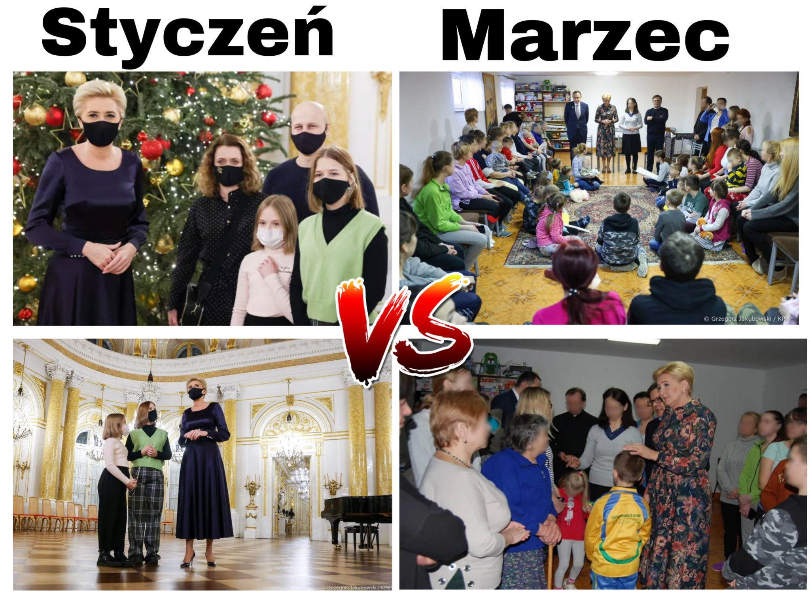
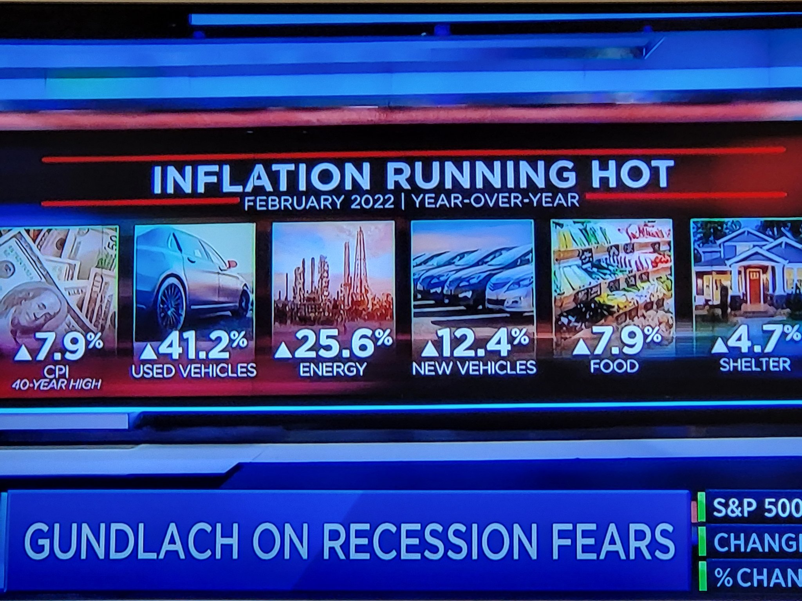
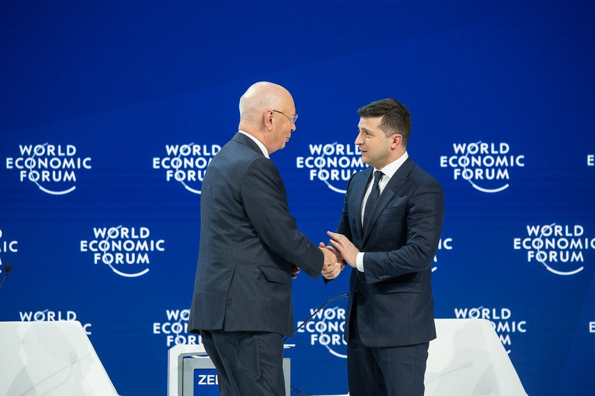
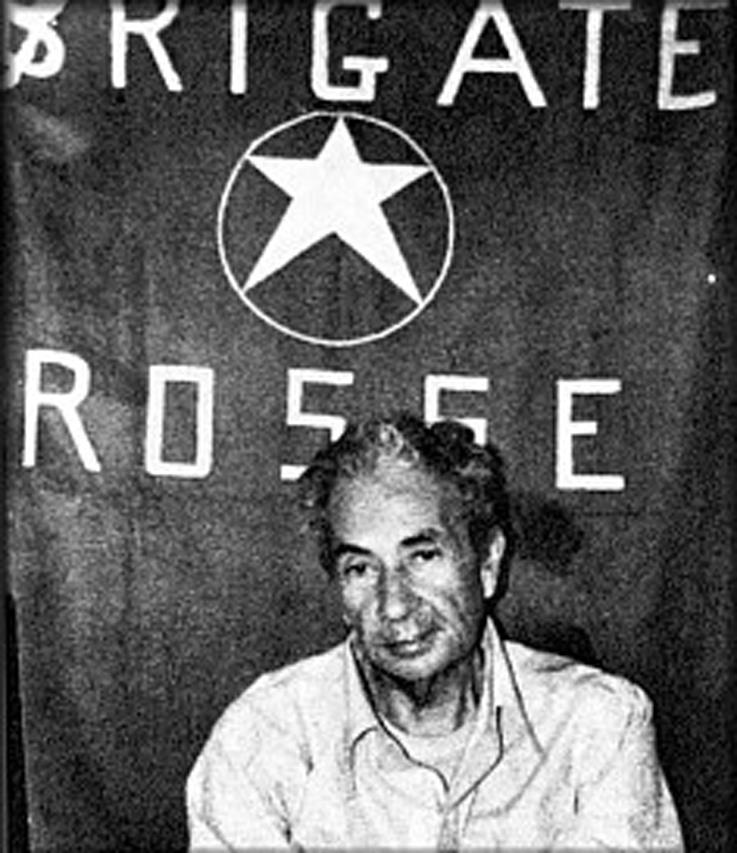
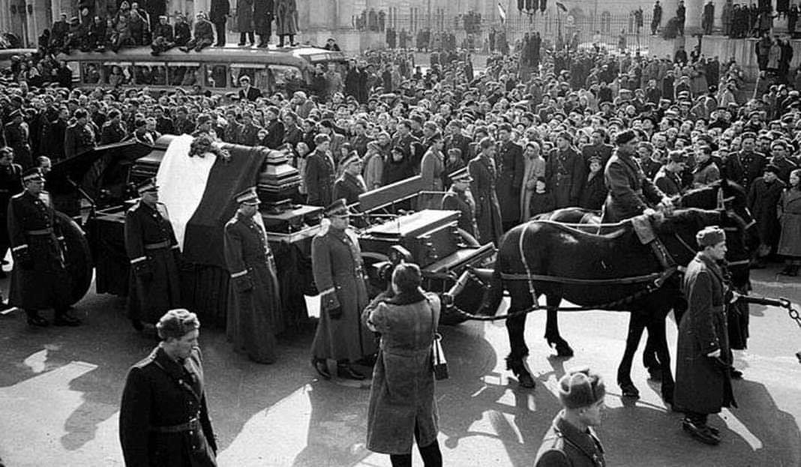
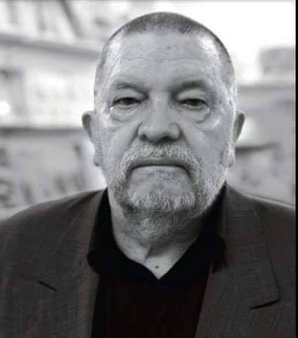

### 2022

> Fauci w rozmowie z szefem FB Zuckerbergiem przyznaje, że 'to nie byłby pierwszy raz gdyby okazało się, że szczepionka, która wydawała się być bezpieczna w początkowych badaniach faktycznie pogarszałaby stan osób, które ją przyjęły.

<video width="640" height="480" controls>
<source src="./movies/march/fauci.mp4" type="video/mp4">
Your browser does not support the video tag.
</video>

---

  

---

  

---

Polska za prezydentury Putina w Rosji zapłaciła blisko 800mld dolarów za surowce.

---

  

---

### 2020

Ciekawa sprawa - NBP uruchomił pierwszy w historii QE. Interesująca decyzja - krótkoterminowo widzę tu wsparcie dla kursu PZU i spadające dochody spółki w dłuższym terminie. Gorsze wieści dla sektora bankowego. Biorąc pod uwagę udział tego drugiego w WIG20, powiedziałbym, że przynajmniej krótkoterminowo NBP dorzucił kolejny argument dla pogłębienia dołków na polskiej giełdzie.
Bankowości będzie ciążyć bo w ogólności banki zarabiają na spreadzie między depo a pożyczkami. Im niższe stopy, tym niższy spread (część odsetek jest ustalana np. jako max mnożnik stopy lombardowej). I teraz niskie max % kredytów nie zawsze pozwala na zrównoważenie wyższej szkodowości portfela. O ile mnie pamięć nie myli, to optymalne są stopy w wysokości ok 5%. W takich sytuacjach odsetki nie powodują znacząco wyższych problemów ze spłatami ale jednocześnie pozwalają odpowiednio kształtować spready plu zachęcają część społeczeństwa do oszczędzania ale jednocześnie pozwalają (wręcz zmuszają) do tworzenia w miarę sensownych produktów bankowych - BSZ

### 1978

W centrum Rzymu terroryści z organizacji Czerwone Brygady porwali byłego premiera Włoch Aldo Moro.
Zostawcie mnie! Czego chcecie?! - krzyczał pięciokrotny premier Włoch, gdy napastnicy z Czerwonych Brygad wpychali go do swego auta. Aldo Moro został porwany w biały dzień na rzymskiej ulicy, gdy jechał do parlamentu na głosowanie nad wotum zaufania dla rządu Giulio Andreottiego - podczas porwania zginęło pięć osób, kierowca Moro i jego ochroniarze. Gehenna polityka chrześcijańskiej demokracji i zwolennika porozumienia z włoskimi komunistami trwała 55 dni, do 9 maja, gdy jego ciało zostało odnalezione w czerwonym renault. Porwanie i zabójstwo Moro było szczytowym osiągnięciem lewackich terrorystów, którzy podobnie jak ich zachodnioniemieccy koledzy z Frakcji Czerwonej Armii wypowiedzieli wojnę państwu, starając się za pomocą terroru rzucić je na kolana i doprowadzić do rewolucji.

  

### 1956

W Warszawie odbyły się uroczystości pogrzebowe zmarłego cztery dni wcześniej podczas wizyty w Moskwie I sekretarza Komitetu Centralnego Polskiej Zjednoczonej Partii Robotniczej Bolesława Bieruta.
Pogrzeb wieńczył trwającą trzy dni żałobę narodową. Dzień ten był również dniem wolnym od pracy.
Uroczystość miała dosyć spektakularny przebieg. Już o godzinie siódmej rano zamknięty został dla publiczności gmach KC PZPR, w którym wystawiona była trumna z ciałem Bieruta. Trzy godziny później szpaler towarzyszący prezydentowi w ostatniej drodze przeszedł Alejami Jerozolimski na położony przed Pałacem Kultury i Nauki Plac Stalina. Tam trumna została ustawiona na bardzo wysokim katafalku i pokryta czerwonym płótnem. O godzinie 11 rozległ się sygnał syren alarmowych. Na koniec kondukt przeszedł na Cmentarz na Powązkach.
Tak o śmierci Bieruta pisał Jan Józef Szczepański:
"„Podano wiadomość, że wczoraj wieczorem w Moskwie umarł Bierut. […] Charakterystyczna reakcja społeczeństwa: trochę lekceważących uśmieszków, ale na ogół absolutna obojętność. Nawet dla nienawiści to był ktoś zbyt obcy. Kiedy umierał Piłsudski, naród przeżywał to jako wielkie wydarzenie. Ci, co go nienawidzili, też przeżywali to jako moment dziejowy. Tu widzi się wyraźniej niż przy jakiejkolwiek innej okazji, że nie było żadnej więzi. Że to sprawa nie nasza. Śmierć funkcjonariusza”.

  

### 1930

W Warszawie urodził się Krzysztof Kąkolewski - jeden z najważniejszych polskich przedstawicieli literatury faktu, znany z poruszania tematów bulwersujących i kontrowersyjnych, zaliczany do tzw. złotej trójki polskiego reportażu. Popularność zapewnił Kąkolewskiemu zbiór wywiadów ze zbrodniarzami hitlerowskimi pt. ,,Co u pana słychać?''
Książka doczekała się sztuki teatralnej oraz ekranizacji w formie spektaklu telewizyjnego. ,,Diament odnaleziony w popiele'', opublikowany w 1995 roku, demistyfikuje ubecką manipulację stojącą za znaną powieścią Popiół i diament Jerzego Andrzejewskiego. Zaliczana do klasyki polskiego reportażu książka ,,Jak umierają nieśmiertelni'', z dnia na dzień osiągnęła status kultowej, zdradzając m.in. kulisy mordu dokonanego przez Charlesa Mansona w willi Polańskich. W 2010 roku ukazała się książka ,,Popiełuszko. Będziesz ukrzyżowany'', w której autor w oparciu o zabójstwo ks. Jerzego Popiełuszki ujawnia bezwzględną grę tajnych służb komunistycznych. Kąkolewski był również autorem powieści m.in. ,,W złą godzinę'', ,,Sygnet z Jastrzębcem'', ,,Paradis'' czy ,,Mięso papugi''. Dał się poznać jako autor kryminałów, ze ,,Zbrodniarzem, który ukradł zbrodnię'' oraz ,,Reporterem kryminalnym'' na czele. Powszechnie uznawany jest za mistrza reportażu oraz specjalistę od estetyki faktu. Wykładał na Wydziale Dziennikarstwa i Nauk Politycznych Uniwersytetu Warszawskiego. W 2008 roku został uhonorowany przez Stowarzyszenie Dziennikarzy Polskich prestiżową nagrodą ,,Dziennikarski Laur'' za stworzenie niedoścignionego wzorca literatury faktu.
Krzysztof Kąkolewski zmarł 24 maja 2015 roku w Warszawie.

  

---

<a href="https://github.com/TomaszWaszczyk/historia.waszczyk.com/edit/master/src/content/march-16.md" target="_blank">Edytuj tę stronę dzieląc się własnymi notatkami!</a>
