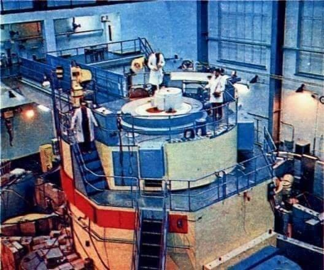

### 2020

To jedna z najgorszych wiadomości od 1989 roku. Bank centralny  obniżając siłę nabywczą pieniądza, co sprowadza się de facto do obłożenia naszych pieniędzy haraczem nie tylko robi nam krzywdę, dodatkowo kreuje pieniądze z powietrza, czyli podnosi inflację. Powoływanie się na inne banki centralne jest to jakąś żałosną ironią. Gołym okiem widać skutki procederu dodruku pieniądza przez FED w USA. Wczoraj giełda miała rekordowym spadek, a właściwie krach. W ciągu 3 ostatnich tygodni Wall Street straciła więcej niż zyskała w ciągu ostatnich trzech latach pompowania płynności (bańki spekulacyjnej) przy pomocy drukowania pieniędzy. Poza tym upodabnianie się polskiego banku centralnego do innych takich banków w innych krajach powinno być poprzedzone upodabnianiem się polskiej gospodarki, prawa, zasobów, pieniądza, tradycji i innymi cechami. Sam bank centralny to nie wszystko, tym bardziej że rząd  zamiast dbać o naród i gospodarkę, dba o banki, co się odbywa kosztem obniżenia poziomu naszego życia. 17 marca 2020 roku skończył się w Polsce wolny rynek i wrócił socjalizm. 
Jan Fijor

---

Polskie QE

W najbliższych dniach zapewne zobaczymy duże przetargi obligacji SP. Skupi to NBP na rynku wtórnym poprzez pośrednika BGK i PKO. Jeśli rząd zdecyduje się dobić do poziomu 55% długu do PKB to w grę wchodzi kwota 200 mld PLN.

Dodatkowo NBP będzie oferować REPO polskim bankom - a tutaj kwota jest chyba nieograniczona, byle tylko bank był w stanie położyć obligacje jako zabezpieczenie. A obligacji nie braknie ;)

Tak wiec nie powinno być problemów z płynnością w systemie bankowym. Niestety wzrośnie dług publiczny dość skokowo. Ale tym będziemy się przejmować jak już pandemia przygasnie.

Jacek Maliszewski

### 1963

W Instytucie Badań Jądrowych w Świerku uruchomiony został polski reaktor jądrowy "Anna". Posiadał on moc cieplną 10 Kw. Wyposażony był też we własny system chłodzenia i sterownię.
Była to całkowicie polska konstrukcja.
"Anna" została wyłączona w 1980 roku.

  

### 1944

W piecu krematorium KL Auschwitz Niemcy spalili Helenę Płotnicką (zdjęcie) łączniczkę Batalionów Chłopskich i Armii Krajowej, byłą salową szpitala w Oświęcimiu, jedną z głównych konspiratorek w KL Auschwitz, gdzie pierwszy raz trafiła wiosną 1942 roku. Przez sześć tygodni przetrzymywano ją w przyobozowej izolatce. Po wypuszczeniu na wolność podjęła kontakt z więźniami oświęcimskimi, przekazywała im żywność, lekarstwa i korespondencję oraz odbierała listy i meldunki z obozu. W maju 1943 roku, na skutek denuncjacji przełożonego (kapo) więźniów z grupy (komando) mierników, pracujących przy przeprowadzaniu pomiarów poza obozem, z którymi P. utrzymywała kontakt- Polaka Stanisława Dorosiewicza. Ponownie, razem z córką trafiła do Auschwitz. Otrzymała numer 65492.  Córkę zwolniono po kilku tygodniach. Poddawana przeróżnym torturom nigdy nie wydała żadnego ze swoich współpracowników.  Miała niespełna 42 lata.
Wspomina Władysław Lewkowicz:
"Helenę Płotnicką, matkę rodziny nakryli Niemcy. Nie wydała nas, nic nie powiedziała. Kiedy wieźli ją do krematorium, jeden z kolegów położył jej na piersi namalowany kwiatek. To był nasz dar wdzięczności."

  

---

<a href="https://github.com/TomaszWaszczyk/historia.waszczyk.com/edit/master/src/content/march-7.md" target="_blank">Edytuj tę stronę dzieląc się własnymi notatkami!</a>
