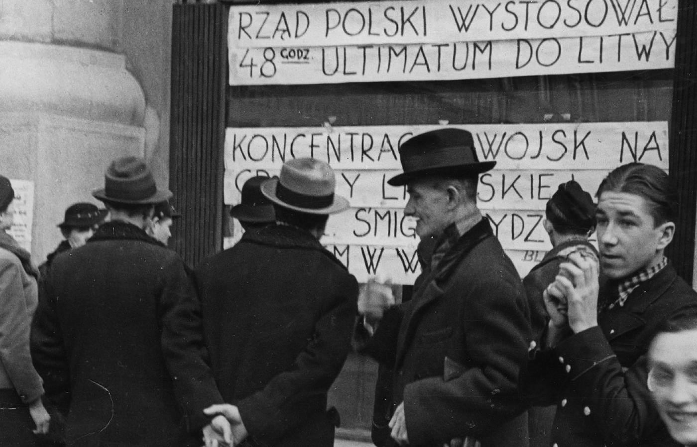

### 2021

> Tarnowskie Góry. Zamykają urologię i chirurgię. Będą leczyć COVID. „Przyszedł nakaz”

### 2020

- W USA zapowiedzieli pieniądze z helikoptera dla wszystkich

- Polska RPP zapowiedziała skup obligacji z rynku

- Merkel powiedziała, że można rozważyć emisję wspólnego długu strefy euro

---

To jedna z najgorszych wiadomości od 1989 roku. Bank centralny  obniżając siłę nabywczą pieniądza, co sprowadza się de facto do obłożenia naszych pieniędzy haraczem nie tylko robi nam krzywdę, dodatkowo kreuje pieniądze z powietrza, czyli podnosi inflację. Powoływanie się na inne banki centralne jest to jakąś żałosną ironią. Gołym okiem widać skutki procederu dodruku pieniądza przez FED w USA. Wczoraj giełda miała rekordowym spadek, a właściwie krach. W ciągu 3 ostatnich tygodni Wall Street straciła więcej niż zyskała w ciągu ostatnich trzech latach pompowania płynności (bańki spekulacyjnej) przy pomocy drukowania pieniędzy. Poza tym upodabnianie się polskiego banku centralnego do innych takich banków w innych krajach powinno być poprzedzone upodabnianiem się polskiej gospodarki, prawa, zasobów, pieniądza, tradycji i innymi cechami. Sam bank centralny to nie wszystko, tym bardziej że rząd  zamiast dbać o naród i gospodarkę, dba o banki, co się odbywa kosztem obniżenia poziomu naszego życia. 17 marca 2020 roku skończył się w Polsce wolny rynek i wrócił socjalizm.
Jan Fijor

---

Polskie QE

W najbliższych dniach zapewne zobaczymy duże przetargi obligacji SP. Skupi to NBP na rynku wtórnym poprzez pośrednika BGK i PKO. Jeśli rząd zdecyduje się dobić do poziomu 55% długu do PKB to w grę wchodzi kwota 200 mld PLN.

Dodatkowo NBP będzie oferować REPO polskim bankom - a tutaj kwota jest chyba nieograniczona, byle tylko bank był w stanie położyć obligacje jako zabezpieczenie. A obligacji nie braknie ;)

Tak wiec nie powinno być problemów z płynnością w systemie bankowym. Niestety wzrośnie dług publiczny dość skokowo. Ale tym będziemy się przejmować jak już pandemia przygasnie.

Jacek Maliszewski

### 1963

W Instytucie Badań Jądrowych w Świerku uruchomiony został polski reaktor jądrowy "Anna". Posiadał on moc cieplną 10 Kw. Wyposażony był też we własny system chłodzenia i sterownię.
Była to całkowicie polska konstrukcja.
"Anna" została wyłączona w 1980 roku.

  

### 1944

W piecu krematorium KL Auschwitz Niemcy spalili Helenę Płotnicką (zdjęcie) łączniczkę Batalionów Chłopskich i Armii Krajowej, byłą salową szpitala w Oświęcimiu, jedną z głównych konspiratorek w KL Auschwitz, gdzie pierwszy raz trafiła wiosną 1942 roku. Przez sześć tygodni przetrzymywano ją w przyobozowej izolatce. Po wypuszczeniu na wolność podjęła kontakt z więźniami oświęcimskimi, przekazywała im żywność, lekarstwa i korespondencję oraz odbierała listy i meldunki z obozu. W maju 1943 roku, na skutek denuncjacji przełożonego (kapo) więźniów z grupy (komando) mierników, pracujących przy przeprowadzaniu pomiarów poza obozem, z którymi P. utrzymywała kontakt- Polaka Stanisława Dorosiewicza. Ponownie, razem z córką trafiła do Auschwitz. Otrzymała numer 65492.  Córkę zwolniono po kilku tygodniach. Poddawana przeróżnym torturom nigdy nie wydała żadnego ze swoich współpracowników.  Miała niespełna 42 lata.
Wspomina Władysław Lewkowicz:
"Helenę Płotnicką, matkę rodziny nakryli Niemcy. Nie wydała nas, nic nie powiedziała. Kiedy wieźli ją do krematorium, jeden z kolegów położył jej na piersi namalowany kwiatek. To był nasz dar wdzięczności."

  

### 1938

W wyniku incydentów granicznych i śmierci 11 marca żołnierza KOP Stanisława Serafina zostało wystosowane polskie ultimatum wobec Litwy z żądaniem natychmiastowego nawiązania stosunków dyplomatycznych.
W Tallinnie, stolicy Estonii, poseł polski Wacław Przesmycki wręczył posłowi litewskiemu Broniusowi Dailide ultimatum, w którym Polska żądała od Litwy nawiązania w ciągu 48 godzin stosunków dyplomatycznych. W razie odmowy miało dojść do interwencji zbrojnej. Pretekstem wywarcia nacisku na Kowno było zastrzelenie żołnierza Korpusu Ochrony Pogranicza, ścigającego mężczyznę próbującego nielegalnie przekroczyć granicę. Według polskiej dyplomacji był to skutek nieuregulowania sytuacji między państwami. Dwa dni później rząd i litewski Sejm pod naciskiem Anglii, Francji, Niemiec i ZSRR przyjęły ultimatum. Nawiązana została łączność telekomunikacyjna i pocztowa oraz ustanowieni posłowie.

  

### 1922

W Warszawie podpisano porozumienie pomiędzy Polską, Łotwą, Estonią i Finlandią w sprawie utworzenia Związku Bałtyckiego (do czego nie doszło z powodu odmowy ratyfikacji umowy przez fiński parlament pod wpływem nacisków niemieckich). W konferencji odmówiła udziału Litwa tocząca z Polską spór o Wilno.
Na przełomie 1919 i 1920 roku Piłsudski miał już wypracowaną koncepcję stworzenia federacji niepodległych państw wschodnioeuropejskich, obejmującą Polskę, Ukrainę, Białoruś i kraje bałtyckie.
W instrukcji dla Leona Wasilewskiego, polskiego delegata na konferencję w Helsinkach, Komendant wspominał w koncepcji przeprowadzenia plebiscytu na terenach całego Wielkiego Księstwa Litewskiego. Zwracał też uwagę że ewentualna granica polsko-rosyjska powinna przebiegać w odległości 10-25 km od rzek granicznych, w taki sposób, aby była możliwość przygotowania obrony kraju. Widział konieczność przyłączenia do Polski powiatów kowelskiego, łuckiego i włodzimierskiego, natomiast w sprawie białoruskiej należało „robić precedensy i czekać odpowiedniej koniunktury, wytwarzając na razie w Polsce Piemont białoruski”. Najważniejszym problemem nurtującym Piłsudskiego była postawa Litwy, której antypolskie nastawienie komplikowało całą strategię. W tej sytuacji „należy – twierdził Naczelnik – traktować Litwę <per nogam>, objawiać wobec niej <negligeance>, bo jej politycy – to – albo durnie, albo sprzedajni. W ostateczności podbijemy ją.”
Równocześnie Piłsudski doszedł do wniosku, iż zbliża się najdogodniejszy moment do narzucenia Rosji siłą polskich warunków pokojowych. Wyczerpane – jak przypuszczał – po walkach z Denikinen oddziały bolszewickie nie będą w stanie przeciwstawić się armii polskiej. Ważnym zadanie było nawiązanie współpracy wojskowej z Łotwą Estonią oraz uzyskanie granicy polsko-łotewskiej. Taki rozwój sytuacji odcinał Litwę od kontaktów z Rosją oraz umożliwiał stworzenie jednolitego frontu od Zatoki Ryskiej aż po Ukrainę.
„Albo Polska, - pisał Adam Skwarczyński w końcu stycznia 1920 roku – na ogromnym tzw. Międzymorzu stojąc, musi być potężna, albo zakwestionowana jest racja jej bytu. Sami Międzymorza tego od morza Bałtyckiego po Czarne nie zajmiemy. Więc tylko zorganizowaną przez nas federacją, stanowiącą całość swym życiem gospodarczym, ustrojem politycznym i społecznym, i wspólnotą kultury wypełnić je możemy”. Ponieważ mocarstwa zachodnie były przeciwne polskim planom na wschodzie, Polska musiała sama je zrealizować.
Wobec wysuniętych przez Moskwę propozycji pokojowych, stanowiących – jak się potem okazało – jedynie zasłonę dymną dla własnych przygotowań wojennych, w MSZ zorganizowano w marciu 1920 roku konferencję, podczas której określono strategię negocjacyjną podczas rozmów z Sowietami. Polska „żądać będzie od Rosji dezanekcji i zrzeczenia się wszelkich praw do ziem leżących w granicach posiadania Polski w roku 1772. Utworzona zostanie nowa linia odpowiadająca wymaganiom strategicznym, ekonomicznym i administracyjnym, a leżąca pomiędzy obecną linią strategiczną i granicą z roku 1772. Będzie to minimalna granica wymagań Polski.” Polska sama określiłaby sposób porozumienia z mieszkającą na tych terenach ludnością. Przewidywano ścisłe współdziałanie z Łotwą w sprawach terytorialnych, oraz wsparcie dla utworzenia samodzielnego państwa ukraińskiego, przy czym określono jego zachodnią granicę na linii Zbrucza i Styru. Zrezygnowano natomiast, w porozumieniu z Piłsudskim, z realizacji koncepcji państwa białoruskiego na rzecz nadania mniejszości białoruskiej w okręgu mińskim koncesji samorządowych. Nie przewidywano takich ustępstw na Grodzieńszczyźnie i Wileńszczyźnie, co sankcjonowało fiasko prób porozumienia z Litwą.
Równocześnie rozpoczęto rozmowy z Rumunią na temat wspólnej polityki wobec Moskwy. Rumuni jednak nie zaakceptowali propozycji odpisania konwencji polsko-rumuńskiej, licząc, że samodzielnie uda im się rozwiązać problem uznania nowych granic. Ponadto Rumuni sceptycznie odnosili się do możliwości realnego wsparcia polskich zamiarów przez Petlurę, wręcz przestrzegali Polaków przed „zbytnim angażowaniem się politycznym z atamanem Petlurą lub sformowaniem Ukrainy w ogóle, póki ona swej żywotności okazać nie zdołała”.
Rozmowy z bolszewikami nie doszły do skutku, gdyż Moskwa nie zgodziła się na Borysów, jako miejsca rokowań, gdyż położony był na linii frontu. Dowodziło to ostatecznie, iż sowieckie propozycje pokojowe miały na celu jedynie zyskanie na czasie, by zakończyć koncentrację wojsk na froncie z Polską.
W tej sytuacji w prasie ukazało się szereg artykułów potwierdzających zasadność twardej polityki Piłsudskiego wobec Moskwy. „Pozostaje – pisano – siła wytrwania i moc charakteru, która pozwoliła nam przetrwać czasy najgorsze, i nie pozwoli nam opaść na duchu w chwili, w której zwycięstwo jest bliskie. Na rokowania pokojowe przyjdzie czas niezadługo. Ale przedtem muszą nasi wrogowie uznać w nas zwycięzców”. Jednocześnie podkreślano, iż Polska nie walczy z Rosją o nowe ziemie, ale pragnie realizacji programu federacyjnego, który umożliwi demokratyzację wschodniej Europy oraz zabezpieczenie Polski przed ponowną agresją. Podział ziem ukraińskich i białoruskich pomiędzy Polskę i Rosję pozwoliłby Moskwie przetrzymać najcięższe chwile i odrodzić swą potęgę.
Jednym z podstawowych warunków sukcesu przygotowywanej operacji kijowskiej było doprowadzenie do pełnej współpracy z Ukrainą na polskich warunkach. Ostatecznie w nocy z 21 na 22 kwietnia 1920 roku w Belwederze podpisano polsko-ukraińską umowę polityczną. Polacy przeforsowali granicę na Zbruczu, natomiast zobowiązali się do przekazania Ukraińcom ziem wywalczonych w przyszłości, a będących w przedrozbiorowych granicach Rzeczypospolitej. Uzupełnieniem tej umowy była podpisana 24 kwietnia konwencja wojskowa, która regulowała zasady współpracy między obu armiami w okresie walk z bolszewikami.
Krótko przed rozpoczęciem ofensywy ukazał się artykuł Mariana Uzdowskiego, zwracający uwagę na nowych sojuszników Polski – trzy niepodległe państwa kaukaskie. „Niewiele nas interesuje – pisał Uzdowski – fakt, że tam, o setki mil od nas, wśród dalekich gór Kaukazu, istnieją już przeszło od roku trzy rzeczpospolite: Azerbejdżan, Gruzja i Armenia”. Polska powinna wspierać wszelkie inicjatywy mające na celu rozluźnienie więzów łączących małe narody z Rosją. „ I jeżeli – kontynuował Uzdowski – praca już się rozpoczęła w stosunku do Łotwy, Estonii Finlandii, Ukrainy, jeżeli znajduje ona rezultaty w swoistym sojuszu wojskowym i ekonomicznym tych narodów z Polską, jeżeli załatwimy nasze sprawy z Litwą, która może stanąć na przeszkodzie co do stworzenia spoistego muru od wschodu – to powinniśmy uwagę swoją zwrócić na Kaukaz”. Stworzony w ten sposób system sojuszy miał szachować Rosję od północy (Finlandia), od południa (Kaukaz i Ukraina) oraz z zachodu (Polska, Łotwa, Litwa, Estonia). W kwietniu 1920 roku do państw kaukaskich pojechał z misją Tytus Filipowicz. Opracowano wstępne porozumienie, ale kres kontaktom położyła niespodziewana agresja bolszewików na te państwa.
Okazało się ostatecznie, iż jedynie Białorusini i Ukraińcy zaakceptowali polskie warunki, państwa bałtyckie przyjęły sowieckie propozycje rokowań pokojowych, a Rumunia i Finlandia także nie zamierzały angażować się w plany polskie. Tak więc rozpoczynając ofensywę kijowska, Piłsudski musiał liczyć przede wszystkim na własne siły. W prasie piłsudczykowskiej traktowano tę wyprawę jako drugi akt rozpoczęty w 1919 roku wyprawą wileńską. Po zajęciu Kijowa, Adam Skwarczyński pisał, że „w rękach polskich są dwa klucze do spraw dziejowych, które rozwijać się mają na obszarze olbrzymiego trójkąta Europy wschodniej. Jak Kijów jest kluczem południowo-wschodnim jego ramienia, tak Wilno stano klucz ramienia północno-zachodniego, obejmującego ziemie bałtyckie: Litwę, Łotwę, Estonię, Finlandię. Kto potrafi te dwa punkty zająć – kto je potrafi opanować nie tylko siłą oręża, ale także siłą idei i planu, obejmującego sprawy narodów, żyjących na tych olbrzymich obszarach – ten inicjatywę dziejów Europy Wschodniej ujmie w swoje ręce”.
W innym majowym artykule Skwarczyński podkreślał, że „wyzwolenie Ukrainy, wydarcie jej Rosji włącza ją tym samym w zarysowujący się już dziś systemat związku narodów Europy Wschodniej”. Związek, który zbuduje Polska, będzie budowlą „urzeczywistniającą marzenie wielkiego Amerykanina, Wilsona”. Będzie jednak czymś lepszym, ponieważ „Zachód, budując pomyślaną przezeń Ligę Narodów, uwikłał się w sprzeczności, bo usiłował pogodzić ideę wolnego związku ludów z tradycjami imperialistycznego <koncertu wielkich mocarstw> ze schyłku zeszłego i początku obecnego stulecia. Polska na wschodzie Europy wraz z narodami wolnymi od tych smutnych tradycji podejmuje dzieło, które dla Zachodu z czasem może stać się wzorem”.
Piłsudczykowscy publicyści podkreślali także, że koncepcja międzymorza była tworem naturalnym, wynikającym z uwarunkowań geopolitycznych, gdyż „ziemie położone między Morzem Czarnym a Bałtykiem stanowią kompleks naturalny, związany między sobą tak drogami komunikacyjnymi, lądowymi i rzecznymi, jak interesami politycznymi (wał między Rosją a Niemcami), a wreszcie i dotychczasowymi stosunkami”. Równocześnie zdawano sobie sprawę z ogromu zadań czekających Polskę, przewidując trudności w opanowaniu sytuacji wewnętrznej na Ukrainie. Jednak tylko w ten sposób Polska może stanąć w szeregu najsilniejszych państw Europy.
Pierwotne sukcesy Polski na Ukrainie wpłynęły korzystnie na stosunek Łotwy, która zaproponowała Warszawie wznowienie rokowań w sprawie konwencji wojskowej, politycznej i ekonomicznej. Również Rumuni gotowi byli do negocjacji, choć w dalszym ciągu uzależniali swoją politykę wschodnia od stanowiska Ententy. Z kolei w Finlandii rząd przychylny Warszawie, musiał się jednak liczyć z oporem korpusu oficerskiego, w którym dominowały nastroje proniemieckie. Zmiana sytuacji na froncie, po kontrofensywie sowieckiej, sprawiła, iż we wszystkich tych państwach ponownie przewagę osiągnęli przeciwnicy bliskiej współpracy z Warszawą.
Rozwój sytuacji na froncie ukraińskim zweryfikował pierwotne plany wycofania części polskich oddziałów i wykorzystania jednostek ukraińskich. Słabość sił ukraińskich wymusiła pozostawienie polskich jednostek. To zaś rodziło podejrzenia, co do szczerości polskich obietnic wobec Ukraińców. W tej sytuacji Marszałek pragnął mianować dowódcą wszystkich sił polskich na Ukrainie gen. Stanisława Szeptyckiego, którego brat – Andrzej, był metropolitą lwowskim obrządu wschodniego. Jednak właśnie tego powodu Szeptycki ostatecznie odmówił.
Kontrofensywa sowiecka i wyparcie polskich wojsk z Ukrainy i Białorusi nie zmieniło zapatrywań Marszałka, który jednak przekonał się, że osamotniona Polska nie będzie w stanie zrealizować ambitnego programu wschodniego. „Po wysłuchaniu panów – stwierdził Naczelnik na posiedzeniu Rady Obrony Państwa z 5 lipca 1920 roku – doszedłem do przekonania, że Polska musi się wyzbyć planów na Wschodzie, bo nie zdobędzie się na energię. A więc pozostaje pokój!”.
Kolejna zmiana sytuacji na froncie, związana z sierpniową ofensywą wojsk polskich, spowodowała przemianę nastrojów wśród polityków polskich. Piłsudski stanął przed problemem kontynuowania planów wschodnich. Nie wierząc w trwałość pokoju z bolszewikami, uważał po uporaniu się z wewnętrznymi problemami ponownie spróbują ataku na Polskę. Stąd jego postulat osiągnięcia linii tzw. niemieckich okopów z lat I wojny światowej, które częściowo zabezpieczały interesy strategiczne Polski.
Podpisanie preliminariów pokojowych w Rydze, pozostawienie Mińska po sowieckiej stronie granicy, a przede wszystkim uznanie mandatu popieranych przez bolszewików przedstawicieli komunistycznego „rządu” ukraińskiego, oznaczało faktyczną rezygnację z programu federacyjnego wobec ziem białoruskich i popierania idei niepodległej Ukrainy. Piłsudski nadal zamierzał, choćby w ograniczonej formie, wspierać działalność wojsk sojuszniczych walczących dotąd z bolszewikami u boku wojska polskiego. Być może chciał powrócić do idei federacyjnej w postaci trójkantonalnego Wielkiego Księstwa Litewskiego, w skład którego weszłyby Litwa Środkowa (zajęta przez gen. Żeligowskiego), Litwa Kowieńska i Białoruś (wspieranie oddziałów gen. Bułak-Bałachowicza). O istnieniu takich planów dowodzą częste rozmowy Naczelnika z Petlurą, Bułak-Bałachowiczem oraz przedstawicielami gen. Wrangla. Niestety, podejmowane przez jednostki sojusznicze próby kontynuowania działań zbrojnych przeciwko bolszewikom zakończyły się niepowodzeniem. W listopadzie 1920 roku większość tych jednostek została zmuszona do przekroczenia linii frontu i znalazła się w Polsce.
W przypadku Litwy, Piłsudski zadecydował o przeprowadzeniu akcji Żeligowskiego, to uważając spory polsko-litewskie za spory w łonie rodziny, zadbał, aby zakres działań przeciwko Litwinom był cały czas bardzo ograniczony. Gdy szef Sztabu Generalnego gen. Rozwadowski proponował zdecydowaną akcję przeciw wojskom litewskim, spotkał się z ostrą ripostą , „że Komendant nie pochodzi z Galicji Wschodniej i wskutek tego nie ma skłonności do wszczynania walk bratobójczych”. Prasa piłsudczykowska nadal popierała przeprowadzenie referendum na temat przyszłości Wileńszczyzny, widząc w nim okazję do uzyskania poparcia mieszkańców Wilna dla koncepcji federacyjnych oraz przekonania Litwinów do unii z Polską. Ostatecznie plany te legły w gruzach, gdy ludność Wilna jednoznacznie opowiedziała się za przyłączeniem okręgu do Polski.
Kwestia litewska a także brak uznania przez Polskę de jure państw bałtyckich, spowodował zahamowanie przygotowań do zawarcia wspólnego układu politycznego oraz konwencji wojskowej. Także Rumunia – zaangażowana w budowę Małej Ententy – nie była zainteresowana zacieśnieniem relacji z Polską. Ostatecznie jednak 3 marca 1921 roku podpisano polsko-rumuńska umowę polityczną i konwencję wojskową, jednak stratedzy polscy nie wyrażali się pochlebnie o możliwościach militarnych nowego sojusznika, a chwiejna polityka Bukaresztu osłabiała znaczenie przyjętych zobowiązań. W tej sytuacji najbardziej pożądane dla Polski było zawarcie sojuszu z państwami bałtyckimi. Porozumienie z państwami bałtyckimi powinno z kolei pomóc w negocjacjach z Kownem. Litwa zaś trwała – zdaniem Wasilewskiego - w „stanie wojny z Polską”, co powoduje zagrożenie uzyskania połączenia przez dwóch wrogich Polsce sąsiadów (Niemiec i Rosji). Z kolei Witold Kamieniecki zwracał uwagę na coraz większą aktywność sowiecką i niemiecką w państwach bałtyckich. Moskwa dążyła do politycznego izolowania Polski w regionie, przejawami tej polityki była propozycja utworzenia związku rosyjsko-bałtyckiego. Niemcy zaś starali się zdominować region przede wszystkim ekonomicznie.
Pod koniec 1921 roku pozycja Polski w krajach bałtyckich została jednak wzmocniona. Przyczyniło się to tego antysowieckie powstanie w Karelii oraz kryzys w rozmowach ekonomicznych Łotwy z Niemcami. Państwa bałtyckie zaprosiły Polskę do udziału w konferencji dotyczącej przygotowania i skoordynowania traktatów handlowych z Rosją Sowiecką. W tej sytuacji Warszawa rozpoczęła przygotowania do rozmów w sprawie podpisania konwencji wojskowej z Finlandią i Estonią.
Efektem tego zbliżenia była polsko-bałtycka konferencja w Warszawie w marcu 1922 roku zakończona podpisaniem układu, którego najważniejszy punkt mówił, iż „państwa reprezentowane na konferencji warszawskie oświadczają, że jeśli jedno z nich będzie napadnięte bez dania do tego powodu, zachowują one postawę życzliwą w stosunku do państwa napadniętego i natychmiast porozumiewają się ze sobą co środków, które trzeba przedsięwziąć”. Równocześnie poufne porozumienie zobowiązywało sygnatariuszy do koordynacji polityki wobec Rosji oraz współpracy sztabów generalnych. Wydawało się, że Polska uczyniła pierwszy krok na drodze do utworzenia związku bałtyckiego.
Układ polsko-bałtycki wywołał niepokój w Moskwie, która zaproponowała przyjęcie wspólnego protokołu, o uznaniu prawnym Rosji Sowieckiej, w zamian Sowieci uznali wszystkie zawarte z państwami bałtyckim i Polską układy pokojowe. Podpisanie tego protokołu przez przedstawiciela Polski doprowadziło do ostrego sprzeciwu Marszałka Piłsudskiego, w efekcie którego doszło wkrótce do zmiany szefa MSZ – Konstantego Skirmunta zastąpił Gabriel Narutowicz, zwolennik izolowania Rosji Sowieckiej.
Podpisanie w Rapallo układu niemiecko-sowieckiego sprawiło, iż w prasie piłsudczykowskiej z naciskiem podkreślano, że głównym zadaniem Polski jest przeciwdziałanie odbudowie silnej Rosji wspólnie z państwami wyzwolonymi i wyzwalającymi się z niewoli rosyjskiej. Postulowano skonsolidowanie różnych grup emigracji ukraińskiej, białoruskiej i gruzińskiej, aby mogły one w przyszłości ze sobą współdziałać.
Równocześnie sojusz polsko-bałtycki ponownie wszedł w fazę kryzysu - Finlandia ostatecznie nie ratyfikowała układu z marca 1922 roku, Łotwa zaś za wszelką cenę chciała włączyć do niego Litwę, skonfliktowaną z Polską w sprawie Wileńszczyzny.
Po utworzeniu w maju 1923 roku rządu Chjeno-Piasta, premier Witos nie przykładał większego znaczenia do kontynuowania polityki bałtyckiej. Wycofanie się Piłsudskiego z życia politycznego sprawiło, iż piłsudczycy utracili możliwość wpływania na polską politykę zagraniczną. Publicyści piłsudczykowscy krytykując nowy rząd podkreślali, że Polska przestała prowadzić aktywną politykę. Wedle Mariana Uzdowskiego Polska „coraz bardziej zatraca swoje znaczenie i charakter czynnika aktywnego, schodząc na stanowisko biernego obserwatora, którym można się od czasu do czasu posiłkować, ale z którego wolą i postulatami liczyć się zbytnio nie należy”.
Także rząd Władysława Grabskiego skoncentrowany na reformach ekonomicznych, nie prowadził aktywnej polityki zagranicznej. Piłsudczycy krytykując MSZ uważali, iż obecne elity polityczne nie angażują się w politykę bałtycką, ponieważ jest to koncepcja Piłsudskiego. Podkreślano, że Polska traci wpływy w tym regionie, ponieważ „polityką bałtycką interesuje się u nas kilka osób, interesują się nią poważnie; stronnictwa niektóre doskonale zdają sobie sprawę z ważności związku państw bałtyckich”. Równocześnie wyrażano nadzieję, że sprawa nie jest jeszcze ostatecznie przegrana i że „polityka bałtycka nie umarła, jeno śpi w letargu. Jeśli państwa bałtyckie chcą być niepodległe – muszą iść z Polską. Jeśli Polska chce zachować granice – musi zawrzeć związek z państwami bałtyckimi”. Krytyka posunięć MSZ zataczała coraz szersze kręgi i doprowadziła ostatecznie latem 1924 roku do dymisji ministra Zamoyskiego, którego następcą został Aleksander Skrzyński, który był zwolennikiem prowadzenia aktywnej polityki zagranicznej oraz z nieufnością podchodził do inicjatyw Kremla.
Poruszając problem stosunków panujących na kresach, zwracano uwagę, że polityka na kresach powinna być prowadzona w imię interesów państwa „jako mocarstwa, wpływającego czynnie na dalsze kształtowanie się stosunków wschodnioeuropejskich”. Wobec tego, iż Białorusini i Ukraińcy nadal zgłaszali aspiracje niepodległościowe, jeśli Warszawa nie będzie prowadziła zgodnej z ich oczekiwaniami polityki, oddadzą się pod opiekę Moskwy. W pierwszym wypadku Polska stanie się mocarstwem, w drugim rozpadnie się jak Austro-Węgry. Tadeusz Hołówko jesienią 1924 wzywał, aby zaspokoić potrzeby mniejszości narodowych na kresach, nadając tym terenom autonomię.
Jednak w 1925 roku koniunktura polityczna na wprowadzenie w życie koncepcji bloku państw bałtyckich pod przewodnictwem Polski jako uzupełnienia sojuszu polsko-rumuńskiego bezpowrotnie minęła. Równocześnie polska dyplomacja poniosła niezwykle istotną klęskę, gdy na mocy paktu reńskiego z 1925 roku osłabieniu uległ sojusz polsko-francuski. Podpisanie paktu reńskiego praktycznie usunęło na drugi plan kwestie polityki bałtyckiej. Zamierająca współpraca Polski z Finlandią, Łotwą i Estonią, zmierzająca do budowy sojuszu woskowo-politycznego, wobec wydarzeń w Europie Zachodniej straciła na znaczeniu. Piłsudczycy bowiem opierali swe koncepcje na założeniu, że granice zachodnie chronić będzie sojusz z Francja. To pozwalało skupić się Warszawie na ochronie granic wschodnich. Po układach w Locarno polskie granice zachodnie mogły zostać poddane rewizji. Stąd należało także zmienić założenia polityki zagranicznej. Także po zamachu majowym, Piłsudski musiał to uwzględnić w swoich koncepcjach politycznych i do aktywizacji polityki bałtyckiej już nie doszło.

  

### 1921

Na mocy konstytucji marcowej zlikwidowano stan szlachecki w Polsce. Rzeczpospolita od tamtego momentu nie uznaje przywilejów rodowych i stanowych. Pamiętajcie więc - hrabiowie, baronowie, szlachta i inne książątka w Polsce nie istnieją.

---

<a href="https://github.com/TomaszWaszczyk/historia.waszczyk.com/edit/master/src/content/march-17.md" target="_blank">Edytuj tę stronę dzieląc się własnymi notatkami!</a>
