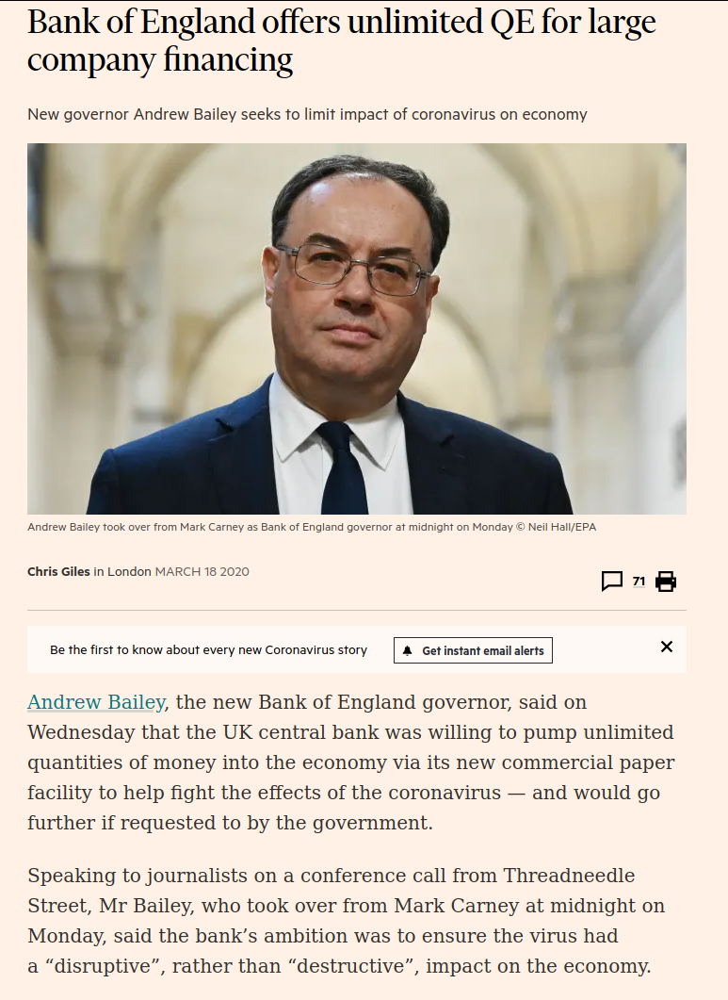
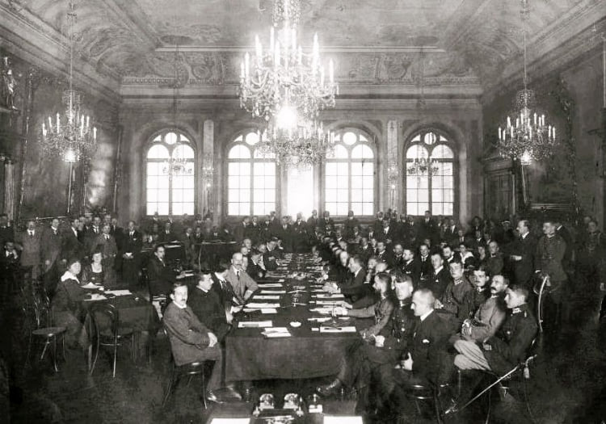
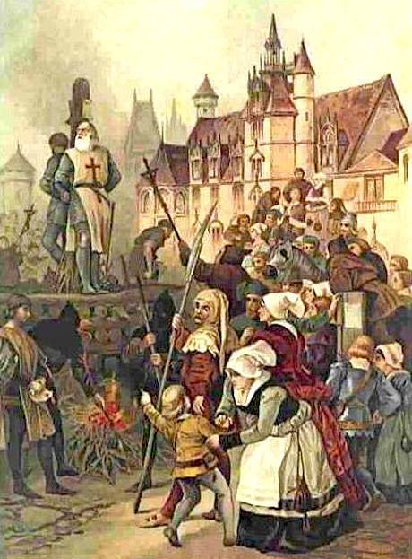

### 2020

  

---

Narodowy Bank Polski, ogłosił skup obligacji rządowych przez Bank Centralny.
Jak to było w przeszłości?
 To już drugi raz w naszej historii. Niestety nie mogłem tego pamiętać zbyt dobrze, natomiast w latach 90', mieliśmy bardzo podobną sytuację. W ten sposób doprowadzono do hiperinflacji, a następnie denominacji starego PLZ. 
W tym roku mija 25 lat od tamtych wydarzeń, z których nasz rząd jak widzimy, nie wyciągnął żadnych wniosków. Po raz kolejny ogłoszono wykup obligacji, co jest niczym innym, jak dodrukowaniem kolejnych, pustych złotówek.
"... Jeszcze ćwierć wieku temu Polak za butelkę oleju musiał zapłacić 17 500 zł, za kilogram szynki 128 000 zł, a za jajko 2 200 zł. Fakt, że mógł sobie na to pozwolić – przeciętna pensja w pierwszej połowie lat dziewięćdziesiątych XX w. wynosiła nad Wisłą 5 328 000 zł, byliśmy więc, „krajem milionerów”..."
Co to dla nas oznacza?
Prawdopodobnie już niebawem, pieniądze których używamy, mogą stracić znacząco na wartości. Jak wygląda życie podczas trwania hiperinfalcji można było zaobserwować ostatnio w Wenezueli, gdzie torbę Boliwarów (10 MLN) kupuję się za 15 dolarów amerykańskich.
Wniosek?
Zbiliżamy się do inflacji, która ponownie uczyni z nas milionerów... Może taki był zamysł partii rządącej i NBP, kiedy mówili "Dobra zmiana nadchodzi..."?

---

To znaczy – mówi się ciągle o inflacji. Sądzę, że na nie grozi inflacja, a galopująca inflacja. To jeszcze chwilę potrwa, ale inflacja będzie galopująca. Nieuchronnie. Dlatego, że przy takich wstrząsach społecznych, to jest zawsze wynik działania części podmiotów gospodarczych. Ja już nie mówię o hiperinflacji, jaka była po I wojnie światowej; w Niemczech zwłaszcza, ale w Polsce też, przez kilka lat, kiedy nosiło się w worku pieniądze, żeby kupić chleb. To są rzeczy, które zmieniają społeczeństwa. To znaczy, radykalnie zmieniają strukturę społeczną – jedni ludzie straszliwie tracą, jak na przykład przedsiębiorcy w niektórych dziedzinach. I mówię tu o średnich, nawet małych przedsiębiorstwach. A inni ludzie, którzy sprytnie wymyślili jakiś produkt, który akurat teraz będzie przydatny…

A mówi się, że historia lubi się powtarzać.

Ja uważam, że nie bardzo. To mechanizmy – one się powtarzają. Hiperinflacja jest rzeczą horrendalną. Zawsze opowiadam studentom historię obrazującą, na czym ona polega. Napisał ją Tomasz Mann – był rok 1919, rok po wojnie. Mann wyszedł z domu, żeby kupić sobie cygara. Na rogu była trafika – sklep tytoniowy. Cygara były po dwa miliony czterysta. Uznał, że to trochę drogo, więc przeszedł przez ulicę, do drugiej trafiki. Tam cygara były po dwa sześćset. Wobec tego wrócił do pierwszego sklepu, żeby kupić te po dwa czterysta, ale w nim cygara były już po dwa siedemset.

(Śmiech).

Na tym polega hiperinflacja. Ludzie dawnej zamożności wyprzedają pierścionki, mieszkania, domy. Nawiasem mówiąc, dostaję już teraz na swój komórkowy telefon ogłoszenia – to jest klasyczne nowe zachowanie dzisiaj – które brzmi: „Każde mieszkanie w siedem dni kupimy”. To są ci nowi ludzie, którzy dziś inwestują w mieszkania. Każde kupią, bo warto. W tej chwili, jak ktoś ma pieniądze, to tylko kupować ziemię, mieszkania, nie trzymać pieniędzy w banku, bo to nic nie da, a będzie nawet odwrotnie. Zmierzam do konkluzji – to jest kolosalna przemiana społeczna. Ledwieśmy przeżyli przemiany społeczne po 1989 roku, a tu nadchodzi kolejna, olbrzymia przemiana społeczna, w której jedni zostaną finansowo zmarginalizowani, a drudzy – tym razem nie ludzie zbędni, ale ludzie nowi – przejmą kontrolę nad gospodarką. Żadne zabiegi państwa tego nie pohamują całkowicie. Może trochę, ale nie ma cudów.

(...)

A co z ludźmi zbędnymi? Przy okazji, rozmawiałam wczoraj z przyjacielem na temat kwarantanny i tego, że tak wiele ludzi nie poszło do pracy. Powiedział, trochę sarkastycznie, a trochę żartobliwie, że w gruncie rzeczy ten moment, kiedy wszyscy siedzą w domach, na kwarantannie, pokazuje, jak bardzo ich praca jest niepotrzebna. No, bo mogą nie pracować i świat się nie wali. Więc może to lepiej, że siedzą w domu, bo może są tam bardziej pożyteczni? Za to najbardziej pożyteczni teraz prócz służby zdrowia to panie w Biedronce, czy innych spożywczakach.

Oczywiście, że jest w tym trochę racji, w szczególności, kiedy dotyczy administracji, która jest rozbudowana w sposób monstrualny. Zresztą Donald Tusk w rozmowie ze mną przyznawał się już do tego, że jedną porażkę poniósł, to znaczy nie dał rady biurokracji. Administracja za niego tylko się zwiększyła. A teraz zwiększyła się jeszcze znaczniej. Oczywiście, że zmniejszenie administracji do jednej czwartej na pewno jest zdrowe. Ale z drugiej strony, słyszę, rozpacz ludzi z moich okolic, panie z jednym, czy dwójką dzieci, które pracowały w lokalnej szwalni. Albo drukarni. Zarówno szwalnia, jak i drukarnia teraz stanęły. A jak można się domyślić, wiele z tych pań pracowało na czarno. No, bo to jest normalne w mniejszych okolicach, w małych miastach nie ma specjalnego nadzoru, wszyscy machają ręką. I one nie mają nic, żadnego ZUS-u, nic. No, chyba, że na dziecko. A zatem nie tylko artyści są biedni. Zgoda, są biedni. Ale biedne są także miliony ludzi, zatrudnione w miejscach, które są teraz zbędne. To potrwa jakiś czas.

(...)

To wszystko, o czym Pan mówi, pokazuje, że świat, jaki znamy, na naszych oczach pęka i się rozpada. Jeszcze parę miesięcy temu rozmawialiśmy o problemach klimatycznych, że nie uchronimy Ziemi przed katastrofą, a teraz okazuje się, że koniec świata przynosi wirus.

Dlatego nie można nigdy przewidywać, kiedy co się zdarzy. Ponieważ zachodzą okoliczności, które przyspieszają pewne procesy. Te procesy już się zaczęły, mówiliśmy o nich. Natomiast one ulegają teraz radykalnemu przyspieszeniu. Na to nie ma, moim zdaniem, żadnego wyjścia i żadnej rozsądnej odpowiedzi. Można oczywiście na bieżąco trochę o ludzi zadbać. Pilnować, żeby zatrudnienie minimalne było, skasować przedsiębiorcom ZUS na parę miesięcy – wprowadzić różne kroki, które chwilowo będą nieco pomagały ludziom, które są bez środków materialnych. Ale tylko tyle. Nikt w tej chwili nie zmieni gospodarki, bo nie jest to niczyim celem i nikt do tego nie ma głowy.

Ma Pan pomysł na to, jak żyć w czasach koronawirusa?

Trzeba więcej myśleć o sprawach duchowych. Wiem, że to jest nie takie proste, ale to jest jednak ważne. Nikt nie mówił w XIV czy XV wieku, że człowiek ma dążyć do szczęścia. Mówiło się, że pobyt na ziemi to jest padół łez.

I jeszcze trzeba było się umartwiać.

Właśnie. No, więc może dziś nie aż tak, ale trzeba zdać sobie sprawę z tego, że żyjemy w świecie, który nie jest koniecznie nam przyjazny. I w tym świecie będziemy musieli żyć. Warto z tego wyciągnąć wnioski; pomyśleć o sensie życia a wierzący – o sensie Boga. Może to trochę głupie rady, aby bardziej zająć się życiem duchowym, ale tak jest. Warto też zająć się stosunkami wzajemnymi, między ludźmi. Nawet miłość wymaga, żeby się o nią troszczyć i starać. Teraz ludzie siedzą z dziećmi w blokach, w małych mieszkaniach, to potrzebują ze sobą utrzymywać dobre stosunki. I odnaleźć w nich radość. Innymi słowy, trzeba skupić się na swojej postawie wobec świata i zastanowić się, co my robimy na tej ziemi. Nie bać się, nie roznosić fałszywych wiadomości, nie pisać, że psy i koty roznoszą koronawirusa – to mnie doprowadza do szału, bo to jest nieprawda. Zamiast zajmować się sensacjami, lepiej zająć się trochę sobą. Na ogół nie mamy na to czasu, a teraz – jest na to czas. Pomyślmy o sobie.

### 2019 - China performs first 5G-based remote surgery on human brain

A patient suffering from Parkinson's disease has received China's first 5G-based remote surgery with a deep brain stimulation (DBS) implant, according to local media.

Chinese PLA General Hospital (PLAGH), with the help of China Mobile and Huawei 5G technology, carried out the operation on Saturday.

Conducted by Ling Zhipei, chief physician of the First Medical Center of the Beijing-based PLAGH and Department of Neurosurgery of PLAGH's Hainan Hospital, the surgery lasted for about three hours.

Ling started the operation at 9:00 a.m. in Sanya City, manipulating the surgical instruments 3,000 kilometers away in Beijing with micron precision on a computer through a 5G network, and successfully implanted the DBS at the optimal target site.

"I feel good," said the patient after the surgery.

"I take turns working in Beijing and Hainan, and the operation took place during my Hainan rotation. A patient with Parkinson's in Beijing needed surgery and couldn't fly to Hainan," said Ling.

"The 5G network has solved problems like video lag and remote control delay experienced under the 4G network, ensuring a nearly real-time operation. And you barely feel that the patient is 3,000 kilometers away."

In the future, high-quality and high-level experts from superior hospitals will be able to operate remotely and directly on patients in remote areas through remote surgery, completing operations which were previously difficult to finish at the grassroots-level hospitals, Ling added.

### 2014

Władimir Putin podpisał traktat o przyjęciu Krymu i Sewastopola do Federacji Rosyjskiej.

### 2003 The Single Largest Bank Heist In History

The only thing worse than a bank heist around $1-billion (USD) is when the person in charge, not of the bank but of the country, commits that theft. Sad, but true; Saddam Hussein, working through his son, Qusay robbed the country’s central bank of the most money ever stolen from any bank.

  

That was just one day before US troops rolled into Baghdad. It’s like he knew the end was nigh.

The total aftermath of the Iraq war is beyond the scope of this blog, but what unfolded during and after the Central Bank robbery is a sad commentary on what was already sad situation.

The craziest thing about the story is that it all went down without a single bullet. They didn’t even need guns to take the money, just the trucks to carry the loot.

In the years that followed the war, money turned up in many places. There was $650-million found in one of Saddam’s palaces.

At the time, officials were unable to determine if that money was part of the billion stolen from the Central Bank. It turned out to be the stash of Saddam’s other son, Uday.

Saddam was of course never going to admit to any theft, nor was he going to cough up any information to help officials trace the missing dough. We will never know, nor will we know exactly how much they took or where it went.

There is a reason to believe that some of it at least, found its way into the hands of US soldiers. Cash discovered in another of Saddam’s palaces also vanished; looted by opportunistic soldiers. The United States convicted over 30 of our service members for theft.

The Central Bank of Iraq looks like a fortress. When the Iraqis took full control of their national finances, after the British handed it over in 1931, they created the National Bank of Iraq to centralize the country’s money.

In 1985 they built the central bank structure in Baghdad, a cube-shaped building made of concrete with almost no windows.

Management of the bank may have been questionable and corrupt, but the building where they kept the cash was impenetrable. The only way a robber could get in was through the front door.

That’s exactly what the thieves did.

They before US troops rolled into Baghdad, three large trucks pulled up in front of the bank. Qusay walked into the bank, then handed a note to the governor of the bank. The note was from daddy. It stated that they needed to relocate the money as a matter of national security.

It didn’t matter. The note could have said, “give it to me.” When the insane leader of a developing nation asks to empty the national vault, it’s because he’s having a good hair day.

Qusay and a friend loaded bag after bag into the three trucks. They left with one-quarter of the bank’s reserves that day without lifting a gun or making a single threat.

Like most bank thieves, they didn’t get away with it. Qusay and Uday paid the most precious price for their roles in Iraq; their lives. So did Saddam. Of course, the heist didn’t have to do with any of that, unless you believe in karma.

### 1921

W Rydze został podpisany traktat pokojowy między II Rzeczpospolitą Polską a Rosyjską Federacyjną Socjalistyczną Republiką Sowiecką i Ukraińską Socjalistyczną Republiką Sowiecką. To wydarzenie przeszło do historii jako traktat ryski.
Traktat ryski został nazwany ,,hańbą ryską". Był to jeden z najczarniejszych i najbardziej haniebnych dni w dziejach naszego państwa. Powinien zostać ogłoszonym dniem żałoby narodowej. W jej wyniku 1,5 miliona rodaków zostawiono na pastwę bolszewizmu. W Rydze reprezentowali nas przedstawiciele partii politycznych: Jan Dąbski z PSL-u, endek Stanisław Grabski-brat Władysława Grabskiego, socjalista Norbert Barlicki i inni. Byli negatywnie nastawieni do planów federacyjnych Marszałka Piłsudskiego, starali się aby Polska zabrała jak najmniej ziem zamieszkanych przez ludność niepolską. Natomiast delegacja bolszewicka z Adolfem Joffem na czele dążyli do pokoju nawet za cenę start terytorialnych. Chcheli nawet oddać Mińsk oraz Kamieniec Podolski, jednak polska delegacja odrzuciła ofertę. Co ciekawe rozmowy odbywały się w chwili,kiedy wojska polskie kotrolowały wyżej wymienione miasta.

Traktat ryski został ratyfikowany przez polski Sejm 16 kwietnia 1921 r. W trakcie debaty sejmowej doszło do dramatycznego wydarzenia. Z galerii posypały się ulotki z protestem przeciwko pokojowi z bolszewikami i rozległ się rozpaczliwy okrzyk: „Kainie, Grabski!”. Mężczyznę, który dokonał tego czynu, siłą usunięto z galerii. W nielicznych gazetach, które raczyły zauważyć i odnotować ten rozpaczliwy akt sprzeciwu obywatelskiego, ukazały się niewielkie wzmianki o „niesmacznym incydencie”. Człowiekiem, który rozrzucił ulotki, był Adam Grabowski- wnuk Tadeusza Rejtana. Tego samego, który w 1773 r. próbował własną piersią powstrzymać zdrajców podpisujących pierwszy rozbiór Polski.
Historia lubi się powtarzać. Polecam książkę pana Piotra Zychowicza ,,Pakit Piłsudski-Lenin".

  

### 1314

W Paryżu spłonęli na stosie przełożeni zakonu templariuszy, w tym jego ostatni wielki mistrz Jakub de Molay.
Dokładnie 18 marca 1314 roku na stosie w Paryżu spłonął ostatni wielki mistrz templariuszy Jakub de Molay. Wyrok śmierci wykonano po siedmioletnim śledztwie, w którym zakon oskarżono o herezję, praktykowanie czarów, bluźnierstwa, sodomię i demoniczne rytuały. Wielki mistrz, podczas śledztwa - w którym podobnie jak większość jego współbraci poddano go torturom- przyznał się do winy, ale przed śmiercią publicznie odwołał swoje zeznania. Z rozkazu króla Francji Filipa Pięknego - spłonął na stosie. Jednak jak głosi legenda nim poniósł śmierć zdołał wygłosić doniosłe wezwanie:
Papieżu Klemensie, rycerzu Wilhelmie, królu Filipie - zanim rok minie powołuję was na sąd Boży po sprawiedliwą karę. Przeklęci! Aż po trzynaste pokolenie waszego rodu.
Klątwa została skierowana do trzech sprawców upadku zakonu: Króla Francji, papieża Klemensa V i Wilhelma de Nogaret, królewskiego ministra odpowiedzialnego za przeprowadzenie procesu.
Wszyscy trzej przed upływem roku zmarli gwałtowną śmiercią. Papież najprawdopodobniej na dezynterię, król po upadku z konia lub wyniku wylewu krwi do mózgu, minister - od trucizny.
Tak przynajmniej głosi legenda. W przypadku faktów sprzed 700 lat trudno bowiem nieraz oddzielić rzeczywistość od wyobraźni kronikarzy.
W przypadku sprawy templariuszy znaczy to, że o ile daty śmierci papieża i króla są stosunkowo pewne, to śmierć Wilhelma de Nogaret najprawdopodobniej nastąpiła jeszcze w 1313 roku (Choć - różne źródła różne podaję daty. )
Tak czy owak, pewne jest, że spadkobiercom Filipa nie dane było zaznać szczęścia i pokoju. Wszyscy zmarli przedwcześnie, a Francja w wyniku komplikacji sukcesyjnych uwikłała się w wojnę stuletnią z Anglią.
Wciąż nie jest do końca pewne dlaczego templariusze musieli zginąć. Najczęściej przyjmuje się teorię, że ich zguba podyktowana była chęcią zagarnięcia majątku, przez zadłużonego króla.
Czyli, że Filip Piękny dokonał podobnego manewru, co 200 lat później Henryk VIII - i doprowadził do kasacji zakonu, by umorzyć swoje długi, a zarazem zasilić królewski skarbiec. Co zresztą nie do końca się udało. A mitycznego skarbu templariuszy niektórzy szukają do dziś.
Oddzielną kwestią jest to, że - jak zwracają uwagę niektórzy historycy- tak cyniczna i bezwzględna rozprawa z templariuszami nie do końca pasuje do psychologicznego wizerunku Filipa Pięknego. Czyżby więc król faktycznie uwierzył w stawiane zakonnikom zarzuty?
W świetle stosunkowo niedawno odkrytych w watykańskich archiwach dokumentów, znacznie mniej jednoznaczna jest też rola Klemensa V w całym przedsięwzięciu. W 2007 roku Watykan ujawnił notatki z niezależnego śledztwa przeprowadzonego przez papieża , który znacznie łagodniej niż śledczy francuscy ocenia zakonne praktyki (choć w istocie potwierdza część zarzucanych zgromadzeniu czynów). Na podstawie zgromadzonych materiałów papież Klemens doszedł do wniosku, że templariusze grzeszyli czynami, ale nie sercem i że:
ponieważ pokornie poprosili o przebaczenie Kościoła za te winy, błagając o dobrodziejstwo uniewinnienia, dekretujemy, by byli uniewinnieni przez Kościół, by byli zrehabilitowani w komunii Kościoła katolickiego i by mogli przyjmować sakramenty chrześcijańskie.
W efekcie papież nie ogłosił templariuszy heretykami, choć w 1312 r wydal dekret o rozwiązaniu zakonu. (Trzeba pamiętać, że rezydował w Awinionie i był w tym czasie zależny od Filipa Pięknego. Tron Piotrowy zawdzięczał w znacznej mierze ingerencji króla w konklawe, a miał też niewątpliwie w pamięci los jednego ze swoich poprzedników, którego Filip najpierw obalił, a potem jego zwłoki kazał wykopać z grobu i spalić - jako szczątki heretyka).
Ostatecznie wyrok na czterech najwyższych dostojników zakonu wydał nie papież, którego jurysdykcji podlegał zakon, ale związani z królem kardynałowie. Pierwotnie zostali skazani na dożywocie. Gdy jednak Jakub z Molay i Gotfryd z Charnay cofnęli obciążające ich i zakon zeznania, zostali spaleni - z rozkazu króla.
To, że templariusze padli ofiarami spisku, czy jak kto woli politycznej intrygi - wydaje się bezsporne. By zrozumieć jak wstrząsające było to wydarzenie- trzeba mieć świadomość jak wielką potęgę stanowił zakon w średniowiecznej Europie. Posiadając siły zbrojne, pieniądze, ziemie w większości krajów,i przychylność papieża - był siłą, która śmiało mogła rywalizować z najpotężniejszymi władcami, mógł zbudować "nowy świat". Ale czy miał takie plany?
Niezależnie od tego, część badaczy, zwłaszcza po ujawnieniu watykańskich dokumentów skłania się ku tezie, że nie wszystkie bulwersujące oskarżenia wobec templariuszy były kompletnie wyssane z palca, jak sądzono przez wiele lat. Choć oczywiście część z nich wyolbrzymiono i przeinterpretowano na potrzeby "królewskiego" procesu.
I tak np. przypisywanie im praktykowania homoseksualizmu na podstawie herbu z pieczęci, przedstawiającego dwóch zakonników na jednym koniu - jest ewidentnym nieporozumieniem.
Choć historycy spierają się, czy miał on symbolizować ubóstwo, czy też przypominać, że jeździec łączy w sobie dwa wcielenia - zakonnika i rycerza - to jednak niemal na pewno nie ma w nim podtekstów seksualnych. Zresztą spośród setek poddanych śledztwu rycerzy, do sodomii przyznało się tylko sześciu.
Z drugiej strony jak pisze Maurice Duron w przypisach do pierwszego tomu sagi "Królowie przeklęci" opartej właśnie na micie klątwy Jakuba de Molay -
Nie ulega wątpliwości, że istniały w zakonie dość znaczne odchylenia od natury dogmatycznej. Długi pobyt na wschodzie zbliżył ich do pewnych - wciąż istniejących obrządków pierwotnej religii chrześcijańskiej, do islamu, który zwalczali a nawet do ezoterycznych tradycji starożytnego Egiptu.
Właśnie na tle ceremonii inicjacji (...) powstało oskarżenie o oddawanie czci bożkom, o praktyki diabelskie i czary.
Ta bulwersująca inicjacja miała zawierać m.in plucie na krzyż, wypieranie się Chrystusa, "nieczyste" pocałunki. Ci którzy dają wiarę w prawdziwość przynajmniej części tych obrządków - zwracają uwagę, że mógł to być rytuał ostatecznego posłuszeństwa przełożonym lub też przygotowanie na to, co mogło spotkać kandydatów na obrońców Świątyni ze strony Saracenów w przypadku niewoli.
Zakon templariuszy powstał bowiem w jako bractwo powołane do ochrony pielgrzymów w Ziemi Świętej. Założono je w 1118 , w 1129 przeobrażono w podległy bezpośrednio papieżowi zakon. Ponieważ zaś jego siedziba mieściła się w dawnej jerozolimskiej świątyni Salomona- rycerzy - zakonników powszechnie zaczęto ich nazywać templariuszami (od łac. templum - świątynia). Pełna nazwa to: Zakon Ubogich Rycerzy Chrystusa i Świątyni Salomona.
Jednak po upadku Królestwa Jerozolimskiego siedziba zgromadzenia przeniosła się na Cypr, a następnie do Francji. Tam zresztą już wcześniej zakon posiadał najwięcej nadań i ziem. Zakonnicy okazali się nie tylko sprawnymi rycerzami ,ale też dobrymi administratorami. Prowadzili coś w rodzaju banku (jeszcze w czasach ochrony pielgrzymów zakon prowadził działalność finansową: przechowywał depozyty, udzielał pożyczek, prowadził operacje bankowe.). Bracia zarządzali również - do czasu- królewskim skarbcem - który jednak nie był wystarczająco zasobny, by sprostać potrzebom wojowniczego Filipa.
Zamach na templariuszy - jak na warunki średniowiecznej komunikacji - przeprowadzono z rzadko spotykaną sprawnością. W pełni wykorzystując element zaskoczenia. A przecież biorąc pod uwagę, że zakon liczył ok. 15 tys. członków, to i liczba osób zaangażowanych w plan jego likwidacji musiała być spora. Mimo to udało się jednego dnia w piątek 13 października 1307 r, o tej samej godzinie zaaresztować większość zakonników w całym kraju. W tym wielkiego mistrza. (Stąd zresztą wzięło się ponoć przekonanie o feralnej mocy trzynastego dnia miesiąca przypadającego w piątek...).
Legenda głosi jednak, że zdarzył się przeciek - który umożliwił wywiezienie z Francji znacznej części legendarnych skarbów zakonu. Na pewno zaś wywieziono, bądź zniszczono jego archiwum. Ale jeżeli tak - to dlaczego nie ostrzeżono Jakuba de Molay?
Pytań i fantastycznych teorii związanych z templariuszami jest więcej. Te najbardziej niesamowite mówią o tajemnej wiedzy jaką mieli posiąść zakonnicy w podziemiach świątyni Salomona , a która wtajemniczonym jest przekazywana do dziś.
Pojawiają się m.in pytania, czy przypadkiem templariusze nie odnaleźli podziemiach świątyni zaginionej przed wiekami Arki Przymierza. Znacznie bardziej prawdopodobne jest natomiast, że w ich posiadaniu znalazł się całun turyński. Zaś wizerunek "bożka", któremu zgodnie z aktem oskarżenia, mieli oddawać cześć, był w istocie obrazem umęczonej głowy Chrystusa.
By wymienić wszystkie funkcjonujące w obiegu publicznym teorie na temat zakonu - trzeba by potężnej monografii. Sporo ich zresztą już powstało i co kilka lat pojawiają się nowe. Heroiczny trud zebrania ich w jednej powieści podjął Umberto Eco pisząc "Wahadło Focaulta". W polskiej literaturze wątek templariuszy pojawił się w nieśmiertelnym "Panu Samochodziku" Nienackiego.
Dzieje ostatnich Kapetyngów powiązanych z upadkiem zakonu - znakomicie opisał Maurice Duron we wspomnianym już cyklu " Królowie przeklęci".
Nie sposób wymienić wszystkich filmów odwołujących się do legendy zakonu. Jednym z głośniejszych w ostatnich latach było "Królestwo niebieskie" Ridleya Scotta, w którym zresztą rycerze zostali zobrazowani wyjątkowo negatywnie.
Do dziś istnieją liczne organizacje, które odwołują się do tradycji templariuszowskiej.
Kilka lat temu brytyjscy spadkobiercy templariuszy wysłali nawet list do papieża, domagając się przeprosin za błędy, jakie Kościół popełnił podczas procesów z lat 1307-1314. Odpowiedzi jednak nie było. Co oznacza, że z formalnoprawnego punktu widzenia od 1312 r. zakon pozostaje zawieszony, a osoby posługujące się nazwą, symbolami i pieczęcią templariuszy są automatycznie ekskomunikowane.
Nie ma jednak nic złego w dociekaniu prawdy o zakonie i posiłkowaniu się ich legendą - w kulturze. A siła mitu jest ogromna i można przypuszczać, że wizerunek rycerza w białym płaszczu z czerwonym krzyżem będzie pobudzał wyobraźnię przez kolejne wieki.

  

---

<a href="https://github.com/TomaszWaszczyk/historia.waszczyk.com/edit/master/src/content/march-18.md" target="_blank">Edytuj tę stronę dzieląc się własnymi notatkami!<a>
