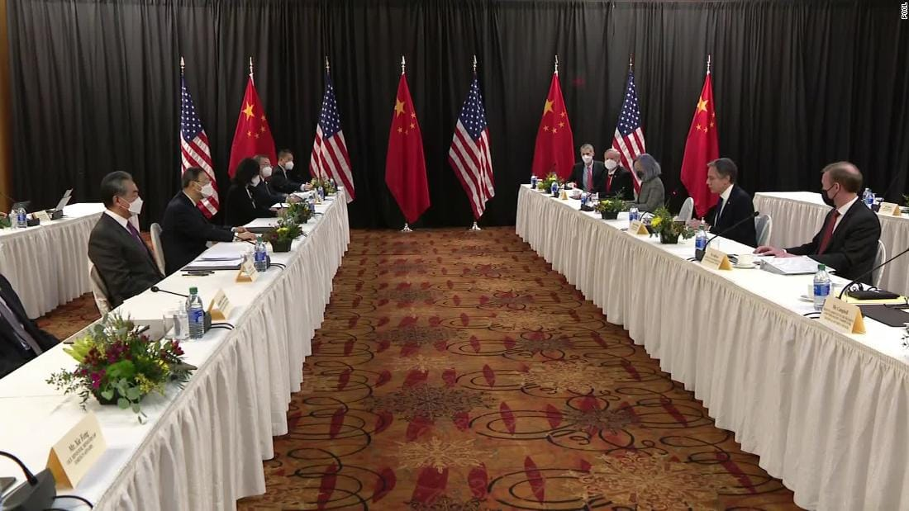
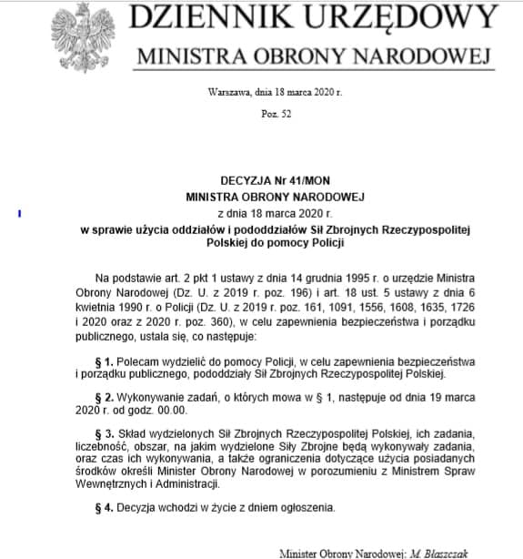
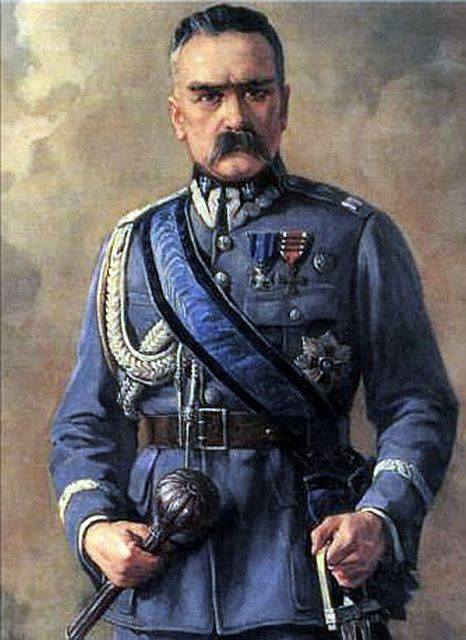

### 2021

Niestety bardzo złe wieści z Alaski gdzie wysocy rangą przedstawiciele 🇺🇲🇨🇳 dziś nad ranem polskiego, w obecności światowych mediów wzajemnie się oskarżali i obwiniali.
Wygląda na to, że zmierzamy niestety w stronę eskalacji konfliktu 🇺🇸🇨🇳 które nie znajdują porozumienia. 
W (bardziej nacjonalistycznie nastawionym) chińskim internecie euforia po tym gdy przedstawiciele🇨🇳 na zarzuty🇺🇸 o to, że te łamią prawa czlowieka odpowiadali im oskarżeniami o to samo. 
🇺🇲zarzuca się hipokryzję, a spotkanie porównuje do biesiady w Hongmen (鸿门宴) z 206 roku przed Chrystusem, gdy jeden z rywalizujących o władzę nad Chinami przywódców zaprosił drugiego, ale nie z intencją wspólnej biesiady, ale jego (fizycznej) eliminacji. 
Wśród najczęściej wyświetlanych w chińskim internecie filmów znalazł się ten z Yang Jiechi (杨洁篪) w którym (jakby wygrażając palcem) mówi on, iż "🇺🇲 nie mają prawa by rozmawiać z 🇨🇳" z pozycji siły":
Przebieg rozmów (wypowiedziane słowa i mowa ciała) oraz te reakcje w chińskim🇨🇳 internecie nie wróżą niczego dobrego i potwierdzają, że spotkanie w Alasce nie załagodziło sytuacji, a wręcz przeciwnie, było krokiem w kierunku eskalacji...

  

### 2020

<video width="640" height="480" controls>
  <source src="./movies/april/nieprzebrane-ilosci.mp4" type="video/mp4">
Your browser does not support the video tag.
</video>

---

  

### 1968

"Drodzy i szanowni towarzysze! W ciągu ostatnich 10 dni zaszły w kraju ważne wydarzenia. Niemała część młodzieży studenckiej w Warszawie, a także w innych ośrodkach akademickich w kraju została oszukana i sprowadzona przez wrogie socjalizmowi siły na fałszywą dro­gę. Siły te zasiały wśród studentów ziarna awanturniczej anarchii, łamania prawa. Posługując się metodą prowokacji, wzburzyły umysły części młodzieży, parły do wywołania starć ulicz­nych, do przelewu krwi."
Powyższy tekst to fragment antysyjonistycznego przemówienia, które w Sali Kongresowej Pałacu Kultury i Nauki podczas odbywającego się tam 19 marca 1968 roku wiecu aktywu partyjnego wygłosił I sektetarz KC PZPR Władysław Gomułka.

  

### 1945

Adolf Hitler nakazał zniszczenie na terenie Niemiec wszystkiego, co przeciwnik mógłby wykorzystać do kontynuowania walki (tzw. rozkaz Nerona).
Rozkaz Nerona (niem. Nerobefehl ) ukazał się w okresie walk o Zagłębie Ruhry. Fuhrer nakazał w nim demontaż niemieckiej infrastruktury, aby zapobiec ich wykorzystaniu przez siły alianckie, które z miesiąca na miesiąc były coraz bliżej Berlina. Wcześniej taktykę spalonej ziemi wykorzystał tylko raz, podczas odwrotu spod Moskwy.

  

### 1920

Józef Piłsudski został pierwszym marszałkiem Polski.
Ustawa sejmowa z 2 sierpnia 1919 r. uregulowała starszeństwo i określiła zasady w weryfikacji stopni wojskowych polskich żołnierzy, którzy podczas I wojny świtowej walczyli armiach byłych państw zaborczych oraz w polskich formacjach ochotniczych. Na posiedzeniu 26 lutego 1920 r. Ogólna Komisja Weryfikacyjna przyjęła uchwałę, aby „w dowód czci i hołdu dla Wodza Naczelnego zwrócić się do Niego z prośbą o przyjęcie Najwyższej Godności Wojskowej, stopnia Pierwszego Marszałka Polski.”. Ogłoszono to rozkazem L. 1088 wydanym przez Ministra Spraw Wojskowych gen. por. Józefa Leśniowskiego. W dniu swoich imienin Józef Piłsudski dekretem L. 2093 stopień przyjął i zatwierdził. Uroczyste wręczenie symbolu władzy – buławy marszałkowskiej – miało miejsce na Placu Zamkowym w Warszawie 15 listopada 1920 r. W okresie międzywojennym dzień imienin Józefa Piłsudskiego był uroczyście obchodzony w całym państwie.

  

### 1905

https://pl.wikipedia.org/wiki/Albert_Speer

---

<a href="https://github.com/TomaszWaszczyk/historia.waszczyk.com/edit/master/src/content/march-19.md" target="_blank">Edytuj tę stronę dzieląc się własnymi notatkami!</a>
