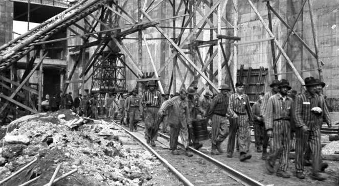

### 2020

<video width="640" height="480" controls>
  <source src="./movies/april/nieprzebrane-ilosci.mp4" type="video/mp4">
Your browser does not support the video tag.
</video>

---

  

### 1968

"Drodzy i szanowni towarzysze! W ciągu ostatnich 10 dni zaszły w kraju ważne wydarzenia. Niemała część młodzieży studenckiej w Warszawie, a także w innych ośrodkach akademickich w kraju została oszukana i sprowadzona przez wrogie socjalizmowi siły na fałszywą dro­gę. Siły te zasiały wśród studentów ziarna awanturniczej anarchii, łamania prawa. Posługując się metodą prowokacji, wzburzyły umysły części młodzieży, parły do wywołania starć ulicz­nych, do przelewu krwi."
Powyższy tekst to fragment antysyjonistycznego przemówienia, które w Sali Kongresowej Pałacu Kultury i Nauki podczas odbywającego się tam 19 marca 1968 roku wiecu aktywu partyjnego wygłosił I sektetarz KC PZPR Władysław Gomułka.

  

### 1945

Adolf Hitler nakazał zniszczenie na terenie Niemiec wszystkiego, co przeciwnik mógłby wykorzystać do kontynuowania walki (tzw. rozkaz Nerona).
Rozkaz Nerona (niem. Nerobefehl ) ukazał się w okresie walk o Zagłębie Ruhry. Fuhrer nakazał w nim demontaż niemieckiej infrastruktury, aby zapobiec ich wykorzystaniu przez siły alianckie, które z miesiąca na miesiąc były coraz bliżej Berlina. Wcześniej taktykę spalonej ziemi wykorzystał tylko raz, podczas odwrotu spod Moskwy.

  

### 1905

https://pl.wikipedia.org/wiki/Albert_Speer

---

<a href="https://github.com/TomaszWaszczyk/historia.waszczyk.com/edit/master/src/content/march-19.md" target="_blank">Edytuj tę stronę dzieląc się własnymi notatkami!</a>
