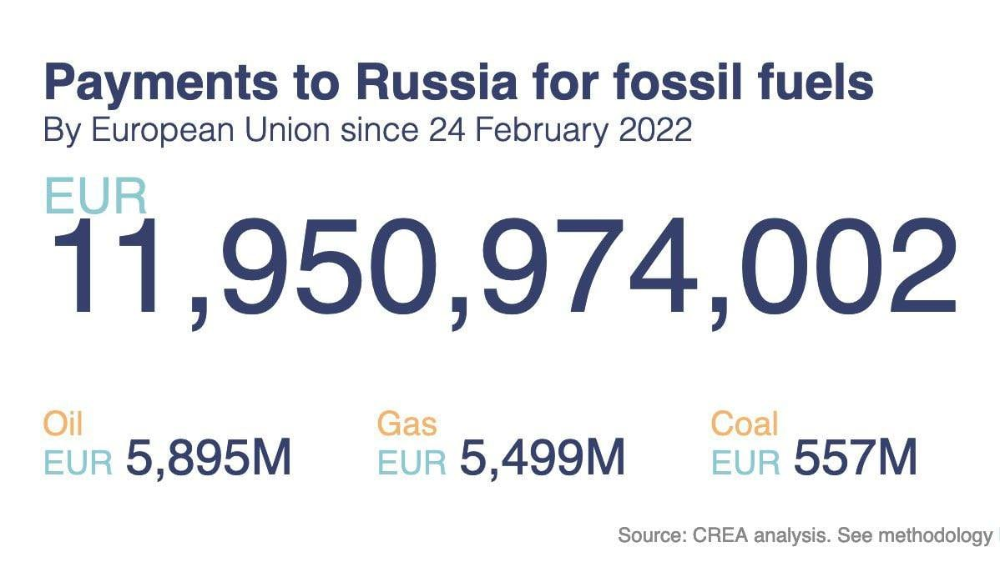
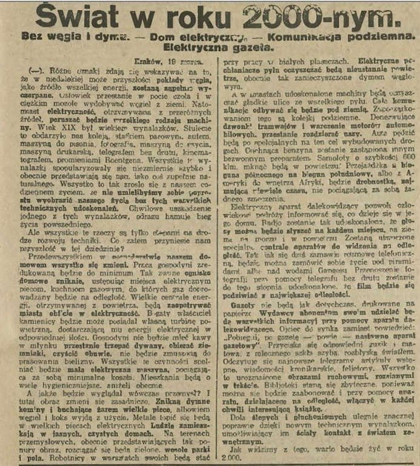

### 2023

  

### 2022

Rozbiór Polski - oficjalnie.

Żarty żartami ale ten człowiek (jak on mógł być premierem Polski?) powiedział, że tajne ośrodki szkoleniowe polskich służb powinny się stać ośrodkami dla uchodźców! Mówiłem Wam że to są niebezpieczni ludzie dla Polski!

<video width="640" height="480" controls>
<source src="./movies/march/tusknarodwielki.mp4" type="video/mp4">
Your browser does not support the video tag.
</video>

---

W Polsce panuje moda na bojkotowanie przez klientów detalicznych drobnych produktów wyprodukowanych w Rosji, a tutaj efekt sankcji Europy:

  

W tym czasie miliony polaków sprawdzają czy serek pochodzi z Rosji czy nie.

---

Dugin tells Aljazeera the war for Russia is a matter of "to be or not to be" and that  losing is not even an option. He adds that losing the war will mean the end of Putin and Russia.

---

> Premier: albo za nasze bezpieczeństwo zapłacimy wyższymi wydatkami, albo krwią naszych żołnierzy

Żeby być skutecznym na polu walki musimy posiadać nowoczesną broń i wzmocnioną armię; albo za nasze bezpieczeństwo zapłacimy wyższymi wydatkami albo zapłacimy krwią naszych żołnierzy - mówił w sobotę premier Mateusz Morawiecki.

Szef rządu złożył w sobotę wizytę w Centrum Rozwojowo–Wdrożeniowym Telesystem-Mesko. Podczas wystąpienia podkreślał, że bezpieczeństwo jest podstawą funkcjonowania każdego społeczeństwa.

---

### 2021

Niestety bardzo złe wieści z Alaski gdzie wysocy rangą przedstawiciele 🇺🇲🇨🇳 dziś nad ranem polskiego, w obecności światowych mediów wzajemnie się oskarżali i obwiniali.
Wygląda na to, że zmierzamy niestety w stronę eskalacji konfliktu 🇺🇸🇨🇳 które nie znajdują porozumienia. 
W (bardziej nacjonalistycznie nastawionym) chińskim internecie euforia po tym gdy przedstawiciele🇨🇳 na zarzuty🇺🇸 o to, że te łamią prawa czlowieka odpowiadali im oskarżeniami o to samo. 
🇺🇲zarzuca się hipokryzję, a spotkanie porównuje do biesiady w Hongmen (鸿门宴) z 206 roku przed Chrystusem, gdy jeden z rywalizujących o władzę nad Chinami przywódców zaprosił drugiego, ale nie z intencją wspólnej biesiady, ale jego (fizycznej) eliminacji. 
Wśród najczęściej wyświetlanych w chińskim internecie filmów znalazł się ten z Yang Jiechi (杨洁篪) w którym (jakby wygrażając palcem) mówi on, iż "🇺🇲 nie mają prawa by rozmawiać z 🇨🇳" z pozycji siły":
Przebieg rozmów (wypowiedziane słowa i mowa ciała) oraz te reakcje w chińskim🇨🇳 internecie nie wróżą niczego dobrego i potwierdzają, że spotkanie w Alasce nie załagodziło sytuacji, a wręcz przeciwnie, było krokiem w kierunku eskalacji...

  

### 2020

<video width="640" height="480" controls>
  <source src="./movies/april/nieprzebrane-ilosci.mp4" type="video/mp4">
Your browser does not support the video tag.
</video>

---

  

### 1968

"Drodzy i szanowni towarzysze! W ciągu ostatnich 10 dni zaszły w kraju ważne wydarzenia. Niemała część młodzieży studenckiej w Warszawie, a także w innych ośrodkach akademickich w kraju została oszukana i sprowadzona przez wrogie socjalizmowi siły na fałszywą dro­gę. Siły te zasiały wśród studentów ziarna awanturniczej anarchii, łamania prawa. Posługując się metodą prowokacji, wzburzyły umysły części młodzieży, parły do wywołania starć ulicz­nych, do przelewu krwi."
Powyższy tekst to fragment antysyjonistycznego przemówienia, które w Sali Kongresowej Pałacu Kultury i Nauki podczas odbywającego się tam 19 marca 1968 roku wiecu aktywu partyjnego wygłosił I sektetarz KC PZPR Władysław Gomułka.

  

### 1945

Adolf Hitler nakazał zniszczenie na terenie Niemiec wszystkiego, co przeciwnik mógłby wykorzystać do kontynuowania walki (tzw. rozkaz Nerona).
Rozkaz Nerona (niem. Nerobefehl ) ukazał się w okresie walk o Zagłębie Ruhry. Fuhrer nakazał w nim demontaż niemieckiej infrastruktury, aby zapobiec ich wykorzystaniu przez siły alianckie, które z miesiąca na miesiąc były coraz bliżej Berlina. Wcześniej taktykę spalonej ziemi wykorzystał tylko raz, podczas odwrotu spod Moskwy.

  

### 1926

19 marca 1926 roku, na łamach "Ilustrowanego Kuryera Codziennego" ukazał się artykuł o intrygującym tytule "Świat w roku 2000-nym. Bez węgla i dymu — Dom elektryczny — Komunikacja podziemna — Elektryczna gazeta". Dziennikarz popisał się w nim zaskakująco trafnymi spostrzeżeniami na temat technologii, która na dobre zakorzeniły się w naszych czasach. Zdaniem autora w roku 2000 ludzkość miała odejść od węgla, a domy i ulice miały być czystsze niż obecnie. Chociaż ta wizja nadal się nie sprawdziła, dostrzegamy od dłuższego czasu potrzebę przechodzenia na zielone źródła energii. Dywagacje dziennikarza na temat energetyki wiązały się ze świadomością, że węgiel jest nieodnawialnym źródłem energii, stąd stwierdził, że do 2000 roku wyczerpią ja jego wszelkie pokłady.Autor prognozował również – tym razem całkowicie trafnie – że gospodarstwa domowa zostaną maksymalnie uzależnione od elektryczności. W swoim tekście zamieścił opis wielu nowoczesnych urządzeń, które zredukują do minimum pracę gospodyni. "Tak zwane ognisko domowe zniknie, ustępując miejsca elektrycznym piecom, kuchniom gazowym, do których gaz doprowadzany będzie na odległość. Wielkie centrale energii otrzymywanej z powietrza, będą zaopatrywać miasta obficie w elektryczność. Bogaty właściciel kamienicy będzie może posiadał własną turbinę powietrzną, dostarczającą mu energii elektrycznej w odpowiedniej ilości" – pisał.
Dziennikarz przypuszczał ponadto, że skróci się znacznie czas podróży między miastami oraz że "cuchnąca benzyna zostanie zastąpiona innym bezwonnym preparatem". Wprawdzie wciąż korzystamy z benzyny, ale mamy też dziś do wyboru inne paliwa oraz auta elektryczne.Jedna z bardziej śmiałych wizji dotyczyła przyszłości prasy, która – według opisów autora – bardzo przypominała to, co znamy dziś z Internetu. "Gazety nie będą jak dotychczas, drukowane na papierze. Wydawcy abonentom swoim udzielać będą wszystkich informacyji przy pomocy aparatu dalekowidzącego. Ojciec do synka zamiast powiedzieć: "Pobiegnij po gazetę — powie — nastaw no aparat gazetowy". Przyciska się odpowiedni guzik i matowa z mlecznego szkła szyba, rozbłyska światłem. Odczytuje się najnowsze telegramy artykuły wstępne, wiadomości kronikarskie, felietony. Wszystko to urozmaicone obrazami ruchowymi, rozsianymi w tekście" – pisał autor.Warto zwrócić uwagę, że chociaż prasa drukowana nie przestała istnieć, to od pewnego czasu dostrzec drastyczne spadki sprzedaży gazet. Niektóre tytuły postanowiły nawet zrezygnować ze swoich papierowych wydań i rozwijać serwisy internetowe z płatnymi subskrypcjami premium. Dziennikarz trafnie przewidział też powstanie ebooków, twierdząc jednak błędnie, że doprowadzą one do zniknięcia tradycyjnych bibliotek. Cały artykuł z "IKC"  na poniższym wycinku.

  

### 1920

Józef Piłsudski został pierwszym marszałkiem Polski.
Ustawa sejmowa z 2 sierpnia 1919 r. uregulowała starszeństwo i określiła zasady w weryfikacji stopni wojskowych polskich żołnierzy, którzy podczas I wojny świtowej walczyli armiach byłych państw zaborczych oraz w polskich formacjach ochotniczych. Na posiedzeniu 26 lutego 1920 r. Ogólna Komisja Weryfikacyjna przyjęła uchwałę, aby „w dowód czci i hołdu dla Wodza Naczelnego zwrócić się do Niego z prośbą o przyjęcie Najwyższej Godności Wojskowej, stopnia Pierwszego Marszałka Polski.”. Ogłoszono to rozkazem L. 1088 wydanym przez Ministra Spraw Wojskowych gen. por. Józefa Leśniowskiego. W dniu swoich imienin Józef Piłsudski dekretem L. 2093 stopień przyjął i zatwierdził. Uroczyste wręczenie symbolu władzy – buławy marszałkowskiej – miało miejsce na Placu Zamkowym w Warszawie 15 listopada 1920 r. W okresie międzywojennym dzień imienin Józefa Piłsudskiego był uroczyście obchodzony w całym państwie.

  

### 1905

https://pl.wikipedia.org/wiki/Albert_Speer

---

<a href="https://github.com/TomaszWaszczyk/historia.waszczyk.com/edit/master/src/content/march-19.md" target="_blank">Edytuj tę stronę dzieląc się własnymi notatkami!</a>
