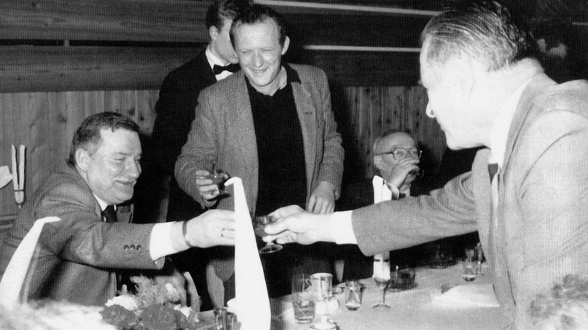

### 2022

The Russian Central Bank has decided not to pay interest on bonds worth US $ 29 billion (default). After a few days of war, Russia became economically bankrupt. The financial markets will never forget it. Even if Putin withdraws its troops today - the markets will be demanding enormous risk premiums for many, many years. The price that every Russian will pay for the rest of his life.

  

---

> Topic: Bitcoin and the Great Filter

---

### 1998

Prezydent Aleksander Kwaśniewski postanowił odznaczyć Orderem Orła Białego uczestników wydarzeń marcowych 1968 roku - Jacka Kuronia i Karola Modzelewskiego. Kwaśniewski mówił że dzięki nim Polacy mogą patrzeć w lustro bez wstydu. Zupełnie koślawo przedstawiano to wydarzenie. 
W tamtym czasie były dowódca Gwardii Ludowej (GL) i Armii Ludowej (AL), bohater walk z UPA pułkownik Tadeusz Szymański (1917-2020) napisał list otwarty "W obronie prawdy" List solidarnie przemilczany zarówno po lewej jak i prawej stronie.
"Obchodom 30 rocznicy tzw. wydarzeń marcowych nadano nienotowany w dziejach neokapitalistycznej Rzeczpospolitej rozgłos. Najwyższe odznaczenia dla przywódców marcowej rewolty, huczna uroczystość w Pałacu Namiestnikowskim, niespotykana kampania prasowa, radiowa i telewizyjna. Przypomniano wydarzenia tamtych dni prześcigając się w uwielbieniu dla marcowych komandosów i potępieniem dla ówczesnych władz, dziennikarzy i robotników - przeciwstawiającym się awanturom.
Prezydent Kwaśniewski mówił o największej hańbie i o tym, że dzięki Modzelewskiemu i Kuroniowi Polacy mogą patrzeć w lustro bez wstydu. 
Były I sekretarz KC PZPR pan Mieczysław Rakowski po raz kolejny dał upust swojej wrogości wobec kombatantów Armii Ludowej. Wystąpił on z oszczerstwami przeciwko partyzantom Moczara, przeciwko nam, żołnierzom AL. W artykule pt: "Cała władza w ręce ..."wyszydza bitwę pod Gruszką, stoczoną przez żołnierzy AL-u, obrażając nie tylko pamięć żyjących, ale także tych, którzy polegli w boju o Polskę wolną i demokratyczną, w której pan Rakowski doszedł do najwyższych godności. 
Nie podzielam wyrażanych przez pana Rakowskiego ocena wydarzeń marcowych z 1968 roku. Nie podzielam ich, bo brak w tych ocenach najważniejszego: prawdy.
Wysławiając marcowych "bohaterów" nie pisze pan Rakowski ani słowa jaki to lepszy ustrój zamierzali wprowadzić Kuroń i Modzelewski. Kto miał zastąpić Gomułkę i jego ludzi u steru władzy "komandosowskiej Republiki Rad" (List otwarty Kuronia i Modzelewskiego do Partii)
Dla nikogo kto zna podstawowe fakty marcowej awantury nie jest tajemnicą, że władzę w Polsce, po zajściach marcowych mieli objąć ludzie, którzy pod koniec lat czterdziestych proklamowali w Polsce walkę z odchyleniem "prawicowonacjonalistycznym" i z polską drogą do socjalizmu i tegoż Gomułkę już raz od władzy odsunęli i uwięzili.
Pan Rakowski, udaje, że nic nie wie lub nie pamięta kim byli ci ludzie, nie pamięta także, że awantura marcowa była dokładnie zaplanowana i nic lub prawie nic nie było w tych wydarzeniach przypadkiem. Kolportowanie prowokacyjnych kłamstw, że "Dziady" zostały zdjęte na życzenie ambasady radzieckiej, i zaatakowanej na śmierć przez Milicję ciężarnej studentce. Całość prowokacji marcowych miała doprowadzić do realizacji znanego wyznania: "Najpierw studenci, potem robotnicy, po nich żołnierze i w końcu będzie krwawy Budapeszt". Tego chcieli, do tego dążyli. Obalić Gomułkę i wprowadzić w Polsce ustrój radziecki. Czyli kontynuacja zmierzeń Centralnego Biura Komunistów Polskich w Moskwie. Raz na zawsze unicestwić nadzieje Polaków na polski socjalizm, zgodny z interesami narodu polskiego z jego kulturą, tradycją, nadziejami i marzeniami.
Nie żyje Gomułka i nie żyje Moczar. Oni nie mogą się bronić przed haniebnymi oszczerstwami. Mimo to wierzę, że prawdy nie da się zabić ani zafałszować. Prawda rzetelna i obiektywna, jest najgorszym wrogiem fali kłamstw zalewającej świadomość Polaków z okazji rocznicy marca 1968. 
W marcu 1968 roku prasa nie kłamała, był to czas w którym Polacy wypluli knebel uniemożliwiający głoszenie prawdy o tych którzy na plecach żołnierzy 1 Armii Wojska Polskiego wjechali do Polski aby nią rządzić i którzy rządzili do 1956 roku.
Prasa kłamie dziś gdy powtarza kłamstwa i oszczerstwa, płynące z Pałacu Namiestnikowskiego o hańbie marca 1968 roku, o rzekomym polskim antysemityzmie, wymuszonej gwałtem emigracji tysięcy Żydów.
W jednym ma rację pan Aleksander Kwaśniewski: Polacy w 1968 roku nie poparli Kuronia, Modzelewskiego, Michnika ... Nie poparli wtedy i nie poparli dziś. Nie dowodzi to naszego antysemityzmu, dowodzi naszego patriotyzmu, wierności Ojczyźnie i umiłowania prawdy. Tylko tyle. Tego pan Rakowski, były premier PRL, były I sekretarz PZPR ani zrozumieć, ani uznać nie chce" (Łukasz Jastrzębski)

  

### 1989

Rozpoczęła się druga tura rozmów w Magdalence – rozpatrywano tam najbardziej sporne kwestie z obrad Okrągłego Stołu.

  

  

### 1982

Zakończyła się dwudniowa wizyta w Moskwie polskiej delegacji rządowej pod przewodnictwem I sekretarza Komitetu Centralnego Polskiej Zjednoczonej Partii Robotniczej generała Wojciecha Jaruzelskiego (zdjęcie). Była to pierwsza wizyta polskiej delegacji od czasu wprowadzenia stanu wojennego. W jej trakcie władze sowieckie zapewniły o poparciu i zrozumieniu poczynań polskich towarzyszy.

  

### 1945

Poniższy cytat to datowany na 2 marca 1945 roku fragment wspomnień Mieczysława Kittaya - polskiego inżyniera żydowskiego pochodzenia, działacza kulturalnego, iluzjonisty, współorganizatora Teatru Satyrycznego "Syrena" (pierwszego powojennego teatru na terenie kraju) dotyczący pomocy, której udzielał mu Adolf Dymsza (zdjęcie).
"W najcięższym okresie mojego życia, gdy nocując w niewykończonych domach lub ruinach, byłem w skrajnej rozpaczy, spotkałem pana Adolfa Dymszę, który się mną natychmiast niezwykle serdecznie zaopiekował. Umieścił mnie w tymże samym dniu u jego matki, gdzie pozostałem przez 3 dni, następnie sprowadził mnie do swego mieszkania i nie bacząc na narażenie siebie, żony i jego trojga dzieci na grożącą im karę śmierci, ukrywał mnie przez 6 miesięcy. Przez cały ten okres pan Dymsza pielęgnował mnie i traktował jak najukochańszego członka rodziny, otaczając mnie z całego serca jak najtroskliwszą opieką".

  

### 1942

W Nowym Kurierze Warszawskim ukazało się zarządzenie urzędowe podpisane przez komendanta policji i SS w Warszawie Arpada Wiganda, dotyczące rozmieszczenia plakatów w mieście Warszawie.
Zapisano w nim, iż "wszelkie plakaty i druki ogłoszeniowe należy drukować wyłącznie w języku niemieckim, albo w niemieckim i polskim, przy czym napisy polskie nie mogą być większe od niemieckich.
Na zdjęciu niemieckie ogłoszenie z 11 marca 1941 roku.

  

---

Rozpoczął działalność niemiecki obóz zagłady w Bełżcu na Lubelszczyźnie.
Budowę tej placówki, w której życie straciło ponad pół miliona ludzi rozpoczęto 1 listopada 1941 roku. Jej lokalizacja nie była przypadkowa, ponieważ przez Bełżec przebiegała trasa kolejowa łącząca Lublin z Rawą Ruską, do której można było doprowadzić transporty z dystryktów krakowskiego i Galicji. Bełżec był miejscem dobrze znanym Niemcom. Wcześniej w miejscu tym funkcjonował żydowski obóz pracy, którego więźniowie budowali wał przeciwczołgowy, tzw. linię Otto na granicy ZSRR i Generalnego Gubernatorstwa. Znajdowała się tu również gotowa rampa kolejowa dawnego przedsiębiorstwa eksploatacji lasów.
Obóz w Bełżcu był pierwszym tego typu ośrodkiem, w którym zostały zainstalowane i wykorzystane stacjonarne komory gazowe. Pierwszy transport Żydów z Lublina i Lwowa przybył do Bełżca 17 marca 1942 roku.
Obóz zakończył funkcjonowanie w grudniu 1942 roku, najprawdopodobniej z powodu braku miejsca na kolejne masowe groby.
Na zdjęciu niemiecka załoga obozu.

  

### 1940

W Warszawie odbyło się zebranie Rady Obrony Generalnego Gubernatorstwa, w którym udział wziął Hans Frank, który powiedział:
"Obrona Rzeszy wymaga twardego trzymania w ryzach podbitego narodu, a zwłaszcza rodzących się organizacji podziemnych. Żyjemy w czasie wojny, żyjemy również w stanie niesłychanie ciężkiego konfliktu z fanatycznym narodem, który poprzysiągł nam śmierć”.

  

---

<a href="https://github.com/TomaszWaszczyk/historia.waszczyk.com/edit/master/src/content/march-2.md" target="_blank">Edytuj tę stronę dzieląc się własnymi notatkami!</a>
