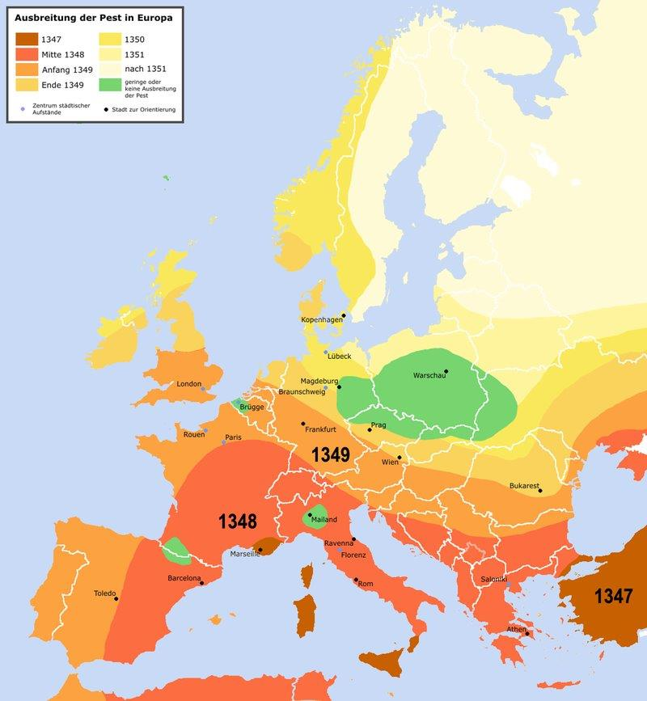

### 2023

> "Si l'Ukraine ne parvient pas à défendre son indépendance, nous n'aurons pas le choix, nous serons obligés de rentrer dans le conflit", déclare Jan Emeryk Rościszewski, ambassadeur de Pologne en France

<video width="640" height="480" controls>
<source src="./movies/march/jan_emeryk.mp4" type="video/mp4">
Your browser does not support the video tag.
</video>

> "Jeśli Ukraina nie obroni niepodległości, będziemy zmuszeni wejść w tren konflikt" - Jan Emeryk Rościszewski

### 2022

A vast financial risk vector is being overlooked. Attention is focused on key Russian banks losing access to SWIFT. What if a cyberattack left Western banks unable to use SWIFT? Russian cyber experts may have already developed an exploit and may be holding it in reserve. They know it would throttle the global financial system – a financial Armageddon triggered by a tit-for-tat “if you prevent our access to SWIFT, then you can’t use SWIFT either.” Almost no financial institution has a viable backup system in place, and they should. This is basic risk management.

SWIFT has a long history of exploits including nearly $100m stolen from banks in Bangladesh and Ukraine in 2016. These exploits compromised the individual banks. SWIFT was upgraded in 2016 to SWIFT GPI and also upgraded its Customer Security Programme. SWIFT uses its own internet protocol called SIPN. Another attack vector would be to target the SWIFT network providers: AT&T, Colt, Orange, and BT.

Much of the talk is about Russia’s potentially using cryptos, such as bitcoin, as an alternative. No one (publicly) is talking about viable alternatives if SWIFT is disrupted in the West. The reality is that the usual cryptos cannot handle the scale of global financial activity (the Bitcoin network can handle only 5 transactions per second).

SWIFT does not move money – it is only a messaging system. In blockchain-based systems, the execution and record (settlement) happen simultaneously. Leading blockchain systems include RippleNet (e.g., Santander’s One Pay FX). Stellar is another alternative (e.g., IBM Blockchain World Wire). There are a number of permissioned/private blockchains such as Sequence by Chain, Onyx by JP Morgan, Hyperledger Fabric (indeed, SWIFT is running an experiment in HLF), Corda, and Quorum. Central Bank Digital Currency initiatives can also play a role but 1) they are not ready and 2) it is necessary to develop a bridging technology between different CBDCs.

We rely on our regulators to identify and manage the risks of our financial sector. Losing SWIFT, even temporarily, is a systemic risk. Why is there no Plan B? Such vulnerabilities make us prey in an open field.

  

### 2020

Siostra: "zobaczysz za 20 lat" (w kontekście tego jak żyję(?)/dzieci(?))

Odpowiedziałem: "Zobaczymy"

### 1937

Dokładnie 20 marca 1937 roku na skraju
Puszczy Sandomierskiej i terenach wsi Pławo
rozpoczęła się budowa miasta Stalowa Wola.
Razem z miastem powstawały też Zakłady
Południowe (dziś Huta Stalowa Wola) oraz
Elektrownia Stalowa Wola.
Miasto powstało w ramach tzw. Centralnego
Okręgu Przemysłowego.
Głównym
inicjatorem planu i autorem programu był
ówczesny wicepremier i minister skarbu ,
budowniczy Gdyni , Eugeniusz Kwiatkowski.
Przed wybuchem II wojny światowej
powstała część zakładów oraz osiedla
przyfabryczne nazwane Stalowa Wola.
Nazwa miasta pochodzi od słów
ówczesnego ministra spraw wojskowych,
gen. Tadeusza Kasprzyckiego, który o
planie budowy COP-u mówił, że jest to
stalowa wola narodu polskiego wybicia się
na nowoczesność.
W latach okupacji w osiedlu i hucie działał
ruch oporu. Funkcjonowała tu Placówka AK
"Stalowa Wola", "154" należąca do Obwodu
AK Nisko. Za udział w konspiracji zginęło
wielu mieszkańców. Masowo wywożono tu
więźniów z zamku w Rzeszowie na miejsca
publicznych straceń, np. w Charzewicach w
październiku 1943 r. rozstrzelano 20 osób.
W sierpniu 1944 r. do Stalowej Woli
wkroczyli Rosjanie i rozpoczęły się represje
stosowane przez NKWD.W dniu 1
kwietnia 1945 r. Stalowa Wola otrzymała
prawa miejskie .
W 1953 roku Stalowa Wola została miastem
powiatowym,a w 1977 roku przyłączono do
niej Rozwadów i Charzewice.
W ciągu 60 lat Stalowa Wola z małego
przyfabrycznego osiedla urosła do dużego
miasta, dziś trzeciego pod względem
ludności w województwie podkarpackim .
Jest od 1 stycznia 1999 roku również miastem
powiatowym. W skład powiatu wchodzą
gminy : Bojanów, Pysznica, Radomyśl nad
Sanem , Stalowa Wola, Zaklików i
Zaleszany . Na terenie o łącznej powierzchni
83,4 km² zamieszkuje ok. 115 tys. osób.
W 1989 roku miasto zostało odznaczone
Krzyżem Komandorskim Orderu Odrodzenia
Polski.

  

### 1920

Na Śląsku odbył się jeden z dwóch plebiscytów narodowościowych. Był on poprzedzony dwoma powstaniami niepodległościowymi i wynikał też z ustaleń Traktatu Wersalskiego.
Plebiscyt był nadzorowany przez
Międzysojuszniczą Komisję Rządzącą i
Plebiscytową na Górnym Śląsku z siedzibą
w Opolu. Na czele tej angielsko-francusko-
włoskiej Komisji stał Francuz generał Henri
Le Rond. Zastępcą Le Ronda był Włoch
gen. Alberto De Marinis Stendardo di
Ricigliano, Wielką Brytanię reprezentował
płk Harold Franz Passawer Percival. Do
Komisji byli oddelegowani przedstawiciele
Polski, Niemiec, Czechosłowacji i Watykanu
(nuncjusz apostolski abp Achille Ratti ,
później monsignore Giovanni Battista
Ogno-Serra). Polskę reprezentował konsul
generalny Daniel hrabia Kęszycki. Oprócz
przeprowadzenia plebiscytu Komisja miała
później na podstawie jego wyników
zaproponować podział spornego terytorium.
Zadaniem Komisji i towarzyszących jej
wojsk alianckich było dopilnowanie
prawidłowego przebiegu kampanii
plebiscytowej i samego głosowania oraz
utrzymanie porządku i spokoju. Dowódcą
wojsk pilnujących porządku był gen. Jules
Plebiscyt objął 1573 gminy Górnego Śląska
w powiatach: bytomskim, katowickim,
gliwickim, tarnogórskim, rybnickim,
pszczyńskim, strzeleckim, opolskim,
lublinieckim, kozielskim, kluczborskim,
głubczyckim i części powiatu prudnickiego.
W głosowaniu udział wzięło 1 190 846
uprawnionych. .

  

### 1345

Nastąpiła koniunkcja Marsa, Jowisza i Saturna, łączona przez ówczesnych astrologów z rozpoczętą wkrótce epidemią tzw. „czarnej śmierci” w Europie.
Sprawa jest ciekawa również z astrologicznego punktu widzenia, a zwłaszcza z punktu widzenia historii astrologii, bo sięga ona czasów średniowiecznej zarazy. Kiedy w latach 1347-1350 w Europie szalała dżuma, zwana „Czarną Śmiercią”, blisko 30 procent mieszkańców Europy straciło życie. To była najstraszliwsza epidemia w historii ludzkości, a ogrom zniszczeń był dla wszystkich zatrważający. Nic więc dziwnego, że ci, co uszli z życiem, usiłowali na różne sposoby tłumaczyć sobie przyczyny tej okropnej zarazy.
Na prośbę króla Francji, Filipa VI, profesorowie z paryskiego uniwersytetu przygotowali specjalny raport wyjaśniający powody pojawienia się Czarnej Śmierci. W średniowieczu każdy wykształcony lekarz był dobrze obeznany z astrologią medyczną, toteż nie jest zaskoczeniem, że w raporcie odnajdujemy odwołania do wpływu gwiazd. Uczeni zauważyli, że na trzy lata przed epidemią doszło do potrójnej koniunkcji Marsa, Saturna i Jowisza w powietrznym znaku Wodnika. Co więcej, było to tuż po zaćmieniu Księżyca i niecałe dwa tygodnie przed całkowitym zaćmieniem Słońca. Horoskop średniowiecznej dżumy astrologowie obliczyli na 20 marca 1345 roku, godz. 12:50.

  

---

<a href="https://github.com/TomaszWaszczyk/historia.waszczyk.com/edit/master/src/content/march-20.md" target="_blank">Edytuj tę stronę dzieląc się własnymi notatkami!</a>
