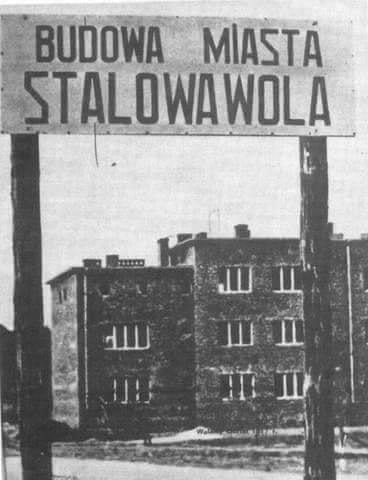

### 1937

Dokładnie 20 marca 1937 roku na skraju
Puszczy Sandomierskiej i terenach wsi Pławo
rozpoczęła się budowa miasta Stalowa Wola.
Razem z miastem powstawały też Zakłady
Południowe (dziś Huta Stalowa Wola) oraz
Elektrownia Stalowa Wola.
Miasto powstało w ramach tzw. Centralnego
Okręgu Przemysłowego.
Głównym
inicjatorem planu i autorem programu był
ówczesny wicepremier i minister skarbu ,
budowniczy Gdyni , Eugeniusz Kwiatkowski.
Przed wybuchem II wojny światowej
powstała część zakładów oraz osiedla
przyfabryczne nazwane Stalowa Wola.
Nazwa miasta pochodzi od słów
ówczesnego ministra spraw wojskowych,
gen. Tadeusza Kasprzyckiego, który o
planie budowy COP-u mówił, że jest to
stalowa wola narodu polskiego wybicia się
na nowoczesność.
W latach okupacji w osiedlu i hucie działał
ruch oporu. Funkcjonowała tu Placówka AK
"Stalowa Wola", "154" należąca do Obwodu
AK Nisko. Za udział w konspiracji zginęło
wielu mieszkańców. Masowo wywożono tu
więźniów z zamku w Rzeszowie na miejsca
publicznych straceń, np. w Charzewicach w
październiku 1943 r. rozstrzelano 20 osób.
W sierpniu 1944 r. do Stalowej Woli
wkroczyli Rosjanie i rozpoczęły się represje
stosowane przez NKWD.W dniu 1
kwietnia 1945 r. Stalowa Wola otrzymała
prawa miejskie .
W 1953 roku Stalowa Wola została miastem
powiatowym,a w 1977 roku przyłączono do
niej Rozwadów i Charzewice.
W ciągu 60 lat Stalowa Wola z małego
przyfabrycznego osiedla urosła do dużego
miasta, dziś trzeciego pod względem
ludności w województwie podkarpackim .
Jest od 1 stycznia 1999 roku również miastem
powiatowym. W skład powiatu wchodzą
gminy : Bojanów, Pysznica, Radomyśl nad
Sanem , Stalowa Wola, Zaklików i
Zaleszany . Na terenie o łącznej powierzchni
83,4 km² zamieszkuje ok. 115 tys. osób.
W 1989 roku miasto zostało odznaczone
Krzyżem Komandorskim Orderu Odrodzenia
Polski.

  

### 1920

Na Śląsku odbył się jeden z dwóch plebiscytów narodowościowych. Był on poprzedzony dwoma powstaniami niepodległościowymi i wynikał też z ustaleń Traktatu Wersalskiego.
Plebiscyt był nadzorowany przez
Międzysojuszniczą Komisję Rządzącą i
Plebiscytową na Górnym Śląsku z siedzibą
w Opolu. Na czele tej angielsko-francusko-
włoskiej Komisji stał Francuz generał Henri
Le Rond. Zastępcą Le Ronda był Włoch
gen. Alberto De Marinis Stendardo di
Ricigliano, Wielką Brytanię reprezentował
płk Harold Franz Passawer Percival. Do
Komisji byli oddelegowani przedstawiciele
Polski, Niemiec, Czechosłowacji i Watykanu
(nuncjusz apostolski abp Achille Ratti ,
później monsignore Giovanni Battista
Ogno-Serra). Polskę reprezentował konsul
generalny Daniel hrabia Kęszycki. Oprócz
przeprowadzenia plebiscytu Komisja miała
później na podstawie jego wyników
zaproponować podział spornego terytorium.
Zadaniem Komisji i towarzyszących jej
wojsk alianckich było dopilnowanie
prawidłowego przebiegu kampanii
plebiscytowej i samego głosowania oraz
utrzymanie porządku i spokoju. Dowódcą
wojsk pilnujących porządku był gen. Jules
Plebiscyt objął 1573 gminy Górnego Śląska
w powiatach: bytomskim, katowickim,
gliwickim, tarnogórskim, rybnickim,
pszczyńskim, strzeleckim, opolskim,
lublinieckim, kozielskim, kluczborskim,
głubczyckim i części powiatu prudnickiego.
W głosowaniu udział wzięło 1 190 846
uprawnionych. .

  

---

<a href="https://github.com/TomaszWaszczyk/historia.waszczyk.com/edit/master/src/content/march-7.md" target="_blank">Edytuj tę stronę dzieląc się własnymi notatkami!</a>
