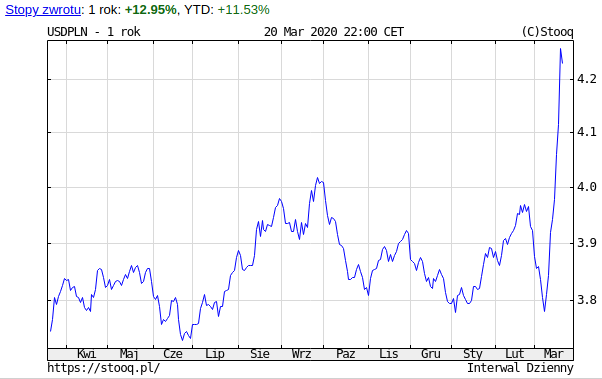
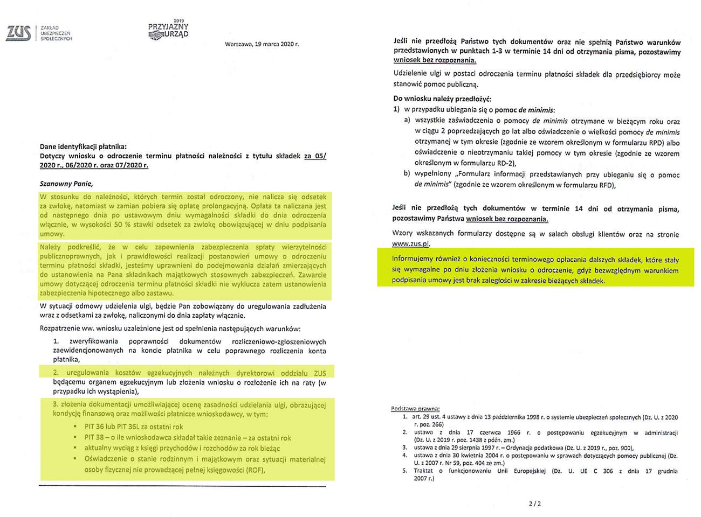
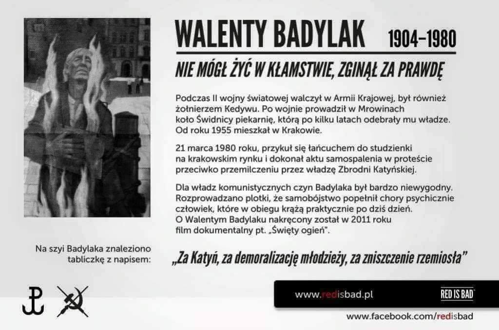
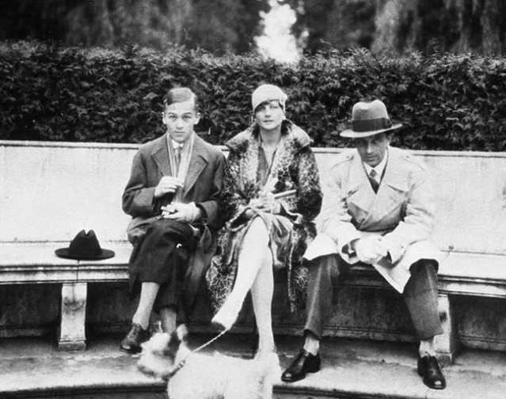

### 2020

> Raport 21 marca 2020: Już 452 osób zachorowało w Polsce na koronawirusa. Pięć z nich zmarło. Rząd zdecydował o zamknięciu szkół do Świąt Wielkanocnych. Na terenie Polski wprowadzono stan epidemii. - To trudna decyzja, ale ważna, żeby nie doszło do dalszego rozprzestrzeniania koronawirusa - stwierdził w piątek wieczorem premier Mateusz Morawiecki. Podwyższono karę za złamanie kwarantanny z 5 tys. zł do 30 tys. zł. Za nami najtragiczniejsza doba od początku epidemii we Włoszech. W ciągu 24 godzin na koronawirusa zmarło tam 627 osób.

  

---

Firma SC Event Design udostępniła na swoim fanpage odpowiedź z ZUS, w sprawie złożonego wniosku o odroczenie składek o 3 miesiące, a więc późniejszą ich zapłatę.

Przypomnijmy, że pomysł ten został zaprezentowany przez Mateusza Morawieckiego w ramach tak zwanej Tarczy Antykryzysowej, która ma pomóc polskim przedsiębiorcom zwalczyć skutki kryzysu wywołanego koronawirusem.

1. Okazuje się, że od odroczonych w czasie składek pobrana zostanie opłata prolongacyjna, w wysokości połowy kwoty naliczonych odsetek za zwłokę.
2. Dodatkowo ZUS ma prawo do zabezpieczenia na składnikach majątkowych przedsiębiorcy lub hipotece.
3. Przedsiębiorca musi uregulować koszty egzekucyjne należne dyrektorowi ZUS.
4. Konieczne jest również przedstawienie całego stosu dokumentów, poświadczających stan majątkowy przedsiębiorcy oraz oświadczenie o stanie rodzinnym.
5. Przedsiębiorca musi również terminowo opłacić składki, wymagalne po złożeniu wniosku o odroczenie składek.

Brzmi absurdalnie?
Bo jest absurdalne.
To nie fejk.
Sęk w tym, że rząd dokonał pewnej medialnej sztuczki.

Zapewnienia premiera Morawieckiego nie zmieniają prawa.
Potrzebna jest do tego odpowiednia nowelizacja ustawy, w tym przypadku nowelizacja, która według obietnic Emilewicz miała znosić chociażby wspomnianą opłatę prolongacyjną.

Taka nowelizacja została obiecana w dniu ogłoszenia Tarczy Antykryzysowej, a polscy przedsiębiorcy skuszeni obietnicami rządu zaczęli wysyłać do ZUSu wnioski o odroczenie składek.
Problem w tym, że ZUS zaczął przyjmować te wnioski na podstawie starych przepisów.
Mimo to, na swojej stronie zakładkę z wnioskami zatytułował sloganem o koronawirusie.

Przedsiębiorcy dali się nabrać i zapewnieniom premiera i ZUSu, ujawniając między innymi wysokość swojego majątku prywatnego i spowiadając się ze szczegółami dlaczego proszą o łaskawe odroczenie składek.

Tymczasem nowelizacja będzie procedowana... kiedyś. Być może w kolejnym tygodniu, o ile reszta ministrów i posłów nie zarazi się koronawirusem.
Szczegółów na temat tego co się w niej znajdzie na razie nie znamy, słyszeliśmy tylko obietnice.

Tu miał być jakiś slogan z sarkastycznym komentarzem, ale sprawa sama się komentuje.

  

### 2018

#### Bitcoin will become the world’s single currency, Twitter chief says Jack Dorsey

Bitcoin will overtake the dollar in importance as it becomes the single global currency of the internet within a decade, Jack Dorsey, one of Silicon Valley’s leading entrepreneurs, has said.

Despite recent weakness in the value of bitcoin and concerns that it cannot currently process transactions fast or cheaply enough to act as a currency, Mr Dorsey, who is chief executive of both Twitter and the payments company Square, believes that bitcoin will overcome these obstacles and will be used to buy everyday items such as coffee.

### 1980

Na Rynku Głównym w Krakowie były żołnierz Armii Krajowej Walenty Badylak dokonał samospalenia. Była to manifestacja przeciwko przemilczaniu przez władze PRL zbrodni katyńskiej.
Na jego szyi znaleziono tabliczkę z napisem:
"Za Katyń, za demoralizację młodzieży, za zniszczenie rzemiosła". Jako pożegnanie z
bliskimi zostawił kartkę, na której napisał:
"Kochani - jeśli tam nie ma nicości, a są duchy bratnie będę was wspomagał, a w chwilach szczególnych odczujecie moją obecność -ojciec i dziadek".
Zmarł tego samego dnia w drodze do szpitala.

  

### 1941

  

Kulisy największej klęski polskiego wywiadu. Niemcy przechwycili archiwa, szyfry i agentów
Nasze archiwa, szyfry i nasi agenci znaleźli się w rękach wroga z winy oficerów Oddziału II Sztabu Głównego. Za błąd polskiego wywiadu najwyższą cenę zapłacili Polacy i Niemcy zbierający i przekazujący informacje o III Rzeszy dla II RP - zostali skazani na śmierć. Wielu z nich ścięto głowy gilotyną.

Zagrożenie dla istnienia niepodległego, suwerennego państwa polskiego niosło w 1939 r. ze sobą także szczególne zadania dla wszystkich organizacji, które prowadziły działalność tajną i ściśle tajną. Oczywiście w pierwszej kolejności chodziło o Oddział II Sztabu Głównego, a więc o wywiad wojskowy. Każda z organizacji, obojętnie czy działająca w kraju czy za granicą, tworząca niejawną dokumentację i mająca dostęp do takowej, winna była zawczasu przygotować system awaryjnego zniszczenia wszystkich papierów posiadających gryfy tajności. Postępując w ten odpowiedzialny sposób, instytucje państwowe zapobiegłyby przechwyceniu danych o polskiej agenturze działającej na kierunku niemieckim. Stało się inaczej. Tragicznie.

Fliegende Trupps

W planowaniu przechwycenia zarówno tajnej dokumentacji, jak i oficerów oraz agentów polskiego wywiadu ważną rolę odgrywała Abwehra. Major Heinz Schmalschläger, późniejszy szef ośrodka wywiadowczego Abwehry pod kryptonimem Walli w Sulejówku pod Warszawą, kierował podobną, chociaż dzięki odpowiedzialnej postawie kierownictwa wywiadu Czechosłowacji całkowicie nieudaną operacją w czasie zajmowania tego państwa w marcu 1939 r. Ze swych błędów Niemcy wyciągnęli wnioski. Tym razem natychmiast po zajęciu przez ich wojska liniowe kolejnych polskich miast-siedzib struktur prowadzących działalność wywiadowczą lub kontrwywiadowczą, wkraczały na ich teren liczące co najmniej 15 oficerów i podoficerów oddziały Abwehry, wspomagane przez oficerów rezerwy tej organizacji specjalnie zmobilizowanych do realizacji wyznaczonego celu, znane jako Fliegende Trupps, a więc grupy lotne. W poszukiwaniu dokumentów przeczesywano budynki, w których mieściły się biura polskiego wywiadu.

Jednocześnie rozpoczęto intensywne poszukiwania wszystkich osób, które były z nimi związane. Działając w ten sposób, jednostki Abwehry przejęły, najczęściej w stanie nienaruszonym, archiwa Straży Granicznej, Oddziału II Sztabu Generalnego/Głównego oraz archiwum Ministerstwa Spraw Zagranicznych. Wśród pierwszych zdobyczy znajdowała się dokumentacja zgromadzona w przygranicznych komisariatach polskiej Straży Granicznej w Śmiłowie, Wolsztynie, Rybniku, Sypniewie, Lesznie oraz Międzychodzie. Liczba i jakość przejętych materiałów zaskoczyła Niemców. Działali sprawnie i w sposób systematyczny. Dokumentację natychmiast tłumaczono, a w ślad za tym dokonywano pierwszych aresztowań.

Największy sukces Fliegende Trupps odniosły w Warszawie. Z siedziby Ministerstwa Spraw Zagranicznych zabrano całą, niezniszczoną dokumentację. Została natychmiast przewieziona do Urzędu Spraw Zagranicznych w Berlinie, gdzie wykorzystano ją w przygotowaniu i wydrukowaniu publikacji zatytułowanej "Polnische Dokumente zur Vorgeschichte des Krieges", znanej pod potoczną nazwą Biała Księga. Zespołem pracującym nad tą publikacją osobiście kierował Hans von Moltke, do czasu wybuchu wojny ambasador Niemiec w Warszawie.

Przejęcie CAW

Największą zdobyczą, co oczywiste, było przejęcie przez Abwehrę ogromnego zbioru dokumentacji Oddziału II SG. Natrafiono na ten "skarb" w Forcie Legionów, do 1921 r. znanym jako Fort Włodzimierza, na przedpolu Cytadeli Warszawskiej. Fort Legionów był trzykondygnacyjną wieżą artyleryjską wzniesioną w latach 1852-1854. Zanim został przejęty przez polskie Archiwum Wojskowe, służył jako składnica dokumentów byłego rosyjskiego Sztabu Wojennego Okręgu Warszawskiego. W roku 1915 Rosjanie ewakuujący się w ogromnym pośpiechu z Warszawy pozostawili całą tę dokumentację na łaskę losu. W bałaganie towarzyszącym toczącej się wielkiej wojnie Fort Legionów i zgromadzony w nim zbiór dokumentacji były niepilnowane. Korzystając z tego przygodne osoby wchodziły do środka celem przeglądania, zabierania, a niekiedy i niszczenia fragmentów tego zbioru.
d29hs5l

Kres temu położyły władze odrodzonej Polski, ale stało się to dopiero 28 kwietnia 1919 r. Z rozkazu wydanego osobiście przez Kazimierza Sosnkowskiego z tym dniem postawiona została w Forcie Włodzimierza/Legionów wojskowa warta. Krótko potem Fort stał się magazynem numer 1 Centralnego Archiwum Wojskowego kierowanego w latach 1933-1939 przez mjr. Bolesława Waligórę.

Notabene imieniem Waligóry, który zginął w 1940 r. podczas nalotu bombowego na Londyn, uznawanego za pioniera polskiej archiwistyki wojskowej, ochrzczono dzisiejsze CAW. Czy słusznie? Czy jego rola w nieodpowiedzialnym porzuceniu tajnych zbiorów archiwalnych zawierających dane polskiej agentury została należycie i do końca wyjaśniona?

Co Niemcy znaleźli w Forcie Legionów? Wiemy na pewno, że wśród przejętej dokumentacji znajdowały się starannie uporządkowane teczki spraw prowadzonych na kierunku niemieckim przez centralę polskiego wywiadu, której siedziba mieściła się w budynku Sztabu Głównego przy placu Piłsudskiego w Warszawie. Przed rozkazem o ewakuacji personelu dokumentację Oddziału II, w tym dane o agenturze, przewieziono właśnie do Fortu Legionów. Niemcy znaleźli tam też tak pilnie poszukiwaną w Bydgoszczy przez szefa grupy operacyjnej Policji Bezpieczeństwa w tym mieście Helmuta Bischoffa dokumentację ekspozytury kierowanej przez ich "największego wroga", mjr. Jana Żychonia. Zgodnie z rozkazem centrali wywiadu w Warszawie mjr Żychoń przesłał kompletną dokumentację ekspozytury do Centralnego Archiwum w Warszawie.

Z rozkazu gen. Keitela, dowódcy Oberkommando der Wehrmacht, utworzono Heeresarchiv Zweigstelle Gdańsk-Oliwa, a więc Oddział Archiwum Sił Zbrojnych w Gdańsku-Oliwie. Tam też przewieziono zdobyte w Warszawie i wielu innych miastach tajne dokumenty polskiego wywiadu oraz kontrwywiadu. Dokonano najpierw wstępnej segregacji według gradacji ważności spraw, a następnie przystąpiono do tłumaczeń. Dla zebranej dokumentacji, która w sposób wyraźny nie precyzowała osób zaangażowanych w jej gromadzenie lub nie dawała odpowiedzi na pytanie o źródło wycieku tajemnic, stworzono specjalny formularz, którego nazwa brzmiała jak następuje: "Zdradzony materiał - pochodzenie nieznane". Wpisywano do niego dane takie jak rodzaj materiału (sprawozdanie, zdjęcia itd.), miejsce i data pochodzenia, zwięzła informacja o treści, informacja, komu materiał został przekazany, oraz pierwsze wskazówki w kwestii podejrzewanych zdrajców. Wypełnione formularze wraz z polskimi dokumentami przesyłano do centrali w Berlinie celem przeprowadzenia
dalszych dochodzeń zmierzających do wykrycia zdrajców.

Współpracownicy Sosnowskiego

W sprawach, w których nie było wątpliwości co do personaliów, bezzwłocznie rozpoczęto aresztowania. Szybko w aresztach śledczych znaleźli się bliscy współpracownicy i agenci wybitnego polskiego oficera wywiadu mjr. Jerzego Sosnowskiego. W Warszawie w mieszkaniu przy ulicy Fabrycznej 32 aresztowana została kurierka majora, a jednocześnie jego kuzynka Maria Runge, której teczkę pracy w stanie nienaruszonym oficerowie Abwehry znaleźli w Forcie Legionów. W Berlinie gestapo uwięziło najważniejszego agenta pracującego dla mjr. Sosnowskiego, porucznika w stanie spoczynku Günthera Rudloffa oraz innego agenta, syna byłego szefa niemieckiego Sztabu Generalnego i byłego męża agentki majora Benity von Falkenhayn, podpułkownika w stanie spoczynku Richarda von Falkenhayna. W Warszawie przy ulicy Mickiewicza 6a, w mieszkaniu pod numerem 17, odnaleziono związanego z Oddziałem II i sprawą Sosnowskiego rtm. Tadeusza Likiernika, którego po wstępnych przesłuchaniach umieszczono w oflagu VIIIB w Silberberg. Maria Runge nie
wytrzymała trudów śledztwa w berlińskim więzieniu Moabit i zgodziła się na współpracę z gestapo. Zdradziła między innymi rolę odgrywaną w sprawie Sosnowskiego przez oficera Oddziału II rtm. Tadeusza Mroczkowskiego. Był on głównym kontaktem majora w strukturze polskiej ambasady w Berlinie, a także tym, który sfotografował znaczną część materiałów uzyskanych przez majora od por. Rudloffa, ppłk. von Falkenhayna i innych agentów. Dzięki uruchomionej natychmiast kontroli korespondencji prowadzonej przez żonę rtm. Tadeusza Mroczkowskiego gestapo wpadło na jego trop w obozie jenieckim w Itzehoe, w niedalekiej odległości od Hamburga. Rudloff był już raz, w roku 1934, aresztowany w tej sprawie, ale dzięki szlachetnej postawie mjr. Sosnowskiego i Benity von Falkenhayn nie zdołano udowodnić mu zarzucanej zbrodni zdrady. Tym razem nie było wątpliwości. W Forcie Legionów znaleziono kompletne teczki jego pracy jako agenta Oddziału II. Takie samo dossier znaleziono w sprawie ppłk. Richarda von Falkenhayna.

Kret w Kriegsmarine

Kolejny dramat rozegrał się w przypadku Wiktora Katlewskiego, zatrudnionego w Urzędzie Uzbrojenia niemieckiej Marynarki Wojennej na stanowisku księgowego. Jego rodzice byli Polakami, którzy wyemigrowali do Niemiec. Wiktor urodził się w roku 1910 w Berlinie jako syn prostego windziarza. Mimo zdolności, z braku funduszy musiał zrezygnować ze studiów. W roku 1935 poznał kobietę o imieniu Käthy, która pracowała we wspomnianym wyżej urzędzie. Starała się pomóc Wiktorowi znaleźć tam zatrudnienie. Na przeszkodzie stał brak odbycia przez niego służby wojskowej. Aby temu zaradzić, skierowany został do 1. Pułku Artylerii w Prusach Wschodnich. W roku 1937 w wyniku odniesionych ran w wypadku został zwolniony jako niezdolny do dalszej służby. Dowódca jednostki pomógł mu znaleźć pracę w Akademii Wojennej w Berlinie.
d29hs5l

Po 10 tygodniach został wreszcie pracownikiem Urzędu Uzbrojenia Marynarki Wojennej. Odpowiadał za weryfikację rachunków i przygotowywanie przelewów. Dzięki temu znał wszystkie sekrety rozbudowy Kriegsmarine. Do pracy w polskim wywiadzie Katlewski został przekonany przez swojego kuzyna Konrada Smoczyńskiego, na stałe mieszkającego w Grudziądzu. Warunki współpracy uzgodniono z oficerami Oddziału II na spotkaniu w Gdyni, a pierwsze materiały przekazał w trakcie kolejnych wyjazdów do Gdańska. Potem spotkania, które odbywały się w odstępach sześcio-ośmiotygodniowych, przeniesiono do Berlina. Katlewski przekazał kilka tysięcy dokumentów. Wpadł po przejęciu materiałów w Forcie Legionów.

Według informacji zawartych w akcie oskarżenia sporządzonym przez prokuraturę oraz w wyroku Sądu Wojennego Rzeszy Wiktor Katlewski przekazał informacje o planach budowy wielu baterii nadmorskich oraz przeciwlotniczych, a także dane o systemach ostrzegawczych. Dla przykładu Polacy weszli w posiadanie precyzyjnych danych dotyczących rejonu Pilawy, które obejmowały między innymi liczbę i rodzaj baterii przeciwlotniczych, dane o dalekosiężnych działach kalibru 170 mm i kątach namiaru tych dział. Dalej agent przekazał informacje o planach stanowisk artyleryjskich w Kołobrzegu, Słupsku i Darłowie, podał bardzo szczegółowe informacje o poligonie w Darłowie, o lokalizacji baterii dział kalibru 280 mm w Göben. Był też pierwszą osobą, która przekazała Polakom informacje na temat Peenemünde i działającego tam poligonu doświadczalnego, na którym testowano nowego typu broń [chodziło o V-1 i V-2].

Przekazał też szczegółowe dane o instalacjach wojskowych na wyspach Sylt oraz Helgoland, opisał instalacje wojskowe w rejonach Kilonii, Cuxhaven, Bremerhaven oraz Wilhelmshaven, a także na Wyspach Fryzyjskich, Borkum i Norderney. Po aresztowaniu 23 stycznia 1940 r. Katlewskiego i poślubionej przez niego w międzyczasie Käthy w trakcie szczegółowej rewizji w ich mieszkaniu gestapo znalazło przemyślnie zbudowaną skrytkę, a w niej zaświadczenie o przyznaniu mu obywatelstwa polskiego, 4480 marek niemieckich oraz dobrej marki aparat fotograficzny. Niemiecka policja zlokalizowała również kuzyna Katlewskiego Konrada Smoczyńskiego. Rozprawa przed Sądem Wojennym Rzeszy odbyła się 9 lipca 1940 r. Wiktor Katlewski oraz jego kuzyn zostali skazani na karę śmierci. Żonę uniewinniono. Potrafiła przekonać skład orzekający, że nie miała pojęcia o tajnej działalności swojego męża. Wyroki wykonano 19 sierpnia w berlińskim więzieniu w Lichtenberg. Agenci z Wybrzeża i Śląska

Kolejna bolesna strata polskiego wywiadu to aresztowanie Pauliny Tyszewskiej-Müchlen. Urodzona 13 kwietnia 1899 r. w rodzinie ogrodnika, po ukończeniu gimnazjum wyjechała do Kilonii. Tam poślubiła kupca Müchlena. Po rozwodzie powróciła do Wolnego Miasta Gdańska. Zamieszkała w Sopocie. Po pewnym czasie spotkała na swojej życiowej drodze wysokiego oficera Abwehrstelle w Gdańsku Reinholda Kohtza. Miała z nim nieślubne dziecko. Zwerbowana do współpracy z polskim wywiadem przekazywała ważne informacje z wnętrza Abwehry. Jej kurierami było małżeństwo, Franciszka (rodzona siostra Pauliny) i Brunon Boruccy. W śledztwie przyznała się do przekazania polskiemu wywiadowi 16 nazwisk agentów niemieckich działających na terenie Polski. Po odnalezieniu w Forcie Legionów jej teczki pracy została 12 grudnia 1939 r. aresztowana w Sopocie przez gestapo. Ten sam los spotkał małżeństwo Boruckich oraz Reinholda Kohtza. W dniu 10 stycznia Tyszewska oraz małżeństwo Boruckich skazani zostali na karę śmierci. Cała trójka zginęła pod
gilotyną 21 marca 1941 r. w Berlinie. Reinholdowi Kohtzowi wymierzono karę pięciu lat więzienia.

Po zdobyciu polskich archiwów Niemcy rozpoczęli systematyczne rozliczanie się z kolejnymi osobami. I tak w dniu 10 czerwca 1943 r. zginął pod gilotyną Herman Schlafke z Katowic. Mimo że miał za sobą wpadkę na terenie Niemiec i odbyty w całości wyrok sześciu lat więzienia, brał udział w zwerbowaniu Georga Frocha - zatrudnionego w zakładzie obróbki stali specjalnych Huldschinsky-Werke (później znanej jako Stadtwerke) w Gliwicach. Zakład ten większość swoich zamówień otrzymywał z Wehrmachtu. Pośrednio, bo poprzez męża Karla Ottona Pajonka vel Pająka (skazanego w sprawie Frocha na karę dożywotniego więzienia), związana była ze sprawą Schlafkego i Frocha także Anna Pająk. Pomimo że miała w swoim życiu krótki epizod współpracy ze służbami niemieckim, po zdobyciu polskich archiwów została aresztowana, a następnie skazana wyrokiem sądu na śmierć. Zginęła pod gilotyną 4 marca 1943 r.
d29hs5l

Lista kolejnych straceń

Paweł Śmigoń, skazany za werbunki obywateli niemieckich do pracy na rzecz polskiego wywiadu, dostarczenie próbek prochu strzelniczego oraz pełnienie funkcji kuriera przewożącego z Niemiec do Polski dokumenty odebrane od agentury. Zginął pod gilotyną 21 listopada 1940 r.

Jan Ratajczak, z zawodu ślusarz, dostarczył oficerom Oddziału II istotne, tajne informacje militarne; wyrok został wykonany 30 lipca 1941 r.

Jan Zymela, zginął pod gilotyną w dniu 22 września 1942 r.
d29hs5l

Jan Wales, stracony 12 czerwca 1942 r.

Jan Musielak, zgilotynowany 29 kwietnia 1942 r. za działalność wywiadowczą na rzecz placówki polskiego wywiadu w Lesznie.

Jan Kubis, zgilotynowany 17 lipca 1942 r., oskarżony był o ujawnienie polskiemu wywiadowi nazwiska niemieckiego agenta.

Józef Krella, zgilotynowany 3 marca 1942 r., skazany za ujawnienie wywiadowi polskiemu nazwisk dwóch agentów niemieckich.
d29hs5l

Franciszek Przeczewski, zgilotynowany 9 września 1943 r., skazany za pracę w latach 1928-1939 na rzecz wywiadu polskiego.

Wielką tragedią było aresztowanie 24 czerwca 1940 r. bardzo wydajnego agenta polskiego wywiadu Marcina Starosty. Od 28 listopada 1933 r. współpracował z ekspozyturą w Katowicach. W trakcie swojej pracy odbył 48 podróży do Niemiec, podczas których rozpracowywał między innymi fortyfikacje niemieckie wzdłuż biegu rzeki Odry, zbierał dane o jednostkach wojskowych stacjonujących w tych rejonach, a także wykonywał bardzo wiele zdjęć obiektów wojskowych. Podróże odbywał pod nazwiskami legalizacyjnymi, takimi jak Johann Kramer, Antoni Hades czy Johann Jansen. Po pewnym czasie pełnił funkcję łącznika obywateli niemieckich pracujących na terenie Rzeszy, będących agentami wywiadu polskiego. Odbierał tajne materiały od Hermanna Freimera oraz Paula Walda. Po czterech latach wydajnej pracy Marcin Starosta zakończył swoją działalność wywiadowczą. Podjął pracę na kolei. Dzięki zdobyczom z Fortu Legionów stanął przed sądem wojennym i 12 października 1942 r. został skazany na karę śmierci.

To jest tylko fragment wielkiej listy Polaków i Niemców, którzy za pracę wywiadowczą na rzecz Polski zapłacili cenę najwyższą - oddali swoje życie. Bezpośrednimi sprawcami ich tragedii byli oficerowie polskiego wywiadu, którzy w sposób karygodny odeszli od podstawowych zasad obowiązujących w tego typu pracy, to jest od zachowania konspiracji i ochrony, za wszelką cenę, źródeł osobowych. U polskich oficerów zabrakło profesjonalizmu, prywata wzięła górę nad świętym obowiązkiem.

Jeżeli dodamy do tego, że nawet w tak "świętym" miejscu dla polskiego przedwojennego wywiadu, jakim były budynki w Pyrach, grupy poszukiwawcze złożone z oficerów Abwehry znalazły książki szyfrowe jednego z rodzajów wojsk, a w tym książkę szyfrową służącą do łączności z Oddziałem II SG, to cóż można myśleć o profesjonalizmie polskich oficerów. Zresztą długo przed wrześniem 1939 r. Niemcy złamali szyfry polskiego MSZ do łączności z placówkami dyplomatycznymi rozmieszczonymi w różnych punktach świata. Chodzi o szyfr do komunikacji zarówno w języku polskim, jak i w języku przedwojennej dyplomacji, a więc francuskim. Zebrałem ogromny materiał dokumentacyjny na ten temat i zamierzam w ciągu kilku miesięcy opublikować wyniki moich żmudnych poszukiwań. Mogę opublikować również wierne kopie polskich ksiąg szyfrowych znalezionych przez niemieckie jednostki wojskowe w Pyrach.

---

<a href="https://github.com/TomaszWaszczyk/historia.waszczyk.com/edit/master/src/content/march-21.md" target="_blank">Edytuj tę stronę dzieląc się własnymi notatkami!</a>
