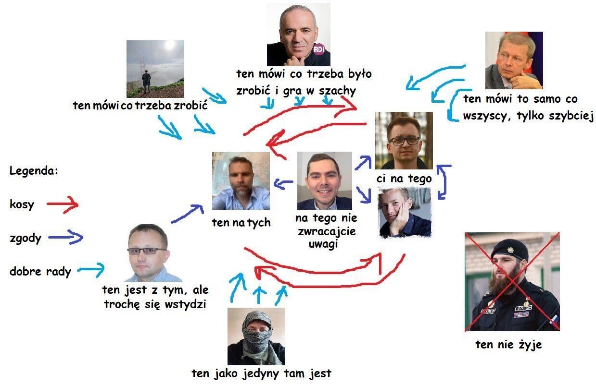
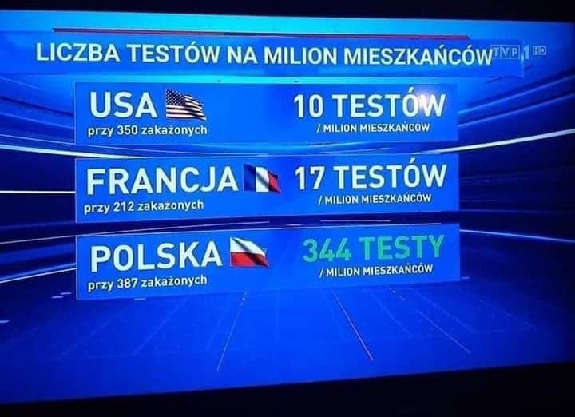
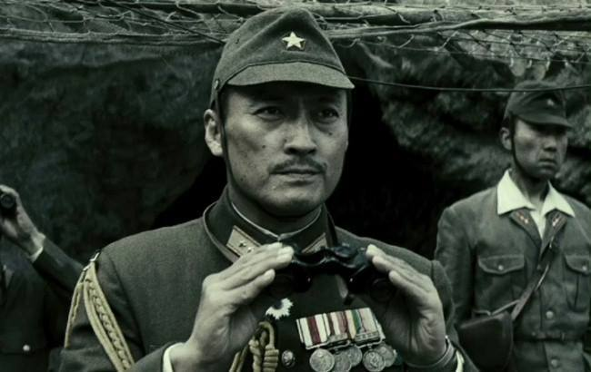
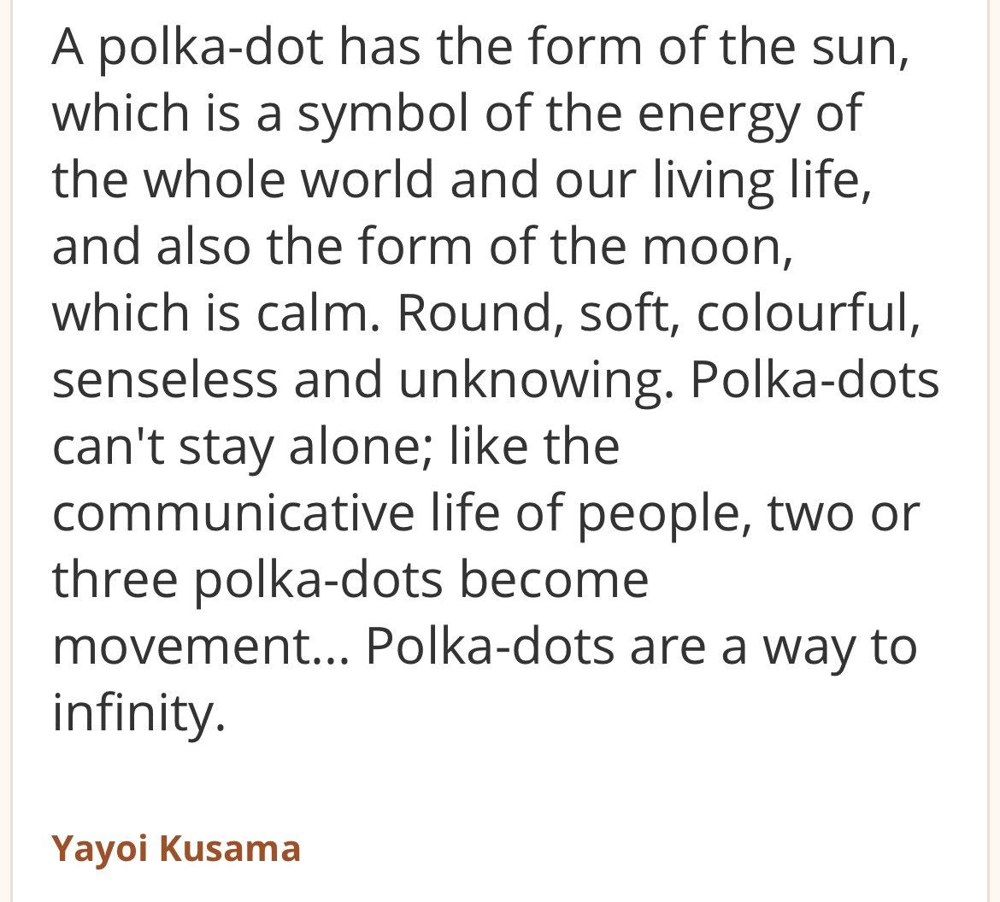

### 2022

Polityka banku centralnego kierowanego przez prezesa Glapińskiego: skupowanie hrywny, nieoprocentowany kredyt dla Mołdawii, 500 plusy dla uchodźców, zwiększanie wydatków na wojsko. PiS chce zmienić konstytucje uwalniając NIEOGRANICZONE środki na armię🤯

> „Jednym z celów wojennych Putina jest destabilizacja krajów sąsiednich poprzez przesiedlenia na dużą skalę.” - minister ds. uchodźców i integracji Nadrenii Północnej - Westfalii Joachim Stamp.

---

  

---

### 2020

To są sowieci. Naprawdę, sowieckie propagandowe myślenie i działanie. Mistrzowie kłamstwa.

TVP.
Obrazek ma pokazać, że testów robimy najwięcej na 1 milion mieszkańców.
W przypadku Polski użyto danych z ostatnich 24h przed publikacją materiału. W przypadku USA i Francji z 29 lutego 2020.

Przekaz skrojony pod kampanię prezydencką: patrzcie jak dajemy radę, jacy jesteśmy dobrzy, jak my was chronimy. A fakty są takie, że kiedy u nas wykonano 5000 testów w całej Polsce, w samym Berlinie wykonywano 5000 testów dziennie. Ale oni wykorzystają wszystko, żeby zrobić propagandę sukcesu. W tym także przekłamywanie sytuacji w takim momencie jak pandemia. We Francji aktualnie przeprowadza się 4000 testów dziennie.

  

### 1945

Zginął w walce Tadamichi Kuribayashi japoński generał, dowódca obrony wyspy Iwo Jima.
Kuribayashi najprawdopodobniej z samurajskim mieczem w dłoni osobiście poprowadził ostatni kontratak. Wcześniej zdjął dystynkcje, aby walczyć jako zwykły żołnierz i jako taki, nierozpoznany, pochowany został we wspólnym grobie wśród swoich ludzi.
Częściowo na podstawie listów generała do rodziny, w 2006 powstał amerykański dramat wojenny pt. Listy z Iwo Jimy. W postać Kuribayashiego wcielił się japoński aktor Ken Watanabe. Bitwa o Iwo Jimę pochłonęła życie ok. 21 tys. żołnierzy japońskich oraz ok. 7 tys. amerykańskich.

  

### 1929

https://pl.wikipedia.org/wiki/Yayoi_Kusama

  

---

<a href="https://github.com/TomaszWaszczyk/historia.waszczyk.com/edit/master/src/content/march-22.md" target="_blank">Edytuj tę stronę dzieląc się własnymi notatkami!</a>
