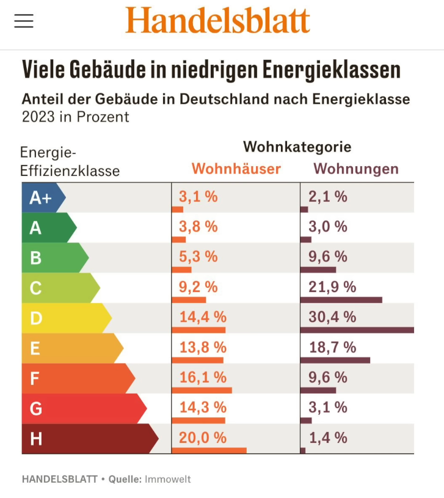
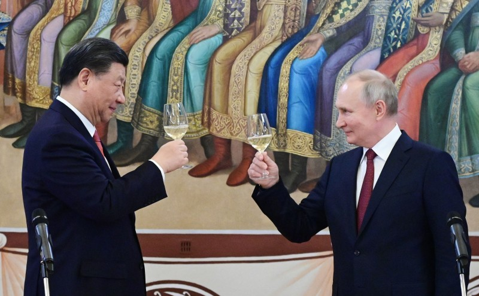

### 2024

> żyd, nie żyd, byle wypłacalny był

---

  

Pope Francis denounces 'anti-vaxxers,' calls COVID jab refusal an 'almost suicidal act of denial' -
"The pontiff rebuked those who did not receive an injection, or who voiced opposition to them publicly, saying:
Deciding whether to get vaccinated is always an ethical choice, but I know that many people signed up to movements opposed to the administration of the medication. This distressed me because in my view, being against the antidote is an almost suicidal act of denial.

Francis also made a thinly-veiled condemnation of Cardinal Raymond Burke, who voiced strong opposition to the injections and who was also hospitalized with COVID-19 and serious health issues.
“There were even a few anti-vaxxers among the bishops: some came close to death,” stated Francis, echoing a veiled dig he made at the American cardinal in 2021.
Referring to the COVID-related lockdowns as a “grim scenario,” Francis stated that “[t]his grim scenario began to change with the arrival of the first vaccines,” failing to mention the multitude of side effects linked to the rollout of the experimental jabs, including upticks in heart, brain and blood diseases, among others issues.
The pontiff, who has remained an outspoken promoter of the injections from the start, opined that “a generalized fear was created when superficial explanations of how the vaccines worked spoke of injections of the virus into the body. There were also claims there was nothing but water in the vials; some people even stated publicly that microchips were being implanted in people.”

---

  

<a href="./documents/march/Modernizacja-budynkow.pdf" target="_blank">Modernizacja budynków</a>

https://retrofithub.eu/pl/

### 2023

Putin:

> We are in favor of using the Chinese yuan for settlements between Russia & countries of Asia, Africa & Latin America

<video width="640" height="480" controls>
<source src="./movies/march/putin_currency.mp4" type="video/mp4">
Your browser does not support the video tag.
</video>

Already, two-thirds of trade between our countries is done in rubles & yuan.

This is big for China. Yuan is new reserve currency.

  

---

<video width="640" height="480" controls>
<source src="./movies/march/xi_putin.mp4" type="video/mp4">
Your browser does not support the video tag.
</video>

Xi: Change is coming that hasn't happened in 100 years. And we are driving this change together.

Putin: I agree.

Xi: Please, take care, dear friend.

Putin: Have a safe journey!

This is the new geopolitical reality. A China-Russia alliance!

---

### 2022

Polityka banku centralnego kierowanego przez prezesa Glapińskiego: skupowanie hrywny, nieoprocentowany kredyt dla Mołdawii, 500 plusy dla uchodźców, zwiększanie wydatków na wojsko. PiS chce zmienić konstytucje uwalniając NIEOGRANICZONE środki na armię🤯

> „Jednym z celów wojennych Putina jest destabilizacja krajów sąsiednich poprzez przesiedlenia na dużą skalę.” - minister ds. uchodźców i integracji Nadrenii Północnej - Westfalii Joachim Stamp.

---

  

  

---

<video width="640" height="480" controls>
<source src="./movies/march/slovakia.mp4" type="video/mp4">
Your browser does not support the video tag.
</video>

---

<a href="./documents/march/strategia_w_sytuacji_zmniejszenia_zagrozenia_epidemicznego_covid-19_2022.03.22.pdf" target="_blank">Zmiana strategii</a>

---

### 2020

To są sowieci. Naprawdę, sowieckie propagandowe myślenie i działanie. Mistrzowie kłamstwa.

TVP.
Obrazek ma pokazać, że testów robimy najwięcej na 1 milion mieszkańców.
W przypadku Polski użyto danych z ostatnich 24h przed publikacją materiału. W przypadku USA i Francji z 29 lutego 2020.

Przekaz skrojony pod kampanię prezydencką: patrzcie jak dajemy radę, jacy jesteśmy dobrzy, jak my was chronimy. A fakty są takie, że kiedy u nas wykonano 5000 testów w całej Polsce, w samym Berlinie wykonywano 5000 testów dziennie. Ale oni wykorzystają wszystko, żeby zrobić propagandę sukcesu. W tym także przekłamywanie sytuacji w takim momencie jak pandemia. We Francji aktualnie przeprowadza się 4000 testów dziennie.

  

### 1945

Zginął w walce Tadamichi Kuribayashi japoński generał, dowódca obrony wyspy Iwo Jima.
Kuribayashi najprawdopodobniej z samurajskim mieczem w dłoni osobiście poprowadził ostatni kontratak. Wcześniej zdjął dystynkcje, aby walczyć jako zwykły żołnierz i jako taki, nierozpoznany, pochowany został we wspólnym grobie wśród swoich ludzi.
Częściowo na podstawie listów generała do rodziny, w 2006 powstał amerykański dramat wojenny pt. Listy z Iwo Jimy. W postać Kuribayashiego wcielił się japoński aktor Ken Watanabe. Bitwa o Iwo Jimę pochłonęła życie ok. 21 tys. żołnierzy japońskich oraz ok. 7 tys. amerykańskich.

  

### 1929

https://pl.wikipedia.org/wiki/Yayoi_Kusama

  

---

<a href="https://github.com/TomaszWaszczyk/historia.waszczyk.com/edit/master/src/content/march-22.md" target="_blank">Edytuj tę stronę dzieląc się własnymi notatkami!</a>
