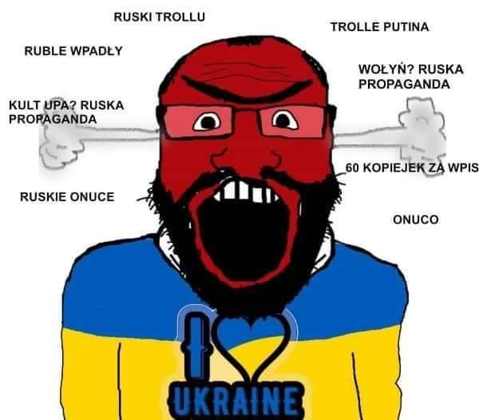

### 2022

> Adam Niedzielski: "Jesteśmy humanitarni i dlatego nie testujemy na granicy uchodźców wojennych z ukrainy".

  

  

### 2021

The Federal Reserve Is No Longer Publishing The M2

Translation:

The American Central Bank

Will No Longer Tell You

How Much Money They Are Printing

  

(True for February and March, 2021)

### 2020 - Fed Unleashes Unprecedented Measures to Shore Up Reeling Economy (like infinite QE??)

## Federal Reserve announces extensive new measures to support the economy

The Federal Reserve is committed to using its full range of tools to support households, businesses, and the U.S. economy overall in this challenging time. The coronavirus pandemic is causing tremendous hardship across the United States and around the world. Our nation's first priority is to care for those afflicted and to limit the further spread of the virus. While great uncertainty remains, it has become clear that our economy will face severe disruptions. Aggressive efforts must be taken across the public and private sectors to limit the losses to jobs and incomes and to promote a swift recovery once the disruptions abate.

The Federal Reserve's role is guided by its mandate from Congress to promote maximum employment and stable prices, along with its responsibilities to promote the stability of the financial system. In support of these goals, the Federal Reserve is using its full range of authorities to provide powerful support for the flow of credit to American families and businesses. These actions include:

- Support for critical market functioning. The Federal Open Market Committee (FOMC) will purchase Treasury securities and agency mortgage-backed securities in the amounts needed to support smooth market functioning and effective transmission of monetary policy to broader financial conditions and the economy. The FOMC had previously announced it would purchase at least $500 billion of Treasury securities and at least $200 billion of mortgage-backed securities. In addition, the FOMC will include purchases of agency commercial mortgage-backed securities in its agency mortgage-backed security purchases.

- Supporting the flow of credit to employers, consumers, and businesses by establishing new programs that, taken together, will provide up to $300 billion in new financing. The Department of the Treasury, using the Exchange Stabilization Fund (ESF), will provide $30 billion in equity to these facilities.

- Establishment of two facilities to support credit to large employers – the Primary Market Corporate Credit Facility (PMCCF) for new bond and loan issuance and the Secondary Market Corporate Credit Facility (SMCCF) to provide liquidity for outstanding corporate bonds.

- Establishment of a third facility, the Term Asset-Backed Securities Loan Facility (TALF), to support the flow of credit to consumers and businesses. The TALF will enable the issuance of asset-backed securities (ABS) backed by student loans, auto loans, credit card loans, loans guaranteed by the Small Business Administration (SBA), and certain other assets.

- Facilitating the flow of credit to municipalities by expanding the Money Market Mutual Fund Liquidity Facility (MMLF) to include a wider range of securities, including municipal variable rate demand notes (VRDNs) and bank certificates of deposit.

- Facilitating the flow of credit to municipalities by expanding the Commercial Paper Funding Facility (CPFF) to include high-quality, tax-exempt commercial paper as eligible securities. In addition, the pricing of the facility has been reduced.

In addition to the steps above, the Federal Reserve expects to announce soon the establishment of a Main Street Business Lending Program to support lending to eligible small-and-medium sized businesses, complementing efforts by the SBA.

The PMCCF will allow companies access to credit so that they are better able to maintain business operations and capacity during the period of dislocations related to the pandemic. This facility is open to investment grade companies and will provide bridge financing of four years. Borrowers may elect to defer interest and principal payments during the first six months of the loan, extendable at the Federal Reserve's discretion, in order to have additional cash on hand that can be used to pay employees and suppliers. The Federal Reserve will finance a special purpose vehicle (SPV) to make loans from the PMCCF to companies. The Treasury, using the ESF, will make an equity investment in the SPV.

The SMCCF will purchase in the secondary market corporate bonds issued by investment grade U.S. companies and U.S.-listed exchange-traded funds whose investment objective is to provide broad exposure to the market for U.S. investment grade corporate bonds. Treasury, using the ESF, will make an equity investment in the SPV established by the Federal Reserve for this facility.

Under the TALF, the Federal Reserve will lend on a non-recourse basis to holders of certain AAA-rated ABS backed by newly and recently originated consumer and small business loans. The Federal Reserve will lend an amount equal to the market value of the ABS less a haircut and will be secured at all times by the ABS. Treasury, using the ESF, will also make an equity investment in the SPV established by the Federal Reserve for this facility. The TALF, PMCCF and SMCCF are established by the Federal Reserve under the authority of Section 13(3) of the Federal Reserve Act, with approval of the Treasury Secretary.

These actions augment the measures taken by the Federal Reserve over the past week to support the flow of credit to households and businesses. These include:

- The establishment of the CPFF, the MMLF, and the Primary Dealer Credit Facility;
- The expansion of central bank liquidity swap lines;
- Steps to enhance the availability and ease terms for borrowing at the discount window;
The elimination of reserve requirements;
- Guidance encouraging banks to be flexible with customers experiencing financial challenges related to the coronavirus and to utilize their liquidity and capital buffers in doing so;
- Statements encouraging the use of daylight credit at the Federal Reserve.

Taken together, these actions will provide support to a wide range of markets and institutions, thereby supporting the flow of credit in the economy.

The Federal Reserve will continue to use it full range of tools to support the flow of credit to households and businesses and thereby promote its maximum employment and price stability goals.

---

> Miarą niewydolności ochrony zdrowia i nieudolności Państwa jest liczba zbiórek i apeli dyrektorów oraz pracowników placówek medycznych dotyczących dostarczania im brakujących środków ochrony indywidualnej. - Bartek Fiałek

---

## UBI w Niemczech

Mało kto zwrócił uwagę na listopadową decyzję niemieckiego Sądu Najwyższego w Karlsruhe. I pewnie nawet sami sędziowie nie wiedzą, że nie mniej ni więcej tylko zalegalizowali pierwszy w historii Minimalny Dochód Gwarantowany (UBI). Nie żaden eksperyment, żadne tam intelektualne harce, ale pierwszy powszechny dochód – gwarantowana płaca minimalna, którą otrzymywać może każdy Niemiec, niezależnie od czy szuka pracy, czy się od niej miga. Średnio, jakieś 1120 euro miesięcznie.

Rzecz teraz robi się głośna w związku z rozmaitymi przymiarkami do zapewnienia bezpieczeństwa finansowego Niemcom w dobie pandemii. Okazuje się, że nic już nie trzeba robić, niczego nie trzeba zmieniać w przepisach. Zgodnie z nowym prawem i tak każdemu Niemcowi należy się wypłata.

Jednym z powodów dla których niemieckie UBI mogło umknąć mediom, jest to, że sprawa dotyczyła czegoś zupełnie innego. Chdziło o ewentualne kary, jakie mogą ponieść odbiorcy świadczeń Hartz-IV (systemu zasiłkowego), za „nie podejmowanie zdecydowanych kroków prowadzących do uniezależnienia się od pomocy państw ”. Hartz-IV to zmyślna konstrukcja pomocowa, niegdyś tak zaprojektowana, żeby skutecznie wyłapywać tych, którzy nadużywają systemu. Prawo wyraźnie mówiło, że beneficjenci uznani za zdolnych do pracy mają obowiązek przedstawiać urzędnikom dowody, że usiłowali znaleźć pracę, w innym razie ponoszą karę wysokości 10% 3 miesięcznych zasiłków. (jakieś 300 euro) Łącznie kary mogły sięgnąć nawet 100%, a w ekstremalnych przypadkach mogły skutkować odebraniem ubezpieczenia zdrowotnego.

W listopadzie niemiecki Sąd Najwyższy uznał to za niekonstytucyjne. Według sędziów, rząd federalny nie udowodnił, że przepis dopuszczający 100 procentową karę był uzasadniony interesem społecznym, gwarantował, że beneficjent się poprawi i wróci do pracy. Sąd uznał to za naruszenie godności, które zgodnie z konstytucją parlament powinien uwzględnić w swoich zapisach.

Tak więc, mimo że sędziowie orzekali w sprawie o skuteczności sankcji, werdykt nakłada sztywny limit 30% podstawowego ​świadczenia (z wyłączeniem czynszu), które należy się każdemu Niemcowi, niezależnie z jakich powodów nie podejmuje pracy. Nawet jeżeli jej otwarcie unika.

Zawsze należy mu się:

Dodatek do żywności: 300 euro.

Koszty zakwaterowania około: 500 euro (przy czym dla jednej osoby „odpowiednie warunki mieszkaniowe” definiuje się jako dowolne miejsce o powierzchni do 50 metrów kwadratowych co w niektórych miastach może wynieść nawet 700 euro)Ubezpieczenie zdrowotne: 320 euro

Łącznie 1120 euro!

Oficjalnie Niemcy nie wprowadziły gwarantowanego dochodu, ale jeżeli przyjrzymy się definicji (UBI) to obecny program wypełnia wszystkie znamiona socjalistycznego raju. „Usunięcie tyranii pracy” bez żadnych warunków wstępnych. Co teoretycznie ma wszystkim pozwolić swobodnie tworzyć wielkie rzeczy, pisać książki, rzeźbić i co tam komu jeszcze zagra w duszy, nie oglądając się na pieniądze.

UBI MA JUŻ 300 LAT! Idea, gwarantowanego dochodu sięga końca XVIII wieku i głośnego wówczas eseju brytyjskiego filozofa i publicysty Thomasa Paina, który dowodził, że w zamian za gwarancje utrzymania porządku społecznego, w tym nietykalności własności prywatnej, rządy powinny gwarantować każdemu obywatelowi bez ziemi i posesji, 15 funtów rocznie. Taka swoista łapówka za to, że biedota zrezygnuje z wzniecania powstań i buntów.

Coś co jeszcze kilka lat temu wydawało się utopią rodem z wczesnego Marksa, dziś staje się przedmiotem poważnych debat, naukowych eksperymentów. I co ciekawe, uniwersalny dochód podstawowy (Universal Basic Income UBI) znajduje zwolenników wśród modnych lewicowych ekonomistów, jak i twardych orędowników wolności rynkowych. Ci ostatni wychodzą z założenia, że taniej i prościej będzie wypłacać bezrobotnym umowną sumę, niż budować skomplikowany system pomocy socjalnej. Koncept doczekał się już tylu naukowych publikacji, wyliczeń i znanych osobistości ​wspierających rewolucję socjalną, że dojrzał też do własnych eksperymentów na żywych ludziach.

Ostatnio Finlandia zakończyła dwuletni eksperyment z uniwersalnym dochodem podstawowym, pomysł promowany przez wybitne postaci jako najlepsza odpowiedź na rosnącą automatyzację i nierówny rozkład dochodów.

W eksperymencie rząd zapewniał gwarantowane wynagrodzenie miesięczne w wysokości 560 euro miesięcznie dla 2000 bezrobotnych i porównał skutki z grupą kontrolną bezrobotnych na zwykłej pomocyspołecznej. Fiński rząd chciał przetestować teorię, że UBI może zwiększyć podaż siły roboczej i poziom zatrudnienia. Pod tym względem była to porażka.

To nie był pierwszy taki eksperyment. Podobne programy odpalane były w Stanach Zjednoczonych w latach 1968-72. Największy i dotąd najdłuższy eksperyment miał miejsce w latach 1974 -79 w Dauphin, w miasteczku w kanadyjskiej prowincji Manitoba. Przez pięć lat, każdy najbiedniejszy rezydent miasteczka otrzymywał co miesiąc wsparcie gwarantujące mu zarobki na poziomie średniej krajowej. Po pięciu latach, rządy w Kanadzie przejęli konserwatyści i z tygodnia na tydzień, program spakowano w 1800 pudeł osobowych ankiet i obserwacji socjologicznych, które zdeponowano w piwnicy. Kanadyjscy uczeni, którzy w 2018 roku zeszli do podziemi Universityof Manitoba i wydobyli pudła z danymi jakie zostały, wybrali się też specjalnie do Dauphin, żeby po 37 latach porozmawiać z mieszkańcami o tym jak eksperyment zmienił ich życie. Po pierwsze, mało kto w miasteczku pamiętał jeszcze o eksperymencie. Z kolei ci, którzy coś mogli o tym powiedzieć, nie zapamiętali tego jako coś szczególnego w ich życiu. Osoby, które dorastały w tym czasie w biednych rodzinach, nie pamiętają, żeby coś zmieniło się w domu. Gorzej: osoby, które wyrwały się z matni ubóstwa to były osoby, które wyjechały do dużych miast i skończyły studia dzięki stypendiom dawanym najbardziej utalentowanej młodzieży. Jedyne, co uczonym udało się dostrzec, to studiując lokalne gazety z tamtego okresu, zaobserwowali brak rąk do pracy przy dorywczych robotach. Bezrobocie jako takie nie spadło ani nie wzrosło w okresie manny z nieba. Ludzie najwyraźniej nic w swoim życiu nie zmienili - najlepszy dowód, że po zamknięciu programu, niemal tyle samo osób co ​wcześniej i z tych samych rodzin, ponownie znalazło się na listach pomocy społecznej.

A wy się martwiliście o spustoszenie jakiego wirus dokona w gospodarce?

---

WHO:

Treating #COVID19 w/ #Hydroxychloroquine could cause a drug shortage

---

## Niemcy z 350 mld euro nowego długu

Z punktu widzenia rynków finansowych zdecydowanie bardziej szokujące od naszych rozwiązań jest to, co wymyślono w Niemczech. Według niemieckiej prasy rząd w Berlinie ma dziś na posiedzeniu przyjąć spory pakiet pomocowy. Kluczowe dla rynków jest to, że ma on być w większości sfinansowany długiem, co w przypadku Niemiec oznacza radykalne zerwanie z dotychczasową polityką nadwyżek budżetowych i ograniczania emisji nowych obligacji.

### 2009

> The desirable goal of reforming the international monetary system is to create an internation reserve currency that is disconnected from individual nations and is able to remain stable in the long run, thus removing the inherent deficiencies caused by using credit-based national currencies. - Dr Zhou Xiaochuan, Governor of the Poeple's Bank of China

### 2008

W Paryżu zmarła Alina Margolis-Edelman, polska lekarz pediatra i działaczka humanitarna żydowskiego pochodzenia. Pierwowzór Ali z Elementarza Mariana Falskiego. Kawaler Orderu Uśmiechu. Prywatnie żona Marka Edelmana. Urodziła się w Łodzi w rodzinie żydowskiej, jako córka lekarza i działacza społecznego Aleksandra Margolisa (1887–1939) i Anny z domu Markson (1892–1986). W czasie II wojny światowej Alina Margolis przebywała w warszawskim getcie, gdzie była pielęgniarką w szpitalu dziecięcym.  Swoje wspomnienia z dnia codziennego w getcie, a także wspomnienia z pobytu po ,,aryjskiej'' stronie spisała na kartach książki pt. ,,Tego, co mówili, nie powtórzę...'' Była uczestniczką Powstania w getcie warszawskim , a także w Powstania warszawskiego - w tym ostatnim działała w oddziale ,,Bakcyl" (Sanitariat Okręgu Warszawskiego Armii Krajowej). Odznaczono ją Krzyżem Walecznych za męstwo i odwagę. Po wojnie została lekarzem pediatrą, pracowała m.in. w II Klinice Pediatrycznej w Łodzi. Była twórczynią programu leczenia cukrzycy u dzieci, a potem dziecięcej nefrologii. W 1968 po wydarzeniach marcowych i rozpętanej kampanii antysemickiej nie pozwolono jej na kontynuację pracy naukowej, odrzucając rozprawę habilitacyjną, dotyczącą teorii typów cukrzycy. Wyjechała do Francji. Poświęciła się działalności humanitarnej m.in. współtworząc polską sekcję francuskiej organizacji charytatywnej Lekarze Świata. Pracowała na statkach-szpitalach, wyławiających na morzu Południowochińskim uciekinierów z komunistycznego Wietnamu, a także w szpitalach w Salwadorze, Czadzie, Afganistanie oraz Bośni i Hercegowinie, gdzie podczas wojny domowej współtworzyła m.in. ośrodek wsparcia dla ofiar gwałtów. Była również współzałożycielką Biura Pomocy Inicjatywom Społecznym. Po wybuchu stanu wojennego w Polsce w 1981 roku organizowała pomoc dla opozycji demokratycznej. Dziesięć lat później z jej inicjatywy zarejestrowana została w Warszawie Fundacja Dzieci Niczyje - organizacja, której celem jest chronienie dzieci przed przemocą i niesienie pomocy tym dzieciom, które zostały skrzywdzone. Od 2011 osobom pomagającym krzywdzonym dzieciom przyznaje się nagrodę im. Aliny Margolis-Edelman.

  

### 1942

Zatwierdzony został tzw Generalny Plan Budowy Obozu Koncetracyjnego w Majdanku. Plan ten był efektem wizyty Heinricha Himmlera w Lublinie w lipcu 1941 roku, kiedy to powierzył on dowódcy SS i policji w dystrykcie lubelskim Odilowi Globocnikowi zadanie zbudowania obozu „dla 25-50 tys. więźniów, którzy byliby wykorzystywani w warsztatach oraz na budowach SS i policji”. Obóz miał stanowić rezerwuar darmowej siły roboczej dla realizacji planów budowy imperium germańskiego na Wschodzie. Wspomniana koncepcja zakładała i jeńców. Tym samym Majdanek miał się stać największym obozem w okupowanej Europie.

  

### 1941

W niemieckim obozie koncentracyjnym Auschwitz-Birkenau został zamordowany inżynier mechanik Tadeusz Tański - syn Czesława, absolwent warszawskiej Szkoły Handlowej oraz paryskiej Ecole d'Electricite Industriel de Paris, światowej sławy konstruktor samochodów, silników spalinowych samochodowych i lotniczych (w 1916 roku skonstruował największy na świecie lotniczy silnik 12-cylindrowy o mocy 520 KM z układem cylindrów w kształcie litery ,,H'' przeznaczony dla wodnopłatowców zwalczających okręty podwodne). Inżynier Tański był konstruktorem pierwszego polskiego samochodu pancernego o nazwie Ford FT-B. Samochody tej marki, wyprodukowane w ilości 20 sztuk, brały udział w wojnie polsko-bolszewickiej w 1920 roku. Trzy lata później opracował konstrykcję pierwszego polskiego samochodu osobowego o nazwie CWS T-1. W czasie okupacji hitlerowskiej inżynier zaangażował się w działalność konspiracyjną. 3 lipca 1940 roku został aresztowany przez Niemców w ramach Akcji AB i uwięziony na Pawiaku, a następnie został przetransportowany do KL Auschwitz-Birkenau, gdzie zginął.

  

---

<a href="https://github.com/TomaszWaszczyk/historia.waszczyk.com/edit/master/src/content/march-23.md" target="_blank">Edytuj tę stronę dzieląc się własnymi notatkami!</a>
