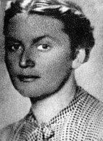

### 2020

W Mennicy Polskiej sztabki złota wykupione.

Dzisiejsze notowania ceny złota osiągnęły (jak dotąd) poziom ok. 1695 dol za uncję. Wzrost ceny od wczoraj wynosi ponad 120 dolarów. Krajowi, ale i europejscy hurtownicy i dealerzy złota bulionowego ograniczyli, a niektórzy nawet zawiesili biznes w związku z brakami bulionu. Okres oczekiwania na dostawę srebra sięga już 3 miesięcy i ciągle się wydłuża. Za rosnącym popytem nie nadążają - i to jest bardzo dziwne - ceny metali szlachetnych. Ceny oderwały się od fundamentów, jak się powszechnie podejrzewa, wskutek interwencji potentatów bankowych, którzy walczą ze wzrostem popytu na złoto. Jak wiadomo, złoto jest jedynym skutecznym antidotum na inflację, która z kolei jest narzędziem w rękach bankowości centralnej pozwalającym na osłabianie siły nabywczej pieniądza, a tym samym deprecjonowanie oszczędności i kapitału obywateli. Szczególnie energiczną akcję deprecjonowania pieniądza (dolara) prowadzi amerykański FED. Wzrost ceny złota zaczyna ujawniać fiasko tej polityki monetarnej. Dolar od rana traci na wartości.

---

https://en.wikipedia.org/wiki/Terror_management_theory

---

Tomasz Wróblewski (WEI): Do spięcia budżetu może zabraknąć nawet 50 mld zł. To byłby jeden z najgorszych wyników jakie mieliśmy. Mieliśmy bardzo ambitny budżet. Rzeczywiście wydawało się, że będzie on zrównoważony, ale on był ambitny przy dość ambitnych założeniach, którego wzrost był gdzieś na poziomie prawie 4 proc. Wiemy już, że tego nie będzie. Z pierwszych szacunków, jakie do nas docierają i które są przygotowywane wynika, że może do spięcia budżetu może zabraknąć nawet 50 mld zł. To byłby jeden z najgorszych wyników jakie mieliśmy. Przypomnę, że w 2016 r. brakowało ok.43-44 mld zł i to był bardzo trudny rok, jeżeli chodzi o wychodzenie polskiego budżetu, także tutaj musimy się przygotować na trudny okres

---

  

---

  

---

## Interwencja rządu

Po interwencji polskiego rządu, 24. marca 2020r., weszła w życie decyzja o zawieszeniu sprzedaży środków ochrony indywidualnej i produktów dezynfekcyjnych na terytorium Polski. Taką informację podał na swojej stronie portal Alibaba – Alibaba International to holding będący jednym z największych przedsiębiorstw na świecie.
Ta decyzja jest mieczem obosiecznym.
Z jednej strony to przeciwstawienie się nieuczciwej chęci dorobienia się na tragedii poprzez kupowanie znacznych ilości środków ochrony osobistej i produktów dezynfekcyjnych oraz następowa spekulacja (w celu osiągnięcia maksymalnego zysku).
Z drugiej jednak strony, to uniemożliwienie zakupu potrzebnych środków uczciwym przedsiębiorcom, którzy prowadzą np. działalność medyczną.
Tak więc w najbliższym czasie możemy spodziewać się zawieszania działalności kolejnych prywatnych placówek zdrowotnych, a jak doskonale wiemy, z powodu skrajnej niewydolności publicznego systemu opieki zdrowotnej, udział sektora prywatnego w ochronie zdrowia jest bardzo duży.
Mając na uwadze fakt, że choroba wywoływana przez koronawirusa (COVID-19) nie jest jedyną na świecie, takie reglamentacje mogą wpłynąć bardzo negatywnie na zdrowie i życie obywateli.
A na to wszystko rzecznik Ministerstwa Zdrowia powiedział, żeby nie zgłaszać informacji o brakach środków ochrony indywidualnej do resortu zdrowia, bo zostaną zasypani pismami i e-mailami. Bareja nie wymyśliłby lepszej sceny.
B. Fiałek

---

The world economy has never shut down this fast. In the U.S., virus-related layoffs are expected to be measured in the millions and soon. For insight into what's coming, we found someone with responsibilities over the economy now and who helped pull the U.S. out of the Great Recession of 2008. That person is Neel Kashkari, president of the Federal Reserve Bank of Minneapolis. In 2008, he was the Treasury official in charge of the $700 billion rescue of the financial system. We met Kashkari this past Thursday for an eye-opening look at the stock market freefall, the near-freeze in the bond markets and a prediction for this economic emergency.

Neel Kashkari: Millions of people are gonna lose their jobs. And that's what's so scary about this.

Scott Pelley: Are we in a recession?

Neel Kashkari: If we're not right now, we will be soon. My base case scenario is we'll at least have a mild recession like after 9/11. The worst case would be we'd have a deep recession like the 2008 financial crisis. We just don't know right now.

Scott Pelley: And what's keeping us from knowing with any certainty?

Neel Kashkari: Nobody knows how the virus is gonna progress, how many Americans are gonna get it, how effective is social distancing going to be, how long will it take the health care system to catch up?

Scott Pelley: Nationwide, last week there were almost 300,000 people filing first claims for unemployment benefits.

Neel Kashkari: It could be five times that amount next week. Maybe more.

Scott Pelley: Where is the bottom?

Neel Kashkari: If this is a three-month shutdown, we'll find the bottom pretty soon. If this is a year-long shutdown, this could be very damaging to the U.S. economy, and most importantly, to the American people.

46-year-old Neel Kashkari has been president of the Federal Reserve Bank of Minneapolis since 2016. He's the son of Indian immigrants and literally a rocket scientist. As an engineer, he worked on NASA spacecraft. After Wharton business school, he joined investment firm Goldman Sachs. In 2008, as assistant Treasury secretary, Kashkari ran the $700 billion troubled asset relief program, known as TARP, that helped end the Great Recession. Kashkari was the Republican nominee for governor of California in 2014. Today, he is one of 12 Federal Reserve regional bank presidents who oversee and support the nation's largest banks.

Neel Kashkari: I heard from a bank in our region, a well-to-do customer came in and said, "I wanna withdraw $600,000 of cash." Now, we can supply all the cash that the banks need to meet their customers' concerns. But it just speaks to the fear and the uncertainty that is rippling through the economy.

Scott Pelley: Will the Federal Reserve ensure that banks have all the cash they need to satisfy whatever withdrawals may be coming?

Neel Kashkari: Yes. This is the fundamental reason the Federal Reserve exists. We call it lender of last resort, this is literally why central banks exist. If everybody gets scared at the same time and they demand their money back, that's why the Federal Reserve is here, is to make sure that there's liquidity, that there's money to meet those demands. We will absolutely meet those demands.

Scott Pelley: Is the Fed just going to print money?

Neel Kashkari: That's literally what Congress has told us to do. That's the authority that they've given us, to print money and provide liquidity into the financial system. And that's how we do it. We create it electronically. And then we can also print it with the Treasury Department, print it so that you can get money outta your ATM.

Scott Pelley: Are the banks sound?

Neel Kashkari: They are right now. Now, we're hearing from big businesses across the country, including in Minnesota, that big businesses are drawing down their credit lines. They're borrowing money from the banks just because they're nervous. And if they're all drawing down these credit lines at the same time, it puts stress on the banking system. And that's where the Federal Reserve steps in to provide that liquidity to make sure that the banks have enough money to get out to their customers.

The Dow has tumbled about 35%. But something else is wrong. Some investors lost confidence in bonds which normally do well in troubled times. The bond markets finance government, corporations, and by extension, homebuyers.

Scott Pelley: And the stresses you're seeing in the bond market are what?

Neel Kashkari: Well, we were seeing stresses this week in the Treasury market and in the mortgage backed security market. And that's why the Fed stepped in with this very aggressive action to provide liquidity to those markets. We saw stresses in the commercial paper market, which is another type of bond market. And we're still seeing stresses in the municipal market, where state governments and cities fund themselves, and in the corporate bond market. So, we're not outta the woods yet.

Scott Pelley: And by stresses, you mean what?

Neel Kashkari: There's just a freezing up of new financings for corporations. That's something I'm very focused on. We need to get that market open again. Because we don't want blue-chip American companies, who have customers, who are operating, we don't want this virus to creep into their businesses because they're not able to raise money to meet their basic operational needs. We need them to keep running.

Scott Pelley: Solid blue-chip American companies are having trouble borrowing money?

Neel Kashkari: It's more expensive for them to borrow money. Say someone's saying, "I'm gonna go issue $1 billion of debt to go fund my new factory," those aren't taking place right now.

Scott Pelley: People are shunning U.S. Treasury Bonds, which are always thought to be the safest possible investment?

Neel Kashkari: It is. Now, keep in mind, Treasury Bond prices are still very high relative to history. They've just been just not quite as high as they were a few weeks ago. So they still are viewed as a very safe investment, very attractive for a lotta people. But this fear of where the virus is going to go is leading people to say, "I just want cash. And if that's cash under my mattress or in my safe, I'll sleep better at night."

Scott Pelley: What's it gonna take to get the bond markets working again?

Neel Kashkari: I think a combination of factors. I think Congress taking bold action to say they're standing behind the U.S. economy, the $1 trillion stimulus they're talking about. I think that'll help. I think continued actions from the Federal Reserve will help. And I think more confidence that the health care system is catching up to the crisis.

This past Sunday, the Fed dropped interest rates nearly to zero. Then every day last week it announced emergency lending programs. It pledged to spend at least $700 billion supporting mortgages, banks, money market mutual funds, corporate bonds and lending to central banks of other countries because the dollar is the currency of world trade.

Neel Kashkari: We're being very aggressive. And I think our chairman, Jay Powell, has learned from the experience of 2008. We're moving much faster than we moved in 2008. We're being more aggressive. Is there more we can do? Yes. Is there more we may end up doing? Yes. But I think we're being very aggressive. I think that's the right thing.

Scott Pelley: Can you characterize everything that the Fed has done this past week as essentially flooding the system with money?

Neel Kashkari: Yes. Exactly.

Scott Pelley: And there's no end to your ability to do that?

Neel Kashkari: There is no end to our ability to do that.

Scott Pelley: What did we learn from 2008 when you were in the Treasury Department? And how is that being applied today?

Neel Kashkari: There are two big mistakes when I look back at 2008 that we made that I think are relevant today. Number one, we were always too slow and too timid in responding to the crisis. The reason is we didn't know how bad it was gonna get. And we didn't wanna overreact. And it turned out it got really, really bad. And the right answer should've been overreacting to try to avoid the devastating recession that we ended up happening. So today, whether it's health care policy makers, fiscal policy makers, which means Congress or the Federal Reserve, we should all be erring on the side of overreacting to try to avoid the worst economic outcomes. And number two, in 2008, we tried to be very targeted in helping homeowners. Only helping homeowners who needed a little bit of help because a lot of Americans were angry at the thought of their neighbor getting a bailout for being irresponsible or so they thought. So we tried to target our program. It ended up we didn't help very many people.We would've been much better off if we had been much more generous in our support for homeowners, deserving and not deserving. We would've had a less crisis. So my advice to Congress as they're designing their programs to help workers and to help small businesses, err on being generous.

Scott Pelley: When America gets back to work, how long does it take to recover from this?

Neel Kashkari: You know, the economy can bounce back fairly quickly. It's the workers that take time. I mean, that's the-- one of the other lessons from 2008. It took more than ten years to put America fully back to work, relative to where they were before the crisis. Ten years. And so that's what we have to try to avoid, having these mass layoffs. We can't have another ten-year recovery.

The deadline for filing taxes, both personal and business, has been postponed until July. This past week, the House and the Senate proposed trillion dollar emergency spending plans. The bills envision sending government checks directly to households, expansion of unemployment insurance, corporate tax cuts and relief for small business. Republicans and Democrats are haggling over the details.

Scott Pelley: Well, what do the small businesses need?

Neel Kashkari: I think that they need forgivable loans. Like, it's much better if we can keep small businesses to retain their workers than to lay them off.  

Scott Pelley: What do you mean by forgivable loans?

Neel Kashkari: I've heard a proposal that if the government made a loan to a small business, if they retain their workers, the government would forgive the loan after a couple years. Just to avoid the mass layoffs that we're starting to see right now.

Scott Pelley: Sort of a bridge loan to get the local restaurant or the local mechanic through this period of time?

Neel Kashkari: That's right. And importantly, keeping their workers employed. That's much better because once people are lost into the sidelines, it just takes a long time to get them back.

The Federal Reserve System as we know it was set up in the Great Depression to regulate big banks, set interest rates and be the source of all cash. That's why every bill in your pocket is inscribed, "Federal Reserve Note." The Fed's mandate is to provide the highest rate of employment with the lowest rate of inflation. But in 2008, it invoked its authority for the first time to take the role of emergency first responder.

Scott Pelley: If the current measures are not enough, what else can the Fed do?

Neel Kashkari: Well, we have very broad authorities with our emergency lending authorities that have to be done in concert with the Treasury secretary. We've announced a couple of those measures this week on money markets and commercial paper as an example. Some people have suggested that we should be providing more support directly to the corporate bond market. And I'm sympathetic with those views and also the municipal market. Making sure that states and cities are able to access the capital markets as well.  So, there's a range of things the Federal Reserve could do. We're far from out of ammunition.

Scott Pelley: Far from out of ammunition. Sunday, the Federal Reserve lowered its benchmark interest rate to zero. Can you go below zero?

Neel Kashkari: In theory, we could. Some countries have. I don't think many of us-- I don't think any of us on the committee think that's a particularly good idea. It creates other challenges for financial markets. But in the last crisis, we've used something called quantitative easing, buying long-term bonds. We've got a lot more experience in how to do that. It didn't trigger inflation. So, there're other tools that we've used before that I think we could also use again in using it aggressively.

States face an enormous surge in unemployment claims. Connecticut alone, which normally has a little over 2,000 claims a week, saw 72,000 last week. When the national number of new claims for unemployment is released Thursday, it's expected to be in the millions. The Fed is watching China and South Korea, where the outbreak appears to be subsiding.

Scott Pelley: What are you seeing in China?

Neel Kashkari: Well-- China appears to be turning back on. And they are telling a very good story that they've got their arms around this, they don't have new cases. But if, at the same time, they're saying lots of people had the disease with no symptoms. So, unless you've tested everybody, how do you know that you've really got this under control? And as you relax the economic control, does the virus simply flare back up again? We just don't know yet.

Scott Pelley: To the person who is about to grab their car keys and go to the ATM and take out $3,000, you say what?

Neel Kashkari: You don't need to. Your ATM is safe. Your banks are safe. There's enough cash in the financial system. And there's an infinite amount of cash at the Federal Reserve. We will do whatever we need to do to make sure that there's enough cash in the banking system.

Scott Pelley: Are you optimistic or pessimistic?

Neel Kashkari: Overall, I'm optimistic. having been at the frontline of the 2008 financial crisis and I saw how devastating that was, we did get through it. It was very painful for millions of Americans. We did get through it. We will get through this crisis.

---

The shock from the program initially weighed on the US dollar, but over time the effect faded. A risk in evaluating this crisis is looking at it from a US or European perspective. It's truly a global event. The moves will ease funding stress, but by underwriting credit risk, the Fed also makes USD-assets more attractive. Contrast that with emerging and developed market central banks that don't have the same capability.

---

  

### 1941

Powstało lubelskie getto. Człowiekiem odpowiedzialnym za jego stworzenie i funkcjonowanie był Odillo Globocnik - dowódca SS na dystrykt lubelski,a także autor Planu Nisko. Zapełnianie getta rozpoczęło się, gdy Wermacht doszedł do Lublina i wypędzając ludzi ze swoich domów trzeba było przygotować miejsce dla żołnierzy niemieckich przygotowujących się do ataku na ZSRR. Już na samym początku istnienia w getcie
więziono 34 tys. Żydów i nieznaną ilość Romów. Praktycznie wszyscy z nich zginęli.
Większość z nich – około 30 tys. – między 17 marca a 11 kwietnia 1942 r. została przeniesiona do obozu w Bełżcu (część z nich przeszła jeszcze przez getto w Piaskach). Niemcy ustalili dzienny limit osób zsyłanych na śmierć na 1400 osób. Pozostałe 4 tys. ludzi zostało najpierw przeniesione do getta na Majdanie
Tatarskim (drugie getto utworzone na przedmieściach Lublina) i tam
zamordowane lub przewiezione na pobliski Majdanek.
W czasie likwidacji getta wysadzono 17 wieczną Synagogę Maharama. Był to typowy dla hitlerowców psychologiczny sposób rozprawiania się z Żydami.

  

### 1940

POGROM WIELKANOCNY

Pogrom wielkanocny był kulminacją przemocy antysemickiej, która narasta na ulicach Warszawy od wybuchu wojny, nasilając się w okresie wczesnej wiosny 1940 r. Pogrom był niemal na pewno silnie inspirowany przez Niemców, jak przypuszcza jego badacz Tomasz Szarota, wywołany celowo dla uzasadnienia zbudowania w Warszawie getta, którego mury zaczęto wznosić kilkanaście dni po ustaniu pogromu.

Po obiedzie na ulicach żydowskich bicie Żydów z wybijaniem szyb. Rodzaj pogromu.

Adam Czerniaków, Dziennik, 24 III 1940 r. [1]

W marcu 1940 r. delegacja przedstawicieli Żydowskiej Samopomocy Społecznej wezwana została do władz niemieckich w Krakowie [2]. Spotkanie dotyczyć miało szerokiego zakresu spraw związanych z sytuacją materialną ludności żydowskiej, lecz jednym z głównych tematów poruszanym przez delegację były wydarzenia mające miejsce w tym czasie w Warszawie. Jak relacjonował w swoim dzienniku w zapisie z 27 III 1940 r. przewodniczący delegacji, prezes warszawskiego Judenratu, Adam Czerniaków: opowiedziałem o pogromach w Warszawie, których nie było od 1880 r. [3]. Pomimo wagi, jaką przypisywali pogromowi jego świadkowie, wydarzenia, do których doszło na ulicach Warszawy w czasie świąt wielkanocnych 1940 r. pozostały do niedawna nieomal zapomniane: nieobecne zarówno we wspomnieniach, jak i w literaturze naukowej. Było to spowodowane przede wszystkim ich umiejscowieniem czasowym. Pomimo dramatyzmu jego wydarzeń, doświadczenie pogromu wielkanocnego zostało w ciągu kilku miesięcy wyparte ze świadomości warszawskich Żydów i obserwatorów ich losu, przez doświadczenie gettoizacji, a potem Zagłady. Pamięć o wydarzeniach pogromu wielkanocnego przywrócił dopiero 60 lat później Tomasz Szarota, który zrekonstruował jego przebieg we wnikliwym artykule umieszczonym w zbiorze poświęconym pogromom w okupowanej Europie [4].

W żydowskich relacjach z pierwszego roku okupacji niemieckiej w Warszawie pojawia się czasem określenie tego okresu jako „nieustającego pogromu.” W grudniu 1940 r., miesiąc po zamknięciu getta warszawskiego, jeden ze współpracowników Podziemnego Archiwum Getta Warszawskiego (Archiwum Ringelbluma) zapisał: W żydowskiej martyrologii nie było jeszcze takiego wypadku żeby pogrom trwał tak długo. Zwykle pogrom trwa dzień, kilka dni, miesiąc. Teraz trwa on bez końca” [5]. Już od października 1939 r. Żydów którzy znaleźli się w okupowanej Warszawie dotknęły pierwsze zarządzenia niemieckie sygnalizujące dalszy kurs polityki antyżydowskiej. Obejmowały one wszystkie grupy społeczne i prowadziły do szybko postępującej pauperyzacji społeczności żydowskiej, z równoczesnym oddzieleniem jej od społeczności polskiej. Obok przemocy sankcjonowanej prawnie, w Żydów uderzały też indywidualne akty przemocy ze strony Niemców: publiczne bicie, szykany, rabunek mienia.

Nasilająca się propaganda antysemicka i przyzwolenie na przemoc w stosunku do Żydów znalazły oddźwięk również w postępowaniu części Warszawiaków. W wielu wspomnieniach żydowskich z pierwszych miesięcy okupacji pojawia się motyw pogłębiającej się przepaści w kontaktach z Polakami, oskarżanych nie tylko o obojętność na terror skierowany przeciwko Żydom, ale również o współudział w prześladowaniach.

Pogrom wielkanocny uznać trzeba więc za kulminację przemocy antysemickiej, która narasta na ulicach Warszawy od wybuchu wojny, nasilając się w okresie wczesnej wiosny 1940 r. Pogrom był niemal na pewno silnie inspirowany przez Niemców, jak przypuszcza jego badacz Tomasz Szarota, wywołany celowo dla uzasadnienia zbudowania w Warszawie getta, którego mury zaczęto wznosić kilkanaście dni po ustaniu pogromu [6].

Pogrom rozpoczął się w Wielki Piątek, 22 Marca 1940 r., masowymi napadami na sklepy żydowskie połączonymi z pobiciami przypadkowych żydowskich przechodniów [7]. Do dalszych ataków dochodziło przez całe święta wielkanocne i w tygodniu poświątecznym, przede wszystkim w żydowskiej części miasta. Miejscami najczęściej pojawiającymi się w opisach przemocy są okolice Placu Żelaznej Bramy i Placu Bankowego, ale, wspominane są też zajścia w innych częściach miasta — m.in. przy ulicy Żurawiej [8]. W czasie pogromu napadano na noszących opaskę z gwiazdą Dawida przechodniów, sklepy żydowskie, prywatne mieszkania i żydowskie instytucje, w tym na siedzibę Rady Żydowskiej. Ofiarami padali przedstawiciele wszystkich grup społecznych: od sklepikarzy po czołowych działaczy społecznych i politycznych [9]. Liczebność grup pogromszczyków oceniana była na dochodzącą do kilkuset osób, przy czym podkreślano, ich dosyć jednolity przekrój społeczny. Mieli to być ludzie marginesu społecznego, do których dołączyli uczniowie, najczęściej wymieniano wśród nich słuchaczy Szkoły Rzemieślniczej im. Michała Konarskiego przy Lesznie 72 [10].

W znajdującej się w Archiwum Ringelbluma relacji „Relacje o traktowaniu Żydów przez ludność polską w Warszawie (wrzesień 1939–październik 1940),” [11] odnajdujemy fragment zatytułowany: „Marzec 1940” dotyczący trzeciego dnia wypadków wielkanocnych. Autorka relacji widzi zdarzenia pogromu z tramwaju nr 21 jadącego z Woli na pl. Teatralny. Trasa tramwaju pozwala jej na obserwację jednego z ataków, do którego dochodzi w okolicy hali Wielopola: Tłumy ludzi — z dala czarna, zwarta masa. Popłoch — żydowscy kupcy w pośpiechu pakują swój towar w ręczne walizki lub kosze, wydostać się stamtąd jednak trudno. Cały plac okrążony masą najrozmaitszych wyrostków, uzbrojonych w sztylety, noże i pałki. Towar wyciągają, niszczą. Niektórzy obładowani oddalają się. Każdego napotkanego Żyda bezlitośnie biją, gdzie się da. [12] Jedną z ofiar jest starszy człowiek. Jak pisze autorka relacji: Tuż przy przystanku tramwajowym starszy Żyd — z zapakowanym w papier bochenkiem chleba — chce wsiąść w tramwaj — z tyłu ktoś go wyciągnął — pałką wręcz dziko bije go po głowie. Ten garbi się, kurczy — usiłuje się obronić. Zostaje okrążony zgrają pomagających bić — chleb wypada z ręki — zanim tramwaj rusza — twarz Żyda zmasakrowana, z ran na głowie leje się krew [13]. Pasażerowie tramwaju pozostają bezsilni. Nie mogą w żaden sposób interweniować. Relację kończy plastyczny opis krajobrazu po pogromie:

Jezdnie i chodniki usiane odpadkami szkła, desek i urządzeń sklepowych. Najrozmaitsze towary w nieładzie porozrzucane. Przed niektórymi sklepami chodnik mieni się w barwy — to wysypane są farby malarskie z beczek. Chłopcy balansują w damskich kapeluszach, zabranych z magazynów. Na zamkniętych drzwiach niektórych sklepów widnieją duże napisy: „Sklep aryjski” albo „Sklep chrześcijański” — to ma służyć jako talizman przed rozgromieniem. Na ogół sklepy stoją otworem, wnętrze opustoszałe [14].

Około trzeciego dnia przeciwko uczestnikom pogromów wystąpiły oddziały samoobrony żydowskiej złożone przede wszystkim z robotników i członków Bundu, choć prawdopodobnie wspomaganego również przez grupy polskich socjalistów. Pomiędzy pogromszczykami a samoobroną żydowską doszło do starć. Nie sposób jednak ustalić dokładnej liczby ofiar i rannych.

Inaczej niż miało to miejsce podczas pogromów w okresie międzywojennym, gdzie polska policja państwowa zazwyczaj reagowała na przemoc antysemicką, pogrom wielkanocny miał miejsce, przynajmniej początkowo, przy braku reakcji policji polskiej. Pojawiały nawet głosy o współudziale policjantów granatowych w rabunku i ich przychylności dla pogromszczyków. Pogromowi przeciwstawił się za to kościół katolicki i polskie podziemie, choć nie miało to przełożenia na masową pomoc polskich świadków pogromu dla atakowanych [15].

W swojej analizie jako kluczową grupę w przeprowadzeniu pogromu wielkanocnego Tomasz Szarota jednoznacznie wskazuje na Narodową Organizację Radykalną, kierowaną przez Andrzeja Świetlickiego — przedwojennego aktywistę ONR „Falanga”. To działacze NOR, razem z radykalnie prawicowa organizacją „Atak” wciągnęli do pogromu młodzież. Kwestia inspiracji i koordynacji pogromu ze strony niemieckiej pozostaje na bazie dostępnej dzisiaj dokumentacji źródłowej nierozstrzygnięta. O inspiracji niemieckiej świadczyć może na pewno zauważony przez wielu fakt filmowania przez Niemców wydarzeń i być może również przywożenia pogromszczyków na miejsce zdarzeń ciężarówkami. Za jeden z dowodów na to, że rozwoju pogromu byli świadomi Niemcy, uznać można też bierność policji granatowej. Na korzyść teorii przemawia, fakt, że pogrom, inaczej niż ma to miejsce w pogromach, które rozwijają się „naturalnie”, zakończył się po ośmiu dniach, 30 marca 1940 r., niemal jakoby ucięty przez odgórne zarządzenie [16]. W tym momencie miała miejsce interwencja policji polskiej, połączona prawdopodobnie z aresztowaniami pogromszczyków [17].

Czy na tle pogłębiającego się terroru niemieckiego mającego miejsce w Warszawie przed zamknięciem getta, fala przemocy antysemickiej, która wybuchła 22 marca 1940 r. była na tyle wyjątkowa ze względu na nieprzewidywalność, nagłość, i duży stopień agresji, że zrozumiałe jest wyodrębnienie jej w literaturze osobistej właśnie jako pogromu [18]? Brak ostatecznych ustaleń na temat inicjatorów i przebiegu zajść, a także zasięgu i natężenia przemocy, w tym liczby ofiar po obu stronach, nie pozwala nam na rozpatrywanie zajść wielkanocnych w kategoriach kwalifikacyjnych proponowanych przez współczesnych badaczy zajmujących się przemocą antyżydowską [19]. Pomimo centralnego miejsca Warszawy w historiografii stosunków polsko-żydowskich w latach okupacji, ich pierwszy okres, jeżeli tak zakwalifikujemy pierwszy rok okupacji, pozostaje bardzo mało zbadany. Dopóki takich badań nie ma, na pytanie, jak zakwalifikować można te wydarzenia (jako zamieszki, ekscesy, pogrom), odpowiedzieć można tylko odwołując się do postrzegania ich przez ich współczesnych. Określenie „pogrom” jest więc tu na pewno uzasadnione.

### 1914

W Mazurkach koło Baranowicz na Białorusi urodziła się Krystyna Krahelska (zdjęcie) -poetka, żołnierz Armii Krajowej,uczestniczka powstania warszawskiego ,a także autorka tekstów wielu powstańczych utworów, w tym "Hej, chłopcy, bagnet na broń".
Swego rodzaju ciekawostką dotyczącą Krystyny Krahelskiej jest fakt, że to jej twarz jest twarzą warszawskiej Syrenki. Na pomysł wykorzystania jej twarzy wpadła autorka tego pomnika Ludwika Nitchowa.
Krystyna Krahelska zmarła drugiego dnia powstania warszawskiego w wyniku trzykrotnego postrzelenia w klatkę piersiową podczas ratowania rannego kolegi.

  

### 1812

https://en.wikipedia.org/wiki/Leopold_Stanis%C5%82aw_Kronenberg

### 1794

Tadeuszowi Kościuszce powierzono funkcję Najwyższego Naczelnika i polecono mu zorganizować rząd powstańczy – Radę Najwyższą Narodową . W trakcie uroczystości Kościuszko złożył następującą
przysięgę: Ja, Tadeusz Kościuszko,
przysięgam w obliczu Boga całemu
Narodowi Polskiemu, iż powierzonej mi
władzy na niczyj prywatny ucisk nie użyję,
lecz jedynie jej dla obrony całości granic,
odzyskania samowładności Narodu i
ugruntowania powszechnej wolności
używać będę. Tak mi Panie Boże dopomóż i
niewinna męka Syna Jego.

  

" Ja, Tadeusz Kościuszko, przysięgam w
obliczu Boga całemu Narodowi Polskiemu, iż
powierzonej mi władzy na niczyj prywatny
ucisk nie użyję, lecz jedynie dla obrony
całości granic, odzyskania samowładności
Narodu i ugruntowania powszechnej wolności
używać będę".
"Księża będą zawsze wykorzystywać
ciemnotę i przesądy ludu. Będą posługiwać
się religią jak maską, pod którą kryje się
obłuda i zbrodniczość ich poczynań."
Tak w liście do Adama Czartoryskiego w 1814 roku pisał zmarły 15.10.1817 roku generał Tadeusz Kościuszko.
Urodził się 4 lutego 1746 roku w rodzinie pułkownika armii litewskiej.
W 1755 roku razem z bratem Józefem rozpoczął naukę w Kolegium Pijarów w Lubieszowie.
W 1769 roku, zachęcony przez wspomnianego już Adama Czartoryskiego wyjechał na studia do Paryża. W 1775 roku powrócił do Polski,by wkrótce wyjechać do Drezna,gdzie starał się o posadę na dworze saskim. Po bezskutecznych staraniach powrócił do Paryża,gdzie dowiedział się o wojnie amerykańsko -brytyjskiej.
Kościuszko w Paryżu zatrzymał się na krótko,
gdzie przypuszczalnie zgłosił się do znanego
pisarza francuskiego , Pierre Augustina de
Beaumarchais . Prawdopodobnie już w
czerwcu wyruszył w daleką podróż do
Ameryki. Liczne niebezpieczeństwa, które
przeżył w czasie żeglugi, tak opisywały
Nowiny z 16 kwietnia 1777: Losy szczęścia
dziwnej Opatrzności Bożej zrządziły, że
uwolniwszy od nurtów morskich przez rozbity
okręt W. J. Mci Pana Kościuszkę, obywatela
kraju naszego z W. K. Litewskiego, będącego
przedtem u Kadetów (...) z pięcistał nominowany
na inżyniera armii amerykańskiej . Wkrótce po
przybyciu do Filadelfii, 24 września 1776
otrzymał zadanie opracowania fragmentu
ufortyfikowania miasta (rejon rzeki Delaware).
Następnie pracował przez całą zimę 1776 roku
przy fortyfikowaniu Filadelfii.
Walczył w oddziale dowodzonym przez generała Horatio Gatesa.
W uznaniu zasług, Tadeusz Kościuszko
uchwałą Kongresu awansowany został 13
października 1783 na generała brygady armii
amerykańskiej. Otrzymał też specjalne
podziękowanie, nadanie gruntu (około 250 ha)
oraz znaczną sumę pieniędzy, która miała być
wypłacona w terminie późniejszym, w
rocznych ratach. Kiedy Kongres wypłacił mu
zaległe pobory w 1798, mimo trudnej sytuacji
finansowej natychmiast przeznaczył te
pieniądze na wykupienie wolności i
kształcenie Murzynów. Całą resztę swojego
amerykańskiego majątku Kościuszko powierzył
Jeffersonowi , który był wykonawcą jego
testamentu o wyraźnie abolicjonistycznym
wyrazie.
W 1784 roku wrócił do Polski,by brać aktywny udział w życiu politycznym,co 12.10.1789 roku zostało podsumowane nominacją na generała.
24 marca 1794 na rynku krakowskim złożył
narodowi uroczystą przysięgę i objął formalnie
przywództwo insurekcji jako Najwyższy
Naczelnik Siły Zbrojnej Narodowej.
Ja, Tadeusz Kościuszko, przysięgam w obliczu
Boga całemu Narodowi Polskiemu, iż
powierzonej mi władzy na niczyj prywatny ucisk
nie użyję, lecz jedynie jej dla obrony całości
granic, odzyskania samowładności Narodu i
ugruntowania powszechnej wolności używać
będę. Tak mi Panie Boże dopomóż i niewinna
męka Syna Jego.
W latach 1798–1815 mieszkał w Breville pod
Paryżem u Piotra Zeltnera i wziął udział w
tworzeniu Legionów Polskich . W roku 1799 (17
października i 6 listopada) spotykał się z
Napoleonem . Kościuszko był przeciwnikiem
wiązania sprawy polskiej z Napoleonem,
któremu nie ufał.
Tadeusz Kościuszko zmarł 15.10.
1817 r. w Solurze, w domu Zeltnera, i został
pochowany w pobliskim Zuchwilu . Zgodnie z
testamentem wydobyte z ciała serce
Kościuszki zostało umieszczone w urnie i
przekazane Emilii Zeltner, córce Franciszka

https://pl.wikipedia.org/wiki/Insurekcja_ko%C5%9Bciuszkowska

---

<a href="https://github.com/TomaszWaszczyk/historia.waszczyk.com/edit/master/src/content/march-24.md" target="_blank">Edytuj tę stronę dzieląc się własnymi notatkami!</a>
