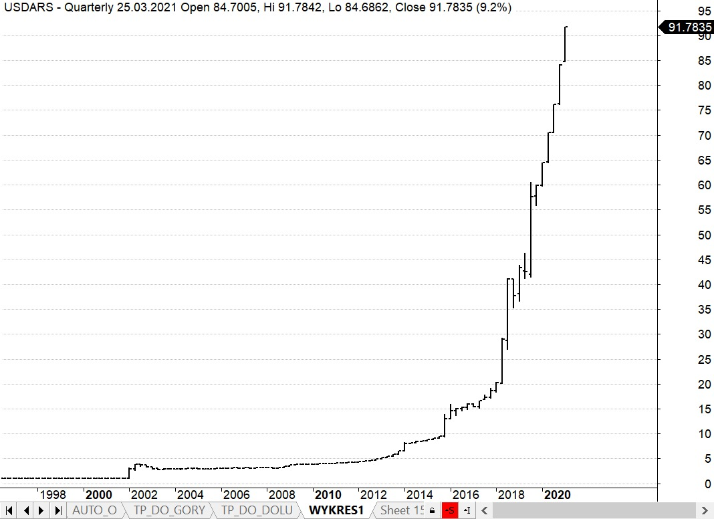
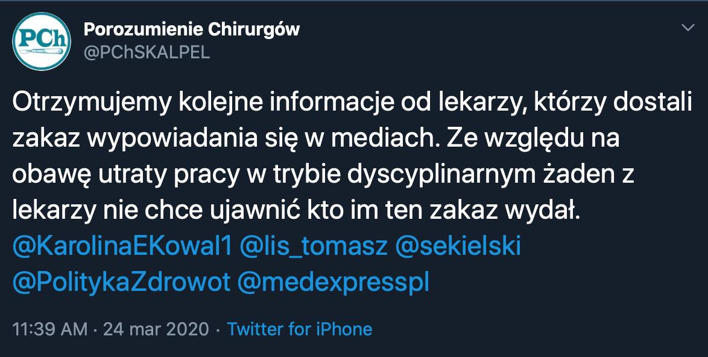
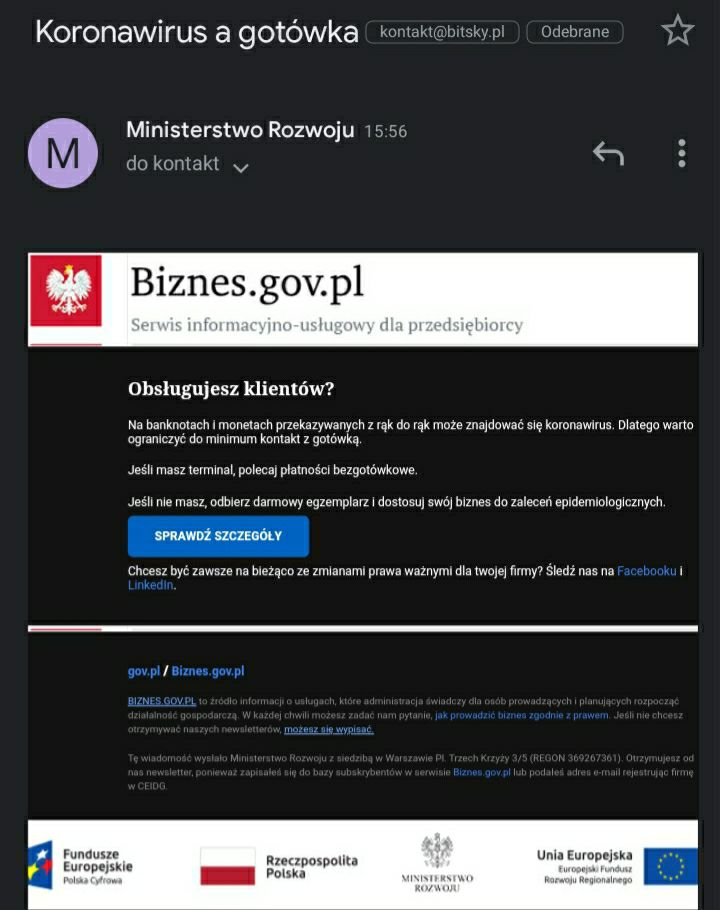
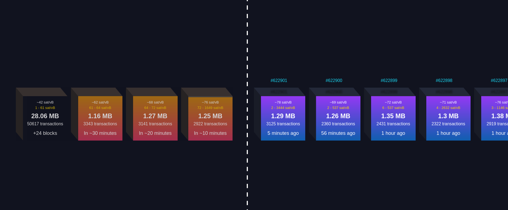
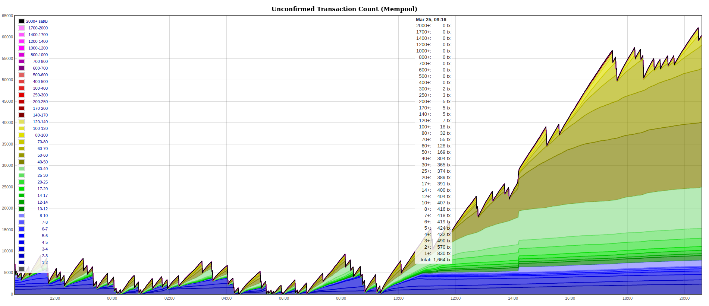
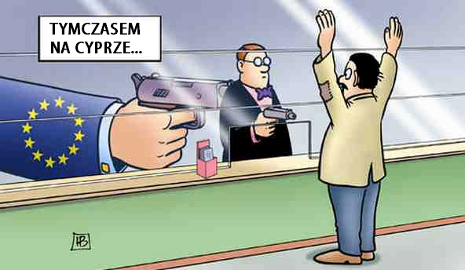
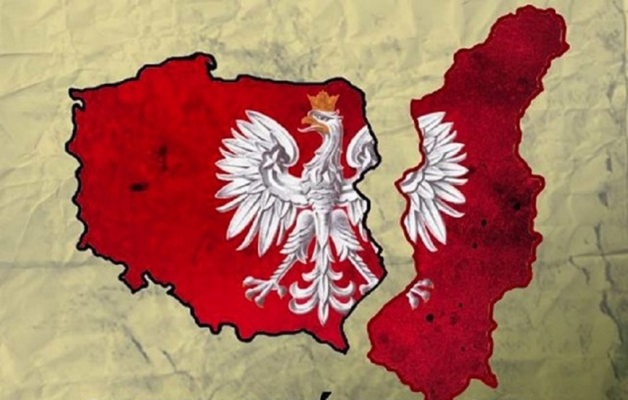
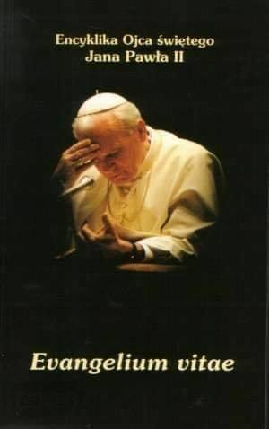
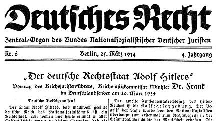

### 2023

<video width="640" height="480" controls>
<source src="./movies/march/eurazja.mp4" type="video/mp4">
Your browser does not support the video tag.
</video>

<a href="./documents/march/DoktrynaFederacjiRosyjskiej.pdf" target="_blank">Doktryna Federacji Rosyjskiej</a>

<a href="./documents/march/Przeglad_Bezpieczenstwa_Wewnetrznego__wydanie_specjalne_pt_Wojna_hybrydowa.pdf" target="_blank">ABW</a>

### 2022

Aktualne, efektem zapowiedzianych zmian PIT będzie:

- wyższa inflacja
- wyższe stopy procentowe
- słabszy złoty
- słabszy samorząd, finansowo i politycznie.

Krótkoterminowy wzrost dochodów po opodatkowaniu nie jest wart dalszej destabilizacji gospodarki.

Osłabiając złotego przez ekspansywne polityki makro + awanturniczą politykę to my subsydiujemy zakupy zagranicznym inwestorom w Polsce, nasze aktywa w walutach obcych są tanie. Równocześnie zwykli Polacy płacą drożej za importowane dobra i usługi.

### 2021

Goldman Sachs has now filed for a Bitcoin ETF.

Last year, they called bitcoin "not an asset class"

---

(Bloomberg) -- Argentina is unable to repay its $45 billion debt with the International Monetary Fund under current negotiating conditions, influential Vice President Cristina Fernandez de Kirchner said Wednesday, diminishing the possibility of an agreement with the country’s largest creditor.

“We can’t pay because we don’t have the money to pay,” Fernandez de Kirchner said at an event in Buenos Aires, adding that the terms and conditions are “unacceptable.”

Fernandez de Kirchner’s comments come after discussions between Economy Minister Martin Guzman and IMF Managing Director Kristalina Georgieva in Washington on Tuesday that what was described by both sides as a “very good meeting.”

  

---

### 2020

Doniesienia wydają się potwierdzać, że mamy stan wyjątkowy de facto, bez wprowadzenia go de iure...

  

  

---

  

  

## Historia inflacji

▪️ 1815 rok – Rosja nasila inflacyjną eksploatację podbitych terytoriów, kontynuując dodruki rubli asygnacyjnych. Pozyskuje w ten sposób środki na finansowanie polityki imperialnej w Europie i Azji. Pierwsze 10 milionów papierowych rubli wyemitowała caryca Katarzyna II w 1769 roku. W 1815 roku ich suma dochodzi już do 760 milionów. W Królestwie Polskim "świeże" banknoty jako pierwsi zawsze otrzymują żołnierze ze stacjonujących carskich garnizonów.

▪️ 1828 rok – powstaje Bank Polski – instytucja rządowa o osobowości prawnej – w drodze przekształcenia z powstałego 2 lata wcześniej Towarzystwa Kredytowego Ziemskiego. Jego inicjatorem jest Franciszek Ksawery książę Drucki-Lubecki, będący w tym czasie (1821-1830) ministrem skarbu. Kapitał banku jest jak na owe czasy stosunkowo wysoki – 30 milionów złotych polskich. Papierowe bilety mają być wymieniane na srebro na każde żądanie. Podczas powstania listopadowego emisja banknotów zostaje znacznie zwiększona, a ich pokrycie w srebrze spada do 30%. Wymienialność na kruszec nie zostaje jednak zawieszona. Zgodnie z wolą ministra, bank uczestniczy w finansowaniu wielu państwowych inwestycji, m.in. Huty Bankowej w Dąbrowie Górniczej, fabryk maszyn w Żyrardowie i na Solcu w Warszawie. Z czasem wiele z tych inwestycji, zwłaszcza w branży górniczej i hutniczej, okazuje się nietrafionych i jako takie zostają sprzedane w latach 60. XIX wieku. Bank poddano likwidacji po powstaniu styczniowym, jego majątek w roku 1886 wchodzi w skład rosyjskiego Banku Państwa.

▪️ 1916 rok – 9 grudnia, decyzją niemieckiego generała-gubernatora Hansa Hartwiga von Beselera, utworzono Polską Krajową Kasę Pożyczkową (PKKP), która miała emitować polską markę o wartości równej marce niemieckiej. W istocie ludność polska płaciła za pośrednictwem nowej waluty ogromny podatek inflacyjny na rzecz wojsk Cesarstwa Niemieckiego – okupanci kładki nacisk na zwiększanie jej emisji. Dokonywali za nią zakupów na rzecz armii. Jednocześnie izolowali obszar marki niemieckiej przed napływem jej polskiego odpowiednika i przenoszeniem inflacji na swoje rdzenne terytoria. W grudniu 1917 roku w obiegu na okupowanych terenach krążyło 270 milionów polskich marek, pół roku później już 504 miliony, a w dniu odzyskania niepodległości w roku 1918 – 880 milionów.

▪️ 1923 rok – dochodzi do hiperinflacji. Polska, po odzyskaniu niepodległości, z roku na rok zwiększa deficyt budżetowy. Zyski z druku banknotów przeznacza na inwestycje związane z odbudową kraju, zaś od 1920 – także na wydatki wojenne. Wartość marki polskiej do dolara USA spada z 9 marek/1 dolara w 1918 roku do 6 375 000 marek/1 dolara (1923 rok).

▪️ Trudną sytuację Niemiec pogłębiała rosnąca w błyskawicznym tempie inflacja. W 1923 roku ceny były wyższe od tych z 1918 roku o około 30 miliardów procent. W kantorach niemieckich za 1 dolara płacono 4,2 biliona marek[11]. W kraju panowało olbrzymie bezrobocie. Republika Weimarska (niem. Weimarer Republik) nie była w stanie wywiązać się ze wszystkich odszkodowań, co spowodowało, że na terytorium Zagłębia Ruhry w 1923 roku wkroczyły wojska belgijskie i francuskie[12]. Zajęto takie ośrodki przemysłowe jak Essen, Gelsenkirchen, Bochum czy też Dortmund[13]. Podobnie jak w przypadku Zagłębia Saary, utrata Zagłębia Ruhry doprowadziła do znacznego zmniejszenia wydobycia surowców – w przypadku utraty terytorium w 1923 roku Niemcy straciły ponad 60% wydobycia węgla kamiennego, o około 50% zmniejszyła się także produkcja żelaza i stali[14]. Na te wydarzenie rząd niemiecki zareagował w sposób, które Tadeusz Kotłowski określił mianem niemieckiej polityki biernego oporu[15]. Niemcy postanowiły nie spłacać zobowiązań do czasu, aż wojska francusko-belgijskie nie opuszczą Zagłębia Ruhry. Doszło do starć pomiędzy wojskami francuskimi, a miejscową ludnością niemiecką. Działania Francuzów nie spodobały się pozostałym zwycięskim mocarstwom, a mianowicie Stanom Zjednoczonym i Wielkiej Brytanii. Postanowiono załagodzić bardzo napiętą sytuację. Amerykanin Charles Gates Dawes przedstawił nowe reguły dotyczące niemieckich odszkodowań, które nieco złagodziły olbrzymie kontrybucje – Niemcy nie musiały już przekazywać sprzętów i towarów (tak zwanych świadczeń rzeczowych), zostało również nieco zmniejszone roczne odszkodowanie w złocie[16]. Na przełomie lat 1924 i 1925 miało ono wynieść „jedynie” 1 miliard marek i miało być stosunkowo wzrastane w przeciągu kilku lat, aż do przełomu 1928/1929, gdy kwota rocznego wypłacanego odszkodowania miała wynieść 2,5 miliarda marek. Ta kwota miała już nie rosnąć i być spłacana rokrocznie.
Patrząc na te ceny nie można się dziwić, że wśród mieszkańców Niemiec zaczął panować głód. Dzienne wynagrodzenie robotnika wynosiło bowiem wówczas około 3 biliony marek[20]. Spadła wówczas także liczba przewożonych osób w transporcie publicznym, zmniejszyła się także liczba przewożonych towarów[21].Władze postanowiły dokonać wymiany obowiązującej waluty. W miejsce marki nowym środkiem płatniczym stała się marka rentowa (niem. Rentenmark). Wartość jednej marki rentowej określono na 1 bilion dotychczasowej waluty. Do tej zmiany waluty doszło w sierpniu 1924 roku[22].

### 2019

https://en.wikipedia.org/wiki/Green_New_Deal

### 2013

Nacjonalizacja banku na Cyprze i pozbawienie akcjonariuszy oraz właścicieli depozytów pow. 100k euro całości majątku. Takie rzeczy w Europie, takie rzeczy w strefie euro. Nikt mnie nie przekona, że wejście do niej jest dla Polski korzystne. Rezygnując z opodatkowania mniejszych depozytów rząd uwolnił się od protestów społecznych, bo to uderzy głównie w bogate osoby zza granicy, które uciekały na Cypr przed podatkami. Jestem bardzo ciekaw reakcji Rosji, której obywatele najprawdopodobniej stracą najwięcej. Zaczyna się dziać, miejmy nadzieję, że to początek końca tej utopii jaką jest w obecnym kształcie Unia Europejska i strefa euro.

  

### 1957

Zawarto porozumienie o kolejnej fali wysiedleńczej Polaków z Kresów Wschodnich (1957 - 1959).

(Kresy od wieków były polskie i nie wolno o tym głośno mówić - Krym od 1954 r. jest ukraiński i krzyczy się o tym na cały świat)

  

### 1995

Papież Jan Paweł II ogłosił encyklikę „Evangelium Vitae”, o wartości i nienaruszalności ludzkiego życia.
Napisał w niej między innymi:
"Znaczna część opinii publicznej usprawiedliwia przestępstwa przeciw życiu w imię prawa do indywidualnej wolności i wychodząc z tej przesłanki domaga się nie tylko ich niekaralności, ale wręcz aprobaty państwa dla nich, aby móc ich dokonywać z całkowitą swobodą, a nawet korzystając z bezpłatnej pomocy służby zdrowia. Wszystko to prowadzi do głębokich przemian w sposobie patrzenia na życie i na relacje między ludźmi. Fakt, że prawodawstwo wielu państw, oddalając się nawet od fundamentalnych zasad swych konstytucji, nie tylko nie karze tego rodzaju praktyk wymierzonych przeciw życiu, ale wręcz uznaje je za całkowicie legalne, jest niepokojącym przejawem, a zarazem jedną z istotnych przyczyn poważnego kryzysu moralnego: czyny jednomyślnie uważane niegdyś za przestępcze i w powszechnym odczuciu moralnym niedopuszczalne, zyskują stopniowo społeczną aprobatę"

  

### 1957

Władze Polski i Związku Radzieckiego podpisały porozumienie o drugiej fali wysiedleń Polaków z Kresów Wschodnich.
Pierwsza fala wysiedleń Polaków rozpoczęła się w 1955 roku, a sprzyjącym temu wydarzeniu czynnikiem była śmierć Stalina w 1953 roku. Do Polski wrócli wtedy głównie więzniowie sowieckich łagrów. Jednak rząd Polski chciał czegoś więcej. Władze chciały powrotu ludności,która pozostała na Kresach Wschodnich, a której nie objęły wywózki na Syberię i inne formy represji.
Zawarte w 1957 roku porozumienie doprowadziło do powrotu do Polski blisko ćwierć miliona naszych rodaków.
Ciekawostką jest fakt, że to właśnie dzięki porozumieniu zawartemu w 1957 roku do Polski mogły przybyć między innymi takie pózniejsze polskie osobistości świata kultury i sportu jak Czesław Niemen czy Władysław Kozakiewicz.

### 1934

Komuniści sowieccy i naziści niemieccy chętnie sięgali do pojęcia „praworządności”.

Przykład: „Jesteśmy oddani praworządności i nikt na całym świecie nie jest upoważniony do kwestionowania tego zobowiązania” (Hans Frank „Niemieckie państwo prawa Adolfa Hitlera” 1934)

  

---

<a href="https://github.com/TomaszWaszczyk/historia.waszczyk.com/edit/master/src/content/march-25.md" target="_blank">Edytuj tę stronę dzieląc się własnymi notatkami!</a>
