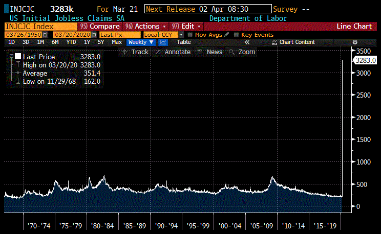
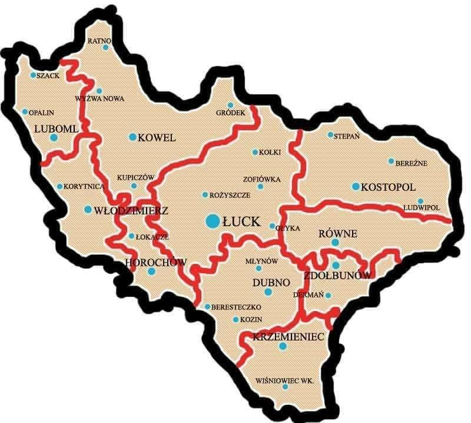
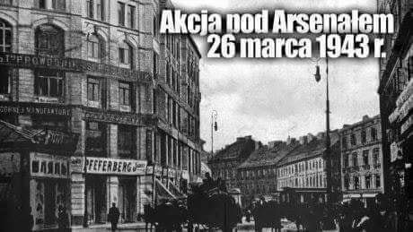
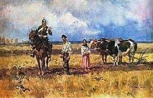
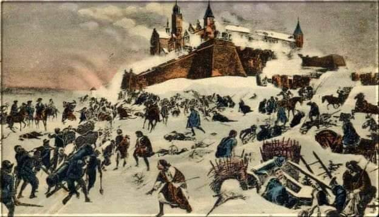

### 2020

  

---

Banko-nalizacja - nie mylić z nacjonalizacją.

Banki w USA dostaną kilka bilionów USD od FEDu, za co będą kupować akcje bezpośrednio lub pośrednio na rynku. Dojdzie do tego, że banki staną się właścicielem 90% majątku firm..

---

Nowym szefem Dolnośląskiego Centrum Transplantacji Komórkowych został były pracownik Dróg Krajowych, zastąpił wybitnego lekarza.
Prof. Andrzeja Langego został odwołany za „brak woli współpracy". Nowy dyrektor został wyłoniony w drodze konkursu.
Nowemu dyrektorowi gratulujemy i życzymy szczęścia. Z takim doświadczeniem na takim stanowisku może mu się przydać w procesie podejmowania decyzji.
Źródło - wyborcza.pl.

---

Sejm uchwalił, że mogą przedłużyć czas pracy lekarza do 54h tygodniowo bez opt-out. Dodatkowo wojewoda i dyrektor będą mogli delegować do pracy gdzie chcą SOR,/IP/inny szpital, nawet lekarzy w trakcie specjalizacji. A moim zadaniem tarcza antykryzysowa zostanie w mocy na lata.
Już wiecie dlaczego jak nie walczymy głośno to jesteśmy parobkami pod butem władzy? Wycieraja sobie nami gębę, teraz dla dobrego pijaru nie mogą się nadziekowac jacy to nie jesteśmy super, ale podczas protestu "rezydenci żądali miliardów złotych", "oni się uczą a nie pracują", a teraz cichaczem pchają nas w kamasze. Nas, klasę która nie ma żadnych przywilejów, nie ma szkoleń, nie ma sprzetu. Żołnierze z patykami mają iść na czołgi. Taka jest polityka.
Chyba trzeba będzie zacząć mówić głośno jak jest naprawdę, nie bać się, że mamy siedzieć cicho. To znów jest czas na rewolucję? Znowu? Nic się nie nauczyli?

---

> Kiedy to piszę jest 2.30 w nocy, nie mogę spać. Właśnie siedząc na 31,5h dyżurze w szpitalu skończyłem 34 lata. Jestem lekarzem z tytułem doktora nauk medycznych. Jestem pracownikiem naukowo-dydaktycznym na jednym z uniwersytetów medycznych. Ukończyłem szkolenie specjalizacyjne z radiologii i diagnostyki obrazowej. Nie mogę zostać specjalistą, bo Minister Zdrowia odwołał na czas bliżej nieokreślony egzaminy specjalizacyjne… Ale dziś nie o tym.
> Chciałem Wam pokazać jak wygląda aktualnie życie medyków od kuchni. Jeśli ktoś będzie chciał, to dość łatwo sprawdzi, gdzie pracuję, ale dla ułatwienia nakreślę rys realiów – nasz zakład diagnostyki obrazowej składa się z 1 RTG, 1 TK, 1 USG oraz pracowni badań naczyniowych. Badania MR obstawia prywatna firma, która po pierwszym potwierdzonym w szpitalu przypadku COVID-19 zamknęła pracownię do odwołania… To było 2 tygodnie temu.
> W pierwszym tygodniu straciliśmy większość zespołu niemedycznego – panie rejestratorki, panie piszące wyniki i ogarniające organizację całego backendu. Głównie wyszła kwestia opieki nad dziećmi, co dla mnie jest zrozumiałe. Na szczęście po kilku dniach kierownictwo szpitala zorientowało się i przysłało nam posiłki, aktualnie wszystko zaczyna wracać do normy.
> W ciągu tych 2 tygodni otrzymaliśmy od dyrekcji szpitala kilkanaście różnych wytycznych odnośnie postępowania. Za serce ujęło mnie jedno z ostatnich pism, nakazujące lekarzom, zadecydowanie jakie i komu badania robić w oparciu o aktualny stan epidemiologiczny… No, pandemię mamy z tego co słyszałem… Da się gorzej?
> W rezultacie, póki co, robimy wszystko, co było w planie i arbitralnie uznaliśmy, że rzeczywiście wymagana jest pilna diagnostyka. Pacjenci onkologiczni czy inni nie mogący czekać mają u nas szanse na diagnostykę. Po przeprowadzeniu wywiadu epidemiologicznego przez telefon i pomiarze temperatury na wejściu do szpitala, ale mogą. Część nie przychodzi, bo nie mają gdzie oznaczyć poziomu kreatyniny (konieczne przed badaniami z kontrastem) – punkty pobrań pozamykały się w panice. Część nie przychodzi, bo się po prostu boi… Czy słusznie? Oceńcie sami.
> W ciągu ostatnich 3 dni miałem kontakt z co najmniej 3 osobami, u których następnie posłano testy na obecność wirusa. W ciągu dzisiejszego dyżuru miałem dwójkę pacjentów z gorączką wysłanych na diagnostykę przez naszą Izbę Przyjęć. W każdym przypadku dokładny wywiad, indywidualne podejście czy na pewno trzeba badanie zrobić, wiszenie na telefonie z lekarzami kierującymi. Po prostu, żeby pomóc człowiekowi, ale też żeby było bezpiecznie dla wszystkich. Do każdego takiego badania ubieramy się z technikiem (czasem także pielęgniarką) w to co nam zapewniono (maseczki chirurgiczne, fartuchy flizelinowe, rękawiczki). Pacjenta trzeba często przenieść, ułożyć na stole – sport kontaktowy, że tak podsumuję. Po każdym takim badaniu ściąganie wszystkiego co jednorazowe, mycie i dezynfekcja siebie i pracowni. Szybki rachunek sumienia: „Czy umyte są klamki? Krzesła? Wózek na którym pacjent przyjechał? Czy dotykałem klawiatury? Telefonu?” I nadzieja, że kolejna osoba z negatywnym wywiadem i bez objawów nic przeze mnie nie złapie.
> Nie zrozumcie mnie źle. Nie mam pretensji do kolegów z Izby. Oni mają gorzej. Dostają od pogotowia przywiezionego pacjenta i radź sobie. Są na pierwszej linii frontu. To oni zbierają wywiad, mierzą temperaturę, mają kontakt ze wszystkim i wszystkimi. Aktualnie docieramy jak to wszystko ma działać, bo nowe wytyczne postępowania pojawiają się codziennie i bynajmniej nie są jednoznaczne. Po prostu nie byliśmy przygotowywani na taką sytuację, a wieloletnie niedobory w ochronie zdrowia są teraz boleśnie widoczne.
> Tak w ogóle, to mam szczęście. Pracuję w szpitalu „czystym”, nie przekształconym w jednoimienny/zakaźny i nie mamy SOR. To co opisuję powyżej dzieje się w dużym, ale „zwykłym” szpitalu. My jesteśmy tymi, którzy mają łatwo. To co się dzieje w innych szpitalach pozostawiam waszej wyobraźni i podobnym wpisom kolegów z innych placówek…
> Czy jako ochrona zdrowia mamy problem? Nasz szpital przez tydzień nie miał anestezjologów, bo wszystkich wywiało na kwarantannę. Zero zabiegów, absolutny stop całej maszyny. Ale opisuję tutaj własne podwórko. Aktualnie specjalistów radiologii mamy w ilości około 50% normalnego stanu. Jeśli wysypie się reszta, to nie będzie komu opisywać badań, efekt dla całości szpitala będzie podobny - stop. Problem polega na tym, że większość naszego zespołu pracuje w więcej niż jednym miejscu. W związku z tym lekarz na kwarantannie znika z więcej niż jednego szpitala. Pozostały personel? Technicy póki co trzymają się dzielnie, niemniej „w razie czego” zaczęliśmy z młodszymi kolegami przyswajać sobie bliżej technikalia wykonywania badań. Pielęgniarki wspierają nas mocno na kilku frontach i obawiam się, że robota bez nich utknie w martwym punkcie. Nasza praca to jest sport zespołowy, tracąc dowolnych graczy całość drużyny może się rozsypać.
> W domu zostawiłem żonę z dwójką cudownych dzieciaków. Od ponad tygodnia śpię wśród białych ścian na dmuchanym materacu. Od tygodnia mam lodówkę, pralkę oraz internet. Jestem w stanie w takich warunkach żyć i pół roku, byle czegoś rodzinie nie sprzedać. Czy jest komfortowo? Nie, ale inni mają gorzej.
> Kończąc przydługi wywód: Myjcie ręce, mówcie prawdę, trzymajcie się z dala od szpitali jeśli tylko możecie. To jest dopiero preludium.

---

Jestesmy na progu "ciekawych czasów" gdzie odpowiedzialność jednostki przekłada sie na efekt grupowy. Nikt nie będzie Was prowadził za rączkę bo nie mamy na to zaplecza, ludzi, finansów ani czasu- proszę o włączenie samodzielnego, doroslego i odpowiedzialnego myślenia.
Sprawdzone informacje mozna czerpac m.in. stąd Koronawirus Lekarze Pacjentom Profil jest prowadzony przez lekarzy w czasie wolnym i z wlasnej inicjatywy. Dokladane sa starania by byl maksymalnie merytoryczny i rzetelny w calym tym chaosie.
A teraz długo i duzo moich osobistych bóli tylka:
NIE KLAM - pomijajac Covid, od tego czy klamiesz lekarzowi, ratownikowi, pielegniarce, rejestratorce etc etc moze zalezec finalnie czy Twojego bliskiego z zawalem będzie mial kto ratowac (we Wloszech czas dojazdu karetki na miejsce zdarzenia wzrosl 5krotnie- efekt chyba potrafisz sobie wyobrazic)
NIE ZAKLADAJ ze jestes bezpieczny bo jestes mlody i zdrowy a Twoje dzialania nie maja znaczenia. Tak samo jak nie podpisał bys teraz wiążącej deklaracji"w przypadku potrzeby proszę  mnie nie podłączać do repiratora, nie podawsc leków i nie podawac tlenu". Ani nie podpisał bys jej w imieniu swojego taty/mamy/babci/zony etc.
Dzieciaki nie widzą sie z Mackiem od pt a ja nie wracam do rodziców, ze wzgledu na pierwsze potwierdzone zachorowanie w jego szpitalu. Bo ryzyko ze któreś z nas albo tego nie przeżyje albo ze poniesiemy infekcje dalej jest.
NIE MA WYJATKOW OD ODPOWIEDZIALNOŚCI INDYWIDUALNEJ
W procedurach na ten czas ekstremalnego dzialania i chaosu nie ma sciezki "aktor, wladze tv kazaly przyjac do szpitala". I pisanie smutnych postow ze musialo sie czekac na wynik a personel niemily dla przyjetego bez wskazan (ciekawe czemu niemily) nie udowadnia ze medycyna w PL jest niewydolna (a o tym ze jest trudno wiemy i bez tego) tylko ze się  jest lesnym dzbanem.
Nie ma tez sciezki dla biednych politykow, ktorzy po 12 h objawow (sic!) Ida na lotnisko "bo im zalezalo bardzo" (sic2!) Tam myślą, ze moze sobie temperaturę na tym lotnisku zmierzą (sic3!) Wiec po calym szukają personelu (sic4!) A jak nie znajdują to sie wycofuja z plyty zeby pojechac do szpitala tramwajem a nie taksowka (cyt: bo to bardziej odpowiedzialne) a na koniec sa zaskoczeni ze musza czekac 11h na wynik (ponownie- ciekawe czemu).
Przypominam tez- jesli dostajecie kwarantanną w twarz to ujemny wynik tego NIE ZMIENIA. Niestety nie mamy idealnego narzedzia diagnostycznego i wyniki beda czasem falszywie ujemne. Kwarantanna obowiazuje.
To ze Gosia/Asia/Kasia Wam powiedzialy ze mozna NIE ZNACZY ze mozna. Zostan w domu oznacza swoj dom. Nie plac zabaw. Nie dom babci Marysi na imprezce rodzinnej, nie parapetowke u Czesia i nie wspolny spacer na 20osob.
Fakt, ze byłeś zagranicą i rząd zapewnia transport do PL nie ściąga w żadnym stopniu odpowiedzialnosci. Nawet nie wchodzę w dywagacje na temat powodow dla ktorych tam byles bo w pewnym %zakonczyloby sie to morderstwem.
Nie ma znaczenia czy CI zmierzono temperature- zgadnij ilu Twoich towarzyszy profilaktycznie zazylo leki przeciwzapalne? Albo co to zmieni jak goraczka pojawi sie dopiero jutro? MASZ KWARANTANNE to masz pomiar temp tego nie zmienia. Ty Informujesz jesli sie zmienia Twoja sytuacja.
Tak, Fajnie jakby rzad zapewniał jeszcze transport i miejsce do kwarantanny. Ale Kurza noga, aktualnie mamy troche powaznych problemów- zachowaj sie jak dorosly- zatroszcz sje o maksymalnie rozsadny transport  swojego tyłka i walizki. Zatroszcz  sie o to żebyś  byl w kwarantannie.
Tak- jest lipa jak chodzi o dostęp do wielu rzeczy w szpitalach. Tak, mamy malo personelu. Tak, w wiekszosci jestesmy wkurzeni ze przez tyle lat olewano postulaty środowiska medycznego a teraz trzeba sobie poradzic.
Ale TWOJ ZDROWY ROZSĄDEK moze być aktualnie kluczowy. Nie wymagamy zebys stal sie ekspertem od COVID. Po prostu  sie DOSTOSUJ i MYSL zamiast pisać farmazony/pochwaly/idiotyzmy/madrosci w sieci.

---

"Sobota 21 marca. Policjanci znajdują ciało 45-latka z Głogowa. Mężczyzna był zawodowym kierowcą. Po powrocie z zagranicy czuł się źle, miał objawy infekcji. Od kilku dni czekał na pobranie wymazu do badań na obecność koronawirusa. Umarł w mieszkaniu w trakcie domowej kwarantanny.
Wtorek 24 marca. Rodzina nie ma kontaktu z 50-letnią mieszkanką Konina, która dwa dni wcześniej wróciła z Niemiec. Miała odbyć dwutygodniową kwarantannę. Według rodziny skarżyła się na zły stan zdrowia. Ciało kobiety znajduje jej zięć. Strażacy i ratownicy w obawie przed koronawirusem wchodzą do mieszkania w ochronnych kombinezonach.
Również wtorek, 24 marca. W domowej kwarantannie umiera 59-letni proboszcz parafii w Drwini w województwie małopolskim. Badanie potwierdziło u niego zakażenie koronawirusem, ale lekarze uznali, że proboszcz może wrócić do domu".
I gdyby to jeszcze nie miało wystarczyć:
"Żadnego z tych zgonów Ministerstwo Zdrowia nie ujęło w publikowanych codziennie raportach o liczbie zakażonych i zmarłych z powodu koronawirusa. – Ofiar jest więcej, niż podaje rząd – nie ma wątpliwości medyk sądowy z dużego polskiego miasta".

### 1979

https://en.wikipedia.org/wiki/Egypt%E2%80%93Israel_Peace_Treaty

### 1943

Kaci z Ukraińskiej Powstańczej Armii pod dowództwem Iwana Łytwynczuka dokonali zbrodni we wsi Lipniki na Wołyniu.Nie była to pierwsza zbrodnia dokonana przez ten oddział . Już od 9 marca dokonał on czegoś podobnego we wsiach : Białka, Kolonia Antonówka, Kolonia Zarzeczka, Mokwin, Czudowy, Kolonia Borówka, Hłuboczek, Drażne, Kolonia Polanówka, Kolonia Tomaszów, Hipolitówka, Radomianka, Wereczówka.
Genezą tej zbrodni było powieszenie przez Niemców, a schwytanego przez Polaków lokalnego ukraińskiego policjanta Ołeksandra Małyszki, który zasłynął kilkoma podpaleniami polskich domów . Iwan Łytwynczuk - „Dubowyj", lokalny komandyr banderowców, przodujący wówczas w wyniszczaniu Polaków, nie darowałby takiego występku.
Nocą 26 marca 1943 roku około godziny drugiej, zgromadzone wokół kolonii siły banderowców, wzmocnione zmobilizowanym chłopstwem ukraińskim, przypuściły atak na Lipniki. 
Ewelina Bagińska, która straciła wskutek napadu wzrok, po latach opowiadała, jak uciekając wraz z dwójką małych dzieci rozpoznała wśród napastników swego sąsiada-Ukraińca. „»Co one wam zrobiły? Przecież to maleństwa! Jedno ma dwa lata, drugie nie ma nawet roku! Darujcie im życie! Mnie już wszystko jedno, straciłam oczy, mnie możecie zabić... ale dzieci zostawcie«. [...] Nie mogłam uwierzyć w to, że jeszcze żyję, 
a nade mną, nad brzegiem rowu, stoi i współczująco przemawia dawny sąsiad, a obecnie przywódca bandy morderców, biegających po polu i dobijających bagnetami leżących rannych Polaków. [...] Myślę, że w tym Ukraińcu – zajadłym szowiniście, zaślepionym bezmyślną nienawiścią do Polaków – odezwało się na chwilę zwykłe ludzkie sumienie, którym Bóg obdarzył przecież wszystkich ludzi.
[...] Gdy nastał dzień, mój mąż po długich poszukiwaniach odnalazł mnie na dnie 
rowu. Zabrał nas do szpitala w Bereznem”.
Tej nocy w Lipnikach zginęło z rąk Ukraińców 179 Polaków, czworo ukrywanych Żydów i Rosjanka. Z życiem uchodzi około 500 osób, w tym 2-letni Mirosław Hermaszewski, późniejszy kosmonauta, wyniesiony na rękach matki.

  

Grafika przedstawia mapę województwa wołyńskiego.

---

W Warszawie miała miejsce słynna Akcja pod Arsenałem. Było to jedno z najważniejszych działań
zbrojnych zorganizowanych przez Grupy Szturmowe Szarych Szeregów. 26 marca 1943 roku uwolniono harcmistrza Jana Bytnara "Rudego" i 20 innych więźniów politycznych, przewożonych z siedziby Gestapo przy Alei Szucha na Pawiak. W akcji brało udział 28 harcerzy. Dowodzili nią - całością Stanisław Broniewski "Orsza", a bezpośrednio - Tadeusz Zawadzki "Zośka". 
Akcja ta nosiła kryptonim "Meksyk 2",ponieważ nieudana akcja pod kryptonimem "Meksyk" miała miejsce już 23 marca w dniu uwięzienia Jana Bytnara. Podczas akcji zostało ciężko rannych dwóch akowców, a jeden schwytany i później rozstrzelany. Zginęło czterech Niemców, w tym
załoga spalonej więźniarki gestapo i policjant z ulicy, a dziewięciu - rannych. Z powodu
obrażeń odniesionych w akcji zmarli Aleksy Dawidowski, pseudonim "Alek" i Tadeusz Krzyżewicz "Buzdygan". Po czterech dniach zmarł również Jan Bytnar "Rudy", śmiertelnie wyczerpany po przesłuchaniach na gestapo.

  

### 1939

W Berlinie odbyło się spotkanie ambasadora RP w Niemczech  Józefa Lipskiego (zdjęcie) z ministrem sprawaw zagranicznych III Rzeszy Joachimem von Ribbentropem. Polski dyplomata poinformował o odrzuceniu przez Polskę niemieckich żądań skierowanych pod jej adresem 24 października 1938 roku.
Przypomnijmy, że władze niemieckie zażądały wówczas przyłączenia do Niemiec Wolnego Miasta Gdańska, przeprowadzenia eksterytorialnej autostrady i linii kolejowej przez polskie Pomorze (tzw. „polski korytarz”) i przystąpienia Polski do paktu antykominternowskiego – czyli jawnego zadeklarowania się Polski jako politycznego partnera III Rzeszy a strategicznego przeciwnika ZSRR.
Podczas spotkania z Ribbentropem Lipski stwierdził, że Warszawa gotowa jest zawrzeć nowe bilateralne porozumienie w sprawie Gdańska, Polska przeciwstawi się jednak jego wcieleniu do Rzeszy. Polska chętnie przyzna Niemcom wszelkie niezbędne prawa tranzytu poprzez Korytarz, ale rząd polski nie może przystać na zasadę eksterytorialności.

### 1885

Rozpoczęły się tak zwane "rugi pruskie" czyli masowe deportacje ludności polskiej i żydowskiej z paszportem austriackim i rosyjskim z terenu zaboru pruskiego.
Osoby te miały tam status emigrantów ekonomicznych, którzy w momencie utworzenia w 1871 roku Cesarstwa Niemieckiego nie uzyskały niemieckiego obywatelstwa.
Wysiedlenia, które stały się symbolem nienawiści Bismarcka do Polaków były przeprowadzane w sposób niehumanitarny.
Doskonałym przykładem odzwierciedlającym jego stosunek do Polaków niech będzie ten fragment jego listu z 1861 roku, w którym tak oto pisał do swojej siostry:
"Bijcie Polaków, by im ochota do życia odeszła. Osobiście współczuję ich położeniu, ale jeżeli pragniemy istnieć, nie pozostaje nic innego, jak ich wytępić. Wilk też nie odpowiada za to, że Bóg go stworzył takim, jakim jest; dlatego też zabija się go, gdy się tylko może”.

  

Grafika przedstawia obraz Wojciecha Kossaka z 1909 roku pt "Rugi pruskie".

### 1813

Rozpoczęło się trwające do 4 kwietnia 1813 rosyjskie oblężenie Jasnej Góry. Rosjanie, którzy pod bronioną przez wojska Księstwa Warszawskiego pod dowództwem pułkownika Antoniego Górskiego twierdzę jasnogórską podeszli już cztery dni wcześniej spotkali się z odmową kapitulacji. 26 marca 1813 roku artyleria polska przypuściła atak na pozycje rosyjskie w rejonie tak zwanego Rynku Wieluńskiego, gdzie śmierć poniósł dowódca jednego z rosyjskich batalionów. Na skutek tego generał wojsk rosyjskich Fabian Gottlieb von der Osten Sacken podjął decyzję o rozpoczęciu oblężenia. Rozpoczęto budowę fortyfikacji, którą utrudniał gęsty śnieg i polski ostrzał artyleryjski. Dopiero po tygodniu Rosjanom udało się przeprowadzić pierwszy atak, który spotkał się ze zdecydowanym polskim odporem. Rosyjski ostrzał spowodował naruszenie murów fortecznych i pożar magazynów, co osłabiło morale polskich obrońców, którzy dodatkowo zaczęli odczuwać problemy wynikające z niedostatku żywności i braku świeżej wody oraz wzrastającej liczby chorych i rannych żołnierzy.  Przełom nastąpił 4 kwietnia, gdy polski dowódca zaproponował generałowi von der Osten-Sackenowi 24-godzinne zawieszenie broni i przedstawił warunki kapitulacji, które dowódca rosyjskiego korpusu odrzucił, co spowodowało dalsze walki. Dwugodzinne bombardowanie twierdzy, które po tym nastąpiło, skłoniło pułkownika Górskiego do poddania Jasnej Góry na warunkach rosyjskich.

  

### 1790

Sejm Czteroletni podjął uchwałę o opodatkowaniu szlachty i duchowieństwa daniną o nazwie "podatek dziesiątego grosza".
Był to sposób na zebranie pieniędzy przeznaczonych na powiększenie i dobrojenie armii. Od szlachty pobierano 10 procent kwoty dochodów, a od duchowieństwa 20 procent. Danina nie obowiązywała poddanych ani wiernych.

---

<a href="https://github.com/TomaszWaszczyk/historia.waszczyk.com/edit/master/src/content/march-26.md" target="_blank">Edytuj tę stronę dzieląc się własnymi notatkami!</a>
