### 2024

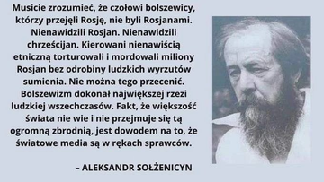  

<video width="640" height="480" controls>
<source src="./movies/march/kaczmarski-jalta.mp4" type="video/mp4">
Your browser does not support the video tag.
</video>

---

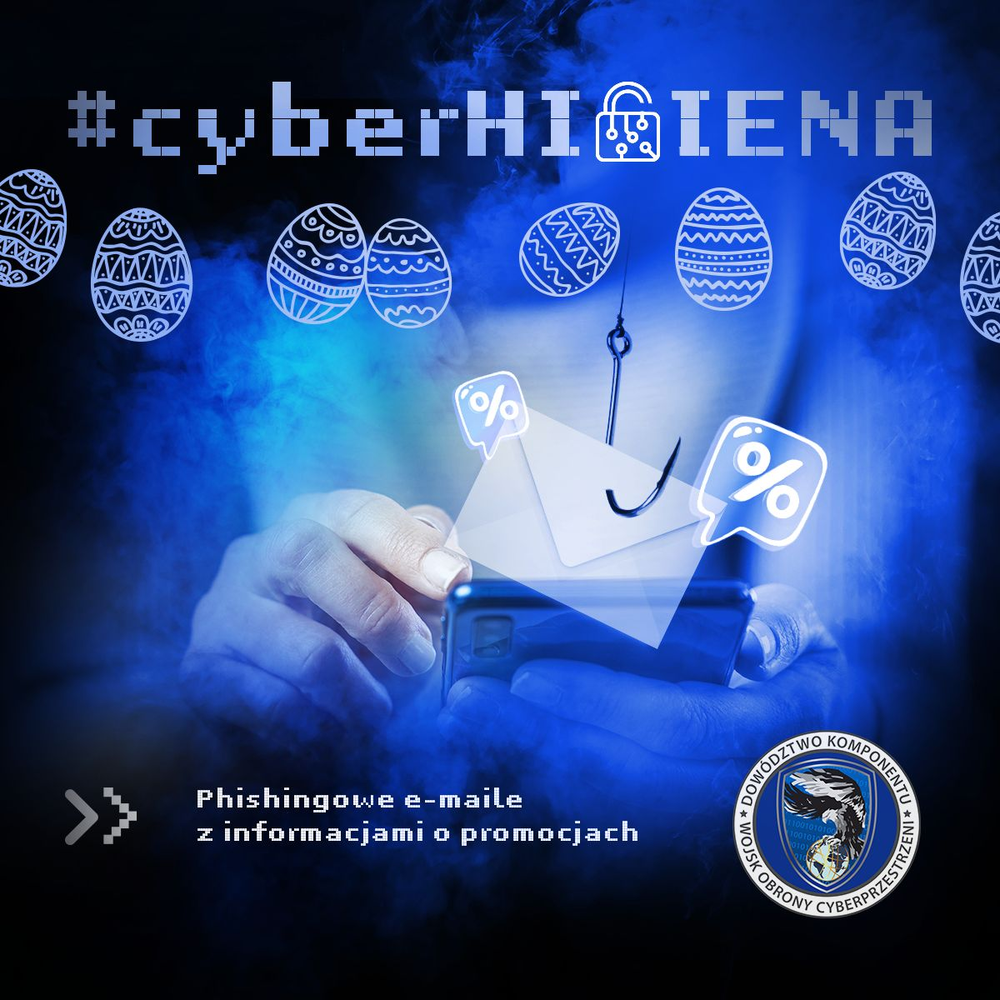  

> Uważaj na e-maile z informacjami o promocjach, ponieważ trwa czas wzmożonej aktywności cyberprzestępców. Wiadomości często zawierają linki do fałszywych stron, których celem jest wyłudzenie danych. Zanim klikniesz w link, sprawdź autentyczność nadawcy lub odwiedź oficjalną stronę sklepu. Bądź ostrożny w sieci!

---

<video width="640" height="480" controls>
<source src="./movies/march/teraz.mp4" type="video/mp4">
Your browser does not support the video tag.
</video>

---

### 2023

BRICS🇷🇺🇨🇳🇮🇳🇧🇷🇿🇦 Chinese Yuan for settlements between Russia, Asia, Africa and Latin America

Fed and ECB are expanding their balance sheet.

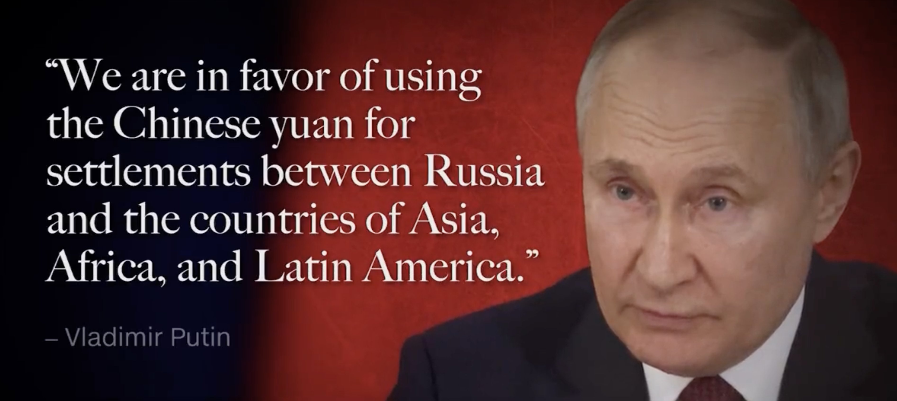  

``USD supply >> demand``

### 2022

> Jarosław Kaczyński: mamy przed sobą niełatwe lata

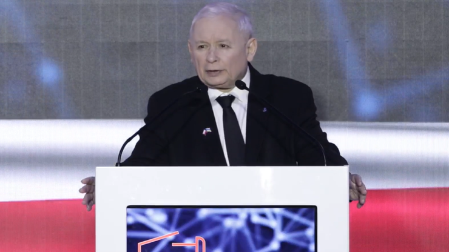  

Musimy pamiętać, że mamy przed sobą niełatwe lata - mówił prezes PiS Jarosław Kaczyński podczas Zjazdu Krajowego Stowarzyszenia OdNowa. Jak wyjaśnił, chodzi o konieczność rozbudowy możliwości obronnych kraju oraz o zbliżający się kryzys gospodarczy. - To wyzwanie dla polskich sił patriotycznych - mówił.

### 2020 - Rule of Fear

Aplikacja "Kwarantanna domowa" autorstwa Ministerstwa Cyfryzacji jednak - wbrew dotychczasowym zapowiedziom - będzie obowiązkowa: nad takim rozwiązaniem pracuje właśnie Sejm.To zły pomysł: wątpliwy konstytucyjnie (art. 51.2), zwłaszcza przy aplikacji, której kodu nie znamy!

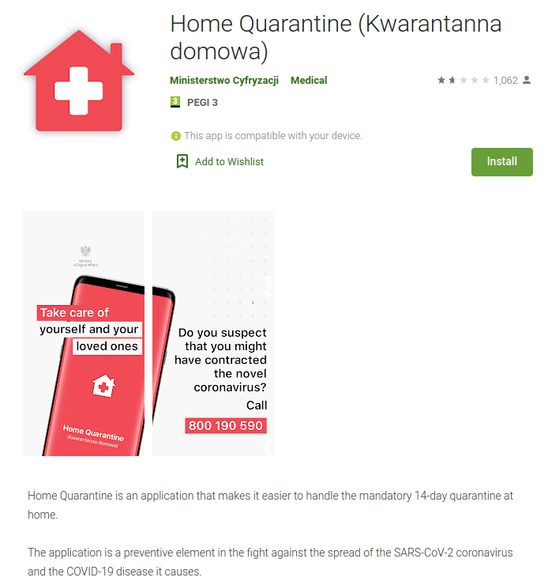  

---

Gowin:

> W najbliższych nie tylko miesiącach, ale sądzę że nabliższych kilku latach my zwolennicy wolnego rynku musimy sie pogodzić z tym, że zakres swobody konkurencji i skala interwencji państwa w gospodarkę będzie znacznie większa.

---

Nie rozumiem tego pomysłu i nawet jego głębszej idei, ale nie chciałbym podejrzewać, że to gra pod wybory, choć niestety, ale wydaje się, że jednym celem władzy jest utrzymanie się u władzy.
Niemniej te rozwiązania, to gaszenie problemów ekonomicznych benzyną. Wprowadzając ceny maksymalne podstawowych produktów żywnościowych rząd spowoduje brak ich dostępności.
Prostym językiem, żadnemu piekarzowi nie będzie opłacało się piec chleba po 5zł gdy koszty produkcji przy szalejącej inflacji wzrosną np. do 20zł.

  

---

1. Chiny skutecznie przygotowały się do wojny nowej generacji – wojny bioinformacyjnej.
Odbyły się ćwiczenia w kraju i pokazały światu mistrzowski warsztat!
Wypowiedziały wojnę bioinformacyjną całemu światu i bez jednego strzału i okupacji pokonały wszystkie kraje. Posłały nieszkodliwy wirus na cały świat, rozprzestrzeniając horror, strach i chaos, śmierć ludzi i zniszczenie gospodarek krajowych na całym świecie!
2. Przeprowadziły spis powszechny ludności. Szybki i skuteczny.
3. Zaostrzono dyktaturę cyfrową. Kontrola sieci społecznościowych i wszelkiej komunikacji.
4. Stworzyły system do szybkiego ustalenia wszystkich kontaktów w sieciach społecznościowych pożądanej osoby: kto jest z nią w kontakcie, z kim się przemieszczała, gdzie była, z kim się komunikowała.
5. Wszyscy nielegalni imigranci zostali zidentyfikowani i wielu zostało eksmitowanych z kraju.
6. Wielu obcokrajowców i szpiegów zostało usuniętych z kraju w łagodny sposób. Sami dążyli do ewakuacji. Resztę zidentyfikowano i przyjęto pod kontrolę.
7. Opracowano mechanizm masowego i ostrego blokowania całego kraju.
8. Pokazano całemu światu do czego zdolne są Chiny. Umieszczenie 1,5 miliarda ludzi w pełnej kwarantannie, założenie na wszystkich masek – to jest potężny wpływ, podobnie jak budowa ogromnego szpitala w ciągu tygodnia.
9. Cały kraj został nauczony, jak dbać o higienę.
10. Przyjęto ustawę zakazującą spożywania dzikich zwierząt, co jest normą w wielu dzielnicach.
11. Pokazano światu, jak bardzo wszystkie kraje są zależne od Chin.
12. Zamrożono wiele łańcuchów produkcyjnych na całym świecie, wywołując globalny kryzys. Zatrzymano całą produkcję na całym świecie!
13. W służbach policyjnych i różnych służbach reagowania kryzysowego masowo wprowadza się użycie dronów i automatycznych urządzeń śledzących.
14. Opracowano system masowego obrazowania termicznego z automatycznym obliczaniem danych anomalii.
15. Zaktualizowano algorytmy działania kamer wideo z rozpoznawaniem twarzy uwzględniając osoby noszące maski, a więc teraz sposób chodzenia osoby jest również uwzględniany w rozpoznawaniu osobowości.
16. Masowo i szybko tworzone są systemy do automatycznej dostawy towarów.
17. Opracowano system elektronicznych obozów koncentracyjnych.
18. Protesty w Hongkongu ustały, a wpływy tamtejszego rządu wzrosły.
19. Najważniejsze.
Podczas gdy świat wciąż pogrąża się w kryzysie, Chiny już go opuściły i za grosze wykupiły akcje wszystkich zagranicznych firm działających w Chinach.
Kupują tańsze aktywa wszystkich przedsiębiorstw na całym świecie.
Pomagają słabym finansowo państwom, zwiększając swój wpływ globalny. Zyskuje na niższych cenach ropy.
Tworzą nowe sojusze i porozumienia.
Podczas gdy cały świat zmaga się z fikcyjną pseudo-epidemią KORONAWIRUSA (COVID-19), przejęły kontrolę nad całym światem!
Z powyższych informacji wynika, że kierownictwo i parlamenty wszystkich krajów na świecie znalazły się pod całkowitą kontrolą Chin, wykorzystując najnowsze technologie, które są głównie produkowane w ich kraju i od wielu lat dostarczane na całym świecie.
Póki Rosja, USA i Europa decydowały, kto zdominuje świat, Chiny zasiadły w fotelu królewskim.
Smutne, ale fakty mówią same za siebie!"

Foliarstwo w połowie punktów, ale druga warta choćby zastanowienia.

### 2007

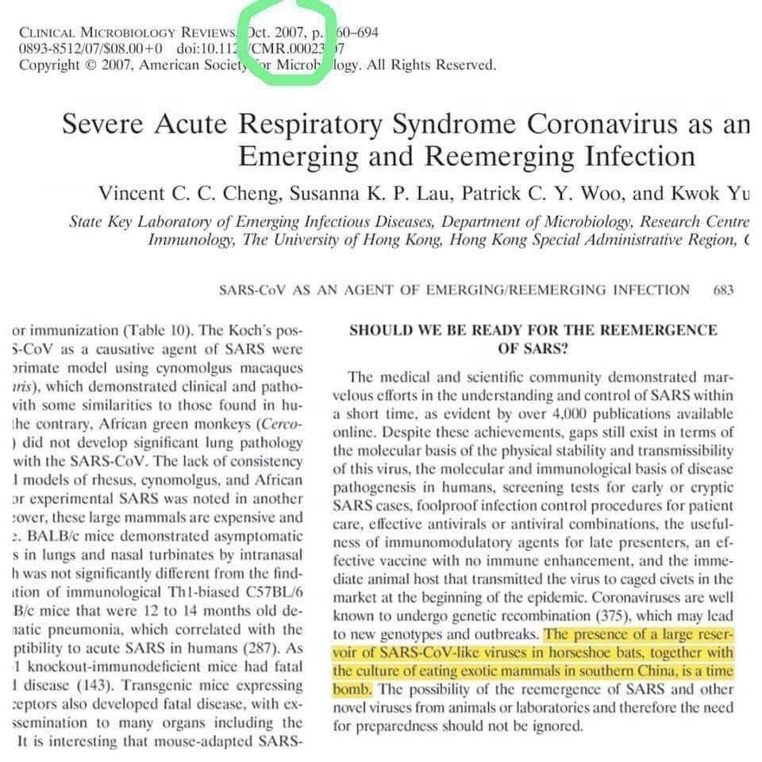  

### 2006

W szpitalu klinicznym Collegium Medicum UJ w Krakowie zmarł Stanisław Lem - najwybitniejszy polski pisarz literatury fantastycznonaukowej. Kawaler Orderu Orła Białego. 
Urodził się we Lwowie jako jedyne dziecko Samuela Lema (1879–1954), lwowskiego lekarza i Sabiny Woller (1892–1979). Od najmłodszych lat fascynowała go literatura fantastyczna. Ukończył medycynę, ale nigdy nie prowadził własnej praktyki lekarskiej. Zadebiutował w 1946 roku.  Do najbardziej znanych dzieł tego pisarza należą powieści: Astronauci (1951), Solaris (1961) oraz zbiory opowiadań : Dzienniki gwiazdowe (1957), Bajki robotów (1961), Cyberiada (1965), Opowieści o pilocie Pirxie (1968. )Poza tym Lem tworzył również filozoficzne eseje (Summa technologiae, 1964; Filozofia przypadku. Literatura w świecie empirii,1968.) Jego książki przetłumaczono na ponad 40 języków obcych. Zabawne przygody jego bohaterów zawierają ważkie prawdy o człowieku, jego wielkości i małości zarazem, ukrywają pytania o granice nauki, są przestrogą dla tych, którzy wierzą w oświeceniową ideę nieskończonego postępu.

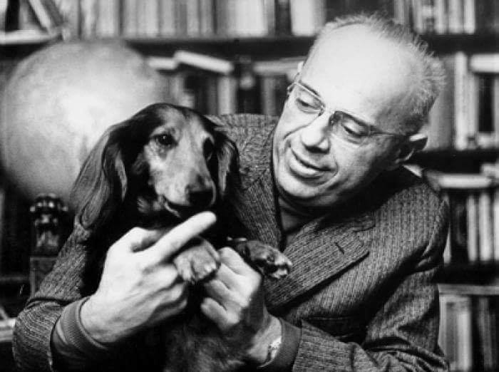  

### 1981

W Warszawie generał Wojciech Jaruzelski i I sekretarz KC PZPR Stanisław Kania podpisali tajne dokumenty ramowe dotyczące wprowadzenia w Polsce stanu wojennego. Podpisane zostały dokumenty o działaniu centralnej administracji państwowej w warunkach stanu wojennego i działaniu jednostek wojskowych.
Dokumenty te stały się później początkiem materiału dowodowego w procesie przeciwko Jaruzelskiemu, któremu postawiony został zarzut zbrodni komunistycznej polegającej na kierowaniu od 27 marca 1981 r. do 12 grudnia 1981 r. i od 13 grudnia 1981 r. do 31 grudnia 1982 r. zorganizowanym związkiem przestępczym o charakterze zbrojnym, mającym na celu popełnianie przestępstw.

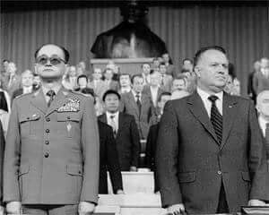  

### 1940

Wszedł do powszechnego obiegu wyemitowany 1 marca nowy banknot 100 złotowy. Zaprojektował go już w 1932 roku Leonard Sowiński. Banknot był drukowany na papierze białym o odcieniu kremowym w drukarni Wiener Staadsdruckerei w Wiedniu. Wycofano go z obiegu 10 stycznia 1945 roku.

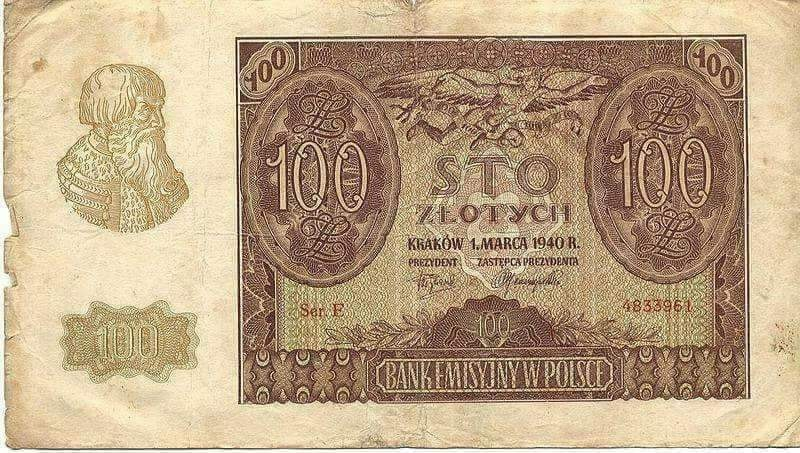  

### 1925

Polska ratyfikowała podpisany 10 lutego 1925 roku konkordat ze Stolicą Apostolską.
Na jego mocy Kościół w Polsce zyskał prawie całkowitą swobodę w obsadzie i nominacjach kościelnych bez ingerencji państwa.
Istotnym postanowieniem konkordatu było wprowadzenie obowiązku nauczania religii w szkołach powszechnych i średnich, a biskupi zyskali wpływ na wybór nauczycieli tego przedmiotu. Jednak najważniejszym zapisem tego dokumentu było uznanie przez Watykan nowych granic Rzeczypospolitej.
Wybuch drugiej wojny światowej mocno zweryfikował realizację postanowień zawartych w konkordacie. Stolica Apostolska, działając wbrew postanowieniom konkordatu z Polską, lecz zgodnie z postanowieniami
konkordatu z III Rzeszą (1933), włączyła w 1939 roku części diecezji częstochowskiej, diecezji katowickiej i archidiecezji krakowskiej, które znalazły się na terytorium Rzeczypospolitej Polskiej anektowanym przez III Rzeszę, do niemieckiej archidiecezji wrocławskiej oraz ustanowiła niemieckich administratorów apostolskich diecezji chełmińskiej i archidiecezji gnieźnieńsko-poznańskiej.
Konkordat przestał obowiązywać 12 września 1945 roku, kiedy to strona polska w postaci Rady Ministrów Tymczasowego Rządu Jedności Narodowej stwierdziła, że Watykan złamał artykuł 9 dokonując w 1939 roku mianowania administratorów apostolskich oraz zmian granic wspomnianych wcześniej diecezji.

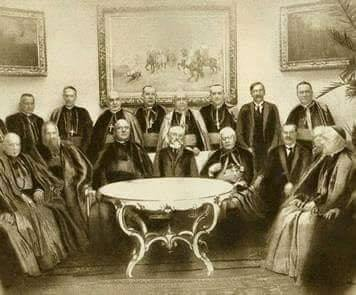  

### 1914

Belgijski chirurg Albert Hustin dokonał pierwszej udanej, niebezpośredniej transfuzji krwi.
W starożytnym piśmiennictwie oraz w zabytkach sztuki asyryjskiej, babilońskiej i greckiej znajdujemy wzmianki o leczniczych kąpielach z krwi, a także o stosowaniu jej jako składnika wielu ówczesnych leków. Również Rzymianie i Grecy pili w celach leczniczych świeżą krew zwierząt lub gladiatorów zabitych na arenie, w przekonaniu, że postępowanie takie może przyczynić się do poprawy stanu ich zdrowia, a szczególnie wzmocnić osoby chore i osłabione. Przekazy o piciu krwi w celach leczniczych zachowały się również z wieków średnich.
Wiarygodne doniesienia o przetoczeniu krwi pochodzą jednak dopiero z wieku XVII, kiedy to angielski lekarz William Harvey po raz pierwszy opisał w sposób naukowy krążenie krwi w ludzkim organizmie. Na podstawie jego pracy w drugiej połowie XVII wieku podejmowano wiele prób przetaczania ludziom krwi zwierzęcej, np. psiej lub jagnięcej.
wielu doniesień o takich zabiegach najlepiej udokumentowane jest przetoczenie około 270 ml krwi tętniczej jagnięcia dokonane w 1667 r. przez Jean Baptiste Denisa, nadwornego lekarza Ludwika XIV. Chłopiec, któremu Denis przetoczył krew, znajdował się w ciężkim stanie po licznych „leczniczych” krwioupustach, którymi próbowano wyleczyć go z gorączki. Uzasadniając wybór „krwiodawcy” Denis stwierdził m.in., że krew zwierzęca jest bardziej czysta od ludzkiej, a to ze względu na właściwą ludziom skłonność do „rozwiązłości i niepomiarkowania w jedzeniu i piciu”. Chłopiec przeżył ten zabieg, a nawet wyzdrowiał, co zachęciło Denisa do dalszych prób. Niestety czwarty chory poddany transfuzji zmarł, co stało się przyczyną pierwszego w historii procesu o błąd lekarski z dziedziny transfuzjologii. Lekarz został ostatecznie uniewinniony przez sąd, jednak przetaczanie krwi zyskało już złą sławę, również ze względu na opisywane przez innych eksperymentatorów ciężkie, a nawet śmiertelne powikłania. W wielu państwach wprowadzono nawet prawny zakaz przetaczania krwi u ludzi. W znacznej części Europy zakaz ten obowiązywał przez ponad 150 lat.
Idea leczenia krwią, szczególnie w przypadku masywnych krwotoków, skłaniała jednak lekarzy do podejmowania dalszych prób. Na początku XIX wieku angielski położnik i fizjolog James Blundell przetoczył ludzką krew 10 kobietom po krwotokach porodowych. Pięć z nich udało się dzięki temu uratować. Zaobserwowano jednocześnie szereg niepokojących objawów, stanowiących wskazanie do przerwania transfuzji, takich jak niepokój, drżenie rąk, wymioty i bóle brzucha.
Pomimo ciężkich powikłań i znacznej śmiertelności przetaczanie krwi rozpowszechniło się następnie w całej Europie, a później także w Ameryce. Pierwszym polskim lekarzem, który przeprowadził doświadczenia na zwierzętach, a następnie przetaczał krew ludzką, był prawdopodobnie Ludwik Bierkowski, który w latach 1827-29 ogłosił 3 prace na temat leczenia krwią. W 1836 roku Karol Marcinkowski ogłosił pracę "O przetaczaniu krwi jako środka leczniczego".
Odkryć przełomowych dla dalszego rozwoju współczesnej transfuzjologii dokonano jednak dopiero na początku XX wieku. Decydujące znaczenie miało odkrycie układu grupowego ABO (Landsteiner, rok 1901), a także pokonanie trudności związanych z krzepnięciem krwi (rok 1914), dzięki zastosowaniu cytrynianu sodu, będącego do dziś podstawowym składnikiem większości roztworów konserwujących krew i jej składniki. Umożliwiło to przechowywanie krwi przed przetoczeniem i dało początek tzw. transfuzjom pośrednim, co w następstwie umożliwiło tworzenie banków krwi. W 1940 r. Landsteiner i Wiener odkryli inny ważny dla transfuzjologii antygen występujący w krwinkach czerwonych większości ludzi, tzw. czynnik Rh.
Początek rozwoju krwiolecznictwa w wolnej Polsce datuje się na okres międzywojenny. Dzięki wielu propagatorom leczenia przetaczania krwi (Hirszfeld, Gnoiński, Sokołowski, Rutkowski, Szarecki, Ostrowski, Aleksandrowicz i in.) przetaczano krew w niektórych większych szpitalach. Stosowano zasadniczo metodę bezpośrednią (tj. z krążenia biorcy do krążenia dawcy), a przetaczanie krwi konserwowanej należało do rzadkości. Dawcy rekrutowali się z ośrodków akademickich (Warszawa, Kraków, Poznań). Nie istniała jednak zorganizowana ogólnopolska sieć placówek służby krwi.
Dopiero po II wojnie światowej w latach 1945 - 49 Polski Czerwony Krzyż utworzył z ramienia Ministerstwa Zdrowia pierwsze stacje krwiodawstwa, początkowo w Łodzi, następnie w Warszawie, Poznaniu, Katowicach, Gdańsku, Szczecinie, Krakowie i Lublinie.
W roku 1951 powołano do życia Instytutu Hematologii w Warszawie, co wiązało się z pilną potrzebą zorganizowania w kraju nowoczesnej służby krwi. Długofalowo Instytut miał czuwać nad rozwojem transfuzjologii i hematologii oraz - w imieniu Ministerstwa Zdrowia - sprawować nad obu dyscyplinami nadzór merytoryczny. W roku 1992 Instytut zmienił nazwę na Instytut Hematologii i Transfuzjologii.
Istotną rolę w rozwoju honorowego krwiodawstwa odgrywają również: Polski Czerwony Krzyż, Kluby Honorowych Dawców Krwi, które zaczęły powstawać już w latach 60-tych, a także inne organizacje stawiające sobie za cel propagowanie honorowego krwiodawstwa (np. Europejska Fundacja Honorowego Dawcy Krwi).
Obecnie, na początku XXI wieku, składniki krwi i produkty krwiopochodne należą wciąż do najczęściej stosowanych środków leczniczych. W Polsce wykonuje się rocznie około 1,5 miliona przetoczeń składników krwi. Jej pobieraniem, oddzielaniem składników i wydawaniem zajmują się Regionalne Centra Krwiodawstwa i Krwiolecznictwa, których obecnie w Polsce znajduje się 21. Na świecie dokonuje się obecnie co roku około 80 milionów pobrań krwi.

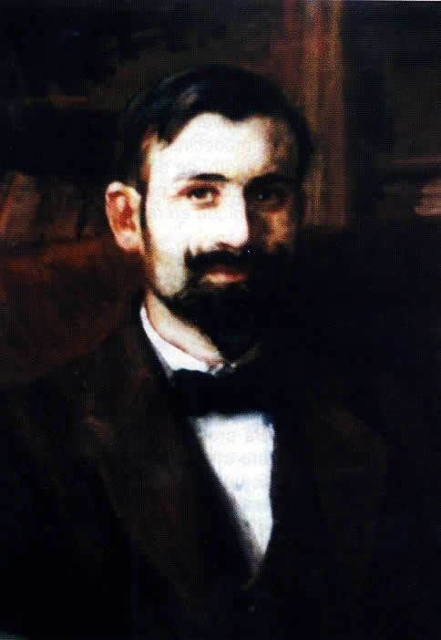  

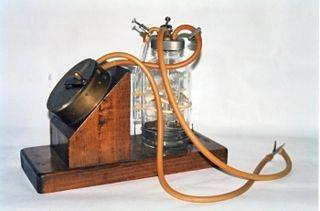  

### 1899

W Warszawie powstało pierwsze polskie stowarzyszenie elektrotechniczne. Nosiło ono nazwę "Delegacja Elektrotechniczna" i wchodziło w skład skład Sekcji I Techniczno-Przemysłowej Warszawskiego Oddziału Popierania Rosyjskiego Przemysłu i Handlu.
Inicjatorem powstania tego stowarzyszenia był inżynier budowlany i działacz społeczny Kazierz Obrębowicz (grafika).
Na uwagę zasługują dokonania Komisji Przepisowej Delegacji Elektrotechnicznej, jej członkowie opracowali lub przetłumaczyli z języka niemieckiego przepisy bezpieczeństwa dotyczące instalacji elektrycznych, doraźnej pomocy w nieszczęśliwych wypadkach i funkcjonowania dźwigów elektrycznych. W 1901 roku rozpoczęła działalność Sekcja Elektrotechniczna w Towarzystwie Politechnicznym we Lwowie.

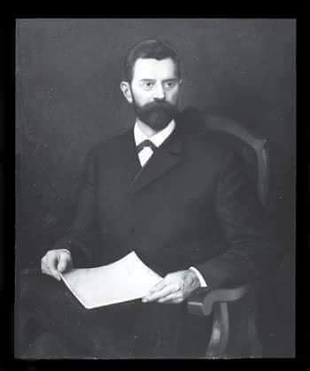  

### 1863

W czasie powstania styczniowego, dzięki protekcji prokuratora generalnego neofity Juliusza Enocha, margrabia Aleksander Wielopolski (zdjecie) został mianowany dyrektorem głównym prezydującym w Komisji Rządowej Wyznań Religijnych i Oświecenia Publicznego. 
Był on autorem tzw "ustawy o zbiegowiskach", którą już 7 kwietnia 1863 roku podpisał rosyjski generał Michaił Gorczakow.
Decyzja ta utorowała drogę do masakry bezbronnej ludności Warszawy przez wojsko rosyjskie 8 kwietnia na placu Zamkowym.

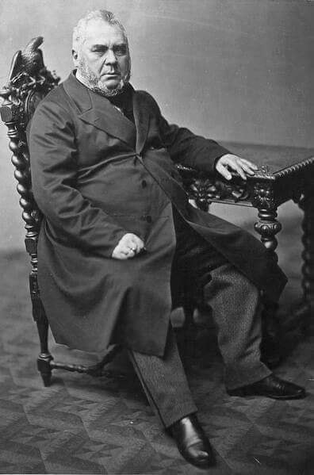  

---

<a href="https://github.com/TomaszWaszczyk/historia.waszczyk.com/edit/master/src/content/march-27.md" target="_blank">Edytuj tę stronę dzieląc się własnymi notatkami!</a>
