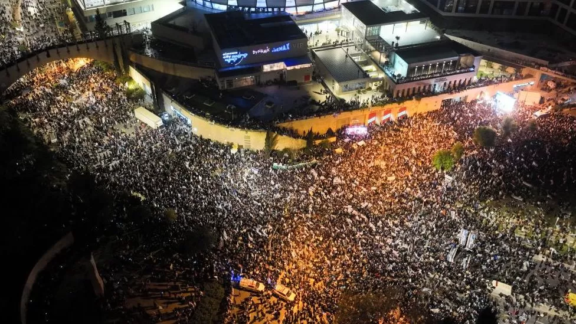
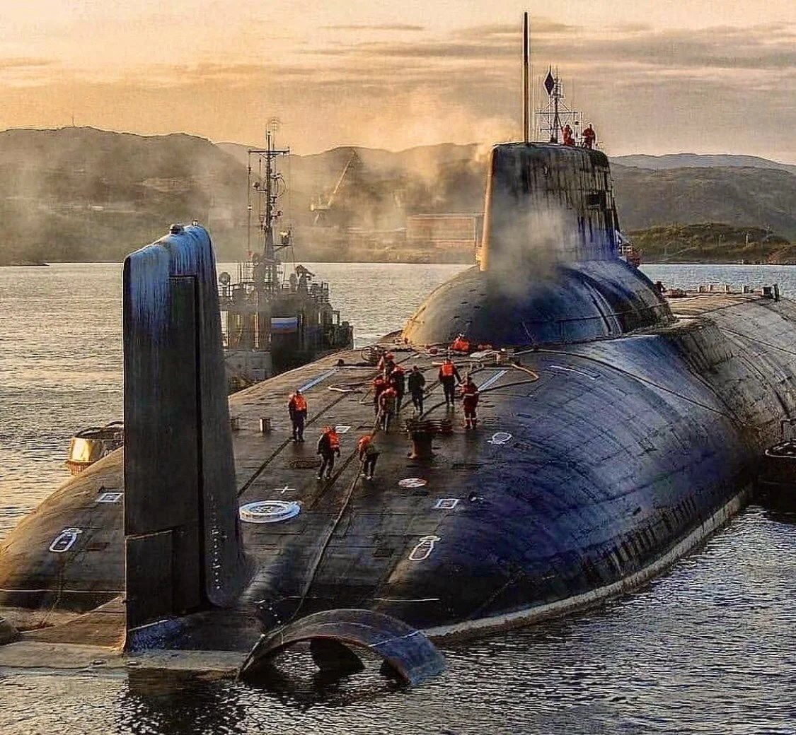
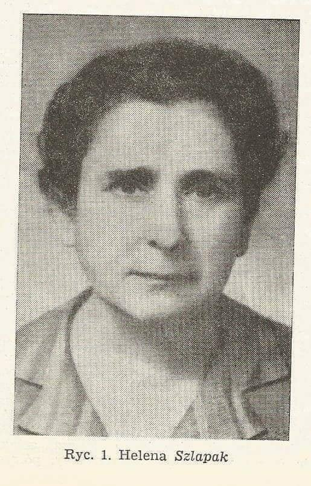
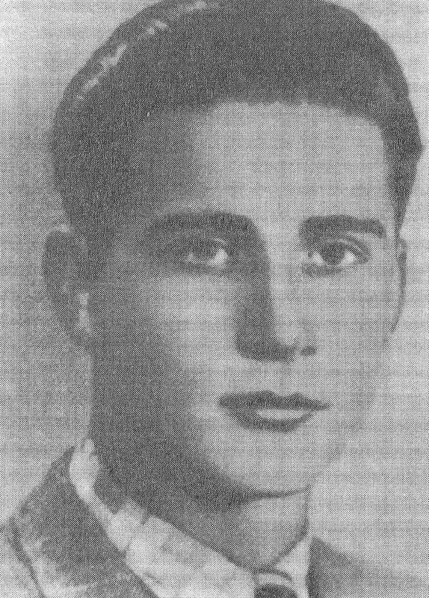
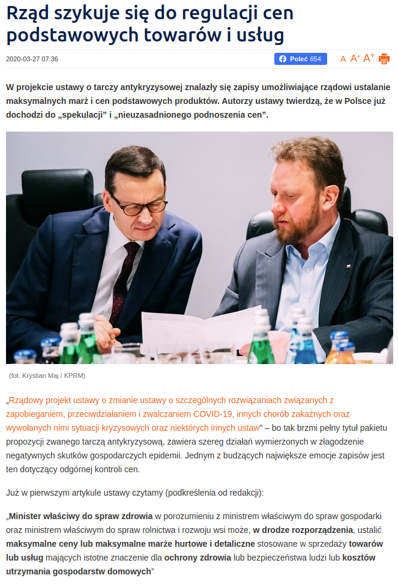
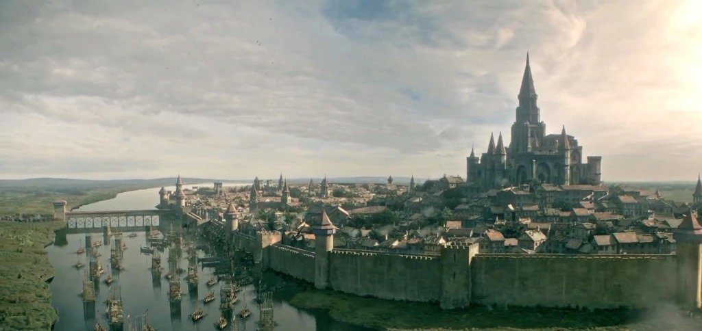

### 2023

Massive protests as millions of people have gone to the streets to express their dissent against the recent pension reform.

On top of that, the biggest French banks including Societe Generale and BNP Paribas have just been raided by the country's financial prosecutor in €100 billion tax fraud and money laundering related to dividend payments.

<video width="640" height="480" controls>
<source src="./movies/march/france2023.mp4" type="video/mp4">
Your browser does not support the video tag.
</video>

Are we witnessing the beginning of French Revolution 2.0? 🤔

---

Israel protests: PM Netanyahu delays legal reforms after day of strikes

  

---

...

<video width="640" height="480" controls>
<source src="./movies/march/russia.mp4" type="video/mp4">
Your browser does not support the video tag.
</video>

---

### 2021

Since the Suez Canal is the news, it's a good moment to share some history: From 1967 to 1975 the canal was intentionally blocked by the Egyptian military (using ships and naval mines) in response to the Israeli seizure of the Sini Peninsula during the Six-Day War.

### 2020

Pandemia zrodziła się w Chinach, ale kiedy zachód zatrzymał swoje gospodarki, kraje  takie jak:

- Chiny
- Korea Południowa
- Singapur
- Japonia
- Tajwan

Już swoje gospodarki w pełni uruchomili, dlatego kiedy małe firmy w Europie zostaną zamknięte kraje powyższe zostaną znacznie mocniej zintegrowane z europejskimi łańcuchami dostaw.

---

  

---

  

---

Wygląda na to, że rządowa "Tarcza" posłużyła do osłony zmian w kodeksie wyborczym. W serii całonocnych głosowań przepchnięta została przez PiS autopoprawka, która umożliwia głosowanie korespondencyjne ludziom znajdującym się w okresie kwarantanny i osobom powyżej 60 roku życia. Wybory prezydenta będą więc mogły odbyć się nawet podczas szczytu epidemii.
To tyle, jeśli chodzi o władzę. A co z pieniędzmi? Spokojnie. Teraz przyjdzie czas na regułę ustalającą maksymalną kwotę i limit przyrostu wydatków.
W ustawie o finansach publicznych ta numeryczna reguła (SRW), w obecnym kształcie, opisana została w art. 112aa. Jednak kawałek dalej znajduje się króciutki art. 112d, gdzie w dobrej wierze wyliczono sytuacje, kiedy reguła może zostać wyłączona za sprawą "złych czasów".
Są tam 3 takie przypadki: stan wojenny; stan wyjątkowy; stan klęski żywiołowej. Wystarczy więc tylko teraz w drodze niewielkiej nowelizacji dopisać do tego zestawu "stan epidemii".
Będą wybory. Będzie władza. Będą pieniądze. Tylko, co będzie dalej? Kawałek dalej będzie art. 86 pkt. 1(2) tej samej ustawy. Trzeba będzie przecież coś zrobić z restrykcjami nałożonymi na finanse publiczne, kiedy dług znajduje się w przedziale 55%-60% PKB.
A co będzie jeszcze dalej? A, to już mniej więcej wiadomo...

---

## Pod osłoną nocy większość polityczna w Sejmie uchwaliła ekspresowo zmianę Kodeksu wyborczego, polegającą na możliwości głosowania korespondencyjnego przez wybrane grupy osób

Lista naruszeń prawa jest długa:
1. Naruszenie zasady trzech czytań - nie można w jeden dzień przegłosować tak istotnej zmiany Kodeksu wyborczego, zgłoszonej jako poprawka już w trakcie procesu legislacyjnego.
(Art. 119 Konstytucji: "Sejm rozpatruje projekt ustawy w trzech czytaniach").
2. Naruszenie zasady wydłużonego trybu pracy nad kodeksami - nie było możliwości przeanalizować i przedyskutować tak istotnej kwestii ustrojowej, jaką jest sposób głosowania w wyborach, określony w Kodeksie wyborczym. Czas, jaki powinien upłynąć, to co najmniej 14 dni od momentu wniesienia projektu do Sejmu.
(Art. 123 Konstytucji: "Rada Ministrów może uznać uchwalony przez siebie projekt ustawy za pilny, z wyjątkiem [...] ustaw dotyczących wyboru Prezydenta Rzeczypospolitej, [,...], a także kodeksów"; art. 89 ust. 2 regulaminu Sejmu: "Pierwsze czytanie projektu zmian kodeksu lub projektu zmian przepisów wprowadzających kodeks może się odbyć nie wcześniej niż czternastego dnia od doręczenia posłom druku projektu").
3. Naruszenie określonej w Konstytucji i potwierdzonej przez Trybunał Konstytucyjny zasady, że nie zmienia się reguł gry w czasie gry. Zgodnie z zasadą demokratycznego państwa prawnego, istotne zmiany dotyczące procesu wyborczego mogą być wprowadzone najpóźniej 6 miesięcy przed wyborami.
(orzeczenia TK o sygn. K 31/06, Kp 3/09, K 9/11)
4. Naruszenie zasady równości wobec prawa przez nieuzasadnione uprzywilejowanie osób objętych kwarantanną czy izolacją w związku z koronawirusem i pokrzywdzenie innych osób, między innymi chorych na inne choroby, których udział w wyborach jest tak samo utrudniony, a nie będą one mogły głosować korespondencyjnie. 
(Art. 32 ust. 1 Konstytucji: "Wszyscy są wobec prawa równi. Wszyscy mają prawo do równego traktowania przez władze publiczne").
5. Naruszenie zasady, że wybory są powszechne. Z oczywistych względów podporządkowanie się zaleceniom medycznym, by pozostać w domu (#zostanwdomu) i nie narażać innych na zagrożenie zarażenia koronawirusem, ograniczy prawo wyborcze dla setek tysięcy obywateli, którzy będą zmuszeni do głosowania stacjonarnego z narażeniem własnego zdrowia. 
(art. 127 Konstytucji: "Prezydent Rzeczypospolitej jest wybierany przez Naród w wyborach powszechnych, równych, bezpośrednich i w głosowaniu tajnym.")
6. Naruszenie zasady wyłaniania władzy przez Suwerena. Większość obywateli nie może wziąć bezpiecznie udziału w procesie wyborczym, a została pozbawiona prawa do głosowania korespondencyjnego.
(Art. 4 Konstytucji: "Władza zwierzchnia w Rzeczypospolitej Polskiej należy do Narodu. Naród sprawuje władzę przez swoich przedstawicieli lub bezpośrednio").
Oprócz tego chodzi także o konstytucyjne oszustwo, polegające na świadomym niewprowadzeniu stanu nadzwyczajnego, mimo że faktycznie mamy w Polsce stan nadzwyczajny (nadzwyczajny tryb pracy Sejmu, zakaz zgromadzeń, restrykcje w przemieszczaniu się, zamknięte sklepy, kina, siłownie, ograniczenia swobody praktyk religijnych). 
A w stanie nadzwyczajnym nie można w ogóle przeprowadzać wyborów!
(Art. 228 ust. 7 Konstytucji: "W czasie stanu nadzwyczajnego oraz w ciągu 90 dni po jego zakończeniu [...] nie mogą być przeprowadzane wybory do Sejmu, Senatu, organów samorządu terytorialnego oraz wybory Prezydenta Rzeczypospolitej, a kadencje tych organów ulegają odpowiedniemu przedłużeniu [...]").
To wszystko oznacza, że WYBORY BĘDĄ NIELEGALNE - podkreślałem w TVN24. 
W komentarzach znajdziecie namiary na moją poranną rozmowę telefoniczną na antenie (przed godz. 8) oraz więcej analiz i wypowiedzi prawniczych.

---

### 2007

Jeden z największych okrętów podwodny świata - Tajfun (Typhoon tak, tak Marko Ramius i "Czerwony Pazdziernik").
Pamiętacie scenę, którą rozpoczyna się film "Polowanie na Czerwony Październik"? Choć twórcy filmu nie mieli okazji, by zobaczyć Tajfuna na żywo, dobrze oddali ogrom największego okrętu podwodnego, jaki kiedykolwiek zbudowano.
Tajfuny, czyli okręty projektu 941, to szczytowe osiągnięcie czasów zimnej wojny – potężne maszyny, które skonstruowano bez żadnych kompromisów związanych z ekologią czy kosztami. Są zarazem świetnym przykładem kunsztu Siergieja Kowalowa i biura konstrukcyjnego Rubin, odpowiadającego za większość projektów radzieckich okrętów podwodnych z napędem jądrowym.
Warto wyjaśnić w tym miejscu kwestię nazewnictwa, która bywa niekiedy przyczyną nieporozumień. Wynikają one z faktu, że Typhoon (i jego polski odpowiednik - Tajfun) to natowska, kodowa nazwa bohatera tego postu.
Pod względem długości kadłuba 175-metrowy Tajfun tylko nieznacznie góruje nad innymi, długimi okrętami, jak rosyjski Borei czy amerykański typ Ohio. Kluczowa i świadcząca o niebywałych rozmiarach okrętu jest za to wyporność, na którą rzutuje pękaty, bardzo pojemny kadłub. Tajfun ma w zanurzeniu wyporność 48 tys. ton, czyli tyle, ile w czasie II wojny wypierały największe z amerykańskich pancerników typu Iowa, a zarazem 2-3 razy więcej od największych okrętów podwodnych innych typów.
Ale po co taki okręt?
Śledząc rozwój radzieckiej floty podwodnej, można odnieść wrażenie, że budowa takiego okrętu mijała się z celem – po serii okrętów typu Golf ZSRR wprowadził do służby typ Hotel i Yankee, a od 1972 roku atomowe okręty podwodne typu Delta, które - w wersji Delta III i Delta IV - są używane również współcześnie.
W ciągu lat rozwijały się jednak nie tylko okręty, ale również ich najważniejsza broń – strategiczne pociski rakietowe z głowicami jądrowymi, określane jako SLBM (Submarine-launched Ballistic Missile). W latach 70. opracowano pocisk nowego typu, cechujący się nie tylko nieosiągalną wcześniej celnością i dużym zasięgiem, ale również rozmiarami.
Aby nie dopuścić do sytuacji, w której radziecka flota będzie dysponowała niezłymi rakietami, ale zabraknie jej okrętów podwodnych zdolnych do ich przenoszenia, zdecydowano o budowie serii Tajfunów.
Były to zarazem pierwsze okręty zaprojektowane zgodnie z nową koncepcją prowadzenia walki. Ich poprzednicy byli konstruowani według innych założeń. Zadaniem okrętów klasy Delta i wcześniejszych było możliwie szybkie i skryte dopłynięcie w pobliże amerykańskiego wybrzeża, skąd miały przeprowadzić atak rakietowy.
Śpiew ptaków na głębokości 400 metrów i basen? WTF.
Tajfuny nie musiały tego robić, ponieważ miały broń o znacznie większym zasięgu. Nie musiały również być szybkie - ich rolą nie była zabawa w kotka i myszkę z systemem SOSUS i przekradanie się na Atlantyk, ale skuteczne ukrycie się gdzieś wśród lodów Arktyki i oczekiwanie na rozkaz ataku.
Temu celowi podporządkowano całą konstrukcję okrętu, choć osiągana prędkość – 27 węzłów – również nie stanowiła powodu do wstydu. Tajfuny były zdolne do zanurzenia się na głębokość do 400 metrów. Pod wodą mogły przebywać nawet cztery miesiące, a gdy w końcu zdecydowano się na wynurzenie, okręt był w stanie wydostać się na powierzchnię, przebijając wielometrową warstwę lodu.
Biorąc pod uwagę obciążenie, jakie dla psychiki stanowi długotrwałe przebywanie w zanurzeniu, konstruktorzy okrętu wprowadzili szereg udogodnień dla marynarzy. 160-osobowa załoga mogła cieszyć się z wyjątkowego jak na okręty podwodne komfortu. Poza nietypowo obszernymi pomieszczeniami na Tajfunie znajdowała się m.in. sala gimnastyczna, basen, sauna, kino i ptaszarnia, w której można było ukoić skołatane nerwy śpiewem ptaków.
Sama konstrukcja okrętu również mocno odbiegała od standardu, jakim jest jeden kadłub sztywny, na zewnątrz którego znajduje się kadłub lekki. W Tajfunie obok siebie umieszczono dwa kadłuby sztywne otoczone jednym lekkim. Z tego powodu można spotkać się z określaniem tych okrętów mianem podwodnych katamaranów. Niekonwencjonalne jest również pokrycie kadłuba – Tajfuny zostały obłożone płytkami z gumy, co wpłynęło na dodatkowe wyciszenie okrętu i utrudniło jego wykrycie.
6 okrętów to 1200 głowic MIRV:
Pierwszy Tajfun wszedł do służby w marcu 1983 roku. Do 1989 roku ukończono w sumie 6 okrętów (budowę siódmego przerwano), które zgrupowano w Pierwszej Flotylli Atomowych Okrętów Podwodnych, stacjonujących w bazie Zapadnaja Lica na Półwyspie Kolskim.
Ich uzbrojenie stanowiły opracowane w latach 70. i wprowadzone do służby w 1983 roku rakiety R-39, nazywane w NATO SS-N-20 Sturgeon. Każda z rakiet miała 16 metrów długości, ważyła 83 tony i mogła dostarczyć 10 jądrowych głowic MIRV (Multiple Independently Targetable Reentry Vehicle) na odległość 8,3 tys. kilometrów.
Ponieważ okręty typu Tajfun mogły przenosić 20 rakiet R-39, to Pierwsza Flotylla w pełnym składzie mogła wykonać atak z użyciem 1200 głowic jądrowych, z których każda mogła zostać skierowana na inny cel. Choć potencjał Tajfunów z pewnością nie był powodem do radości natowskich dowódców, to po zakończeniu zimnej wojny okręty, projektowane w zupełnie innych realiach, zaczęły pokazywać swoje wady.
Bardzo wysokie koszty eksploatacji sprawiły, że od 1996 roku rozpoczęto stopniowe wycofywanie okrętów. Obecnie w służbie pozostaje tylko jeden Tajfun, który jednak nie jest jednostką bojową (w tej roli zastąpił go, mozolnie i z wielkimi opóźnieniami wprowadzany od 2007 roku typ Borei), ale platformą testową dla nowych rakiet balistycznych.

  

### 1996

W sądzie w Gdańsku rozpoczął się proces oskarżonych o sprawstwo kierownicze śmierci 44 osób w grudniu 1970 roku.
Na ławie oskarżonych zasiedli: generał armii Wojciech Jaruzelski – szef MON
Kazimierz Świtała – szef MSW
Stanisław Kociołek – wicepremier rządu PRL
generał broni Tadeusz Tuczapski – wiceszef MON generał broni Józef Kamiński – dowódca Pomorskiego Okręgu Wojskowego
generał brygady Stanisław Kruczek – dowódca 8. Dywizji Zmechanizowanej
generał brygady Edward Łańcucki – dowódca 16. Dywizji Pancernej
podpułkownik Mirosław Wiekierka – dowódca 3. Batalionu 55. Pułku Zmechanizowanego
major Wiesław Gop – dowódca plutonu 10 Pułku Wojsk Obrony Terytorialnej
pułkownik Władysław Łomot – dowódca 32. Pułku Zmechanizowanego
podpułkownik Bolesław Fałdasz – zastępca Łomota ds. politycznych
pułkownik MO Karol Kubalica – komendant Szkoły Podoficerskiej MO w Słupsku.
Obrońcy Jaruzelskiego, Świtały i Kociołka złożyli wniosek o umorzenie sprawy, gdyż osoby te „nie podlegają orzecznictwu sądów karnych”, tylko Trybunałowi Stanu. Niespełna miesiąc później Sąd Wojewódzki w Gdańsku w sprawie Grudnia 70 umorzył postępowanie przeciwko Jaruzelskiemu i Świtale, odmówił umorzenia sprawy Kociołka. Prokurator, oskarżyciele posiłkowi oraz obrońca Kociołka wnieśli zażalenie do Sądu Apelacyjnego.

  

### 1979

Instytut Pamięci Narodowej Bohaterów i Męczenników Holocaustu Yad Vashem przyznał doktor Helenie Szlapak medal Sprawiedliwy wśród Narodów Świata, jako dowód uznania, że narażając własne życie ukrywała w czasie okupacji niemieckiej Chanę Orbach , Helenę Goldman oraz Irenę Leinkram, jak również służyła pomocą innym Żydom, którzy byli prześladowani, i którym groziła śmierć z rąk hitlerowskiego okupanta. 
Dr Helena Szlapak pracowała jako lekarz domowy Ubezpieczalni Społecznej w Krakowie oraz jako lekarz fabryczny. Specjalizowała się w ginekologii i położnictwie. Włączyła się w działalność Gwardii Ludowej Polskiej Partii Socjalistycznej oraz w działalność Patronatu – organizacji niosącej pomoc więźniom osadzonym w więzieniu przy ul. Montelupich w Krakowie.
Dr Szlapak należała także do tzw. sieci przyoświęcimskiej, która przekazywała grypsy do i z obozu, przemycała lekarstwa oraz cyjankalia. Dla przygotowujących się do ucieczki z obozu dostarczano także peruki pochodzące z jednego z krakowskich teatrów. „Sieć przyoświęcimska”, którą stworzył i którą długo dowodził Adam Rysiewicz, znalazła szersze poparcie i w marcu 1943 r. przeobraziła się w Komitet Pomocy Więźniom Obozów Koncentracyjnych. W jego skład weszli: hrabina Teresa Estreicher-Lasocka, dr med. Helena Szlapak, Adam Rysiewicz i Wojciech Jekiełek.
Swoje mieszkanie przy ul. Garbarskiej 12 dr Szlapak udostępniała na potrzeby spotkań działaczy PPS, kolportażu prasy podziemnej, fałszowania dokumentów i ukrywania osób zagrożonych. Dzięki jej sprytowi i zapobiegliwości udało się ukryć i bezpiecznie przechować wszystkie grypsy i fotografie pochodzące z obozu Auschwitz-Birkenau, w tym zdjęcia stosów zwłok palonych w Birkenau. Dokumenty w szczelnie zamkniętych puszkach zostały zakopane w grządkach przydomowego ogródka przy ul. Salwatorskiej, gdzie mieszkała siostra Heleny Szlapak, matka Józefa Cyrankiewicza.
Dr Helena Szlapak współpracowała z Radą Pomocy Żydom „Żegota” opiekując się Żydami pozostającymi w ukryciu. Organizowała dla nich konsultacje i pobyty w szpitalu, a także fałszywe dokumenty. W jej mieszkaniu znajdowała się skrzynka kontaktowa, dzięki której ukrywający się Żydzi mogli się kontaktować.
Po wojnie dr Szlapak działała w Towarzystwie Świadomego Macierzyństwa i przez wiele lat była honorową przewodniczącą oddziału krakowskiego.
Bibliografia
Kłodziński Stanisław, Dr Helena Szlapak, Oświęcim Przegląd Lekarski, 1985
Grynberg Michał, Księga sprawiedliwych, Warszawa 1993
źródło artykułu: http://www.sprawiedliwi.org.pl/pl/family/696,szlapak-helena/

  

### 1943

W areszcie Gestapo na Pawiaku Niemcy zakatowali na śmierć kaprala Huberta Lenka (zdjęcie) harcmistrza, członka Szarych Szeregów, żołnierza Armii Krajowej, uczestnika słynnej Akcji pod Arsenałem.
Trafił do więzienia za sprawą aresztowania przez volksdeutcha Ernesta Sommera, na którym w lipcu 1943 roku Kedyw Armii Krajowej wykonał wyrok śmierci.
Hubert Lenk miał 19 lat. Miejsca jego pochówku nigdy nie odnaleziono. Jego nazwisko zostało wyryte na Mogile Symbolicznej w Kwaterze Batalionu „Zośka” na Cmentarzu Wojskowym na Powązkach.

  

### 1929

Zostało w Polsce wprowadzone kapłaństwo kobiet. Pierwsza tego typu uroczystość konsekracyjna odbyła się w kościele Mariawitów pod wezwaniem Miłosierdzia i Miłości w Płocku. Pierwszą kobietą wyniesioną do sakry biskupiej była 39 letnia siostra Izabela Wiłucka. Od tego czasu z tytułem arcykapłanki wchodziła w skład zarządu Starokatolickiego Kościoła Mariawitów obok biskupów: Jakuba Próchniewskiego, Filipa Feldmana i Bartłomieja Przysieckiego.

### 1921

W Słaboszowie urodził się Jerzy Bielecki - jeden z pierwszych więźniów niemieckiego obozu koncentracyjnego i zagłady Auschwitz-Birkenau (numer 243), żołnierz Armii Krajowej, Sprawiedliwy wśród Narodów Świata (tytuł przyznany 27 czerwca 1985 roku). Honorowy Obywatel Izraela.
Jerzy Bielecki przyjechał do obozu koncentracyjnego w Auschwitz pierwszym transportem, otrzymał numer 243. Miał dwadzieścia lat. Tu poznał Cylę Cybulską, Żydówkę z Łomży, której cała rodzina zginęła w komorach gazowych. Jerzy i Cyla spotykali się przez jakiś czas potajemnie, opowiadali sobie historie swojego życia i w końcu zakochali się w sobie. Jerzy przyrzekł wtedy Cyli, że wydobędzie ją z obozu.
21 lipca 1944 r. w przebraniu esesmana (mundur zdobył jego przyjaciel) odebrał Cylę z pracy pod pozorem zaprowadzenia na przesłuchanie. W ten sposób wyszli z terenu obozu.
Przez dziewięć dni błąkali się po okolicy, aż wreszcie udało im się dostać do krewnych Jerzego we wsi Gruszowo. Tam rozdzielili się, przyrzekając sobie, że spotkają się po zakończeniu wojny. Jerzy wstąpił do AK, a Cyla została w kryjówce.
Niestety, Cyla – do której dotarły fałszywe informacje o śmierci Jerzego – wyemigrowała po zakończeniu wojny do USA.
Cudem odnaleźli się po 39 latach. Na powitanie Jerzy wręczył Cyli bukiet 39 czerwonych róż – po jednej za każdy rok rozłąki.
Jerzy Bielecki zmarł 20 października 2011 roku.
(Źródło: artykuł pochodzi z albumu: „Przywracanie pamięci Polakom ratującym Żydów w czasie Zagłady“, Warszawa 2007)

  

### 845

Paryż został złupiony przez wikingów.
W ówczesnym świecie Wikingowie stanowili realne zagrożenie dla wszystkich nadmorskich krajów. Imperium Franków po raz pierwszy zostało zaatakowane przez Wikingów w 799 roku. Aby wskazać jakąś perspektywę czasową, to następnym roku papież koronował Karola Wielkiego na Świętego Cesarza Rzymskiego, natomiast dziesięć lat wcześniej nastąpił najwcześniejszy znany atak Wikingów na Dorset u wybrzeży Portland w Anglii. Król Karol Wielki doskonale zdawał sobie sprawę, że nie jest to jednorazowy najazd Wikingów na ziemie Franków, kolejne są tylko kwestią czasu, ale on postanowił rozbudować system obronny wzdłuż północnego wybrzeża, który został ukończony w 810 roku. Obrona była na tyle skuteczna, że odparła atak Wikingów przy ujściu Sekwany w 820 roku.
Jak doskonale wiemy Wikingowie nie należeli do wojowników, których zniechęcała porażka, było wręcz przeciwnie, wpadali w odwieczny wzorzec eskalacji. Lepsza obrona francuskiego wybrzeża, oznaczała dla nich jedno, muszą po prostu silniej atakować Duńscy wikingowie powrócili w 834 roku z większą liczbą statków i większą liczbą ludzi z mieczami i szarpakami. Tym razem ich wyprawa zakończyła się sukcesem złupili Fryzję i Dorestad. Wyprawy Wikingów przynosiły duże zyski, sprawiały, że najeźdźcy stawali się bogaci i potężni, łupieżcze wyprawy stały się wielkim biznesem. Wikingowie na zmianę napadali ziemię po obu stronach Kanału La Manche, w ten sposób dawali czas i umożliwiali poszczególnym stronom na odbudowanie czegoś co byłoby warte grabieży, kiedy następnym razem uderzą. Wielkie najazdy miały miejsce w Antwerpii i Noirmoutier w 836 roku, w Rouen (u ujścia Sekwany) w 841 roku oraz w Quentovic i Nantes w 842 roku. Po fali sukcesów duńscy Wikingowie poczuli się na tyle silni, żeby spróbować uderzyć na Paryż.
W marcu 845 roku do ujścia Sekwany dotarła flota wikingów składająca się ze 120 łodzi z ponad 5000 wikingami na pokładzie pod dowództwem słynnego duńskiego Wikinga - wg. legendy Ragnara Lodbroka. Po drodze napadli ponownie na Rouen, a król zachodniofrankijski Karol II Łysy zdał sobie sprawę, że tym razem celem Wikingów jest najprawdopodobniej Paryż. Zebrał armię silną armię i podzielił ją na dwie części. Rozmieścił swoje oddziały po dwóch stronach rzeki. Wódz Lodbrok nie mógł wymarzyć sobie lepszego rozmieszczenia wojsk, pozwoliło mu to zaatakować jedną z grup, gdy druga na drugim brzegu rzeki mogła się tylko przyglądać, ale nie mogli pomóc swoim towarzyszom. Wikingowie wygrali tę potyczkę i pojmali wielu jeńców.
Tych 111 jeńców wojennych Wikingowie powiesili na wyspie nad Sekwaną, w taki sposób, żeby ich widzieli pozostali żołnierze po drugiej stronie rzeki. Według historyków kościelnych, Lodbrok miał powiesić tych jeńców jako ofiarę dla nordyckiego boga Odyna. Miało to na celu wywołanie przerażenia i zdemoralizowania w oddziałach francuskich i trzeba powiedzieć, że było skuteczne. Pozostała armia nie mogła zmierzyć się z Wikingami, a ci kontynuowali swoją wyprawę w górę rzeki.
Do Paryża przybyli w niedzielę wielkanocną 29-tego marca 845 roku i mieli wystarczającą ilość wojowników, żeby oblegać miasto. Obrońcy natomiast dysponowali siłami zdolnymi do utrzymania miasta jak najdłużej się dało, nie byli jednak w stanie zaatakować najeźdźców. Wikingowie złupili doszczętnie tereny miasta do których mieli już dostęp. Jednym z takich miejsc było opactwo Saint-Germain-des-Prés, które było dla nich kolejnym złupionym opactwem.
Istnieją przekazy, że Wikingów dopadła w Paryżu nieznana zaraza. Wikingowie modlili się do swoich bogów o pomoc, ale żadnej nie otrzymali. Jeden z chrześcijańskich więźniów, którego dotychczas nie zabili powiedział Wikingom "Mój Bóg jest silniejszy niż Twój Bóg". Ragnar Lodbrok był w zasadzie skłonny spróbować wszystkiego, żeby powstrzymać zarazę, wziął więc radę chrześcijańskiego więźnia i zaczął modlić się do chrześcijańskiego boga. Podobno to zadziałało, zaraza ustąpiła, przynajmniej na chwilę. Ragnar zdał sobie sprawę, że im wcześniej on i jego ludzie opuszczą Paryż tym lepiej dla nich, złożył więc oblężonym francuzom ofertę okupu, której król Karol II Łysy nie mógł odmówić. Król zapłacił okup w wysokości 7000 liwrów (funtów francuskich) srebra i złota (w jednostkach metrycznych było to 2,5 tony srebra i złota).
Była to pierwsza z trzynastu "Dangeld" (śr.ang. Dan – Duńczyk, geld – haracz, danina) opłaconych przez Francuzów. Nie było to coś wyjątkowego w tamtych czasach, gdyż mieszkańcy Anglii opłacali w ten sposób Wikingów. Celem Wikingów nie było niszczenie, ale przede wszystkim bogacenie się kosztem tych wypraw. Tak więc Francuzi płacili "Danegeld" zgodnie z ustaleniem co roku, w przeciwnym razie Wikingowie napadli by na ziemie francuskie i odebrali to siłą, przy okazji siejąc zniszczenie i przemoc. To co w IX wieku nazywało się "Danegald", współcześnie nazywamy podatkami.
Wracając do wyprawy Ragnara Lodbroka na Paryż, po otrzymaniu okupu odstąpił od oblężenia miast, wycofując się do ujścia rzeki i później wzdłuż wybrzeża splądrował jeszcze kilka mniejszych miast w drodze powrotnej do Danii. Niestety plaga nie skończyła się.
W każdym razie, po zniesieniu oblężenia i opuszczeniu Paryża, Ragnar Lodbrok splądrował kilka miejsc wzdłuż wybrzeża w powrotnej podróży, wracając do Danii z mnóstwem łupów. Należną część łupów otrzymał król duński Eryk I Stary. W wyniku wyprawy na Paryż Ragnar Lodbrok wrócił do Dani z dużo mniejszą liczbą Wikingów niż wypłynął, część poległa w bitwach, ale znacznie więcej z powodu zarazy, gdy referował królowi ostatnią wyprawę, powiedział, że podbój Paryża był bardzo łatwy, z wyjątkiem oporu zmarłego Saint Germain des Pres, którego uważał za przyczynę zarazy. Ponieważ ludzie Ragnara wciąż umierali po powrocie z wyprawy, król Eryk obawiał się klątwy, nakazał więc uwolnienie wszystkich chrześcijańskich jeńców (bez okupów, które były pobierane zazwyczaj) oraz nakazał egzekucję wszystkich uczestników, którzy przeżyli ekspedycję (późniejsza historia dowodzi, że Ragnar został ocalony).
Według zapisów nordyckiej sagi Rangar Lodbrok kontynuował wyprawy Wikingów do końca swojego życia, dopóki nie został schwytany przez króla Ellę z Nortumbrii w 865 roku, który zabił go poprzez związanie i wrzucenie do dołu pełnego jadowitych węży. Jak to bywało często w tamtych czasach synowie Rangara najechali Nortumbrię rok później złapali króla i pomścili ojca za pomocą rytualnej tortury krwawego orła:
jest to rodzaj tortury i kary śmierci wspomniany w nordyckich sagach i legendach. Polegał on na tym, że związaną ofiarę kładziono twarzą do dołu, a na jej plecach wycinano orła. Następnie toporkiem odcinano żebra od kręgosłupa i rozciągano je na boki, tak by tworzyły „skrzydła”. Rany posypywano solą, po czym wyjmowano płuca i rozkładano na „skrzydłach”.
Opisana wyprawa Wikingów do Paryża, nie była jedyną później jeszcze trzykrotnie atakowali miasto w 856, 861 i 885 roku.

  

---

<a href="https://github.com/TomaszWaszczyk/historia.waszczyk.com/edit/master/src/content/march-28.md" target="_blank">Edytuj tę stronę dzieląc się własnymi notatkami!</a>
