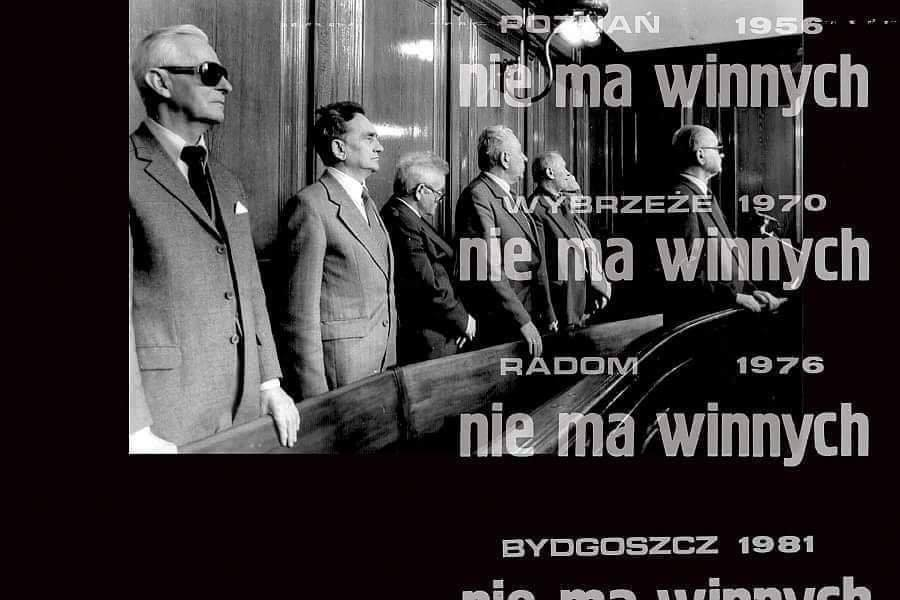

### 2020

Chiny

Korea Południowa

Singapur

Japonia

Tajwan

---

Wygląda na to, że rządowa "Tarcza" posłużyła do osłony zmian w kodeksie wyborczym. W serii całonocnych głosowań przepchnięta została przez PiS autopoprawka, która umożliwia głosowanie korespondencyjne ludziom znajdującym się w okresie kwarantanny i osobom powyżej 60 roku życia. Wybory prezydenta będą więc mogły odbyć się nawet podczas szczytu epidemii.
To tyle, jeśli chodzi o władzę. A co z pieniędzmi? Spokojnie. Teraz przyjdzie czas na regułę ustalającą maksymalną kwotę i limit przyrostu wydatków.
W ustawie o finansach publicznych ta numeryczna reguła (SRW), w obecnym kształcie, opisana została w art. 112aa. Jednak kawałek dalej znajduje się króciutki art. 112d, gdzie w dobrej wierze wyliczono sytuacje, kiedy reguła może zostać wyłączona za sprawą "złych czasów".
Są tam 3 takie przypadki: stan wojenny; stan wyjątkowy; stan klęski żywiołowej. Wystarczy więc tylko teraz w drodze niewielkiej nowelizacji dopisać do tego zestawu "stan epidemii".
Będą wybory. Będzie władza. Będą pieniądze. Tylko, co będzie dalej? Kawałek dalej będzie art. 86 pkt. 1(2) tej samej ustawy. Trzeba będzie przecież coś zrobić z restrykcjami nałożonymi na finanse publiczne, kiedy dług znajduje się w przedziale 55%-60% PKB.
A co będzie jeszcze dalej? A, to już mniej więcej wiadomo...

### 1996

W sądzie w Gdańsku rozpoczął się proces oskarżonych o sprawstwo kierownicze śmierci 44 osób w grudniu 1970 roku.
Na ławie oskarżonych zasiedli: generał armii Wojciech Jaruzelski – szef MON
Kazimierz Świtała – szef MSW
Stanisław Kociołek – wicepremier rządu PRL
generał broni Tadeusz Tuczapski – wiceszef MON generał broni Józef Kamiński – dowódca Pomorskiego Okręgu Wojskowego
generał brygady Stanisław Kruczek – dowódca 8. Dywizji Zmechanizowanej
generał brygady Edward Łańcucki – dowódca 16. Dywizji Pancernej
podpułkownik Mirosław Wiekierka – dowódca 3. Batalionu 55. Pułku Zmechanizowanego
major Wiesław Gop – dowódca plutonu 10 Pułku Wojsk Obrony Terytorialnej
pułkownik Władysław Łomot – dowódca 32. Pułku Zmechanizowanego
podpułkownik Bolesław Fałdasz – zastępca Łomota ds. politycznych
pułkownik MO Karol Kubalica – komendant Szkoły Podoficerskiej MO w Słupsku.
Obrońcy Jaruzelskiego, Świtały i Kociołka złożyli wniosek o umorzenie sprawy, gdyż osoby te „nie podlegają orzecznictwu sądów karnych”, tylko Trybunałowi Stanu. Niespełna miesiąc później Sąd Wojewódzki w Gdańsku w sprawie Grudnia 70 umorzył postępowanie przeciwko Jaruzelskiemu i Świtale, odmówił umorzenia sprawy Kociołka. Prokurator, oskarżyciele posiłkowi oraz obrońca Kociołka wnieśli zażalenie do Sądu Apelacyjnego.

  

### 1921

W Słaboszowie urodził się Jerzy Bielecki - jeden z pierwszych więźniów niemieckiego obozu koncentracyjnego i zagłady Auschwitz-Birkenau (numer 243), żołnierz Armii Krajowej, Sprawiedliwy wśród Narodów Świata (tytuł przyznany 27 czerwca 1985 roku). Honorowy Obywatel Izraela.
Jerzy Bielecki przyjechał do obozu koncentracyjnego w Auschwitz pierwszym transportem, otrzymał numer 243. Miał dwadzieścia lat. Tu poznał Cylę Cybulską, Żydówkę z Łomży, której cała rodzina zginęła w komorach gazowych. Jerzy i Cyla spotykali się przez jakiś czas potajemnie, opowiadali sobie historie swojego życia i w końcu zakochali się w sobie. Jerzy przyrzekł wtedy Cyli, że wydobędzie ją z obozu.
21 lipca 1944 r. w przebraniu esesmana (mundur zdobył jego przyjaciel) odebrał Cylę z pracy pod pozorem zaprowadzenia na przesłuchanie. W ten sposób wyszli z terenu obozu.
Przez dziewięć dni błąkali się po okolicy, aż wreszcie udało im się dostać do krewnych Jerzego we wsi Gruszowo. Tam rozdzielili się, przyrzekając sobie, że spotkają się po zakończeniu wojny. Jerzy wstąpił do AK, a Cyla została w kryjówce.
Niestety, Cyla – do której dotarły fałszywe informacje o śmierci Jerzego – wyemigrowała po zakończeniu wojny do USA.
Cudem odnaleźli się po 39 latach. Na powitanie Jerzy wręczył Cyli bukiet 39 czerwonych róż – po jednej za każdy rok rozłąki.
Jerzy Bielecki zmarł 20 października 2011 roku.
(Źródło: artykuł pochodzi z albumu: „Przywracanie pamięci Polakom ratującym Żydów w czasie Zagłady“, Warszawa 2007)

  

---

<a href="https://github.com/TomaszWaszczyk/historia.waszczyk.com/edit/master/src/content/march-28.md" target="_blank">Edytuj tę stronę dzieląc się własnymi notatkami!</a>
