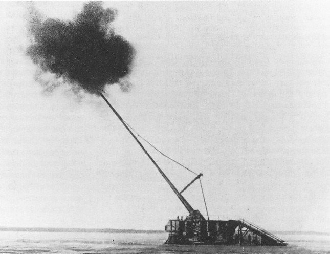

### 2022

"W skrajnych przypadkach nadmierny wzrost długu publicznego prowadzi do upadłości finansowej państw. Historia takich katastrof finansowych liczy sobie już ponad 200 lat"

Historia wielokrotnie pokazała, że zdesperowany rząd posuwa się do desperackich decyzji. Dywersyfikacja geograficzna może okazać się kluczowa! 

### 2020 - indeks użyteczności społecznej w praktyce

  

  

  

  

---

## German state finance minister Thomas Schäfer found dead..

Police suspect Thomas Schäfer died by suicide after his body was found on train tracks near Wiesbaden. He was the finance minister for the state of Hesse, where Germany's financial center Frankfurt lies. The body of a man identified as Thomas Schäfer, the finance minister of the German state of Hesse, was found on a high-speed train line in the town of Hochheim between Frankfurt and Mainz, police confirmed Saturday.

### 1943

W Katyniu rozpoczęły się prace ekshumacyjne mające na celu ustalenie przyczyny śmierci polskich żołnierzy, policjantów i przedstawicieli innych środowisk inteligenckich.
Komisją, która zajmowała się tymi pracami kierował profesor Uniwersytetu Wrocławskiego Gerhard Butz. Podstawowe prace badawcze wykonali eksperci z Polskiego Czerwonego Krzyża oraz Polskiej Komisji Technicznej. W miejscu zbrodni natrafiono na osiem dołów śmierci.
W czasie ekshumacji odnaleziono m.in. ciała dwóch generałów – Bohatyrewicza i Smorawińskiego. Do 7 czerwca 1943 r.
wydobyto 4243 ciała i zidentyfikowano 2730. W
identyfikacjach uczestniczył dr Wodziński z PCK. Wtedy to na polcenie Niemców Komisja
Techniczna PCK przerwała prace. 28 września
1943 roku teren Katynia ponownie opanowała
Armia Czerwona.
Podczas, gdy od samego początku Niemcy informowali o odnalezieniu szczątków w lesie katyńskim, sowiecka propaganda systematycznie zaprzeczała temu faktowi.
Jak wielka była moc kłamstwa na temat Katynia przekonać się można również oglądając polski film propagandowy o obozie w Majdanku w reżyserii Aleksandra Forda, gdzie zbrodnię na lubelskim zamku nazwano "nowym niemieckim Katyniem".
Dopiero w kwietniu 1990 roku agencja TASS wydała oświadczenie, w którym odpowiedzialnością za mord w Katyniu obarczyła NKWD. TASS w tym samym oświadczeniu zakwalifikował jako "jeden z najokrutniejszych czynów okresów stalinizmu".
Łącznie w Katyniu odnaleziono 11 tysięcy mogił Polaków.
Grafika przedstawia plakat propagandowy o Katyniu.

  

### 1939

Hiszpańska wojna domowa: wojska gen. Francisco Franco zdobyły Madryt.
Mówiąc o dwudziestoleciu międzywojennym, kojarzymy je z narodzinami faszyzmu, wojną polsko-bolszewicką, czy Wielkim Kryzysem. Zapominamy jednak o przewrocie wojskowym w Hiszpanii i wojnie domowej, która nastąpiła w jego wyniku, wojnie, która stała się poligonem doświadczalnym dla Niemców, Włochów, Sowietów i innych, którzy wysyłali na półwysep Iberyjski ochotników i sprzęt. Jak doszło do konfliktu w ojczyźnie konkwistadorów i torreadorów?
W 1931 w Hiszpanii zniesiono monarchię i wprowadzono republikę, zwaną Drugą Republiką Hiszpańską (I Republiką było państwo istniejące między 11 lutego 1873 a 29 grudnia 1874). Idealny, jakby się zdawało, ustrój szybko zawiódł – pierwszy republikański premier, pięćdziesięcioletni Manuel Azana y Diez, zagorzały antyklerykał i ateista, z zapałem zajmował się tępieniem kościoła katolickiego, mniej uwagi poświęcając stanowi gospodarki i innym istotniejszym sprawom. Nie bez wpływu pozostał Wielki Kryzys Ekonomiczny, którzy dotknął także Hiszpanię. W związku z tym w 1935 r. utworzono Front Ludowy, składający się z mieszaniny wszystkich stronnictw lewicowych ? anarchistów, komunistów, republikanów, socjalistów. Front w wyborach do Kortezów (hiszpańskiego parlamentu, składającego się z Kongresu Deputowanych – Congreso de los Diputados i Senatu -Senado) uzyskał 4,8 mln głosów i 277 mandatów. Dla porównania ? środowiska prawicowe zdobyły 132 mandaty, a ugrupowania centrowe ? 32 mandaty.
Wywołało to niezadowolenie wśród zwolenników przegranego obozu, głównie księży i wojskowych. Generałowie zawiązali w swoim gronie spisek pod hasłami obrony tradycyjnych wartości.Okresowi przedwojennemu towarzyszył wszechobecny terror, potyczki między bojówkami, zamieszki. Tak np. 12 lipca w centrum Madrytu nieznani sprawcy zastrzelili Jose Castillo, porucznika republikańskiej Guardia d’Assalto. W nocy tego samego dnia kilku policjantów z jego jednostki pod dowództwem kapitana Moreno weszło do mieszkania przywódcy opozycji, Calvo Sotelo, aresztowało go i wywiozło na posterunek. Następnego dnia Sotelo znaleziono na cmentarzu z przestrzeloną głową…
Miarka przebrała się kiedy rząd republikański postanowił o rozpuszczeniu wojska i rozpoczęciu tworzenia milicji ludowej. 17 lipca 1936 r. wybuchło zaplanowane przez nacjonalistów antyrządowe powstanie.
Przebieg wojny domowej:
1936:
Przewrotowi miał przewodniczyć José Sanjurjo y Sacanell, generał, który po nieudanej próbie przewrotu w 1932 r. przebywał na emigracji w Portugalii. Podczas powrotu 20 lipca, samolot, którym leciał generał spadł, a Sanjurjo zginął na miejscu. Przyczyny katastrofy awionetki nie są do końca znane ? najprawdopodobniej była obciążona. Podobno kiedy pilot zwrócił na to uwagę Sanjurjo odparł – „wiozę galowy mundur, jako nowy caudillo Hiszpanii, na paradę zwycięstwa”.
W związku ze śmiercią Sanjurjo dowództwo podzielono na dwie osoby ? generał Franco dowodził powstańcami na południu, a Emilio Mola na północy. Powstanie rozpoczęło się 17 lipca w garnizonach w całej Hiszpanii. Największy sukces powstańcy osiągnęli w Maroku hiszpańskim , które zajęli całkowicie do 21 lipca. Tego samego dnia nacjonaliści zajęli główną bazę marynarki wojennej, zlokalizowaną w Ferrol w północnozachodniej Hiszpanii. Dwa dni później ogłosili powstanie własnego rządu, uznanego w listopadzie przez Włochy i Niemcy. Dzięki pomocy tych dwóch państw, które dostarczyły znaczną ilość samolotów transportowych (niemieckie Ju-52 i włoskie Savoia-Marchetti), którymi oddziały kolonialne franco zostały przetransportowane na kontynent. Do końca lipca wojska powstańcze zajęły Baleary (oprócz Minorki), wspomniane wcześniej Maroko Hiszpańskie, Wyspy Kanaryjskie, znaczną część północnej i zachodniej Hiszpanii (z Santiago, Valladolid, Burgos, Saragossą i Salamanką).
4 września, niezdolny do rozwiązania problemu, rząd José Giral podał się do dymisji. Zastąpił go socjalistyczny rząd Largo Caballero, który rozpoczął unifikację podzielonych stronnictw lewicowych, chcąc w ten sposób stworzyć wspólny front przeciwko wojskom frankistowskim. Zmiany nastąpiły także po drugiej stronie frontu ? 21 września na zjeździe najwyższych rangą generałów Franco został mianowany najwyższym dowódcą i przybrał tytuł Generalísimo, najwyższego dowódcy, a 1 października został obrany przywódcą państwa i utworzył rząd w Burgos.
Nastąpiły kolejne zwycięstwa nacjonalistów ? 27 września ich siły przybyły z odsieczą garnizonowi Alkazaru, pół-fortecy, pół-pałacu, w Toledo. Budynek był okrążony przez wielotysięczne siły milicji, która jednak nie była w stanie zdobyć twierdzy. Dzień później nacjonaliści zajęli całe miasto. Podobna odsiecz miała miejsce w północnej Hiszpanii, gdzie wojska Franco broniły miasta Oviedo. W październiku nacjonaliści rozpoczęli ofensywę w kierunku Madrytu, docierając do miasta 8 listopada. Rząd republikański był zmuszony do wycofania się do Walencji. Oddziały frankistowskie nie zdobyły jednak stolicy kraju, odparte w walkach miedzy 8 a 23 listopada. Znaczne zasługi przypisuje się tutaj nowo przybyłym Brygadom Międzynarodowym, chociaż w bitwie wzięło udział tylko około 3000 ich członków. Wobec niepowodzenia w zdobyciu miasta Franco postanowił je zbombardować, a w następnych latach przeprowadzał kilka poważnych ofensyw mających na celu okrążenie stolicy.
1937:
Z szeregami zasilonymi włoskimi żołnierzami i hiszpańskimi oddziałami kolonialnymi Franco usiłował w styczniu i lutym 1937 r. po raz kolejny zdobyć Madryt, jednak te próby spełzły na niczym. Sukcesem zakończył się natomiast atak na Malagę, która została zajęta przez nacjonalistów 8 lutego. Z kolei próba przekroczenia rzeki Jarama skutkowała starciem sił nacjonalistów z siłami republikańskimi. Obydwie strony poniosły ciężkie straty podczas bitwy, szacowane na 6-20 tysięcy. Główny cel nie został osiągnięty, a oddziały frankistowskie zdobyły jedynie skrawek terytorium.
W marcu nacjonaliści ponieśli pod Guadalajarą pierwszą (i w zasadzie jedyną) poważną klęskę w walkach przeciwko republikanom. Franco wykorzystał połączone siły włosko-hiszpańskie i taktykę blitzkriegu, jednak mimo przewagi liczebnej zostały pobity przez republikanów. Bitwa pod Guadalajarą była ostatnią próbą dotarcia do Madrytu przez wojska frankistowskie, które po tej klęsce przeniosły swoje główne siły na północ.
Kwiecień i maj upłynęły pod znakiem walk między republikanami w Katalonii ? rząd, ostatecznie zwycięski, popadł w konflikt z anarchistami związanymi z Confederación Nacional del Trabajo, czyli Krajowej Konfederacji Pracy. Konflikt cieszył frankistów, którzy jednak nie zrobili zbyt wiele żeby wykorzystać chwilowe osłabienie przeciwnika. W kwietniu miało miejsce bombardowanie Guerniki, rozsławione później obrazami Pabla Picassa. Szacuje się, że w wyniku nalotu zginęła połowa populacji miasteczka – dzieła dokonali niemieccy lotnicy z Legionu Condor.
3 czerwca zginął zastępca generała Franco ? Emilio Mola. Jego samolot, dwusilnikowy Airspeed Envoy, rozbił się w czasie burzy.
W lipcu rząd republikański usiłował odzyskać Segowię. Opóźnił tym samym marsza nacjonalistów na Bilbao, ale nie zdało się to na wiele, bo miasto padło dwa tygodnie później. Podobnie zakończył się republikański atak na Huescę. Mimo upadku Bilbao rząd zorganizował kontrofensywę na zachód od Madrytu, która zakończyła się bitwą o Brunete, uzyskaniem 50 kilometrów kwadratowych terenu i 25 tysiącami zabitych ? republikanie stracili wtedy większość wartościowych oddziałów. Podobnie zakończyła się ofensywa na Saragossę ? republikanom udało się wejść 10 km w głąb terytorium wroga, ale utracili większość sprzętu.
W sierpniu Franco zaatakował Aragonię, zdobywając 26 sierpnia Santander. W Santo?ie przed Włochami poddała się cała armia baskijska walcząca dotąd po stronie Republiki. Przy okazji kapitulacji zawarto porozumienie ? Baskowie mieli się poddać i zaprzestać walki. W zamian miano wypuścić baskijskich jeńców przetrzymywanych przez Włochów, a członkom Partido Nacionalista Vasco (Baskijska Partia Nacjonalistyczna) miano zezwolić na emigrację ? transport miały zapewnić brytyjskie statki prowadzące blokadę Hiszpanii, mającą zapobiec dostarczaniu broni którejś ze stron. Porozumienie miedzy Baskami a Włochami odbyło się zarówno za plecami Franco, jaki i rządu republikańskiego, który porozumienie nazwał ?zdradą z Santo?y?. Z kolei przywódca nacjonalistów rozkazał uwięzić wszystkich żołnierzy baskijskich. Połowa z nich wyszła na wolność po kilku miesiącach, kilkuset z nich skazano na śmierć.
1938:
Do ważnego starcia między nacjonalistami a republikanami doszło w czasie bity o Teruel, która rozpoczęła się jeszcze w połowie grudnia 1937 i trwała aż do 22 lutego 1938 r. Republikanom udało się zdobyć miasto, jednak oddziały frankistowskie wyprowadziły kontruderzenie i odbiły Teruel. Ich zwycięstwo było jednak uzależnione od włoskiego i niemieckiego wsparcia powietrznego. Obydwie straciły łącznie od 117 do 142 tysięcy ludzi.
7 marca nacjonaliści rozpoczęli ofensywę w kierunku Aragonii, 14 kwietnia docierając do Morza Śródziemnego, przecinając tereny zajmowane przez republikanów na dwie części – Katalonię i południowy wschód Hiszpanii z Madrytem, Walencją i innymi. W maju rząd usiłował uzyskać zawieszenie broni i pokój, ale Franco odmówił, żądając bezwarunkowej kapitulacji. W lipcu oddziały frankistowskie usiłowały zaatakować z zajętego Teruel Walencję, ale ich atak załamał się na linii umocnień XYZ, zbudowanej już w trakcie wojny domowej, zwanej także liną Matallana – nacjonaliści stracili około 20 tysięcy żołnierzy.
24 lipca wojska rządowe rozpoczęły ofensywę w kierunku rzeki Ebro, ofensywę, która miała połączyć rozdzielone tereny zajęte przez republikanów. Operacja trwała do 26 listopada i zakończyła się całkowita klęska, spowodowaną pośrednio konferencją monachijską, która skutecznie obniżyła morale wojsk republikańskich, liczących na antyfaszystowski sojusz z państwami zachodnimi. Klęska nad Ebro zaważyła o losach całej wojny. Kilka dni przed Nowym Rokiem wojska Franco zaatakowały Katalonię.
1939:
Oddziały nacjonalistów zajęły całą Katalonię w trakcie kampanii trwającej niecałe 2 miesiące – 15 stycznia padła Tarragona, 26 stycznia Barcelona, 2 lutego Girona. 27 lutego Wielka Brytania i Francja uznały reżim Franco na arenie międzynarodowej. Po upadku północy Hiszpanii w rękach republikanów pozostawał tylko Madryt i kilka pojedynczych miast, wraz za otaczającymi je terenami.
5 marca armia republikańska, dowodzona przez pułkownika Segismundo Casado i polityka Juliána Besteiro, dokonała zamachu stanu i ustanowiła juntę wojskową na czele z Radą Obrony Narodowej, która miała negocjować warunki pokoju. Obalony premier, Juan Negrin, uciekł do Francji. Tymczasem oddziały komunistyczne wokół Madrytu podniosły bunt przeciwko juncie, rozpoczynając tym samym swego rodzaju „wojnę domową w wojnie domowej”. bunt został stłumiony przez oddziały Casado, który rozpoczął negocjacje pokojowe z Franco. Przywódca nacjonalistów ponownie odmówił, żądając bezwarunkowej kapitulacji.
26 marca rozpoczęło się natarcie nacjonalistów na Madryt, który padł 2 dni później. Do 31 marca oddziały frankistowskie opanowały całą Hiszpanię. Dzień później Franco drogą radiową ogłosił zwycięstwo nad siłami republikańskimi. Oficjalnie zakończona wojna domowa trwała właściwie do początku lat pięćdziesiątych, kiedy to zostały rozbite ostatnie oddziały partyzanckie, walczące przeciwko reżimowi Franco. Walki tego typu pokazał reżyser Guillermo del Toro w swoim filmie „Labirynt Fauna”, którego akcja dzieje się w 1944, a ojczym głównej bohaterki brutalnie zwalcza partyzantkę republikańską.
Skutki hiszpańskiej wojny domowej:
Wojna pociągnęła za sobą ogromne straty – materialne i osobowe. Podczas trwania konfliktu zginęło około 500 tysięcy ludzi, cywilów i żołnierzy. Drugie tyle było zmuszone do ucieczki. Niektóre źródła podają, że wojna mogła pochłonąć nawet do miliona ludzkich istnień. Pół miliona ludzi uciekło z frankistowskiej Hiszpanii do różnych krajów – przede wszystkim Francji. Uciekinierzy do III Republiki byli najczęściej skazani na obozy dla internowanych. Te „obozy” miały tyle wspólnego z ośrodkami dla internowanych, co nazistowskie obozy koncentracyjne z „obozami pracy”. Wielu z przetrzymywanych, przede wszystkim rolników, którzy nie mieli pieniędzy, którymi mogliby zapłacić za ewentualne zakwaterowanie we Francji, było nakłanianych do powrotu do ojczyzny. Większość z nich postanowiła powrócić do Hiszpanii i została przekazana reżimowi w mieście Irun w Baskonii. Hiszpańscy repatrianci musieli następnie przejść proces „oczyszczenia”, innymi słowy indoktrynacji politycznej, rodem z Korei Północnej, w obozie w Miranda de Ebro. Po klęsce Francji w 1940 i utworzeniu państwa Vichy republikańscy internowani stali się więźniami politycznymi. Wysłano ich następnie do obozu dla internowanych w Drancy, skąd zostali wysłani do obozów koncentracyjnych w III Rzeszy. Szacuje się, że w samym Mauthausen zamordowano około 5000 Hiszpanów.
Po zakończeniu wojny nastąpiła fala represji wobec reżimu generała Franco. Tysiące republikanów zostało uwięzionych. Przynajmniej 30 tysięcy z nich zamordowano, chociaż inne kalkulacje opiewają na 50 do 200 tysięcy ofiar, zależnie od procentu ofiar śmiertelnych. Oprócz zamordowanych w więzieniach, wielu ze skazańców zmarło z wycieńczenia w wyniku ciężkich robót przymusowych – osuszaniu bagien, kopaniu kanałów itp.
Wojna w Hiszpanii stała się idealnym poligonem doświadczalnym dla wielu państw, przede wszystkim dla trzech państw totalitarnych – Włoch, Niemiec i ZSRR. Niemcy, którzy do Hiszpanii wysłali Legion Condor i doradców wojskowych, wyciągnęli ze starć cenne doświadczenie, które przydało się w pierwszym etapie II wojny światowej – dzięki przetestowaniu nowych maszyn, szyków dwójkowych i czwórkowych oraz taktyki walki pionowej, niemieccy piloci górowali nad przeciwnikiem na początku wojny. Z kolei doświadczenia w nalotach m.in. na Guernikę przydały się w późniejszych zmasowanych bombardowaniach Warszawy, Rotterdam, Londyn i inne. Niektóre z wniosków były błędne – niemieccy lotnicy walczyli w Hiszpanii w warunkach panowania w powietrzu, więc uznali, że szybkie bombowce poradzą sobie w walce bez osłony myśliwskiej, co jak wiemy nie sprawdziło się w boju, gdzie przeciwnik dysponował choć ułamkiem potęgi powietrznej Luftwaffe.

### 1918

I wojna światowa: pocisk z niemieckiego tzw. działa paryskiego trafił w trakcie mszy w kościół św. Gerwazego i Protazego położony naprzeciw paryskiego ratusza, powodując zawalenie sklepienia, w wyniku czego zginęło 88 osób, a 68 zostało rannych.
Działania wojenne na froncie zachodnim były niezwykle krwawe, ale linia frontu była dość stabilna – walczące strony kosztem dziesiątek tysięcy zabitych były w stanie zmieniać ją o kilka czy kilkanaście kilometrów, ale niemal każdy atak był szybko zatrzymywany dzięki potędze artylerii i karabinów maszynowych.
W takich warunkach Niemcy postanowili zbudować działo, które – mimo oddalenia linii frontu od Paryża – byłoby w stanie ostrzeliwać stolicę Francji.
Powstała konstrukcja niezwykła: ważące 256 ton działo o kalibrze 21 centymetrów, z lufą mierzącą w sumie 34 metry. Lufa była tak długa, że uginała się pod własnym ciężarem i trzeba było ją prostować za pomocą specjalnych odciągów. Na domiar złego wystrzeliwane pociski zdzierały część jej wewnętrznej warstwy – z tego powodu pociski produkowano w numerowanych seriach, a każdy numer miał kaliber odrobinę większy od poprzednika.
Zasięg działa sięgał 130 kilometrów, jednak celność była znikoma – pozwalała na ostrzeliwanie celów wielkości dużego miasta. Ważące 90 kilogramów pociski przy niewielkiej szybkostrzelności działa miały jednak zbyt małą siłę, by spowodować poważniejsze szkody, więc ostrzał miał głównie znaczenie psychologiczne. Ponad 300 wystrzelonych przez Działo Paryskie pocisków zabiło w sumie około 250 osób.
Znakiem czasów, w którym ta broń była używana, jest za to fakt, że gdy przypadkowy pocisk trafił w paryski kościół, zabijając wiernych zgromadzonych na nabożeństwie, Niemcy – wiedząc o odbywających się uroczystościach żałobnych – wstrzymali na ten czas ostrzał Paryża.
Działo Paryskie było cudem inżynierii, jednak nie odegrało wielkiej roli. Jest za to warte wspomnienia z jeszcze jednego powodu – wystrzeliwane przez nie pociski były pierwszymi obiektami stworzonymi przez człowieka, które sięgnęły stratosfery, osiągając w najwyższym punkcie lotu pułap około 40 kilometrów.
Działo to często jest mylone z inną wielką armatą a właściwie haubico-moździerzem o nazwie Grubą Berta, która była użyta w czasie oblężenia Liège w 1914. Także mylnie jest utożsamiane z mniejszym działem Langer Max (niem. Długi Maks), od którego zresztą pochodzi. Co więcej, wszystkie one były wyprodukowane w zakładach Kruppa.

  

### 1899

https://en.wikipedia.org/wiki/Lavrentiy_Beria

### 1848

Z inicjatywy Adama Mickiewicza w Rzymie powstała formacja wojskowa zwana Legionem Mickiewicza.
Akt zawiązania Legionu podpisało w Rzymie oprócz Adama Mickiewicza 13 osób. Byli wśród nich dawny oficer napoleoński ppłk Siodołkowicz, towiańczyk Geitz (Gierycz) i jego kuzyn Niesiołowski oraz dziesięciu studiujących w Rzymie młodych artystów polskich. Wraz z tym dokumentem zatwierdzono Skład zasad, będący wyraźnym programem rewolucyjno-demokratycznym polskich emigrantów skupionych wokół Mickiewicza. W Składzie zasad, napisanym w duchu religijnym, manifestowano chęć wprowadzenia swobód demokratycznych, wysuwano hasła równouprawnienia kobiet, narodowości i wyznań, proponowano zasadę wybieralności urzędników, jednakowego podziału ziemi oraz podkreślano rolę współpracy narodów słowiańskich.
Legion był polską formacją wojskową stworzoną w okresie rewolucyjnych wydarzeń, zwanych Wiosną Ludów. Mickiewicz pragnął pomóc Włochom w walce o wyzwolenie ich kraju, impulsem do działania stało się wypędzenie Austriaków z Mediolanu 18 marca 1848. Oddział polski stawił się w stolicy Lombardii już 1 maja. Legion uczestniczył w kilku starciach z Austriakami, wspierał Karola Alberta, króla Piemontu i Sardynii, pomagał Giuseppemu Mazziniemu poprzez udział w obronie republikańskiego Rzymu. Wkrótce, po uczestnictwie w rewolucji węgierskiej, oddział polski został rozbity.

### 1790

Został podpisany Traktat Przyjaźni i Przymierza Między Prusami, a Rzeczpospolitą zwany w skrócie Traktatem Polsko-Pruskim lub Sojuszem Zaczepno- Odpornym.
W traktacie tym strony gwarantowały sobie
wzajemnie integralność terytorialną z zachowaniem klauzuli o możliwości dobrowolnego uregulowania tych kwestii w przyszłości (co miało umożliwić ewentualną
cesję). Oba państwa obiecywały sobie
przyjść z pomocą w obliczu zagrożenia lub
ataku ze strony państw trzecich. Polska miała wystawić w takim wypadku korpus posiłkowy w sile 8000 kawalerii i 4000 piechoty, a Prusy 4000 kawalerii i 8000 piechoty. Prusy deklarowały Polsce pomoc w postaci misji dobrych usług ( łac. bona
officia ), w razie zagrożenia Rzeczypospolitej (co jawnie skierowane było przeciwko hipotetycznej interwencji rosyjskiej w wewnętrzne sprawy państwa polskiego).
Na zdjęciu Rzeczpospolita w latach 1789-1792

  

### 1464

Maciej Korwin został koronowany w katedrze Panny Marii w Székesfehérvár na króla Węgier i Chorwacji.
Zgon wielkiego wodza otworzył trwający dwa lata okres wojny domowej na Węgrzech. Po jednej stronie barykady stali oligarchowie skupieni wokół Władysława Pogrobowca, po drugiej – średnia szlachta i mieszczanie pod przywództwem synów Hunyadiego. Konflikt przerwała dopiero śmierć Pogrobowca i objęcie tronu przez syna zwycięzcy spod Belgradu, Macieja Hunyadiego w 1458 roku.
Nowego króla zwano powszechnie Maciejem Korwinem od herbu rodowego Hunyadich – czarnego kruka (łac. corvus). W zgodnej opinii historyków trwające ponad cztery dekady jego rządy to jeden z najlepszych okresów w dziejach Węgier. Nowy władca kontynuował politykę ojca. Kładł nacisk na rozwój gospodarczy, by z pozyskanych w ten sposób środków finansować skuteczną obronę przed zagrożeniem tureckim. Zasługą Korwina było stworzenie Czarnych Szeregów lub inaczej Czarnej Armii (Fekete Sereg). Była to od czasów antycznych pierwsza stała, zawodowa armia, utrzymywana z regularnie wypłacanego żołdu. Ta dziesięciotysięczna, świetnie wyszkolona i uzbrojona armia siała popłoch w całej Europie Środkowej i Wschodniej. Król szybko doszedł bowiem do przekonania, że liczenie na pomoc chrześcijańskiej Europy w obliczu najazdu tureckiego jest naiwnością. Szansę na trwałe zatrzymanie Turków dawało w jego mniemaniu dopiero powiększenie terytorium i potencjału militarnego Węgier tak, by same mogły odeprzeć nieprzyjaciela. Konsekwencją tego rozumowania były podboje. Korwin opanował czeski Śląsk, Łużyce i Morawy, a w 1469 roku koronował się na króla Czech. Udało mu się też zająć Dolną Austrię i zdobyć Wiedeń.
Był to ostatni wielki sukces tego niezwykłego władcy. Zmarł w Wiedniu w kwietniu 1490 roku. Oligarchowie, którzy mieli dokonać elekcji nowego monarchy, przynajmniej w jednym byli zgodni: koniec z rządami silnej ręki – nowy władca ma panować, ale nie rządzić. Ich wybór padł na kandydata, który z naddatkiem spełniał powyższe kryteria – króla czeskiego Władysława Jagiellończyka. Ten pierworodny syn Kazimierza Jagiellończyka i wnuk Jagiełły był żywym dowodem, jak daleko może upaść jabłko od jabłoni. Po ojcu i dziadzie nie odziedziczył ani talentów militarnych, ani zdolności politycznych czy choćby hartu ducha. Nic z tych rzeczy. Już czescy poddani nazywali go „rex bene” (król dobrze), bo na wszystko się godził i wszystkim przyznawał rację. Bezwolny władca, marionetka w rękach węgierskich oligarchów, którego publicznie nazywali wołem, a nawet osłem, zgodził się na demontaż struktur stworzonych przez Hunyadich. Kosztem uprawnień monarchy, dochodów skarbu i prestiżu instytucji kupował poparcie możnowładców. Zlikwidował również Czarną Armię – wojsko Korwina rozformowano, a żołnierzy w niewielkich oddziałach rozmieszczono na granicy węgiersko-tureckiej. Gdy przestano wypłacać najemnikom należny żołd, ci porzucali strażnice i grabili okolicę. Za tę niefrasobliwość przyszło szybko zapłacić. Turcy ośmieleni kryzysem na Węgrzech najechali będące wówczas częścią Korony Św. Stefana Siedmiogród i Chorwację. Przez 26 lat (1480 – 1516) swych węgierskich rządów Władysław ze zmiennym szczęściem prowadził wojny z Turcją. Kolejne odsłony konfliktu kończyły się zazwyczaj kilkuletnim rozejmem. Ważną rolę w życiu politycznym Węgier odgrywali Zapolyowie. Był to potężny ród, którego członkowie piastowali wysokie urzędy. Wybili się oni za panowania Macieja Korwina. Twórcą potęgi rodu pieczętującego się białym jednorożcem w czerwonym polu był Stefan Zapolya, który swą karierę uwieńczył objęciem urzędu palatyna Węgier, czyli najwyższego świeckiego urzędnika królestwa. O jego pozycji i ambicjach najlepiej świadczy to, że w 1486 roku poślubił Jadwigę, córkę księcia cieszyńskiego Przemysła II z dynastii Piastów. Po śmierci Stefana w 1499 roku przywództwo przejął jego syn Jan. Zapolyowie cieszyli się dużym poparciem średniej szlachty, która widziała w Janie kandydata do węgierskiego tronu w razie bezpotomnej śmierci Władysława Jagiellończyka. Ta narodowa kandydatura miała być przeciwwagą dla ciągle ponawianych przez Habsburgów roszczeń do tronu węgierskiego. Te plany odsunęły się w czasie, gdy królowi w 1506 roku urodził się upragniony syn Ludwik.
Pięć lat później Jan został wojewodą cieszącego się autonomią Siedmiogrodu. Symbolem ugruntowania pozycji Zapolyów na Węgrzech było małżeństwo jego siostry Barbary z królem Polski Zygmuntem I Starym. Chociaż małżeństwo to trwało zaledwie trzy lata, zadzierzgnięte wówczas więzi dynastyczne i polityczne okazały się o wiele trwalsze. Mariaż ten był próbą wsparcia przez Zygmunta Starego antyhabsburskiego stronnictwa na Węgrzech w sytuacji, kiedy w otoczeniu jego starszego brata Władysława Jagiellończyka górę brała wizja antytureckiego sojuszu z Habsburgami. Królowi Władysławowi nie udało się pozyskać poparcia braci, kolejnych królów na polskim tronie dla projektu wspólnego wystąpienia przeciwko Turcji. Zarówno Jan Olbracht, jak i wspomniany Zygmunt obawiali się, że konsekwencją takiej akcji będzie otwarty konflikt polsko-turecki, a do tego nie chcieli dopuścić. Finałem skomplikowanych rokowań pomiędzy Wiedniem, Budą i Krakowem był zjazd wiedeński w 1515 roku. Władysław, Zygmunt i cesarz Maksymilian I Habsburg zawarli układ: w zamian za zaprzestanie wspierania przez cesarstwo wrogów Polski, czyli Moskwy i Krzyżaków, na Habsburgów przelano prawa dziedziczne do tronu czeskiego i węgierskiego w wypadku wygaśnięcia rządzących w tych krajach linii Jagiellonów. Gdy rok po układach wiedeńskich, w marcu 1516 roku, zmarł Władysław Jagiellończyk, w obu królestwach żegnało go głośne westchnięcie ulgi. Jeden z dyplomatów włoskich scharakteryzował zmarłego krótko, ale jakże trafnie: „dobry człowiek, ale żaden król”. Liczono, że Ludwik II Jagiellończyk, syn i następca zmarłego, okaże się władcą zupełnie innego formatu.

---

<a href="https://github.com/TomaszWaszczyk/historia.waszczyk.com/edit/master/src/content/march-29.md" target="_blank">Edytuj tę stronę dzieląc się własnymi notatkami!</a>
