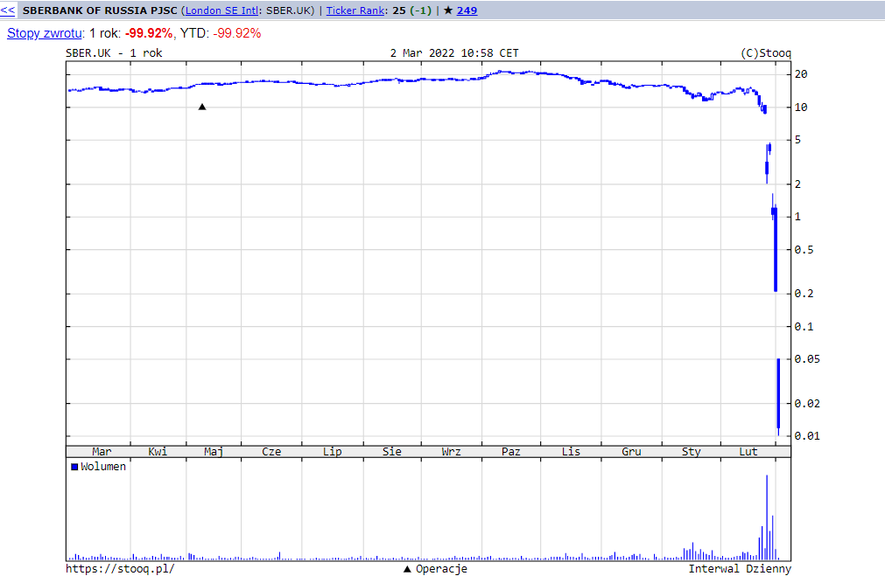
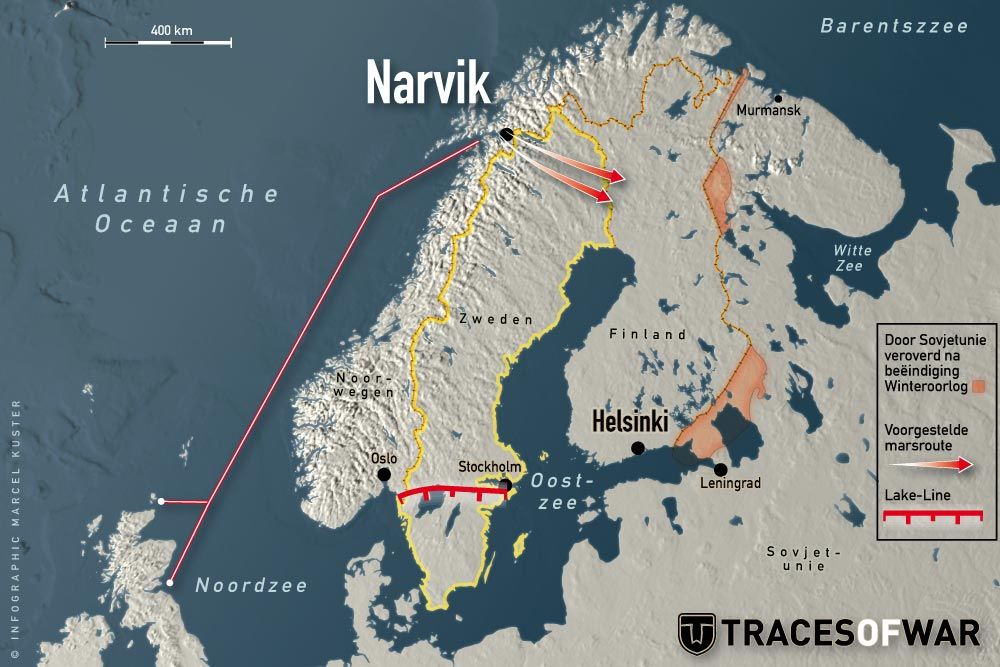

### 2024

Singapore 🇸🇬 embraces the change and prepares its citizens for the age of AI:

The Singapore government is acutely aware of AI and its potential to transform society.

That's why they are now talking about a new subsidy for Singaporeans age 40 and above that enables them to pursue another full-time diploma in Higher Education to upskill themselves + keep up with changes in tech.

Embracing the change. Helping their own people adapt - that's the real leadership.

<video width="640" height="480" controls>
<source src="./movies/march/ai.mp4" type="video/mp4">
Your browser does not support the video tag.
</video>

### 2023

The White House has released its National Cybersecurity Strategy this week. Not surprising that Post-Quantum Cryptography (PQC) migration is a strategic objective for the Federal Government but they also say:

> The private sector should follow the government’s model in preparing its own networks and systems for our post-quantum future.

  

<a href="./documents/march/National-Cybersecurity-Strategy-2023.pdf" target="_blank">National Cybersecurity-Strategy, 2023</a>

### 2022

Giełda w Moskwie zamknięta od początku tygodnia.

  

### 2020 - Pritzker Architecture Prize

Yvonne Farrell and Shelley McNamara, co-founders of Grafton Architects, have been named the 2020 laureates of the Pritzker Architecture Prize.

Farrell and McNamara were awarded the prize "for their integrity in their approach to both their buildings, as well as the way they conduct their practice," said the Pritzker Architecture Prize jury.

The architects are the first recipients from Ireland, although the fourth winner – Kevin Roche – was born in the country. They are the fourth and fifth women to be named winners of the prestigious award.

They follow Zaha Hadid, who was the sole winner in 2004, Kazuyo Sejima, who won alongside Ryue Nishizawa in 2010, and Carme Pigem, who won alongside Rafael Aranda and Ramón Vilalta in 2017.

This year's jury described Farrell and McNamara "pioneers in a field that has traditionally been and still is a male-dominated profession" and "beacons to others as they forge their exemplary professional path".

---

GOSPODARKA HAMUJE, A INFLACJA ROŚCIE

Doświadczenie pokeniowe moich dziadków to druga wojna światowa, doświadczenie pokoleniowe moich rodziców to PRL i ZSRR. Nasze doświadczenie pokoleniowe to siedzenie w domu z zapasem papieru toaletowego na rok i czekanie na kuriera z jedzeniem.

Poznaliśmy dane o PKB w czwartym kwartale 2019 roku. Zaskoczenia nie ma, bo być nie może. Skoro GUS podał wcześniej dane szacunkowe za cały rok wiadomo było, że w czwartym kwartale osiągniemy poziom mniej więcej 3%. Potwierdziły się także obawy dotyczące styczniowej inflacji. Wyskoczyła ona wyraźnie powyżej górnej granicy przedziału tzw. celu inflacyjnego.

Zanim przejdę do meritum, mała uwaga w kontekście tez, które w związku z danymi pojawiły się w wielu mediach. Wspominałem już o tym kilka tygodni temu, ale ponieważ temat jeszcze się rozkręcił chcę do niego wrócić. „Zaskoczenie”, „ku zaskoczeniu analityków” itd itp. Tego typu oceny towarzyszyły informacji o inflacji w grudniu i w styczniu, oraz PKB w całym roku oraz, taka jest chronologia publikacji, w czwartym kwartale 2019. Otóż nie jest prawdą, że te dane wszystkich zaskoczyły. Spora grupa ekonomistów i analityków spodziewała się wyraźnego hamowania gospodarki i wyraźnego wzrostu inflacji. Jeśli mnie na przykład coś zaskoczyło to raczej to, że inflacja wzrosła tak późno.

Wracając jednak do meritum. Gospodarka w czwartym kwartale urosła o 3,1% w ujęciu rocznym. A zatem wyraźnie wolniej, niż w trzecim kwartale, kiedy odnotowaliśmy 3,9%. Nie mamy jeszcze szczegółowych danych, ale wszystko wskazuje na to, że zawiodła przede wszystkim konsumpcja. I to może być dla niektórych zaskoczeniem, szczególnie w kontekście wprowadzenia programu 500+ na pierwsze dziecko. Z drugiej strony faktem jest, że mamy coraz więcej pieniędzy, ale jednocześnie rosną ceny. Dla niektórych być może to jest ograniczeniem w realizacji zakupów. Choćby związanych ze świętami Bożego Narodzenia, które w tym roku były wyjątkowo drogie. Tu nie działa jeszcze efekt rosnących cen. Wyraźniejszy ich wzrost może bowiem zachęcić nas do kupowania „bo będzie jeszcze drożej”. Ale wszystko wskazuje na to, że to wciąż nie ten moment.

W jednym z poprzednich felietonów pisałem, przy okazji wstępnych danych o wzroście gospodarczym w całym 2019 roku, że od historii ważniejsza jest przyszłość, czyli rok obecny. Szczególnie, że mamy jednak wyraźny okres zmiany trendu. Dane o czwartym kwartale, wciąż wstępne i bez składowych, w żaden sposób nie zmieniły mojego podejścia do 2020 roku. Spodziewam się wzrostu gospodarczego na poziomie wyraźnie poniżej 3%. Czyli zdecydowanie niższym, niż założenia rządu, które mówią o 3,7%. Tak w każdym razie zapisano w uchwalonym właśnie budżecie.

Drugą daną, która miała „zaskoczyć”, jest styczniowa inflacja. Już dane grudniowe pokazały kierunek. Wyraźny wzrost z 2,6% rok/rok w listopadzie do 3,4% rok/rok w ostatnim miesiącu roku musiał dać do myślenia. Biorąc jednak pod uwagę to, co wiedzieliśmy choćby w kontekście sytuacji na rynkach żywności, nośników energii, czy pracy, szczególnie w kontekście płacy minimalnej, przekroczenie 4% w pierwszym kwartale 2020 było najbardziej prawdopodobnym scenariuszem. I się wydarzyło. W styczniu ceny wzrosty o 4,4% w ujęciu rocznym, czyli najbardziej od ośmiu lat. Przypomnę, że Rada Polityki Pieniężnej chce inflacji w przedziale między 1,5% rok/rok a 3,5% rok/rok. Każdy kto chodzi do sklepu, albo korzysta z podstawowych usług czuł pismo nosem. Jasnym jest, że nasze odczucia, czy nasze osobiste doświadczenia to nie są oficjalne, analizowane w uregulowany sposób, statystyczne dane GUS. Ale dysonans pomiędzy odczuwalną „drożyzną”, a danymi, z których wynikało, ze inflacja jest niewielka był od miesięcy co najmniej męczący. I się właśnie skończył. Jeśli coś mnie tu zaskakuje, to właśnie to, że oficjalnie wyraźniejszy wzrost cen mamy dopiero teraz.

Dlaczego inflacja rośnie? O podstawowych kwestiach już napisałem. Od miesięcy obserwujemy wzrost kosztów, głównie pracy i energii. Swoje robi susza. Ale żywność nie tylko podrożała przez suszę. Wzrost płac i cen energii też przecież oznaczają wyższe koszty dla rolników czy przetwórców żywności. Albo hurtowników. Na sklepach kończąc. Nawet jeśli w tym roku suszy nie będzie, a ma być, to wcale nie będzie to oznaczało, że będziemy kupować czereśnie po 3 złote za kilogram. Koszty pracy są już tak wysokie, że nie da się ich zebrać i sprzedać z zyskiem przy takiej cenie. Nawet przy klęsce urodzaju. Będziemy być może mieć je za darmo, albo za grosze, ale jak sami je sobie nazbieramy. Z tym, że biorąc pod uwagę wspomnianą suszę, raczej nie w tym roku.

Co jeszcze nakręca inflację? Na przykład podwyżki podatków, jak w przypadku alkoholu i papierosów, zmiany stawek VAT lub choroby jak nieszczęsny ASF. Obserwujemy także wzrost cen podstawowych usług jak choćby fryzjerskich, czy bardziej wyrafinowanych, jak usługi medyczne. Albo prozaicznych, jak wywóz śmieci. Te usługi często drożeją właśnie z powodu wzrostu kosztów pracy i energii, czyli koło się zamyka.

Co będzie dalej? Moim daniem z wysoką inflacją będziemy mieli do czynienia także w następnych miesiącach. Zresztą większość z nas się właśnie takiej sytuacji spodziewa. Przynajmniej tak mówią badania.

No i wciąż nie wiemy co do nas może przyjść z zewnątrz. Obecne hamowanie gospodarki wynika z pogorszenia sytuacji w Europie, szczególnie w Niemczech. Ostatnie dane z Niemiec, choćby o zamówieniach w przemyśle, nie dają szansy na poprawę sytuacji. A co będzie w USA? Na razie widmo recesji stanęło przed Japonią, czyli drugą gospodarką globu. Trudno zatem o optymizm.

Na koniec powtórzę zatem to, co napisałem przy okazji publikacji wstępnych danych o PKB w roku 2019. Może nas czekać hamowanie gospodarki przy jednoczesnym wzrośnie inflacji. A to nie jest dobry scenariusz…..

### 2016

  

<!-- 

Seat Altea samochód samochod auto

Do zobaczenia, obserwować:
- klimatyzacja
- czujnik parkowania, biegu wstecznego
- prawy kierunkowskaz
- płyn do spryskiwaczy
- płyn hamulcowy
- 2 x zimówki
- Rozrząd wymieniać co 5 lat 

Ubezpieczenie:
536 422 236 - babka z którą podpisywałem ubezpieczenie 

We dwie osoby kupować samochód

Na zimny silnik
Umyty
Spasowanie elementów, luki między drzwiami itp.
Otwieranie się drzwi
Progi,
Sufit
Zawiasy, elementy 
Szyby
Klapa, newralgiczne punkty
Otworzyc i znaleźć koło
Elementy przy uszczelkach, białe placki, ryski, elementy łączące, resztki po wypolerowaniu

Silnik (na zimno): znaczki, nity, śruby, pasek rozrządu, połączenia elementów, lepiej żeby był lekko ubrudzony, zbiornik wyrównawczy

wszystko sprawdzić

Parametry pracy silnika - 

Kosztował 7k Euro - 4.1371 - cena euro samochodu

-->

### 1997

Ecole de Guerre Economique: Formation en intelligence économique

### 1948

Przed Rejonowym Sądem Wojskowym w Warszawie rozpoczął się proces rotmistrza Witolda Pileckiego i jego towarzyszy: Marii Szelągowskiej, Tadeusza Płużańskiego, Szymona Jamontta-Krzywickiego, Maksymiliana Kauckiego, Jerzego Nowakowskiego, Witolda Różyckiego i Makarego Sieradzkiego. Rotmistrz Pilecki został oskarżony o nielegalne przekroczenie granicy, posługiwanie się fałszywymi dokumentami, brak rejestracji w Rejonowej Komendzie Uzupełnień, nielegalne posiadanie broni palnej, prowadzenie działalności szpiegowskiej na rzecz generała Władysława Andersa oraz przygotowywanie zamachu na grupę dygnitarzy Ministerstwa Bezpieczeństwa Publicznego.

  

### 1940

Norwegia i Szwecja odmawiają przejścia alianckim siłom ekspedycyjnym do Finlandii - wojska radzieckie przechodzą po zamarzniętej Zatoce Viipuri (Finlandia), przypieczętowując los miasta.

  

---

<a href="https://github.com/TomaszWaszczyk/historia.waszczyk.com/edit/master/src/content/march-3.md" target="_blank">Edytuj tę stronę dzieląc się własnymi notatkami!</a>
