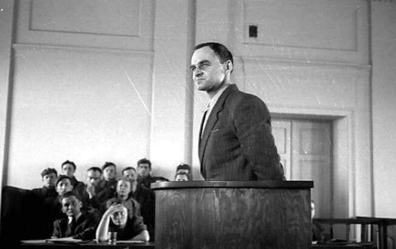

### 1948

Przed Rejonowym Sądem Wojskowym w Warszawie rozpoczął się proces rotmistrza Witolda Pileckiego i jego towarzyszy: Marii Szelągowskiej, Tadeusza Płużańskiego, Szymona Jamontta-Krzywickiego, Maksymiliana Kauckiego, Jerzego Nowakowskiego, Witolda Różyckiego i Makarego Sieradzkiego. Rotmistrz Pilecki został oskarżony o nielegalne przekroczenie granicy, posługiwanie się fałszywymi dokumentami, brak rejestracji w Rejonowej Komendzie Uzupełnień, nielegalne posiadanie broni palnej, prowadzenie działalności szpiegowskiej na rzecz generała Władysława Andersa oraz przygotowywanie zamachu na grupę dygnitarzy Ministerstwa Bezpieczeństwa Publicznego.

  

---

<a href="https://github.com/TomaszWaszczyk/historia.waszczyk.com/edit/master/src/content/march-3.md" target="_blank">Edytuj tę stronę dzieląc się własnymi notatkami!</a>
