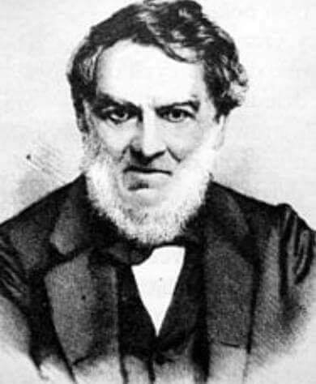

### 2022

Just to put things into perspective: The last time inflation was 7.3% in Germany – in Nov 1981 – the Bundesbank key interest rate was 11.4%. Today, ECB's main rate remains pegged at 0%.

  

  

### 2022

Kurs rubel-euro wrócił do stanu z 23 lutego. To tyle na temat wpływu obecnych sankcji na rosyjską gospodarkę.

  

### 2021

No i stało się, obligacje amerykańskie "płacą" więcej niż polskie. Ten wykres absolutnie nie służy prognozowaniu USDPLN. Czy ma to sens? czy to banki centralne drukując pieniądze (sarkazm) psują rynki? Czy Polska stała się nową bezpieczną przystanią? To zostawię bez odpowiedzi, ale trzeba pamiętać, że "rynek ma zawsze rację" i warto spojrzeć szerzej na obecną sytuację.

  

### 2020

## Egypt's banks told to limit withdrawals and deposits

CAIRO (Reuters) - Egyptian banks have been instructed to apply temporary limits on daily withdrawals and deposits in a move seemingly designed to control inflation and hoarding during the coronavirus’ spread.

The daily limit for individuals would be 10,000 Egyptian pounds ($635) and 50,000 pounds for companies, a central bank statement said, though businesses will be exempt from the withdrawal limits if the money is used to pay employees.

The central bank has also limited daily ATM withdrawals and deposits to 5,000 pounds, it said in a statement.

---

  

---

  

---

## SAMOBÓJSTWO NIEMIECKIEGO MINISTRA FINANSÓW

Jak czytamy w informacjach podanych przez Forbes, ciało 54-letniego Thomasa Schaefera zostało znalezione w sobotę w pobliżu torów kolejowych w miejscowości Hochheim niedaleko Frankfurtu nad Menem. Prokuratura skłania się do hipotezy o samobójstwie.
Schaefer, członek chadeckiej partii CDU, odpowiadał od 10 lat za finanse kraju związkowego Hesja, w którym położony jest Frankfurt - centrum finansowe Niemiec oraz siedziba Europejskiego Banku Centralnego i wielu niemieckich banków. Był żonaty i miał dwoje dzieci.
Schaefer pracował „dzień i noc”, aby pomóc przedsiębiorstwom i zatrudnionym przystosować się do skutków ekonomicznych pandemii koronawirusa - powiedział Bouffier w niedzielę.
Według niego Schaefer martwił się, czy „uda się spełnić ogromne oczekiwania społeczeństwa, zwłaszcza dotyczące pomocy finansowej”. - Muszę założyć, że te obawy go przytłoczyły. Najwyraźniej nie umiał znaleźć wyjścia. Był w rozpaczy - dodał.
W Niemczech wykryto dotąd ponad 52,5 tys. przypadków zakażenia koronawirusem, a 389 osób zmarło - wynika z najnowszych oficjalnych danych, podanych w niedzielę przez Instytut im. Roberta Kocha (RKI) w Berlinie.

---

### 1981

"Użycie sił porządkowych dla usunięcia przedstawicieli Solidarności z budynku Urzędu Wojewódzkiego w Bydgoszczy było działaniem sprzecznym z przyjętymi dotąd i przestrzeganymi zasadami rozwiązywania konfliktów społecznych środkami politycznymi, przede wszystkim drogą negocjacji".
Powyższy tekst to fragment oświadczenia władz PRL odnoszące się wydarzeń, które miały miejsce na posiedzeniu Wojewódzkiej Rady Narodowej w Bydgoszczy 19 marca 1981 roku.
Oświadczenie to, które w telewizji miał odczytać Andrzej Gwiazda zostało opracowane 30 marca 1981 roku w Warszawie podczas wspólnych rozmów przedstawicieli NSZZ Solidarność oraz władz PRL. Tego dnia obie strony podpisały również porozumienie w sprawie przyspieszenia prac nad ustawą o związkach zawodowych oraz prawie rolników do zrzeszania się. Za tymi deklaracjami nie poszły żadne konkrety.

  

### 1970

W Warszawie rozpoczęto operację obracania Pałacu Lubomirskich. W tym celu budowla została odcięta od fundamentów, a następnie, po specjalnych kratownicach i szynach przesunięta na wyznaczone miejsce. Operację, której efektem było przesunięcie pałacu o 74° zakończono 18 maja 1970 roku. Nadzór nad operacją prowadził inżynier Aleksander Mostowski.

  

### 1953

W poznańskim więzieniu wykonany został wyrok śmierci na 23 -letnim Zygmuncie Góralskim ps "Chmura" ( zdjęcie) członku działającej na terenie Wągrowca i Chodieży organizacji antykomunistycznej Pierwszy Pluton Szturmowy Armii Krajowej Ziemi Wielkopolskiej.
Zygmunt Góralski pochodził ze Żnina. Jako 19-latek został przyjęty do pracy w Powiatowym Urzędzie Bezpieczeństwa w Żninie. Od 1 kwietnia 1949 roku pracował jako strażnik w wągrowieckim więzieniu. W czerwcu 1950 roku zorganizował ucieczkę z tamtejszego więzienia dwóch skazanych za posiadanie broni i znieważenie portretu Stalina. Do organizacji antykomunistycznej przystąpił w jeszcze jako pracownik bezpieki w maju 1950 roku za namową dowódcy Pierwszego Plutonu Szturmowego Armii Krajowej Ziemi Wielkopolskiej Zygmunta Biskupa. Razem z uciekinierami, w okresie od października 1950 roku do maja 1951 roku ukrywał się leśnej ziemiance. Jedzenie dostarczali mu ojciec i brat. Wpadł w wyniku ubeckiej obławy 19 maja 1952 roku. 18 października 1952 roku Wojskowy Sąd Rejonowy w Poznaniu Skazał go na karę śmierci.

  

### 1948

Wojewódzki Sąd Rejonowy w Lublinie skazał na trzykrotną karę śmierci Jana Grudzińskiego ps "Płomień" (grafika) uczestnika wojny obronnej, żołnierza Armii Krajowej Rejonu IV Kąkolewnica Obwodu Radzyń Podlaski, ddowódcę grupy bojowej stowarzyszenia Wolność i Niezawisłość powiatu radzyńskiego.
Grudziński był organizatorem wielu akcji skierowanych przeciwko organom i funkcjonariuszom Urzędu Bezpieczeństwa Publicznego. Aresztowany został w lipcu 1947 roku po ujawnieniu się, czego dokonał na skutek ogłoszonej przez komunistów amnestii. Rozstrzelany został 7 czerwca 1948 roku w podziemiach lubelskiego zamku. Miał 33 lata.

  

### 1945

Wojska sowieckie i polskie, wchodzące w skład 2. Frontu Białoruskiego, po czterech dniach zaciętych walk weszły do Gdańska. Broniące się jeszcze oddziały niemieckie zostały wypchnięte w stronę Wisły. W walce zginęło 10 tysięcy żołnierzy niemieckich. W ręce Rosjan dostało się 140 czołgów i samobieżnych dział, 358 dział polowych, 45 okrętów podwodnych (niesprawnych) i wiele innego rodzaju wojennych zdobyczy.
Zdobycie miasta okazało się jednak prawdziwą gehenną dla jego mieszkańców, na których w wielu przypadkach dopuszczano się gwałtów i morderstw.
Jeszcze tego samego dnia wydany został dekret, na mocy którego utworzone zostało województwo gdańskie.
Na zdjęciu zniszczony Kościół Mariacki w Gdańsku.

  

### 1973

Po 22 latach zakończono w Fabryce Samochodów Osobowych produkcję samochodu FSO-Warszawa. Auto to, produkowane na licencji radzieckiej Pobiedy M20 Gaz osiągnęło liczbę ponad ćwierć miliona egzemplarzy. Następcą FSO Warszawa został Fiat 125p.

  

### 1910

https://pl.wikipedia.org/wiki/Stanis%C5%82aw_Sojczy%C5%84ski

https://pl.wikipedia.org/wiki/J%C3%B3zef_Marcinkiewicz_(matematyk)

### 1888

W Londynie zmarł Jan Józef Baranowski - polski wynalazca, ekonomista, finansista, poliglota i powstaniec listopadowy 1830–31.
Po upadku powstania przebywał na emigracji we Francji i (od 1872) w Wielkiej Brytanii. Był wynalazcą takich urządzeń jak: gazomierz, maszyna do głosowania i obbraliczania głosów oddanych w wyborach, maszyna księgowa służąca do kontroli rachunków, kasownik do biletów i semafor, czyli automatyczny system sygnalizacji kolejowej.

  

### 1867

Rosja sprzedała Stanom Zjednoczonym Alaskę za 7,2 mln dolarów (równowartość dzisiejszych 108 mln dolarów).

153 lat temu, 30 marca 1867 roku, Rosja sprzedała Stanom Zjednoczonym Alaskę. Amerykanie zapłacili za nią 7 milionów 200 tysięcy dolarów, czyli równowartość dzisiejszych 108 milionów. To był najgorszy interes w historii Rosji, bo jak się potem okazało, sprzedane terytorium o powierzchni ponad 1,5 mln km² kryło między innymi złoża ropy, gazu i złota. Jednak ani sprzedający, ani kupujący nie zdawali sobie wtedy z tego sprawy.

Rosjanie dotarli na Alaskę około 120 lat wcześniej, ale od początku nie wiedzieli jak zagospodarować te tereny. Walki o ziemię z plemionami indiańskimi były na porządku dziennym, liczba stałych osadników nigdy nie przekroczyła 400, a założona tam kolonia przynosiła państwu więcej strat niż korzyści.

Prawdopodobne było też to, że władze Stanów Zjednoczonych, dążąc do podporządkowania sobie całej Ameryki Północnej, sięgną po rosyjskie tereny same, a Petersburg nie będzie mógł ich bronić.

Umowę dotyczącą sprzedaży Alaski negocjowali: sekretarz stanu w rządzie USA – William H. Seward i działający w imieniu cara Aleksandra II na rzecz Rosjan - baron Eduard de Stoeckl. Została podpisana w nocy z 29 na 30 marca 1867 roku i początkowo była powszechnie krytykowana w obu krajach. W Rosji dlatego, że władze pozbyły się tak dużej części imperium, w USA ponieważ rząd kupił bezwartościowe, jak wówczas sądzono tereny.

Oficjalne przekazanie Alaski Amerykanom odbyło się 18 października 1867 roku, ale dopiero niemal sto lat później – w 1959 roku została formalnie uznana za 49. stan USA. Dziś ma największą spośród nich powierzchnię, a znajdujące się tam złoża ropy naftowej należą do największych za świecie. W regionie wydobywane są także: gaz ziemny, złoto, platyna, ruda miedzi, cyny, niklu i uranu.

  

### 1853

We lwowskiej aptece " Pod Złotą Gwiazdą" zapłonęła pierwsza na świecie lampa naftowa skonstruowana przez polskiego chemika, farmaceutę i przedsiębiorcę Ignacego Łukasiewicza. Powstała ona w wyniku prac nad destylacją ropy naftowej i miała znaczący wpływ na rozwój przemysłu naftowego na całym świecie.
Lampa naftowa była kilkakrotnie bardziej
od zwykłych świec, a tańsza w
eksploatacji od olejów i oświetlenia
gazowego . Warto dodać, że Łukasiewicz jest także wynalazcą równie rewolucyjnego wynalazku,jakim jest asfalt.

  

---

<a href="https://github.com/TomaszWaszczyk/historia.waszczyk.com/edit/master/src/content/march-30.md" target="_blank">Edytuj tę stronę dzieląc się własnymi notatkami!</a>
