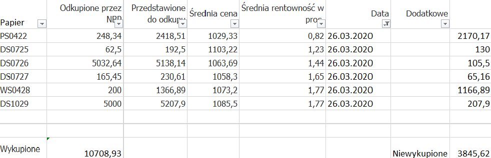
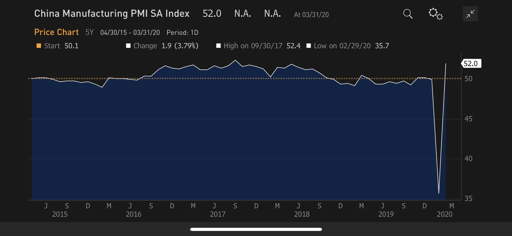
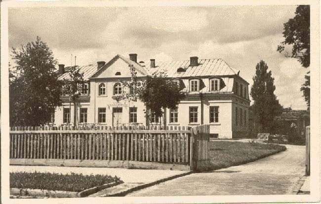
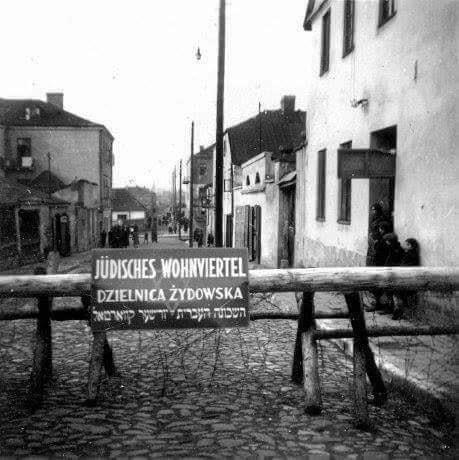
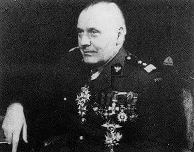

### 2020

Jak już wiemy NBP w ubiegły czwartek odkupił za 10 mld DS0726 i DS1029, czyli równowartość jaka została tego dnia sprzedana przez MF w private placement. Pozostałe przedstawione przez rynek do odkupu 3,8 mld było odrzucone.

  

Sęk w tym, że rynek chciał odsprzedać NBP 3,8 mld obligacji, a NBP wybrał na aukcji tylko to co tego samego dnia sprzedało MF, czyli de facto NBP monetyzuje dług zamiast wspomagać sektor. Trochę nie o to miało chodzić w skupie. NBP stosuje obejście, aby de facto finansować dług publiczny, co bezpośrednio jest prawnie zabronione. Każdy to widzi, ale Glapiński będzie udawał głupiego na konferencji, że wszystko jest ok.

Sytuacja jest analogiczna w znacznej (każdym?) części świata zachodniego, dlatego prawdziwe problemy gospodarcze pojawią się kiedy lokalne banki centralne nie będą już w stanie finansować długu państw. Pytaniem obecnie jest nie "czy" a "kiedy" nastąpi "kryzys zadłużenia państw", w praktyce państwa zaczną bankrutować, poszczególne sektory publiczne zostaną zamrożone, możliwe, że rząd w próbie desperacji będzie chciał/musiał wprowadzić tymczasową reglamentację najpotrzebniejszych dóbr (vide współpraca public - private Amazona w USA).

Pamiętajmy, że najważniejsze jest to co zrobi FED (do roku powinna nastąpić obniżka stóp procentowych na negatywne) a następnie wprowadzenie `digital dollar` (obecnie nie poważnym jest mówienie o konkretnych datach) co prawdopodobnie będzie mieć obecnie nie do przewidzenia skutki. Jednak możemy się spodziewać, że lokalne banki centralne stracą na znaczeniu, a w horyzoncie średnioterminowym zostaną zmarginalizowane.

---

The result of COVID-19 is the end of democrasy in Hungary.

Then Israel, meanwhile Poland.

---

#### China is going to overflow European markets

  

### 1945

W siedzibie Urzędu Bezpieczeństwa Publicznego w Hrubieszowie miał miejsce zamach na życie kierownika tej placówki Jacentego Feliksa Grodka. Poprzedził go splot wydarzeń, które miały swój początek w nocy z 2 na 3 marca 1945 roku, kiedy funkcjonariusze bezpieki zlikwidowali sześciu mieszkańców Hrubieszowa. Był to odwet UB za udaną akcję eliminacji przez podziemie antykomunistyczne ubeka Józefa Chmarzyńskiego. Wspomniany Grodek wydał rozkaz zabicia w odwecie sześciu Hrubieszowian. Przebieg akcji likwidacji kierownika UB miał był bardzo spektakularny. Organizatorzy wykorzystali do tego celu 10- letniego chłopca, który nie budził żadnych podejrzeń. Chłopiec dostarczył Grodkowi butelkę alkoholu i koszyk z jedzeniem i kwiatami, który chwilę po wręczeniu eksplodował w jego rękach. Kierownik hrubieszowskiego UB zginął na miejscu.
Na zdjęciu siedziba hrubieszowskiego Powiatowego Urzędu Bezpieczeństwa Publicznego.

  

### 1941

Niemcy utworzyli w Kielcach getto żydowskie. Obejmowało ono rejon ulic; Orlej, Piotrkowskiej, Nowowarszawskiej, Pocieszki i Radomskiej. Na jego terenie znajdowało się około 1500 zabudowań zamieszkanych przez około 15 tysięcy ludzi.
Mieszkańcy getta podejmowali próby organizowania zbrojnych rebelii, ale z uwagi na brak jakiejkolwiek pomocy z zewnątrz z czasem tego zaprzestali.
Rozpoczęta 20 sierpnia 1942 roku likwidacja getta kosztowała życie około 12 tysięcy ludzi tylko w obrębie jego murów. Pozostałe około 10 tysięcy innych istnień zamordowano w obozach lub w czasie egzekucji na terenie Kielc.
Najgorszą sławą okryła się wykonana 23 maja 1943 roku egzekucja na 45 żydowskich dzieciach, z których najmłodsze miało 15 miesięcy, a najstarsze 15 lat.

  

### 1892

W Szczercu urodził się Stanisław Maczek- generał, dowódca 1 Dywizji Pancernej Wojska Polskiego. Swoje doświadczenia wojskowe zbierał już walcząc w czasie pierwszej wojny światowej na frocie rosyjskim i Po kapitulacji państw centralnych 11 listopada 1918 Maczek przedostał się do
Krosna, gdzie wstąpił do Wojska Polskiego.
Początkowo dowodził batalionem
krośnieńskim przeznaczonym do odsieczy
oblężonego Lwowa. W kwietniu 1919 r.
otrzymał przydział na dowódcę tzw. lotnej
kompanii w 4. Dywizji Piechoty, która
zasłużyła się w walkach m.in. o Drohobycz i
Stanisławów. Po ustaniu walk polsko-
ukraińskich Maczek, w stopniu majora, został
przeniesiony do zadań sztabowych.
W czasie wojny polsko-bolszewickiej z utworzonym na nowo batalionem walczył w obronie Lwowa.
W 1938 roku został dowódcą pierwszej polskiej jednostki zmotoryzowanej czyli 10 Brygady Kawalerii. Gen. Stanisław Maczek walczył także podczas
obrony Lwowa, jednak po wkroczeniu Armii
Czerwonej został zmuszony wraz z jednostką
do przekroczenia granicy Węgier, gdzie został
internowany.
Przez Węgry przedostał się do Francji, gdzie,
po awansie na generała brygady, częściowo
odtworzył swój pancerno-motorowy oddział - 10. Brygadę Kawalerii Pancernej, z którą u boku wojsk francuskich walczył później w Szampanii. Za udział w walkach we Francji otrzymał Krzyż Virtuti Militari IV klasy. Dowodzona przez niego dywizja brała wydatny udział w wyzwoleniu Francji Belgii i Holandii. W czasie wyzwalania tej pierwszej zasłynęła udziałem w słynnym lądowaniu aliantów w Normandii. W 1945 r. gen. Maczek został odznaczony Komandorią Krzyża Legii Honorowej, a później awansowany do stopnia generała dywizji; do demobilizacji dowodził polskimi oddziałami w Wielkiej Brytanii.
Po wojnie osiadł na stałe w Szkocji, a ponieważ nie przysługiwała mu emerytura, pracował m.in. jako barman. W 1946 r.
pozbawiony został obywatelstwa polskiego, które zostało mu przywrócone w 1971 r. W 1990 r. otrzymał awans do stopnia generała broni, a w 1992 r. został kawalerem orderu Orła Białego. Na wniosek mieszkańców Bredy nadano mu honorowe obywatelstwo Holandii. Stanisław Maczek zmarł 11 grudnia 1994 roku w Edynburgu. Został pochowany na cmentarzu
żołnierzy polskich w Bredzie.

  

---

<a href="https://github.com/TomaszWaszczyk/historia.waszczyk.com/edit/master/src/content/march-31.md" target="_blank">Edytuj tę stronę dzieląc się własnymi notatkami!</a>
